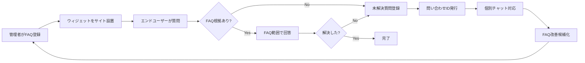
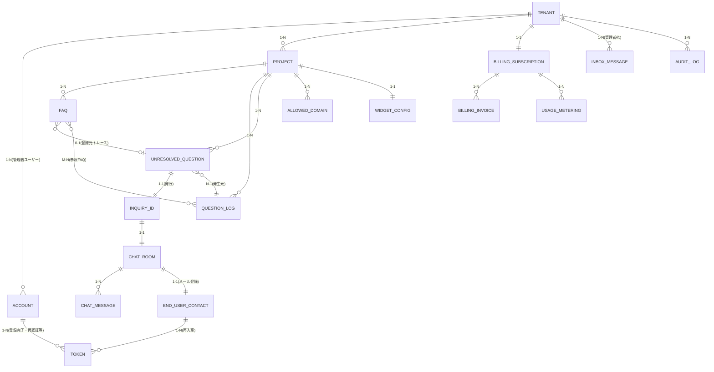

# FAQ AIウィジェット SaaS 要件定義書

| 項目 | 内容 |
|---|---|
| 文書種別 | 要件定義書 |
| 版 | v2.4 |
| 対象システム | FAQ AIウィジェット SaaS |
| サービス名 | open-faq |
| クラウド前提 | Cloudflare |
| アカウント管理 | 自前アカウント管理 |
| メール配信 | Resend |
| 作成日 | 2026-05-10 |
| 最終改訂日 | 2026-05-14 |

---

## 改訂履歴

| 版 | 日付 | 改訂内容 | 改訂者 |
|---|---|---|---|
| v1.0 | 2026-05-16 | 初版 | - |

---

## 1. はじめに

### 1.1 本書の目的

本書は、FAQ AIウィジェット SaaS(SaaS=クラウド経由で利用するソフトウェアサービス。以下、本サービス)の要件を定義する文書である。

本サービスを開発・運用するうえで「何を実現するか」を明確にし、後続の基本設計書・詳細設計書の入力資料となることを目的とする。

本書では、技術実装の細かい中身ではなく、**システムで実現すべきこと(WHAT)** を記述する。どの技術をどう使うか(HOW)は、基本設計書および詳細設計書で扱う。

### 1.2 本書の位置づけ

本書は、次の文書群の中で「要件定義」工程の成果物に位置する。

```text
┌─────────────────┐
│  要件定義書(本書) │  ← WHAT(何を実現するか)
└────────┬────────┘
         ↓
┌─────────────────┐
│  基本設計書       │  ← HOW(どう実現するかの全体像)
└────────┬────────┘
         ↓
┌─────────────────┐
│  詳細設計書       │  ← HOW(実装可能な粒度)
└─────────────────┘
```

### 1.3 想定読者

| 読者 | 期待する読み方 |
|---|---|
| プロダクトオーナー | スコープ・優先度の確認、合意形成 |
| 設計者(基本/詳細) | 設計の入力資料、トレース元 |
| 開発者 | 実装すべき要件の確認 |
| QA | 受入条件・テスト観点の確認 |
| 運用担当者 | 運用要件・データ保持要件の確認 |
| 法務/プライバシー担当 | プライバシー要件・規約要件の確認 |

### 1.4 用語と記法

- 「○○できること」は、機能として実装する要件を示す。
- 「○○すること」は、方針・原則・遵守事項を示す。
- 表中の優先度は P0(必須) / P1(高) / P2(中以下)を示す。
- 専門用語は、各章で初めて登場した箇所に丸括弧で短い補足を付す。詳細はカテゴリ別の **付録A 用語集**、50音順での索引は **付録C 用語集** に集約する。略語の一覧は **付録B 略語一覧** を参照する。

### 1.5 サブシステム構成

本サービスは次の 2 サブシステムから成る。

| サブシステム | 主な対象 | 要件定義書 |
|---|---|---|
| メインシステム | 管理者ユーザー向け管理画面、およびエンドユーザー向け FAQ ウィジェット | `01_main/01_requirements.md` |
| 顧客管理システム | サービス運営者(`service_operator`)向け運用コンソール | `02_admin/01_requirements.md` |

文書の同期・表記統一・検証に関する保守ルールは、リポジトリ直下の `CLAUDE.md` に置く。

### 1.6 本書のスコープ(MVP のみ)

本書は **MVP で実現する範囲のみ** を記載する。MVP 外の事項、検討候補、後続判断、未採用機能の説明は本文に置かない。

本書に残す情報と移送先は以下のとおりとする。

| 情報種別 | 本書での扱い | 正本 |
|---|---|---|
| 業務・機能・非機能の WHAT | MVP の要求事項、優先度、受入条件のみを記載 | 本書 |
| 方式・状態遷移・画面項目・外部連携方式 | 要件 ID から参照し、詳細な方式は本文に重複掲載しない | [02_basic_design.md](02_basic_design.md) |
| API / DDL / JSON Schema / Cron / Queue / 実装パラメータ | 要件本文には置かない | [03_detailed_design.md](03_detailed_design.md) |

---

## 2. 業務背景とサービス概要

### 2.1 業務背景

Webサイト運営者は、次のような課題を抱えている。

- 訪問者からの問い合わせ対応コストが増大している
- 回答する人によって品質がばらつく
- 夜間・休日には対応しきれない

これに対し、生成AI(文章を生成するAI)による自動応答は手軽に導入できる反面、社内に存在しない事実を「もっともらしく」回答してしまうリスクがある。これを **ハルシネーション**(AIが事実でない内容を、あたかも事実のように回答してしまう現象)と呼ぶ。誤情報の配信はサポート品質の低下と信頼喪失の原因となる。

本サービスは、この課題に対し「**公開済みFAQ(よくある質問とその回答)に記載された内容のみ**」を根拠にAIが回答する仕組みを提供することで、ハルシネーションを抑えながら問い合わせ自動化を実現する。

回答できなかった質問は、確実に人手による個別対応へ引き継ぎ、その内容を再度FAQに反映するループを回す。これにより、運用とともに自動回答率を高めることを狙う。

### 2.2 サービス概要

本サービスは、Webサイト運営者(管理者)が登録したFAQをもとに、サイト訪問者(エンドユーザー)からの問い合わせに自動応答するSaaSである。

| 観点 | 概要 |
|---|---|
| 提供形態 | クラウドサービス(SaaS) |
| 利用者 | Webサイト運営事業者、その従業員、Webサイト訪問者 |
| 提供価値 | FAQの自動応答、未解決問い合わせの集約と個別対応、FAQ改善ループ |
| 課金 | 従量課金制(利用量に応じて課金) |
| 設置形態 | 利用者サイトへのスクリプトタグ埋め込み(ウィジェット=Webページに埋め込む小さなUI部品) |

### 2.3 サービスの主要バリューチェーン



### 2.4 提供価値の差別化ポイント

| 差別化要素 | 内容 |
|---|---|
| ハルシネーション抑制 | 公開FAQ以外を根拠にしない設計を要件レベルで担保 |
| 未解決質問の確実な収集 | 回答不能を「失敗」ではなく「FAQ改善の入力」として活用 |
| 個別対応との連続性 | 問い合わせIDで個別チャットへスムーズに接続 |
| 運用と改善の循環 | 個別チャット内容をFAQへ昇格させる導線 |
| マルチプロジェクト | 1契約内で複数サイト/製品を並行管理 |

---

## 3. 用語定義

本書で繰り返し登場する主要用語の定義を以下に示す。本一覧の網羅版・カテゴリ別整理は **付録A 用語集**、50音順での索引は **付録C 用語集** に集約する。重複する場合は本表(§3)を正とする。

| 用語 | 定義 |
|---|---|
| オーナーアカウント(オーナー) | 本サービスを契約するアカウント。利用契約・課金・データ分離の単位を兼ねる。1 アカウント = 1 オーナー固定で、譲渡・降格・停止・削除はできない。配下に複数のプロジェクトを所有し、複数のメンバーアカウントを招待できる |
| メンバーアカウント(メンバー) | オーナーまたはメンバー権限「ユーザー管理」保持者から招待された利用者で、いずれか 1 つのオーナーに紐づく。メンバー権限フラグ 5 種と、プロジェクト割当の組み合わせで操作範囲が決まる |
| 利用者(オーナー / メンバー) | オーナーとメンバーの総称。本書で「管理者ユーザー」の語が残る箇所はすべて本概念を指す |
| メンバー権限フラグ | メンバーに個別付与する権限の単位。MVP では「FAQ管理」「個別チャット対応」「ユーザー管理」「プロジェクト設定」「ログ参照」の 5 種を提供する(§6.2 / §8.3 で正本定義) |
| オーナー専有機能 | メンバー権限フラグでは付与できず、オーナーのみが実行可能な機能。MVP では課金情報閲覧・変更、月次予算上限変更、支払方法更新、退会申請・解約、規約再同意の承諾を含む |
| メンバーのプロジェクト割当 | オーナーまたはメンバー権限「ユーザー管理」保持者がメンバーに対し、操作可能なプロジェクトを個別指定する仕組み。割当数 0(=未割当)もメンバーとして成立し、ダッシュボードと全社的権限フラグ機能だけを利用可能とする |
| オーナー契約状態 | オーナーアカウントの契約上の状態。「利用中 / サスペンション中 / 解約手続き中 / 解約完了」の 4 区分。実装値は基本設計を正本とする |
| プロジェクト | オーナー配下で FAQ・ウィジェット・ログを分けて管理する単位(例: 製品別、サイト別)。1 オーナーは複数プロジェクトを所有できる |
| エンドユーザー | 管理者のWebサイトを訪問し、ウィジェットで質問する利用者 |
| サービス運営者 | 本SaaSを提供する側の運用担当者 |
| メインシステム | 本サービスのうち、管理者ユーザー向け管理画面およびエンドユーザー向け FAQ ウィジェットを提供するサブシステム。本書(`01_main/01_requirements.md`)が要件定義の正本である |
| 顧客管理システム | 本サービスのうち、サービス運営者(`service_operator`)向けの運用コンソールを提供するサブシステム。要件定義の正本は別書(`02_admin/01_requirements.md`) |
| 問い合わせID | 未解決質問ごとに発行される識別子。個別チャット部屋とエンドユーザー再入室に利用する |
| 未解決質問 | FAQで回答できなかった、またはユーザーが解決できなかった質問の記録 |
| FAQ候補 | 未解決質問のうち、管理者がFAQ化を検討する対象としてマークしたもの |
| 個別チャット部屋 | 問い合わせID単位で作成される対話空間。エンドユーザーと管理者ユーザーがやり取りする |
| ウィジェット | 管理者サイトに埋め込むJavaScriptで動作するUI |
| 質問ログ | エンドユーザーからの質問とその回答結果を記録したもの |
| 参照FAQ | AI回答が引用した公開中FAQ |
| 信頼度 | AI回答における回答可否判定のスコア |
| 再入室 | エンドユーザーが過去の問い合わせID付きチャットに再度アクセスすること |
| 監査ログ | 重要操作の履歴。改ざん検知可能な形で保持する |
| バウンス | 送信メールが宛先に届かなかったこと |
| 苦情 | 受信者が当該メールをスパムと報告したこと |
| サプレス | 通知停止状態。再送信を行わない |
| 状況(未解決質問の状況) | 未解決質問について、利用者向けに 1 つにまとめた表示用ステータス(=画面に出すための状態区分)。値は「未解決 / 対応中 / 解決済み / 終了」の4種類。内部の案件状態と個別チャットの管理者ユーザー返信有無から派生する読み取り専用の値であり、SCR-011 一覧などで利用者がひと目で確認できるようにするためのもの |
| 対応不要終了 | 管理者ユーザーが、当該未解決質問にこれ以上対応する必要がないと判断したときに、明示的に「終了」状態へ変更する操作。任意で理由を記録できる。自動では行われない |
| ユーザー種別 | アカウントが本サービス上で持つ立場の区分。`admin`(利用者(オーナー / メンバー)=オーナーまたはメンバー)、`end_user`(エンドユーザー)、`service_operator`(サービス運営者)の3種類。本サービスの認可(=操作の可否判定)は、オーナー境界(オーナー配下に閉じる範囲)・プロジェクト境界(メンバー割当)・メンバー権限フラグ・ユーザー種別の組み合わせで適用する |
| お知らせ | 管理者宛にアプリ内で配信される通知。「請求確定」「運営お知らせ」「システム通知」の3種別を持つ。既存のメール通知と並行して、管理画面内のお知らせ受信箱で閲覧できる |
| お知らせ受信箱(Inbox) | 管理者ごとのお知らせコレクション(=お知らせの集まり)。一覧画面(SCR-021)と詳細画面(SCR-022)から閲覧する |
| お知らせ種別 | 「請求確定」「運営お知らせ」「システム通知」の 3 区分 |
| お知らせ重要度 | 「低」「通常」「重要」「最重要」の 4 段階。一覧の表示順とバッジ強調に反映する。「最重要」は規約改定・重大セキュリティ通知・サスペンション確定など、管理者全員への強制メール通知が必要な場合に限定する |
| お知らせ既読状態 | 「未読」または「既読」の 2 値。一度既読にしたお知らせを未読に戻す操作は提供しない |
| 物理削除 | データを記憶領域から完全に削除し、参照不能とする処理。原則としてメインシステム・顧客管理システムの双方から復元できない |
| 論理削除 | データに削除フラグや削除日時を付与して非表示化する処理。物理削除前の猶予期間中、顧客管理システムからは閲覧・復元できる場合がある(顧客管理システムの権限・対象種別に従う) |
| オーナー契約状態(再掲) | オーナーアカウントの契約上の状態。「利用中」「サスペンション中」「解約手続き中」「解約完了」の 4 区分(§9.10 サスペンションフロー 参照)。実装値は基本設計を正本とする |
| サスペンション | オーナーアカウントが課金未納等の事由により機能制限される状態。オーナー・配下メンバーのログインと請求情報更新は可能だが、ウィジェット応答・新規 FAQ 登録・新規質問受付は停止する(§9.10 サスペンションフロー 参照) |
| 案件「終了」 | 未解決質問の管理者ユーザーによる明示的な終了操作の結果として記録される状態(FR-079)。データ自体は保持され、削除や復元の対象ではない |

**未解決質問の終了プロセス 2 概念の関係**: §8.7 関連で登場する 2 つの「終了」関連概念を以下に整理する(状態遷移と操作ロールの正本は §8.7.1 および基本設計書 §4.3)。

| 概念 | 種別 | 操作主体 | 結果 |
|---|---|---|---|
| 対応不要終了 | UI 操作の総称(管理者ユーザー向け) | 管理者ユーザー | 案件「終了」確定操作のラベル名 |
| 案件「終了」 | 業務上の状態 | (システム) | 確定状態。利用者向け表示は「終了」 |

**読み方**: 管理者ユーザーが UI で目にするのは「対応不要終了」ボタンのみである。承認待ち終了・承認・却下の業務フローは提供しない。状態遷移の詳細は §8.7.1 を参照。

| 用語 | 定義 |
|---|---|
| 削除データ復元 | 顧客管理システムから、論理削除済みかつ猶予期間内のデータについて復元操作を行うこと。メインシステムでは提供しない(顧客管理システム §9.9 参照) |

---

## 4. ステークホルダー

| ステークホルダー | 関心事 | 主な関与 |
|---|---|---|
| プロダクトオーナー | サービス価値の最大化、開発投資対効果 | 要件決定、優先度判断 |
| 管理者ユーザー(顧客) | 問い合わせ対応の自動化、運用負荷低減、個別対応の効率化 | サービス利用、フィードバック |
| エンドユーザー | 疑問の早期解決、個別問い合わせの容易さ | サービス利用(間接) |
| サービス運営者 | 安定稼働、不正利用対策、法令遵守 | 運用、監視、保守 |
| 開発者 | 要件の明確さ、実装容易性 | 設計・実装 |
| QA | 検証可能性、受入条件の明確さ | テスト計画・実施 |
| 法務/プライバシー担当 | 規約・プライバシー法令への適合 | 規約整備、対応方針策定 |
| 経営層 | 売上、コスト、リスク | 経営判断 |

---

## 5. システム化の方針

### 5.1 基本方針

本サービスの設計・運用にあたり、次の方針を上位の前提として置く。各方針は、後続の機能要件・非機能要件で具体化する。

| 方針 | 内容 |
|---|---|
| FAQ根拠限定 | AI回答は登録済みかつ公開中のFAQに限定する |
| 推測回答禁止 | FAQにない手順、仕様、価格、期間、原因、対処方法をAIが独自に作成しない |
| 言い換えの範囲明示 | AIはFAQの内容を要約・言い換え・整理できるが、新しい事実・数値・固有名詞・手順を追加しない |
| 未解決の蓄積 | FAQで回答できなかった質問はFAQ改善につなげる |
| 個別対応への接続 | 未解決時は問い合わせID付きの個別チャットへ誘導する |
| 再入室 | 問い合わせIDまたは通知メールから同じチャット部屋へ入れるようにする |
| 管理者確認 | 未解決質問からFAQ登録する場合も、管理者の確認・編集を必須とする |
| エラー分離 | FAQデータ不足とシステム処理エラーを別扱いにする |
| オーナー境界によるデータ分離 | 他契約(=他の契約組織)のデータが論理的にも物理的にも分離されるようにする |
| 最小権限 | 利用者には必要な範囲のみアクセスを許可する(=権限を最小限に絞る原則) |
| プロンプト注入耐性 | エンドユーザーの入力でAIの動作方針が変更されないようにする(プロンプト注入=AIの指示を上書きしようとする入力) |
| 個人情報最小化 | エンドユーザーから取得する個人情報は問い合わせ対応に必要な範囲に限定 |
| プライバシーバイデザイン | 設計初期段階からプライバシー保護を組み込む |
| アクセシビリティ配慮 | エンドユーザー向けUIはアクセシビリティ要件(=高齢者・障害のある利用者にも配慮した利用しやすさの基準)を満たす |
| 国際化対応素地 | 初期版は日本語のみとし、文字コード・日時表示・ロケール処理の実装最低水準は NFR-1101〜1103 を正本とする |
| SaaS運用 | 課金、利用量、データ保持、監査、障害対応を考慮する |

### 5.2 対象範囲

| 対象 | 内容 |
|---|---|
| 管理画面 | アカウント、オーナー / メンバー、管理者ユーザー、プロジェクト、FAQ、ウィジェット、質問ログ、未解決質問、個別チャット、課金、設定を管理する |
| 公開ウィジェット | Webサイト訪問者が質問し、FAQに基づくAI回答または個別チャット誘導を受ける |
| 個別チャット部屋 | 問い合わせID単位で、訪問者と管理者ユーザーがやり取りする |
| FAQ改善機能 | 未解決質問からFAQ候補を確認し、FAQ登録できる |
| 通知機能 | チャット投稿や重要な状態変更をメールで通知する |
| 運用機能 | ログ確認、障害対応、データ保持、退会処理、データエクスポート/削除に対応する |

### 5.3 MVP の安全境界

本サービスは FAQ 根拠限定回答を実現するため、AI が FAQ にない内容を推測回答しないこと、AI が管理者承認なしに FAQ を公開しないことを安全境界として扱う。具体要件は FR-051 / FR-104 に記載する。

---

## 6. 利用者と権限

本サービスは、立場の異なる利用者を想定する。「認可範囲(=操作してよい対象の範囲)」は、オーナー境界(=オーナー配下に閉じる範囲)・メンバー権限フラグ・メンバーのプロジェクト割当・ユーザー種別の組み合わせで決定する。利用者(オーナー / メンバー)は「オーナー(1 アカウント = 1 契約単位、全機能恒久保持)」と「メンバー(0 名以上、オーナーに紐づき、権限フラグとプロジェクト割当で操作範囲を制御)」の 2 区分から成り、有人のチャット対応は「個別チャット対応」権限を付与された利用者(オーナー / メンバー)が実施する。

### 6.1 利用者種別

| 利用者 | 説明 | 主な操作 | 認可範囲 |
|---|---|---|---|
| オーナー(オーナーアカウント) | 本サービスを契約する利用者で、1 アカウント = 1 契約単位 | 自分が所有する全プロジェクト・全機能、個別チャット確認・返信、状態更新、未解決質問閲覧、メンバー管理、課金情報操作、退会申請、規約再同意の承諾 | 自分が所有する全データ。停止・削除・降格・譲渡の対象とはならない |
| メンバー(メンバーアカウント) | オーナーまたは「ユーザー管理」権限保持者から招待された利用者で、いずれか 1 つのオーナーに紐づく | 付与されたメンバー権限フラグ(§6.2 / §8.3 参照)と、割当されたプロジェクトの組み合わせで許可された操作。ダッシュボード(自分の通知・お知らせ受信箱)は権限・割当不問で利用可 | 紐づくオーナーの範囲内、かつ割当されたプロジェクトに限定される |
| エンドユーザー | 管理者のWebサイト訪問者 | 質問入力、回答確認、解決可否回答、メール登録、個別チャット利用 | 自分の問い合わせIDに紐づくチャットのみ |
| サービス運営者 | 本SaaS提供者 | 障害対応、不正利用対応、課金確認、監査対応 | 運用に必要な範囲。オーナー配下データの中身は原則閲覧しない |

### 6.2 権限マトリクス概要

凡例: 「○」= 常時可、「△」= 緊急時のみ可(§6.2.1 緊急区分の客観条件を満たし、かつ §6.2.2 発動条件 4 項目を満たした場合のみ実行可能)、「×」= 不可、「自分のみ」= 自分の問い合わせ ID 範囲内に限り常時可。オーナーは常に全列が「○」相当(オーナー専有機能を含む)。メンバー列はメンバー権限フラグ別に区分し、加えて操作対象がメンバーの割当プロジェクトに含まれている必要がある(プロジェクト境界、§6.2.3 で定義)。

| 操作分類 | オーナー | FAQ管理 | 個別チャット対応 | ユーザー管理 | プロジェクト設定 | ログ参照 | エンドユーザー | 運営者 |
|---|:---:|:---:|:---:|:---:|:---:|:---:|:---:|:---:|
| ダッシュボード(自分の通知・お知らせ受信箱) | ○ | ○ | ○ | ○ | ○ | ○ | × | × |
| FAQ登録・編集・公開 | ○ | ○ | × | × | × | × | × | △(運営者復元時のみ。顧客管理 FR-200〜211) |
| FAQ AI 下書き生成(SCR-012 から呼出) | ○ | ○ | × | × | × | × | × | × |
| プロジェクト管理 | ○ | × | × | × | ○ | × | × | △(運営者復元時のみ) |
| メンバー招待・権限変更・停止・削除 | ○ | × | × | ○ | × | × | × | × |
| 未解決質問閲覧 | ○ | × | ○ | × | × | ○ | × | △(障害調査時のみ) |
| 個別チャット返信 | ○ | × | ○ | × | × | × | 自分のみ | × |
| 個別チャット閲覧 | ○ | × | ○ | × | × | ○ | 自分のみ | △(障害調査時のみ。閲覧履歴は監査ログ必須記録) |
| 質問ログ閲覧 | ○ | × | × | × | × | ○ | × | × |
| 監査ログ閲覧(自オーナー配下) | ○ | × | × | × | × | ○ | × | ○(全オーナー横断) |
| 課金情報閲覧・変更 / 月次予算上限変更 / 支払方法更新 | ○(オーナー専有) | × | × | × | × | × | × | △(訂正請求・サポート対応時のみ。課金プロバイダ側での訂正請求書発行は運営者操作。発行方式は詳細設計参照) |
| 退会申請・解約 | ○(オーナー専有) | × | × | × | × | × | × | × |
| 規約再同意の承諾 | ○(オーナー専有) | × | × | × | × | × | × | × |
| データエクスポート | ○ | × | × | × | × | ○ | × | × |
| オーナーアカウント無効化(サスペンション) | × | × | × | × | × | × | × | ○(顧客管理 FR-224、§9.10) |
| オーナー配下データ物理削除 | × | × | × | × | × | × | × | ○(退会後の自動バッチ) |
| プロンプトテンプレート編集(FR-342) | × | × | × | × | × | × | × | ○(運営者のみ) |

#### 6.2.0 メンバー権限フラグの定義と適用範囲(WHAT)

メンバーに付与可能なメンバー権限フラグは MVP では 5 種固定で、ロール(プリセット)概念は持たない。各フラグの責務は次のとおりとし、組み合わせ自由とする。

| メンバー権限フラグ | 表示名 | 含まれる主な操作 |
|---|---|---|
| FAQ管理 | FAQ管理 | FAQ の登録・編集・削除・公開、FAQ AI 下書き生成、FAQ インポート(FR-040〜046、FR-104、FR-310 等) |
| 個別チャット対応 | 個別チャット対応 | 未解決質問の閲覧・対応状態更新・担当割当、個別チャット返信、対応不要終了(FR-070〜079、FR-086 等) |
| ユーザー管理 | ユーザー管理 | メンバーの招待・権限フラグ変更・停止・削除、招待再送・取消(FR-015〜021 系列) |
| プロジェクト設定 | プロジェクト設定 | プロジェクトの作成・編集・削除、ウィジェット設定、許可ドメイン設定(FR-030〜035、FR-150 等) |
| ログ参照 | ログ参照 | 質問ログ閲覧、自オーナー配下の監査ログ閲覧、未解決質問・個別チャット内容の閲覧(返信権はない)(FR-070、NFR-602 系列) |

オーナー専有機能(課金情報の操作、退会申請、規約再同意の承諾)はメンバー権限フラグでは付与できない。オーナーは常に全権限フラグ相当の操作とオーナー専有機能を実行可能で、権限フラグの編集対象外とする。利用者(オーナー / メンバー)は権限フラグの保有有無に関わらずダッシュボード(自分の通知・お知らせ受信箱)を利用できる。§6.2.1 の「△ 緊急時のみ可」操作はメンバー権限フラグでは付与できず、運営者専有とする。

#### 6.2.0a プロジェクト境界(WHAT)

メンバーの操作可否は、メンバー権限フラグに加え、当該メンバーの「プロジェクト割当」によっても制限される。

| 利用者 | プロジェクト境界 |
|---|---|
| オーナー | オーナー配下の全プロジェクトに無条件アクセス可。プロジェクト割当行は持たない |
| メンバー | 招待時または編集時に指定された対象プロジェクトのみアクセス可。割当 0 の状態(=未割当メンバー)も成立し、その場合はダッシュボードと、プロジェクトに依存しない全社的機能(例:「ユーザー管理」「ログ参照」のうち全社統計)のみ利用可。FAQ・未解決質問・個別チャットのようにプロジェクトに帰属するデータは閲覧・操作不可 |

オーナーまたはメンバー権限「ユーザー管理」保持者は、メンバーの割当プロジェクトを後から追加・削除できる(§8.3 FR-018c)。割当のないプロジェクトには、URL 直アクセスでも到達不可とする(§19 AC-018i)。

#### 6.2.1 緊急区分の客観条件(WHAT)

**本節 §6.2.1(緊急区分の客観条件)および §6.2.2(発動条件)は両書(メイン / 顧客管理)横断の正本である。全設計書本文は本節を参照することとし、各書で意味の再定義を行わない。** 顧客管理側からは観測点(SCR-093 / SCR-096)・検知ソースの補足のみ追記する形で参照する。

「△ 緊急時のみ可」操作で「緊急」とみなす状況を、以下の客観条件で定義する。**主観的表現(「重大障害時」「承認者全員ロックアウト」等)は単独では使用せず、必ず本表の条件を直接または間接に参照する**。区分番号は本リファクタで以下のとおり付与する: 区分1=重大障害、区分2=全員ロックアウト、区分3=セキュリティインシデント、区分4=法令対応即応。

| 緊急区分 | 客観条件 | 基本設計で扱う観測点 |
|---|---|---|
| 重大障害 | 本番サービス停止が **連続 5 分以上**(NFR-201 SLO 違反検知)、または運営者が重大停止として確認した場合。詳細定義は §10.2 末尾「重大障害の定義」参照 | ヘルスチェック、SLO 監視、障害告知 |
| 全員ロックアウト | 該当契約の全管理者ユーザーがログイン不能、または承認権限のある運営者 2 名以上が同時に通常承認フローを実行不能 | ロックアウト集約、サポート受付、承認者可用性 |
| セキュリティインシデント | 不正アクセス、監査ログ完全性検証失敗、鍵漏洩疑義など、本サービスの機密性・完全性に重大な疑義がある場合 | セキュリティ監視、監査ログ完全性検証、運営者通報 |

#### 6.2.2 「△ 緊急時のみ可」の発動条件

§6.2.1 の緊急区分のいずれかに該当する状況下で、すべての「△」操作は以下の発動条件 4 項目を満たした場合のみ実行可能とする(基本設計書および顧客管理 FR-225 で具体化):

1. サポートチケット ID または対応チケット ID を操作理由として記録すること
2. **運営者 2 名の承認**を必要とし、自己承認を禁止すること
3. 対象管理者ユーザーへ管理画面内通知およびメールで速やかに通知すること(NFR-317 / 顧客管理 FR-211 と整合。通知種別・カテゴリの具体値は基本設計参照)
4. 操作内容を監査ログに必ず記録すること(具体的な記録項目・コード体系は基本設計 / 詳細設計参照)

権限マトリクス(=操作と利用者の対応表)の詳細は基本設計書・詳細設計書で定義する。

---

## 7. 業務要件

### 7.1 業務要件一覧

| ID | 要件 | 優先度 |
|---|---|:---:|
| BR-001 | 管理者は自社サイト向けのFAQを管理できること | P0 |
| BR-002 | 管理者はウィジェットを自社サイトに設置できること | P0 |
| BR-003 | エンドユーザーはウィジェットから質問し、FAQに基づく回答を得られること | P0 |
| BR-004 | FAQ登録済みデータでは回答できない場合、AIは独自回答せず未解決質問として登録できること | P0 |
| BR-005 | 未解決質問には問い合わせIDを発行し、個別チャット部屋へ誘導できること | P0 |
| BR-006 | 個別チャット利用前にメールアドレス登録を必須とすること | P0 |
| BR-007 | 個別チャットに投稿があった場合、メール通知できること | P0 |
| BR-008 | 管理者は未解決質問をFAQ候補として確認できること | P0 |
| BR-009 | 管理者は未解決質問からFAQ登録できること | P0 |
| BR-010 | FAQ登録後、同様の質問に対して新しく登録したFAQを回答根拠にできること | P0 |
| BR-011 | 処理エラー時は未解決質問扱いにせず、エラー表示できること | P0 |
| BR-012 | 管理者は利用量、課金状態、質問ログ、未解決質問、個別チャットを確認できること | P0 |
| BR-013 | オーナーは自分に紐づくメンバーを招待・更新・停止・削除できること。メンバー権限「ユーザー管理」を持つメンバーも、オーナーを除く対象に対して同等の操作ができること | P0 |
| BR-013a | メンバーには、メンバー権限フラグ 5 種(FAQ管理 / 個別チャット対応 / ユーザー管理 / プロジェクト設定 / ログ参照)をチェックボックス形式で個別に付与・剥奪できること。ロール(プリセット)概念は持たない | P0 |
| BR-013b | オーナーはアカウント登録時点で自動的に確定し、譲渡・降格・停止・削除はできないこと。オーナーは常に 1 アカウント = 1 オーナーとして存在する | P0 |
| BR-013c | メンバー権限フラグの付与・剥奪は当該メンバーへ通知し、誰がいつ何を変更したかを監査ログに記録できること | P0 |
| BR-013d | メンバーには操作可能なプロジェクトを個別に割当でき、メンバーは割当されたプロジェクトに帰属するデータのみを操作できること。割当 0 でもメンバーとして成立し、ダッシュボードと全社的機能のみ利用可とする | P0 |
| BR-015 | 管理者は契約内のデータをエクスポートでき、退会時に削除されること | P0 |
| BR-016 | 管理者はFAQの登録元(未解決質問発祥か手動登録か)をトレースできること | P1 |
| BR-017 | サービス運営者は不正利用・濫用を検知して対処できること | P0 |
| BR-018 | サービス運営者はSaaS全体の利用状況を把握できること(**メインシステム側責務 = 集計データの API 提供のみ**(FR-120 / FR-149a 経由、連携 IF #8)。可視化・運営者向けダッシュボード UI の正本は顧客管理システム FR-230 で管理される。本書のメイン側受入は「集計 API が動作し、連携 IF #8 経由で顧客管理側からアクセス可能であること」までを範囲とする) | P0 |
| BR-019 | 管理者ユーザーは、未解決質問について現在の状況(未解決 / 対応中 / 解決済み / 終了)を一覧および詳細で識別できること。状況は内部状態(案件状態・個別チャットでの管理者ユーザー返信有無)から派生して表示する | P0 |
| BR-020 | 管理者ユーザーは、対応不要と判断した未解決質問を「終了」状態に明示的に設定できること。設定時には任意で理由を記録でき、誰がいつ終了させたかをトレースできること。「終了」設定は管理者ユーザーのみが可能で、自動遷移しないこと | P0 |
| BR-021 | 管理者は、月次の請求が確定したタイミングで請求内容(対象期間・請求金額・内訳)をメールで受け取れること | P0 |
| BR-022 | サービス運営者は、メンテナンス予告・機能追加・規約改定・価格改定などのお知らせを、全契約または特定契約の管理者ユーザーにメールで通知できること | P0 |
| BR-023 | 管理者は、運営からのお知らせ・月次請求確定通知・システム通知を、管理画面内のお知らせ受信箱で一覧および詳細表示できること | P0 |
| BR-024 | 管理者は、お知らせを既読/未読で管理でき、個別および一括での既読化操作ができること | P0 |
| BR-025 | 管理者は、お知らせを種別および期間で絞り込めること | P1 |
| BR-026 | 管理画面のヘッダから、お知らせの未読件数(バッジ)および直近のお知らせを把握でき、ワンクリックで一覧画面へ遷移できること | P0 |
| BR-027 | 月次請求の確定および運営お知らせの配信が発生したタイミングで、対象管理者のお知らせ受信箱に該当お知らせが生成されること(既存のメール通知に加えて) | P0 |

### 7.1.1 BR ↔ FR / NFR / AC トレーサビリティマトリクス

本表は、各業務要件(BR)が、どの機能要件(FR)・非機能要件(NFR)・受入条件(AC)で実現・検証されるかを示す。基本設計工程はこの表を起点に「BR が満たされているか」を確認すること。主管列は当該 BR の中核ロジックを担うシステムを示す(`メイン` / `顧客管理` / `両方`)。

| BR | 概要 | 対応 FR | 対応 NFR | 対応 AC | 主管 |
|---|---|---|---|---|---|
| BR-001 | FAQ 管理 | FR-040〜048 | NFR-302 | AC-001 | メイン |
| BR-002 | ウィジェット設置 | FR-150〜156, FR-193, FR-194 | NFR-101, NFR-312〜315 | AC-020 | メイン |
| BR-003 | FAQ 根拠回答 | FR-050〜053 | NFR-103, NFR-307 | AC-001 | メイン |
| BR-004 | 未解決質問登録(独自回答禁止) | FR-051, FR-070 | NFR-307 | AC-002, AC-004 | メイン |
| BR-005 | 問い合わせ ID + 個別チャット | FR-073, FR-080, FR-081 | — | AC-006, AC-007 | メイン |
| BR-006 | メール登録必須 | FR-082, FR-082a〜c(本書 §8.8) | — | AC-008 | メイン |
| BR-007 | チャット投稿メール通知 | FR-087, FR-141, FR-142 | NFR-501〜503 | AC-009 | メイン |
| BR-008 | FAQ 候補確認 | FR-075, FR-100, FR-132 | — | AC-011 | メイン |
| BR-009 | 未解決から FAQ 登録 | FR-100〜106 | — | AC-012, AC-013 | メイン |
| BR-010 | 新 FAQ を回答根拠化 | FR-050, FR-105 | — | AC-014 | メイン |
| BR-011 | 処理エラー分離 | FR-110〜114 | — | AC-016 | メイン |
| BR-012 | 利用量・課金確認 | FR-120〜127, FR-130〜135 | — | AC-040, AC-044 | メイン |
| BR-013 | ユーザー管理 | FR-015〜021, FR-015a〜d, FR-016a〜c, FR-018a〜c, FR-021a〜c, FR-336〜339 | — | AC-018, AC-018a〜i | メイン |
| BR-013a | メンバー権限フラグの個別付与 | FR-015a〜c, FR-018a, FR-336 | — | AC-018b, AC-018c | メイン |
| BR-013b | オーナー固定・譲渡不可 | FR-015a, FR-333 | — | AC-018a, AC-018e, AC-018g | メイン |
| BR-013c | メンバー権限変更の通知・監査 | FR-018b, FR-145a, FR-178a, FR-338 | NFR-602 系列 | AC-018d, AC-018h | メイン |
| BR-013d | メンバーのプロジェクト割当 | FR-015d, FR-018c, FR-339 | — | AC-018i | メイン |
| BR-015 | データエクスポート / 退会削除 | FR-009, FR-162, FR-163, FR-167 | NFR-703, NFR-704, NFR-803 | AC-022 | メイン |
| BR-016 | FAQ 登録元トレース | FR-048, FR-106 | — | AC-015 | メイン |
| BR-017 | 不正利用検知 | FR-178, FR-195 | NFR-308, NFR-316, NFR-317 | — | メイン(検知)/ 顧客管理(運営者通知) |
| BR-018 | SaaS 全体利用状況把握 | (本書では受け側の集計提供のみ FR-120, FR-149a。可視化の正本は顧客管理 FR-230) | NFR-804, NFR-806 | — | 顧客管理(参照側) |
| BR-019 | 未解決質問の状況表示 | FR-074, FR-078 | — | AC-023 | メイン |
| BR-020 | 「終了」明示操作 | FR-079 | NFR-601 | AC-024 | メイン |
| BR-021 | 月次請求メール | FR-148 | — | AC-025, AC-042 | 両方(発火=顧客管理、通知=メイン) |
| BR-022 | 運営者からのお知らせ配信 | FR-149 | — | AC-026 | 顧客管理(作成)/ メイン(配信) |
| BR-023 | お知らせ受信箱 | FR-180, FR-181, FR-183 | — | AC-027 | メイン |
| BR-024 | 既読管理(個別 / 一括) | FR-182, FR-192 | — | AC-028, AC-029 | メイン |
| BR-025 | 種別 / 期間絞り込み | FR-183 | — | AC-027 | メイン |
| BR-026 | ヘッダ通知ベル | FR-184, FR-185, FR-191 | NFR-106 | AC-030 | メイン |
| BR-027 | 月次請求 / 運営お知らせ配信時の受信箱生成 | FR-187, FR-188 | — | AC-032 | メイン |

**読み方**: 「対応 FR 列に — があり、AC 列のみ記載」のセルは、当該 BR が複数 BR の集合で実現される横断要件であることを示す。「主管 = 顧客管理」の BR(BR-018)は、メインシステムでは集計データの提供までを担当し、可視化・運営者向け UI は顧客管理側の FR(顧客管理 FR-230)で正本管理する。

### 7.2 主要業務シナリオ

本節では、利用者ごとの典型的な操作の流れを示す。各シナリオは個別の機能要件(8章)と対応している。

#### 7.2.1 FAQ整備〜公開シナリオ

1. 管理者が自社FAQを本サービスに登録する。
2. 管理者は内容を確認し、FAQを「公開」状態に変更する。
3. 公開されたFAQは、AI回答の根拠として利用可能になる。

#### 7.2.2 ウィジェット設置シナリオ

1. 管理者はプロジェクトを作成する。
2. 管理者は許可ドメイン(=ウィジェットの動作を許すサイトのドメイン)を設定する。
3. 管理者は埋め込みコードを取得し、自社サイトに貼り付ける。
4. ウィジェットは許可ドメイン上でのみ動作する。

#### 7.2.3 エンドユーザー質問シナリオ(回答可能)

1. エンドユーザーがウィジェットを開く。
2. 質問を入力する。
3. システムは公開FAQから根拠を検索する。
4. 根拠がある場合、FAQの内容に沿って回答する。
5. 参照したFAQをエンドユーザーに提示する。
6. エンドユーザーは「解決した」「解決しなかった」を選択できる。

#### 7.2.4 エンドユーザー質問シナリオ(回答不能)

1. エンドユーザーがウィジェットを開き、質問を入力する。
2. システムは公開FAQから根拠を検索するが、根拠がない、不足、または矛盾と判定する。
3. AIは独自回答を作成しない。
4. システムは未解決質問として登録し、問い合わせIDを発行する。
5. システムはエンドユーザーにメールアドレスの登録を促す。
6. エンドユーザーがメール登録を完了すると、個別チャット部屋が利用可能になる。
7. 投稿があると、相手にメール通知される。

#### 7.2.5 FAQ改善シナリオ

1. 管理者は未解決質問の一覧を確認する。
2. 改善対象を選び、未解決質問の詳細と個別チャットの内容を確認する。
3. 「FAQ登録」操作により、質問文と回答文を含むFAQ作成画面へ遷移する。
4. 管理者は内容を確認・編集のうえ、公開状態を選択して登録する。
5. 未解決質問の対応状態が「FAQ登録済み」に更新される。
6. 以降、同様の質問に対しては新しいFAQが回答根拠として利用される。

---

## 8. 機能要件

### 8.1 機能一覧

機能要件は、P0〜P2の優先度(P0=必須、P1=高、P2=中以下)を持つ。詳細はセクション8.2以降に示す。

| グループ | 概要 |
|---|---|
| アカウント管理 | 登録、ログイン、再認証、パスワード再設定、退会 |
| 管理者ユーザー管理 | 登録、登録完了、有効化、更新、停止、削除 |
| プロジェクト管理 | 作成、編集、削除、ドメイン設定、ウィジェット設定 |
| FAQ管理 | 登録、編集、状態管理、検索、カテゴリ |
| AI回答 | FAQ根拠回答、判定、ログ |
| 未解決質問登録 | 自動登録、状態管理、FAQ候補化 |
| 個別チャット | 部屋作成、メール登録、投稿、通知、再入室 |
| 未解決からFAQ登録 | 質問初期化、編集、登録、トレース |
| 処理エラー | エラー判定、表示、再試行 |
| 利用量・課金 | 集計、上限、請求 |
| 管理ダッシュボード | KPI表示 |
| 通知 | 送信、再送、停止、配信状態管理 |
| ウィジェット | 設置、表示、許可ドメイン、テーマ |
| プライバシー・データ管理 | エクスポート、退会、規約再同意 |
| セキュリティ | 暗号化、レート制限、ドメイン検証、監査 |

#### 8.1.1 FR 欠番一覧

本書の FR 番号は連番ではなく、グループごとに 10 番刻みのブロック予約をしている。後続工程の設計者が「未記載要件があるのでは」と疑念を持つ手戻りを避けるため、欠番の理由を以下に明示する。

| 欠番範囲 | 理由分類 | 補足 |
|---|---|---|
| FR-012〜014 | 未使用 | 本書では要件なし |
| FR-023〜029 | 未使用 | 本書では要件なし |
| FR-037〜039 | 未使用 | 本書では要件なし |
| FR-049 | 未使用 | 本書では要件なし |
| FR-061〜069 | 顧客管理側で正本管理 | AI 推論パラメータ設定の正本は顧客管理 FR-061〜066。本書は FR-055 から参照のみ |
| FR-092〜099 | 未使用 | 本書では要件なし |
| FR-107〜109 | 未使用 | 本書では要件なし |
| FR-115〜119 | 未使用 | 本書では要件なし |
| FR-131 注記 | 採番方針 | FR-130〜135(管理ダッシュボード)と FR-136〜139(課金)は同一 §8.11 内の連番 |
| FR-157〜159 | 未使用 | **SCR-014 が参照する FR-159 は本書 v1.1 で削除し、SCR-014 参照は FR-150〜FR-156, FR-193, FR-194 に修正**(§8.18 参照) |
| FR-196〜199 | 未使用 | 本書では要件なし |
| FR-200〜299 | 顧客管理側で正本管理 | 顧客管理 FR-200〜FR-211(復元)/ FR-220〜FR-230(運営者管理)/ FR-300〜FR-310(課金プロバイダ)等 |
| FR-260〜299 | 同上 | 顧客管理側の運営者向け機能群用 |

### 8.2 アカウント管理

| ID | 要件 | 優先度 |
|---|---|:---:|
| FR-001 | 管理者はメールアドレスとパスワードでアカウント登録できること | P0 |
| FR-002 | 登録時に利用規約とプライバシーポリシーへの同意を取得できること | P0 |
| FR-003 | メールアドレス確認(本人確認メール)ができること | P0 |
| FR-004 | ログイン、ログアウト、パスワード再設定ができること | P0 |
| FR-005 | 重要操作(パスワード変更、退会、課金情報変更、管理者ユーザー登録・停止・削除、月次予算上限変更)前に本人確認(再認証)を求めること。再認証方式は **パスワード再入力** とする。**運営者は顧客管理システム NFR-311 / FR-222 のとおり MFA 必須**。再認証の有効期間は **当該操作 1 回のみかつ 15 分以内**とし、実装方式は基本設計を正本とする(顧客管理システム FR-005 と整合) | P0 |
| FR-006 | パスワードに最低長・複雑性要件を適用できること(最低 12 文字、英大文字・小文字・数字・記号のうち 3 種類以上)。パスワードリセットリンクの有効期限は **1 時間** とする | P0 |
| FR-007 | ログイン試行の失敗回数制限ができること。**5 回連続失敗** で **15 分間ロック**し、時間経過または管理者解除で復旧できること。ロック発動時は該当本人および必要な管理者へ通知し、正規利用者の救済導線を提供すること。ロック単位、通知経路、監査記録の方式は基本設計を正本とする(顧客管理システム FR-007 と整合) | P0 |
| FR-008 | セッションタイムアウトを以下のとおり実装すること: (a) **無操作タイムアウト 30 分**、(b) **絶対タイムアウト 12 時間**(1 営業日内に再認証を要求)、(c) タイムアウト直前の操作と同時にセッション失効した場合は明示的なメッセージを表示し、再ログインを誘導すること(顧客管理システム FR-008 と整合) | P0 |
| FR-009 | 退会できること(猶予期間付き) | P0 |
| FR-011 | 利用規約・プライバシーポリシー改定時に再同意を取得できること。フロー詳細(発効 30 日前通知、同意期限 = 発効日 + 14 日、期限超過時は SCR-025 強制割込み + 機能制限、非同意時は退会フロー誘導、契約単位段階的実施)は §14.7.3 を参照 | P0 |
| FR-022 | 運営者操作により契約が停止された場合、配下の管理者ユーザーの全セッションを **5 秒以内**に無効化すること(連携 IF #1 タイムアウト 5 秒と整合)。進行中の長時間リクエスト(エクスポート・大量インポート等)は**完了まで継続**し、中断はしないが、完了後の次回操作で再認証を要求する。再ログイン時はサスペンション状態の場合 §9.10 のルールに従う。失効方式の実装手段は[基本設計書 §10.1](02_basic_design.md) を正本とする | P0 |

#### 8.2.1 セッション管理(統合参照)

セッションに関する**業務要件**は本書の複数箇所に分散しているため、本節で統合参照を提供する。実装方式(Cookie 属性、CSRF 防御の方式、セッションストアの構成、失効通知の伝搬方法など)は [基本設計書 §10.1](02_basic_design.md) を正本とする。

| 観点 | 業務要件 | 関連 FR / NFR |
|---|---|---|
| 認証方式(初回) | パスワード(NFR-304 に従い安全に保管) | FR-001, FR-004, NFR-304 |
| 再認証(重要操作前) | パスワード再入力。運営者は MFA 必須(顧客管理 NFR-311)。有効期間 = 当該操作 1 回のみかつ 15 分以内 | FR-005 |
| ログインロックアウト | 5 回連続失敗で 15 分ロック、または管理者解除で復旧。ロック単位・通知経路は基本設計を正本とする | FR-007 |
| 無操作タイムアウト | 30 分 | FR-008 (a) |
| 絶対タイムアウト | 12 時間(1 営業日内に再認証要求) | FR-008 (b) |
| 同時ログイン | 複数デバイス可、SCR-001 でアクティブセッション一覧確認可 | FR-332 |
| 強制ログアウト(運営者操作) | 連携 IF #2 経由、5 秒以内に全セッション無効化 | FR-022, FR-332 |
| サスペンション時のセッション | サスペンション直後は継続(課金・エクスポート・退会画面のみアクセス可)、新規ログインは §9.10 のルールに従う | FR-022, FR-138, §9.10 |
| なりすまし・改ざん対策 | セッションの不正利用と状態変更操作の改ざんを検知・防止できること。具体方式は基本設計を正本とする | NFR-311, NFR-318 |

**優先順位**: 運営者強制ログアウト(FR-022) > 絶対タイムアウト(FR-008) > 無操作タイムアウト > 通常セッション。重要操作の再認証(FR-005)は通常セッション維持下でも追加の認証を要求する。

### 8.3 ユーザー管理(オーナー + メンバー)

| ID | 要件 | 優先度 |
|---|---|:---:|
| FR-015 | オーナーおよびメンバー権限「ユーザー管理」保持者は、メールアドレス、氏名、付与するメンバー権限フラグ(0 個以上 5 個以下)、対象プロジェクト(0 個以上)を指定して自分(オーナー)に紐づくメンバーを招待できること | P0 |
| FR-015a | オーナーはアカウント新規登録時に自動的に決定され、全メンバー権限フラグ相当の操作とオーナー専有機能を恒久的に保持すること。オーナーは権限フラグの編集対象外とし、降格・譲渡操作は提供しない(MVP)。1 アカウント = 1 オーナーとする | P0 |
| FR-015b | メンバー権限フラグは「FAQ管理」「個別チャット対応」「ユーザー管理」「プロジェクト設定」「ログ参照」の 5 種を提供し、§6.2.0 の定義に従って操作可否を判定できること。プリセットロールや権限テンプレートは MVP では提供しない | P0 |
| FR-015c | 課金情報の閲覧・変更、月次予算上限変更、支払方法更新、退会申請・解約、規約再同意の承諾はオーナー専有機能とし、メンバー権限フラグでは付与できないこと | P0 |
| FR-015d | 招待時に対象プロジェクトを 0 個以上指定でき、メンバーは割当されたプロジェクトに帰属するデータ(FAQ・未解決質問・個別チャット 等)のみアクセス可能とすること。割当 0 のメンバーはダッシュボードと、プロジェクトに依存しない全社的機能(「ユーザー管理」「ログ参照」のうち全社統計)のみ利用可とする(§6.2.0a と整合) | P0 |
| FR-016 | 招待されたメンバーは招待リンクからアカウントを有効化(本人によるパスワード設定)できること。招待リンクの有効期限は **7 日**(FR-020 と整合)。期限切れの場合はオーナーまたは「ユーザー管理」保持者が再送信する | P0 |
| FR-016a | 招待時に指定されたメンバー権限フラグは、招待対象者がアクティベーション(パスワード設定)を完了した時点で有効化されること | P0 |
| FR-016b | 招待リンクの再送信および取消は、オーナーまたは「ユーザー管理」保持者のみが実行できること。再送信時は旧リンクを失効させ、新リンクを発行する | P0 |
| FR-016c | アクティベーション完了前のメンバーは、招待時に指定された権限フラグを予約状態として保持するが、ログインおよび認可チェックは通らないこと(アクティベーション完了時点で初めて有効化される) | P0 |
| FR-017 | 利用者(オーナー / メンバー)は同一契約内のオーナーおよびメンバーの一覧および詳細を参照できること。詳細にはロール種別(オーナー / メンバー)、利用状態、保持するメンバー権限フラグ、最終ログイン日時、招待有効期限を含めること | P0 |
| FR-018 | オーナーおよび「ユーザー管理」保持者は、自分(オーナー)に紐づくメンバーの氏名、メールアドレス、通知設定、利用状態を更新できること。オーナーの氏名・メール・通知設定の更新はオーナー本人のみが行えること | P0 |
| FR-018a | オーナーおよび「ユーザー管理」保持者は、メンバーごとに権限フラグを個別に付与・剥奪できること。自分自身の権限フラグ変更(特に「ユーザー管理」を自分から剥奪する操作)は不可とし、別の保持者経由でのみ実行できること | P0 |
| FR-018b | メンバー権限フラグの付与・剥奪時には、変更前後の権限セット差分を監査ログに記録し、当該メンバーへお知らせ受信箱とメールで通知できること(FR-145a と整合) | P0 |
| FR-018c | オーナーおよび「ユーザー管理」保持者は、メンバーの割当プロジェクトを後から追加・削除できること。割当変更時は変更前後の差分を監査ログに記録し、当該メンバーへ通知できること。「ユーザー管理」保持メンバーが他メンバーへ割当できるプロジェクトは、操作者自身が割当を持つ(またはオーナーである)プロジェクトに限る | P0 |
| FR-019 | オーナーおよび「ユーザー管理」保持者は、同一契約内のメンバーを停止・削除できること。オーナーは停止・削除の対象外とし、自分自身の停止・削除も不可とする(FR-333 / FR-334 と整合) | P0 |
| FR-020 | 招待リンクには有効期限を設けること。**有効期限: 7 日**(顧客管理システム FR-020 と整合)。期限切れ後は招待の再送信で新リンクが発行される | P0 |
| FR-021 | メンバー数に固定の上限を設けず、利用量しきい値に基づいて上限接近や急増を検知し、利用者(オーナー / メンバー)へアラート通知できること | P0 |
| FR-021a | メンバー数しきい値接近・超過時のアラート通知先は、オーナーおよび「ユーザー管理」保持メンバーとすること | P1 |
| FR-021b | 契約にメンバーが 1 人も登録されていない状態でも、オーナーが単独で契約運営を継続できること(オーナーは全機能保持) | P0 |
| FR-021c | 同一オーナーに紐づく既存の有効・招待中アカウントと同一メールアドレスでメンバーを重複招待できないこと。別オーナー配下では別アカウントとして扱う(FR-335 と整合) | P0 |

### 8.4 プロジェクト管理

| ID | 要件 | 優先度 |
|---|---|:---:|
| FR-030 | 管理者はプロジェクトを作成、編集、削除できること | P0 |
| FR-031 | プロジェクトごとにウィジェット設定を管理できること | P0 |
| FR-032 | プロジェクトごとにFAQ、質問ログ、未解決質問、個別チャットを分けて管理できること | P0 |
| FR-033 | 許可するWebサイトのドメインを複数設定できること | P0 |
| FR-033a | プロジェクトごとに連絡先メールアドレスを 1 件設定でき、確認メール(到達 + リンククリックによる所有権確認)を経て有効化できること。確認完了前のアドレスはウィジェット表示に用いない。メール送信時の Reply-To としては利用しない(エンドユーザー向けメールは常に共通ドメインの no-reply 送信で固定) | P0 |
| FR-033c | 公開ウィジェットのチャット画面において、確認完了済のプロジェクト連絡先メールを「チャットで解決できない場合のお問い合わせ先」として表示できること。未設定または未確認の場合は当該表示自体を行わないこと | P0 |
| FR-034 | プロジェクト削除時の関連データ(FAQ、ログ、チャット)の取扱いを利用者が確認・選択できること | P0 |
| FR-035 | プロジェクト数に固定の上限を設けず、利用状況を監視し急激な増加を検知して管理者へ通知できること | P1 |

### 8.5 FAQ管理

| ID | 要件 | 優先度 |
|---|---|:---:|
| FR-040 | FAQを登録、編集、削除できること | P0 |
| FR-040b | FAQ・プロジェクト・管理者ユーザー・お知らせ・契約の削除は管理画面から復元できないこと(誤削除時はサポート窓口経由でのみ救済される) | P0 |
| FR-041 | FAQに質問文と回答文を登録できること | P0 |
| FR-042 | FAQを下書き、公開中、非公開の状態で管理できること | P0 |
| FR-043 | FAQをカテゴリで整理できること | P1 |
| FR-044 | FAQの検索、並び替え、絞り込みができること | P1 |
| FR-045 | FAQの公開前に管理者が内容を確認できること | P0 |
| FR-046 | FAQ件数および1件あたりの文字数の上限は契約共通の基準とし、極端に大きい場合は警告または登録拒否できること。**MVP 初期値**: (a) 1 契約あたり FAQ 件数 = 警告 **8,000 件**、登録拒否 **12,000 件**(NFR-111 と整合)、(b) FAQ 質問文 文字数上限 = **500 文字**、(c) FAQ 回答文 文字数上限 = **5,000 文字**。文字数超過は登録時にエラー、件数上限は段階通知(80%/100%)で警告し 120% で新規登録拒否 | P0 |
| FR-047 | FAQ更新時、楽観ロックで競合を検出できること | P1 |
| FR-048 | FAQの登録元(未解決質問IDまたは手動登録)を保持できること | P1 |

### 8.6 AI回答

#### 8.6.1 AI スコアリング定義(両書共通)

本節では、回答可否判定に用いる指標の名称と MVP 初期値だけを要件として定義する。算出方法、適用順位、矛盾検知方式、キャッシュ方式は [基本設計書 §6.4.0〜§6.4.3](02_basic_design.md) を正本とする。

| 指標 | 要件上の意味 | MVP 初期値 | 設定階層 |
|---|---|---|---|
| 関連度(relevance) | 質問に該当する FAQ が存在するかを判定する指標 | 0.50 | グローバル < オーナー < プロジェクト |
| 信頼度(confidence) | AI 回答を確定回答として提示してよいかを判定する指標 | 0.60 | グローバル < オーナー < プロジェクト |

FAQ 矛盾検知は FR-054 の WHAT として扱い、MVP 方式は基本設計 §6.4.1 を正本とする。

#### 8.6.2 機能要件

| ID | 要件 | 優先度 |
|---|---|:---:|
| FR-050 | エンドユーザーの質問に対し、公開中の登録済みFAQのみを根拠として回答できること | P0 |
| FR-051 | FAQに根拠がない内容をAIが独自に作成しないこと | P0 |
| FR-052 | AIはFAQの内容を要約・言い換え・整理できるが、新しい事実・数値・固有名詞・手順を追加しないこと | P0 |
| FR-053 | 回答に利用したFAQを記録し、利用者にも参照FAQを提示できること | P0 |
| FR-054 | FAQ同士に矛盾がある場合、断定回答せず未解決として扱えること | P0 |
| FR-055 | 回答可否の判定に信頼度・関連度のしきい値を運営者がグローバル / 契約別 / プロジェクト別の **3 階層**で調整できること。優先順位は **プロジェクト > オーナー > グローバル**(より具体的な設定が優先)。設定値は保存と同時に有効化されること。MVP 初期値は **信頼度 0.60 / 関連度 0.50**(顧客管理システム FR-061 と整合)。動作ルールは基本設計 §6.4.0 を正本とする | P1 |
| FR-056 | FAQ登録済みデータでは回答できなかった場合、未解決質問登録と個別チャット誘導を行えること | P0 |
| FR-057 | 処理エラーの場合は、未解決質問登録ではなくエラー表示を行えること | P0 |
| FR-058 | エンドユーザー入力により AI の動作方針(FAQ 限定回答方針)が変更されないこと(プロンプト注入耐性)。代表的な攻撃パターンを含む回帰テストを AI モデル更新時およびプロンプト変更時に実行すること。入力隔離、出力フィルタ、テストセットの構成は基本設計を正本とする(顧客管理システム NFR-318 と整合) | P0 |
| FR-059 | 利用する AI モデルや基盤の変更時に、運営者が動作確認・切替・品質回帰確認・必要時のロールバックを行えること。標準テストデータセットは FAQ × 想定質問のペア **50 組以上** とする。品質劣化判定、ロールバック条件、メトリクス観測方法は基本設計 §6.4.5 / 詳細設計を正本とする | P1 |
| FR-060 | AI 回答およびチャット投稿の出力前に検査を行い、参照 FAQ 外の固有名詞・数値・手順を検出した AI 回答は返却せず未解決登録に倒せること。個人情報を検出した場合は `[情報型]` 形式でマスキングして返却し、検出種別を監査ログに記録できること。検出層の詳細方式は基本設計 §6.4.2 を正本とする | P1 |

### 8.7 未解決質問登録

| ID | 要件 | 優先度 |
|---|---|:---:|
| FR-070 | FAQ登録済みデータでは回答できなかった質問を未解決質問として登録できること | P0 |
| FR-071 | ユーザーが「解決しなかった」を選択した場合、未解決質問として登録できること | P0 |
| FR-072 | 未解決質問には、元の質問、回答不可理由、発生日時、関連プロジェクト、関連質問ログIDを記録できること | P0 |
| FR-073 | 未解決質問には問い合わせIDを付与できること | P0 |
| FR-074 | 未解決質問を「対応状態」で管理できること。対応状態は「未対応」「解決済み」「対応不要終了」「FAQ 登録済み」の 4 区分とする。「対応不要終了」の確定は管理者ユーザーが行う(FR-079) | P0 |
| FR-075 | 未解決質問をFAQ候補状態(未候補/候補/下書き作成済み/FAQ登録済み)で管理できること | P0 |
| FR-076 | 未解決質問に担当管理者ユーザーを割り当てられること | P0 |
| FR-077 | 未解決質問の状態変更履歴を残せること | P1 |
| FR-078 | 未解決質問について、現在の状況(未解決 / 対応中 / 解決済み / 終了)を一覧画面・詳細画面で確認できること。状況は永続値ではなく、対応状態と個別チャットの管理者ユーザー返信有無から派生させる(§8.7.1 派生マッピング表を参照) | P0 |
| FR-079 | 管理者ユーザーは、対応不要と判断した未解決質問を「終了」操作で明示的に終了できること。終了時には任意で理由を記録でき、誰がいつ終了させたかを記録できること。終了状態の自動遷移は行わない(自動クローズ FR-089 は個別チャット部屋の状態のみに作用し、未解決質問の対応状態には作用しない)。手動で「対応不要終了」に確定した場合、エンドユーザーへ受信箱通知(運営お知らせ)を送信する。通知失敗時は再送し、所定回数失敗で管理者ユーザーにシステム通知のお知らせを生成する | P0 |

エンドユーザーが個別チャット部屋へ再入室する際の画面要件は **SCR-027 エンドユーザー再入室画面**(FR-083 / FR-084 関連)で扱う。詳細は基本設計書 §5 の画面一覧を参照。

#### 8.7.1 対応状態と状況派生マッピング

本表は FR-074 / FR-078 / FR-079 の業務要件としての正本。対応状態の遷移規則・トリガ・操作ロールおよび実装上の識別子は **[基本設計書 §4.3](02_basic_design.md)** を正本とする。

**対応状態(4 区分)の業務上の意味**:

| 対応状態 | 意味 |
|---|---|
| 未対応 | 未解決質問の初期状態。これから対応する、または対応中の活性案件 |
| 解決済み | 管理者が「解決済み」操作で確定した案件 |
| 対応不要終了 | 管理者が「対応不要終了」操作で確定した案件。自動では遷移しない |
| FAQ 登録済み | 管理者が当該未解決質問から FAQ 登録を完了した案件 |

**状況(利用者向け表示値)派生マッピング**:

| 状況(表示) | 派生条件 | 表示例 |
|---|---|---|
| 未解決 | 対応状態が「未対応」かつチャットに管理者ユーザーからの投稿が 0 件 | 「未解決(対応着手前)」 |
| 対応中 | 対応状態が「未対応」かつチャットに管理者ユーザー投稿が 1 件以上 | 「対応中(○件のやり取り)」 |
| 解決済み | 対応状態が「解決済み」または「FAQ 登録済み」 | 「解決済み」(「FAQ 登録済み」はラベル副表示) |
| 終了 | 対応状態が「対応不要終了」 | 「終了」(必要に応じて理由付き) |

**FAQ 登録済みの表示マッピング根拠**: FAQ 登録済みは「業務として解決した」ことを意味するため、利用者向け表示は「解決済み」にマップする。詳細画面では「FAQ 登録済み」のラベルを副表示する。

**終了操作の業務動線**:

```
管理者ユーザーが SCR-011 で「対応不要終了」操作
  ↓
任意で終了理由を入力
  ↓
対応状態: 未対応 → 対応不要終了
  ↓
エンドユーザーへ運営お知らせを送信
  ↓
操作履歴・通知結果を監査ログに記録
```

### 8.8 個別チャット

| ID | 要件 | 優先度 |
|---|---|:---:|
| FR-080 | 問い合わせIDごとに個別チャット部屋を作成できること | P0 |
| FR-081 | エンドユーザーを個別チャット部屋へ誘導できること | P0 |
| FR-082 | 個別チャット利用前にメールアドレス登録を必須とすること | P0 |
| FR-083 | エンドユーザーは問い合わせIDまたは通知メールから同じチャット部屋へ再入室できること | P0 |
| FR-084 | 再入室の際、本人性を確認できる仕組み(メール送信トークン、有効期限付きリンク)を設けること。**トークン有効期限は 30 日**。期限切れトークンでアクセスした場合はメール再送リンクから新規トークンを発行できること。同一メールアドレスで複数の問い合わせ ID がある場合は問い合わせ ID を識別できること(顧客管理システム FR-084 と整合) | P0 |
| FR-085 | エンドユーザーはチャットにメッセージを投稿できること | P0 |
| FR-086 | 管理者ユーザーはチャットに返信できること | P0 |
| FR-087 | チャット投稿時に相手側へメール通知できること | P0 |
| FR-088 | チャット部屋(オープン/クローズ)と問い合わせ案件の対応状態を分けて管理できること。誤クローズや再対応が必要となった場合のリカバリ手段として、管理者はクローズ済みの部屋を再オープンできること(運用判断、監査ログに記録)。**部屋状態の業務ルール**: (a) オープン → クローズ = 自動クローズ(FR-089)または管理者の明示操作、(b) クローズ → オープン(同一部屋)= 管理者の手動再オープン、またはエンドユーザー再入室 30 日以内、(c) クローズから 30 日経過後は同一部屋の再オープン不可、新規部屋を発行 | P0 |
| FR-089 | 個別チャットの部屋状態(オープン / クローズ)を一定期間返信がない場合に自動でクローズへ切り替えるフローを提供すること。段階値は、段階 1=最終投稿から 7 日、段階 2 後のエンドユーザー無投稿 7 日、最終確認後 3 日、管理者判断未入力タイムアウト 14 日とする。途中で投稿があった場合は判定をリセットし、未解決質問の案件「終了」状態へは自動遷移しない。状態機械、通知、再送、再入室の詳細方式は基本設計 §4.4 / §6.2.6 を正本とする | P1 |
| FR-090 | チャット投稿に上限文字数および投稿頻度制限を設定できること。**MVP 初期値**: 1 メッセージ文字数上限 = **2,000 文字**、投稿頻度上限 = エンドユーザー **10 件/分**・管理者ユーザー **無制限**。契約別に運営者が調整可 | P0 |
| FR-091 | 機密情報(パスワード、決済情報等)入力を控えるよう注意喚起すること | P0 |
| FR-082a | 同一契約内で同一エンドユーザーメールアドレスが保有可能な「未終了案件(対応状態が『未対応』)」は **最大 5 件** までとすること。超過時は新規問い合わせを受付不可とし、既存案件のクローズを促すメッセージをエンドユーザーに表示すること(BR-006 関連) | P1 |
| FR-082b | エンドユーザーがメールアドレスを変更した場合、過去案件の引き継ぎは行わず、**新しいメールアドレスでの問い合わせは新規案件として扱う** こと。過去案件は元のメールアドレスでのみ再入室可能(FR-083 / FR-084 と整合)。基本設計でメールアドレス変更 UI を提供する場合の挙動を明示する | P1 |
| FR-082c | 使い捨てメールアドレス(disposable email)およびフリーメールを制限せず受け入れること | P2 |

#### 8.8.1 個別チャット部屋 自動クローズ状態遷移図

FR-089 の要件を実装可能な状態機械に展開する正本は [基本設計書 §4.4 / §6.2.6](02_basic_design.md) とする。本書では以下の要件原則だけを保持する。

- 自動クローズはチャット部屋状態のみに作用し、未解決質問の案件状態は自動変更しない。
- 投稿が発生した場合は、該当する自動クローズ判定をリセットする。
- 自動クローズ日数は FR-089 に記載した値を用いる。

### 8.9 未解決質問からFAQ登録

| ID | 要件 | 優先度 |
|---|---|:---:|
| FR-100 | 管理者は未解決質問からFAQ登録画面へ遷移できること | P0 |
| FR-101 | 未解決質問の内容をFAQの質問文に初期反映できること | P0 |
| FR-102 | 個別チャットでの回答内容をFAQ回答文の参考にできること | P1 |
| FR-103 | FAQ登録前に管理者が質問文、回答文、公開状態を確認・編集できること | P0 |
| FR-104 | AI が **管理者の明示操作なしに** FAQ を公開状態へ遷移させないこと。AI による FAQ 文案の下書き生成自体は、管理者が明示的に呼び出した場合に限り許容する。生成された下書きは必ず下書き状態で保存され、公開には管理者の確認・編集・公開操作を必須とする | P0 |
| FR-105 | FAQ登録後、未解決質問をFAQ登録済み状態に更新できること | P0 |
| FR-106 | 未解決質問から登録先FAQを参照できること | P1 |

### 8.10 処理エラー

#### 8.10.1 エラー分類 × 挙動マトリクス

本書では、処理エラーと未解決登録分岐を混同しないことを要件として定義する。分類表、応答コード、リトライ回数、記録項目は [基本設計書 §6.2.13](02_basic_design.md) / 詳細設計を正本とする。

**重要原則**:
- 通信障害、上流障害、入力不備、認可エラーなどの処理エラーは、未解決質問として自動登録しない(FR-111)。
- FAQ が見つからない、信頼度が足りない、FAQ 矛盾を検出した場合は、処理エラーではなく通常の未解決登録分岐として扱う。
- エラー記録には個人情報・認証トークン・パスワードハッシュ・カード情報を含めない(FR-114)。

#### 8.10.2 機能要件

| ID | 要件 | 優先度 |
|---|---|:---:|
| FR-110 | §8.10.1 のカテゴリ A〜C に該当する処理エラーを検知し、利用者向けにエラー表示と適切な応答ができること | P0 |
| FR-111 | カテゴリ A〜C(処理エラー)はカテゴリ D(未解決登録分岐)と区別し、未解決質問として自動登録しないこと | P0 |
| FR-112 | カテゴリ A(透過再試行可)失敗確定時およびカテゴリ B(ユーザー再試行)で、再試行案内を表示できること。再試行ボタンの連打防止(クールダウン 3 秒)を備えること | P0 |
| FR-113 | カテゴリ C のうちサーバー内部起因のエラーは運用確認できるように記録すること(エラー ID を利用者にも提示し、サポート問い合わせで紐付け可能にする) | P0 |
| FR-114 | エラー記録には個人情報・認証トークン・パスワードハッシュ・カード情報を含めないこと(エンドユーザー入力は先頭 100 文字 + ハッシュのみ) | P0 |

### 8.11 利用量・課金

#### 8.11.1 課金単位・計測・月次起点(両書共通)

本サービスは **完全従量課金制 + 月次無料枠** を採用する(顧客管理システム FR-300 と整合)。要件定義では課金対象と MVP 初期値のみを定義し、計測タイミング、丸め、冪等性、月次確定処理、超過時アクションの方式は [基本設計書 §6.6](02_basic_design.md) を正本とする。

| 課金対象 | MVP 無料枠初期値 | MVP 超過課金単価初期値 |
|---|---:|---:|
| 質問数 | 1,000 件 / 月 | 0.5 円 / 件 |
| FAQ 件数 | 100 件 | 5 円 / 件 / 月 |
| 個別チャット部屋数 | 30 部屋 / 月 | 30 円 / 部屋 |
| AI 利用コスト(原価) | サービス側吸収(MVP) | n/a |

月次境界は JST の暦月とし、無料枠は毎月リセットする。トライアル期間は 14 日間とする。

#### 8.11.2 機能要件

| ID | 要件 | 優先度 |
|---|---|:---:|
| FR-120 | 質問数、AI 回答数(参考値)、未解決質問数、個別チャット部屋数、AI 利用コスト(原価)、FAQ 件数を集計できること。集計粒度は §8.11.1 の表に従い、課金対象外フラグ(失敗時)も保持すること | P0 |
| FR-121 | 契約別に利用上限(質問数、FAQ 件数、個別チャット部屋数の月次無料枠および月次予算上限(円))を任意に設定できること。設定したしきい値に基づき利用量の計測および制限を行えること(顧客管理システム FR-121 と整合) | P0 |
| FR-122 | §8.11.1 の「利用上限超過時の動作」表のとおり、80% / 100% / 125% の三段階で警告・制限・追加制限を行えること。エンドユーザー体験を優先し、質問数 100% 超過は拒否ではなく事後課金とすること | P0 |
| FR-123 | 請求状態を管理画面で確認できること | P0 |
| FR-124 | 支払い失敗や停止時の利用制限を行えること(顧客管理システム FR-124 と整合)。具体的には: (a) 顧客管理システムから「決済失敗確定」イベント(連携 IF #1)を受信した時刻を起点として 7 日間の猶予期間を計測すること、(b) 猶予期間中も管理者ユーザーの管理画面ログイン・支払方法更新を許可すること、(c) 猶予期間中の再決済成功時(顧客管理システムからの「支払い成功」イベント受信時)は即時に猶予を解除すること、(d) 猶予期間経過後は契約状態をサスペンション中へ遷移させ、ウィジェット応答は機能停止の旨を示す応答に切り替えること、(e) サスペンション中も管理者ユーザーは管理画面の課金画面・データエクスポート画面・退会画面のみアクセス可能とし、それ以外の機能は利用不可とすること。応答コード等の実装仕様および詳細フローは §9.10 および基本設計書を参照 | P0 |
| FR-125 | 利用しきい値や予算アラートの設定・変更、および利用契約の解約申請を管理画面で行えること | P0 |
| FR-126 | 利用量は予算上限判定(80% / 100% / 125%)についてはリクエスト到達時のリアルタイム集計、管理者ユーザー向けサマリ表示は **5 分以内の遅延**(顧客管理システム FR-306 と整合)で反映されること | P1 |
| FR-127 | 利用量が設定したしきい値や予算を超過しそうな場合に管理者へアラート通知できること | P0 |
| FR-128 | 各APIやチャット機能に対して契約・API種別別のレート制限を DDoS / Bot / 暴走対策(セキュリティ目的)として適用し、運営者が契約単位でしきい値を調整できること(具体しきい値は基本設計書 §11.7 リミット設計表を参照) | P0 |
| FR-129 | 無料トライアル(**MVP 初期値 14 日間**、§8.11.1 と整合)の開始・残り 3 日・終了日に契約へ通知すること(請求確定の受信箱お知らせ + メール)。トライアル終了時に支払方法未登録の場合は終了日翌日に **自動サスペンションへ遷移すること(猶予期間なしで即時、§9.10 のサスペンション支払い失敗フローとは別経路、§9.10 末尾の「トライアル終了経路」を参照)**。サスペンション後の挙動は §9.10 段階 5 と同一(課金画面・データエクスポート画面・退会画面のみアクセス可、ウィジェット応答は機能停止の旨を示す応答) | P0 |
| FR-136 | 支払い方式はクレジットカード払いを必須とすること | P0 |
| FR-137 | 支払い失敗を検知した場合、猶予期間(7 日。§9.10 サスペンションフロー、§20.2 参照)を経過後に契約をサスペンション状態に移行すること | P0 |
| FR-138 | サスペンション中は管理者ログインと請求情報更新のみ可能とし、その他の機能および新規ウィジェット応答は機能停止の旨を示す応答に切り替えること。応答コード等の実装仕様は基本設計書を正本とする | P0 |
| FR-139 | 課金プロバイダの Webhook を受信し、送信元の正当性確認、重複処理防止、直近 30 日の受信履歴、運営者による再処理、処理失敗時の運営者通知を備えること。具体的なイベント種別、検証手順、再処理方式は基本設計で定義する(顧客管理システム FR-302 / NFR-808 と整合) | P0 |

### 8.12 管理ダッシュボード

| ID | 要件 | 優先度 |
|---|---|:---:|
| FR-130 | 質問数、解決数、未解決数を確認できること | P0 |
| FR-131 | 個別チャットの対応状況を確認できること | P0 |
| FR-132 | FAQ登録候補を確認できること | P0 |
| FR-133 | よく聞かれる質問や未解決傾向を確認できること | P1 |
| FR-134 | 期間絞り込みができること | P0 |
| FR-135 | 通知失敗・バウンス件数を確認できること | P0 |

### 8.13 通知

| ID | 要件 | 優先度 |
|---|---|:---:|
| FR-140 | チャット投稿、問い合わせID発行、チャット終了、FAQ登録完了、請求確定、運営からのお知らせなどの契機でメール通知できること | P0 |
| FR-141 | 通知の送信失敗時に再送できること | P0 |
| FR-142 | バウンスや無効アドレスを検知し、通知停止と管理者通知ができること | P0 |
| FR-143 | エンドユーザーは以下の通知についてはオプトアウトを行えないこと: (a)問い合わせID発行通知、(b)個別チャット再入室トークン通知、(c)チャット返信通知、(d)アカウント認証関連通知(パスワード再設定等)。これら以外(マーケティング系・告知系)はオプトアウト可能 | P1 |
| FR-144 | 契約/プロジェクト単位で送信レート制限・バウンス率・苦情率を監視し、しきい値超過時に送信抑制・運営者通知ができること | P0 |
| FR-145 | エンドユーザーが入力した文字列を、メール件名・送信元情報など外部に露出する箇所にそのまま使わないこと(スパム埋め込み・なりすまし対策) | P0 |
| FR-146 | 通知配信状態(送信待ち/送信済み/配信済み/失敗/バウンス/苦情/停止)を可視化できること | P0 |
| FR-147 | 通知再送回数の上限を設けること | P0 |
| FR-148 | 月次の請求が確定したタイミング(月次の確定処理タイミングは §8.11.1 と整合)で、管理者ユーザーにメール通知できること。通知には請求対象期間、請求金額、内訳(質問数・各種上限の超過分など)、請求書/明細の確認導線を含めること。同タイミングで対象管理者のお知らせ受信箱に「請求確定」のお知らせを生成すること(FR-187 と整合)。同一契約・同一請求月での重複請求を行わず、月次確定処理は冪等に動作すること(冪等キーの構成等の実装仕様は基本設計書を正本とする。顧客管理システム FR-303 と整合) | P0 |
| FR-149 | サービス運営者が、特定契約または全契約に対して任意のお知らせ(メンテナンス予告、機能追加、規約改定、価格改定など)をメール通知できること。通知の作成・送信は運営者のみが行い、宛先範囲(全契約/特定契約/特定ユーザー種別)、件名、本文、送信予定日時を指定できること。受信者は管理者ユーザーを対象とし、種別ごとにオプトアウトの可否を設定できること(ただし規約改定・重要セキュリティ通知などは強制送信としオプトアウト不可)。同タイミングで対象契約の管理者ユーザーのお知らせ受信箱に「運営お知らせ」のお知らせを生成すること(FR-188 と整合) | P0 |
| FR-149a | 運用イベント(FAQ 利用上限 80%/100% 接近、AI 利用上限到達、通知失敗急増、サスペンション、復元、規約改定、価格改定 等)を契機に「システム通知」のお知らせを自動生成できること。発生イベント一覧は §12.5 お知らせ種別マッピング表を参照 | P1 |
| FR-149b | バウンス・苦情検知時のメールサプレスリストは全契約横断で共有し、宛先別に再送停止すること(R-003 共通ドメイン使用に伴う対策) | P0 |
| FR-145a | メンバーのメンバー権限フラグが追加・剥奪された場合、当該メンバーへお知らせ受信箱(「運営お知らせ」種別・「通常」重要度)とメールで通知できること(FR-018b と整合) | P0 |

### 8.14 ウィジェット

| ID | 要件 | 優先度 |
|---|---|:---:|
| FR-150 | 管理者は埋め込みコードを取得し、自社サイトに設置できること | P0 |
| FR-151 | ウィジェットは指定された許可ドメイン上でのみ動作すること | P0 |
| FR-152 | ウィジェットの表示位置・カラーテーマ等の基本的な見た目をプロジェクトごとに設定できること。**設定可能項目**: (a) 主色(プライマリカラー、HEX 指定)、(b) 強調色(アクセントカラー、HEX 指定)、(c) 配置(右下 / 左下 / 中央下 から選択)、(d) 角丸度(0px / 4px / 8px / 16px から選択)。**運営者ロゴ表示**: 本サービスの運営者ロゴ(Powered by ○○)を必須表示とする | P1 |
| FR-153 | ウィジェットはモバイル端末でも利用できること | P0 |
| FR-154 | ウィジェットがアクセシビリティ要件(キーボード操作、スクリーンリーダー、コントラスト等)に配慮していること | P1 |
| FR-155 | ウィジェットはサポート対象ブラウザで動作すること | P0 |
| FR-156 | ウィジェット配信は高速化(CDN/キャッシュ)できること | P1 |

### 8.15 プライバシー・データ管理

| ID | 要件 | 優先度 |
|---|---|:---:|
| FR-160 | エンドユーザーに対し、入力内容の利用目的・保存期間を案内できること | P0 |
| FR-162 | 管理者は契約内データをエクスポートできること | P1 |
| FR-163 | 退会時に契約データを定められた猶予期間後に削除できること | P0 |
| FR-164 | 利用規約・プライバシーポリシー改定時に再同意を取得できること(FR-011 と同義、§14.7.3 規約改定フローを参照) | P0 |
| FR-165 | 必要なデータ保存リージョン(例:日本国内など)を選択またはサービス側で明示できること | P1 |
| FR-167 | 退会猶予期間中は管理者ユーザーの管理画面ログインを許可するが、新規 FAQ 登録・新規ウィジェット応答・課金変更などの新規書込みは不可とする(参照中心の運用) | P0 |
| FR-168 | エンドユーザー側のウィジェットで Cookie 利用について同意取得バナーを表示できること(必須 Cookie 以外はオプトイン)。第三者トラッキング系は同意取得後にのみ有効化すること。同意状態の保持方式は基本設計 / 詳細設計を正本とする | P1 |

### 8.16 セキュリティ

| ID | 要件 | 優先度 |
|---|---|:---:|
| FR-170 | 通信は暗号化されること(HTTPS) | P0 |
| FR-171 | 保存データのうち機密度の高い項目(パスワード、トークン、課金情報等)は暗号化または安全なハッシュで保存されること | P0 |
| FR-172 | API・ウィジェットに対してレート制限ができること | P0 |
| FR-173 | ウィジェットの埋め込み元ドメインを検証できること(許可ドメイン以外からの読み込み拒否) | P0 |
| FR-174 | 個別チャットへの再入室はメール経由のトークンや有効期限付きリンクで行えること | P0 |
| FR-175 | 管理者の操作ログを監査用に保持できること | P0 |
| FR-176 | アクセス制御は最小権限の原則に従うこと(オーナー境界によるデータ分離、ユーザー種別別認可) | P0 |
| FR-177 | Bot対策(CAPTCHA等)を必要に応じて実施できること | P1 |
| FR-178 | 不審なリクエスト(大量アクセス、未許可ドメイン等)を検知・記録できること | P0 |
| FR-178a | メンバー招待、招待再送、招待取消、メンバー権限フラグ変更、メンバー停止、メンバー削除のいずれの操作も監査ログに記録できること。記録項目は操作者・対象メンバー・変更前後の権限セット差分(該当時)・対応理由(任意)・実行時刻を含むこと | P0 |
| FR-179 | 管理画面に対する契約単位の IP 許可リスト機能を提供すること(オプトイン、初期設定空 = 制限なし) | P1 |
| FR-193 | API キー(公開キー)のローテーション機能を管理者操作で提供すること。新キー発行と同時に旧キーは **30 日の猶予期間** 付きで失効予告状態となり、猶予中は両キーで認証を許可する。猶予中のアクセスログは両キーで記録(どちらの利用率が高いかを管理者が確認可能)。猶予期間経過後は旧キーを完全失効とすること | P0 |
| FR-194 | API キー(ウィジェット公開キー含む)には有効期限を設定可能とすること(**最長 1 年、無期限不可**)。管理者は **7 日 / 30 日 / 90 日 / 180 日 / 1 年** から有効期限を選択できること。デフォルトは 1 年とする。キー形式、失効方式、ローテーション猶予期間は基本設計を正本とする(FR-193 / NFR-322 と整合) | P0 |
| FR-195 | 不正利用検知(大量送信・Bot 疑い・規約違反)について、(a) 自動検知はメインシステム側で行うこと、(b) 判定ルール・しきい値は顧客管理システムから契約別に上書き可能とすること、(c) 自動ブロックはメインシステム側で実行すること、(d) 自動ブロック発火時は管理者ユーザーへ即時通知し、申し立て窓口を案内すること、(e) 運営者の手動判断による緊急停止は顧客管理システム FR-224 から実行されること。連携方式と通知種別は基本設計を正本とする | P1 |

### 8.17 お知らせ

| ID | 要件 | 優先度 |
|---|---|:---:|
| FR-180 | 管理者は自契約宛のお知らせ一覧を取得・表示できること | P0 |
| FR-181 | 管理者はお知らせの詳細(本文・種別・重要度・配信日時・関連リンク)を表示できること。重要度は「低 / 通常 / 重要 / 最重要」の 4 段階とし、「最重要」は規約改定・重大セキュリティ通知・サスペンション確定時に限定使用する。重要度ごとの表示・メール配信制御は基本設計を正本とする | P0 |
| FR-182 | 管理者はお知らせを個別および一括で既読化できること | P0 |
| FR-183 | 管理者はお知らせを種別(請求確定 / 運営お知らせ / システム通知)、既読状態、期間で絞り込みできること | P1 |
| FR-184 | 管理画面ヘッダの通知ベルに、未読件数のバッジを表示できること(0件時は非表示) | P0 |
| FR-185 | 管理画面ヘッダの通知ベルから、直近10件のお知らせをドロップダウンで表示できること | P1 |
| FR-186 | お知らせは管理者ユーザー(admin)のみ閲覧可能とし、エンドユーザー(end_user)は画面・APIともに閲覧できないこと | P0 |
| FR-187 | 月次請求の確定タイミングで、管理者ユーザーの受信箱に請求確定のお知らせを生成できること(FR-148 のメール通知と同期して実施) | P0 |
| FR-188 | 運営者が運営お知らせを配信したタイミングで、対象管理者ユーザーの受信箱に運営お知らせを生成できること(FR-149 のメール通知と同期して実施) | P0 |
| FR-189 | 上限接近(80%)・上限超過、通知配信失敗の急増、AI 利用上限到達などの運用イベントをシステム通知として受信箱に生成できること(発生イベント一覧は §12.5 お知らせ種別マッピング表を参照) | P1 |
| FR-190 | お知らせ受信箱は管理者ごとに保持し、アカウント無効化・退会時に削除されること | P0 |
| FR-191 | お知らせの未読件数は管理画面遷移時に取得し、画面滞在中も過大な負荷を生まない範囲で更新できること。更新間隔やキャッシュ方式は基本設計で規定する | P1 |
| FR-192 | 一括既読操作は監査ログに記録できること(操作者、対象件数、実行日時) | P0 |

### 8.18 SCR 画面一覧(マスタ)

本節は、本サービスの全画面と対応 FR の **網羅マッピング** を提供する。基本設計書 §5 はこの一覧を起点に画面詳細(レイアウト、項目、入出力、エラー表示)を定義する。

| 画面ID | 画面名 | 利用者 | 主たる関連 FR | 優先度 | 主管書 |
|---|---|---|---|:---:|---|
| SCR-001 | ログイン | 管理者ユーザー | FR-004, FR-007, FR-008 | P0 | メイン |
| SCR-002 | アカウント登録 | 管理者 | FR-001, FR-002 | P0 | メイン |
| SCR-003 | パスワード再設定 | 管理者ユーザー | FR-004, FR-006 | P0 | メイン |
| SCR-010 | プロジェクト一覧 | 管理者 | FR-030〜035 | P0 | メイン |
| SCR-010-M1 | プロジェクト設定モーダル(新規作成 / 編集) | 管理者 | FR-030〜035, FR-033a, FR-033c | P0 | メイン |
| SCR-011 | 未解決質問一覧/詳細 | 管理者ユーザー | FR-070〜079, BR-019, BR-020 | P0 | メイン |
| SCR-012 | FAQ管理(一覧/編集/インポート) | 管理者 | FR-040〜048, FR-100〜106 | P0 | メイン |
| SCR-013 | 個別チャット部屋 | 管理者ユーザー / エンドユーザー | FR-080〜091, FR-033c | P0 | メイン |
| SCR-014 | ウィジェット設定 | 管理者 | FR-150〜156, FR-193, FR-194 | P0 | メイン |
| SCR-015 | 利用状況・課金ダッシュボード | 管理者 | FR-120〜127, FR-148, FR-191 | P0 | メイン |
| SCR-016 | 設定(退会・課金画面入口) | 管理者 | FR-009, FR-125, FR-162 | P0 | メイン |
| SCR-017 | ユーザー管理(一覧) | 管理者ユーザー | FR-017, FR-021a〜c | P0 | メイン |
| SCR-017-M1 | メンバー招待 / 編集モーダル | 管理者ユーザー | FR-015〜021, FR-015a〜d, FR-016a〜c, FR-018a〜c, FR-021c, FR-336〜339 | P0 | メイン |
| SCR-018 | プライバシーポリシー / 利用規約閲覧 | 全利用者 | FR-160, FR-164, FR-168 | P0 | メイン |
| SCR-021 | お知らせ一覧 | 管理者 | FR-180, FR-181, FR-183 | P0 | メイン |
| SCR-022 | お知らせ詳細 | 管理者 | FR-181, FR-183 | P0 | メイン |
| SCR-023 | メール確認 | 管理者ユーザー | FR-003 | P0 | メイン |
| SCR-024 | 退会申請 | 管理者 | FR-009 | P0 | メイン |
| SCR-025 | 規約再同意割込み | 管理者ユーザー | FR-011, FR-164 | P0 | メイン |
| SCR-027 | エンドユーザー再入室画面 | エンドユーザー | FR-083, FR-084 | P0 | メイン |
| SCR-090 | 削除データ参照(運営者) | サービス運営者 | 顧客管理 FR-200〜205, FR-223 | P0 | 顧客管理 |
| SCR-091 | 削除データ復元 | サービス運営者 | 顧客管理 FR-206〜211, FR-222 | P0 | 顧客管理 |
| SCR-092 | AI 推論パラメータ設定(契約別上書き) | サービス運営者 | 顧客管理 FR-061〜066, FR-222 / メイン FR-055 | P0 | 顧客管理 |
| SCR-093 | 契約別レート制限・予算上限管理(サプレスリスト復帰承認を含む) | サービス運営者 | 顧客管理 FR-121, FR-224(b), §11.3 サプレスリスト復帰承認 / メイン FR-121, FR-122 | P0 | 顧客管理 |
| SCR-094 | お知らせ作成・配信(運営者) | サービス運営者 | 顧客管理 FR-149, FR-188〜189 | P0 | 顧客管理 |
| SCR-096 | 運営者活動ダッシュボード(監査) | サービス運営者 | 顧客管理 FR-229, FR-230, FR-232 | P0 | 顧客管理 |
| SCR-097 | 課金 Webhook リプレイ・再処理待ち滞留操作画面 | サービス運営者 | 顧客管理 FR-302, NFR-808 / メイン FR-139 | P0 | 顧客管理 |
| SCR-098 | PII 誤検出報告管理(運営者) | サービス運営者 | 顧客管理 FR-060, FR-064, NFR-805 / メイン FR-060, NFR-805 | P0 | 顧客管理 |
| SCR-099 | Webhook ペイロード差分検出一覧(運営者) | サービス運営者 | 顧客管理 FR-302, AC-041 / メイン FR-139 | P0 | 顧客管理 |

注記:
- 「主管書」が「メイン」の SCR は本書(メインシステム要件)で管理し、「顧客管理」の SCR は顧客管理システム要件 §8.19 で管理する。
- 画面詳細(項目・バリデーション・エラー表示)は基本設計書 §5 で定義する。本書での FR 参照は本表の `SCR-XXX` を起点とする。

### 8.19 検索エンジン・全文検索要件

| ID | 要件 | 優先度 |
|---|---|:---:|
| FR-300 | FAQ 検索および質問ログ検索を提供すること。検索対象、並び替え、ページング、全文検索方式は基本設計を正本とする | P0 |

### 8.20 インポート・エクスポート要件

| ID | 要件 | 優先度 |
|---|---|:---:|
| FR-310 | FAQ インポートは CSV および JSON 形式を受け入れること。同一質問文が既存契約内に存在する場合の **競合処理は管理者が選択**できること(スキップ / 上書き / 別件として追加)。部分失敗時は成功分を活かし、失敗分の理由を管理者が確認できること。上書き時は改訂履歴に残すこと。大容量インポートのジョブ化、同一判定、ロールバック単位、エラーログ形式は基本設計 / 詳細設計を正本とする | P1 |
| FR-311 | データエクスポート(FR-162)は CSV / JSON 形式で提供し、スキーマ定義書を別ファイルで提供すること。契約全データのエクスポートは非同期ジョブ化し、完了時にメール通知 | P1 |

### 8.21 UX 細部・データ運用要件

| ID | 要件 | 優先度 |
|---|---|:---:|
| FR-320 | FAQ 編集は同時編集時の衝突を検出できること。衝突時は SCR-012 で「最新版を確認してください」を表示し再読み込み導線を提供すること。衝突制御方式は基本設計を正本とする | P1 |
| FR-321 | FAQ 下書きは **30 秒ごと自動保存** し、未保存変更がある状態でページ離脱を試みた際は警告ダイアログを表示すること | P2 |
| FR-322 | FAQ 改訂履歴は本文変更および状態変更(下書き/公開/非公開)を保持すること。直近 **50 件** を保持し、差分表示および任意版へのロールバックを可能とする | P1 |
| FR-323 | お知らせの一括既読は **最大 100 件**、FAQ の一括状態変更は **最大 50 件** を 1 操作の上限とすること。複数タブ同時ログイン時の既読同期方式は基本設計を正本とする | P1 |

### 8.22 アクセス制御細部要件

| ID | 要件 | 優先度 |
|---|---|:---:|
| FR-330 | IP 許可リスト(管理者向け)を設定できること。入力形式、許容範囲、検証方式は基本設計を正本とする | P1 |
| FR-331 | 海外 IP 遮断は **運営者画面のみデフォルト ON** とする。利用者側 API およびウィジェットは海外エンドユーザーから到達するため対象外 | P1 |
| FR-332 | 同一アカウントの **複数デバイス同時ログインは可能** とし、SCR-001 でアクティブセッション一覧を確認可能にすること。運営者は連携 IF #2 で強制ログアウトを実行できる | P0 |
| FR-333 | オーナーは **退会・停止・削除・降格・譲渡の不可制約** とすること。1 アカウント = 1 オーナーの自存により、orphan 状態は構造的に発生しない。オーナー譲渡機能は MVP 対象外とし、緊急時はサポート窓口経由の運営者対応とする | P0 |
| FR-334 | 利用者(オーナー / メンバー)は **自分自身の利用状態変更・削除・権限フラグ剥奪・プロジェクト割当変更不可** とすること。特に「ユーザー管理」権限フラグの自己剥奪は不可で、別の保持者(またはオーナー)経由で実行する必要がある | P0 |
| FR-335 | メンバーは 1 アカウント = 1 オーナー配下に固定し、同一メールアドレスでも別オーナー配下では別アカウントとして扱うこと | P1 |
| FR-336 | メンバー権限フラグはチェックボックスによる個別 ON/OFF とし、ロール(プリセット)概念は MVP では持たないこと。プリセット導入は Future 検討事項とする | P0 |
| FR-337 | ダッシュボード(自分の通知・お知らせ受信箱)は、メンバー権限フラグおよびプロジェクト割当の保有有無に関わらずオーナーおよびメンバーが閲覧できること。それ以外の画面はそれぞれの権限とプロジェクト境界を要求する | P0 |
| FR-338 | メンバー権限フラグおよびプロジェクト割当の追加・剥奪はアクティブセッションを即時失効させず、次回認可チェック時点で反映することで足りること。反映上限時間とキャッシュ方式は基本設計を正本とする | P1 |
| FR-339 | プロジェクト割当が 0 件のメンバーはダッシュボードと、プロジェクトに依存しない全社的機能のみ利用可能とし、プロジェクト帰属データ(FAQ・未解決質問・個別チャット等)へのアクセスは URL 直入力を含めて 403 拒否すること | P0 |

### 8.23 AI 推論動作要件

| ID | 要件 | 優先度 |
|---|---|:---:|
| FR-340 | AI 推論のタイムアウト上限は **8 秒** とし、超過時は処理エラー(FR-110)として扱うこと | P0 |
| FR-341 | AI しきい値変更(連携 IF #6)は短時間で反映できること。顧客管理システムの長期障害時も、最後に取得できた設定またはグローバル既定値(信頼度 0.60 / 関連度 0.50、§8.6.1 と整合)で動作継続し、運営者へアラート通知できること。反映方式、キャッシュ無効化、フォールバック、ログ記録は基本設計を正本とする | P0 |
| FR-342 | プロンプトテンプレートの編集は **運営者のみ** が実施可能とし、編集時に AI 品質回帰テスト(顧客管理 FR-066 / 本書 FR-059)を連動して実行すること。回帰テストに合格しない場合は本番反映不可とする | P0 |

### 8.24 UI/UX 共通要件

本節は管理画面全体の文言・操作性・誤操作防止に関する共通要件をまとめる。個別画面要件(§5.4 系)へ波及する横断ルールであり、画面固有の文言は §5.4 を参照。

| ID | 要件 | 優先度 |
|---|---|:---:|
| FR-350 | 全画面に **画面タイトル + 1 行の画面説明文** を表示し、ユーザーが現在の画面の目的を 1 ステップで認識できること。タイトルと説明文の文言は基本設計の SCR 別画面表を正本とする | P0 |
| FR-351 | 全画面のデータ件数 0 件状態(空状態)では、(a) 空状態の説明文 と (b) 次に取れる主要アクションへの導線 の両方を表示すること。「データがありません」のみの表示は不可。導線文言は基本設計を正本とする | P0 |
| FR-352 | ボタン・リンクの文言は具体的な動詞表現で記述し、汎用語(「OK」「実行」「処理する」「確定」「送信」「こちら」)単独での使用を禁止すること。動詞は対象操作を明示する形(「削除する」「招待メールを送信」「変更を保存」等)とし、文言一覧は詳細設計を正本とする | P0 |
| FR-353 | エラーメッセージは **原因 + 解決策** をセットで提示すること。「エラーが発生しました」「不正な値です」「失敗しました」単独での表示を禁止し、ユーザーが次の行動を判断できる粒度で表現する。エラーメッセージ一覧は詳細設計を正本とする | P0 |
| FR-354 | 不可逆操作の確認ダイアログには、(a) 操作後の結果 と (b) 取り消し可否(可能な場合は手順、不可能な場合はその旨)を必ず明記すること。削除・退会・サスペンション解除など、データ・契約・権限に影響する操作が対象 | P0 |
| FR-355 | 成功メッセージは完了した操作と、必要に応じて次の行動への導線を含めて表現すること。「完了しました」単独の表示を禁止する | P1 |
| FR-356 | 権限不足の表示は、(a) 該当する操作 UI をグレーアウト + 補助文言「○○権限が必要です」 を基本とし、UI 自体を非表示にするのはサイドメニュー除外時のみとすること(参照: §5.6.4)。403 応答時のリダイレクトと文言は基本設計を正本とする | P1 |
| FR-357 | 確認ダイアログ・モーダルの **Primary ボタン文言は対象操作の具体動詞**(「削除する」「公開する」等)、**Secondary ボタン文言は「キャンセル」** に統一すること。Primary と Secondary は左右(PC)または上下(SP)で視覚的に区別すること | P1 |
| FR-358 | 一覧画面の **件数表示** は「1-50 / 全 254 件」のように現在位置と総数を併記すること。総数 1,000 件超は概算でも可とする(集計コスト配慮) | P2 |
| FR-359 | 入力フォームの **必須項目** は項目ラベル横に必須印を表示し、フォーム送信前に未入力項目を 1 か所以上強調表示すること。必須印の記号は基本設計を正本とする | P1 |
| FR-360 | 危険操作(削除・退会・サスペンション解除等)の Primary ボタンには **再認証(FR-005)が必要** な操作と必要ない操作の区別を視覚的に表示すること(例: アイコン付与)。必要操作一覧は詳細設計を正本とする | P1 |

### 8.25 ナビゲーション・情報構造要件

| ID | 要件 | 優先度 |
|---|---|:---:|
| FR-370 | 管理画面の全画面(認証フローを除く)に **パンくず**(現在位置の階層表示)を表示し、ユーザーが上位階層へ 1 クリックで戻れること。階層は最大 3 段とする | P1 |
| FR-371 | 一覧画面の **フィルタ**(検索条件)は画面上部に集約し、(a) 適用済フィルタをチップ表示、(b)「すべてクリア」操作を提供すること | P1 |
| FR-372 | 一覧画面で **複数選択による一括操作** を提供する場合、1 件以上選択時のみ画面下部または上部に一括操作バーを表示し、「○件選択中」と「操作対象アクション」を明示すること。一括操作の上限は FR-323 を準用する | P2 |
| FR-373 | フォーム編集中にブラウザの戻る・タブ閉じ・リロードを試みた場合、未保存変更があるときは離脱前に **警告ダイアログ** を表示すること。離脱対象判定方式は基本設計を正本とする | P1 |
| FR-374 | 入力中の選択肢数が **6 件以上はプルダウン**、**5 件以下はラジオまたはチェックボックス**、**20 件以上は検索付きプルダウン** を選択すること | P3 |

### 8.26 ローディング・フィードバック要件

| ID | 要件 | 優先度 |
|---|---|:---:|
| FR-380 | 一覧画面・詳細画面の初期データ取得時は **スケルトン UI**(コンテンツ形状を模した灰色プレースホルダー)を優先表示し、スピナー単独表示を避けること。スケルトン形状は詳細設計を正本とする | P2 |
| FR-381 | API 応答時間が 3 秒を超える操作には進捗テキスト(例: 「保存中…」「処理中…(2/5 段階)」)を表示し、ユーザーが処理停止と誤認しないこと | P1 |
| FR-382 | 成功・警告・エラーの通知は **トースト(右上固定)** で表示し、表示時間は (a) 成功 4 秒で自動消失、(b) 警告 6 秒、(c) エラーは手動閉じ とすること。トースト位置・時間は基本設計を正本とする | P2 |

### 8.27 アクセシビリティ強化要件(参照: §10.10 / NFR-1001〜1003)

| ID | 要件 | 優先度 |
|---|---|:---:|
| FR-390 | 状態を表すバッジ・インジケータは **色のみで意味を伝えないこと**。アイコン形状またはテキストラベルを併用し、色覚多様性に配慮すること | P0 |
| FR-391 | 入力フォームのフォーカス表示は OS 既定または **太線アウトライン** で視認可能とし、キーボード操作のみで全画面操作が完了できること | P0 |
| FR-392 | ボタンのタッチターゲットは **PC で 36×36px 以上、スマートフォンで 44×44px 以上** とすること。隣接するインタラクティブ要素間は最低 8px の余白を確保すること | P1 |

---

## 9. 主要フロー要件

### 9.1 FAQで回答できる場合

| 段階 | システムで実現すること |
|---|---|
| 1 | エンドユーザーが質問を入力する |
| 2 | システムが公開中FAQから回答根拠を確認する |
| 3 | FAQに根拠がある場合のみ回答を生成・表示する(言い換え可、新事実追加不可) |
| 4 | 回答に利用したFAQを記録し、エンドユーザーに参照FAQを提示する |
| 5 | ユーザーが解決済みを選択した場合、対応を完了する |

### 9.2 FAQ登録済みデータでは回答できない場合

| 段階 | システムで実現すること |
|---|---|
| 1 | FAQに回答根拠がない、根拠が不足している、または信頼度しきい値を下回ると判定する |
| 2 | AIは独自回答を作成しない |
| 3 | 質問を未解決質問として登録する |
| 4 | 問い合わせIDを発行する |
| 5 | メールアドレス登録へ誘導する |
| 6 | 個別チャット部屋を作成し、ユーザーを誘導する |
| 7 | 未解決質問をFAQ候補として管理者画面に表示する |

### 9.3 回答後にユーザーが解決できなかった場合

| 段階 | システムで実現すること |
|---|---|
| 1 | ユーザーが「解決しなかった」を選択する |
| 2 | 元の質問、表示した回答、根拠FAQを未解決質問として登録する |
| 3 | 問い合わせIDを発行する |
| 4 | 個別チャット部屋へ誘導する |
| 5 | 管理者が後からFAQ改善候補として確認できるようにする |

### 9.4 個別チャットからFAQ登録する場合

| 段階 | システムで実現すること |
|---|---|
| 1 | 管理者が未解決質問または個別チャットを確認する |
| 2 | FAQ登録が必要な内容を判断する |
| 3 | 未解決質問からFAQ登録画面を開く |
| 4 | 質問文と回答文を編集する |
| 5 | 管理者確認後にFAQとして登録する |
| 6 | 未解決質問をFAQ登録済みに更新する |
| 7 | 次回以降、登録されたFAQをAI回答の根拠にできるようにする |

### 9.5 処理エラーの場合

| 段階 | システムで実現すること |
|---|---|
| 1 | 通信エラー、タイムアウト、想定外エラーを検知する |
| 2 | 未解決質問としては登録しない |
| 3 | エラー表示または再試行案内を表示する |
| 4 | 運用確認が必要なエラーは記録する |

### 9.6 個別チャット再入室

| 段階 | システムで実現すること |
|---|---|
| 1 | エンドユーザーが通知メール内リンクまたは問い合わせIDで再入室を試みる |
| 2 | 有効期限・トークンを検証する |
| 3 | 必要に応じて再認証(メール再送等)を行う |
| 4 | 該当する個別チャット部屋を表示する |

### 9.7 メンバー招待とアクティベーション

| 段階 | システムで実現すること |
|---|---|
| 1 | オーナーまたは「ユーザー管理」保持者が、メールアドレス・氏名・付与するメンバー権限フラグ(0〜5 個)・対象プロジェクト(0 個以上)を指定してメンバーを招待する |
| 2 | 招待メール(有効期限 7 日のリンク付)が送信される |
| 3 | 招待対象者が招待リンクから本人のパスワードを設定してアカウントを有効化する |
| 4 | アクティベーション完了時点で、招待時に指定されたメンバー権限フラグおよびプロジェクト割当が当該メンバーに対し有効化される |
| 5 | 以降、メンバーはダッシュボードに加え、保持する権限フラグと割当プロジェクトの組み合わせで許可された範囲の機能を利用できる |

オーナーはアカウント新規登録(§9.5)完了時点で自動的に確定し、別途の招待・有効化フローを介さない。

### 9.8 退会・データ削除

| 段階 | システムで実現すること |
|---|---|
| 1 | 管理者が退会申請を行う |
| 2 | 再認証で本人確認する |
| 3 | 契約を猶予期間状態に変更する |
| 4 | 猶予期間経過後、契約データを削除する |
| 5 | 削除実行を運営者が確認できる(監査ログ) |

なお、解約申請(サブスクリプション終了)と退会(契約削除)は別フローとする。解約後も猶予期間中はデータ参照可能であり、猶予期間終了時に削除キューへ投入される。

### 9.9 削除データ取り扱い方針(運営者問い合わせ対応の非対称性)

利用者(管理者ユーザー)による削除操作はすべて確定的とし、メインシステムの管理画面からは復元できない。誤削除に対するユーザー操作での救済(Undo・トースト型取り消し・ゴミ箱・履歴復元等)は提供しない。

| 観点 | メインシステム(管理画面) | 顧客管理システム |
|---|---|---|
| 削除操作 | 提供する | 参照のみ(削除はメインで実施) |
| 復元操作(論理削除済みの差し戻し) | **提供しない** | 運営者のみ提供(問い合わせ対応用) |
| 復元対象外 | - | 物理削除済みデータ |

利用者は、誤って削除した場合の復元手段としてサポート窓口に問い合わせる必要がある。削除確認ダイアログには「この操作は取り消せません。誤って削除した場合はサポートにお問い合わせください」と明示する。

具体的な復元フロー(運営者の操作手順、状態の差し戻し先、監査ログ記録)は、顧客管理システム側要件定義書(顧客管理システム §9.9)を参照。

### 9.10 サスペンションフロー

支払い失敗・規約違反等により契約を機能制限する場合のフロー。FR-137〜FR-139 と連動する。**本節はメインシステム / 顧客管理システム共通の正本**(顧客管理システム §9.10 から参照される)。

#### 9.10.1 段階別フロー

| 段階 | システムで実現すること |
|---|---|
| 1 | 課金プロバイダからの支払い失敗イベント受信、または運営者の手動サスペンション操作を契機にフローを開始する |
| 2 | 管理者ユーザーへ受信箱通知(「請求確定」種別)とメールで支払い失敗・サスペンション予告を送信する。猶予期間(7 日)を表示する |
| 3 | 猶予期間中も再課金リトライおよび管理者からの支払い情報更新を受け付ける。支払いが回復した場合は通常状態へ復帰し、復帰通知を送る |
| 4 | 猶予期間経過後もサスペンション解除条件を満たさない場合、契約を **サスペンション状態** へ移行する。**セッション扱い**: (a) **運営者の手動停止(運用停止または規約違反停止)**= **FR-022 の 5 秒以内全セッション無効化を実行**、(b) **猶予期間経過による自動サスペンション**= **既存セッションは継続のまま**(課金画面・データエクスポート画面・退会画面のみアクセス可、それ以外は §9.10 段階 5 の認可ゲートで利用不可)、新規ログインは §9.10 段階 5 のルールに従う。いずれの経路でもウィジェット応答は機能停止の旨を示す応答に切り替える。区別の連携仕様(連携 IF #1 受信ペイロードのフィールド設計など)は基本設計を正本とする |
| 5 | サスペンション状態では、管理者ログインと請求情報更新画面のみアクセス可能とする。新規 FAQ 登録・新規質問受付・新規個別チャット作成・通知送信は停止する。エンドユーザーには「現在ご利用いただけません」のメッセージを表示する |
| 6 | サスペンション解除条件(支払い完了等)が満たされた場合、運営者または自動処理で解除を行い、復帰通知を送る |
| 7 | サスペンション開始から一定期間(運用後確定)を経過しても解除されない場合、運営者が退会・削除フロー(§9.8)に移行できる |

#### 9.10.2 メインシステム / 顧客管理システム 責務分界

| 工程 | 主管 | 補足 |
|---|---|---|
| 支払い失敗イベントの受信 | 顧客管理(FR-302) | 課金プロバイダ → 顧客管理が一次受信。送信元検証・冪等性管理・再処理待ち滞留も顧客管理側 |
| 支払い失敗イベントのメイン通知 | 顧客管理 → メイン 同期 API(連携 IF #1) | 失敗時は再処理待ち行列へ滞留させ、運営者へアラート |
| 7 日猶予期間の計測 | メイン(FR-124, FR-137) | カウンタ起点はメイン側のイベント受信時刻。タイマーはメイン側に保持 |
| 猶予中の再課金リトライ | 顧客管理 | 課金プロバイダの自動リトライ機能に委譲。独自リトライ実装は行わない |
| 再課金成功時のメイン通知 | 顧客管理 → メイン 同期 API | メイン側で猶予タイマーを解除し利用中状態を維持 |
| サスペンション状態遷移(利用中 → サスペンション中) | メイン | 契約状態をサスペンション中へ更新し、関連キャッシュを無効化 |
| ウィジェット停止応答 | メイン | エッジで契約状態を判定し、機能停止の旨を示す応答に切り替える |
| 管理画面アクセス制限 | メイン | 認可ゲートで「課金画面 / エクスポート画面 / 退会画面」以外を利用不可とする |
| 解除条件判定(支払い成功) | 顧客管理 | 課金プロバイダからの支払い成功イベントで判定 |
| 解除実行(サスペンション中 → 利用中) | メイン | 顧客管理からの「解除」イベントで契約状態を利用中へ更新 |
| 規約違反による緊急停止 | 顧客管理(FR-224) | 運営者の手動操作。猶予期間なしで即時にサスペンション中へ遷移する旨をメインへ通知 |

#### 9.10.3 トライアル終了経路(支払い失敗フローと別経路)

FR-129 で規定されるトライアル終了時の自動サスペンションは、本節の支払い失敗フロー(§9.10.1)とは **別経路** で動作する。両者の差異を以下に明示する。

| 観点 | 支払い失敗起点(§9.10.1) | トライアル終了起点(FR-129) |
|---|---|---|
| 起点イベント | 連携 IF #1「決済失敗確定」受信 | メイン側のトライアル終了日翌日の定期処理 |
| 猶予期間 | 7 日 | **なし(即時サスペンション中へ遷移)** |
| 事前通知 | 失敗時 + 猶予中の継続通知 | トライアル開始日 / 残り 3 日 / 終了日の 3 段階(請求確定種別) |
| 契約状態遷移 | 利用中 → サスペンション中(猶予経過後) | 利用中 → サスペンション中(終了日翌日) |
| 区分の意味 | 支払い失敗の猶予期間経過 | トライアル終了かつ支払方法未登録 |
| セッション扱い | 既存セッション継続(§9.10 段階 4 (b))| 既存セッション継続(同上) |
| 解除条件 | 支払方法更新 + 再決済成功 | 支払方法登録 + 課金開始(初月日割り) |
| サスペンション後画面 | 課金 / エクスポート / 退会のみ(§9.10 段階 5)| 同上(統一動作) |

**重要原則**: トライアル終了経路は課金プロバイダのイベントを経由しないため、§9.10.1 の支払い失敗イベントフローは発火しない。メイン側で完結する状態遷移であり、顧客管理側へは連携 IF #1 ではなく **連携 IF #8 監視メトリクス** 経由で契約数増減として通知される。

---

## 10. 非機能要件

非機能要件(NFR=Non-Functional Requirement、機能そのもの以外に満たすべき性能・可用性・セキュリティ等の要件)は、以下のカテゴリに分けて定義する。

### 10.1 性能要件

「p95」は応答時間の95パーセンタイル(=遅い側から数えて上位5%を除いた値)を表し、「ほとんどのリクエストはこの値以下に収まる」という意味の指標である。

| ID | 区分 | 要件 |
|---|---|---|
| NFR-101 | 性能 | ウィジェット初期表示はp95で300ms以下を目標とする |
| NFR-102 | 性能 | FAQ検索はp95で150ms以下を目標とする |
| NFR-103 | 性能 | AI回答(質問送信)はp95で2.5秒以下を目標とする |
| NFR-104 | 性能 | チャット投稿はp95で500ms以下を目標とする |
| NFR-105 | 性能 | 管理画面一覧はp95で800ms以下を目標とする |
| NFR-106 | 性能 | お知らせ一覧 API は p95 で 800ms 以下、未読件数取得 API は p95 で 200ms 以下を目標とする |

### 10.2 可用性要件

| ID | 区分 | 要件 |
|---|---|---|
| NFR-201 | 可用性 | 公開ウィジェット/APIは月次99.9%を目標とする |
| NFR-202 | 可用性 | 管理画面は月次99.5%以上を目標とする |
| NFR-203 | 可用性 | 個別チャットは月次99.9%を目標とする |
| NFR-204 | 可用性 | メール通知は遅延しても確実に送達することを優先する |
| NFR-205 | 可用性 | 計画停止は事前告知のうえ実施する |

**重大障害の定義(§6.2.1 緊急区分 1 と整合)**: 本サービスの主要 KPI のいずれか((a) サーバー側エラー率が 5% 超、(b) 公開ウィジェット可用性が NFR-201 違反、(c) AI 推論応答 p95 が 5.0s 超 のいずれか)が **連続 5 分以上** 継続した状態、または全契約への影響が想定される事象を「重大障害」と定義する。重大障害発生時は §6.2.1 の緊急区分 1 として、§6.2.2 の発動条件下で △ 操作を実行可能とする。

### 10.3 セキュリティ要件

| ID | 区分 | 要件 |
|---|---|---|
| NFR-301 | セキュリティ | 全通信はHTTPSであること |
| NFR-302 | セキュリティ | 他契約のFAQ、質問ログ、個別チャットを参照できないこと |
| NFR-303 | セキュリティ | 最小権限の原則を満たすこと |
| NFR-304 | セキュリティ | パスワードは安全なハッシュ方式で保存すること。メモリハードなアルゴリズムを採用し、運営者(顧客管理システム側)は高権限のため一般利用者より強いパラメータを用いる。salt はレコード単位で生成し、採用アルゴリズム名と具体パラメータは詳細設計を正本とする(顧客管理システム NFR-304 と整合) |
| NFR-305 | セキュリティ | トークンはハッシュ化し、平文保存しないこと。アクセストークン(登録完了・再入室・削除確認)はオーナー派生鍵で、API キー(ウィジェット公開キー)はグローバル派生鍵で鍵付きハッシュを計算する。鍵階層は NFR-320 を参照(採用アルゴリズム名は詳細設計) |
| NFR-306 | セキュリティ | 監査ログを改ざん検知可能な形で保持すること。レコード列が改ざんされた場合に検知できる仕組みを設け、**日次バッチで全件検証**し、不一致検出時に運営者へ高重要度通知を送出すること。鍵管理は単一鍵で年次ローテーションとする。**IP マスク**: IP アドレスは匿名化して記録する(顧客管理システム NFR-306 と整合、検知方式・採用アルゴリズム・列設計の詳細は基本設計および詳細設計)。**保持期間経過時の削除整合性**: NFR-602a / NFR-602b の保持期間経過後の削除、および退会確定による契約スコープ削除を行う際は、§12.2.1 の方針に従い改ざん検知の連続性を維持すること。削除済みレコードは日次検証でも整合判定対象とする(物理的な削除方式は詳細設計) |
| NFR-307 | セキュリティ | プロンプト注入対策を実施すること |
| NFR-308 | セキュリティ | レート制限を実装すること |
| NFR-309 | セキュリティ | お知らせ本文には、エンドユーザー入力を含めないこと(運営者作成または運用イベントから生成のもののみとする) |
| NFR-310 | セキュリティ | 外部サービスからの Webhook(課金プロバイダ・メール配信プロバイダ等)は送信元の正当性検証を必須とし、検証失敗時はリクエストを破棄して運営者へアラートを送出すること。**Webhook 共通仕様の正本は顧客管理システム FR-302 / NFR-808**(本書 FR-139 から参照)。**両書で同一定義**(顧客管理システム NFR-310 と整合) |
| NFR-311 | セキュリティ | 管理画面の状態変更操作はなりすまし・クロスサイトリクエスト偽造を防止する仕組みで保護すること。具体方式(同一オリジン制限・トークン突合方式・トークン有効期限等)は基本設計を正本とする |
| NFR-312 | セキュリティ | ウィジェット配信オリジンを限定すること。(a) 管理画面 API は管理画面オリジンのみ許容(ワイルドカード不可)、(b) ウィジェット配信はアカウント設定(オーナー設定)の許可ドメイン(FR-151, AC-020)に従い、サブドメインのワイルドカード許容のみ受け付ける、(c) 上記を実現するためのレスポンスヘッダおよびプリフライト設定は基本設計を正本とする |
| NFR-313 | セキュリティ | 管理画面・ウィジェットは外部からのスクリプト注入(インラインスクリプト、未許可ドメインからの読み込み等)を制限すること。具体ディレクティブ・nonce 運用は基本設計を正本とする |
| NFR-314 | セキュリティ | ウィジェットを iframe で配信する場合は、必要最小限の権限のみ付与し、ウィジェット起点で親ページのナビゲーション制御等の高権限操作を行えないようにすること。具体属性値は基本設計を正本とする |
| NFR-315 | セキュリティ | 全レスポンスで HTTPS を強制すること。プロトコル降格・サブドメイン共有時の保護・プリロード可否などの設定詳細は基本設計を正本とする |
| NFR-316 | セキュリティ | レート制限は契約・機能種別の組み合わせで DDoS / Bot / 暴走対策(セキュリティ目的)として設定可能とすること(具体しきい値は基本設計で規定) |
| NFR-317 | セキュリティ | 不正利用検知(FR-195)発火時は運営者に「システム通知」のお知らせと管理者にメール通知の両方を送信すること |
| NFR-318 | セキュリティ | 全 Cookie はネットワーク盗聴・スクリプトからの読み出し・クロスサイト送信を防ぐ属性を必須とすること(運営者(顧客管理システム側)のセッション Cookie はより厳格な属性とする)。サブドメイン間でのセッション共有は行わないこと。具体属性値は基本設計を正本とする |
| NFR-319 | セキュリティ | 個別チャット本文・エンドユーザー入力は、問い合わせ対応のため本文として保存し、オーナー境界によるデータ分離 + プロジェクト分離により参照制御を行うこと。**本文保存の補完策**: (a) 本番データへ直接アクセス可能な運営者を 2 名以下に限定、(b) 月次棚卸しで運営者リストを PO 承認、(c) 直接アクセスを監査ログに記録、(d) 直接アクセス時は §14.5「本番直接変更」のチケット ID 必須ルールを適用。エンドユーザーメールアドレスは安全に保管し、復号せずに突合可能な検索手段を提供すること(列構造・採用方式は基本設計および詳細設計)。カード情報は本サービスでは保存せず課金プロバイダへ委譲し、PCI-DSS 範囲外化を維持すること |
| NFR-330 | セキュリティ | 脆弱性対応 SLA を以下のとおり定めること(発見〜修正パッチ適用完了までの所要時間)。**Critical(CVSS 9.0 以上 / 既に悪用観測あり)= 24 時間以内**、**High(CVSS 7.0〜8.9)= 7 日以内**、**Medium(CVSS 4.0〜6.9)= 30 日以内**、**Low(CVSS 4.0 未満)= 次定例リリース内**。SLA 超過は運営者ダッシュボードで可視化し、超過事案は §20.1 リスク管理の対象とする(顧客管理システム NFR-330 と整合、両書共通要件) |
| NFR-331 | セキュリティ | 依存ライブラリの脆弱性を継続的に検出するため、ソフトウェア構成分析を **CI に必須組込** し、**週次でフルスキャンを実行** すること。新規 Critical / High 脆弱性検出時は NFR-330 の SLA に従って対応開始、未対応の Critical 脆弱性が存在する状態でのリリースはブロックすること。採用ツールは基本設計 / 詳細設計を正本とする(顧客管理システム NFR-331 と整合、両書共通要件) |
| NFR-332 | セキュリティ | 第三者によるペネトレーションテストを **年 1 回以上**、および **重大機能変更**(認証・認可・課金・運営者操作・AI 推論基盤の変更)時に追加実施すること。発見項目は重大度別に NFR-330 の SLA で修正、修正完了は再テストで確認すること。実施記録(範囲・実施日・発見項目・対応状況)は監査対象として 5 年間保持すること(顧客管理システム NFR-332 と整合、両書共通要件) |

### 10.4 プライバシー・コンプライアンス要件

| ID | 区分 | 要件 |
|---|---|---|
| NFR-401 | プライバシー | 利用目的・保存期間・第三者提供有無を案内できること |
| NFR-402 | プライバシー | 日本国内利用者を対象とする SaaS として提供し、EU/EEA 居住者を主たる利用者とする SaaS としては提供しない旨を利用規約およびプライバシーポリシーに明記すること。個人情報保護法(APPI)については正本要件として対応し、利用目的・第三者提供・保持期間(NFR-401)に関する案内を提供すること |
| NFR-403 | プライバシー | データ最小化原則に従い、業務に不要な個人情報を取得しないこと |
| NFR-405 | プライバシー | エンドユーザー入力をAI学習に流用しないこと |

### 10.5 通知信頼性要件

| ID | 区分 | 要件 |
|---|---|---|
| NFR-501 | 通知 | チャット投稿通知は通常時に分単位で配信されること |
| NFR-502 | 通知 | 一時失敗時は自動再送できること |
| NFR-503 | 通知 | バウンス・苦情を検知して送信停止できること。メール配信プロバイダの Webhook で送信元の正当性検証に失敗したリクエストは破棄し、運営者へ「システム通知」アラートを生成すること |
| NFR-504 | 通知 | サービス共通ドメインのレピュテーションを保護できること |
| NFR-505 | 通知 | Webhook 受信処理はイベントID または冪等キーによる重複処理回避を実装すること |
| NFR-506 | 通知 | 通知メールの再送は **当方制御で最大 3 回**、最大遅延 24 時間とし、それ以降は管理者に「システム通知」のお知らせで通知すること。**メール配信プロバイダ側の自動再送は本カウンタに含めない**(プロバイダが裏で行う再試行は当方管理対象外、基本設計書 §9.3.1 と整合)。当方の 3 回カウントは「プロバイダがバウンス・失敗を確定通知した後の当方による再キュー投入回数」として測定する。FR-141(送信失敗時再送)と FR-147(再送回数上限)もこの定義に従う |
| NFR-507 | 通知 | 通知ジョブは冪等性を保証し、再処理待ち滞留は 1 時間以内に運営者へアラートすること |

### 10.6 監査要件

| ID | 区分 | 要件 |
|---|---|---|
| NFR-601 | 監査 | 重要操作、課金操作、個別チャット対応、FAQ登録履歴、ログイン履歴を確認できること |
| NFR-602a | 監査 | **一般監査ログ(操作・チャット対応・FAQ 編集・ログイン)の保持期間 = 1 年**(§12.2 と整合)。期間経過後は §12.2.1 の方針に従い本文を物理削除しつつ改ざん検知用の連続性を維持できる方式で削除すること(具体方式は基本設計および詳細設計)。**1 年保持の根拠(2 点)**: (a) 業務改善の振り返り期間として一般的に 1 年(年次振り返り・年度報告・四半期 KPI 比較)が妥当、(b) 一般的なセキュリティインシデント調査の遡及範囲として最低 1 年(BCP/IR ベストプラクティス) |
| NFR-602b | 監査 | **課金関連監査ログ(請求発行・支払い結果・課金設定変更・サスペンション遷移)の保持期間 = 7 年**(国税通則法・法人税法施行規則。§12.1 / §16.1 と整合)。電子帳簿保存法対応のため真正性・可視性・検索性を確保すること |
| NFR-602d | 監査 | **運営者高権限操作監査ログの保持期間 = 5 年**。対象操作は (a) 削除データ復元、(b) 契約停止/復元/物理削除、(c) AI 推論パラメータ変更、(d) 契約別レート制限/予算上書き、(e) お知らせ配信、(f) 運営者アカウント発行/無効化、(g) 課金 Webhook リプレイ、(h) 本番直接変更、(i) 監査ログエクスポート操作。内部統制(SOX 類似)・係争耐性のため。保持区分の管理、定期削除、保持期間経過後の削除方式は基本設計および詳細設計を正本とする(顧客管理システム NFR-602(b) と整合) |
| NFR-602c | 監査 | 監査ログ完全性検証バッチ(NFR-306 改ざん検知)を **日次で全件検証** し、不一致検出時は当該対象の新規追記を一時停止して運営者へ高重要度アラートを送出すること(NFR-606 と整合) |
| NFR-603 | 監査 | 監査ログには操作者、対象、時刻、IP(マスク可)を記録すること |
| NFR-604 | 監査 | 監査ログ完全性検証バッチの要件: (a) **日次で全件を検証する定期バッチを実行すること**(NFR-306 / NFR-602c と同じ検証範囲。直前 24 時間分のみの差分検証は採用しない、実行スケジュールの詳細は基本設計および詳細設計)、(b) 検証結果(検証件数・不一致件数・所要時間)を運営者ダッシュボードに記録、(c) 検証失敗時は SCR-096 から手動再実行可 |
| NFR-605 | 監査 | 監査ログエクスポート機能を運営者向けに提供すること(SCR-096 経由)。形式は表形式・行区切りの構造化テキストなどから選択可、期間・契約・操作種別でフィルタ可、契約単位での「自契約分のみのエクスポート」は管理者にも提供する。エクスポート操作自体も監査ログに記録 |
| NFR-606 | 監査 | NFR-602c / NFR-604 で完全性検証に失敗した場合の運用: (a) 該当対象の新規追記を一時停止、(b) 影響範囲を運営者へ高重要度アラート(即時)、(c) 並行して別系統に分岐記録し業務継続、(d) 原因究明後に運営者の手動操作で本系へマージ。手順は §14.2 障害対応プロセスに従う |

### 10.7 データ保持・削除要件

| ID | 区分 | 要件 |
|---|---|---|
| NFR-701 | データ保持 | FAQは無期限保持とし、質問ログ・未解決質問・個別チャット履歴は1年保持とすること。個別チャット履歴の1年保持の起点は、部屋クローズ日時または最終投稿日時のうち遅い方とする |
| NFR-702 | データ保持 | 管理者ユーザーは保持期間を短縮する設定ができるようにすること(長期化は不可) |
| NFR-703 | データ削除 | 退会に応じてデータを削除できること |
| NFR-704 | データ削除 | 削除には物理削除と匿名化を選択できること。トークン類の物理削除タイミングは「有効期限切れ日時 + 30日」とし、削除はバッチで日次実行すること。**論理削除(削除フラグ付与)から物理削除までは 30 日**とし、その間は運営者復元(顧客管理システム FR-200〜211)が可能 |
| NFR-705 | データ保持 | お知らせおよび通知ログの保持期間は 1 年とし、超過分は定期削除すること |
| NFR-706 | データ保持 | 各データ種別の保持期間の **起点** を以下のとおり統一する: 質問ログ = レコード作成日時、未解決質問 = 「終了」状態への遷移日時(終了していない場合は作成日時)、個別チャット履歴 = 部屋クローズ日時または最終投稿日時のうち遅い方(NFR-701 と整合)、お知らせ受信箱 = レコード作成日時(既読 / 未読を問わず)、監査ログ = レコード作成日時、エラーログ = レコード作成日時。**未終了案件の保持期間扱い**: 対応状態が「未対応」の案件は保持起点を作成日時とし、保持期間超過時も「対応不要終了」へ自動遷移させない(FR-079 / AC-024 が優先)。保持期間超過時の削除・匿名化対象判定、管理者への滞留通知、容量逼迫時のアーカイブ方式は基本設計 / 詳細設計で定義する |
| NFR-707 | データ削除 | 物理削除完了後の契約識別子は **再利用しない** こと。同一組織が再契約する場合も新規 ID を発行する。**理由**: 監査ログ・エラーログ・課金履歴(NFR-602b の電帳法 5 年・国税法 7 年保持)の参照整合性を保ち、削除後に同一識別子で別データが紐付くことによる監査汚染を防止するため。実装方針(削除済 ID の永続保持方式・一意性制約の設計)は基本設計書で定義(顧客管理システム NFR-707 と整合) |

### 10.8 障害対応・運用要件

障害対応・監視・バックアップ・再処理待ち運用に関する非機能要件は [../operations.md](../operations.md) の「メインシステム 非機能要件 障害対応・運用由来」へ移管した。

### 10.9 拡張性・移植性要件

| ID | 区分 | 要件 |
|---|---|---|
| NFR-901 | 拡張性 | 利用者数、FAQ数、質問数の増加に対応できること |
| NFR-902 | 拡張性 | AI 推論基盤の差し替えに耐えるよう、サービスコードから直接プロバイダ固有 API を呼ばないこと(具体的な抽象化方式は基本設計を正本とする) |
| NFR-903 | 拡張性 | メール配信プロバイダの差し替えに耐える抽象化があること |
| NFR-904 | 移植性 | 主要データはエクスポート可能な形式で保持すること |

### 10.10 アクセシビリティ要件

| ID | 区分 | 要件 |
|---|---|---|
| NFR-1001 | アクセシビリティ | ウィジェットはWCAG 2.1 AA(WCAG=Web Content Accessibility Guidelines、Webアクセシビリティの国際標準。AAは中位のレベル)準拠を目指すこと |
| NFR-1002 | アクセシビリティ | キーボード操作のみで主要機能を利用できること |
| NFR-1003 | アクセシビリティ | スクリーンリーダーで内容を読み上げ可能とすること |

### 10.11 国際化・多言語要件

| ID | 区分 | 要件 |
|---|---|---|
| NFR-1101 | 国際化 | 初期版は日本語UIとする |
| NFR-1102 | 国際化 | **最低水準**: (a) 全ユーザー向け文字列は翻訳キー経由で参照すること(ハードコード禁止)、(b) データ保存は絵文字・補助漢字を含む全 Unicode 文字を扱える文字エンコーディングとする、(c) 日付の内部表現は機械可読な国際標準形式を採用する(NFR-1103 と整合)、(d) ロケール固有の整形は表示層で実施しビジネスロジックに混入させない |
| NFR-1103 | 国際化 | 日時・タイムゾーンの扱いを以下のとおり統一すること: (a) **データ保存 = 協定世界時を基準とする機械可読形式**、(b) **管理画面表示 = 日本標準時固定**、(c) **通知メール本文の時刻表示 = 日本標準時**(エンドユーザー向け通知も同様)、(d) **ウィジェット時刻表示 = エンドユーザー端末のタイムゾーン**、(e) **課金月境界・定期処理の業務上の基準時刻 = 日本標準時**(§8.11.1 と整合)。具体採用形式・採用 API は基本設計を正本とする |

### 10.12 シークレット・鍵管理要件

本節はサービスで使用する暗号鍵・API キー・トークンの保管とローテーションに関する要件を定義する。鍵管理の運用詳細は基本設計書で確定する。

| ID | 区分 | 要件 |
|---|---|---|
| NFR-320 | 鍵管理 | マスター鍵はクラウドプロバイダの機密保管領域に保管し、構成ファイル・ソースコードに直書きしないこと。マスター鍵から契約別派生鍵およびグローバル派生鍵を生成し、本番アプリケーションコードから直接マスター鍵を参照しないこと(採用する鍵派生方式・派生パラメータ・投入手順は基本設計および詳細設計) |
| NFR-321 | 鍵管理 | 鍵ローテーション周期は以下とする: (a) マスター鍵 = **年次**、(b) オーナー派生鍵 = マスター鍵更新時に再派生、(c) API キー(ウィジェット公開キー、FR-194)= 管理者操作で任意。マスター鍵ローテーション中は新旧両鍵での復号を一定期間並行運用し、運用中の暗号化データを再暗号化なしに切替可能とすること。並行期間の長さ・運用手順は基本設計を正本とする |
| NFR-322 | 鍵管理 | API キー(ウィジェット公開キー)のローテーション猶予期間は **30 日**(FR-193 と整合)。猶予期間中は旧キーを警告付きで受け付け、管理画面 SCR-014 に「旧キー使用中」表示を行うこと |
| NFR-323 | 鍵管理 | 外部プロバイダの API キー(メール配信プロバイダ・課金プロバイダ等)はクラウドプロバイダの機密保管領域に保管し、**90 日ローテーション** を目標とすること。漏洩を検知した場合は (a) 機密保管領域の即時ローテーション、(b) 該当プロバイダの管理画面から旧キーを失効、(c) 影響契約へ高重要度通知、(d) 全運営者・管理者セッションの無効化、を実施できること |
| NFR-324 | 鍵管理 | バックアップ(NFR-803)は暗号化し、バックアップ用の暗号鍵はマスター鍵と分離して保管すること(復旧時の循環依存を避けるため)。バックアップ鍵のローテーションはマスター鍵と同周期(年次)とする。採用する暗号アルゴリズムは基本設計を正本とする |

### 10.13 キャパシティ要件

本節は MVP で想定するキャパシティ上限を定義する。

**キャパシティ値の正本ルール(v1.2 追加)**: 同一のキャパシティ数値が §8(機能要件)と本節の両方に登場する場合、**機能制限の発動条件として用いられる数値は §8 側を正本** とし、本節は「運用想定上限」「監視起点」として記述する。基本設計時の数値変更は §8 側を起点に修正し、本節は同期改訂する。具体マッピング:

| キャパシティ項目 | 正本 | 参照 |
|---|---|---|
| FAQ 件数(警告 / 強制拒否) | FR-046(§8.5) | NFR-111 |
| 質問数月次無料枠 | §8.11.1 課金単位表 | NFR-112(想定上限) |
| 個別チャット部屋数月次無料枠 | §8.11.1 課金単位表 | NFR-114(同時接続)|
| 1 メッセージ文字数上限 | FR-090(§8.8) | (本節記載なし) |
| AI 推論並行数 | NFR-117 | FR-340(タイムアウト)と整合 |
| 同時アクティブ契約数 | NFR-110 | (受け側機能要件なし、本節が正本) |

| ID | 区分 | 要件(MVP 初期値) |
|---|---|---|
| NFR-110 | キャパシティ | 同時アクティブ契約数の上限を **200** とする(150 到達時にデータ層スケール設計を着手)。超過時は新規契約受付を一時停止し運営者通知 |
| NFR-111 | キャパシティ | 1 契約あたり FAQ 件数の **運用想定上限を 10,000 件** とする。具体しきい値は **警告 8,000 件 / 強制拒否 12,000 件**(FR-046 を正本とする)。10,000 件は「想定運用範囲の上限」を示す目安であり、警告(80%)と強制拒否(120%)の中間値として超過監視の起点に用いる |
| NFR-112 | キャパシティ | 1 契約あたり質問ログ件数の想定上限を **100 万件/月** とする。超過時はプラン変更案内を運営者から発出する |
| NFR-113 | キャパシティ | 1 契約あたりプロジェクト数の上限を **50**、管理者ユーザー数の上限を **100** とする |
| NFR-114 | キャパシティ | 同時オンライン管理者ユーザー数の全体上限を **1,000**、ウィジェット同時接続(エンドユーザー)の全体上限を **10,000 並列** とする |
| NFR-115 | キャパシティ | 主データベースの容量がデータ層が定める単一上限の **80%** に達した時点で運営者へ高重要度のお知らせを発出し、スケール検討を起動する。具体的なデータベース上限値と監視方式は基本設計を正本とする |
| NFR-116 | キャパシティ | リクエスト処理に必要な計算時間は 1 リクエストあたり **50ms 目標、100ms 警告**。100ms 超過が 1 時間で 1% を超えた場合に運営者へ通知 |
| NFR-117 | キャパシティ | AI 推論並行数の上限を 契約あたり **10 並列**、全体 **200 並列** とし、超過時は利用者にレート制限超過を示す応答を返却する。本要件は NFR-103 / NFR-805 と整合 |

---

## 11. 外部インターフェース要件

本章は、MVP で必要な外部システムおよびサービス内システムとの連携要件(WHAT)を定義する。通信方式、認証、冪等性、タイムアウト、再処理待ち滞留、Webhook イベント処理、エンドポイント、縮退運転の具体仕様は [基本設計書 §8](02_basic_design.md) を正本とする。

### 11.1 外部システム連携

| 連携先 | 要件 | 方式正本 |
|---|---|---|
| AI 推論基盤 | FAQ に基づく回答補助を行い、エンドユーザー入力および FAQ 本文を採用基盤の管理範囲外へ送信しないこと | [基本設計書 §8.5](02_basic_design.md) |
| メール配信プロバイダ | 問い合わせ・チャット・認証・請求・お知らせに必要なメール送信と配信状態の受信を行えること | [基本設計書 §8.4 / §9.3](02_basic_design.md) |
| 課金プロバイダ | 決済結果・サブスクリプション変更を顧客管理システム経由で受け取り、契約状態および課金履歴へ反映できること | [基本設計書 §8.7](02_basic_design.md) / [顧客管理 基本設計書 §8](../02_admin/02_basic_design.md) |
| 管理者サイト(エンドユーザー) | 管理者サイトに埋め込むウィジェットを配信し、許可されたサイトからのみ質問送信を受け付けること | [基本設計書 §8.3](02_basic_design.md) |
| 顧客管理システム(サービス内連携) | 契約停止・削除・復元・しきい値変更・お知らせ配信・監視メトリクス等を双方向連携できること | [基本設計書 §8.7](02_basic_design.md) |

### 11.2 ウィジェット配信要件

| 項目 | 要件 |
|---|---|
| 配布形式 | プロジェクトごとに発行されるスニペットを管理者サイトへ埋め込めること |
| アクセス制御 | 許可ドメイン以外からの読み込み・API アクセスを拒否できること |
| 対応端末 | PC、スマートフォン、タブレットで利用できること |
| 対応ブラウザ | Chrome / Edge / Safari / Firefox の各最新版および 1 つ前のメジャー版を対象とし、Internet Explorer は対象外とすること |

ドメイン検証順序、拒否応答、CORS / CSP、公開キーとセッショントークンの扱いは [基本設計書 §8.3](02_basic_design.md) を正本とする。

### 11.3 メール配信要件

| 項目 | 要件 |
|---|---|
| 送信対象 | 問い合わせ ID 発行、チャット返信、チャット終了、FAQ 登録完了、管理者ユーザー登録完了、メール確認、パスワード再設定、請求確定、運営からのお知らせを送信できること |
| 送信元 | サービス共通ドメインの `noreply@` アドレスから送信し、From 表示名に契約 / プロジェクト名を含められること。Reply-To は付与せず、本文中に「このメールには直接返信しないでください」案内を含めること |
| 配信状態 | メール配信プロバイダから配信結果を受信・記録できること |
| サプレス | バウンス・苦情を検知して送信停止でき、必要な復帰申請を運営者が判断できること |
| 送信制御 | 契約単位および同一宛先単位で送信量を制御できること |

送信ドメイン認証、Webhook イベント処理、サプレスリスト復帰フロー、送信レートの具体値は [基本設計書 §8.4 / §9.3](02_basic_design.md) を正本とする。

### 11.4 AI 推論基盤要件

| 項目 | 要件 |
|---|---|
| 採用基盤 | §1 前提で定めるクラウドプロバイダの AI 推論基盤を採用すること |
| データ境界 | AI 推論は採用基盤の管理範囲内で完結させ、それ以外の外部 AI プロバイダへのデータ越境を発生させないこと |
| 学習利用 | エンドユーザー入力および FAQ 本文がモデルの学習・微調整に利用されないこと |
| 抽象化 | アプリケーション本体が推論基盤固有 API に直接依存しないこと(NFR-902) |
| 入出力 | 質問、FAQ 候補、FAQ 限定ポリシーを入力とし、回答可否、回答文、参照 FAQ、信頼度、理由コードを出力できること |
| フォールバック | 推論基盤の障害・利用上限到達時は、未解決質問登録ではなく安全なエラー応答として扱うこと |

モデル名、タイムアウト、プロバイダ抽象化、運用中のモデル切替方式は [基本設計書 §8.5](02_basic_design.md) を正本とする。

### 11.5 メインシステム ↔ 顧客管理システム 連携 I/F 要件

メインシステムは、顧客管理システム([02_admin/01_requirements.md](../02_admin/01_requirements.md))と双方向の連携を行う。本節では IF の存在、目的、対応 FR のみを要件として保持し、方向・主管・認証・冪等性・補償・再処理待ち滞留・タイムアウト・Webhook 共通仕様・顧客管理障害時の縮退運転は [基本設計書 §8.7](02_basic_design.md) を正本とする。

| # | 連携 IF | 要件上の目的 | 対応 FR(メインシステム) | 対応 FR(顧客管理システム) |
|---|---|---|---|---|
| 1 | 契約停止イベント(支払い失敗確定 / 解除 / 規約違反緊急停止) | サスペンション・規約違反対応を顧客管理から反映できること | FR-022, FR-124, FR-137, §9.10 | FR-124, FR-224(a) |
| 2 | 強制ログアウト | 契約停止連動・本人不正検知時にセッションを失効できること | FR-022 | FR-224 |
| 4 | 復元実行 | 運営者承認後に論理削除済みデータを差し戻せること | §9.9 | FR-200〜FR-211 |
| 5 | 契約別レート制限上書き | 緊急時に契約別 API レート制限を上書きできること | NFR-316 | FR-121, FR-224(b) |
| 6 | AI 推論パラメータ上書き | 信頼度・関連度しきい値を契約別 / プロジェクト別に調整できること | FR-055, FR-058〜FR-059 | FR-055, FR-061 |
| 7 | お知らせ生成 | 運営者作成のお知らせを管理者ユーザーへ配信できること | FR-149, FR-188 | FR-149, FR-188〜189 |
| 8 | 監視メトリクス取得 | KPI、エラー率、再処理待ち滞留、通知バウンス、苦情、AI 利用量を顧客管理へ提供できること | FR-120〜FR-122, FR-149a | FR-230 |
| 9 | 不正利用検知通知 | 不正利用検知・自動ブロック発火時に運営者通知へ連携できること | FR-195, NFR-317 | FR-230(d), R-005 |
| 10 | 課金 Webhook 受信・転送 | 顧客管理が一次受信した課金イベントをメイン側状態へ反映できること | FR-139 | FR-302, NFR-808 |
| 12 | 運営者操作通知 | 復元・停止・復旧・しきい値変更等の運営者操作を管理者ユーザーへ通知できること | FR-149, FR-188 | FR-211 |

---

## 12. データ要件

### 12.1 主要データエンティティ

| データ | 保持目的 | 補足 |
|---|---|---|
| 契約(オーナーアカウント) | 課金単位、データ分離単位 | 課金設定、状態、規約同意状況、利用上限しきい値 |
| アカウント | 利用者認証 | 管理者ユーザー、エンドユーザー、サービス運営者 |
| プロジェクト | FAQ・ウィジェット・ログの管理単位 | 許可ドメイン、ウィジェット設定 |
| FAQ | AI回答の根拠 | 状態(下書き/公開中/非公開) |
| 質問ログ | 利用状況確認、品質改善 | 質問、回答、根拠FAQ、信頼度 |
| 未解決質問 | 個別対応、FAQ改善 | 問い合わせID、対応状態、FAQ候補状態 |
| 個別チャット部屋 | 問い合わせ対応の対話空間 | 部屋状態、最終投稿日時 |
| チャットメッセージ | 対話履歴 | 投稿者、本文、通知状態 |
| メール登録(問い合わせ連絡先) | 通知、再入室 | 通知先メールアドレス、検証状態 |
| トークン | 各種認証(登録完了・再入室・再設定) | ハッシュ保存、有効期限あり |
| 通知ログ | 通知到達確認、再送 | 配信状態、再送回数、メール配信プロバイダのイベント記録 |
| 監査ログ | 監査、不正利用対応 | 改ざん検知できること |
| 操作ログ | 業務操作の追跡 | 操作者、対象、時刻 |
| エラーログ | 運用確認 | 個人情報を含めない |
| 課金情報 | 請求確認、利用制限 | **国税通則法・法人税法施行規則により請求書・領収書を 7 年保持、電子帳簿保存法により契約・解約等の取引情報を 5 年保持**(§16.1 と整合) |

**監査ログの保持期間区分**: 上表の「監査ログ」「操作ログ」は単一区分ではなく、**一般監査ログ = 1 年(NFR-602a)、課金関連監査ログ = 7 年(NFR-602b)** の 2 区分で運用する。区分の識別は操作種別(課金フローに該当するか否か)に基づき行う。具体の判定キー設計は基本設計を正本とする。詳細は §12.2.1 削除方式選択基準および NFR-602a / NFR-602b を参照。

#### 12.1.1 主要エンティティ関連図(概念データモデル)

本図は基本設計工程の論理 ER モデリングの起点となる概念モデルである。**本図はエンティティ識別とカーディナリティのみを示す**。属性詳細(列名・型・暗号化方式・ハッシュ方式・状態列挙値の網羅)は本書のスコープ外であり、基本設計書 §7 概念モデル(主要属性レベル)および詳細設計書 §9.3 全テーブル DDL(物理スキーマ・制約・インデックス)で確定する。



**主要なカーディナリティ規約**:
- 1 アカウント = 1 オーナーアカウントに固定する(§8.22 FR-335 と整合)。
- 同一エンドユーザーが複数の問い合わせ ID を持ち得る(再質問するたびに新規発行)。
- FAQ の登録元トレース(「どの未解決質問から登録されたか」)は任意で、手動登録 FAQ では未設定、未解決質問起点の FAQ では関連を保持する(BR-016 / FR-048 と整合)。
- 未解決質問には管理者承認待ち状態を含めない(FR-079 / 本書 §8.7 と整合)。

属性レベルの主要列(PK・主要 FK・業務的列挙値)は基本設計書 §7 で、物理スキーマ(列の物理型・制約・インデックス・暗号化方式・ハッシュ方式)は詳細設計書 §9.3 で確定する。

### 12.2 データの分類とライフサイクル

| 分類 | 例 | 保持期間 | 削除方式 |
|---|---|---|---|
| 業務データ | FAQ、質問ログ、チャット | FAQは無期限、質問ログ・未解決質問・個別チャット履歴は1年 | 物理削除または匿名化 |
| アカウントデータ | アカウント、セッション | 退会後の猶予期間経過時点で削除 | 物理削除 |
| トークン | 各種token | 有効期限切れ後30日以内 | 物理削除 |
| 監査ログ(業務側) | 一般操作監査(NFR-602a) | 1年 | 物理削除(改ざん検知用の連続性は維持、方式は §12.2.1) |
| 監査ログ(運営者高権限操作) | 運営者統制(NFR-602d) | 5年 | 物理削除(改ざん検知用の連続性は維持、方式は §12.2.1) |
| 監査ログ(課金・取引エビデンス) | 電帳法・国税法準拠(NFR-602b) | 7年 | 物理削除(改ざん検知用の連続性は維持、方式は §12.2.1) |
| エラーログ | 運用 | 180日 | 物理削除 |
| 通知ログ | 配信状態管理 | 1年 | 集計後削除 |

#### 12.2.1 削除方式選択基準

データ分類ごとに「物理削除」「匿名化」「ハッシュチェーン保持 + 契約スコープ削除」のいずれを適用するかは下表に従う。

| データ種別 | 削除方式 | 理由 |
|---|---|---|
| 業務データ(FAQ、質問ログ、チャットメッセージ) | 匿名化を原則とする(統計利用と利用者特定回避の両立)。契約要請がある場合は物理削除に切替可能 | 統計分析・サービス改善のため、識別子を除去した匿名形式での保持を許容する |
| アカウント・認証情報・トークン | 物理削除 | 認証情報の残存はセキュリティリスクとなるため |
| 監査ログ | 改ざん検知用の連続性を維持しつつ、契約スコープのみ削除 | NFR-306 改ざん検知要件と退会後の契約データ削除の両立のため。**削除実装方針**: 契約スコープ削除時は当該レコードの本文(操作者・対象・IP 等の業務情報)を物理削除しつつ、改ざん検知の連続性を担保する最低限の情報のみを残すこと。NFR-306 / NFR-602c / NFR-604 の日次検証で「改ざん検知の連続性」が維持されること。連続性確保用レコード自体は監査ログの保持期間を超えても削除しない(連続性破断防止)。**具体スキーマ・列構成は基本設計および詳細設計参照** |
| 通知ログ | 集計後削除(個人識別情報を除去のうえ集計値のみ残す) | 配信品質分析と退会後データ削除の両立のため |
| エラーログ | 物理削除 | NFR-704 と整合 |

### 12.3 データ分離要件

| 項目 | 要件 |
|---|---|
| オーナー境界によるデータ分離 | 契約Aのデータを契約Bから論理的・物理的に分離する |
| プロジェクト分離 | 同一契約内のFAQ・質問ログ・未解決質問・個別チャットをプロジェクト単位で分離して管理できる |
| エンドユーザー分離 | 自分の問い合わせ以外のチャットを閲覧できない |
| データリージョン | 必要に応じて保存リージョンを選択できる(初期版は明示できる程度) |

### 12.4 データ保護要件

| 項目 | 要件 |
|---|---|
| 暗号化(転送中) | HTTPSで暗号化 |
| 暗号化(保存) | 機密項目は暗号化または安全なハッシュで保存 |
| アクセス制御 | 契約、プロジェクト、ユーザー種別、所有者によるチェック |
| バックアップ | 定期バックアップを取得し、復旧可能であること |
| 削除確認 | 削除実行を監査ログで確認できること |
| 復元確認 | 運営者による論理削除済みデータの復元実行を監査ログで確認できること(操作者・対象・理由・チケットID・変更前後ステータス) |

### 12.5 お知らせ種別マッピング表

メインシステム側の受信箱お知らせは、顧客管理システム([02_admin/01_requirements.md](../02_admin/01_requirements.md))の通知生成元と次のとおり対応する。FR-148 / FR-149 / FR-149a / FR-189 と整合する。本表は両書の正本であり、顧客管理システム §12.5 から参照される。

| 種別 | 重要度 | 生成主体 | 主な発生イベント | オプトアウト | 配信経路 |
|---|---|---|---|---|---|
| 請求確定 | 通常 | メインシステム(自動・月次処理) | 月次請求確定(FR-148)、請求書 PDF 発行 | 不可 | 受信箱 + メール |
| 請求確定 | 重要 | メインシステム(自動) | 支払い失敗、サスペンション開始(FR-137 / §9.10)、サスペンション解除、利用量 100% / 125% 到達 | 不可 | 受信箱 + メール |
| 請求確定 | 通常 | メインシステム(自動) | 利用量 80% 到達、無料枠残量警告、トライアル開始・残り 3 日・終了 | 不可 | 受信箱 + メール |
| 運営お知らせ | 通常 / 重要 / **最重要** | 顧客管理システム(運営者操作) | メンテナンス予告、機能追加告知、規約改定告知(最重要)、価格改定告知(FR-149)。連携 IF #7 経由でメインシステムへ配信 | 重要 / 最重要は不可 / 通常は可 | 受信箱 + メール |
| 運営お知らせ | 通常 | メインシステム(自動) | 未解決質問の手動「終了」(FR-079)、復元実行通知(顧客管理システム §9.9)、メンバー権限フラグの追加・剥奪通知(FR-145a / FR-018b) | 可(権限変更通知は不可) | 受信箱 + メール(権限変更通知時) |
| システム通知 | 通常 | メインシステム(自動) | FAQ 利用上限 80% 接近 | 不可 | 受信箱 + メール |
| システム通知 | 重要 | メインシステム(自動) | FAQ 利用上限 100% 到達、AI 利用上限到達、通知失敗急増、自動クローズ判定スキップ(FR-089)、Webhook 送信元検証失敗(NFR-310) | 不可 | 受信箱 + メール + ステータスページ |
| システム通知 | 重要 | 顧客管理システム(運営者操作) | 契約停止・強制ログアウト実行通知、不正利用検知時の自動ブロック通知 | 不可 | 受信箱 + メール |
| システム通知 | 通常 | メインシステム(自動) | ログインロックアウト発動(FR-007)= 管理者ユーザーへの情報提供。該当本人へは別途メール直送 | 不可 | 受信箱(管理者宛) + メール(本人宛) |

**重複生成対策**: 同一契約・同一イベント種別での 60 分以内の連続発火は 1 件に集約する(R-012 と整合)。重複判定キーの設計は基本設計で確定する。

**強制送信(オプトアウト不可)の根拠**: 規約改定通知(運営お知らせ/重要)、課金関連(請求確定 全件)、システム障害・サスペンション(システム通知/重要)は、利用者の業務継続および契約上の説明義務に直結するため強制送信とする(FR-143、BR-022 と整合)。

### 12.6 監査ログコード体系

監査ログの操作種別コードは「対象リソース」と「操作動詞」の組合せで一意に識別できる命名規則とする。具体命名規則・操作コード一覧は基本設計および詳細設計書を参照。

メインシステム(本書)・顧客管理システム([02_admin/01_requirements.md](../02_admin/01_requirements.md))で共通の体系とし、両者の操作コードに重複・衝突がないこと。

**監査対象操作の網羅範囲(詳細設計の入力)**: 以下のカテゴリすべてに対して操作コードを採番し、監査ログに記録すること。設計時にカテゴリ毎の最低 1 コードを定義する漏れがあれば、設計レビューで差し戻し。

| カテゴリ | 対象操作の例 | 最低限の網羅範囲 |
|---|---|---|
| 認証関連 | ログイン成功 / 失敗、ロックアウト発動・解除、再認証、パスワード変更、トークン発行・失効 | FR-001〜009, FR-022 全件 |
| 認可境界をまたぐ操作 | 契約切替不可だが SCR-XXX 経由で他リソース参照、メンバーの招待・権限フラグ変更・停止・削除、招待再送・取消、オーナーへの変更試行の拒否 | §6.2 権限マトリクスの全 △ 操作およびユーザー管理操作 |
| 状態変更を伴う P0 機能 | FAQ 公開 / 取り下げ、未解決質問の終了 / FAQ 登録、メンバーの招待 / 権限フラグ変更 / 停止 / 削除、アカウント設定(オーナー設定)変更 | P0 全 FR の作成・更新・削除・公開・終了等の状態変更操作 |
| 課金・請求関連 | 請求書発行、支払結果反映、サブスク変更、予算上限変更、サスペンション遷移、訂正請求 | §8.11 / §9.10 全件(NFR-602b 7 年保持対象) |
| 連携 IF #1〜12 全件 | 各 IF の送信・受信・冪等性キー検出・再処理待ち滞留 | 基本設計書 §8.7.1 表の全 12 件 |
| データ削除・復元 | 論理削除、物理削除、運営者復元、連続性維持用レコード化(§12.2.1) | §9.9 / §12.2.1 全件 |
| 一括操作 | お知らせ一括既読、FAQ 一括状態変更、エクスポート、インポート | FR-192, FR-323, FR-310, FR-311 |
| セキュリティ運用 | 鍵ローテーション、外部通知の正当性確認失敗、不正利用検知発火、IP 許可リスト変更 | NFR-310, NFR-320〜324, FR-178, FR-195, FR-330 |
| 本番直接変更 | NFR-319 補完策に基づく本番データ直接参照・変更(操作者 / 目的 / 実行時刻 / 影響件数を記録。具体記録方式は基本設計 / 詳細設計) | 全件 |

---

## 13. 移行要件

初期リリースは新規導入であるため、本格的なデータ移行は発生しない。MVP では試験データと FAQ インポートのみを扱う。

### 13.1 初期リリース移行(該当なし)

本サービスは新規 SaaS であり、既存の本サービス利用契約は存在しない。MVP では「契約移行」「アカウント移行」「FAQ 移行」は発生しない。メイン / 顧客管理間でデータ移管が発生する場合は §11.5 連携 IF #3 / #4(削除・復元)で対応する。

### 13.2 試験データ要件

検証環境(staging)で実行する E2E テスト・負荷試験・受入テストに使用する試験データの最低要件を定義する。

| 項目 | 件数(MVP) | 備考 |
|---|---|---|
| 検証用契約 | 5 件 | 用途別: (a) 通常運用、(b) サスペンション中、(c) 削除予定、(d) トライアル中、(e) 上限近傍 |
| 検証用プロジェクト | 契約あたり 3〜5 件 | active / deleted のミックス |
| 検証用 FAQ | プロジェクトあたり 50 件 | 下書き / 公開 / 非公開 / カテゴリ付与のミックス |
| 想定質問セット | 50 件以上 | AI 品質回帰テスト用(FR-059) |
| エンドユーザー疑似データ | 1 契約あたり 100 件 | メール・問い合わせ ID・チャットメッセージ |
| 検証用運営者アカウント | 3 名 | 役割: (a) 全権、(b) サポート対応のみ、(c) 監査ログ閲覧のみ |
| プロンプト注入攻撃セット | 20 ケース以上 | NFR-310 / FR-058 / AC-035 と整合 |

**生成方法**: 試験データ生成スクリプトを基本設計工程で整備する。本番マスキング済みダンプ(§14.5)で代替する場合も、上記件数を満たすこと。生成スクリプトは個人情報保護のため擬似データ専用(faker 等)を採用し、本番由来データは使用しないこと。

### 13.3 MVP リリース判定

MVP リリース前に以下の KPI を全件確認する。

| 観点 | 判定 KPI(全件達成必須) |
|---|---|
| 可用性 | NFR-201〜204 の可用性目標を満たす |
| 品質 | 重大障害(P1)ゼロ、AC-001〜AC-022 全件合格 |
| 分離 | オーナー境界によるデータ分離自動テスト 100% 合格 |
| サポート | サポート問い合わせ平均 1 次応答 1 営業日以内 |

**判定責任**: PO がリリース判定会議で上記 KPI を確認し、承認をもって MVP をリリースする。NG の場合は原因究明と再判定を実施。

### 13.4 FAQ インポート

詳細は §8.20 FR-310 を参照。CSV / JSON 形式のインポート、競合処理の管理者選択、部分失敗時の確認導線を含む。非同期ジョブ化やタイムアウト等の方式は基本設計を正本とする。

---

## 14. 運用要件

運用に関する要件は [../operations.md](../operations.md) の「メインシステム 要件定義由来」へ移管した。本書では業務・機能・非機能要件との境界のみを扱う。

## 15. 教育・ドキュメント要件

| 対象 | 提供物 |
|---|---|
| 管理者向け | 利用ガイド、FAQ運用ベストプラクティス、ウィジェット設置ガイド |
| 管理者ユーザー向け | 対応フローガイド |
| サービス運営者向け | 運用手順書、障害対応手順書、デプロイ手順書 |
| 開発者向け | 設計書、API仕様、Runbook |

---

## 16. 制約条件

| 区分 | 内容 |
|---|---|
| 技術 | クラウドはCloudflareを利用する |
| 技術 | AI推論はCloudflare Workers AIを利用する |
| 技術 | メール配信はResendを利用する |
| 技術 | アカウント管理は自前で実装する |
| 法令 | 後述「16.1 法令対応マッピング」を参照 |
| 言語 | 初期版UIは日本語のみ |
| ブランド | 送信ドメインはサービス共通(契約独自送信ドメインなし) |
| 業界 | **申込み時の業種チェックは §14.7.1 ステップ 3「契約情報入力」で実施** し、高規制業界を選択した申込みは利用規約同意ページで標準提供範囲外であることを明示し、サポート窓口経由での個別相談へ誘導する |
| PCI-DSS | カード情報を本サービスでは保存せず Stripe に委譲することで **対象外化**(NFR-319 と整合) |
| SLA | NFR-201〜205 の可用性目標値は社内 SLO として運用し、ステータスページで稼働状況を公開する |
| 利用規約・プライバシーポリシー本文 | §14.7 契約フロー、NFR-401〜405 プライバシー、§16.1 法令対応マッピングと整合した本文を利用開始前に提示する |

### 16.1 法令対応マッピング

| 法令 | 対応 | 主な要件 | 関連 FR / NFR |
|---|---|---|---|
| 個人情報保護法(APPI) | 必須 | 利用目的通知、第三者提供制限 | FR-160 |
| 改正電気通信事業法(2023) | 必須 | 外部送信規律(Cookie / トラッキング情報の通知)、利用目的の表示位置(ウィジェット初期表示) | FR-160, FR-168 |
| 特定電子メール法 | 必須 | オプトアウト導線、送信者情報明示 | FR-143, FR-184, NFR-503 |
| 特定商取引法 | **B2B サービスのため適用外** を利用規約に明記 | クーリングオフ、表示義務 | §14.7 |
| 消費者契約法 | **B2B サービスのため適用範囲限定** | 規約の合理性、不当条項排除 | §14.7 |
| 国税通則法・法人税法施行規則 | 必須 | 課金情報(請求書・領収書)を **7 年保持** | §12.1, NFR-704 |
| 電子帳簿保存法 | 必須 | 取引情報(契約・解約)を **5 年保持** | §12.1 |

---

## 17. 前提条件

| 区分 | 内容 |
|---|---|
| 利用環境 | エンドユーザーは現代的なWebブラウザを利用する |
| 設置 | 管理者は自社サイトに埋め込みコードを設置できる権限を持つ |
| ネットワーク | 管理者ユーザー・エンドユーザーともに通常のインターネット接続環境 |
| 受信メール | 管理者ユーザー・エンドユーザーともにメールを受信できる |
| クラウド | Cloudflareの利用契約が有効である |
| メール配信 | Resendの利用契約が有効である |
| 課金 | Stripeアカウントが取得済みで、利用契約が成立している |

---

## 18. リリース計画

リリース計画は [../operations.md](../operations.md) の「メインシステム 要件定義 リリース計画由来」へ移管した。

## 19. 受入条件

### 19.1 受入条件一覧

| ID | 条件 | 関連要件 |
|---|---|---|
| AC-001 | AIが公開中の登録済みFAQのみを根拠に回答すること | FR-050 |
| AC-002 | FAQに根拠がない場合、AIが独自回答を作成しないこと | FR-051 |
| AC-003 | AIがFAQに含まれない事実・数値・固有名詞・手順を回答に追加しないこと | FR-052, FR-060 |
| AC-004 | FAQ登録済みデータでは回答できない場合、未解決質問として登録されること | FR-070 |
| AC-005 | ユーザーが「解決しなかった」を選択した場合、未解決質問として登録されること | FR-071 |
| AC-006 | 未解決質問に問い合わせIDが発行されること | FR-073 |
| AC-007 | 問い合わせIDごとに個別チャット部屋が作成されること | FR-080 |
| AC-008 | 個別チャット利用前にメールアドレス登録が必要になること | FR-082 |
| AC-009 | チャット投稿時にメール通知されること | FR-087 |
| AC-010 | エンドユーザーがメール内リンクまたは問い合わせIDから再入室でき、再入室時に本人性が確認されること | FR-083, FR-084 |
| AC-011 | 管理者が未解決質問をFAQ候補として確認できること | FR-075 |
| AC-012 | 管理者が未解決質問からFAQ登録できること | FR-100, FR-101 |
| AC-013 | FAQ登録時に管理者確認が必須であること | FR-103, FR-104 |
| AC-014 | FAQ登録後、未解決質問がFAQ登録済みとして管理されること | FR-105 |
| AC-015 | 登録先FAQを未解決質問から参照できること | FR-106 |
| AC-016 | 処理エラー時は未解決質問登録ではなくエラー表示されること | FR-110, FR-111 |
| AC-017 | 他契約のFAQ・質問ログ・個別チャットが参照できないこと。検証は、契約間API相互アクセス禁止を確認する自動テストに加え、MVP リリース前にペネトレーションテスト1回以上で実施すること | NFR-302 |
| AC-018 | ユーザー管理画面で、メンバーの招待・アクティベーション・更新・権限フラグ変更・プロジェクト割当変更・停止・削除ができ、オーナーは停止・削除・降格・権限編集の対象外であること | FR-015〜020, FR-015a〜d, FR-018a〜c, FR-333, FR-334 |
| AC-018a | オーナーはアカウント登録時点から識別され、権限編集 UI のチェックボックス操作対象から除外されること。オーナー行に対する「停止」「削除」「降格」のボタンは UI に表示されず、API でも 403 で拒否されること | FR-015a, FR-333 |
| AC-018b | メンバー招待時に 5 種の権限フラグ(FAQ管理 / 個別チャット対応 / ユーザー管理 / プロジェクト設定 / ログ参照)をチェックボックスで指定でき、招待リンク(有効期限 7 日)による受領者アクティベーション完了で当該権限が有効化されること | FR-015, FR-015b, FR-016, FR-016a |
| AC-018c | 「ユーザー管理」権限フラグを持つメンバーが、自分以外のメンバー(オーナー以外)の権限フラグを ON/OFF できること。自分自身の権限フラグ変更(特に「ユーザー管理」自己剥奪)は API・UI ともに不可で、UI 上は対応操作が非活性化されること | FR-018, FR-018a, FR-334 |
| AC-018d | メンバー権限フラグおよびプロジェクト割当の追加・剥奪時、当該メンバーへお知らせ受信箱通知とメール通知が送信され、監査ログに変更前後の差分が記録されること | FR-018b, FR-018c, FR-145a, FR-178a |
| AC-018e | 課金情報画面・退会申請画面・規約再同意承諾画面はオーナーのみアクセス可能で、メンバーが URL 直アクセスした場合は 403 で拒否されること | FR-015c |
| AC-018f | ダッシュボード(自分の通知・お知らせ受信箱)は、メンバー権限フラグおよびプロジェクト割当の保有有無に関わらずオーナー / メンバーがアクセスできること | FR-337 |
| AC-018g | 既存契約の権限モデル移行 + 契約階層廃止移行(§13.1.2)後、各オーナーアカウント配下について「オーナー 1 名存在し、その他の元管理者ユーザーが全権限フラグ ON のメンバーとして残る(プロジェクト割当はゼロ)」、または「有効な管理者ユーザーが 0 名のため運営者対応待ちとなる」のいずれかであること | §13.1.1 / §13.1.2 |
| AC-018h | アクティブセッション中にメンバー権限フラグまたはプロジェクト割当の剥奪を受けた場合、次回 API 呼出時点で 403 となり、UI 側で「権限が変更されました」メッセージとともにダッシュボードへリダイレクトされること | FR-338 |
| AC-018i | メンバーが割当外プロジェクトに帰属するデータ(FAQ・未解決質問・個別チャット等)へ URL 直アクセスした場合は 403 で拒否されること。オーナーは自分が所有する全プロジェクトへアクセス可能であること | FR-015d, FR-339 |
| AC-019 | エンドユーザー入力で「FAQ限定回答」方針が変更されないこと。**AC-019 と AC-035 の 2 段構え(v1.2 明示化)**: AC-019 は **大規模スイート(社内テストスイート、最低 100 ケース)** に対する **合格率 95% 以上** を求める統計的合格基準、AC-035 は **必須 20 ケース(攻撃パターン: 役割再定義 / タグ脱出 / コード注入 / 言語切替誘導)** に対する **全件合格(100%)** を求めるブロッカー基準。前者はモデル一般化性能の指標、後者は重大攻撃パターンへの完全防御を担保する。リリース判定では両方を満たす必要がある。合格基準として、既知のプロンプト注入攻撃テンプレート集に対し、(a)回答方針が変更されない、(b)FAQ外の根拠を生成しない、(c)PIIを漏らさない、の3条件をすべて満たす率が **95% 以上**であること。**95% の根拠**: OWASP LLM Top 10 推奨水準を参考とした MVP 基準。**不合格時処置**: 合格率 95% 未満の場合は **本番リリースを停止** し、プロンプト改修・テストケース見直し後に再試験を実施する。再試験で合格しない限りモデルバージョン / プロンプト変更を本番反映禁止 | FR-058 |
| AC-020 | ウィジェットが許可ドメイン以外で動作しないこと。許可ドメインの照合方式とワイルドカード許容範囲は基本設計を正本とする | FR-151, FR-173 |
| AC-021 | 重要操作・課金操作・FAQ登録・個別チャット対応の監査ログが残ること | FR-175, NFR-601 |
| AC-022 | 退会後、定められた猶予期間を経て契約データが削除されること | FR-163, NFR-703 |
| AC-023 | 未解決質問の状況(未解決 / 対応中 / 解決済み / 終了)を一覧および詳細画面で識別でき、状況による絞り込みができること | BR-019, FR-078 |
| AC-024 | 管理者ユーザーが未解決質問を「終了」状態に変更できること。終了操作時に任意の理由を記録でき、操作者・日時が監査ログに残ること。終了状態への自動遷移は行わないこと | BR-020, FR-079 |
| AC-025 | 月次請求が確定した際に、管理者ユーザー宛に請求内容(対象期間・金額・内訳・確認導線)を含むメール通知が送信されること。確認導線は、管理画面 SCR-015 のお知らせ受信箱(billing 種別)と通知メール本文中のリンクの双方から、同一の請求情報を確認可能であること | BR-021, FR-148 |
| AC-026 | サービス運営者が運営側のお知らせを作成・送信でき、宛先範囲(全契約/特定契約/特定ユーザー種別)、件名、本文、送信予定日時を指定して該当契約の管理者ユーザーに届けられること。種別によりオプトアウト可否を制御できること | BR-022, FR-149 |
| AC-027 | 管理者は SCR-021 でお知らせ一覧を、SCR-022 で詳細を確認できること。種別・既読状態・期間で絞り込みできること | BR-023, BR-025 / FR-180, 181, 183 |
| AC-028 | 個別および一括既読化が UI に反映され、既読状態として記録されること | BR-024 / FR-182 |
| AC-029 | 一括既読操作が監査ログに記録されること(操作者・対象件数・実行日時) | FR-192, NFR-601 |
| AC-030 | 管理画面ヘッダの通知ベルの未読バッジが、未読件数の変化に追随すること(画面遷移時に再取得、滞在中はポーリング更新) | BR-026 / FR-184, 191 |
| AC-031 | エンドユーザーが SCR-021 / SCR-022 にアクセスしても拒否され、対応する機能も利用不可とすること | FR-186 |
| AC-032 | 月次請求確定および運営お知らせ配信時に、対象管理者の受信箱に該当種別のお知らせが生成されること | BR-027 / FR-187, 188 |
| AC-033 | お知らせ受信箱は管理者ごとに分離され、他管理者の既読状態に影響しないこと | FR-190 |
| AC-034 | AI 回答の信頼度しきい値・関連度しきい値がグローバル / 契約別 / プロジェクト別の 3 階層で適用され、優先順位はプロジェクト > オーナー > グローバルとすること。設定変更は再起動なしで即時有効化されること(顧客管理システム AC-034 と整合) | FR-055 |
| AC-035 | プロンプト注入回帰テストセット(20 ケース以上、攻撃パターン: 役割再定義 / タグ脱出 / コード注入 / 言語切替誘導など)が AI モデル変更時およびプロンプト変更時に実行され、全件で FAQ 限定回答方針が維持されること(顧客管理システム AC-035 と整合)。**不合格時処置**: 1 件でも不合格があれば本番反映を停止し、プロンプト改修・テストケース追加(攻撃パターン拡充)を実施。再試験合格まで本番モデルは前バージョンに固定する(FR-059 自動ロールバックと連動) | FR-058, FR-059, NFR-310 |
| AC-036 | AI 出力後の PII 検出が実施され、検出時はマスキング(`[情報型]` 形式)後に返却し、検出種別が監査ログに記録されること。誤検出は管理者ユーザー・運営者が報告でき、運営者の SCR-098 に集約され、運営者は **3 営業日以内** に判定できること。検出方式とルール更新方式は基本設計を正本とする(顧客管理システム AC-036 と整合) | FR-060, FR-064, NFR-805 |
| AC-037 | 運営者(顧客管理システム側)アカウントは MFA 必須であり、SCR-090〜094 系画面の高権限操作には再認証が必要であること。管理者ユーザーは本受入条件の対象外であること(顧客管理システム AC-037 と整合) | 顧客管理 FR-221, FR-222, NFR-311 |
| AC-038 | 運営者の高権限操作(削除データ復元、契約停止 / 解除、AI しきい値変更など)が監査ログに記録され、対象契約の管理者へメールおよび受信箱(system 種別)で通知されること(顧客管理システム AC-038 と整合) | 顧客管理 FR-211, FR-224, FR-229 / NFR-306 |
| AC-040a | 利用量が無料枠の **80% に到達** した際、管理者ユーザーへ inbox(billing/normal)+ email で警告通知されること(顧客管理システム AC-040a と整合) | FR-122, FR-127 |
| AC-040b | 利用量が無料枠の **100% に到達** した際、§8.11.1 の「利用上限超過時の動作」表に従って機能制限(質問数は事後課金、FAQ・チャット部屋は新規拒否)が発動し、管理者ユーザーへ inbox(billing/high)+ email で通知されること(顧客管理システム AC-040b と整合) | FR-122, FR-127 |
| AC-040c | 利用量が無料枠の **125% に到達** した際、追加制限(レート制限 1/2 等)が発動し、運営者へエスカレーション通知が発火すること(顧客管理システム AC-040c と整合) | FR-122, FR-127 |
| AC-041 | 課金プロバイダ Webhook について送信元の正当性確認およびイベント重複防止が担保され、重複処理(二重サスペンション・二重課金)が発生しないこと。同一イベントで内容差分が検出された場合は高重要度の運営者アラートが発火し、SCR-099 に記録され、自動上書きは行われないこと。直近 30 日のリプレイ実行が運営者操作から可能であること(顧客管理システム AC-041 と整合) | FR-139 / 顧客管理 FR-302, NFR-808 |
| AC-042 | 月次請求確定処理が冪等であり、再実行しても同月分の請求書が二重発行されないこと。冪等キー構成は基本設計を正本とする(顧客管理システム AC-042 と整合) | FR-148 / 顧客管理 FR-303 |
| AC-043 | 支払い失敗から猶予 7 日経過で契約がサスペンション中へ遷移し、サスペンション中も管理者ユーザーは管理画面の課金画面・データエクスポート画面・退会画面のみアクセス可能であること。ウィジェット応答方式は基本設計を正本とする(顧客管理システム AC-043 と整合) | FR-137, §9.10 |
| AC-044a | 管理者ユーザーは月次予算上限(円)を **再認証(FR-005)付きで設定・変更** でき、変更内容が監査ログに記録されること(顧客管理システム AC-044a と整合) | FR-005, FR-121, FR-125 |
| AC-044b | 月次予算上限到達時に AC-040a〜c と同様の三段階通知および課金対象機能の停止が動作すること(顧客管理システム AC-044b と整合) | FR-121, FR-122 |
| AC-046 | MVP リリース判定期間中の本番環境で、NFR-101〜NFR-106 の p95 性能目標を **4 週間連続達成** すること。計測除外条件は (a) 計画停止時間、(b) 上流障害、(c) DDoS 防御発動中とし、計測方法は基本設計を正本とする | NFR-101〜NFR-106, §13.3, §18.3 |
| AC-047 | アクセシビリティ受入条件として、(a) **主要 SCR(SCR-001〜005 / 010〜012 / 020〜022 / 026 およびウィジェット主要画面)** に対し **axe-core もしくは同等の自動チェッカー** を CI で実行し、**WCAG 2.1 AA レベルの Critical / Serious 違反 0 件**、(b) **手動評価ガイドライン**(キーボードのみで主要フロー操作完了、スクリーンリーダー(NVDA / VoiceOver)で読み上げ確認、主要画面の色コントラスト比 4.5:1 以上)を QA が MVP リリース前に通しで実施し記録を残すこと(顧客管理システム AC-047 と整合) | NFR-1001, NFR-1002, NFR-1003 |

#### 19.1.1 P0 機能要件 × AC 網羅マトリクス(v1.2 追加)

本表は P0 機能要件(FR)と AC の対応関係を網羅し、AC で直接検証されない P0 FR が **どのテストカテゴリで担保されるか** を明示する。QA テスト計画作成時の入力資料として用いる。

| P0 FR 範囲 | 対応 AC(直接) | AC 未割当の場合の検証手段 |
|---|---|---|
| FR-001〜004(アカウント基本) | (AC なし) | §14.6 ユニット + E2E(SCR-001〜003 主要フロー、Playwright) |
| FR-005(再認証) | AC-044a(部分) | §14.6 E2E + 重要操作前再認証の手動チェックリスト |
| FR-006(パスワード要件) | (AC なし) | §14.6 ユニット + ペネトレーションテスト(§14.6 末尾) |
| FR-007(ロックアウト) | (AC なし) | §14.6 結合テスト + プロンプト注入攻撃以外の DoS 系手動テスト |
| FR-008(セッションタイムアウト) | (AC なし) | §14.6 E2E(時間進行モック)+ 手動長時間テスト |
| FR-009(退会) | AC-022(退会後削除) | §14.6 E2E + バッチ検証 |
| FR-015〜021, FR-015a〜c, FR-016a〜c, FR-018a〜b, FR-021a〜c, FR-336〜338(ユーザー管理) | AC-018, AC-018a〜h | §14.6 E2E(SCR-017 オーナー識別 / 権限チェックボックス / 招待ダイアログ)+ §13.1.1 移行スクリプト整合検証 + §12.6 監査ログ網羅検証 |
| FR-022(運営者強制ログアウト 5 秒) | (AC なし) | §14.6 結合(連携 IF #2 モック)+ 性能計測 |
| FR-030〜034(プロジェクト管理) | (AC なし、SCR-010 経由) | §14.6 E2E |
| FR-040〜046, FR-048(FAQ 管理) | AC-001(公開状態のみ根拠) | §14.6 E2E + FR-046 上限値の負荷試験 |
| FR-050〜060(AI 回答) | AC-001〜003, AC-019, AC-034〜036 | AI 品質回帰テスト(§14.6)+ プロンプト注入回帰(20+大規模) |
| FR-070〜079(未解決質問) | AC-004〜006, AC-023〜024 | §14.6 E2E + 状態遷移単体テスト |
| FR-080〜091(個別チャット) | AC-007〜010 | §14.6 E2E |
| FR-082a〜c(エンドユーザー制約) | (AC なし) | §14.6 結合(最大 5 件制限の境界値) |
| FR-089(自動クローズ) | (AC なし) | §14.6 結合(時間進行モック)+ §8.8.1 状態遷移網羅 |
| FR-090(投稿頻度制限) | (AC なし) | §14.6 結合 + 負荷試験 |
| FR-100〜106(未解決→FAQ 登録) | AC-011〜015 | §14.6 E2E |
| FR-110〜114(処理エラー) | AC-016 | §14.6 結合 + §8.10.1 マトリクス網羅 |
| FR-120〜127(課金・利用量) | AC-040a〜c, AC-042〜044b | §14.6 結合 + 月次バッチ検証 |
| FR-128(レート制限) | (AC なし) | §14.6 負荷試験 |
| FR-129(トライアル) | (AC なし) | §14.6 E2E + 時間進行モック |
| FR-136〜139(課金プロバイダ連携) | AC-041〜043 | §14.6 結合(課金プロバイダテストモード)+ リプレイ |
| FR-140〜149b(通知) | AC-009, AC-025〜032 | §14.6 結合 + Resend テストモード |
| FR-150〜156(ウィジェット) | AC-020 | §14.6 E2E(ウィジェット)+ §14.6 アクセシビリティテスト |
| FR-160, FR-162〜168(プライバシー) | (AC は §13.1 個別参照) | §14.6 E2E + 法務レビュー |
| FR-170〜179(セキュリティ) | AC-017(部分), AC-020 | §14.6 ペネトレーションテスト + 監査ログ検証 |
| FR-180〜192(お知らせ) | AC-027〜033 | §14.6 E2E(SCR-021/022) |
| FR-193〜195(API キー・不正検知) | (AC なし) | §14.6 結合 + 不正利用検知シナリオ手動テスト |
| FR-300〜342(検索・インポート・UX・アクセス制御・AI 推論動作) | AC-001, AC-020, AC-034〜036(部分) | §14.6 結合 + E2E |

**AC 網羅率の目標値**: P0 FR のうち AC が直接対応している割合は **50% 以上**(v1.2)とする。残りは §14.6 テスト戦略のカテゴリで担保する。


### 19.2 受入条件と検証観点の対応(抜粋)

| AC | 検証観点 |
|---|---|
| AC-001 | 公開中以外のFAQ(下書き/非公開)を根拠にしないこと |
| AC-002 | AIが独自回答を返さないことを単体・E2Eで検証 |
| AC-003 | 出力後の検査でFAQ外固有名詞が含まれないこと |
| AC-019 | プロンプト注入を試みても方針が変更されないこと |
| AC-020 | 許可ドメイン外からの呼び出しを拒否すること |
| AC-022 | 退会後の猶予期間経過後にデータが削除されること |
| AC-034 | AI しきい値の 3 階層適用と即時有効化が動作すること |
| AC-035 | AI モデル更新ごとにプロンプト注入回帰テスト(20 ケース以上)が自動実行されること |
| AC-036 | AI 出力に PII が含まれる場合に `[情報型]` 形式マスキングされ、誤検出報告フロー(SCR-098 集約、運営者 3 営業日以内判定)が機能すること。検出方式は基本設計を正本とする |
| AC-037 | 運営者アカウントの MFA 必須と高権限操作の再認証が動作すること |
| AC-038 | 運営者の高権限操作が監査ログに記録され、対象管理者ユーザーへ通知されること |
| AC-040a | 80% 到達で警告通知 |
| AC-040b | 100% 到達で機能制限発動と通知 |
| AC-040c | 125% 到達で追加制限と運営者エスカレーション |
| AC-041 | 同一 Webhook イベントを再受信しても二重処理されず、ペイロード差分検出時は SCR-099 に記録されアラートが発火すること。30 日リプレイが可能であること |
| AC-042 | 月次請求確定処理が再実行されても同月分の請求書が二重発行されないこと |
| AC-043 | 支払い失敗から 7 日経過でサスペンション中へ遷移し、画面アクセスが課金/エクスポート/退会のみに制限されること |
| AC-044a | 管理者ユーザーの月次予算上限設定変更が再認証付きで動作し、監査ログ記録 |
| AC-044b | 予算上限到達時に AC-040a〜c と同様の通知・制限が動作 |
| AC-046 | MVP リリース判定期間で NFR-101〜106 の p95 目標を 4 週間連続達成(計画停止・上流全断・DDoS 防御発動を除く) |
| AC-047 | 主要 SCR への axe-core 自動チェック Critical/Serious 0 件、キーボード操作・スクリーンリーダー(NVDA / VoiceOver)による手動評価通過、色コントラスト比 4.5:1 以上 |

### 19.3 メインシステム / 顧客管理システム 受入条件の相互参照

本節で対応関係を示す受入条件(AC-034〜AC-044)は、両書に**同一番号・同一内容**で対称配置される整合性確保用の項目である。両書の §19.1 受入条件表に同じ AC-NNN を載せ、実装観点の差異(主管・補助)を補足列で示す。本節の正本はメインシステム側であり、顧客管理システム §19.3 は本節を参照する。

| AC | 観点 | メイン側 関連 FR/NFR | 顧客管理側 関連 FR/NFR | 主管 |
|---|---|---|---|---|
| AC-034 | AI しきい値 3 階層適用・即時有効化 | FR-055 | FR-061 | メイン(適用)/ 顧客管理(設定UI) |
| AC-035 | プロンプト注入回帰テスト | FR-058, FR-059, NFR-310 | FR-063, NFR-318 | メイン(実行)/ 顧客管理(セット管理) |
| AC-036 | PII 出力検査とマスキング・誤検出報告(SCR-098) | FR-060, FR-064, NFR-805 | FR-060, FR-064, NFR-805 | メイン(検査・報告起動元 SCR-012/013)/ 顧客管理(SCR-098 集約・ルール更新) |
| AC-037 | 運営者 MFA・再認証 | (運営者は顧客管理側のみ) | FR-221, FR-222, NFR-311 | 顧客管理 |
| AC-038 | 運営者高権限操作の通知 | NFR-306 | FR-211, FR-224, FR-229 | 顧客管理(操作) / メイン(被通知側) |
| AC-040a〜c | 利用量 80/100/125% 通知・制限 | FR-122, FR-127 | FR-122, FR-127, FR-307 | メイン(計測・制限) / 顧客管理(設定) |
| AC-041 | 課金 Webhook 冪等性・リプレイ・ペイロード差分検出(SCR-099) | FR-139 | FR-302, NFR-808 | 顧客管理(受信・冪等性管理・SCR-099 記録) / メイン(状態反映) |
| AC-042 | 月次請求確定処理の冪等性 | FR-148 | FR-303 | 顧客管理 |
| AC-043 | サスペンション猶予 7 日と画面制限 | FR-137, §9.10 | FR-124, FR-310 | メイン(状態遷移・画面制御) / 顧客管理(検知元) |
| AC-044a〜b | 契約月次予算上限設定・通知連動 | FR-005, FR-121, FR-122, FR-125 | FR-121, FR-122, FR-125, FR-307 | メイン(UI・適用) / 顧客管理(全体把握) |
| AC-047 | アクセシビリティ受入条件(WCAG 2.1 AA / 自動 + 手動評価) | NFR-1001〜1003 | NFR-1001〜1003 | メイン(自動チェック・利用者側 SCR)/ 顧客管理(運営者画面 SCR-090〜099) |

---

## 20. リスクと対策

本章では、本サービスの企画・運用上、特に注意を要するリスクと、それに対する対策方針を整理する。各リスクには R-XXX の識別子を付与する。

### 20.1 主要リスク

各リスクに **発生確率(L=低 / M=中 / H=高)・影響度(L=軽微 / M=中 / H=重大)・残留リスク** を付与する。残留リスクは対策実施後の許容レベルを示し、H の場合は §20.2 残課題で別途追跡する。

| ID | リスク | 影響 | 対策 | 確率 | 影響度 | 残留 |
|---|---|---|---|:---:|:---:|:---:|
| R-001 | AIがFAQ外の情報を誤って回答する(ハルシネーション) | 利用者誤誘導、信頼失墜 | FAQ根拠限定、出力後検査、信頼度しきい値 | M | H | M |
| R-002 | プロンプト注入による方針変更 | 不適切回答、情報漏えい | 入力分離、システム指示固定、検知記録 | M | H | L |
| R-003 | 共通送信ドメインのレピュテーション低下 | 全契約へ影響 | 契約別レート/バウンス/苦情監視、抑制 | L | H | M |
| R-004 | 他契約へのデータ漏えい | 重大インシデント | オーナー境界によるデータ分離、最小権限、テスト・監査 | L | H | L |
| R-005 | 不正利用(ボット、スパム) | コスト増、信頼失墜 | レート制限、許可ドメイン、Bot対策 | M | M | L |
| R-006 | エンドユーザー個人情報漏えい | 法令違反、損害 | 暗号化、最小取得、アクセス制御 | L | H | L |
| R-007 | AI推論基盤の障害、利用上限到達、提供モデル変更 | サービス停止・回答品質低下 | 他プロバイダへ切替可能な方式、利用量監視、モデル切替時の品質回帰テスト(具体方式は基本設計) | M | H | M |
| R-008 | メール未達 | 個別チャット運用に支障 | 再送(NFR-502)、バウンス通知、再送経路提示 | M | M | L |
| R-009 | 法令改正への追随漏れ | コンプラ違反 | 規約・ポリシー改定運用、再同意機構 | L | H | M |
| R-010 | クラウド事業者障害 | サービス停止 | 公式ステータス監視、復旧手順整備(RB-007)、バックアップ復元訓練 | L | H | M |
| R-011 | お知らせ本文への XSS 混入 | 管理画面の改ざん・情報漏えい | 配信前 HTML sanitize、CSP 適用。**許可タグ・属性のホワイトリスト**はメインシステム R-011 を参照(両書同一)。運営者がお知らせを作成する SCR-094 でも同一の sanitize ロジックを適用すること | L | H | L |
| R-012 | 受信箱肥大化(運用イベント大量生成) | DB肥大、UX低下 | 同種イベントの集約(集約キーと集約ウィンドウはメインシステム R-012 を参照)、保持期間自動削除(NFR-705) | M | M | L |
| R-013 | 認可データ構造変更によるデプロイ事故 | アプリ起動不能、認可破綻 | 段階移行、staging E2E、ロールバック手順整備(具体方式は基本設計 / 詳細設計) | L | H | L |
| R-014 | 運営者(顧客管理システム側)による高権限操作の契約への影響波及(誤った復元・配信・サスペンション) | 利用者側業務停止、エンドユーザー混乱 | 運営者操作の管理者ユーザーへの即時通知(FR-211)、運営者監査ログの利用者側参照可能化(NFR-306)、操作前再認証(FR-222)、顧客管理 §6.2.3 のハードゲート / 承認ログによる統制 | M | H | M |
| R-015 | 運営者アカウントの侵害(MFA バイパス、IP 制限突破、認証情報漏えい) | 全契約への影響、データ漏えい、不正な復元・配信 | 運営者 MFA 必須、IP 許可リスト、運営者操作の即時通知、自己リセット禁止、4-eyes 原則対象操作の統制(FR-220, FR-221, FR-226, NFR-311)、**侵害疑義時は RB-004 Runbook に従い対応** | L | H | M |
| R-016 | 課金プロバイダ Webhook の重複処理または欠損 | 二重サスペンション、二重課金、停止漏れ、訂正請求の発生 | 送信元の正当性確認、重複防止、直近 30 日のリプレイ機能、再処理待ち滞留(FR-302, NFR-808 / メインシステム FR-139 と整合) | M | H | L |
| R-017 | AI モデル切替時の品質回帰(回答可能率低下、誤回答増加、矛盾率増加) | エンドユーザー体験劣化、契約解約 | 回答可能率・解決率・矛盾率分布・PII 検出件数の時系列監視、回帰テストセット、即時ロールバック(FR-063, FR-065, FR-066, NFR-807 / メインシステム FR-059 と整合) | M | M | L |
| R-018 | プロンプト注入による FAQ 限定方針の逸脱・誤回答・情報漏えい | 不正確な回答、信頼失墜、コンプラ違反 | FAQ 限定方針の固定、入力隔離、回帰テストセット、出力検査(NFR-318 / メインシステム FR-058, NFR-310 と整合。具体方式は基本設計) | M | H | L |
| R-019 | PII 検出器の誤検出・検出漏れによるマスキング不全 | 個人情報漏えい、UX 劣化(過剰マスキング) | PII 検出、誤検出報告フロー、運営者によるルール更新(FR-060, FR-064, NFR-805 / メインシステム FR-060 と整合。具体方式は基本設計) | M | H | M |

### 20.2 MVP 確定事項

本節は、MVP の要件として本文に残す確定事項を一覧化する。

| 項目 | MVP 要件側の扱い | 詳細の正本 |
|---|---|---|
| 課金モデル | 完全従量課金制 + 月次無料枠。MVP 初期値は §8.11.1 に記載 | 基本設計 §6.6 |
| AI しきい値 | 信頼度 0.60 / 関連度 0.50 を MVP 初期値とする | 基本設計 §6.4 |
| データリージョン | 日本リージョンで運用し、利用者選択 UI は提供しない | 基本設計 §2.5 / §11.8 |
| バックアップ保持 | NFR-803 の保持期間・RTO / RPO を MVP 要件として採用 | 基本設計 §11.5 / 詳細設計 |
| オーナー境界によるデータ分離 | 契約境界を認可・テストで担保 | 基本設計 §2.6 / §10 |
| 管理者承認待ち終了フロー | 管理者ユーザー以外の対応ロールを廃止するため、承認待ち終了フローは MVP 要件として採用しない | 基本設計 §4.3 / §5.4.5 |
| サスペンション猶予 | 支払い失敗後 7 日の猶予期間を MVP 要件として採用 | 基本設計 §6.2.7 |

## 21. 参照資料

- Cloudflare公式ドキュメント
- Resend公式ドキュメント
- 個人情報保護法・GDPR関連ガイドライン

---

## 付録A. 用語集

*(=本書および基本設計書・詳細設計書で使う用語の正本(まさかり)です。中学生でも分かるよう、まず1文で言い換え、その下に元の技術的な定義を載せています)*

**読み方のコツ**: 各項目は「**用語名** — 平易な1文(=言い換え)」のあとに、「(技術的な定義)」として正式な定義を並べています。難しい言葉に当たったら、まず太字部分だけ読んでください。

### A.1 利用者・組織にまつわる用語

<a id="glossary-contract"></a>
- **契約(オーナーアカウント)** — 本サービスを契約している会社や団体ごとの「仕切り」です。他の会社のデータは見えません。
  - (技術的な定義)本サービスを契約する組織単位。課金・データ分離の単位。`accounts.is_owner=1` のオーナーアカウント行がこの単位を表す。

<a id="glossary-admin"></a>
- **管理者ユーザー** — 契約した会社のなかで、本サービスの管理画面を使い、個別チャット対応も行う利用者です。
  - (技術的な定義)契約に所属し、契約内の全機能を操作できる利用者。個別チャット対応も管理者ユーザーが行う。

<a id="glossary-project"></a>
- **プロジェクト** — 1つの会社のなかで、製品ごと・サイトごとにFAQやログを分けて管理する「箱」です。
  - (技術的な定義)1契約内でFAQ・ウィジェット・ログを分けて管理する単位(例:製品別、サイト別)。

<a id="glossary-end-user"></a>
- **エンドユーザー** — 管理者のWebサイトを訪れて、ウィジェットで質問する人(=お客さま)です。
  - (技術的な定義)管理者のWebサイトを訪問し、ウィジェットで質問する利用者。

<a id="glossary-service-operator"></a>
- **サービス運営者** — 本サービスそのものを動かしている、私たち提供側の運用担当者です。
  - (技術的な定義)本SaaSを提供する側の運用担当者。

<a id="glossary-user-type"></a>
- **ユーザー種別** — そのアカウントが本サービスでどの立場かを表すラベルで、`admin`(管理者ユーザー)・`end_user`(エンドユーザー)・`service_operator`(サービス運営者)の3種類があります。
  - (技術的な定義)アカウントが本サービス上で持つ立場の区分。`admin`(管理者ユーザー)、`end_user`(エンドユーザー)、`service_operator`(サービス運営者)の3種類。本サービスの認可は、契約境界とユーザー種別を条件として適用する。

### A.2 質問対応にまつわる用語

<a id="glossary-inquiry-id"></a>
- **問い合わせID** — エンドユーザーの質問1件ごとに発行される、その質問を追いかけるための番号(レシート番号のようなもの)です。
  - (技術的な定義)未解決質問ごとに発行される識別子。個別チャット部屋とエンドユーザー再入室に利用する。

<a id="glossary-unresolved"></a>
- **未解決質問** — AIで答えきれなかった、またはエンドユーザーが「解決しなかった」と答えた質問の記録です。
  - (技術的な定義)FAQで回答できなかった、またはユーザーが解決できなかった質問の記録。

<a id="glossary-faq-candidate"></a>
- **FAQ候補** — 未解決質問のなかから、管理者が「これは今後FAQにしてもよさそう」と目印を付けたものです。
  - (技術的な定義)未解決質問のうち、管理者がFAQ化を検討する対象としてマークしたもの。

<a id="glossary-private-room"></a>
- **個別チャット部屋** — 問い合わせIDごとに作られる、エンドユーザーと管理者ユーザーがやり取りするための1対1の対話部屋です。
  - (技術的な定義)問い合わせID単位で作成される対話空間。エンドユーザーと管理者ユーザーがやり取りする。

<a id="glossary-question-log"></a>
- **質問ログ** — エンドユーザーがした質問と、それにAIや人がどう答えたかの記録です。
  - (技術的な定義)エンドユーザーからの質問とその回答結果を記録したもの。

<a id="glossary-faq-source"></a>
- **参照FAQ** — AIが答えるときに「この公開中のFAQを見て答えました」と引用する元のFAQです。**正式名称は「参照FAQ」**(「FAQ根拠」「利用したFAQ」「根拠FAQ」などの揺れがあれば本用語に統一する)。
  - (技術的な定義)AI回答が引用した公開中FAQ。本書および設計書では「参照FAQ」を正式名称とする。

<a id="glossary-confidence"></a>
- **信頼度** — AIが「自分の答えがどれくらい確からしいか」を数字で表した点数で、回答するか保留するかの判断に使います。
  - (技術的な定義)AI回答における回答可否判定のスコア。

<a id="glossary-rejoin"></a>
- **再入室** — エンドユーザーが、過去の問い合わせIDを使ってもう一度同じチャット部屋に入り直すことです。
  - (技術的な定義)エンドユーザーが過去の問い合わせID付きチャットに再度アクセスすること。

<a id="glossary-status"></a>
- **状況(未解決質問の状況)** — 未解決質問の進み具合を、利用者向けに「未解決 / 対応中 / 解決済み / 終了」の4段階に整理して表示するためのラベルです。
  - (技術的な定義)未解決質問について、利用者向けに 1 つにまとめた表示用ステータス。値は「未解決 / 対応中 / 解決済み / 終了」の4種類。内部の案件状態と個別チャットの管理者ユーザー返信有無から派生する読み取り専用の値であり、SCR-011 一覧などで利用者がひと目で確認できるようにするためのもの。

<a id="glossary-no-action-close"></a>
- **対応不要終了** — 管理者が「この質問にはこれ以上対応しなくてよい」と判断したときに、自分で「終了」状態に切り替える操作です。任意で理由を残せます。
  - (技術的な定義)管理者が、当該未解決質問にこれ以上対応する必要がないと判断したときに、明示的に「終了」状態へ変更する操作。任意で理由を記録できる。管理者のみ実施でき、自動では行われない。

### A.3 ウィジェット・お知らせにまつわる用語

<a id="glossary-widget"></a>
- **ウィジェット** — 管理者のWebサイトに貼り付ける、質問用の小さな画面部品(JavaScriptで動きます)です。
  - (技術的な定義)管理者サイトに埋め込むJavaScriptで動作するUI。

<a id="glossary-notice-bell"></a>
- **ヘッダ通知ベル** — 管理画面の上の方にいつもあるベル印で、新しいお知らせの数が赤いマークで分かります。クリックするとお知らせ一覧画面(SCR-021)に飛びます(管理者だけに表示)。
  - (技術的な定義)管理画面のヘッダに常設するベルアイコン UI。未読のお知らせ件数を数値バッジで表示し、クリックするとお知らせ一覧画面(SCR-021)へ遷移する。管理者(admin)にのみ表示する。SCR-021 / SCR-022 と連動して未読バッジが更新される。

<a id="glossary-notice"></a>
- **お知らせ** — 管理者あてに、管理画面のなかで届く通知です。「請求確定」「運営お知らせ」「システム通知」の3種類があります。
  - (技術的な定義)管理者宛にアプリ内で配信される通知。「請求確定」「運営お知らせ」「システム通知」の3種別を持つ。既存のメール通知と並行して、管理画面内のお知らせ受信箱で閲覧できる。

<a id="glossary-inbox"></a>
- **お知らせ受信箱(Inbox)** — 管理者ごとに用意される、届いたお知らせの一覧置き場です。
  - (技術的な定義)管理者ごとのお知らせコレクション。一覧画面(SCR-021)と詳細画面(SCR-022)から閲覧する。

<a id="glossary-notice-kind"></a>
- **お知らせ種別** — お知らせを内容で分類したもので、「請求確定」「運営お知らせ」「システム通知」の 3 区分です。
  - (技術的な定義)「請求確定」「運営お知らせ」「システム通知」の 3 区分。

<a id="glossary-notice-priority"></a>
- **お知らせ重要度** — お知らせの大事さの段階で、「低」「通常」「重要」「最重要」の 4 段階です。並び順や色の強さに反映されます。「最重要」は規約改定・重大セキュリティ通知・サスペンション確定など、管理者全員への強制メール通知が必要な場合に限定して使います。
  - (技術的な定義)「低」「通常」「重要」「最重要」の 4 段階。一覧の表示順・バッジ強調に反映。

<a id="glossary-notice-read"></a>
- **お知らせ既読状態** — そのお知らせを既に読んだかどうか(未読 / 既読)です。一度既読にしたら未読には戻せません。
  - (技術的な定義)「未読」または「既読」の 2 値。一度既読にしたお知らせを未読に戻す操作は提供しない。

### A.4 メール・運用にまつわる用語

<a id="glossary-audit-log"></a>
- **監査ログ** — 「誰が・いつ・何をしたか」を後から検証できる形で残す記録です。あとから書き換えできない仕組みで保管します。
  - (技術的な定義)重要操作の履歴。改ざん検知可能な形で保持する。

<a id="glossary-bounce"></a>
- **バウンス** — 送ったメールが相手のメールアドレスに届かず、戻ってきてしまうことです。
  - (技術的な定義)送信メールが宛先に届かなかったこと。

<a id="glossary-complaint"></a>
- **苦情** — 受け取った人が「これは迷惑メールです」とメール会社に報告することです。
  - (技術的な定義)受信者が当該メールをスパムと報告したこと。

<a id="glossary-suppress"></a>
- **サプレス** — そのメールアドレスへの送信をやめている状態(=送信停止)。再び送らないようにします。
  - (技術的な定義)通知停止状態。再送信を行わない。

### A.5 技術用語(本文で出てくる主なもの)

ここから先は、本文の技術的な記述で出てくる専門用語です。本文では初出のときに同じ趣旨の言い換えを併記しています。

<a id="glossary-hallucination"></a>
- **ハルシネーション** — AIが「もっともらしいウソ」を言ってしまう現象のことです。本サービスはこれを防ぐため、AIが答えるときに必ず「公開中のFAQに書かれた内容だけ」を根拠にします。
  - (技術的な定義)生成AIが学習データや与えられた文脈に存在しない情報を、もっともらしく回答してしまう現象。

<a id="glossary-prompt-injection"></a>
- **プロンプト注入** — エンドユーザーが質問文のなかに「これまでの指示を全部忘れて○○して」のような命令を紛れ込ませて、AIをだまして本来の動作を変えようとする攻撃手法です。
  - (技術的な定義)入力中に悪意のある指示を埋め込み、AIの本来の指示や制約を上書きさせようとする攻撃。

<a id="glossary-token"></a>
- **トークン** — 「合言葉」のような短い文字列で、本人確認や登録完了の確認に使います。漏れると他人になりすまされるので、サービス側ではそのまま保存せず変換した形(=ハッシュ)で保管します。
  - (技術的な定義)認証・確認等に用いる短時間有効な秘密文字列。サービス内ではハッシュ化して保管する。

<a id="glossary-pii"></a>
- **PII(個人を識別できる情報)** — 名前・メールアドレス・電話番号など、その人個人を特定できる情報のことです。質問ログなどに含まれていた場合は伏せ字にします。
  - (技術的な定義)Personally Identifiable Information。氏名・メールアドレス等、特定個人を識別可能な情報。

<a id="glossary-masking"></a>
- **マスキング** — 個人情報などを「***」などの伏せ字に置き換えて、表に出さないようにする処理のことです。
  - (技術的な定義)PII等の機微情報を別の文字列に置換し、原文が読めない状態にする処理。

<a id="glossary-ner"></a>
- **NER(固有表現抽出)** — 文章のなかから人名・地名・電話番号などの「固有のもの」を機械的に見つけ出す技術のことです。マスキングの前段で使います。
  - (技術的な定義)Named Entity Recognition。文章中から人名・組織名・場所・電話番号等の固有表現を機械的に抽出する技術。

<a id="glossary-contract-isolation"></a>
- **オーナー境界によるデータ分離** — 別の会社(=別の契約)のデータが絶対に混ざらないように、データベースやログを仕切ることです。
  - (技術的な定義)複数契約のデータが互いに参照・混在しないよう、論理的または物理的に隔離する設計上の方針。

<a id="glossary-idempotent"></a>
- **冪等(べきとう)** — 同じ操作を何度くり返しても、最終結果が変わらない性質のことです。たとえば「同じデータを2回登録しても二重に増えない」状態を指します。
  - (技術的な定義)同一の操作を複数回実行しても、結果が一度だけ実行した場合と等しくなる性質。

<a id="glossary-state-transition"></a>
- **状態遷移** — モノの状況が「下書き → 公開 → 取り下げ」のように決まったルートで切り替わっていくことです。
  - (技術的な定義)システム内のオブジェクトが取りうる状態と、その間の許可された遷移の集合で表現するモデル。

<a id="glossary-endpoint"></a>
- **エンドポイント** — APIで「ここに頼みごとを送ってください」と決められたWeb上の窓口アドレスです。
  - (技術的な定義)API呼び出しの宛先となるURL/パス。

<a id="glossary-payload"></a>
- **ペイロード** — 通信で実際に運んでいる「中身のデータ」のことです。封筒の中の手紙にあたる部分です。
  - (技術的な定義)通信メッセージのうち、メタ情報を除いた実データ部分。

<a id="glossary-middleware"></a>
- **ミドルウェア** — 「リクエストが本来の処理に届く前に通る関所」のような部品で、ログ記録・認証・形式チェックなどを行います。
  - (技術的な定義)アプリケーションのリクエスト処理パイプラインに挟み込み、共通処理(認証・ログ・バリデーション等)を行うコンポーネント。

<a id="glossary-webhook"></a>
- **Webhook** — 「何かが起きたら、決めておいたWebアドレスに自動で通知を送りつける」仕組みです。たとえばメールが届かなかったとき、メール送信会社からお知らせが飛んできます。
  - (技術的な定義)イベント発生時に外部システムへHTTPリクエストでイベント通知を送信する仕組み。

<a id="glossary-shadow-dom"></a>
- **Shadow DOM** — Webページに埋め込んだ部品の見た目や中身が、外側のページと混ざらないようにする「目に見えないバリア」の仕組みです。ウィジェットがサイトのデザインに影響されないために使います。
  - (技術的な定義)Web標準のDOMカプセル化機構。ホストページのCSS/JSと隔離されたDOMツリーを内部に持つ。

<a id="glossary-iframe"></a>
- **iframe** — 1つのWebページのなかに、別のWebページを「窓」のようにはめ込む仕組みです。ウィジェットの一部はこの窓のなかで動きます。
  - (技術的な定義)HTMLのインラインフレーム。別オリジンのページを埋め込むための要素。

<a id="glossary-spa"></a>
- **SPA(シングルページアプリ)** — ブラウザだけで動く、画面遷移してもページ全体は読み直さない作りのWebアプリです。
  - (技術的な定義)Single Page Application。初回ロード後、JavaScriptで画面を切り替えるアプリケーション形式。

<a id="glossary-rest-api"></a>
- **REST API** — Web上の決まりごとに沿って「データを作る/読む/更新する/消す」をやり取りするための、もっとも一般的なAPIの形です。
  - (技術的な定義)Representational State Transfer の制約を満たすHTTPベースのAPI設計スタイル。

<a id="glossary-uuid"></a>
- **UUID / ULID** — どこの誰が発行しても重複しないように作られた、長い識別番号です。問い合わせIDやレコード番号に使います。
  - (技術的な定義)UUID = Universally Unique Identifier(128bitの一意識別子)。ULID = Universally Unique Lexicographically Sortable Identifier(時刻情報を含み辞書順ソート可能な128bit識別子)。

<a id="glossary-jwt"></a>
- **JWT** — ログインしたあとに発行される、本人確認用の電子的な「入場券」です。期限付きで、改ざんされたら無効になります。
  - (技術的な定義)JSON Web Token。署名付きのJSONペイロードを用いた認証用トークン形式。

<a id="glossary-csrf"></a>
- **CSRF** — ログイン中の人をだまして、本人が意図しない操作(送金や設定変更など)を勝手にさせる攻撃手法です。専用の合言葉(CSRFトークン)で防ぎます。
  - (技術的な定義)Cross-Site Request Forgery。被害者の認証セッションを利用して意図しないリクエストを送らせる攻撃。

<a id="glossary-xss"></a>
- **XSS** — 攻撃者がWebページに不正なJavaScriptを混ぜ込み、訪問者のブラウザで悪い動作をさせる手法です。入力値の表示時にエスケープして防ぎます。
  - (技術的な定義)Cross-Site Scripting。Webアプリの脆弱性を悪用し、他ユーザーのブラウザで任意スクリプトを実行させる攻撃。

<a id="glossary-csp"></a>
- **CSP** — Webページが「どこから来たコードなら実行してよいか」を厳しく決める仕組みです。XSS対策として使います。
  - (技術的な定義)Content Security Policy。読み込み可能な資源の出所を制限するHTTPレスポンスヘッダ。

<a id="glossary-cors"></a>
- **CORS** — 「他のサイトから自分のAPIを呼んでよい/だめ」をブラウザに伝えるためのルールです。
  - (技術的な定義)Cross-Origin Resource Sharing。異なるオリジンからのリソースアクセスを制御するブラウザのセキュリティ機構。

<a id="glossary-tls"></a>
- **TLS / HTTPS** — Web通信を盗み見・書き換えから守るための暗号化の仕組みです。URLが `https://` で始まるサイトはこれを使っています。
  - (技術的な定義)TLS = Transport Layer Security。HTTPS = HTTP over TLS。

<a id="glossary-sla-slo"></a>
- **SLA / SLO / RTO / RPO** — サービス品質や復旧の目標を表す指標です。SLA(=お客さまへ約束する品質ライン)・SLO(=社内で目指す目標値)・RTO(=障害からどれくらいの時間で復旧するかの目標)・RPO(=最悪でもどれくらい前のデータまで戻せるかの目標)。
  - (技術的な定義)SLA = Service Level Agreement。SLO = Service Level Objective。RTO = Recovery Time Objective。RPO = Recovery Point Objective。

<a id="glossary-wcag"></a>
- **WCAG** — Webサイトが「目や耳が不自由な人にも使いやすい」ようにするための国際的なガイドラインです。
  - (技術的な定義)Web Content Accessibility Guidelines。W3Cが策定するWebアクセシビリティの国際指針。

<a id="glossary-spf-dkim-dmarc"></a>
- **SPF / DKIM / DMARC** — 送ったメールが「なりすましでないこと」を受け取り側が確かめるための、3つのメール認証の仕組みです。すべて設定することで、迷惑メール扱いされにくくなります。
  - (技術的な定義)SPF = Sender Policy Framework(送信元IP認証)。DKIM = DomainKeys Identified Mail(電子署名)。DMARC = Domain-based Message Authentication, Reporting and Conformance(SPF/DKIMの結果に基づくポリシー適用)。

<a id="glossary-gdpr"></a>
- **GDPR** — ヨーロッパ連合(EU)で定められた、個人情報の取り扱いに関する厳しいルール(法律)です。EUの利用者が含まれる場合に守る必要があります。
  - (技術的な定義)General Data Protection Regulation。EUの一般データ保護規則。

<a id="glossary-argon2id"></a>
- **Argon2id** — パスワードを安全に保管するための、計算量の多いハッシュ化方式の名前です。元のパスワードに戻せない形に変換して保存します。
  - (技術的な定義)パスワードハッシュ関数の一つ。サイドチャネル耐性とGPU耐性を併せ持つ最新のKDF。

### A.6 Cloudflareスタックの用語

本サービスはクラウド事業者「Cloudflare(クラウドフレア)」の各種サービスの上で動きます。設計書ではこれらの製品名がよく出てくるので、初出はインラインで言い換えますが、より詳しくはここを参照してください。

<a id="glossary-cf-workers"></a>
- **Workers**(Cloudflare Workers) — Cloudflareのサーバー上で動くアプリのこと。世界中の拠点で同時に動くため応答が速いのが特徴です。
  - (技術的な定義)Cloudflareのエッジコンピューティング基盤。V8アイソレートで動作するサーバーレス実行環境。

<a id="glossary-cf-d1"></a>
- **D1** — Cloudflareが提供するデータベースサービスで、SQLiteという軽量なリレーショナルデータベースの仲間です。
  - (技術的な定義)Cloudflareのマネージドデータベース。SQLite互換で、Workers から利用するリレーショナルDB。

<a id="glossary-cf-kv"></a>
- **KV**(Workers KV) — よく使うデータを「キー(=見出し)」と「バリュー(=中身)」のペアで素早く読み書きできる、簡易な保管庫です。
  - (技術的な定義)Cloudflare Workers KV。グローバルに分散されたキー/バリュー型ストレージ。

<a id="glossary-cf-r2"></a>
- **R2** — 画像やファイルなど、サイズの大きなデータを置いておくための保管庫(=オブジェクトストレージ)です。
  - (技術的な定義)Cloudflareのオブジェクトストレージサービス。S3互換API対応。

<a id="glossary-cf-do"></a>
- **Durable Objects** — 「同じ部屋で起きていることは1つの場所で順番に処理してね」を実現するための、状態を持つ小さな仕事場です。個別チャット部屋ごとの整合性を保つのに使います。
  - (技術的な定義)Cloudflare Durable Objects。シリアライズされた処理と耐久状態を持つステートフルなWorker。

<a id="glossary-cf-queues"></a>
- **Queues** — 仕事を順番待ちの行列に入れて、後ろから少しずつ処理する仕組みです。メール送信など、すぐには終わらない処理をためておくのに使います。
  - (技術的な定義)Cloudflare Queues。Workers間の非同期メッセージ受け渡しを行うマネージドメッセージキュー。

---

## 付録B. 略語一覧

*(=本文に出てくるアルファベットの省略形を、それぞれ「正式名称(=英語のもとの形)」と「ひとことで言うと(=日本語での要約)」の3列で並べたものです)*

### B.1 業務・文書系の略語

| 略語 | 正式名称 | ひとことで言うと |
|---|---|---|
| FAQ | Frequently Asked Questions | よくある質問とその答え |
| SaaS | Software as a Service | クラウドで使うソフトウェアサービス |
| AI | Artificial Intelligence | 人工知能。本書では生成AIを指す |
| MVP | Minimum Viable Product | 必要最小限の機能で出す最初のリリース版 |
| KPI | Key Performance Indicator | 達成度をはかる主要な指標 |
| BR | Business Requirement | 業務要件。「業務として何をするか」 |
| FR | Functional Requirement | 機能要件。「機能として何を実現するか」 |
| NFR | Non-Functional Requirement | 非機能要件。性能・可用性・セキュリティ等 |
| AC | Acceptance Criteria | 受入基準。完了とみなす条件 |
| RCA | Root Cause Analysis | 障害の根本原因分析 |
| QA | Quality Assurance | 品質保証(テストや検証担当) |

### B.2 サービス品質・運用の略語

| 略語 | 正式名称 | ひとことで言うと |
|---|---|---|
| SLA | Service Level Agreement | お客さまに約束するサービス品質の水準 |
| SLO | Service Level Objective | 自分たちが目指す品質目標値 |
| RTO | Recovery Time Objective | 障害からどれだけの時間で復旧するかの目標 |
| RPO | Recovery Point Objective | 最悪どれだけ前のデータまで戻せるかの目標 |
| TTL | Time To Live | データを生かしておく時間(=有効期限) |
| WAL | Write-Ahead Logging | 変更を先に記録してから本体に書く方式 |

### B.3 セキュリティ・プライバシーの略語

| 略語 | 正式名称 | ひとことで言うと |
|---|---|---|
| GDPR | General Data Protection Regulation | EUの個人情報保護法 |
| PII | Personally Identifiable Information | 個人を特定できる情報 |
| CSRF | Cross-Site Request Forgery | 他サイトに偽装した不正リクエスト攻撃 |
| XSS | Cross-Site Scripting | 不正スクリプトの差し込み攻撃 |
| CSP | Content Security Policy | 読み込んでよい資源を制限するヘッダ |
| CORS | Cross-Origin Resource Sharing | 別ドメインからのアクセス可否ルール |
| HSTS | HTTP Strict Transport Security | ブラウザに必ずHTTPSで接続させる仕組み |
| CAPTCHA | Completely Automated Public Turing test | ロボットでないことを確かめる仕組み |
| ASVS | Application Security Verification Standard | OWASPによるアプリ検証基準 |
| OWASP | Open Worldwide Application Security Project | Webアプリ安全性を扱う非営利団体 |
| SHA | Secure Hash Algorithm | 一方向ハッシュ関数の一族 |
| SAML | Security Assertion Markup Language | 企業向けシングルサインオンの規格 |
| SSO | Single Sign-On | 1回のログインで複数サービスを使える仕組み |

### B.4 メール・通信の略語

| 略語 | 正式名称 | ひとことで言うと |
|---|---|---|
| SPF | Sender Policy Framework | 「このIPからの送信は正規」と表明する仕組み |
| DKIM | DomainKeys Identified Mail | メールに電子署名を付ける仕組み |
| DMARC | Domain-based Message Authentication, Reporting and Conformance | SPF/DKIMの結果に基づく扱いを決める仕組み |
| SES | Simple Email Service | クラウドのメール送信サービスの一般名 |
| SMS | Short Message Service | 携帯電話のショートメッセージ |
| MIME | Multipurpose Internet Mail Extensions | メールの本文に画像等を添付できる仕組み |
| HTTP | HyperText Transfer Protocol | Webページのやり取りに使う通信規約 |
| HTTPS | HTTP Secure | 暗号化したHTTP通信(=TLSつきHTTP) |
| TLS | Transport Layer Security | 通信を暗号化するための標準プロトコル |
| URL | Uniform Resource Locator | Web上の資源の場所を示す住所 |
| URI | Uniform Resource Identifier | 資源を識別する文字列(URLを含む上位概念) |
| IP | Internet Protocol | インターネットでデータを運ぶ基本規約 |
| RFC | Request for Comments | インターネット技術の仕様書群の通称 |
| CDN | Content Delivery Network | 世界中の拠点から速くファイルを配る仕組み |
| SSE | Server-Sent Events | サーバーからブラウザへの一方向の継続通知 |

### B.5 Web・データ形式の略語

| 略語 | 正式名称 | ひとことで言うと |
|---|---|---|
| API | Application Programming Interface | プログラムどうしの「窓口」の決まりごと |
| REST | Representational State Transfer | API設計の一般的な流儀 |
| UI | User Interface | 利用者が見たり操作したりする画面 |
| UX | User Experience | 利用者の使い心地全般 |
| HTML | HyperText Markup Language | Webページの構造を書くための言語 |
| CSS | Cascading Style Sheets | 見た目(色・配置)を整える言語 |
| JS | JavaScript | ブラウザで動くプログラミング言語 |
| DOM | Document Object Model | HTMLをプログラムから操作するための地図 |
| SPA | Single Page Application | 画面遷移しても全体を読み直さないWebアプリ |
| SDK | Software Development Kit | アプリ開発に使うソフトの詰め合わせ |
| JSON | JavaScript Object Notation | 構造化データのテキスト表現形式 |
| CSV | Comma-Separated Values | カンマ区切りのテキスト表データ |
| PDF | Portable Document Format | 印刷時の見た目を保存する文書形式 |
| ISO | International Organization for Standardization | 国際標準化機構 |
| UTC | Coordinated Universal Time | 世界協定時(基準となる時刻) |
| JST | Japan Standard Time | 日本標準時(UTCより9時間進む) |
| JPY | Japanese Yen | 日本円 |
| USD | United States Dollar | アメリカドル |

### B.6 データベース・識別子の略語

| 略語 | 正式名称 | ひとことで言うと |
|---|---|---|
| DB | Database | データベース |
| SQL | Structured Query Language | データベースを操作するための言語 |
| DDL | Data Definition Language | テーブル構造などを定義するSQLの種類 |
| FTS | Full-Text Search | 全文検索(テキストの中身を高速に探す) |
| KV | Key-Value | 鍵と値のペアで保管する形式 |
| ID | Identifier | 識別子(=見分けるための番号や記号) |
| UUID | Universally Unique Identifier | 世界で重複しない識別子 |
| ULID | Universally Unique Lexicographically Sortable Identifier | 時刻情報入りで並べ替え可能な一意識別子 |

### B.7 AI・アクセシビリティの略語

| 略語 | 正式名称 | ひとことで言うと |
|---|---|---|
| LLM | Large Language Model | 大規模言語モデル(本書のAI回答の中核) |
| NER | Named Entity Recognition | 文章から人名・組織名等を抽出する技術 |
| WCAG | Web Content Accessibility Guidelines | Webアクセシビリティの国際指針 |

### B.8 サンプル形式・略号

| 略号 | 用途 |
|---|---|
| INQ | 問い合わせIDの先頭(`INQ-YYYYMMDD-XXXXXXXX`) |
| SCR | 画面ID(`SCR-001` など) |
| BR-XXX / FR-XXX / NFR-XXX | 業務要件・機能要件・非機能要件のID |

---

## 付録C. 用語集

本書で登場する専門用語のうち、設計・運用上の前提として理解が必要なものを 50 音順にまとめる。本文中の補足括弧では字数の都合で省略した内容を、ここで補足する。本表は、各章の補足括弧と矛盾しないように記述する(矛盾があれば本文側を正とする)。

### あ行

#### アクセシビリティ
- **やさしい説明**: 高齢者・障害のある利用者を含めた、より多くの人がサービスを支障なく使える状態を指す。WCAG が国際的なガイドライン。
- **本書での使われ方**: ウィジェットや管理画面のUIで、キーボード操作・スクリーンリーダー対応・コントラスト等の配慮を求める文脈で用いる。

#### 案件状態
- **やさしい説明**: 未解決質問の対応の進み具合を内部的に表す状態値。
- **本書での使われ方**: 「対応状態」(未対応 / 対応中 / 解決済み / 終了 / FAQ登録済み)として 8.7 等で利用。

#### ウィジェット
- **やさしい説明**: Web ページに埋め込む小さな UI 部品。スクリプトタグを貼るだけで動作する。
- **本書での使われ方**: 管理者サイトに設置する公開UIを指す。

#### エンドユーザー
- **やさしい説明**: 管理者の Web サイトを訪問し、ウィジェットを通じて質問する利用者。
- **本書での使われ方**: 利用者種別の一つ。自分の問い合わせIDに紐づくチャットしか閲覧できない。

#### お知らせ受信箱(Inbox)
- **やさしい説明**: 管理者ごとに用意される、アプリ内お知らせの一覧領域。
- **本書での使われ方**: SCR-021 / SCR-022 で表示する。

#### オプトアウト
- **やさしい説明**: 既定で有効になっている通知を、利用者の操作で受け取らないように設定すること。
- **本書での使われ方**: 運営からのお知らせの種別ごとに、受信可否を制御する文脈で用いる。

### か行

#### 課金プロバイダ
- **やさしい説明**: 決済処理を提供する外部サービス。
- **本書での使われ方**: MVP では Stripe を第一候補とする。BillingProvider 抽象化により課金連携の責務を分離する。

#### 監査ログ
- **やさしい説明**: 重要な操作の履歴。改ざん検知できる形で残す。
- **本書での使われ方**: 重要操作・課金操作・FAQ登録履歴・ログイン履歴などを対象にする。

#### キャッシュ
- **やさしい説明**: 頻繁に読まれるデータを高速領域に保持し、毎回の再計算や DB 参照を避ける仕組み。
- **本書での使われ方**: 低頻度更新データを KV に保持する文脈で登場。

#### 苦情
- **やさしい説明**: 受信者がメールをスパム(迷惑メール)として報告すること。
- **本書での使われ方**: 苦情率がしきい値を超えると送信抑制を行う。

#### 公開キー
- **やさしい説明**: 第三者に公開しても問題ない識別用の鍵。
- **本書での使われ方**: ウィジェット配信およびエンドユーザーからの質問送信時に、許可ドメインと組み合わせて利用する。

### さ行

#### サブスクリプション
- **やさしい説明**: 一定期間ごとに料金を支払う契約形態。
- **本書での使われ方**: 課金方式の一形態として課金プロバイダで提供。

#### サプレス
- **やさしい説明**: 通知の送信を停止した状態。再送は行わない。
- **本書での使われ方**: バウンス・苦情を受けた宛先に対する状態として用いる。

#### 識別子
- **やさしい説明**: 対象を一意に区別するための値。問い合わせID、SCR-XXX、owner_account_id など。
- **本書での使われ方**: 各種採番の総称。

#### 信頼度
- **やさしい説明**: AI が生成した回答が、根拠 FAQ に対してどの程度確からしいかのスコア。
- **本書での使われ方**: 信頼度しきい値を下回る場合は未解決として扱う。

#### スコープ
- **やさしい説明**: 本書または本リリースで扱う対象範囲。
- **本書での使われ方**: 5.2(対象範囲)・5.3(対象外)で具体化。

#### スループット
- **やさしい説明**: 単位時間あたりに処理できる件数。
- **本書での使われ方**: 性能・可用性の文脈で示唆的に登場。

### た行

#### 契約(オーナーアカウント)
- **やさしい説明**: 本サービスを契約する組織単位。データと課金は契約別に分離する。実装上は `accounts.is_owner=1` のオーナーアカウント行で表現する。
- **本書での使われ方**: 認可・データ保持・課金の最小単位として全章で多用する。

#### オーナー境界によるデータ分離
- **やさしい説明**: ある契約のデータを、別の契約から一切参照できないように区切る設計。
- **本書での使われ方**: NFR-302 ほか、セキュリティ・データ要件で繰り返し言及。

#### 動的レート制限
- **やさしい説明**: 利用状況に応じて自動で調整される利用上限。
- **本書での使われ方**: API・チャット機能に適用する文脈で用いる。

#### トークン
- **やさしい説明**: 登録完了・再入室・再認証などで本人性を確認するための一時的な秘密値。
- **本書での使われ方**: ハッシュ化して保存し、有効期限を設ける。

### な行

#### 認可
- **やさしい説明**: 認証済みの利用者が、その操作を行ってよいかを判定すること。
- **本書での使われ方**: 契約・プロジェクト境界 + ユーザー種別を条件として適用する。

#### 認証
- **やさしい説明**: 利用者が本人であることを確認すること(ログイン・再認証など)。
- **本書での使われ方**: パスワード認証・メールトークン認証で実現する。

### は行

#### バウンス
- **やさしい説明**: 送信したメールが宛先に届かず差し戻されること。
- **本書での使われ方**: バウンス率がしきい値を超えると送信を抑制する。

#### ハルシネーション
- **やさしい説明**: AI が事実でない内容を、あたかも事実のように回答してしまう現象。
- **本書での使われ方**: 本サービスがもっとも避けたい現象で、FAQ 根拠限定設計の動機となる。

#### 非機能要件
- **やさしい説明**: 機能そのもの以外で、システムが満たすべき性能・可用性・セキュリティ等の要件。
- **本書での使われ方**: 10章で NFR-XXX として一覧。

#### プライバシーバイデザイン
- **やさしい説明**: 設計の初期段階からプライバシー保護を組み込む考え方。
- **本書での使われ方**: 5.1 基本方針に登場。

#### プロジェクト
- **やさしい説明**: 1契約内で FAQ・ウィジェット・ログを分けて管理する単位。製品別・サイト別など。
- **本書での使われ方**: FAQ・質問ログ・未解決質問・個別チャットを分けて管理する単位として使う。

#### プロンプト注入
- **やさしい説明**: AI への指示を、利用者の入力で書き換えようとする攻撃。
- **本書での使われ方**: FR-058 ・NFR-307 ・R-002 で対策を要求。

#### 物理削除
- **やさしい説明**: DB からレコードそのものを消す削除方式。
- **本書での使われ方**: 退会後猶予期間経過時、トークン期限切れ後の削除などで使う(対義語: 論理削除)。

### ま行

#### マスキング
- **やさしい説明**: 個人情報や機密情報を、表示・保存時に伏せ字や匿名化で隠す処理。
- **本書での使われ方**: AI回答出力後の個人情報検出と隠蔽で用いる。

### や行

#### ユーザー種別
- **やさしい説明**: アカウントが本サービス上で持つ立場の区分(`admin` / `end_user` / `service_operator`)。
- **本書での使われ方**: 認可条件の基本要素として全章で登場。

### ら行

#### リージョン
- **やさしい説明**: クラウド事業者がデータセンターを設置している地理的な区域。
- **本書での使われ方**: データの保管場所(初期版は asia)を指定する文脈で使う。

#### レート制限
- **やさしい説明**: 一定時間内に許容するリクエスト数の上限。過剰アクセスや濫用を抑える。
- **本書での使われ方**: API・ウィジェット・通知に対して適用。

#### レピュテーション
- **やさしい説明**: メール送信ドメインの信頼度。受信側がスパム判定に使う。
- **本書での使われ方**: 共通送信ドメインのレピュテーション保護を NFR-504 で要求。

#### 論理削除
- **やさしい説明**: DB 上はレコードを残したまま、利用上は削除済みとして扱う方式。
- **本書での使われ方**: FAQ・プロジェクト・アカウント等の削除処理で利用し、運営者による復元を可能にする(本書 9.9 方針 / 顧客管理システム側 8.18 にて具体フロー)。

### 英数

#### API
- **やさしい説明**: アプリケーション同士が通信するための取り決め(=Application Programming Interface)。
- **本書での使われ方**: 公開API・管理APIなどとして 8章・10章で登場。

#### CDN
- **やさしい説明**: 世界中のサーバーから近い場所のキャッシュを返してコンテンツ配信を高速化する仕組み。
- **本書での使われ方**: ウィジェット配信の高速化(FR-156)。

#### Cron
- **やさしい説明**: 決まった時刻・周期で自動実行される定期処理。
- **本書での使われ方**: 受信箱保持期間の定期削除(NFR-705)など。

#### GDPR
- **やさしい説明**: EU の一般データ保護規則(General Data Protection Regulation)。個人データの取り扱いを厳しく定める。
- **本書での使われ方**: 退会時の契約データ削除対応(本書 FR-163、NFR-402)。

#### HTTPS
- **やさしい説明**: 通信を暗号化した HTTP。
- **本書での使われ方**: 全通信は HTTPS とする(NFR-301)。

#### KPI
- **やさしい説明**: Key Performance Indicator。重要業績評価指標。
- **本書での使われ方**: 監視・ダッシュボードで KPI を提示する。

#### LLM
- **やさしい説明**: 大規模言語モデル(Large Language Model)。
- **本書での使われ方**: AI 回答補助の処理基盤として登場。

#### MVP
- **やさしい説明**: Minimum Viable Product。必要最小限の機能を備えた初期版。
- **本書での使われ方**: 20.2 など、初期リリース範囲を表す文脈で登場。

#### P0 / P1 / P2
- **やさしい説明**: 要件の優先度区分。P0=必須、P1=高、P2=中以下。
- **本書での使われ方**: BR-XXX / FR-XXX / NFR-XXX 等の優先度として全章で使用。

#### Resend
- **やさしい説明**: 本サービスが利用するメール配信サービス。
- **本書での使われ方**: 送信・配信状態のWebhook受信に利用。

#### RTO / RPO
- **やさしい説明**: RTO=Recovery Time Objective(復旧までに許容する時間)、RPO=Recovery Point Objective(失ってよいデータの時間幅)。
- **本書での使われ方**: NFR-803 で目標値(RTO 4h / RPO 15min)を定義。

#### SaaS
- **やさしい説明**: Software as a Service。クラウド経由で利用するソフトウェア提供形態。
- **本書での使われ方**: 本サービスの提供形態。

#### SLA / SLO
- **やさしい説明**: SLA=Service Level Agreement(契約として顧客と合意するサービスレベル)。SLO=Service Level Objective(運用目標として内部で定めるサービスレベル)。
- **本書での使われ方**: 可用性目標を定義する文脈で言及。

#### SPF / DKIM / DMARC
- **やさしい説明**: いずれもメールの送信元なりすましを防ぐドメイン認証の仕組み。
- **本書での使われ方**: 11.3 メール配信要件で構成を要求。

#### SSO
- **やさしい説明**: シングルサインオン。複数サービスへ一度の認証で入れる仕組み。
- **本書での使われ方**: 認証方式の用語としてのみ言及。

#### Stripe
- **やさしい説明**: 主要なオンライン決済プロバイダ。
- **本書での使われ方**: MVP の課金プロバイダ第一候補。

#### Webhook
- **やさしい説明**: 外部のサービスから自サービスへ、イベント発生時に自動で通知が送られてくる仕組み。
- **本書での使われ方**: Resend Webhook(配信状態)、課金プロバイダWebhook(決済イベント)で利用。

#### Workers AI
- **やさしい説明**: Cloudflare が提供する、Cloudflare ネットワーク内で完結する AI 推論基盤。
- **本書での使われ方**: 本サービスの AI 回答補助の第一実装。

#### XSS
- **やさしい説明**: Cross-Site Scripting。攻撃者が用意したスクリプトを他者のブラウザで実行させる攻撃。
- **本書での使われ方**: お知らせ本文への混入リスク(R-011)。

---
