# FAQ AIウィジェット SaaS 基本設計書

| 項目 | 内容 |
|---|---|
| 文書種別 | 基本設計書 |
| 版 | v3.4 |
| 対象システム | FAQ AIウィジェット SaaS(open-faq) |
| 対象サブシステム | メインシステム(管理画面 + 公開ウィジェット) |
| 上位ドキュメント | 要件定義書 v2.6([01_requirements.md](01_requirements.md)) |
| クラウド前提 | Cloudflare(Workers / D1 / Queues / R2 / KV / Pages / Workers AI) |
| アカウント管理 | 自前アカウント管理(Argon2id) |
| メール配信 | Resend |
| 課金 | Stripe |
| 作成日 | 2026-05-11 |
| 位置づけ | 要件定義書(WHAT)と詳細設計書(実装可能粒度)の中間。アーキテクチャ・画面・機能・データ・外部I/F・セキュリティ・非機能・運用の全体方式を定義する |

---

## 改訂履歴

| 版 | 日付 | 改訂内容 |
|---|---|---|
| v1.0 | 2026-05-16 | 初版 |

---

## 0. 本書の前提

表記、採番、文書同期、基本設計と詳細設計の境界などの文書保守ルールは [CLAUDE.md](../CLAUDE.md) に置く。本書本文では、メインシステムの方式、構成、画面、機能、データ、連携、セキュリティ、非機能、運用設計を扱う。

### 0.1 基本設計の扱う範囲

基本設計は、要件定義で確定した WHAT を実現するための HOW の全体像を定める。実装可能粒度の DDL、JSON Schema、関数シグネチャ、テストケース、runbook は詳細設計で扱う。

### 0.2 キャパシティ数値の扱い

要件 §10.13 のキャパシティ方針に従い、機能制限の発動条件として用いられる数値は要件側を優先する。本書 §11.7 リミット設計表は「運用想定上限」「監視起点」として記述し、要件 FR-046 / FR-090 / FR-122 / FR-128 等と数値が衝突した場合は要件側を優先する。

---

## 1. 本書の目的

本書は、FAQ AIウィジェット SaaS の **メインシステム**(管理画面 + 公開ウィジェット)の基本設計を定義する。要件定義書 v2.6(WHAT)を入力として、システム全体の方式と構成を定め、詳細設計の前提を確定することを目的とする。

本書では実装に踏み込んだ詳細(SQL DDL、API スキーマ、関数シグネチャ等)は扱わない。それらは詳細設計書で扱う。顧客管理システム(運営者向けコンソール)の基本設計は別書 [02_admin/02_basic_design.md](../02_admin/02_basic_design.md) で扱う。

### 1.1 位置づけ

| 観点 | 扱うレベル |
|---|---|
| アーキテクチャ | コンポーネントの責務、関係、連携 IF |
| 画面 | 画面一覧、遷移、共通 UI、各画面の画面項目、管理画面サイドメニュー |
| 機能 | 主要機能の処理フロー、状態遷移、主要ロジックの方式 |
| データ | 主要エンティティ、ER 関係、保持方針、削除方式 |
| 外部 I/F | 外部システムとの I/F 種別、認証、顧客管理連携 IF #1〜#12 |
| セキュリティ | 認証・認可・暗号化・鍵管理・監査の方針と方式 |
| 非機能 | 性能・可用性・データ保持・バックアップ・キャパシティ・国際化の目標値と方式 |
| 運用 | 主要運用作業の方式、ログ管理、オンコール、障害告知 |

### 1.2 扱うレベル

要件定義書 v2.6 で「基本設計で確定する」と明記された数値・方式は、本書で確定する。詳細設計に回す境界は [CLAUDE.md](../CLAUDE.md) の「基本設計・詳細設計の境界」に従う。

本書は **MVP で実現する範囲のみ** を記載する。MVP 外の事項、検討候補、後続判断、未採用機能の説明は本文に置かない。

### 1.3 要件定義書 v2.6 ↔ 基本設計書 v3.3 のマッピング方針

本書 v3.1 は要件定義書 v2.6 を入力とし、以下の要件セクションを基本設計章へ展開する。

| 要件側の定義 | 本書での扱い |
|---|---|
| 要件 §3 用語定義 | 本書 付録 D 用語集で参照、本文中は要件側用語を優先 |
| 要件 §6.2 権限マトリクス | 本書 §3.2 / 付録 A で全面採用 |
| 要件 §8.6.1 AI スコアリング | 本書 §6.4.0 を方式正本として展開 |
| 要件 §8.7.1 案件状態 4 値 + 派生マッピング | 本書 §4.1.1 / §4.3 / §4.6 で展開 |
| 要件 §8.8.1 自動クローズ 6 段階 | 本書 §4.4 / §6.2.6 で展開 |
| 要件 §8.10.1 エラー分類 × 挙動マトリクス | 本書 §6.2.13 を方式正本として展開 |
| 要件 §8.11.1 課金単位・月次起点 | 本書 §6.6.1 を方式正本として展開 |
| 要件 §8.18 SCR 画面一覧マスタ | 本書 §5.1 で全面採用 |
| 要件 §9.10 サスペンションフロー(両書共通) | 本書 §6.2.7 で展開 |
| 要件 §11.5 連携 IF #1〜#12 + 縮退運転 | 本書 §8.7 で展開 |
| 要件 §12.1.1 主要エンティティ概念データモデル | 本書 §7.2 ER 図で展開 |
| 要件 §12.5 お知らせ種別マッピング(両書共通) | 本書 §7.7.5 で参照 |
| 要件 §12.6 監査ログコード体系 + 網羅範囲 | 本書 §10.6.5 で展開 |
| 要件 §14.5〜9 環境分離・テスト・契約・ログ・オンコール | 本書 §12 / §13 / §14 で展開 |

**要件 v2.6 で本文から退避した方式記述の正本化**:

| 退避した方式領域 | 本書の正本箇所 |
|---|---|
| 緊急区分の検知ハンドラ、承認 SLA | §3.2.1 / §3.2.2 |
| ログイン失敗ロックアウトの単位、通知経路、監査記録 | §10.1.1 |
| プロンプト注入対策の入力隔離・出力検査・回帰テスト | §6.4.4 |
| API キー形式、有効期限選択、ローテーション猶予 | §8.3.4 |
| 課金 Webhook / 連携 IF の認証、冪等性、再処理待ち、リプレイ | §8.7.3〜§8.7.5 |
| FAQ インポートの同一判定、部分失敗、ジョブ化 | §5.4.6 / 詳細設計 |
| AI しきい値の即時反映、キャッシュ無効化、縮退運転 | §6.4.3 / §8.7.6 |
| お知らせ重要度の表示・メール配信制御 | §7.7.5 / §5.6.5 |

### 1.4 BR ↔ 設計章マッピング(参照: 要件 §7.1.1)

要件 §7.1.1「BR ↔ FR / NFR / AC トレーサビリティマトリクス」を起点に、各業務要件(BR)が本書のどの章で実現されるかを示す。要件 §7.1.1 を本書側に **本書の主たる実装章節** 列を追加して展開したもの。基本設計工程はこの表を起点に「BR が満たされているか」を確認する。

| BR | 概要 | 対応 FR | 本書の主たる実装章節 | 主管 |
|---|---|---|---|---|
| BR-001 | FAQ 管理 | FR-040〜048 | §5.4.6(SCR-012)/ §7.1 `faqs` テーブル | メイン |
| BR-002 | ウィジェット設置 | FR-150〜156, FR-193, FR-194 | §5.4.8(SCR-014)/ §8.3 ウィジェット配信 | メイン |
| BR-003 | FAQ 根拠回答 | FR-050〜053 | §6.2.1 質問→回答フロー / §6.4 AI 回答方式 | メイン |
| BR-004 | 未解決質問登録(独自回答禁止) | FR-051, FR-070 | §6.2.1 / §6.4.2 出力検査 / §6.2.2 解決しなかったフロー | メイン |
| BR-005 | 問い合わせ ID + 個別チャット | FR-073, FR-080, FR-081 | §6.2.1 末尾 / §5.4.7(SCR-013) | メイン |
| BR-006 | メール登録必須 | FR-082, FR-082a〜c | §5.4.7(SCR-013 EU 側) | メイン |
| BR-007 | チャット投稿メール通知 | FR-087, FR-141, FR-142 | §6.2.3 個別チャット返信 / §9.1 通知契機 | メイン |
| BR-008 | FAQ 候補確認 | FR-075, FR-100, FR-132 | §5.4.5(SCR-011 詳細) / §4.1.1 FAQ 候補状態 | メイン |
| BR-009 | 未解決から FAQ 登録 | FR-100〜106 | §5.4.6(SCR-012 編集) / §4.2.1 自動公開禁止 | メイン |
| BR-010 | 新 FAQ を回答根拠化 | FR-050, FR-105 | §6.2.1 / §4.3 案件状態遷移 `faq_registered` | メイン |
| BR-011 | 処理エラー分離 | FR-110〜114 | §6.2.13 処理エラー分類・分岐 | メイン |
| BR-012 | 利用量・課金確認 | FR-120〜127, FR-130〜135 | §5.4.9(SCR-015)/ §6.6 課金・利用量機能 | メイン |
| BR-013 | ユーザー管理 | FR-015〜021, FR-015a〜c, FR-016a〜c, FR-018a〜b, FR-021a〜c, FR-336〜338 | §3.1 / §3.2 / §3.2.0 / §3.3 / §3.3.1 / §5.4.11(SCR-017)/ §7.1 / §7.1.1 | メイン |
| BR-015 | データエクスポート / 退会削除 | FR-009, FR-162, FR-163, FR-167 | §5.4.10(SCR-016)/ §5.4.16(SCR-024)/ §6.2.8 退会・解約 | メイン |
| BR-016 | FAQ 登録元トレース | FR-048, FR-106 | §7.1 `faqs.source_unresolved_question_id` / §7.4 トレーサビリティ | メイン |
| BR-017 | 不正利用検知 | FR-178, FR-195 | §10.10 不正利用検知 / §8.7.5 連携 IF #9 | メイン(検知)/ 顧客管理(運営者通知) |
| BR-018 | SaaS 全体利用状況把握 | FR-120, FR-149a(集計 API 提供のみ) | §8.7.5 連携 IF #8 監視メトリクス | 顧客管理(参照側) |
| BR-019 | 未解決質問の状況表示 | FR-074, FR-078 | §4.6 派生「状況」/ §5.4.5(SCR-011 一覧) | メイン |
| BR-020 | 「終了」明示操作 | FR-079 | §4.7 対応不要終了 / §5.4.5(SCR-011 詳細) | メイン |
| BR-021 | 月次請求メール | FR-148 | §6.2.11 課金月次集計・確定 / §9.1 BILLING_INVOICE_ISSUED | 両方(発火=顧客管理、通知=メイン) |
| BR-022 | 運営者からのお知らせ配信 | FR-149 | §8.7.5 連携 IF #7 / §9.1 SERVICE_ANNOUNCEMENT | 顧客管理(作成)/ メイン(配信) |
| BR-023 | お知らせ受信箱 | FR-180, FR-181, FR-183 | §5.4.13(SCR-021)/ §5.4.14(SCR-022)/ §7.7 お知らせ二層構成 | メイン |
| BR-024 | 既読管理(個別 / 一括) | FR-182, FR-192 | §4.8 既読状態 / §5.4.13 操作 | メイン |
| BR-025 | 種別 / 期間絞り込み | FR-183 | §5.4.13(SCR-021 フィルタ)/ §7.6 インデックス方針 | メイン |
| BR-026 | ヘッダ通知ベル | FR-184, FR-185, FR-191 | §5.6.5 ヘッダ部品 / §5.3 NotificationBell / §11.1 未読件数 KV キャッシュ | メイン |
| BR-027 | 月次請求 / 運営お知らせ配信時の受信箱生成 | FR-187, FR-188 | §7.7.1 生成経路 / §7.7.2 fan-out Queue | メイン |

**読み方**: 「対応 FR」列が空または `—` の BR は、複数 BR の集合で実現される横断要件であることを示す(現行 v2.1 では該当 BR なし)。「主管 = 顧客管理」の BR(BR-018)は、メインシステムでは集計データの提供までを担当し、可視化・運営者向け UI は顧客管理側で正本管理する。

---

## 2. システム全体構成

### 2.1 アーキテクチャ概要

本サービスは、Cloudflare 上に構築するクラウドネイティブな SaaS である。フロントエンドは Cloudflare Pages から配信し、API は Cloudflare Workers で実行する。データ保存には D1(SQLite 互換)を用い、非同期処理は Queues、エクスポート / バックアップ補助は R2、低頻度更新キャッシュは KV を利用する。

メール送信は Resend を利用し、配信状態は Resend Webhook を Workers で受信して管理する。AI 回答補助は Cloudflare Workers AI を利用し、Cloudflare ネットワーク内で推論を完結させる(データ越境ゼロ)。AI 推論は AnswerProvider 抽象化を介して呼び出す(NFR-902 / R-007)。

課金プロバイダ Stripe との接続は **顧客管理システムが一次受信** し、メインシステムへは連携 IF #10 経由で内部転送される(§8.7.1)。メインシステム ↔ 顧客管理システム間は **サービス間 mTLS + 短期 JWT(ttl 5 分)** で双方向に連携する(計 12 IF、§8.7.1〜§8.7.6)。

データ保存リージョンは **日本リージョン(apac)に固定** する(NFR-803 / NFR-805 / FR-165 / APPI 完全準拠)。

### 2.2 全体構成図

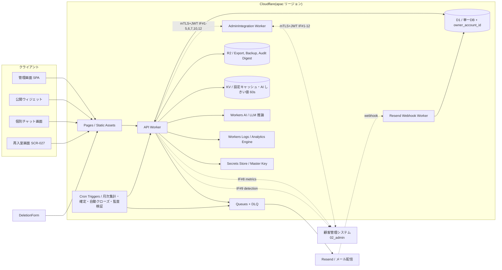

### 2.3 コンポーネント責務

| コンポーネント | 責務 |
|---|---|
| 管理画面(SPA) | 管理者ユーザー(admin)向け UI。FAQ 管理、未解決質問、チャット、利用量、設定、お知らせの操作 |
| 公開ウィジェット | エンドユーザー向け UI。質問、回答表示、解決可否、未解決時の誘導。スクリプトタグ埋め込み形式 |
| 個別チャット画面 | 問い合わせ ID 単位のチャット UI(エンドユーザー側 / 管理者ユーザー側) |
| 再入室画面 SCR-027 | エンドユーザーがメール内トークンで個別チャット部屋へ再入室するための UI |
| Pages | 静的アセット配信(SPA、ウィジェット JS、CSS 等) |
| API Worker | 認証、認可、FAQ 検索、未解決登録、チャット投稿、通知 Queue 投入、課金集計、各種 CRUD |
| AdminIntegration Worker | 顧客管理システム連携 IF #1〜#12 の送受信(mTLS + 短期 JWT、Idempotency-Key 管理、DLQ 投入) |
| Resend Webhook Worker | Resend からの配信状態 Webhook 受信(署名検証 + 冪等性管理) |
| Queues + DLQ | メール通知、エクスポート、削除処理、自動クローズ通知、課金月次集計などの非同期処理。DLQ 保持 4 日 + R2 退避 30 日(NFR-810) |
| D1 | 単一 D1 + owner_account_id 分離方式(要件 §20.2 確定)。FAQ、質問ログ、未解決質問、チャット、通知ログ、アカウント、課金、お知らせ、監査ログ、AI しきい値永続キャッシュ(`ai_threshold_persistent_cache`)、サプレスリスト(`email_suppression_list`)、メール配信メタなど |
| R2 | エクスポートファイル、バックアップ(日次 30 + 週次 12 + 月次 12)、監査ログ日次ダイジェスト、DLQ 退避(30 日) |
| KV | ウィジェット設定キャッシュ(TTL 60 秒)、許可ドメイン、契約別レート制限上書き、AI しきい値短期キャッシュ(TTL 60 秒、FR-341)、未読件数キャッシュ(TTL 60 秒) |
| Workers AI | Cloudflare 上の LLM 推論基盤。FAQ 範囲内での回答整形に利用。FAQ 外の新事実は生成しない。AnswerProvider 抽象化経由で呼び出す |
| Workers Logs / Analytics Engine | アプリケーションログ(JSON Lines)の集約・検索基盤(要件 §14.8) |
| Secrets Store | Master Key 保管。`wrangler secret put` で投入、年次ローテーション(NFR-320 / NFR-321) |
| Cron Triggers | 月次集計バッチ(UTC 15:00)・月次確定 cron(JST 02:00)・自動クローズ評価(5 分間隔)・監査ログ完全性検証(JST 03:00)・保持期間超過削除(日次)・tombstone 化(NFR-602a/b/d)・trial 終了判定(JST 00:00) |
| Resend | メール送信、配信状態通知 Webhook |
| 顧客管理システム | 運営者向けコンソール。Stripe Webhook 一次受信、契約停止・復元、AI しきい値設定、お知らせ作成・配信、監視メトリクス可視化 |

### 2.4 デプロイ単位

| デプロイ単位 | 内容 |
|---|---|
| API Worker | API 一式(認証・FAQ・未解決・チャット・課金・通知 Queue 投入) |
| AdminIntegration Worker | 顧客管理連携 IF 受信用ワーカー(連携 IF #1〜#7、#10、#12 の受信側) |
| Resend Webhook Worker | Resend Webhook 受信(署名検証) |
| 管理画面アセット | 管理画面 SPA ビルド |
| ウィジェットアセット | ウィジェット JS / CSS |
| エンドユーザー画面アセット | SCR-013 個別チャット / SCR-027 再入室画面 |
| Migration スクリプト | D1 スキーマのマイグレーション。**expand/contract 二段階**(まず追加、移行後に削除)で実施し、ダウンタイムゼロを担保(R-013 / 要件 §14.5)。Wrangler D1 migrations を採用、スキーマバージョン管理必須 |
| 定期バッチ(Cron Triggers) | 保持期間超過データ削除、自動クローズ評価、監査ログ完全性検証、月次集計・確定、トライアル終了判定、tombstone 化 |

### 2.5 環境構成(参照: 要件 §14.5)

| 環境 | Workers / D1 / R2 / KV | データ | デプロイ権限 |
|---|---|---|---|
| dev | 開発者個別 | 合成データ(faker 等の擬似データ専用) | 全開発者 |
| staging | 共有 | **本番マスキング済みダンプ**(週次更新)。メールアドレスは SHA-256 ハッシュ化、氏名・住所はダミー値、本文は先頭 100 文字 + `…` でトリミング | 開発者 |
| prod | 共有 | 本番 | **2 名承認**(GitHub OIDC + Environment Protection Rules) |

**本番直接変更**: 要件 §6.2.1 区分3(セキュリティインシデント)+ §6.2.2 発動条件 4 項目が成立する場合に限り、運営者の対応チケット ID 必須、全クエリを監査ログに記録(`db.query.execute` action コード、§10.6.5)。NFR-319 補完策に従い DB 操作者を 2 名以下に限定し、月次棚卸しを実施する。

### 2.6 オーナー境界分離方式(参照: 要件 §20.2 確定済み項目、NFR-302 / AC-017 / NFR-115)

**単一 D1 + owner_account_id 分離方式を採用**(要件 §20.2 で確定済み)。全業務テーブルに `owner_account_id` を付与し、API / 認可レイヤで境界検証を行う。**150 契約到達時に D1 シャーディング設計を着手**(NFR-110、同時アクティブ契約上限 200)。

| 観点 | 方式 |
|---|---|
| データ分離 | 全業務テーブルに `owner_account_id` 列を必須化、API 認可で `actor.owner_account_id == target.owner_account_id` を検証 |
| シャーディング起点 | 同時アクティブ契約 150 到達(NFR-110) |
| D1 容量監視 | 8GB 到達時に運営者へ high お知らせ + シャーディング着手(NFR-115) |
| 検証 | オーナー境界分離自動テスト(クロスオーナーアクセス試行、月次 50 ケース)+ 年次手動レビュー + MVP リリース前ペネトレーションテスト 1 回以上(AC-017 / §14.3) |

詳細な物理スキーマと外部キー制約は §7、テストは §14.3 を参照。

---

## 3. 利用者・権限設計

要件 §6.2 権限マトリクスを正本として全面採用する。本書 §3.2 / 付録 A は要件側との完全同期を保つ。

### 3.1 ユーザー種別(参照: 要件 §3, §6.1)

| ユーザー種別 | DB 値 | 概要 | 主な権限範囲 |
|---|---|---|---|
| オーナーアカウント | `accounts.role='admin'` AND `accounts.is_owner=1` AND `accounts.owner_account_id = accounts.id`(自己参照) | アカウント新規登録時に確定する 1 アカウント = 1 オーナー固定の利用者。全メンバー権限フラグ相当の操作 + オーナー専有機能を恒久保持。配下に複数プロジェクトを所有 | 自オーナー配下の全機能(課金 / 退会 / 規約再同意承諾を含む) |
| メンバーアカウント | `accounts.role='admin'` AND `accounts.is_owner=0` AND `accounts.owner_account_id` に所属オーナーの id を保持。`account_permissions` / `account_project_grants` の結合で権限とプロジェクト割当を判定 | オーナーまたは「ユーザー管理」保持者から招待された利用者。保持するメンバー権限フラグとプロジェクト割当の組合せで操作範囲が決まる | 紐づくオーナー配下のうち、権限フラグおよび割当プロジェクトで許可された範囲。ダッシュボードは権限・割当不問 |
| エンドユーザー | `accounts.role='end_user'`(原則レコード作成しない) | 管理者の Web サイト訪問者 | 自分の問い合わせ ID に紐づくチャットのみ |
| サービス運営者 | `accounts.role='service_operator'` | 本 SaaS 提供者 | 運用に必要な範囲。オーナー配下データの中身は原則閲覧しない。本書側では「△ 緊急時のみ可」操作の受け入れ側として扱う(主たる UI は顧客管理側) |

MVP では `accounts.role` の値域は `admin` / `service_operator` / `end_user` の 3 値固定とし、オーナーとメンバーの区別は `accounts.is_owner` カラムで表現する(`is_owner=1` がオーナー、`is_owner=0` がメンバー)。データ分離・課金・退会後削除の単位はオーナーアカウント(`accounts.owner_account_id` で全エンティティを紐付け)で、`accounts` テーブル(オーナー行)は廃止する(設計案の比較・選定根拠は §7.1.1)。メンバーの権限フラグは `account_permissions` 関連テーブル、プロジェクト割当は `account_project_grants` 関連テーブルで表現する(§7.1)。オーナーアカウントの契約状態は `accounts.contract_status`(`active` / `suspended` / `deleted_pending` / `deleted` の 4 値固定、オーナー行のみ意味を持つ)で管理する。

### 3.2 権限マトリクス(画面単位)(参照: 要件 §6.2)

凡例: 「○」= 常時可、「△」= 「緊急時のみ可」(要件 §6.2.1 緊急区分 + §6.2.2 発動条件 4 項目成立時のみ可。具体検知ハンドラ表は §3.2.1 参照)、「自分のみ」= 自分の問い合わせ ID 範囲内に限り常時可、「×」= 不可。

| 操作分類 | オーナー | FAQ管理 | 個別チャット対応 | ユーザー管理 | プロジェクト設定 | ログ参照 | エンドユーザー | 運営者 |
|---|:---:|:---:|:---:|:---:|:---:|:---:|:---:|:---:|
| ダッシュボード(自分の通知・お知らせ受信箱) | ○ | ○ | ○ | ○ | ○ | ○ | × | × |
| FAQ 登録・編集・公開 | ○ | ○ | × | × | × | × | × | △(運営者復元時のみ、顧客管理 FR-200〜211 経由) |
| FAQ AI 下書き生成(SCR-012 から呼出) | ○ | ○ | × | × | × | × | × | × |
| プロジェクト管理 | ○ | × | × | × | ○ | × | × | △(運営者復元時のみ) |
| メンバー招待・権限フラグ変更・停止・削除 | ○ | × | × | ○ | × | × | × | × |
| 未解決質問閲覧 | ○ | × | ○ | × | × | ○ | × | △(障害調査時のみ) |
| 個別チャット返信 | ○ | × | ○ | × | × | × | 自分のみ | × |
| 個別チャット閲覧 | ○ | × | ○ | × | × | ○ | 自分のみ | △(障害調査時のみ。閲覧履歴は監査ログ必須記録) |
| 質問ログ閲覧 | ○ | × | × | × | × | ○ | × | × |
| 監査ログ閲覧(自契約) | ○ | × | × | × | × | ○ | × | ○(全契約) |
| 課金情報閲覧・変更 / 月次予算上限変更 / 支払方法更新 | ○(オーナー専有) | × | × | × | × | × | × | △(訂正請求・サポート対応時のみ。Stripe Credit Note 発行は運営者操作) |
| 退会申請・解約 | ○(オーナー専有) | × | × | × | × | × | × | × |
| 規約再同意の承諾 | ○(オーナー専有) | × | × | × | × | × | × | × |
| データエクスポート | ○ | × | × | × | × | ○ | × | × |
| 契約無効化(サスペンション) | × | × | × | × | × | × | × | ○(顧客管理 FR-224、§6.2.7) |
| 契約物理削除 | × | × | × | × | × | × | × | ○(退会後の自動バッチ) |
| プロンプトテンプレート編集(FR-342) | × | × | × | × | × | × | × | ○(運営者のみ) |
| 案件「終了」確定(`closed`) | ○ | × | ○ | × | × | × | × | × |
| 案件「解決済み」(`resolved`) | ○ | × | ○ | × | × | × | × | × |
| お知らせ閲覧(自契約) | ○ | ○ | ○ | ○ | ○ | ○ | × | △(運用調査時のみ) |
| お知らせ既読化(個別 / 一括) | ○ | ○ | ○ | ○ | ○ | ○ | × | × |
| お知らせ作成・配信 | × | × | × | × | × | × | × | ○(顧客管理 FR-149) |

詳細マトリクス(操作粒度)は **付録 A** を参照。

#### 3.2.0 メンバー権限フラグの定義(本書 § 正本)

要件 §6.2.0 で定義される 5 種のメンバー権限フラグについて、本書では以下を確定する。MVP では権限フラグの追加・削除は不可、すべて固定セットとする。実装上は `account_permissions` テーブルの `permission_kind` カラムに以下の値を `CHECK` 制約として保持し、`is_owner=1` のアカウントは `account_permissions` を持たない暗黙ルール(オーナーは全権)で運用する。

##### 3.2.0.1 権限フラグ概要(「できること」要約)

説明や運用ガイドで参照しやすい簡潔な要約表を本書に置く。詳細な操作×ロールの対応は §3.2 権限マトリクスを正本とし、各フラグの主管 SCR / FR は §3.2.0.2 を参照する。

| `permission_kind` 値 | 表示名(UI) | できること |
|---|---|---|
| `faq:manage` | FAQ管理 | FAQ の登録・編集・削除・公開、FAQ AI 下書き生成、FAQ インポート |
| `chat:respond` | 個別チャット対応 | 未解決質問の閲覧・対応状態更新・担当割当、個別チャット返信、対応不要終了 |
| `users:manage` | ユーザー管理 | メンバーの招待・権限フラグ変更・停止・削除、招待再送・取消(オーナー対象は除く) |
| `project:manage` | プロジェクト設定 | プロジェクトの作成・編集・削除、ウィジェット設定、許可ドメイン設定 |
| `logs:view` | ログ参照 | 質問ログ閲覧、自契約分の監査ログ閲覧、データエクスポート、未解決質問・個別チャット内容の閲覧(返信権はない) |

ダッシュボード(自分の通知・お知らせ受信箱)は権限フラグの保有有無に関わらず利用者(オーナー / メンバー)が利用できる(要件 FR-337)。オーナー専有機能(課金情報の操作、退会申請、規約再同意承諾)はメンバー権限フラグでは付与できない。

##### 3.2.0.2 主管 SCR / FR 対応(設計トレース用)

| `permission_kind` 値 | 主な操作対象(SCR / FR 参照) | オーナーとの関係 |
|---|---|---|
| `faq:manage` | SCR-012(FAQ管理)、FR-040〜046, FR-104, FR-310 | オーナーは常時保持 |
| `chat:respond` | SCR-011(未解決質問)、SCR-013(個別チャット)、FR-070〜079, FR-086 | オーナーは常時保持 |
| `users:manage` | SCR-017(ユーザー管理)、FR-015〜021 系列 | オーナーは常時保持し、`users:manage` 保持メンバーがいなくても運用継続可 |
| `project:manage` | SCR-010 / SCR-014、FR-030〜036, FR-150 | オーナーは常時保持 |
| `logs:view` | SCR-015(利用状況・課金ダッシュボードのうち閲覧部分)、質問ログ・自契約監査ログ、FR-070, NFR-602 系列 | オーナーは常時保持 |

オーナー専有機能はメンバー権限フラグでは付与できない。これらは認可ミドルウェアで `principal.isOwner === true` を必要条件として強制する(§3.3 認可チェック表に「オーナー専有」行を追加)。

#### 3.2.1 「△ 緊急時のみ可」操作の発動条件(参照: 要件 §6.2.1 / §6.2.2、顧客管理 FR-225)

要件 §6.2.1 の緊急区分(重大障害 / 全員ロックアウト / セキュリティインシデント / 法令対応即応)に該当する状況下で、要件 §6.2.2 の発動条件 4 項目を満たした場合のみ、すべての「△」操作を実行可能とする。本書はメインシステム側受信実装の方針を確定する。

| 条件 | 実装方針(メイン側) |
|---|---|
| 1. サポートチケット ID 必須 | 連携 IF #4 / #5 / #6 / #12 のリクエスト JSON に `ticket_id` フィールドを必須化。メイン側で空文字検証 + 監査ログ記録 |
| 2. 運営者 2 名の承認(自己承認不可) | 顧客管理側で承認を取得し、その結果を連携 IF 経由でメインへ伝搬。メイン側は **メタフィールド `approvals[]`(承認者 2 名分)** の検証(承認者 ID が異なる、承認時刻が 24 時間以内、kid 検証)を実施 |
| 3. 管理者ユーザーへの即時通知 | メイン側で `inbox_messages` レコードを生成(`category=system`、`importance=high`)+ メール送信を Queue 投入(NFR-317) |
| 4. 監査ログ必須記録 | `<resource>.<verb>.by_operator` 形式の `action` コードで `audit_logs` に記録(§10.6.5)。`retention_class=operator_high_priv`(5 年保持、NFR-602d)。具体 action コード値の一覧は詳細設計 §15 |

#### 3.2.2 緊急区分 × 検知ハンドラ × 承認 SLA(参照: 要件 §6.2.1)

要件 §6.2.1 の各緊急区分に対する、メイン側の検知ハンドラ・承認 SLA・通知種別の対応表を以下に示す。検知から発動条件 4 項目の完了までを SLA 範囲とする。

| 緊急区分 | 検知ハンドラ | 承認 SLA | エスカレーション経路 |
|---|---|---|---|
| 重大障害 | `monitoring:main_outage` 監視 / 連携 IF #2 ヘルスチェック(5s × 3 連続失敗) | 15 分以内に 2 名承認 | RB-021(メイン障害時の運営者側縮退運転)と連動、SCR-096 バナー + 運営者 inbox(system/critical) |
| 全員ロックアウト | `audit_logs(auth.locked)` 集約検知(該当契約内全 admin が `auth.locked` 状態) | 30 分以内に CS マネージャーへ通報 | サポート窓口経由でオーナー(オーナーアカウント)と連絡、紙ベース回復コード(RB-014)も可 |
| セキュリティインシデント | NFR-602c 監査ログ完全性検証バッチ / SIEM / 不正アクセス検知(FR-178) | 即時 PagerDuty 起動 | セキュリティ責任者 → CTO → 運営本部 |

### 3.3 認可チェックの基本(参照: FR-176 / FR-333 / FR-334 / FR-335 / FR-022 / FR-336〜339)

| チェック | 内容 |
|---|---|
| オーナー境界 | 操作対象データの `owner_account_id` が `principal.ownerAccountId` と一致すること。違反は 403 |
| プロジェクト境界(新規) | (a) `principal.isOwner=true` のとき自オーナー配下の全プロジェクトに無条件アクセス可、(b) `isOwner=false`(メンバー)のとき対象 `project_id` が `principal.projectGrants` に含まれていること。違反は 403(`PROJECT_ACCESS_DENIED`) |
| inquiry 境界 | end_user は再入室トークンが紐づく `inquiry_id` のみアクセス可 |
| 状態チェック | オーナーアカウントが有効状態(`accounts.contract_status='active'`)、操作アカウントが `accounts.status='active'` であること。`contract_status='suspended'` 中は §6.2.7 のルールに従う |
| メンバー権限チェック | メンバー(`is_owner=0`)は、当該操作に対応する `permission_kind` を `account_permissions` に保持していること。オーナー(`is_owner=1`)は常時パス。違反は 403 |
| オーナー専有チェック | 課金画面・退会画面・規約再同意承諾画面の操作はオーナー(`is_owner=1`)のみ許可。メンバーは UI 非表示 + API 403 |
| 重要操作 | パスワード変更・退会・課金情報変更・メンバー招待・権限フラグ変更・プロジェクト割当変更・メンバー停止・削除・月次予算上限変更には再認証(FR-005)を要求。再認証の有効期間は当該操作 1 回のみかつ 15 分以内 |
| オーナー保護(FR-333) | オーナー(`is_owner=1`)に対する停止・削除・降格・`is_owner=0` への変更操作はすべて 403。1 アカウント = 1 オーナーであり、orphan 状態は構造的に発生しない |
| 自己操作不可(FR-334) | 自分自身の利用状態変更・削除・権限フラグ剥奪・プロジェクト割当変更は API で 403。特に `users:manage` の自己剥奪は不可 |
| 単一オーナー所属(FR-335) | 同一メールでも別オーナー配下は別アカウントとして扱う |
| 権限変更の反映(FR-338) | メンバー権限フラグおよびプロジェクト割当の変更は即時セッション失効を行わず、Principal キャッシュ TTL(MVP 既定: 60 秒)経過後の次回認可チェックで反映する |

#### 3.3.1 Principal 構築フロー(参照: §3.3 メンバー権限チェック / プロジェクト境界)

認可ミドルウェアは、リクエスト毎に `accounts` と `account_permissions` と `account_project_grants` を 1 クエリで結合し、以下の構造を持つ Principal オブジェクトを組み立てる(具体 SQL・型定義は詳細設計 §4.1)。

```text
Principal {
  accountId:      string
  ownerAccountId: string       // accounts.owner_account_id(オーナー行は自己参照)
  role:           'admin' | 'service_operator' | 'end_user'
  isOwner:        boolean      // accounts.is_owner = 1
  permissions:    Set<'faq:manage' | 'chat:respond' | 'users:manage' | 'project:manage' | 'logs:view'>
  projectGrants:  Set<string>  // 空 Set かつ isOwner=true は全プロジェクト可
}
```

オーナーの Principal は `isOwner=true` かつ `permissions` 集合と `projectGrants` 集合がいずれも空のままとし、`requirePermission(kind)` ガードは `principal.isOwner || principal.permissions.has(kind)`、`requireProjectAccess(projectId)` ガードは `principal.isOwner || principal.projectGrants.has(projectId)` で判定する。Principal は KV キャッシュ(TTL 60 秒)経由で読み取り、権限変更時の即時反映よりも認可レイテンシ最適化を優先する(FR-338)。

### 3.4 アカウント運用上の制約(参照: FR-022 / FR-179 / FR-330 / FR-332)

| 観点 | 仕様 |
|---|---|
| IP 許可リスト(管理画面、FR-179) | 契約単位でオプトイン(初期空 = 制限なし)。IPv4 / IPv6 両対応・CIDR 表記、ワイルドカード不可(FR-330)。VPN / プロキシ判定は MVP では行わない |
| 海外 IP 遮断(FR-331) | 運営者画面のみデフォルト ON。利用者側 API およびウィジェットは海外エンドユーザーから到達するため対象外 |
| 複数デバイス同時ログイン(FR-332) | 可能。SCR-001 でアクティブセッション一覧を確認可能 |
| 運営者強制ログアウト(FR-022) | 連携 IF #1 / #2 経由、5 秒以内に全セッション無効化(運営者の手動停止 `reason=operator_manual` / `reason=tos_violation` の場合)。猶予期間経過による自動サスペンション `reason=payment_failure_grace_expired` の場合は既存セッション継続 |
| セッション管理統合 | 要件 §8.2.1 セッション管理表に従う(認証方式、無操作 TO 30 分、絶対 TO 12 時間、Cookie 属性、CSRF) |

---

## 4. 状態モデル設計

業務上以下の状態を独立に管理する。状態の混同(特に「問い合わせ案件」と「チャット部屋」「契約」の状態)は要件で明確に分離されているため、本書も同じ分離を維持する。

### 4.1 状態の分類(参照: 要件 §3 用語定義 / §8.7.1 / §9.10)

| 状態種別 | 対象 | 値 | 正本 |
|---|---|---|---|
| FAQ 状態 | FAQ | `draft` / `published` / `hidden` / `deleted` | 本書 §4.2 |
| **案件状態(`case_status`)** | 未解決質問 | **`open` / `resolved` / `closed` / `faq_registered` の 4 値** | 要件 §8.7.1 |
| FAQ 候補状態 | 未解決質問 | `none` / `candidate` / `drafted` / `registered` | 本書 §4.1.1 |
| 部屋状態 | 個別チャット部屋 | `open` / `closed` | 要件 FR-088 / §8.8.1 |
| `reminder_state`(自動クローズ段階) | 個別チャット部屋 | `active` / `stage1_pending_admin` / `stage2_user_check_sent` / `stage3_user_no_response` / `stage4_final_check` / `stage5_final_no_response` / `stage6_auto_closed` の 7 値 | 要件 §8.8.1 / 本書 §4.4(`stage3`/`stage5` は Cron 評価時の中間状態) |
| 通知状態 | 通知 | `queued` / `sending` / `sent` / `delivered` / `bounced` / `complained` / `delayed` / `failed` / `suppressed` | 要件 §11.3 |
| アカウント状態 | アカウント | `pending_verification` / `pending_activation` / `active` / `disabled` の 4 値 | 本書 §4.1(SCR-017 登録完了フロー対応で `pending_activation` を含む) |
| **オーナー契約状態(`accounts.contract_status`、オーナー行のみ)** | アカウント(オーナー行) | **`active` / `suspended` / `deleted_pending` / `deleted` の 4 値固定** | 要件 §3 用語表 |
| 状況(派生) | 未解決質問 | 未解決 / 対応中 / 解決済み / 終了 | 本書 §4.6(SCR-011 等の利用者向け表示用) |
| お知らせ既読状態 | お知らせ(`inbox_messages`) | `unread` / `read`(`read_at` の有無から派生) | 本書 §4.8 |

#### 4.1.1 要件用語 → DB 値 マッピング(参照: 要件 §8.7.1 / BR-019 / BR-020 / FR-074 / FR-078 / FR-079)

要件定義書では一部の状態を日本語表現で記述する一方、本設計では英語の内部値で管理する。両者の対応関係を以下に明示する。管理者ユーザー以外の対応ロールを持たないため、承認待ち終了用の状態は設けない。

**案件状態(`case_status`)4 値**:

| 要件用語 | DB 値 | 画面表示 | API 値 | 遷移可能元 | 操作可能ロール |
|---|---|---|---|---|---|
| 未対応 / 対応中(活性) | `open` | 未解決 / 対応中 | `open` | (初期値) | システム / admin |
| 解決済み | `resolved` | 解決済み | `resolved` | `open` | admin のみ |
| 終了 | `closed` | 終了 | `closed` | `open` | admin のみ。**自動遷移なし** |
| FAQ 登録済み | `faq_registered` | 解決済み(FAQ 登録済み副表示) | `faq_registered` | `open` / `resolved` / `closed` | admin のみ |

**FAQ 候補状態(`faq_candidate_status`)**:

| 要件用語 | DB 値 | 画面表示 | API 値 |
|---|---|---|---|
| 未候補 | `none` | 未候補 | `none` |
| 候補 | `candidate` | 候補 | `candidate` |
| 下書き作成済み | `drafted` | 下書き作成済み | `drafted` |
| FAQ 登録済み | `registered` | FAQ 登録済み | `registered` |

派生「状況」は DB に存在しない読み取り専用の値であり、画面表示用にのみ使用する(詳細は §4.6)。

### 4.2 FAQ 状態遷移(参照: FR-040〜048 / FR-104 / AC-013)

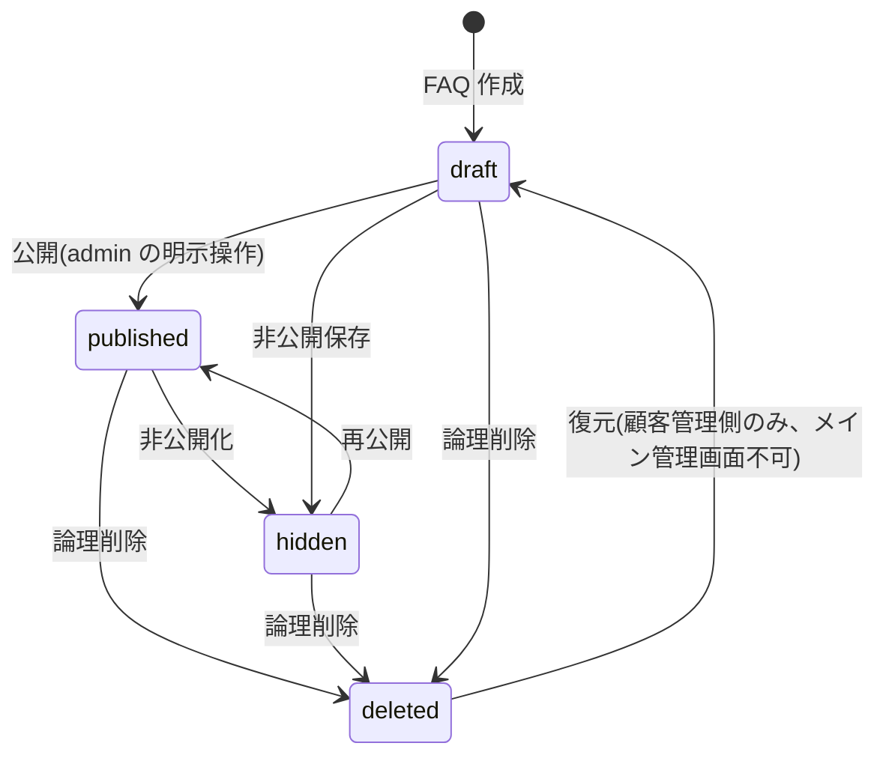

メイン管理画面からは `deleted` からの遷移を提供しない(復元手段なし、FR-040b)。`deleted → draft` の差し戻しは顧客管理システム側の運営者のみが行える(顧客管理 FR-200〜211)。

#### 4.2.1 FAQ 自動公開禁止のガード(参照: FR-104 / AC-013)

AI / バッチ / システムジョブが FAQ を `draft → published` に直接遷移させることを多層で禁止する。

| 層 | ガード方式 |
|---|---|
| API レイヤ | `POST /faqs` および `PATCH /faqs/{id}` の `status=published` 指定は **admin の人手操作セッション** からのリクエストのみ許可(セッション種別 = `interactive`)。バッチセッション(`session_kind=batch`)からは 403 |
| ドメインレイヤ | FAQ ドメインサービスで `FaqState.published` への遷移メソッドに `requireActorIsAdmin(adminSession)` を必須化 |
| DB レイヤ | `faqs.status` の `UPDATE` は監査ログ記録必須(`faq.publish` action コード)。バッチ実行時の SQL は staging で固定された監査トリガで検知 |

**AI 下書き生成は許容**: 要件 FR-104 は「`published` への直接遷移の禁止」が核心であり、AI が `draft` 状態の文案を生成すること自体は許容される。生成された下書きは必ず `draft` 状態で保存され、`published` への遷移には管理者の確認・編集・公開操作が必須。

### 4.3 案件状態遷移(参照: 要件 §8.7.1 / FR-074 / FR-079 / BR-020)

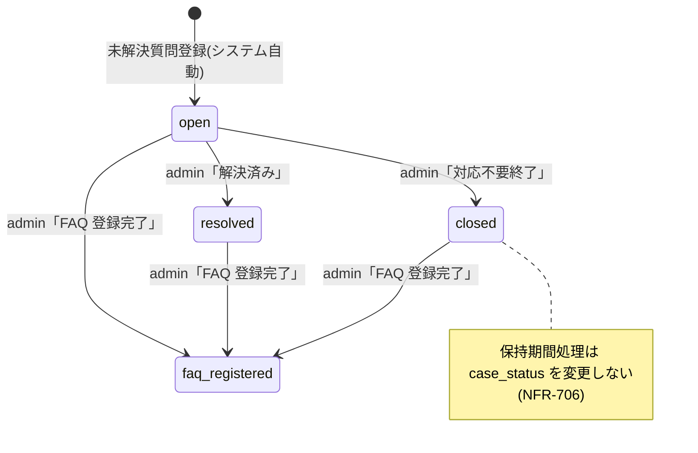

| 遷移 | トリガ | 操作可能ロール | 通知 |
|---|---|---|---|
| `[*] → open` | 未解決質問登録(API 自動) | システム | エンドユーザーへ INQUIRY_CREATED |
| `open → resolved` | admin が「解決済み」操作 | admin | なし |
| `open → closed` | admin が「対応不要終了」(SCR-012) | admin | エンドユーザーへ inbox 通知 |
| `* → faq_registered` | admin が FAQ 登録完了 | admin | エンドユーザーへ FAQ_REGISTERED |
| 保持期間処理 | NFR-706 の保持起点に基づく削除・匿名化・アーカイブ判定 | システム | 必要に応じて admin へ inbox(system / normal)。`case_status` は変更しない |

### 4.4 部屋状態遷移(参照: FR-088 / FR-089 / 要件 §8.8.1)

部屋状態は `room_status`(`open` / `closed`)と、自動クローズ段階を表す `reminder_state` の 2 つで管理する。**自動遷移するのは「部屋状態」のみであり、「案件状態(`case_status`)」は自動的に `closed` へ遷移しない**(BR-020 と整合)。

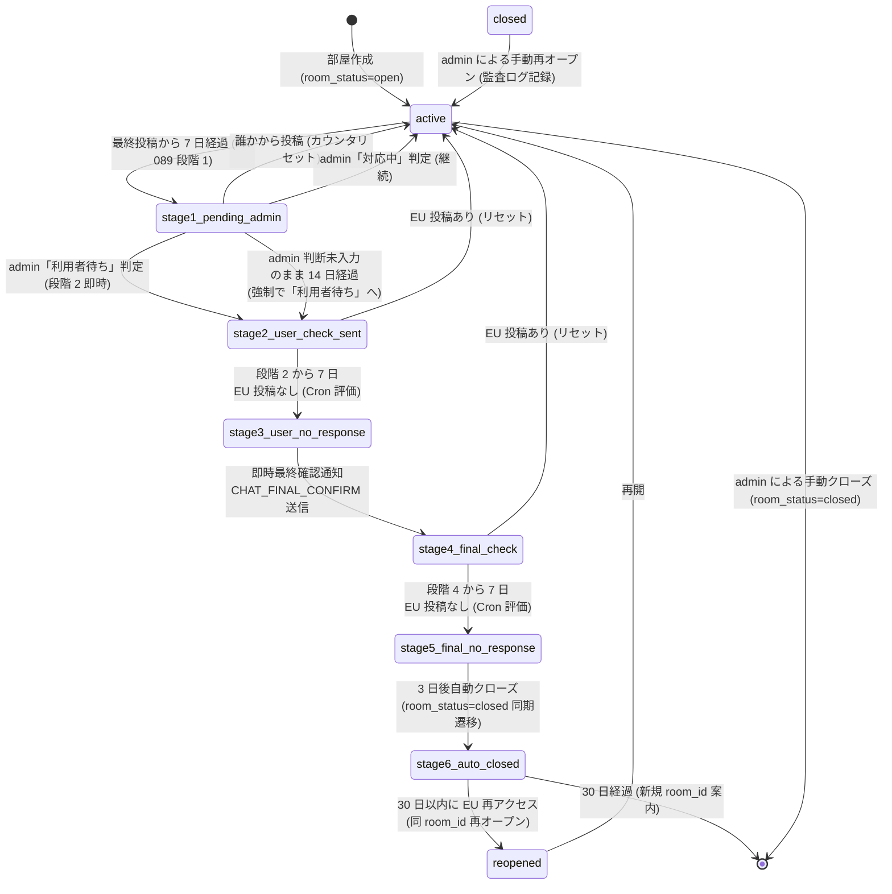

`stage3_user_no_response` と `stage5_final_no_response` は **Cron 評価時に同期的に通過する中間ステート**であり、データベース上に滞留時間を持たない(評価即時に次段階へ遷移)。詳細設計 §5.4 / §7.7.4 で Cron 実装を定義する。

| 遷移 | トリガ | 通知 | 備考 |
|---|---|---|---|
| `active → stage1_pending_admin` | 最終投稿から 7 日経過(Cron 5 分間隔) | admin へ CHAT_HOLD_CHECK | FR-089 段階 1 |
| `stage1_pending_admin → stage2_user_check_sent` | admin が「利用者待ち」判定(SCR-013)、または 14 日経過で自動進行 | EU へ CHAT_RESOLUTION_CHECK | 段階 2 即時 |
| `stage1_pending_admin → active` | 誰かから投稿 / admin「対応中」判定 | なし | カウンタリセット |
| `stage2_user_check_sent → stage3_user_no_response` | 段階 2 から 7 日 EU 投稿なし | なし(中間ステート) | Cron 評価で同期通過 |
| `stage3_user_no_response → stage4_final_check` | 即時遷移(Cron 同周期内) | EU へ CHAT_FINAL_CONFIRM | 段階 4 即時 |
| `stage4_final_check → stage5_final_no_response` | 段階 4 から 7 日 EU 投稿なし | なし(中間ステート) | Cron 評価で同期通過 |
| `stage5_final_no_response → stage6_auto_closed` | 即時遷移(3 日後の Cron 周期で判定後即時) | EU へ CHAT_AUTO_CLOSED | 部屋を `room_status=closed` に変更 |
| `* → active`(カウンタリセット) | EU・admin・admin のいずれかから投稿(段階 3 / 5 中は EU 投稿のみで判定) | なし | 投稿者の種別に応じて判定 |
| `stage6_auto_closed → reopened` | 30 日以内に EU が再入室 | なし | 同 `room_id` を再オープン |
| `stage6_auto_closed → [*]` | 30 日経過 | EU へ「新規部屋作成案内」 | 新規 `room_id` を発行 |
| `active → [*]`(手動クローズ) | admin の明示操作 | EU へ CHAT_CLOSED | `room_status=closed` |
| `closed → active`(手動再オープン) | admin の明示操作(誤クローズリカバリ) | なし | 監査ログ記録必須、30 日以内の同 `room_id` のみ |

**通知失敗時の挙動**: Resend バウンス時は 24 時間後に 1 回だけ再送(計 2 回まで)。最終的に再送失敗した場合は自動クローズを実行せず、admin に system 種別お知らせを生成し、自動クローズ判定をスキップする(FR-089)。

詳細フローは §6.2.6 を参照。

### 4.5 通知状態遷移(参照: 要件 §11.3 / FR-146)

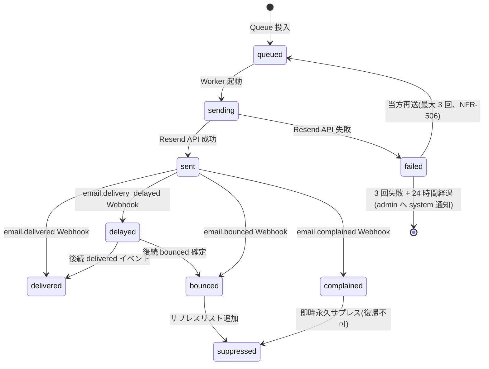

| 状態 | 意味 | 次状態 |
|---|---|---|
| `queued` | Queue 投入済み、Worker 起動待ち | `sending` |
| `sending` | Resend API 呼出中 | `sent` / `failed` |
| `sent` | Resend API 成功、配信状態 Webhook 待ち | `delivered` / `delayed` / `bounced` / `complained` |
| `delivered` | Resend から `email.delivered` 受信 | (終了) |
| `delayed` | Resend 側で再送中(`email.delivery_delayed`)。**本サービスの再送カウンタ(NFR-506)には含めない** | `delivered` / `bounced` |
| `bounced` | ハードバウンスまたはソフト 5 連続 | `suppressed` |
| `complained` | 受信者がスパム報告 | `suppressed`(復帰不可) |
| `failed` | Resend API 失敗(恒久エラー) | `queued`(当方再送、最大 3 回) |
| `suppressed` | サプレスリスト登録、再送停止 | (終了) |

### 4.6 未解決質問の状況(派生)(参照: BR-019 / FR-078 / 要件 §8.7.1 派生マッピング)

派生「状況」は DB に存在しない読み取り専用の値であり、SCR-011 一覧画面・SCR-012 詳細画面で表示する。

| 状況(表示) | 派生条件 | 表示例 |
|---|---|---|
| 未解決 | `case_status=open` AND チャットに管理者ユーザーからの投稿が 0 件 | 「未解決(対応着手前)」 |
| 対応中 | `case_status=open` AND チャットに管理者ユーザー投稿が 1 件以上 | 「対応中(○件のやり取り)」 |
| 解決済み | `case_status=resolved` | 「解決済み」 |
| 解決済み | `case_status=faq_registered` | 「解決済み(FAQ 登録済み)」 |
| 終了 | `case_status=closed` | 「終了」(必要に応じて理由付き) |

`faq_registered` の表示マッピング根拠: FAQ 登録済みは「業務として解決した」ことを意味するため、利用者向け表示は「解決済み」にマップする。詳細画面では「FAQ 登録済み」のラベルを副表示する。

### 4.7 対応不要終了操作(参照: BR-020 / FR-079 / AC-024)

| 観点 | 仕様 |
|---|---|
| 操作可能ロール | admin のみ |
| 操作経路 | SCR-012 詳細画面の「対応不要として終了」ボタン → 確認ダイアログで終了理由(任意・最大 500 文字)を入力 → 実行で `case_status=closed` |
| 自動遷移 | なし。自動クローズ FR-089 はチャット部屋の `room_status` のみで `case_status` には作用しない |
| 通知 | エンドユーザーへ受信箱通知(announcement 種別)を送信。通知失敗時は再送キューに投入、3 回失敗で admin に system 種別お知らせ |
| 監査 | `audit_logs.action=case.close` を記録(操作者 / 対象 / 終了理由 / 時刻) |
| 長期未完了案件の保持期間扱い(NFR-706) | `case_status=open` の案件は作成日時を保持起点にする。保持期間超過時も `closed` へ自動遷移させず、削除・匿名化・アーカイブ対象として扱う。必要な滞留通知は admin に inbox(system / normal)で送信する |

### 4.8 お知らせの既読状態(参照: FR-182 / FR-192)

| 状態 | 派生条件 | 遷移 |
|---|---|---|
| `unread` | `inbox_messages.read_at IS NULL` | SCR-022 詳細画面表示時に自動 `read`(初回のみ)、SCR-021 個別チェック + 「選択した項目を既読化」ボタン、SCR-021 「すべて既読化」ボタン |
| `read` | `inbox_messages.read_at IS NOT NULL` | 未読への戻し操作は提供しない(一方向遷移) |

一括既読化(SCR-021)は 1 操作最大 100 件まで(FR-323)。操作は監査ログに記録(`inbox.read.bulk` action コード、FR-192)。

### 4.9 契約状態遷移(参照: 要件 §3 / §9.10)

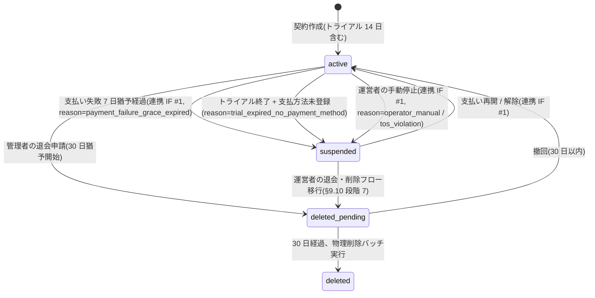

| 遷移 | トリガ | セッション扱い | 通知 |
|---|---|---|---|
| `active → suspended`(支払い失敗) | 連携 IF #1 受信、`reason=payment_failure_grace_expired` | 既存セッション継続(課金 / エクスポート / 退会のみ) | 管理者ユーザーへ inbox(billing / high)+ メール |
| `active → suspended`(トライアル終了) | メイン Cron(終了日翌日 JST 00:00)、`reason=trial_expired_no_payment_method` | 既存セッション継続(同上) | 管理者ユーザーへ inbox(billing / high)+ メール |
| `active → suspended`(運営者手動) | 連携 IF #1 受信、`reason=operator_manual` / `tos_violation` | **5 秒以内に全セッション無効化(FR-022)** | 管理者ユーザーへ inbox(system / high)+ メール |
| `suspended → active` | 連携 IF #1 受信(支払い再開 / 運営者解除) | 再ログイン要求 | 管理者ユーザーへ inbox(billing / normal)+ メール |
| `active → deleted_pending` | admin の退会申請(SCR-024) | 既存セッション継続(参照中心) | 管理者ユーザーへ inbox(system / normal)+ メール |
| `deleted_pending → active` | admin の撤回操作(SCR-024、30 日以内) | 継続 | 管理者ユーザーへ inbox(system / normal) |
| `deleted_pending → deleted` | 30 日経過、物理削除バッチ | 全セッション無効化 | エンドユーザーへ通知なし(管理者は既に退会済み) |

詳細フローは §6.2.7 / §6.2.8 を参照。

---

## 5. 画面設計概要

本章は、要件 §8.18 SCR 画面一覧マスタの **メイン主管 SCR**(SCR-001〜SCR-027 のうちメイン側 19 画面)を採用し、メインシステムの画面構成として展開する。

### 5.1 画面一覧(参照: 要件 §8.18 SCR マスタ)

| 画面 ID | 画面名 | 利用者 | 主たる関連 FR | 主管書 | 優先度 |
|---|---|---|---|---|:---:|
| SCR-001 | ログイン | 管理者ユーザー | FR-004, FR-007, FR-008, FR-332 | メイン | P0 |
| SCR-002 | アカウント登録 | 管理者ユーザー | FR-001, FR-002 | メイン | P0 |
| SCR-003 | パスワード再設定 | 管理者ユーザー | FR-004, FR-006 | メイン | P0 |
| SCR-010 | プロジェクト一覧 | 管理者ユーザー | FR-030〜035 | メイン | P0 |
| SCR-010-M1 | プロジェクト設定モーダル(新規作成 / 編集) | 管理者ユーザー | FR-030〜035, FR-033a, FR-033c | メイン | P0 |
| SCR-011 | 未解決質問一覧 / 詳細 | 管理者ユーザー | FR-070〜079, BR-019, BR-020 | メイン | P0 |
| SCR-012 | FAQ 管理(一覧 / 編集 / インポート / 下書き生成) | 管理者ユーザー | FR-040〜048, FR-100〜106, FR-310, FR-320〜323 | メイン | P0 |
| SCR-013 | 個別チャット部屋 | 管理者ユーザー / エンドユーザー | FR-080〜091, FR-082a〜c | メイン | P0 |
| SCR-014 | ウィジェット設定 | 管理者ユーザー | FR-150〜156, FR-193, FR-194 | メイン | P0 |
| SCR-015 | 利用状況・課金ダッシュボード | 管理者ユーザー | FR-120〜127, FR-129, FR-148, FR-191 | メイン | P0 |
| SCR-016 | 設定(退会・課金画面入口) | 管理者ユーザー | FR-009, FR-125, FR-162, FR-167 | メイン | P0 |
| SCR-017 | ユーザー管理(一覧) | オーナー / `users:manage` 保持メンバー | FR-017, FR-021a〜c, FR-333 | メイン | P0 |
| SCR-017-M1 | メンバー招待 / 編集モーダル | オーナー / `users:manage` 保持メンバー | FR-015〜021, FR-015a〜d, FR-016a〜c, FR-018a〜c, FR-021c, FR-333, FR-334, FR-335, FR-336〜338 | メイン | P0 |
| SCR-018 | プライバシーポリシー / 利用規約閲覧 | 全利用者 | FR-160, FR-164, FR-168 | メイン | P0 |
| SCR-021 | お知らせ一覧 | 管理者ユーザー | FR-180, FR-181, FR-183, FR-323 | メイン | P0 |
| SCR-022 | お知らせ詳細 | 管理者ユーザー | FR-181, FR-182 | メイン | P0 |
| SCR-023 | メール確認 | 管理者ユーザー | FR-003 | メイン | P0 |
| SCR-024 | 退会申請 | 管理者ユーザー | FR-009 | メイン | P0 |
| SCR-025 | 規約再同意割込み | 管理者ユーザー | FR-011, FR-164 | メイン | P0 |
| SCR-027 | エンドユーザー再入室画面 | エンドユーザー | FR-083, FR-084, FR-174 | メイン | P0 |
| SCR-090 | 削除データ参照(運営者) | サービス運営者 | 顧客管理 FR-200〜205, FR-223 | 顧客管理 | P0 |
| SCR-091 | 削除データ復元 | サービス運営者 | 顧客管理 FR-206〜211, FR-222 | 顧客管理 | P0 |
| SCR-092 | AI 推論パラメータ設定(契約別上書き) | サービス運営者 | 顧客管理 FR-061〜066, FR-222 / メイン FR-055 | 顧客管理 | P0 |
| SCR-093 | 契約別レート制限・予算上限管理(サプレスリスト復帰承認を含む) | サービス運営者 | 顧客管理 FR-121, FR-224(b), §11.3 サプレスリスト復帰承認 / メイン FR-121, FR-122 | 顧客管理 | P0 |
| SCR-094 | お知らせ作成・配信(運営者) | サービス運営者 | 顧客管理 FR-149, FR-188〜189 | 顧客管理 | P0 |
| SCR-096 | 運営者活動ダッシュボード(監査) | サービス運営者 | 顧客管理 FR-229, FR-230, FR-232 | 顧客管理 | P0 |
| SCR-097 | 課金 Webhook リプレイ・DLQ 操作画面 | サービス運営者 | 顧客管理 FR-302, NFR-808 / メイン FR-139 | 顧客管理 | P0 |
| SCR-098 | PII 誤検出報告管理(運営者) | サービス運営者 | 顧客管理 FR-060, FR-064, NFR-805 / メイン FR-060, NFR-805 | 顧客管理 | P0 |
| SCR-099 | Webhook ペイロード差分検出一覧(運営者) | サービス運営者 | 顧客管理 FR-302, AC-041 / メイン FR-139 | 顧客管理 | P0 |

注記:
- 「主管書」が「メイン」の SCR は本書(メインシステム基本設計)で正本管理し、「顧客管理」の SCR は [02_admin/02_basic_design.md](../02_admin/02_basic_design.md) で正本管理する。
- 顧客管理主管 SCR は連携対象として参照する。

### 5.2 画面遷移概要

```mermaid
flowchart TD
  Login[SCR-001 ログイン] --> Dashboard[利用状況/未解決<br/>SCR-015 / SCR-011]
  Reg[SCR-002 新規登録] --> EmailVerify[SCR-023 メール確認]
  EmailVerify --> Login
  Login --> Reset[SCR-003 パスワード再設定]
  Login --> ToS_Block{規約改定<br/>未同意?}
  ToS_Block -- Yes --> Reagree[SCR-025 規約再同意割込み]
  Reagree -- 同意 --> Dashboard
  Reagree -- 不同意 --> Withdraw[SCR-024 退会申請]

  Dashboard --> Projects[SCR-010 プロジェクト一覧/設定]
  Dashboard --> FaqList[SCR-012 FAQ管理]
  Dashboard --> InqList[SCR-011 未解決質問一覧]
  InqList --> InqDetail[SCR-011 未解決質問詳細]
  InqDetail --> Chat[SCR-013 個別チャット部屋]
  InqDetail --> NewFaq[SCR-012 FAQ 登録/下書き生成]
  Dashboard --> Bill[SCR-015 利用状況・課金]
  Dashboard --> Ops[SCR-017 管理者ユーザー管理]
  Dashboard --> Setting[SCR-016 退会・エクスポート]
  Setting --> Withdraw
  Withdraw -- 撤回 --> Setting
  Dashboard --> Privacy[SCR-018 プライバシーポリシー]

  Widget[公開ウィジェット] --> EmailReg[メール登録(SCR-013 内サブステップ)]
  EmailReg --> Chat
  ReentryMail[再入室メール] --> Reentry[SCR-027 再入室画面]
  Reentry --> Chat

  Bell[ヘッダ通知ベル] --> Inbox[SCR-021 お知らせ一覧]
  Sidebar[サイドバー: 通知 > お知らせ] --> Inbox
  Inbox --> InboxDetail[SCR-022 お知らせ詳細]
  Bell --> InboxDetail

  InvMail[登録完了メール] --> Login
```

| 観点 | 説明 |
|---|---|
| 認証フロー | SCR-001 → SCR-023(メール確認)→ SCR-001 → 利用状況系画面。SCR-002 新規登録経由は SCR-023 で本人確認後にログイン |
| 規約改定割込み | ログイン直後に未同意があれば SCR-025 強制割込み。SCR-025 で機能制限ガード(FAQ 編集とウィジェット稼働は継続、課金画面操作と新規プロジェクト作成は不可) |
| エンドユーザー導線 | ウィジェット → メール登録 → SCR-013。再入室メールからは SCR-027 を経由(トークン検証) |
| お知らせ導線 | ヘッダ通知ベル / サイドバー「通知 > お知らせ」 → SCR-021 → SCR-022(自動既読) |

### 5.3 共通 UI 部品

| 部品 | 用途 | 主な仕様 |
|---|---|---|
| Header | ロゴ、プロジェクト切替、ユーザーメニュー、通知ベル | 管理画面共通 |
| Sidebar | 管理画面の主要メニューを左側に表示 | ユーザー種別別表示。詳細は §5.6 を参照 |
| ProjectSelector | 対象プロジェクト切替 | admin は全件 |
| StatusBadge | FAQ 状態、案件状態、通知状態、契約状態 | DB 値 → 表示文言マッピング |
| ConfirmDialog | 削除、公開、退会など | 重要操作は再認証(FR-005)。削除系ダイアログには「この操作は取り消せません。誤って削除した場合はサポートにお問い合わせください」を必須表示 |
| ErrorAlert | 入力エラー、通信エラー、処理エラー | エラーコード別文言 |
| Pagination | 一覧画面 | カーソル方式 |
| EmptyState | データなし | 次操作への導線 |
| Toast | 成功・失敗通知 | 操作結果のフィードバック |
| FormField | 入力部品 | バリデーションメッセージ表示 |
| NotificationBell | ヘッダの通知ベル | 未読件数バッジ(0 件時は非表示)。`critical` 重要度は **赤色強調表示**、`high` は黄色。クリックで直近 10 件のドロップダウン展開、項目クリックで SCR-022 へ、「すべて表示」で SCR-021 へ。admin のみ表示(FR-184 / FR-185 / FR-191) |
| InboxItem | お知らせ一覧の行 | 種別バッジ、重要度インジケータ、タイトル、配信日時、未読インジケータ(左側ドット) |
| AnnouncementCategoryBadge | お知らせ種別バッジ | `billing`(青) / `announcement`(緑) / `system`(オレンジ) |
| ImportanceIndicator | お知らせ重要度インジケータ | `critical` = 赤マーク + バッジ、`high` = 黄色マーク、`normal` = 無印、`low` = 淡色(FR-181) |
| TrialBanner | トライアル残日数の警告バナー | SCR-015 等で残 3 日以内に表示。クリックで支払方法登録誘導 |
| UsageBar | 利用量バー(80% / 100% / 125%) | 80% で黄色、100% で赤、125% でアニメーション強調 |

### 5.4 各画面の画面項目

本節では、メイン主管 SCR 全 19 画面について、画面項目(表示エリア・入力項目・主な操作)を基本設計レベルで定義する。バリデーションルール、エラー文言、画面遷移時の処理詳細は詳細設計書を参照。

#### 5.4.1 SCR-001 ログイン

| 区分 | 項目 | 種類 | 概要 |
|---|---|---|---|
| 入力 | メールアドレス | メールアドレスボックス | 必須 |
| 入力 | パスワード | パスワードボックス | 必須 |
| 操作 | ログインボタン | ボタン | 認証 → 規約再同意チェック(必要なら SCR-025) → 利用状況系画面へ |
| 操作 | パスワードを忘れた場合 | リンク | SCR-003 へ遷移 |
| 操作 | アカウント登録 | リンク | SCR-002 へ遷移 |
| 表示 | 認証エラーメッセージ | エラーメッセージ表示 | 失敗時の共通文言(攻撃者にヒントを与えない) |
| 表示 | ロックアウト警告 | エラーメッセージ表示 | 5 回失敗後(FR-007) |
| 表示 | アクティブセッション一覧 | テーブル | ログイン後にユーザーメニューから表示可能(FR-332)。同一アカウントの複数デバイスログインを確認 |

#### 5.4.2 SCR-002 新規登録

| 区分 | 項目 | 種類 | 概要 |
|---|---|---|---|
| 入力 | メールアドレス | メールアドレスボックス | 必須。管理者本人のメール |
| 入力 | パスワード | パスワードボックス | 必須。FR-006 強度要件(12 文字以上、3 種類以上の文字種) |
| 入力 | パスワード(確認) | パスワードボックス | 必須。一致確認 |
| 入力 | 利用規約同意 | チェックボックス | 必須チェック |
| 入力 | プライバシーポリシー同意 | チェックボックス | 必須チェック |
| 入力 | 業種選択 | プルダウン | 任意。「金融」「医療」等の高規制業界を選択した場合は標準提供範囲外であることを表示し、サポート窓口を案内(要件 §16) |
| 表示 | 規約・ポリシーリンク | リンク | 別ウィンドウで全文表示 |
| 操作 | 登録ボタン | ボタン | 入力検証 → 登録 → 確認メール送信 → SCR-023 へ |
| 操作 | ログイン画面リンク | リンク | 既存ユーザー向け |

#### 5.4.3 SCR-003 パスワード再設定

| 区分 | 項目 | 種類 | 概要 |
|---|---|---|---|
| 段階 1 表示 | 案内文 | テキスト表示 | 登録メールへ再設定リンクを送る旨 |
| 段階 1 入力 | メールアドレス | メールアドレスボックス | 必須 |
| 段階 1 操作 | 送信ボタン | ボタン | リクエスト発行(存在有無は同一応答、列挙攻撃対策) |
| 段階 2 入力 | 新パスワード | パスワードボックス | 必須。FR-006 強度要件 |
| 段階 2 入力 | 新パスワード(確認) | パスワードボックス | 必須。一致確認 |
| 段階 2 操作 | 設定ボタン | ボタン | パスワード更新 → 全セッション失効 |
| 表示 | トークン無効 / 期限切れエラー | エラーメッセージ表示 | 段階 2 でリンク不正の場合。再設定リンクの有効期限は **1 時間**(FR-006) |

#### 5.4.4 SCR-010 プロジェクト一覧

| 区分 | 項目 | 種類 | 概要 |
|---|---|---|---|
| 表示 | プロジェクト ID | テキスト表示(テーブル列) | 内部 ID |
| 表示 | プロジェクト名 | テキスト表示(テーブル列) | - |
| 表示 | 許可ドメイン | テキスト表示(タグ風) | 設定値の概要、サブドメインワイルドカード `*.example.com` も表示 |
| 表示 | 連絡先メール | テキスト表示 + バッジ | アドレスと確認状態(`未設定` / `確認待ち` / `確認済み`)を併記 |
| 表示 | 更新日時 | テキスト表示(テーブル列) | 最終更新 |
| 操作 | 新規作成ボタン | ボタン | SCR-010-M1 プロジェクト設定モーダルを「新規作成」モードで開く |
| 操作 | 編集 | ボタン(行アクション) | SCR-010-M1 プロジェクト設定モーダルを「編集」モードで開く |
| 操作 | 削除 | ボタン(行アクション、確認ダイアログ) | 確認のうえ実施。管理画面からの復元手段は提供しない(FR-040b、サポート窓口経由) |

プロジェクトの新規作成 / 編集はすべて **SCR-010-M1 プロジェクト設定モーダル** (§5.4.4a)で扱う。本画面は一覧表示と行アクション(編集起動 / 削除)のみを担う。

#### 5.4.4a SCR-010-M1 プロジェクト設定モーダル(新規作成 / 編集)

SCR-010 の「+ 新規プロジェクト作成」または行アクション「編集」から開く全画面割込みモーダル。新規作成 / 編集の双方を同一画面で扱う(モード切替で初期値を空 / 既存値に分岐)。本モーダルは独立した画面 ID を持ち、サイドメニューには表示しない。

| 区分 | 項目 | 種類 | 概要 |
|---|---|---|---|
| 表示 | モード見出し | 見出し | 新規作成時「新規プロジェクト作成」、編集時「プロジェクト設定 — {プロジェクト名}」 |
| 入力 | プロジェクト名 | テキストボックス | 必須。1〜100 文字 |
| 入力 | 許可ドメイン | タグ入力(複数値) | 必須。完全一致 + `*.example.com` 形式可。IP アドレス・プロトコル指定は不可(要件 §11.2) |
| 入力 | プロジェクト連絡先メール | メールアドレスボックス | 任意(FR-033a)。設定時に確認メール送信 → リンククリックで `contact_email_verified_at` が設定されるまでウィジェット表示に利用しない。確認完了後は SCR-013 ウィジェットチャット上の「お問い合わせ先」表示(FR-033c)にのみ利用する。メール送信時の Reply-To には利用しない(本サービスからのメールは常に no-reply 送信) |
| 操作 | 確認メール再送 | ボタン | 編集モードかつ確認未完了のときのみ活性。再送時に旧確認トークンは失効する。レート制限(再送間隔・1 時間あたりの上限)は詳細設計 §6.7a を正本とする |
| 操作 | 保存 | ボタン | バリデーション通過時に値を保存。新規作成時はウィジェット公開キーの初回発行も実施。完了後モーダルを閉じて SCR-010 に戻る |
| 操作 | キャンセル | ボタン | 変更を破棄してモーダルを閉じる(連絡先メール変更による確認トークン送信を撤回するわけではない) |

**呼出元**: SCR-010 行アクション「編集」/「+ 新規プロジェクト作成」ボタン。URL は SCR-010 のままで、UI 上はモーダルオーバーレイとして提示する。

#### 5.4.5 SCR-011 未解決質問一覧 / 詳細

**一覧画面**:

| 区分 | 項目 | 種類 | 概要 |
|---|---|---|---|
| 入力 | 状況フィルタ | チェックボックスグループ | 未解決 / 対応中 / 解決済み / 終了(派生値、§4.6) |
| 入力 | 管理者ユーザーフィルタ | プルダウン | 自分 / 未割当 / 特定管理者ユーザー |
| 入力 | 期間 | 日付ピッカー(from/to) | 発生日時 |
| 表示 | 問い合わせ ID | テキスト表示(テーブル列) | `inquiry_code` |
| 表示 | 質問文(抜粋) | テキスト表示(テーブル列) | 先頭 60 文字 |
| 表示 | 発生理由 | バッジ | `reason_code`(no_match / low_confidence / contradiction / user_not_resolved 等) |
| 表示 | 状況 | バッジ | 派生値(未解決 / 対応中 / 解決済み / 終了) |
| 表示 | メール登録 | アイコン | 登録済み / 未登録 |
| 表示 | 最終投稿日時 | テキスト表示 | - |
| 表示 | 担当管理者ユーザー | テキスト表示 | - |
| 操作 | 詳細 | ボタン(行アクション) | 詳細画面へ |
| 操作 | チャット | ボタン(行アクション) | SCR-013 へ |
| 操作 | FAQ 登録 | ボタン(行アクション、admin のみ) | SCR-012 FAQ 登録モードへ(`sourceInquiryId` 付き) |
| 操作 | 担当管理者ユーザー設定 | プルダウン(行内) | 管理者ユーザー選択 |
| 表示 | ページング | カーソル方式 | - |

**詳細画面**:

| 区分 | 項目 | 種類 | 概要 |
|---|---|---|---|
| 表示 | 問い合わせ ID | 見出し | `inquiry_code` |
| 表示 | 元質問 | 本文ブロック | 全文 |
| 表示 | 回答不可理由 | バッジ + 補足テキスト | `reason_code` |
| 表示 | 候補 FAQ | リンク一覧 | 関連性の高い既存 FAQ |
| 表示 | 案件状態バッジ | バッジ | `case_status`(4 値) |
| 表示 | チャット対応 | バッジ + 日時 | 返信済み(初回返信日時付き) / 未返信 |
| 表示 | 状態履歴 | テーブル | 状態変更ログ(FR-077) |
| 表示 | チャット履歴埋め込み | パネル | SCR-013 のサブ表示 |
| 入力 | 案件状態 | プルダウン | `open` / `resolved` のみ(`closed` は専用ボタンで操作) |
| 入力 | FAQ 候補状態 | プルダウン | `none` / `candidate` / `drafted` / `registered` |
| 入力 | 担当管理者ユーザー | プルダウン | - |
| 操作 | 状態保存 | ボタン | 状態遷移ガード適用 |
| 操作 | チャット返信 | テキストエリア + 送信ボタン | 投稿フォーム |
| 操作 | FAQ 登録へ | ボタン(admin のみ) | SCR-012 へ(`sourceInquiryId` 付き) |
| 操作 | **対応不要として終了**(admin のみ表示) | ボタン(確認ダイアログ) | 終了理由(任意・最大 500 文字)入力 → `case_status=closed`(FR-079) |
| 操作 | 一覧へ戻る | リンク | SCR-011 一覧へ |
| 表示 | 終了情報 | テキスト表示 | `case_status=closed` のとき終了日時・操作者・理由を表示 |

#### 5.4.6 SCR-012 FAQ 管理(一覧 / 編集 / インポート / 下書き生成)

> **詳細設計での画面分割**: 詳細設計 §6.10「SCR-012 FAQ 管理一覧」/ §6.11「SCR-012 FAQ 編集 / AI 下書き生成」の 2 サブ画面に分割して実装する(同一 SCR ID 内のルーティング差異)。本書は SCR-012 を 1 ブロックで定義する。

**一覧画面**:

| 区分 | 項目 | 種類 | 概要 |
|---|---|---|---|
| 入力 | キーワード検索 | テキストボックス | 質問文・回答文の D1 FTS5 全文検索(FR-300) |
| 入力 | 状態フィルタ | チェックボックスグループ | `draft` / `published` / `hidden` |
| 入力 | カテゴリフィルタ | プルダウン | プロジェクト内のカテゴリ |
| 入力 | 並び順 | プルダウン | 関連度 / 更新日時 / 作成日時 |
| 表示 | FAQ ID | テキスト表示(テーブル列) | - |
| 表示 | 質問文(抜粋) | テキスト表示 | 先頭 60 文字 |
| 表示 | カテゴリ | テキスト表示 | - |
| 表示 | 状態バッジ | バッジ | 状態別色分け |
| 表示 | 登録元 | テキスト表示 + リンク | 未解決質問起源の場合に表示(BR-016 / FR-048) |
| 表示 | 更新日時 | テキスト表示 | - |
| 操作 | 新規作成 | ボタン | 編集モードへ |
| 操作 | 編集 | ボタン(行アクション) | 編集モードへ |
| 操作 | 公開 / 非公開切替 | トグルスイッチ | 状態変更(admin のみ、自動公開禁止 FR-104) |
| 操作 | 削除 | ボタン(行アクション、確認ダイアログ) | 論理削除。管理画面からの復元手段は提供しない |
| 操作 | 一括操作 | チェックボックス選択 + プルダウン | 一括状態変更最大 50 件(FR-323) |
| 操作 | インポート | ボタン → モーダル | CSV / JSON インポート(FR-310)。競合処理(スキップ / 上書き / 別件追加)を選択 |
| 操作 | エクスポート | ボタン | CSV / JSON エクスポート(FR-311) |
| 表示 | インポート進捗 | プログレスバー + リンク | 100 件超は非同期ジョブ化、24h タイムアウト |
| 表示 | エラーログダウンロード | リンク | 失敗レコードの行番号・理由を含む CSV(FR-310) |

**編集モード**:

| 区分 | 項目 | 種類 | 概要 |
|---|---|---|---|
| 入力 | 質問文 | テキストエリア | 必須。1〜500 文字(FR-046) |
| 入力 | 回答文 | テキストエリア | 必須。1〜5,000 文字(FR-046) |
| 入力 | カテゴリ | テキストボックス + サジェスト | 任意。100 文字以内 |
| 入力 | 状態 | ラジオボタン | `draft` / `published` / `hidden` |
| 表示 | 登録元未解決質問 | テキスト表示 + リンク | `source_unresolved_question_id` がある場合 |
| 表示 | 更新者・更新日時 | テキスト表示 | 編集時 |
| 表示 | 自動保存インジケータ | テキスト表示 | 30 秒ごと自動保存(FR-321)、未保存変更時の離脱警告 |
| 表示 | 改訂履歴 | リンク → モーダル | 直近 50 件、差分表示、任意版へのロールバック(FR-322) |
| 操作 | 下書き保存 | ボタン | `status=draft` で保存 |
| 操作 | 公開 | ボタン(確認ダイアログ) | `status=published` で保存(admin のみ) |
| 操作 | 非公開化 | ボタン | `status=hidden` で保存 |
| 操作 | 削除 | ボタン(確認ダイアログ) | 論理削除 |
| 操作 | **AI 下書き生成**(FR-104) | ボタン | 元未解決質問を入力に下書きを AI 生成 → `draft` 状態で保存(`published` への直接遷移なし、§4.2.1 ガード)。プロンプトテンプレートは運営者管理(FR-342)、MVP は契約別カスタマイズ不可 |
| 操作 | キャンセル | ボタン | 一覧へ戻る |
| 表示 | 楽観ロック衝突 | エラーメッセージ | `faqs.version` 不一致時に「最新版を確認してください」を表示(FR-320) |

#### 5.4.7 SCR-013 個別チャット部屋

**管理者 / admin 側**(一覧 + 部屋):

| 区分 | 項目 | 種類 | 概要 |
|---|---|---|---|
| 入力 | プロジェクトフィルタ | プルダウン | 全体 / プロジェクト別 |
| 入力 | 対応状態フィルタ | チェックボックスグループ | `case_status` |
| 入力 | 部屋状態フィルタ | チェックボックスグループ | `open` / `closed` |
| 表示 | 問い合わせ ID | テキスト表示 | - |
| 表示 | 案件状態バッジ | バッジ | `case_status` |
| 表示 | 部屋状態バッジ | バッジ | `room_status` |
| 表示 | `reminder_state` | バッジ | `stage1_pending_admin` / `stage2_user_check_sent` 等(管理者向けに自動クローズ進行を可視化) |
| 表示 | メッセージ履歴 | チャットメッセージリスト | 投稿者種別 / 本文 / 時刻、ページング |
| 表示 | 注意喚起 | 注釈 | 機密情報を入力しない旨(FR-091) |
| 入力 | 本文 | テキストエリア | 必須。最大 2,000 文字(FR-090)、エンドユーザーは 10 件/分の投稿頻度制限 |
| 操作 | 送信 | ボタン | メッセージ保存 → 相手側に通知 Queue 投入 |
| 操作 | 部屋を閉じる | ボタン(確認ダイアログ) | admin のみ。`room_status=closed` |
| 操作 | **部屋を再オープン**(admin のみ表示、closed 時のみ) | ボタン(確認ダイアログ) | クローズから 30 日以内に限り同 `room_id` を再オープン(FR-088)。監査ログ記録 |
| 操作 | 案件状態変更 | プルダウン | `open` / `resolved` 等(`closed` は専用ボタン) |
| 操作 | 管理者ユーザー割当 | プルダウン | - |
| 操作 | FAQ 登録 | ボタン(admin のみ) | SCR-012 へ |
| 操作 | 「利用者待ち」判定(`reminder_state=stage1_pending_admin` 時のみ) | ボタン | `stage2_user_check_sent` へ遷移、EU へ CHAT_RESOLUTION_CHECK 送信 |
| 操作 | 「対応中」判定(同上) | ボタン | `active` へ戻す |

**エンドユーザー側**(要件 §8.18 では SCR-013 が個別チャット部屋を一元管理):

| 区分 | 項目 | 種類 | 概要 |
|---|---|---|---|
| 表示 | 問い合わせ ID | 見出し | `inquiry_code` |
| 表示 | 元質問 | 参照ブロック | 未解決の元質問文 |
| 表示 | メッセージ履歴 | チャットメッセージリスト | - |
| 表示 | 注意喚起 | 注釈 | 機密情報を入力しない旨 |
| 表示 | お問い合わせ先メール | 案内ブロック(mailto: リンク) | 確認完了済のプロジェクト連絡先メール(`projects.contact_email_verified_at` IS NOT NULL)が設定されているときのみ「チャットで解決できない場合は <strong>{contact_email}</strong> までメールでお問い合わせください」を恒常表示(FR-033c)。未設定 / 未確認時は当該ブロック自体を描画しない |
| 表示 | 終了案内 | 注釈 | `room_status=closed` のとき投稿フォームを非表示、再質問は新規部屋作成を案内(30 日経過後) |
| 入力 | メールアドレス(初回のみ) | メールアドレスボックス | 必須。FR-082 メール登録必須。同一契約内で同一メールが保有可能な未クローズ案件は最大 5 件(FR-082a)。**メールアドレス変更 UI は MVP 不提供(FR-082b、§15)**。変更したい場合は新メールで新規問い合わせを案内、過去案件は元アドレスでのみ再入室可 |
| 入力 | 利用目的への了承 | チェックボックス | 必須 |
| 入力 | 本文 | テキストエリア | 必須。最大 2,000 文字 |
| 操作 | 送信 | ボタン | メッセージ保存 → admin に通知 |

#### 5.4.8 SCR-014 ウィジェット設定

| 区分 | 項目 | 種類 | 概要 |
|---|---|---|---|
| 表示 | ウィジェット公開キー | テキスト表示 + コピーボタン | 形式 `pk_live_<32-char base62>`(FR-194)。参照のみ |
| 入力 | 公開キー有効期限 | プルダウン | **7 日 / 30 日 / 90 日 / 180 日 / 1 年から選択**、無期限不可、デフォルト 1 年(FR-194) |
| 表示 | キー有効期限残日数 | テキスト表示 | カウントダウン |
| 表示 | 旧キー使用中バッジ | バッジ | ローテーション猶予 30 日中に旧キー使用検知時(FR-193 / NFR-322) |
| 操作 | 公開キー再発行(ローテーション) | ボタン(確認ダイアログ、再認証) | 新キー発行と同時に旧キーは 30 日猶予で失効予告状態へ(FR-193) |
| 表示 | 埋め込みコード | コードブロック + コピーボタン | コピー用に表示 |
| 入力 | 主色(プライマリカラー) | カラーピッカー(HEX 指定) | FR-152 |
| 入力 | 強調色(アクセントカラー) | カラーピッカー | FR-152 |
| 入力 | 配置 | ラジオボタン | 右下 / 左下 / 中央下 から選択(FR-152) |
| 入力 | 角丸度 | ラジオボタン | 0px / 4px / 8px / 16px から選択(FR-152) |
| 表示 | プレビュー | プレビューウィンドウ | 設定変更時にリアルタイム反映 |
| 表示 | 「Powered by」表示 | 注釈 | 本サービス運営者ロゴを必須表示(FR-152) |
| 操作 | 保存 | ボタン | 設定更新 + KV キャッシュ無効化 |

#### 5.4.9 SCR-015 利用状況・課金ダッシュボード

| 区分 | 項目 | 種類 | 概要 |
|---|---|---|---|
| 入力 | 期間選択 | プルダウン + 日付ピッカー | 当月 / 前月 / 任意期間 |
| 表示 | 利用量サマリ | カード | 質問数、解決数、未解決数、個別チャット部屋数、FAQ 件数、AI 利用コスト(参考値) |
| 表示 | `metering_billable=false` 件数 | カード | 失敗時の課金対象外件数(要件 §8.11.1) |
| 表示 | UsageBar(質問数) | プログレスバー | 80% で黄色、100% で赤、125% でアニメーション強調(§8.11.1 / FR-122) |
| 表示 | UsageBar(FAQ 件数) | プログレスバー | 同上(警告 8,000 件 / 強制拒否 12,000 件、FR-046) |
| 表示 | UsageBar(個別チャット部屋数) | プログレスバー | 同上 |
| 表示 | 課金単位表 | テキスト表示(カード) | 質問 1,000/月 + 0.5 円、FAQ 100 件 + 5 円、チャット 30 部屋 + 30 円(§8.11.1) |
| 表示 | 月次予算上限 | テキスト表示 | 管理者ユーザー設定値(FR-121) |
| 操作 | 月次予算上限変更 | ボタン(再認証必須、FR-005) | 設定変更画面へ |
| 表示 | TrialBanner | バナー | トライアル残日数(残 3 日以内に警告強調表示) |
| 表示 | 請求状態 | バッジ | `active` / `trialing` / `past_due` / `canceled` / `suspended` |
| 表示 | 請求履歴 | テーブル | 月別履歴、請求書 PDF リンク |
| 表示 | 警告アラート | アラートバナー | 上限接近(80%)/ 超過(100%)/ 追加制限(125%)時の三段階表示(FR-122) |
| 表示 | サスペンション中の表示 | アラート | `accounts.contract_status=suspended`(オーナー行) のとき「現在ご利用いただけません」+ 支払方法更新導線(§6.2.7) |
| 操作 | しきい値・予算アラート設定変更 | ボタン → 設定変更画面 | 再認証必須 |
| 操作 | 解約申請 | ボタン(確認ダイアログ、再認証) | 解約フローへ |
| 操作 | 請求情報詳細 | リンク | 詳細画面 / Stripe Customer Portal |

#### 5.4.10 SCR-016 設定(退会・課金画面入口)

| 区分 | 項目 | 種類 | 概要 |
|---|---|---|---|
| 表示 | 契約情報 | テキスト表示(編集不可) | 連絡先メール |
| 入力 | 連絡先メール | メールアドレスボックス | 編集可能 |
| 入力 | 質問ログ保持日数 | 数値入力 / プルダウン | 初期値(365 日)以下のみ設定可。引き上げ不可(NFR-702、サーバ側で検証) |
| 入力 | チャット履歴保持日数 | 数値入力 / プルダウン | 初期値以下のみ |
| 入力 | 通知ログ保持日数 | 数値入力 / プルダウン | 初期値以下のみ |
| 入力 | IP 許可リスト(管理画面アクセス制限、FR-179 / FR-330) | テキストエリア(CIDR 複数行入力) | 契約単位でオプトイン。**IPv4 / IPv6 両対応の CIDR 表記**、ワイルドカード不可。空欄 = 制限なし(初期値)。VPN / プロキシ判定は MVP では行わない |
| 操作 | 保存 | ボタン | 各項目を更新 |
| 操作 | 退会申請 | ボタン → SCR-024 | 退会フローへ |

注: データ削除モード(物理削除 / 匿名化)・利用目的文言・規約同意状況・データエクスポート機能は機能自体は要件 §8.15 / NFR-704 / §7.8 等で MVP 機能として残るが、SCR-016 画面上では別画面(SCR-018 規約閲覧)または別経路(退会フロー内のエクスポート)に分離する。本画面はアカウント設定(オーナー設定)の編集ハブとしての配置のみを示す。

#### 5.4.11 SCR-017 ユーザー管理(一覧)

本画面はオーナーおよび「ユーザー管理」(`users:manage`)権限フラグ保持メンバーがアクセスできる。それ以外のメンバーはサイドメニューに項目が表示されず、URL 直アクセス時は 403 でダッシュボードへ戻される。一覧表示と行アクション(編集起動 / 削除起動)のみを担い、メンバーの招待・編集・状態変更(招待再送 / 招待取消 / 停止 / 停止解除 / 強制ログアウト)はすべて **SCR-017-M1 メンバー招待 / 編集モーダル** (§5.4.11a)に集約する。

| 区分 | 項目 | 種類 | 概要 |
|---|---|---|---|
| 表示 | 利用者(オーナー / メンバー)表示名 | テキスト表示(テーブル列) | - |
| 表示 | メールアドレス | テキスト表示(テーブル列) | - |
| 表示 | ロール | バッジ | `オーナー`(青)または `メンバー`(灰)。オーナーバッジは行操作列の削除を非表示にする条件となる |
| 表示 | 状態 | バッジ | `pending_activation` / `active` / `disabled` |
| 表示 | メンバー権限フラグ | チェックバッジ群 | `FAQ管理` / `個別チャット対応` / `ユーザー管理` / `プロジェクト設定` / `ログ参照` の 5 種。付与時に色付き、未付与は淡色。オーナー行は「全権限(オーナー)」バッジ 1 つで表示 |
| 表示 | 割当プロジェクト | バッジ群 | 割当されたプロジェクト名を列挙。割当 0 は `-`、オーナー行は「全プロジェクト」バッジで表示 |
| 表示 | 最終ログイン日時 | テキスト表示 | - |
| 表示 | 招待有効期限 | テキスト表示 | `pending_activation` 時のみ表示。**有効期限 7 日**(FR-016 / FR-020) |
| 表示 | オーナー説明バナー | 情報バナー | 「この契約のオーナーは ○○ さんです。オーナーは課金・退会・規約再同意の承諾を含む全機能を恒久保持し、降格・停止・削除はできません(MVP)」を常時表示(FR-015a / FR-333) |
| 表示 | 権限フラグの説明セクション | 折りたたみパネル | 5 種フラグそれぞれの「できること」一覧と「ダッシュボードはどの権限も不要で利用可」を明示 |
| 操作 | 招待ボタン | ボタン | SCR-017-M1 メンバー招待 / 編集モーダルを「招待」モードで開く |
| 操作 | 編集 | ボタン(行アクション) | メンバー行のみ。SCR-017-M1 を「編集」モードで開く。オーナー行は操作列を非表示(FR-333) |
| 操作 | 削除 | ボタン(行アクション、確認ダイアログ、再認証) | メンバー行のみ。`accounts.deleted_at` を設定し論理削除する。`pending_activation` 行では招待取消(`account_permissions` 削除 + `accounts.status='disabled'`)として動作する。オーナー行は操作列を非表示(FR-333) |

#### 5.4.11a SCR-017-M1 メンバー招待 / 編集モーダル

SCR-017 の「+ メンバーを招待」または行アクション「編集」から開く全画面割込みモーダル。招待 / 編集の双方を同一画面で扱い、モード切替で初期値と入力可否を分岐する。本モーダルは独立した画面 ID を持ち、サイドメニューには表示しない。

| 区分 | 項目 | 種類 | 概要 |
|---|---|---|---|
| 表示 | モード見出し | 見出し | 招待モード「メンバーを招待」、編集モード「メンバー編集 — {表示名}」 |
| 入力 | メールアドレス | メールアドレスボックス | 必須。招待モードでのみ編集可。編集モードでは表示のみ(変更不可) |
| 入力 | 表示名(氏名) | テキストボックス | 必須。オーナーの表示名はオーナー本人のみ編集可(FR-018) |
| 入力 | 通知設定 | チェックボックス | 招待時の初期値、編集時の現値を表示・更新 |
| 入力 | メンバー権限フラグ | チェックボックス × 5 | `FAQ管理` / `個別チャット対応` / `ユーザー管理` / `プロジェクト設定` / `ログ参照`(FR-015b)。各項目右に「この権限でできること」のヒントを併記。編集モードでは差分プレビュー(追加 / 剥奪)を併記 |
| 入力 | 割当プロジェクト | チェックボックス群 | プロジェクト一覧から 0 個以上を選択(FR-015d / FR-018c)。操作者自身が割当を持つ(またはオーナーである)プロジェクトのみ選択可。割当 0 はダッシュボード + プロジェクト非依存機能のみ利用可となる旨を併記 |
| 表示 | 招待状態 | バッジ | 編集モード時のみ。`pending_activation` / `active` / `disabled` の現値と、`pending_activation` 時は招待有効期限カウントダウン(FR-016 / FR-020) |
| 操作 | 招待メールを送信 | ボタン(再認証) | 招待モードでのみ表示。`access_tokens.purpose='activation'`(7 日)を発行し招待メール送信(FR-015 / FR-016 / FR-020) |
| 操作 | 保存 | ボタン(再認証) | 編集モードでのみ表示。表示名・通知設定・権限フラグ差分・割当プロジェクト差分を一括保存(FR-018 / FR-018a / FR-018c) |
| 操作 | 招待メール再送 | ボタン(再認証) | 編集モードかつ `pending_activation` 行のみ。旧リンク失効・新リンク発行(FR-016b) |
| 操作 | 招待取消 | ボタン(確認ダイアログ、再認証) | 編集モードかつ `pending_activation` 行のみ。`access_tokens.purpose='activation'` 失効 + `accounts.status='disabled'` |
| 操作 | 停止 | ボタン(確認ダイアログ、再認証) | 編集モードかつ `active` 行のみ。`accounts.status='disabled'` 更新 + 全セッション失効(FR-019 / FR-333) |
| 操作 | 停止解除 | ボタン(確認ダイアログ、再認証) | 編集モードかつ `disabled` 行のみ。`accounts.status='active'` 更新 |
| 操作 | 強制ログアウト | ボタン(確認ダイアログ、再認証) | 編集モードかつ `active` 行のみ。対象メンバーの全セッションを失効する(UC-052)。オーナー行では非表示(FR-333) |
| 操作 | キャンセル | ボタン | 変更を破棄してモーダルを閉じる |
| ガード | 自己権限剥奪 | (UI 制御) | 自分自身の `users:manage` チェックを外す操作はモーダル上で非活性化 + 警告ヒント表示(FR-018a / FR-334) |
| ガード | 自己状態変更 | (UI 制御) | 自分自身を編集モードで開いた場合、「停止」「強制ログアウト」「招待取消」は非活性化(FR-334) |

**呼出元**: SCR-017 行アクション「編集」/「+ メンバーを招待」ボタン。URL は SCR-017 のままで、UI 上はモーダルオーバーレイとして提示する。

#### 5.4.12 SCR-018 プライバシーポリシー / 利用規約閲覧

| 区分 | 項目 | 種類 | 概要 |
|---|---|---|---|
| 表示 | 規約バージョン | テキスト表示 | 現在の発効バージョン |
| 表示 | 全文 | リッチテキスト表示(sanitize 済) | 利用規約 / プライバシーポリシー |
| 表示 | 過去バージョン一覧 | リンク | 履歴閲覧 |
| 表示 | 同意状態 | バッジ | 同意済み / 未同意 |

#### 5.4.13 SCR-021 お知らせ一覧

| 区分 | 項目 | 種類 | 概要 |
|---|---|---|---|
| 表示 | ヘッダ | 見出し | タイトル「お知らせ」+ 件数(例: 未読 3 / 全 24) |
| 入力 | 種別フィルタ | チェックボックスグループ | `billing` / `announcement` / `system`(FR-183) |
| 入力 | 既読状態フィルタ | ラジオボタン | すべて / 未読のみ / 既読のみ |
| 入力 | 期間 | 日付ピッカー(from/to) | 配信日時で絞り込み |
| 入力 | キーワード検索 | テキストボックス | タイトル全文検索 |
| 表示 | 未読インジケータ | 行頭ドット | - |
| 表示 | 種別バッジ | バッジ | AnnouncementCategoryBadge |
| 表示 | 重要度 | アイコン | `critical` 赤 / `high` 黄 / `normal` 無印 / `low` 淡色(FR-181) |
| 表示 | タイトル | テキスト表示 | 行クリックで SCR-022 へ |
| 表示 | 配信日時 | テキスト表示 | - |
| 操作 | 詳細表示 | 行クリック | SCR-022 へ。同時に該当行を既読化 |
| 操作 | 個別既読化 | チェックボックス + ボタン | 複数選択して一括既読化(最大 100 件、FR-323) |
| 操作 | すべて既読化 | ボタン(確認ダイアログ) | 全件既読化。**再認証不要**(可逆性の高い操作)。監査ログ `inbox.read.bulk` 記録(FR-192) |
| 表示 | ページング | カーソル方式 | - |
| 表示 | EmptyState | テキスト表示 | 0 件時「お知らせはまだありません」 |

#### 5.4.14 SCR-022 お知らせ詳細

| 区分 | 項目 | 種類 | 概要 |
|---|---|---|---|
| 表示 | 種別バッジ | バッジ | AnnouncementCategoryBadge |
| 表示 | 重要度バッジ | バッジ | `critical` / `high` / `normal` / `low` |
| 表示 | タイトル | 見出し | - |
| 表示 | 配信日時 | テキスト表示 | - |
| 表示 | 既読化日時 | テキスト表示 | 既読の場合のみ |
| 表示 | 本文 | リッチテキスト表示(sanitize 済 HTML) | §10.5.1 二重サニタイズ、許可タグ・属性ホワイトリスト |
| 表示 | 関連リンク | リンク一覧 | `billing` → SCR-015、`announcement` → 外部告知 URL、`system` → 関連設定画面 |
| 操作 | 自動既読化 | 自動 | 詳細画面表示時に自動既読化(初回のみ。`read_at` がある場合は更新しない) |
| 操作 | 一覧へ戻る | リンク | SCR-021 へ |

#### 5.4.15 SCR-023 メール確認

| 区分 | 項目 | 種類 | 概要 |
|---|---|---|---|
| 表示 | 案内文 | テキスト表示 | 確認メール送信済みの旨、有効期限 24 時間 |
| 表示 | メールアドレス | テキスト表示 | 送信先 |
| 操作 | 再送ボタン | ボタン | 確認メール再送(レート制限 5 分以内 1 回まで) |
| 表示 | リンククリック後の確認結果 | テキスト表示 | 成功 / 失敗(期限切れ等) |
| 操作 | ログインへ | リンク | 成功後 SCR-001 へ |

#### 5.4.16 SCR-024 退会申請

| 区分 | 項目 | 種類 | 概要 |
|---|---|---|---|
| 表示 | 退会案内 | テキスト表示 | 月末締めで停止、データエクスポート猶予 30 日(要件 §14.7.2) |
| 表示 | 当月末日 | テキスト表示 | 利用可能期限 |
| 表示 | データエクスポート猶予残日数 | カウントダウン表示 | 退会確定後表示 |
| 入力 | 退会理由(任意) | テキストエリア | 任意 |
| 操作 | 退会申請 | ボタン(確認ダイアログ、再認証必須) | `accounts.contract_status=deleted_pending`(オーナー行)、ウィジェット停止 |
| 操作 | データエクスポート開始 | リンク → SCR-016 | エクスポート(JSON / CSV)を実行 |
| 表示 | 物理削除予定日 | テキスト表示 | 退会確定後 30 日経過後の物理削除日 |

#### 5.4.17 SCR-025 規約再同意割込み

| 区分 | 項目 | 種類 | 概要 |
|---|---|---|---|
| 表示 | 改定内容 | リッチテキスト表示(sanitize 済) | 旧 / 新の差分または要約 |
| 表示 | 発効日 | テキスト表示 | - |
| 表示 | 同意期限 | テキスト表示 | 発効日 + 14 日(要件 §14.7.3) |
| 入力 | 規約同意 | チェックボックス | 必須 |
| 入力 | プライバシーポリシー同意 | チェックボックス | 必須 |
| 操作 | 同意して続行 | ボタン | 同意記録 → 元画面へ復帰 |
| 操作 | 不同意(退会へ) | ボタン → SCR-024 | 退会フロー誘導 |
| 表示 | 機能制限ガード案内 | アラート | 期限超過時「同意するまで課金画面操作と新規プロジェクト作成は不可。FAQ 編集とウィジェット稼働は継続」(要件 §14.7.3) |
| 表示 | 段階的実施 | テキスト表示 | 契約単位で発効日が分散される旨 |

#### 5.4.18 SCR-027 エンドユーザー再入室画面

エンドユーザーがメール内トークンで個別チャット部屋へ再入室するための画面。

| 区分 | 項目 | 種類 | 概要 |
|---|---|---|---|
| 表示 | 問い合わせ ID | 見出し | トークンから復号 |
| 表示 | トークン有効期限 | テキスト表示 | **30 日有効**(FR-084) |
| 表示 | 残日数カウントダウン | テキスト表示 | 期限切れが近い場合に強調 |
| 表示 | 期限切れエラー | エラーメッセージ | トークン無効・期限切れの場合 |
| 操作 | メール再送リンク | ボタン | 期限切れ時、新規トークンをメール再送(レート制限 5 分以内 1 回まで) |
| 操作 | 再入室 | ボタン | トークン検証 → SCR-013 個別チャット部屋へ遷移、`chat_rooms.room_status=open` を確認 |

**トークン形式(§10.1.3 と整合)**: 不透明文字列 + HMAC-SHA256(オーナー派生鍵で計算)。トークン内に `inquiry_id` を含めて、同一メールで複数の問い合わせ ID がある場合の識別を担保(FR-084)。

### 5.5 画面に対するユーザー種別別表示制御(参照: FR-186 / AC-031)

| 画面 | admin 表示 | end_user 表示 | service_operator 表示 |
|---|---|---|---|
| Sidebar 全項目 | ◎ | × | × |
| ProjectSelector | 全プロジェクト | × | × |
| SCR-012 FAQ 管理 | ◎ | × | × |
| 課金・設定リンク | ◎ | × | × |
| SCR-021 / SCR-022 お知らせ・通知ベル | ◎ | × | △(運用調査時のみ) |
| SCR-024 退会申請 | ◎ | × | × |
| SCR-025 規約再同意割込み | ◎(自アカウント) | × | × |
| SCR-027 エンドユーザー再入室 | × | ◎(トークン保有者のみ) | × |

凡例: ◎ = 主アクター、○ = 可、△ = 必要時のみ、× = 不可。

### 5.6 管理画面サイドメニュー設計

#### 5.6.1 レイアウト方針

管理画面(SCR-001〜SCR-017, SCR-021〜SCR-022)はヘッダ + 左サイドメニュー + メインエリアの 3 ペイン構成とする。SCR-024 / SCR-025 / SCR-027 はサイドメニューから除外する(下記 §5.6.4 参照)。

```text
┌─────────────────────────────────────────────────────────┐
│ Header(ロゴ / ProjectSelector / 通知ベル / ユーザーメニュー) │
├──────────────┬──────────────────────────────────────────┤
│              │                                          │
│  Sidebar     │  Main Area                               │
│  (左メニュー) │  (各画面 SCR-001〜017, 021〜022)         │
│              │                                          │
├──────────────┴──────────────────────────────────────────┤
│ Footer(任意。バージョン・ステータスページリンク)         │
└─────────────────────────────────────────────────────────┘
```

| 項目 | 仕様 |
|---|---|
| サイドバー幅 | 通常 240px、折り畳み時 64px(アイコンのみ) |
| 折り畳み | ヘッダ内のトグルボタン、または画面幅 < 1024px で自動折り畳み |
| モバイル | ハンバーガーメニュー(オーバーレイ) |
| 固定表示 | スクロール時もサイドバーは固定。サイドバー内部だけ独立にスクロール可 |
| アクティブ表示 | 現在画面のメニュー項目を強調(背景色 + 左境界アクセント) |

#### 5.6.2 メニュー構成

メニューは 7 グループに分け、運用頻度が高いものを上位に配置する。

| 順 | グループ | メニュー項目 | 遷移先 | 表示種別 |
|---|---|---|---|---|
| 1 | (グループなし) | ホーム(利用状況サマリ) | SCR-015 | リンク |
| 2 | 対応 | 未解決質問 | SCR-011 | リンク + バッジ(未解決件数) |
| 2 | 対応 | 個別チャット | SCR-013 | リンク + バッジ(未読 / 未返信件数) |
| 3 | 通知 | お知らせ | SCR-021 | リンク + バッジ(未読件数) |
| 4 | コンテンツ | FAQ 管理 | SCR-012 | リンク |
| 5 | プロジェクト | プロジェクト | SCR-010 | リンク |
| 5 | プロジェクト | ユーザー管理 | SCR-017 | リンク |
| 6 | 利用状況 | 利用量・課金 | SCR-015 | リンク + バッジ(警告時) |
| 7 | 設定 | 設定・退会 | SCR-016 | リンク |
| 7 | 設定 | プライバシーポリシー / 利用規約 | SCR-018 | リンク |

#### 5.6.3 サイドメニューに含めない画面

以下の画面はサイドメニューから除外する。

| 画面 | 除外理由 | アクセス手段 |
|---|---|---|
| SCR-023 メール確認 | 新規登録フロー内の中継画面 | SCR-002 登録 → 自動遷移 |
| SCR-024 退会申請 | 重大かつ可逆性の低い操作のため、SCR-016 内部リンクからのみアクセス | SCR-016 「退会申請」ボタン |
| SCR-025 規約再同意割込み | 強制割込み画面(全画面モーダル) | ログイン時 / 操作時に自動表示 |
| SCR-027 エンドユーザー再入室 | トークン URL のみアクセス | 再入室メール内リンク |
| SCR-010-M1 プロジェクト設定モーダル | SCR-010 から開く全画面モーダルのため独立ナビなし | SCR-010 行アクション「編集」/「+ 新規プロジェクト作成」 |
| SCR-017-M1 メンバー招待 / 編集モーダル | SCR-017 から開く全画面モーダルのため独立ナビなし | SCR-017 行アクション「編集」/「+ メンバーを招待」 |

#### 5.6.4 ユーザー種別別表示制御

| グループ / 項目 | admin |
|---|:---:|
| ホーム(利用状況サマリ) | ○ |
| 対応: 未解決質問 | ○ |
| 対応: 個別チャット | ○ |
| 通知: お知らせ | ○ |
| コンテンツ: FAQ 管理 | ○ |
| プロジェクト: プロジェクト | ○ |
| プロジェクト: 管理者ユーザー | ○ |
| 利用状況: 利用量・課金 | ○ |
| 設定: 設定・退会 | ○ |
| 設定: プライバシーポリシー | ○ |
| ProjectSelector | 全プロジェクト |

end_user が管理画面 URL を直叩きした場合は API 側で 403 を返す(AC-031)。

#### 5.6.5 ヘッダ部品

| 部品 | 種類 | 概要 |
|---|---|---|
| ロゴ | 画像 + リンク | クリックでホームへ |
| サイドバー折り畳みトグル | アイコンボタン | サイドバーの開閉 |
| 通知ベル | アイコンボタン + バッジ + ドロップダウン | 未読件数バッジ(0 件時は非表示)。`critical` は赤バッジ + 強調アニメーション。クリックで直近 10 件のドロップダウン展開。各項目クリックで SCR-022 へ、「すべて表示」リンクで SCR-021 へ。admin のみ表示 |
| ユーザーメニュー | ドロップダウン | プロフィール、アクティブセッション、ログアウト |

#### 5.6.6 動作要件

| 観点 | 仕様 |
|---|---|
| キーボード操作 | Tab で移動、Enter / Space で遷移、Esc でモバイル時のオーバーレイを閉じる |
| アクセシビリティ | `aria-current="page"` でアクティブ項目を示す。アイコンには `aria-label` を付与(NFR-1001〜1003) |
| バッジ更新 | 未解決件数・未読件数は画面遷移時に再取得。長時間滞在時は定期ポーリングで更新(具体的なポーリング間隔・クライアント設定キーは詳細設計 §6.19) |
| 折り畳み状態の保持 | ローカルストレージで利用者ごとに保持 |

### 5.7 エンドユーザー向け画面の共通方針(参照: NFR-313 / NFR-314)

ウィジェット・SCR-027 はエンドユーザーが任意のドメイン上でアクセスする可能性があるため、以下を共通方針とする。

| 観点 | 方針 |
|---|---|
| iframe sandbox 属性(NFR-314) | `sandbox="allow-scripts allow-forms allow-same-origin allow-popups"` を必須設定。`allow-top-navigation` は付与しない |
| CSP `frame-ancestors`(NFR-313) | ウィジェットは `frame-ancestors *`(許可ドメイン検証は §8.3.1 で行う)、SCR-027 は `frame-ancestors 'self'`(iframe 埋め込み不可) |
| HSTS(NFR-315) | `max-age=31536000; includeSubDomains; preload` を必須付与 |
| Cookie 属性(NFR-318) | `Secure; HttpOnly; SameSite=Lax; Path=/`、`Domain` は明示せず |
| CSRF(NFR-311) | SCR-027 はトークン認証のため CSRF Cookie 不要だが、`X-Inquiry-Token` ヘッダ + URL クエリ二重送信で検証 |

---

## 6. 機能設計概要

### 6.1 機能ブロック

| ブロック | 主な機能 |
|---|---|
| 認証 | 登録、ログイン、ログアウト、再認証、パスワード再設定、ロックアウト、CSRF、セッション |
| 管理者ユーザー管理 | 登録、登録完了、有効化、更新、停止、削除、orphan admin 防止、自己操作不可 |
| プロジェクト管理 | CRUD、許可ドメイン、ウィジェット設定 |
| FAQ 管理 | CRUD、検索(D1 FTS5)、公開状態管理、自動公開禁止ガード、AI 下書き生成、インポート / エクスポート、楽観ロック、改訂履歴 |
| 公開ウィジェット | bootstrap、質問送信、解決可否送信、許可ドメイン検証、レート制限、Bot 対策 |
| 回答処理 | FAQ 検索、関連度・信頼度判定、AnswerProvider 整形、出力検査、結果分類、AI しきい値 3 階層適用、KV + D1 フォールバック |
| 未解決質問 | 自動登録、状態管理(4 値)、FAQ 候補化、対応不要終了、永久保持フェイルセーフ |
| チャット | 部屋作成、メール登録、投稿、再入室(トークン)、管理者ユーザー初回返信日時記録、自動クローズ 6 段階 |
| FAQ 改善 | 未解決 → FAQ 登録、登録元追跡 |
| 通知 | Queue 投入、Resend 送信、Resend Webhook 受信、当方再送 3 回(NFR-506)、サプレスリスト、お知らせ生成 |
| 課金 / 利用量 | 集計、80/100/125% 制限、月次無料枠、トライアル 14 日、月次集計・確定 cron、idempotent key |
| サスペンション | 支払い失敗フロー(7 日猶予)、トライアル終了経路、運営者手動停止、解除 |
| 退会・規約改定 | 退会申請(月末締め + 30 日猶予)、規約再同意割込み(SCR-025)、機能制限ガード |
| データ管理 | エクスポート(JSON / CSV)、物理削除 / 匿名化、退会時自動削除 |
| お知らせ受信箱 | 一覧取得、詳細取得、既読化(個別 / 一括)、未読件数取得、種別フィルタ、ヘッダベル連動、`critical` 強調 |
| お知らせ生成(イベント駆動) | §7.7 二層構成参照。配信メタ(`service_announcements` / `announcement_recipients`)と受信箱写し(`inbox_messages`)を生成 |
| 連携 IF 受信 / 送信 | 顧客管理システム連携 IF #1〜#12(mTLS + 短期 JWT、Idempotency-Key 管理、DLQ 投入) |
| 監査・運用 | 監査ログ(ハッシュチェーン + tombstone + 3 区分保持)、エラーログ、保持期間処理、tombstone バッチ |

### 6.2 主要処理フロー

#### 6.2.1 質問→回答 全体フロー(参照: FR-050〜060 / FR-340 / FR-341)

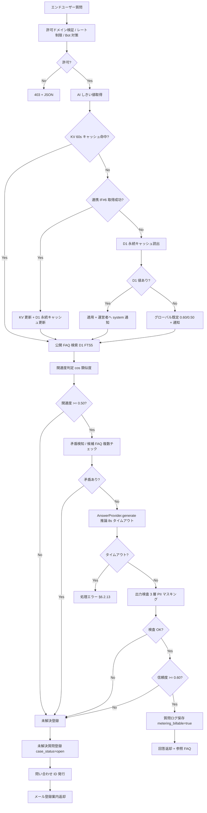

| 段階 | 説明 | 関連 FR / NFR |
|---|---|---|
| AI しきい値取得 | KV(TTL 60s) → 連携 IF #6 → D1 永続キャッシュ → グローバル既定値 の 4 段階フォールバック。フォールバック時は `x-ai-threshold-source: fallback-d1` または `fallback-default` をログ記録 | FR-341 |
| FAQ 検索 | D1 FTS5 全文検索、`status='published'` の条件必須 | FR-050 / FR-300 |
| 関連度判定 | Workers AI の埋め込みモデルで cos 類似度、しきい値 0.50(プロジェクト > オーナー > グローバル の 3 階層適用) | FR-055 / §8.6.1 |
| 矛盾検知 | 簡易ルールベース(同一カテゴリ + キーワード反転) | FR-054 / §6.4.1 |
| 推論 | AnswerProvider 経由、タイムアウト 8 秒(FR-340)。失敗は処理エラー(§6.2.13) | FR-340 / §8.5 |
| 出力検査 | 正規表現 / FAQ 整合性検査、PII は `[情報型]` 形式でマスキング | FR-060 / §6.4.2 |
| 信頼度判定 | 0.60 未満は未解決登録、0.05 差未満の複数候補は併記(FR-055) | FR-055 |
| 課金フラグ | 推論成功時のみ `metering_billable=true`、失敗時は `false`(§8.11.1) | FR-120 |

#### 6.2.2 解決しなかった押下フロー(参照: FR-071 / AC-005)

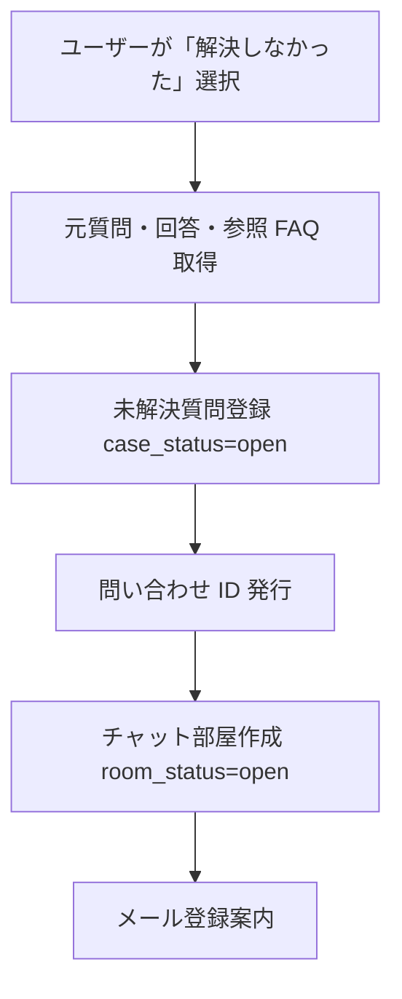

#### 6.2.3 個別チャット返信フロー(参照: FR-085〜087)

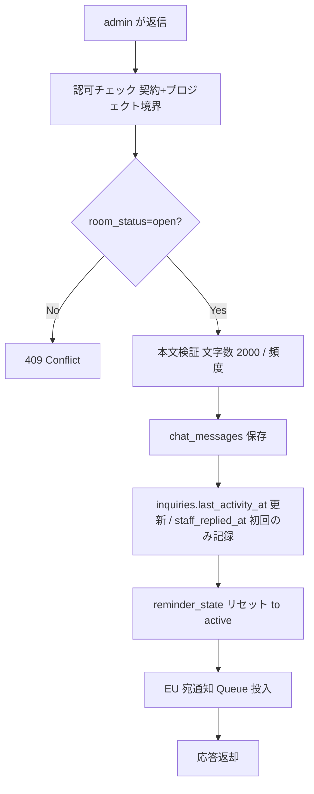

エンドユーザー側の返信も同様のフロー。差分は (a) 投稿頻度制限 10 件/分(FR-090)、(b) admin 宛通知の送信、(c) `reminder_state` がリセット対象から外れる段階(段階 3 のみ EU 投稿のみで判定、§6.2.6 参照)。

#### 6.2.4 メール通知 Queue フロー(参照: FR-141 / FR-147 / NFR-506)

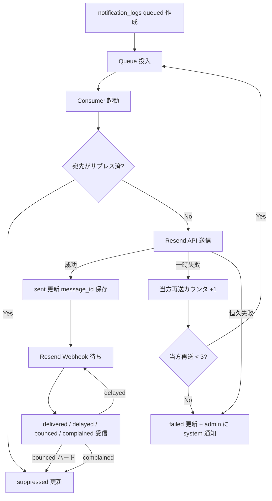

| 観点 | 仕様 |
|---|---|
| 当方再送(NFR-506) | 最大 3 回、最大遅延 24 時間。3 回失敗で admin に system 種別お知らせ |
| Resend 自動再送 | `email.delivery_delayed` で Resend が裏で再送中。**当方の再送カウンタには含めない**(NFR-506) |
| 当方再送のカウント基準 | Resend が `bounced` / `failed` を確定通知した後の当方による再キュー投入回数 |
| サプレス判定 | `optout` 判定は admin 宛通知のみ参照(`/me/notification-preferences`、§9.1.1)。エンドユーザー宛は FR-143 によりオプトアウト不可、`optout=false` 固定 |
| 強制送信フラグ ○ | `optout` 設定に関わらず常に送信(規約改定・課金・セキュリティ通知等) |

#### 6.2.5 Resend Webhook フロー(参照: 要件 §11.3 / NFR-310 / NFR-505)

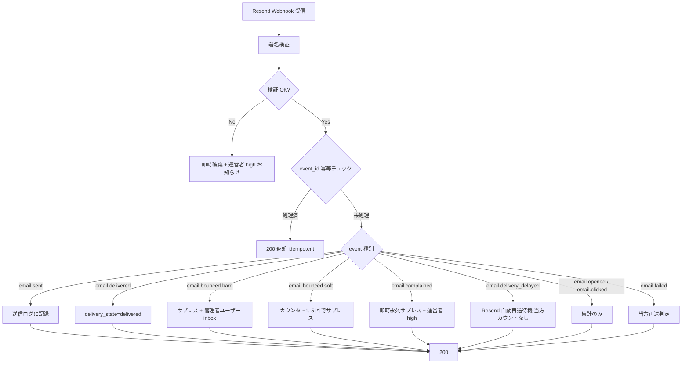

詳細イベント処理表は §9.3.1 を参照。サプレスリスト・復帰フローは §9.3.2 を参照。

#### 6.2.6 個別チャット自動クローズフロー(参照: FR-089 / 要件 §8.8.1 / NFR-501)

要件 §8.8.1 の 6 段階フローを基本設計レベルで以下のステートマシンとして展開する(状態遷移図は §4.4 参照)。

**フロー段階表**:

| 段階 | トリガ条件 | 経過時間 | 「返信なし」判定対象 | 通知 | 次状態 |
|---|---|---|---|---|---|
| 段階 1 | 最終投稿から経過 | 7 日 | EU・admin・admin 全員 | admin へ CHAT_HOLD_CHECK | `stage1_pending_admin` |
| 段階 1 自動進行(MVP 初期値) | admin 判断未入力のまま経過 | 14 日 | - | なし | `stage2_user_check_sent`(自動的に「利用者待ち」判定) |
| 段階 2 | admin「利用者待ち」判定 | 即時 | - | EU へ CHAT_RESOLUTION_CHECK | `stage2_user_check_sent` |
| 段階 3(中間) | 段階 2 から EU 投稿なし | 7 日 | **EU のみ**(admin 投稿はカウントしない) | なし(中間ステート) | `stage3_user_no_response`(Cron 同周期で `stage4_final_check` へ即時遷移) |
| 段階 4 | 段階 3 から即時 | - | - | EU へ CHAT_FINAL_CONFIRM | `stage4_final_check` |
| 段階 5(中間) | 段階 4 から EU 投稿なし | 7 日 | **EU のみ** | なし(中間ステート) | `stage5_final_no_response`(Cron 同周期で `stage6_auto_closed` へ即時遷移) |
| 段階 6 | 段階 5 から 3 日後 | 3 日 | - | EU へ CHAT_AUTO_CLOSED | `stage6_auto_closed`(`room_status=closed`) |
| 再オープン | 30 日以内に EU 再アクセス | - | - | なし | `active`(同 `room_id` 再オープン) |
| 完全終了 | 30 日経過 | - | - | EU へ「新規部屋作成案内」 | 新規 `room_id` 発行 |

**実装方式**:

| 観点 | 採用方式 |
|---|---|
| トリガ | Cloudflare Cron Triggers(**5 分間隔**)で `room_status=open` の部屋を走査 |
| 状態管理 | `chat_rooms.reminder_state` 7 値(`active` / `stage1_pending_admin` / `stage2_user_check_sent` / `stage3_user_no_response` / `stage4_final_check` / `stage5_final_no_response` / `stage6_auto_closed`)+ `chat_rooms.last_reminder_at`。`stage3` / `stage5` は Cron 評価時の中間ステートで滞留時間を持たない |
| カウンタリセット | 段階 1 では誰かから投稿で `active` 復帰。段階 2 / 4 / 中間段階(3 / 5)では EU 投稿のみで `active` 復帰 |
| 通知失敗時 | Resend バウンス時は 24 時間後に 1 回だけ再送(計 2 回まで)。最終的に再送失敗した場合は自動クローズを実行せず、admin に system 種別お知らせを生成し判定をスキップ(FR-089) |
| 案件状態への作用 | **`case_status` には作用しない**(`room_status` のみ)。BR-020 と整合 |
| 段階 1 → 14 日自動進行 | 14 日固定 |

#### 6.2.7 サスペンションフロー(支払い失敗 / トライアル終了 の 2 経路)(参照: 要件 §9.10 / FR-124 / FR-129 / FR-137 / FR-138)

```mermaid
flowchart TD
  subgraph Trigger[起点]
    P1[支払い失敗 連携 IF#1 受信]
    P2[運営者手動停止 連携 IF#1 受信]
    P3[トライアル終了 メイン Cron]
  end
  P1 --> G1[reason=payment_failure_grace_expired<br/>7 日猶予タイマー開始]
  P2 --> G2[reason=operator_manual / tos_violation<br/>即時 suspended]
  P3 --> G3[reason=trial_expired_no_payment_method<br/>即時 suspended]
  G1 --> G1a[猶予中 管理者ログイン可<br/>課金画面で支払方法更新可]
  G1a --> G1b{再課金成功?}
  G1b -- Yes --> Active[accounts.contract_status=active(オーナー行) 復帰]
  G1b -- No --> S1[7 日経過 accounts.contract_status=suspended(オーナー行)]
  G2 --> S2[5 秒以内に全セッション無効化 FR-022]
  G3 --> S3[既存セッション継続 課金 / エクスポート / 退会のみ]
  S1 --> SusGate[認可ゲート 課金 / エクスポート / 退会のみ アクセス可<br/>ウィジェット応答 API は HTTP 423]
  S2 --> SusGate
  S3 --> SusGate
  SusGate --> Unblock{解除条件?}
  Unblock -- 支払い成功 --> Active
  Unblock -- 経過 --> DeleteFlow[運営者が退会・削除フローに移行 §9.10 段階 7]
```

| 観点 | 仕様 |
|---|---|
| 起点イベント | 連携 IF #1(顧客管理 → メイン)受信、または メイン Cron(トライアル終了判定 JST 00:00) |
| `reason` 値 | `payment_failure_grace_expired` / `operator_manual` / `tos_violation` / `trial_expired_no_payment_method` |
| セッション扱い | `operator_manual` / `tos_violation` は **5 秒以内に全セッション無効化**(FR-022)、その他は既存セッション継続 |
| 認可ゲート | `accounts.contract_status=suspended`(オーナー行) 中は **課金画面・データエクスポート画面・退会画面のみアクセス可**、それ以外は 403、ウィジェット応答は 423(FR-138) |
| 解除条件 | 顧客管理側の連携 IF #1 受信(支払い成功 / 運営者解除)で `accounts.contract_status=active(オーナー行)` へ |
| 猶予期間 | 支払い失敗起点は 7 日(FR-137)。トライアル終了は **猶予なし即時**(FR-129 / §9.10.3) |

#### 6.2.8 退会・解約フロー(参照: 要件 §14.7.2 / FR-009 / FR-163 / FR-167)

```mermaid
flowchart TD
  A[admin が SCR-024 で退会申請] --> B[再認証 FR-005]
  B --> C[accounts.contract_status=deleted(オーナー行)_pending]
  C --> D[ウィジェット応答停止 新規 FAQ 登録不可]
  D --> E[当月末まで利用可]
  E --> F[月末締めで利用停止 月割りなし]
  F --> G[30 日エクスポート猶予開始]
  G --> J[物理削除バッチ実行 accounts.contract_status=deleted(オーナー行)]
  J --> K[Tenant D1 全削除 + announcement_recipients 削除]
```

| 観点 | 仕様 |
|---|---|
| 解約予告期間 | 当月末まで利用可、**月末締めで停止**(予告期間なし) |
| データエクスポート猶予 | 退会確定から **30 日**、SCR-016 から JSON / CSV エクスポート可 |
| 物理削除 | 30 日経過後にバッチで物理削除(NFR-704 と整合) |
| クーリングオフ | B2B サービスのため特商法適用外(要件 §16.1)。利用規約に明示 |
| 月途中の日割り | しない(FR-125) |
| 未請求残高(クレジット)返金 | 返金しない旨を利用規約に明記 |
| 解約 vs 退会 | 解約申請(サブスクリプション終了)と退会(契約削除)は別フロー。解約後も猶予期間中はデータ参照可能 |

#### 6.2.9 規約改定フロー(参照: 要件 §14.7.3 / FR-011 / FR-164)

```mermaid
flowchart TD
  A[運営者が新規約を準備] --> B[発効 30 日前 inbox(announcement/critical)+ メール + ステータスページ]
  B --> C{発効日到達?}
  C -- No --> D[契約単位で段階的に発効 全契約同日強制ではない]
  C -- Yes --> E[新規約発効]
  E --> F[ログイン時に同意状況チェック]
  F --> G{同意済み?}
  G -- Yes --> H[通常画面へ]
  G -- No --> I[SCR-025 規約再同意割込み]
  I --> I1{同意期限 14 日以内?}
  I1 -- Yes --> J{同意?}
  J -- Yes --> H
  J -- No --> K[退会フロー SCR-024 へ誘導]
  I1 -- No --> L[機能制限ガード 課金画面操作と新規プロジェクト作成は不可<br/>FAQ 編集とウィジェット稼働は継続]
```

| 観点 | 仕様 |
|---|---|
| 通知タイミング | 改定発効日の **30 日前** |
| 通知経路 | inbox(announcement / critical)+ メール(強制送信)+ ステータスページ |
| 同意期限 | 発効日 + **14 日**(計 44 日の余裕) |
| 同意期限超過時 | SCR-025 強制割込み。ログイン自体は可能、機能制限(FAQ 編集とウィジェット稼働は継続、課金画面操作と新規プロジェクト作成は不可) |
| 段階的実施 | 契約単位で発効日を分散させる(全契約同日強制ではない) |
| 非同意時 | 管理者ユーザーが「不同意」を明示した場合は退会フロー(SCR-024)へ誘導 |

#### 6.2.10 課金月次集計・確定 cron フロー(参照: 要件 §8.11.1 / FR-148)

```mermaid
flowchart TD
  A[UTC 15:00 = JST 月初 00:00 cron 起動] --> B[全契約の当月利用量集計]
  B --> C[usage_metering テーブル更新 metering_billable 含む]
  C --> D[FAQ 件数スナップショット 月末 23:59:59 JST 時点]
  D --> E[個別チャット部屋数集計 再オープンはカウントなし]
  E --> F[AI 利用コスト 原価 集計]
  F --> G[JST 02:00 = UTC 17:00 月次確定 cron 起動]
  G --> H[idempotent key owner_account_id+billing_year_month チェック]
  H --> H1{既存請求あり?}
  H1 -- Yes --> Z1[200 OK 何もしない 冪等性]
  H1 -- No --> I[請求金額計算 無料枠超過分のみ 1 円単位切上]
  I --> J[billing_invoices.status=issued]
  J --> K[Stripe API 経由で請求書発行]
  K --> L[BILLING_INVOICE_ISSUED メール送信 + inbox(billing/normal)生成 FR-148]
  L --> M[支払い結果待ち Stripe Webhook 経由 連携 IF#10]
```

| 観点 | 仕様 |
|---|---|
| 集計バッチ | UTC 15:00(= JST 月初 00:00)起動 |
| 確定 cron | JST 02:00(= UTC 17:00)起動 |
| idempotent key | `(owner_account_id, billing_year_month)` の複合キー、再実行で既存請求があれば 200 OK で何もしない |
| 月境界 | JST 月初 00:00:00 〜 月末 23:59:59(UTC では前月 15:00 〜 当月 14:59) |
| 無料枠 | 暦月で毎月リセット(契約日基準ではない)。初回契約月のみ日割り |
| 丸めルール | 質問数・チャット数は整数、AI コストは内部で小数点以下 4 位、請求時は 1 円単位切上 |
| `metering_billable` | 失敗時は `false` で課金対象外 |
| 訂正請求 | 運営者の手動操作のみ(自動発行禁止)、Stripe Credit Note API 経由で翌月請求に反映 |

#### 6.2.12 個別チャット再入室フロー(参照: FR-083 / FR-084)

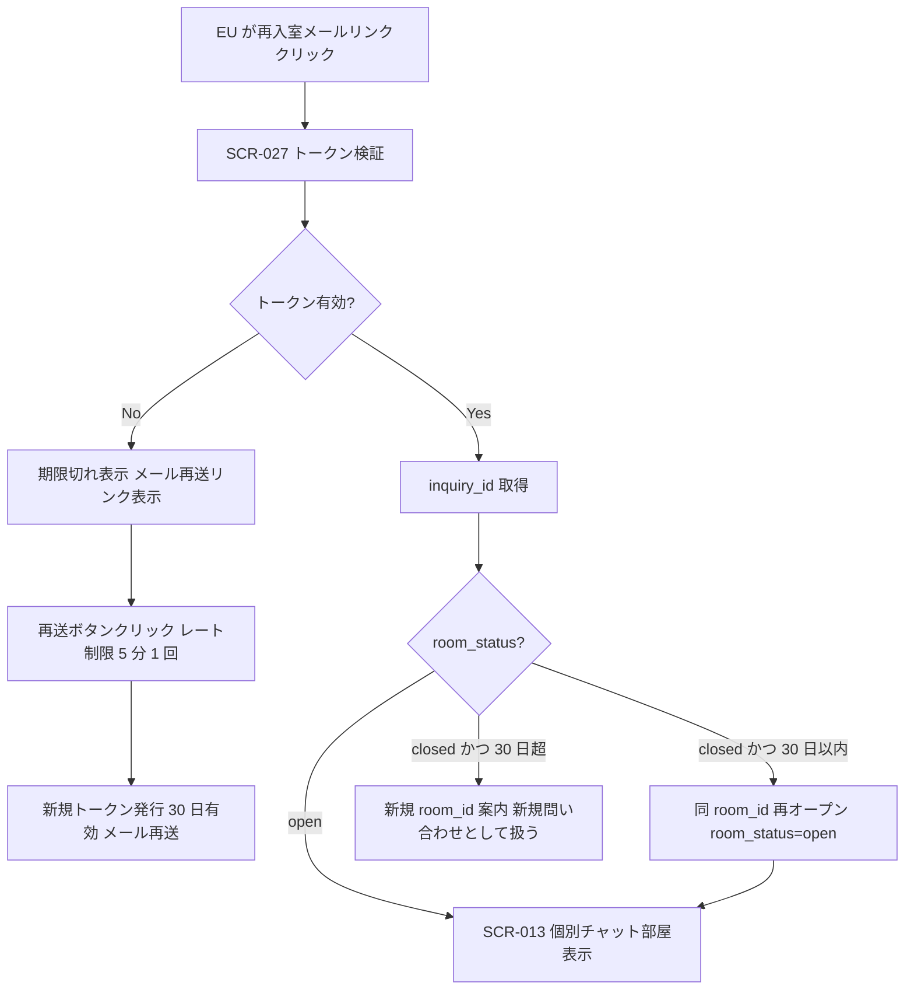

| 観点 | 仕様 |
|---|---|
| トークン形式 | 不透明文字列 + HMAC-SHA256(オーナー派生鍵、§10.1.3) |
| トークン有効期限 | 30 日(FR-084) |
| 期限切れ救済 | メール再送リンク(レート制限 5 分以内 1 回まで)、新規トークン 30 日有効を発行 |
| 同一メールで複数 `inquiry_id` の識別 | トークン内に `inquiry_id` を含めて識別(FR-084) |
| 30 日以内の再アクセス | 同 `room_id` を再オープン(FR-088) |
| 30 日超過 | 新規 `room_id` を発行、新規問い合わせとして扱う |

#### 6.2.13 処理エラー分類・分岐フロー(参照: 要件 §8.10.1 / FR-110〜FR-114)

要件 §8.10.1 のエラー分類 × 挙動マトリクスを基本設計レベルで実装方針として展開する。

| カテゴリ | 該当エラー例 | 自動リトライ | 利用者提示 | HTTP コード | 監査ログ | 未解決登録分岐 |
|---|---|---|---|---|---|---|
| A. 透過再試行可 | 一時ネットワーク断、上流 502/503/504、DB 一時的接続断 | サーバ側で指数 BO 3 回 | 失敗確定後「しばらくしてから再度お試しください」 | 200(成功時)/ 503(リトライ後失敗) | エラー件数のみ | しない |
| B. ユーザー再試行 | レート制限超過(429)、ロック中操作(423) | しない | 「再試行してください」+ 待機時間表示 | 429 / 423 | しきい値超過時のみ | しない |
| C. 即時 fail-fast | バリデーション違反(400)、認可エラー(401/403)、リソース不在(404)、楽観ロック衝突(409)、形式エラー(422) | しない | 該当エラー固有のメッセージ + 是正操作案内 | 400 / 401 / 403 / 404 / 409 / 422 | 認可エラー(401/403)は必須記録 | しない |
| D. 未解決登録分岐 | AI 信頼度しきい値未達、参照 FAQ なし、AI 矛盾検知 | (該当しない) | 「個別チャットへ誘導」(§6.2.1) | 200(未解決登録成功時) | 質問ログとして記録 | **する**(§6.2.2) |

**重要原則**:
- カテゴリ A〜C は「処理エラー」であり、**未解決質問として自動登録しない**(FR-111)。
- カテゴリ D は本来「正常な業務分岐」であり、エラーではない。`error_code` ではなく `branch_reason`(`faq_not_found` / `confidence_below_threshold` / `faq_contradiction` 等)で記録。
- エラー記録には個人情報・認証トークン・パスワードハッシュを含めない(FR-114)。エンドユーザー入力は先頭 100 文字 + ハッシュのみ記録。
- 再試行ボタンの連打防止クールダウン 3 秒を備える(FR-112)。
- カテゴリ C のうち 5xx 系(`internal_server_error` 等)は運用確認できるように記録し、エラー ID を利用者にも提示(FR-113)。

### 6.3 機能と API の対応(概要)

| 機能 | 主な API | 認可 |
|---|---|---|
| 認証 | `/auth/register`, `/auth/login`, `/auth/logout`, `/auth/re-auth`, `/auth/password/reset-requests` | 公開(login)、認証済み(他) |
| メール確認 | `/auth/email-verifications/{token}` | 公開(トークン認証) |
| 管理者ユーザー管理 | `/admin-users`, `/admin-users/{id}`, `/admin-users/{id}/activation-email`, `/admin-users/activations/{token}` | admin |
| プロジェクト管理 | `/projects`, `/projects/{id}` | admin |
| FAQ 管理 | `/projects/{id}/faqs`, `/projects/{id}/faqs/{faqId}`, `/projects/{id}/faqs/import`, `/projects/{id}/faqs/export`, `/projects/{id}/faqs/{faqId}/draft-from-ai` | admin |
| ウィジェット | `/widget/bootstrap`, `/widget/ask`, `/widget/feedback` | end_user(公開キー + セッション) |
| 未解決質問 | `/inquiries`, `/inquiries/{id}`, `/inquiries/{id}/close` | admin |
| チャット | `/inquiries/{code}/email-registration`, `/chat/rooms/{id}`, `/chat/rooms/{id}/messages`, `/chat/rooms/{id}/reopen`, `/chat/reentry-links/{token}` | admin / end_user(本人) |
| FAQ 改善 | `/inquiries/{id}/faq-drafts` | admin |
| 通知 | (内部 Queue) `/webhooks/resend` | 署名検証のみ |
| 利用量・課金 | `/billing/summary`, `/billing/subscription`, `/billing/invoices`, `/billing/budget` | admin |
| データ管理 | `/data/export` | admin |
| お知らせ受信箱 | `/me/announcements`, `/me/announcements/{id}`, `/me/announcements/{id}/read`, `/me/announcements/read-all`, `/me/announcements/unread-count` | **admin 限定。end_user は 403**(FR-186 / AC-031) |
| 通知設定(オプトアウト) | `/me/notification-preferences` | admin のみ。end_user は提供しない(FR-143、§9.1.1) |
| 規約同意 | `/me/terms-agreements`, `/me/terms-agreements/current` | 全認証ユーザー |
| 退会 | `/me/withdrawal-requests` | admin |
| アクティブセッション | `/me/sessions`, `/me/sessions/{id}` | 全認証ユーザー |
| 連携 IF #1〜12 受信 | `/internal/admin-integration/v1/...`(詳細は §8.7.5、§8.8) | mTLS + 短期 JWT(`audience=main`) |

詳細スキーマは詳細設計書を参照。

### 6.4 AI 回答機能の方式

#### 6.4.0 AI スコアリング定義(参照: 要件 §8.6.1)

要件 §8.6.1 の WHAT を受け、本節を AI スコアリング方式の正本とする。

| 指標 | 測定方法 | 値域 | MVP 初期値 | 設定階層 |
|---|---|---|---|---|
| 関連度(relevance) | 質問と FAQ の埋め込みベクトル cos 類似度(Workers AI 上の埋め込みモデルで計算) | 0.0〜1.0 | 0.50 | グローバル < オーナー < プロジェクト |
| 信頼度(confidence) | 関連度 × LLM 自己申告スコア(プロンプトで 0〜1 で出力させる)× 差分ボーナス(差 ≥ 0.05 で +0.1) | 0.0〜1.0 | 0.60 | グローバル < オーナー < プロジェクト |

**動作ルール**:
| 条件 | 動作 |
|---|---|
| 関連度 < 0.50 | FAQ に該当なし → 未解決質問として登録 |
| 関連度 ≥ 0.50 かつ 信頼度 < 0.60 | 「参考 FAQ あり、確認推奨」として根拠提示のみ |
| 信頼度 ≥ 0.60 | 確定回答として提示 |
| 複数 FAQ 候補で信頼度差 < 0.05 | 上位 2 件を併記して断定回答を避ける |

**適用順位**: プロジェクト > オーナー > グローバル(より具体的な設定が優先、FR-055)。

#### 6.4.1 矛盾検知(参照: FR-054)

複数の候補 FAQ(関連度しきい値を超えた FAQ が 2 件以上)が選定された場合、それらの間で内容の食い違いを検出する。検出時は AI 整形を行わず、未解決登録に倒す。

| 検知対象 | 方式 |
|---|---|
| 数値の差異 | 数字トークン正規表現抽出 + 比較 |
| 固有名詞の差異 | 正規表現・辞書ベースの差分比較 |
| 手順の差異 | 箇条書き項目数 / 手順キーワードの差分 |

検出時の処理: 矛盾検知 → 信頼度を強制ダウン(0.0)→ 未解決登録(`reason_code=contradiction`)。

#### 6.4.2 出力検査・マスキング設計(参照: FR-060 / NFR-805 / R-019)

| 観点 | 方針 |
|---|---|
| 対象範囲 | AI 回答(ウィジェット / 個別チャット内の AI 整形応答)とチャット投稿(エンドユーザー側・管理者ユーザー側の双方) |
| 第 1 層(正規表現) | 電話番号、メールアドレス、クレジットカード番号(Luhn チェック)、マイナンバー(チェックディジット)、銀行口座番号、郵便番号、IPv4 / IPv6 等の定型パターン |
| 第 3 層(参照 FAQ 整合性) | AI 回答に対し、参照 FAQ 本文に存在しない固有名詞・数値・手順を検査。誤検出防止のため FAQ 本文に同一文字列が含まれる場合はマスキング抑止 |
| 外部送信不可ルール | 検出器は Cloudflare ネットワーク内で完結(Workers AI + 正規表現)。OpenAI Privacy Filter 等の外部 API は使用しない(NFR-805) |
| マスキング形式 | `[情報型]` 形式(例: `[電話番号]` `[氏名]` `[メールアドレス]`)。**`***` 形式は採用しない**(可読性優先、FR-060) |
| 検出時の挙動 | AI 回答に参照 FAQ 外要素を検出 → 回答を返却せず未解決登録 / AI 回答に PII 検出 → マスキング + 監査ログ記録 / EU 投稿に PII → 警告表示「機密情報を含めないでください」、投稿は受け付ける / 管理者ユーザー投稿に PII → 警告 + 「このまま送信」オプション |
| 誤検出報告フロー(AC-036) | 報告起動元: 管理者ユーザーの SCR-013 / 管理者の SCR-012 / 運営者の SCR-098 各画面の「誤検出として報告」操作 → 運営者の SCR-098(PII 誤検出報告管理)に集約 → 運営者は **3 営業日以内** に判定 → ルール更新パッチを反映 |

#### 6.4.3 AI しきい値の 3 階層適用と即時反映(参照: FR-055 / FR-341)

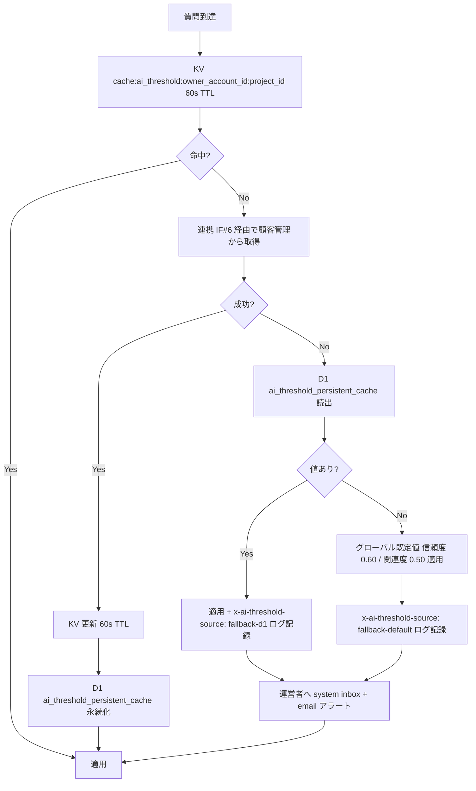

| 観点 | 仕様 |
|---|---|
| 階層適用 | プロジェクト > オーナー > グローバルの順に解決(FR-055) |
| KV キャッシュ | TTL 60 秒(FR-341)。明示的キャッシュ無効化 API `/internal/cache/ai-threshold/invalidate` を併設 |
| 連携 IF #6 受信時 | KV 更新 + D1 `ai_threshold_persistent_cache` テーブルに永続化(`scope`(`global`/`owner`/`project`)、`version`、`relevance_threshold`、`confidence_threshold`、`received_at` 等のカラム、§7.1) |
| フォールバック優先順位 | KV → 連携 IF #6 → D1 永続キャッシュ → グローバル既定値(0.60 / 0.50) |
| アラート | フォールバック発動時は運営者へ system 種別 inbox + email |
| 顧客管理復旧後 | §8.7.6 の手順 3 に従い KV 強制無効化 + 再取得 |

#### 6.4.4 プロンプト注入対策(参照: FR-058 / NFR-307 / R-002 / R-018)

| 対策 | 実装方針 |
|---|---|
| (a) システムプロンプト固定 | サーバ側で固定し、ユーザー入力は `<user_question>...</user_question>` タグで囲んで AI に渡す |
| (b) タグ脱出検知 | ユーザー入力中の `</user_question>` などのタグ風文字列および「指示上書き系トークン」(例: `ignore previous instructions`)を検知してエスケープ・監査ログ記録 |
| (c) 出力側フィルタ | LLM 応答に「FAQ に記載なし」キーワードが含まれた場合は強制的に未解決登録(§6.4.2 第 3 層と連動) |
| (d) 回帰テスト | 攻撃パターン(役割再定義 / タグ脱出 / コード注入 / 言語切替誘導)を含む回帰テストセット 20 ケース以上を AI モデル更新時およびプロンプト変更時に実行(AC-035) |

**2 段構えの合格基準(AC-019 × AC-035)**:
- AC-019(大規模スイート、社内 100 ケース以上): **合格率 95% 以上**(統計的合格基準)
- AC-035(必須 20 ケース): **全件合格 100%**(ブロッカー基準)
- 両方を満たさない限り本番リリース停止 → プロンプト改修・テストケース見直し → 再試験

#### 6.4.5 AI モデル切替時の回帰テスト(参照: FR-059 / FR-342 / R-017)

| 観点 | 仕様 |
|---|---|
| テストセット | FAQ × 想定質問のペアを最低 50 組 |
| 劣化判定(a) | 回答可能率(信頼度 0.60 以上で確定回答できた質問の割合)が直前バージョンより **5pt 以上低下** で「劣化」 |
| 重大劣化判定(b) | 誤回答率(回答内容が FAQ と意味的に矛盾)が **2% を超える** で「重大劣化」 |
| 自動ロールバック | 重大劣化検出時はモデルバージョン固定で自動ロールバック、運営者へ即時通知 |
| 観測メトリクス | 回答可能率・解決率・矛盾理由コード分布・PII 検出件数・参照 FAQ 数分布を 1 日 / 7 日 / 30 日の期間で時系列観測 |
| プロンプトテンプレート | **運営者管理のみ**(FR-342) |
| 回帰テスト連動 | プロンプト編集時に AI 品質回帰テスト(FR-059)を連動実行、合格しないと本番反映不可 |
| テストセット管理 | 運営者(顧客管理 FR-220)が管理 |

### 6.6 課金・利用量機能の方式(参照: 要件 §8.11.1 / FR-120〜FR-129 / FR-136〜FR-139)

#### 6.6.1 課金単位表(方式正本、参照: 要件 §8.11.1)

要件 §8.11.1 の課金対象・初期値を受け、本節を計測、失敗時扱い、月次起点、丸め、超過時アクションの方式正本とする。

| 項目 | 計測単位 | 計測タイミング | 失敗時の扱い | MVP 無料枠初期値 | MVP 超過課金単価初期値 |
|---|---|---|---|---|---|
| 質問数 | 1 質問 = エンドユーザーが「送信」操作した 1 リクエスト | リクエスト到達時(同期) | AI 推論失敗時もカウントするが `metering_billable=false` | 1,000 件 / 月 | 0.5 円 / 件 |
| FAQ 件数 | 公開状態の FAQ 件数(下書き・非公開・削除除外) | 月末 23:59:59 JST スナップショット | n/a | 100 件 | 5 円 / 件 / 月 |
| 個別チャット部屋数 | 1 部屋 = 新規 `chat_room` レコード作成 1 件 | 部屋作成成功時 | 再オープン(自動クローズ後 30 日以内の同一 room_id 復活)はカウントしない | 30 部屋 / 月 | 30 円 / 部屋 |
| AI 利用コスト(原価) | 推論呼び出しトークン換算(社内可視化用) | 呼び出し成功時のみ | 失敗は計測のみ・課金対象外。再試行は最初の 1 回のみ計測 | サービス側吸収(MVP) | n/a(質問数単価に内包) |

#### 6.6.2 80/100/125% 三段階アクション(参照: FR-122 / §8.11.1)

| データ種別 | 80% 到達 | 100% 到達 | 125% 到達 |
|---|---|---|---|
| 質問数 | inbox 通知(billing / normal) | inbox + email(billing / high)。**拒否はしない**(エンドユーザー体験を優先、事後課金) | 同左 + 翌 1 時間レート制限を 1/2 + 運営者へエスカレーション |
| FAQ 件数 | inbox 通知 | 新規 FAQ 登録を **拒否**(既存編集は可) | 同左 + 運営者へエスカレーション |
| 個別チャット部屋数 | inbox 通知 | 新規部屋作成を **拒否**(既存返信は可) | 同左 + 運営者へエスカレーション |

#### 6.6.3 トライアル 14 日(参照: FR-129 / §9.10.3)

| 観点 | 仕様 |
|---|---|
| 期間 | MVP 初期値 14 日間 |
| 制限 | 通常無料枠と同じ(質問 1,000/月相当を 14 日按分 ≒ 466 件) |
| 終了時挙動 | 支払方法未登録の場合、**終了日翌日 00:00 JST に自動サスペンション**(課金開始ではない)、`reason=trial_expired_no_payment_method` |
| 通知 | トライアル開始日、残り 3 日、終了日に inbox(billing / normal)+ email |
| 起動 | メイン Cron(JST 00:00 daily) |

#### 6.6.4 Stripe Smart Retries 委譲(参照: §8.11.1 / FR-137 / §9.10.1)

| 観点 | 仕様 |
|---|---|
| 再課金リトライ | Stripe Smart Retries に委譲、独自リトライ実装は行わない |
| 失敗確定 | 最大 3 回失敗後にメイン側へ「決済失敗確定」イベント送信(連携 IF #1) |
| 猶予期間 | 7 日間(顧客管理側からのイベント受信時刻起点) |
| 猶予中の操作 | 管理者ユーザーは管理画面の課金画面・データエクスポート画面・退会画面のみアクセス可、それ以外は 403 |
| 解除条件 | 管理者ユーザーが課金画面から手動で支払方法更新 → 即時再決済 → 成功なら顧客管理側が解除イベント発火 → 連携 IF #1 で `accounts.contract_status=active(オーナー行)` |
| 訂正請求 | Stripe Credit Note API 経由、運営者の手動操作のみ(自動禁止) |

### 6.7 連携 IF #1〜#12 受信機能の方式(概要)(参照: 要件 §11.5)

詳細は §8.7 を参照。本節は機能ブロックレベルで概要を示す。

| IF # | 方向 | メイン側機能 | 主な処理 |
|---|---|---|---|
| 1 | 顧管 → メ | 契約停止イベント受信 | `accounts.contract_status`(オーナー行) 更新 + キャッシュ無効化 + セッション処理(`reason` に応じて) |
| 2 | 顧管 → メ | 強制ログアウト受信 | アクセストークン全失効 |
| 4 | 顧管 → メ | 復元実行受信 | 再認証トークン伝搬検証 + 復元実行 |
| 5 | 顧管 → メ | レート制限上書き受信 | `owner_quota_overrides` 更新 + KV 即時反映 |
| 6 | 顧管 → メ | AI しきい値受信 | KV 更新 + `ai_threshold_persistent_cache` 永続化 |
| 7 | 顧管 → メ | お知らせ生成受信 | `service_announcements` → fan-out Queue → `inbox_messages` |
| 8 | メ → 顧管 | 監視メトリクス提供 | 5 分間隔バッチ + Webhook 補完 |
| 9 | メ → 顧管 | 不正利用検知通知送信 | メイン側で検知 → イベント送信 |
| 10 | 顧管 → メ | 課金 Webhook 内部転送受信 | `event_id` 冪等性 + `billing_invoices.status` 更新 |
| 12 | 顧管 → メ | 運営者操作通知受信 | `inbox_messages`(announcement / system)生成 |

---

## 7. データ設計概要

### 7.1 主要エンティティ

要件 §12.1.1 主要エンティティ関連図を本書 ER モデリングの起点とする。**単一 D1 + owner_account_id 分離方式**(§2.6 / §20.2 確定済み)。**本表はエンティティ識別 + 主要 PK / FK + 業務的列挙値の概念レベルに留める**。物理スキーマ(列の物理型・NULL/DEFAULT・制約・インデックス・暗号化方式・ハッシュ方式・JSON 構造・改訂痕跡)は詳細設計書 §9.3 全テーブル DDL で確定する。

| エンティティ | 主要属性(PK / 主要 FK / 業務的列挙値) | 主用途 |
|---|---|---|
| `accounts` | `id` PK, `owner_account_id` FK(自己参照、オーナー行では自己参照、メンバー行では所属オーナーの id), `role`(`admin`/`service_operator`/`end_user` の 3 値、§3.1 と整合), `is_owner`(0/1 の 2 値、§7.1.1 / FR-015a / FR-333), `status`(`pending_verification`/`pending_activation`/`active`/`disabled` の 4 値、アクティベーション管理用), `contract_status`(`active`/`suspended`/`deleted_pending`/`deleted` の 4 値固定、オーナー行のみ意味を持つ。旧 `accounts.contract_status`(オーナー行) の役割を統合) | 認証情報・所属オーナー(`pending_activation` は招待アクティベーション前、SCR-017 / FR-016)。`is_owner=1` のアカウントは降格・停止・削除不可、課金・契約・GDPR削除の単位 |
| `account_permissions`(新規) | `account_id` FK + `permission_kind`(`faq:manage`/`chat:respond`/`users:manage`/`project:manage`/`logs:view` の 5 値、§3.2.0 と整合)を複合 PK、`granted_at` / `granted_by` を保持 | メンバーのメンバー権限フラグ。`is_owner=1` のアカウントは本テーブルに行を持たず、暗黙で全権付与とする(§7.1.1 設計案 A 採用) |
| `account_project_grants`(新規) | `account_id` FK + `project_id` FK を複合 PK、`granted_at` / `granted_by` を保持 | メンバーのプロジェクト割当。`is_owner=1` のアカウントは本テーブルに行を持たず、自オーナー配下の全プロジェクトに暗黙アクセス可。`is_owner=0` のメンバーは本テーブルに列挙されたプロジェクトのみアクセス可 |
| `sessions` | `id` PK, `account_id` FK | セッション管理(複数デバイス対応 FR-332、運営者強制ログアウト FR-022) |
| `projects` | `id` PK, `owner_account_id` FK, `status`(`active`/`deleted` の 2 値) | プロジェクト管理 + ウィジェット設定 |
| `project_legacy_keys` | `id` PK, `project_id` FK | ウィジェット公開鍵ローテーション時の旧キー保持(猶予期間後に cron で物理削除) |
| `allowed_domains` | `id` PK, `project_id` FK | 許可ドメイン(ワイルドカード形式可) |
| `faqs` | `id` PK, `owner_account_id` FK, `project_id` FK, `status`(`draft`/`published`/`hidden`/`deleted`), `source_unresolved_question_id` FK(任意) | FAQ 本体(NFR-601 監査トレース必須) |
| `faq_revisions` | `id` PK, `faq_id` FK, `source`(`manual`/`ai_draft`/`import`) | 改訂履歴(FR-322、全文スナップショット方式) |
| `faq_search_fts` | FTS5 仮想テーブル | FAQ 全文検索(FR-300) |
| `question_logs` | `id` PK, `owner_account_id` FK, `project_id` FK, `result_type`, `metering_billable` | 質問ログ |
| `question_log_faq_refs` | `question_log_id` FK, `faq_id` FK | 参照 FAQ(M:N) |
| `inquiries` | `id` PK, `owner_account_id` FK, `project_id` FK, `case_status`(4 値), `faq_candidate_status`(4 値), `assignee_account_id` FK | 未解決質問 |
| `inquiry_status_history` | `id` PK, `inquiry_id` FK | 状態変更履歴(FR-077) |
| `chat_rooms` | `id` PK, `inquiry_id` FK, `room_status`(`open`/`closed`), `reminder_state`(7 値、§4.4 と整合), `awaiting_party`(`none`/`user`/`staff`) | 個別チャット部屋(自動クローズ段階遷移) |
| `chat_messages` | `id` PK, `room_id` FK, `sender_type`(`admin`/`end_user`) | チャットメッセージ |
| `inquiry_contacts` | `id` PK, `inquiry_id` FK | エンドユーザーメール登録(NFR-319) |
| `access_tokens` | `id` PK, `purpose`(`invitation`/`reentry`/`password_reset`/`deletion_confirm`), `subject_account_id` FK / `subject_inquiry_id` FK | 各種トークン |
| `notification_logs` | `id` PK, `owner_account_id` FK, `inquiry_id` FK(任意), `chat_message_id` FK(任意), `delivery_state`(§4.5、9 値) | 通知ログ(NFR-319 PII 保護、保持期間 1 年 NFR-602a / §7.9) |
| `ai_threshold_persistent_cache` | `id` PK, `owner_account_id` FK(NULL = グローバル), `project_id` FK(NULL = オーナー / グローバル), `scope`(`global`/`owner`/`project`) | 連携 IF #6 経由 AI しきい値の永続キャッシュ(FR-341) |
| `email_suppression_list` | `email_hmac` PK, `reason`(`hard_bounce`/`soft_5x`/`complaint`/`reputation`) | 全契約横断サプレスリスト(FR-149b、R-003 共通ドメイン対策) |
| `audit_logs` | `id` PK, `owner_account_id` FK, `actor_account_id` FK(NULL 可), `actor_type`(`user`/`system`/`admin`), `retention_class`(`general`/`billing`/`operator_high_priv`) | 監査ログ(ハッシュチェーン + tombstone + 3 区分保持、NFR-602a/b/d) |
| `error_logs` | `id` PK, `owner_account_id` FK(NULL 可) | エラーログ(180 日、NFR-704) |
| `billing_subscriptions` | `id` PK, `owner_account_id` FK, `status` | Stripe サブスクリプション |
| `billing_invoices` | `id` PK, `owner_account_id` FK, `status`(`draft`/`issued`/`paid`/`failed`) | 月次請求書(7 年保持、NFR-602b) |
| `usage_metering` | `id` PK, `owner_account_id` FK, `metric_kind`(`question`/`faq`/`chat_room`/`ai_cost`), `metering_billable` | 利用量計測(§8.11.1 と整合) |
| `owner_quota_overrides` | `id` PK, `owner_account_id` FK, `resource_type`(`widget_ask_per_min` / `chat_post_per_min` / `email_per_hour` 等) | オーナー別レート制限上書き(連携 IF #5 受信先) |
| `service_announcements` | `id` PK, `importance`(`low`/`normal`/`high`/`critical`) | 運営者作成お知らせ(配信元、二層構成上層) |
| `announcement_recipients` | `announcement_id` FK, `owner_account_id` FK, `account_id` FK | 配信宛先(到達確認) |
| `inbox_messages` | `id` PK, `owner_account_id` FK, `recipient_account_id` FK, `category`(`billing`/`announcement`/`system`), `priority`(`low`/`normal`/`high`/`critical`) | 受信箱(二層構成下層、オーナー単位) |
| `withdrawal_requests` | `id` PK, `owner_account_id` FK | 退会申請(§6.2.8) |
| `terms_versions` | `id` PK | 利用規約・プライバシーポリシー バージョン |
| `terms_agreements` | `id` PK, `account_id` FK, `terms_version` FK | 同意履歴 |

#### 7.1.1 メンバー権限保持方式の設計案比較(本書 § 正本)

要件 v2.6 で導入したメンバーのメンバー権限フラグについて、本書では以下の 3 案を比較した上で **案 A(別テーブル方式)** を採用する。詳細 DDL・インデックス・マイグレーションは詳細設計 §9.3 / §9.7 で確定する。

| 設計案 | 概要 | メリット | デメリット | 採否 |
|---|---|---|---|:---:|
| **案 A 別テーブル `account_permissions`** | `(account_id, permission_kind)` 複合 PK + `granted_at` / `granted_by` を保持する関連テーブル。`is_owner=1` のアカウントは本テーブルに行を持たない(暗黙で全権) | (a) 監査トレースが行レベルで自然(`granted_by` / `granted_at` を保持)、(b) 将来の権限種別追加は `CHECK` 制約への値追加で可、(c) Principal 構築時は `accounts` LEFT JOIN `account_permissions` の 1 クエリで完結、(d) D1 でのインデックス効果が予測しやすい | (a) JOIN が必須(ただし Principal キャッシュで吸収) | **◎ 採用** |
| 案 B `accounts.permissions_bitmask`(5 ビット) | `accounts` 列にビットフラグで保持 | (a) JOIN 不要、最速 | (a) 行レベル監査列が持てない、(b) 権限種別追加時に `accounts` 列の意味変更がコード全域に波及、(c) ビット演算 SQL が読みづらい | × |
| 案 C `accounts.permissions_json`(JSON 配列) | JSON 列に `["faq:manage", ...]` で保持 | (a) JOIN 不要、(b) 拡張性 | (a) D1 の JSON クエリ性能が未保証、(b) 行レベル監査列が持てない、(c) 型安全がコード側依存 | × |

オーナー識別は **`accounts.is_owner=1` + `accounts.owner_account_id = accounts.id`(自己参照)** を採用する。MVP の `accounts.role` 値域(`admin` / `service_operator` / `end_user` の 3 値固定)は変更しない。1 アカウント = 1 オーナーであり、データ分離・課金・GDPR 削除の単位はオーナーアカウントが直接担う(旧 `accounts` テーブル(オーナー行)の役割を統合)。

メンバーのプロジェクト割当も同様に **別テーブル `account_project_grants` 方式** を採用する(`account_permissions` と同じ設計判断)。理由: 行レベル監査(`granted_by` / `granted_at`)、CHECK 制約での参照(`project_id` FK)の自然さ、Principal 構築 LEFT JOIN の単純さ。`is_owner=1` のオーナーは本テーブルに行を持たず、自オーナー配下の全プロジェクトに暗黙アクセス可。

### 7.2 ER 図(主要部分)

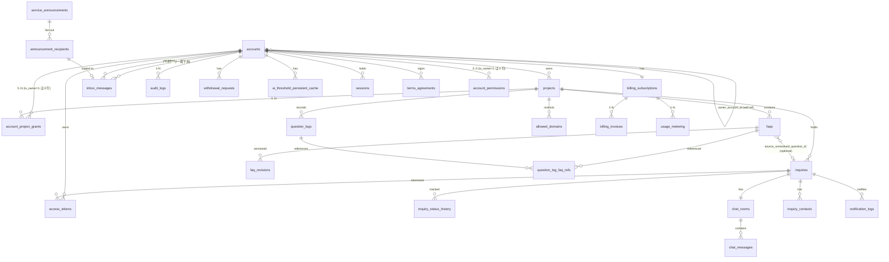

**主要なカーディナリティ規約**:
- 1 アカウント = 1 オーナーアカウントに固定(MVP、FR-335 と整合)
- 同一エンドユーザーが複数 `inquiry_id` を持ち得る(再質問するたびに新規発行)。`inquiry_contacts.email_hmac` で名寄せ可能(復号不要)
- `faqs.source_unresolved_question_id` は任意(NULL 可)。手動登録 FAQ では NULL、未解決質問起点の FAQ では FK 設定(BR-016 / FR-048 と整合)
- `inquiries.case_status` は **4 値**(`open` / `resolved` / `closed` / `faq_registered`)

詳細な物理スキーマ(全カラム DDL・型・NULL/DEFAULT・インデックス・外部キー制約)は詳細設計書 §13 で確定する。

### 7.3 主要関係性

| 関係 | 内容 |
|---|---|
| オーナー-アカウント | 1 対多。契約削除時にアカウントも削除対象 |
| 契約-プロジェクト | 1 対多 |
| プロジェクト-FAQ | 1 対多。FAQ はプロジェクトに帰属 |
| プロジェクト-未解決質問 | 1 対多 |
| 未解決質問-チャット部屋 | 1 対 1 |
| チャット部屋-メッセージ | 1 対多 |
| 未解決質問-FAQ | 0..1 対多。FAQ の登録元として参照可能(`source_unresolved_question_id`) |
| お知らせ-受信箱 | service_announcements(Control 上層)から `inbox_messages`(Tenant 下層)へ fan-out |

### 7.4 トレーサビリティ要件

| 起点 | 終点 | 経路 |
|---|---|---|
| 質問ログ | 参照 FAQ | `question_log_faq_refs` |
| 未解決質問 | 元質問ログ | `inquiries.question_log_id` |
| FAQ | 登録元未解決質問 | `faqs.source_unresolved_question_id`(BR-016 / FR-048) |
| 通知 | inquiry / chat_message | `notification_logs.inquiry_id` / `chat_message_id` |
| 監査ログ | 操作対象 | `audit_logs.target_type` / `target_id` |
| お知らせ | 配信元 | `inbox_messages.source_type` / `source_id` |

### 7.5 命名規則・型方針

| 対象 | 規則 |
|---|---|
| テーブル | snake_case 複数形 |
| 主キー | 文字列 ID(ULID) |
| 外部キー | `{table_singular}_id` |
| 日時 | TEXT(ISO 8601 UTC、NFR-1103) |
| 状態 | `status` または `{対象}_status` |
| 真偽値 | INTEGER 0/1 |
| JSON | TEXT 列に JSON 文字列で保存 |
| 暗号化 | `{column}_encrypted`(AES-256-GCM)+ `{column}_hmac`(検索用)の 2 列構成 |

### 7.6 インデックス方針

| 観点 | 方針 |
|---|---|
| FAQ 検索(D1 FTS5、FR-300) | `faqs_fts` 仮想テーブル、`(project_id, status='published')` の前段フィルタ |
| 未解決質問一覧 | `(owner_account_id, project_id, case_status, last_activity_at DESC)` |
| お知らせ一覧(NFR-106) | `(recipient_account_id, read_at)`、`(recipient_account_id, category, created_at DESC)` |
| 未読件数取得(NFR-106) | KV キャッシュ(キー `inbox:unread:<account_id>`、TTL 60 秒)+ DB フォールバック。受信箱イベント(生成・既読化・削除)で increment / decrement / 0 リセット |
| ユニーク | `inquiry_code`、`widget_public_key`、`access_tokens.token_hash`、`(owner_account_id, billing_year_month)` |
| 監査ログ | `(owner_account_id, created_at)`、`(retention_class, created_at)` で保持期間バッチ用 |

詳細な DDL は詳細設計書を参照。

### 7.7 お知らせの二層構成(Control Plane / Tenant)(参照: 要件 §12.5)

お知らせは Control Plane 相当の `service_announcements` / `announcement_recipients` と、Tenant 側の `inbox_messages` の二層で構成する。役割を明確に分離し、配信元と受信箱を別管理する(単一 D1 + owner_account_id 分離方式上では、論理的に Control / Tenant に分離するが、物理的には同一 D1 内のテーブル)。

| 層 | テーブル | 役割 |
|---|---|---|
| 配信元 | `service_announcements` | 運営者が作成した「運営からのお知らせ」の本体。本文・宛先範囲・公開日時等を保持 |
| 配信宛先 | `announcement_recipients` | `service_announcement` の宛先アカウント単位の到達記録。送信日時・配信失敗フラグ等を保持。**運営側の配信集計・到達確認のための監査用** |
| 受信箱 | `inbox_messages` | 管理者がアプリ内で閲覧するための受信箱本体。`category` / `source_type` / `source_id` で配信元を参照、`read_at` で既読状態を保持 |

#### 7.7.1 生成経路

| 種別 | 配信トリガ | `service_announcements` | `announcement_recipients` | `inbox_messages` |
|---|---|---|---|---|
| `announcement` | 運営者がお知らせを公開(連携 IF #7 受信) | ○(本体) | ○(宛先契約 × 管理者ごと) | ○(管理者ごと、fan-out Queue で写しを生成) |
| `billing` | 月次請求の確定(`BILLING_INVOICE_ISSUED`) | × | × | ○(対象契約の管理者ごとに直接生成) |
| `system` | 上限接近・超過、Workers AI 上限到達等の運用イベント | × | × | ○(対象契約の管理者ごとに直接生成。ヘッダベル + メール通知は重要度 high / critical のみ) |

`announcement` は運営側で配信集計が必要なため二層を経由するが、`billing` / `system` は契約内で完結するため `inbox_messages` のみに直接生成する。

#### 7.7.2 fan-out Queue ジョブ

`announcement` 配信時の処理:

1. 連携 IF #7 で運営者から受信 → `service_announcements` を確定し、`announcement_recipients` を宛先範囲に応じて生成
2. 配信 Queue ジョブが `announcement_recipients` を順次読み取り、各 `inbox_messages` レコードを INSERT
3. 各レコード生成時に `inbox_messages.source_type='service_announcement'`、`source_id=service_announcements.id` を設定し、後から逆引き可能にする
4. メール通知が必要な場合は同 Queue で通知ログ(`notification_logs`)を生成し、Resend へ送信

#### 7.7.3 ライフサイクル整合(削除・無効化時のクリーンアップ)

| 契機 | クリーンアップ対象 | 処理 |
|---|---|---|
| アカウント無効化 | 該当 `account_id` の `inbox_messages`、`announcement_recipients` | 両テーブルから物理削除(FR-190) |
| アカウント退会 | 同上 | 同上 |
| 契約退会(猶予期間後) | 該当 `owner_account_id` の 契約系テーブル全削除 + `announcement_recipients` 該当分削除 | 退会処理ジョブで両方を削除 |
| お知らせ取り下げ(運営) | `service_announcements`(取下げ印)、`announcement_recipients`、`inbox_messages` | 取り下げ Queue ジョブで全 fan-out 先の `inbox_messages` を削除または非表示 |

#### 7.7.4 重複生成対策(参照: R-012 / 要件 §12.5)

同一 `(owner_account_id, event_kind, dedup_key)` で 60 分以内に複数件発火した場合は 1 件に集約する。`dedup_key` の生成ルール(イベント種別ごと)は本書で確定する。

| イベント種別 | dedup_key 生成ルール | 集約期間 |
|---|---|---|
| `usage.threshold_80` | `(owner_account_id, usage_kind, threshold)` | 24 時間に 1 件 |
| `usage.threshold_100` | `(owner_account_id, usage_kind, threshold)` | 24 時間に 1 件 |
| `chat.auto_close_skipped` | `(owner_account_id, room_id)` | 1 件のみ(同部屋で複数回スキップ時は更新) |
| `webhook.signature_failed` | `(provider)` | 1 時間に 1 件 |
| `notification.bounce_high` | `(owner_account_id)` | 1 時間に 1 件 |
| `system.maintenance` | `(maintenance_id)` | 重複排除(同一 ID は 1 件のみ) |
| その他デフォルト | (集約しない) | 必ず生成 |

#### 7.7.5 お知らせ種別マッピング(参照: 要件 §12.5)

要件 §12.5 の WHAT を受け、本節で通知種別と配信方式を展開する。

| 種別 | 重要度 | 生成主体 | 主な発生イベント | オプトアウト | 配信経路 |
|---|---|---|---|---|---|
| billing | normal | メイン(自動・月次バッチ) | 月次請求確定(FR-148)、請求書 PDF 発行 | 不可 | inbox + email |
| billing | high | メイン(自動) | 支払い失敗、サスペンション開始(FR-137 / §6.2.7)、サスペンション解除、利用量 100% / 125% 到達 | 不可 | inbox + email |
| billing | normal | メイン(自動) | 利用量 80% 到達、無料枠残量警告、トライアル開始・残り 3 日・終了 | 不可 | inbox + email |
| announcement | normal / high / **critical** | 顧客管理(運営者操作) | メンテナンス予告、機能追加告知、規約改定告知(`critical`)、価格改定告知(FR-149)。連携 IF #7 経由 | high / critical は不可 / normal は可 | inbox + email |
| announcement | normal | メイン(自動) | 未解決質問の手動「終了」(FR-079)、復元実行通知 | 可 | inbox |
| system | normal | メイン(自動) | FAQ 利用上限 80% 接近 | 不可 | inbox + email |
| system | high | メイン(自動) | FAQ 利用上限 100% 到達、AI 利用上限到達、通知失敗急増、自動クローズ判定スキップ(FR-089)、Webhook 署名失敗(NFR-310) | 不可 | inbox + email + ステータスページ |
| system | high | 顧客管理(運営者操作) | 契約停止・強制ログアウト実行通知、不正利用検知時の自動ブロック通知 | 不可 | inbox + email |
| system | normal | メイン(自動) | ログインロックアウト発動(FR-007)= オーナー / メンバー(ユーザー管理権限保持)への情報提供。該当本人へは別途 email 直送 | 不可 | inbox(admin 宛)+ email(本人宛) |

### 7.8 データ削除モード(物理削除 / 匿名化)(参照: NFR-704)

アカウント設定(オーナー設定) `data_deletion_mode`(`physical` / `anonymize`、初期値 `physical`)で切り替える。

#### 7.8.1 対象データと匿名化規則

| 対象 | 物理削除 | 匿名化 |
|---|---|---|
| 質問ログ(`question_logs`) | レコード DELETE | `question_text` を空文字、`ip_address` / `user_agent` を NULL、集計値は維持 |
| 未解決質問(`inquiries`) | レコード DELETE | `question_text` 空文字、`closed_reason` 空文字、`inquiry_code` は維持 |
| チャットメッセージ(`chat_messages`) | レコード DELETE | `body` を空文字、`sender_type` のみ維持 |
| 連絡先(`inquiry_contacts`) | レコード DELETE | `email` を `anon_<sha256>@anon` 形式のハッシュに置換、`display_name` を「匿名」 |
| 通知ログ(`notification_logs`) | レコード DELETE | `recipient` を SHA-256 ハッシュに置換、本文 vars は空 JSON |
| アクセストークン(`access_tokens`) | レコード DELETE | (匿名化対象外、常に物理削除) |
| 監査ログ(`audit_logs`) | (削除しない、§7.9 tombstone) | (匿名化対象外) |

#### 7.8.2 切替の影響範囲

データ削除モード変更は、保持期間超過時の挙動に対して即時適用する。過去に削除済みのデータには遡及しない。

#### 7.8.3 担保

| 観点 | 内容 |
|---|---|
| 不可逆性 | 匿名化はメールアドレスのハッシュ化等、原文が復元できない置換のみ |
| アカウント設定(オーナー設定) | SCR-016 設定画面で管理者ユーザーが変更可。再認証必須 |
| 監査 | モード変更時は `audit_logs.action=owner.data_deletion_mode.change` を記録 |

### 7.9 監査ログ保持区分(参照: NFR-602a/b/c/d / §10.6)

**v2.0 で新規**: 監査ログを 3 区分に分けて保持し、tombstone 方式でハッシュチェーン連続性を維持する。

| 区分 | 値(`retention_class`) | 保持期間 | 対象 |
|---|---|---|---|
| 一般 | `general` | 1 年(NFR-602a) | 操作・チャット対応・FAQ 編集・ログイン等の業務操作 |
| 課金関連 | `billing` | 7 年(NFR-602b、電子帳簿保存法・国税通則法) | 請求発行・支払結果・サブスク変更・予算上限変更・サスペンション遷移・訂正請求等(`billing.*` / `invoice.*` / `payment.*` / `subscription.*` / `owner.suspend` プレフィックス) |
| 運営者高権限 | `operator_high_priv` | 5 年(NFR-602d、SOX 類似・係争耐性) | 削除データ復元・契約停止 / 復元 / 物理削除・AI 推論パラメータ変更・契約別レート制限上書き・お知らせ配信・運営者アカウント発行 / 無効化・課金 Webhook リプレイ・本番直接変更・監査ログエクスポート |

**保持期間判定**: `audit_logs.retention_class` 列で識別し、定期削除バッチで区分別に処理する。`action` コードプレフィックスから自動判定する初期マッピングを §10.6.5 で定義。

**tombstone 方式**: 保持期間経過後の削除、および退会確定による契約スコープ削除時は **本文(actor / target / IP / payload)を物理削除しつつ、`log_id` / `prev_hash` / `current_hash` / `deleted_at` を保持** する。tombstone は同一の `current_hash` を保持するため、NFR-306 / NFR-602c / NFR-604 の日次再計算で「ハッシュチェーンの連続性」は維持される(削除済み区間も含めて整合検証可能)。tombstone 自体は監査ログの保持期間を超えても削除しない(チェーン破断防止)。

### 7.10 エンドユーザー PII の取扱(参照: NFR-319)

| 観点 | 仕様 |
|---|---|
| 暗号化方式 | AES-256-GCM 列単位暗号化、オーナー派生鍵を使用(NFR-319) |
| エンドユーザーメール全般(`inquiry_contacts`、`accounts`) | 暗号化(AES-256-GCM)+ 検索用 HMAC ハッシュ別カラムで、復号せずに突合可能とする(NFR-319) |
| 鍵ローテーション | オーナー派生鍵は Master Key 年次ローテーション時に再 KDF。60 日 dual-decrypt 期間(NFR-321) |
| カード情報 | 本サービスでは保存せず Stripe へ委譲、PCI-DSS 範囲外化を維持 |

### 7.11 長期未完了案件の保持期間扱い(参照: NFR-706 / FR-079 / AC-024)

未解決質問が `case_status=open` のまま保持期間を超過しても、案件状態を `closed` へ自動遷移させない。FR-079 / AC-024 の「終了状態への自動遷移なし」を優先し、長期未完了案件は保持期間・容量管理の対象として扱う。

| 観点 | 仕様 |
|---|---|
| 保持起点 | `case_status=open` の未終了案件は作成日時を保持起点とする(NFR-706) |
| 状態遷移 | 自動で `closed` にしない。`closed` への遷移は admin の明示操作のみ |
| 保持期間超過時 | 削除・匿名化・R2 アーカイブなどの保持期間処理対象として扱う。処理方式は §11.4 / 詳細設計のデータ保持バッチで確定 |
| 通知 | 長期滞留の運用通知が必要な場合は inbox(system / normal)で admin に通知するが、通知は状態変更を伴わない |
| 監査ログ | 保持期間処理・アーカイブ実行のみ監査ログに記録し、`case_status` 変更ログは生成しない |
| 根拠 | FR-079 / AC-024 の状態要件と NFR-706 の保持起点定義を両立させるため |

---

## 8. 外部インターフェース設計概要

### 8.1 外部 I/F 一覧

| I/F | 方式 | 認証 | 主な利用 |
|---|---|---|---|
| **顧客管理システム連携** | HTTPS / JSON、サービス間 mTLS + 短期 JWT(ttl 5 分) | mTLS 証明書 + JWT(`audience=main` または `audience=admin`) | 連携 IF #1〜#12(§8.7) |
| 管理画面 API | HTTPS / JSON | Cookie + CSRF(Double Submit Cookie、NFR-311) | 管理画面操作 |
| ウィジェット API | HTTPS / JSON | 公開キー(`pk_live_<32-char base62>`)+ セッショントークン | エンドユーザー質問 |
| チャット API | HTTPS / JSON | 入室トークン(HMAC-SHA256)or Cookie | 個別チャット |
| Resend API | HTTPS / JSON | API キー(Workers Secrets Store) | メール送信 |
| Resend Webhook | HTTPS POST | 署名検証(NFR-310) | 配信状態通知 |
| Workers AI | Cloudflare 内部呼出 | Cloudflare アカウント binding | LLM 推論(`env.AI.run`) |
| Stripe API | HTTPS / JSON(顧客管理側経由) | API キー(Workers Secrets Store) | サブスクリプション操作 |
| Stripe Webhook | HTTPS POST(顧客管理側一次受信) | 署名検証(NFR-310)+ 連携 IF #10 内部転送 | 課金イベント |
| 管理者サイト → ウィジェット配信 | HTTPS GET | 公開 URL | スクリプト配信 |

### 8.2 API 共通仕様

| 項目 | 概要 |
|---|---|
| Base URL | `/api/v1`(管理画面 API) / `/widget/v1`(ウィジェット API) / `/internal/admin-integration/v1`(連携 IF 受信) |
| データ形式 | JSON(リクエスト / レスポンス) |
| エラー形式 | `application/problem+json`(RFC 7807) |
| 日時 | ISO 8601 + 末尾 Z(UTC)(NFR-1103) |
| ID 形式 | 内部は ULID(文字列)、表示用 ID は別採番(`INQ-<base62>` 等) |
| バージョニング | URL パスにバージョンを含める(`/v1/`) |
| ページング | カーソル方式 |
| CSRF | 管理画面の状態変更 API で Double Submit Cookie トークン検証(NFR-311) |
| CORS | NFR-312 に従う(§8.3.1) |

### 8.3 ウィジェット配信

| 項目 | 概要 |
|---|---|
| 配信元 | Cloudflare Pages |
| URL | `https://cdn.open-faq.com/widget.js`(本書中の `open-faq.com` は本書執筆時点の仮ドメイン、実際の運用ドメインはリリース時に確定) |
| 起動 | 埋め込みスクリプト → bootstrap API → セッショントークン取得 |
| 許可ドメイン | プロジェクト設定値と `Origin` / `Referer` を照合(`Origin` 第一、`Referer` フォールバック) |
| キャッシュ | 静的アセットは CDN キャッシュ。設定値は短時間キャッシュ(KV、TTL 60 秒) |

#### 8.3.1 ウィジェット保護フロー(参照: FR-151 / FR-173 / AC-020 / NFR-312)

```
1. クライアントが /widget/v1/bootstrap を呼出(widget_public_key を含む)
2. API Worker が widget_public_key を検証
3. リクエストの Origin / Referer を抽出
4. KV から projects.allowed_domains を取得(60 秒キャッシュ)
5. Origin が許可ドメインに一致するかを照合
   - 一致しない場合: HTTP 403 + JSON {"error":"domain_not_allowed"} を返却
   - 一致する場合: セッショントークン発行(短期、TTL 1 時間)
6. CORS レスポンスヘッダに許可 Origin のみ設定
```

**追加保護**:

| 観点 | 仕様 |
|---|---|
| 完全一致 + サブドメインワイルドカード | `*.example.com` 形式は明示的に登録が必要。IP アドレス・プロトコル指定は不可(要件 §11.2) |
| 拒否応答 | HTTP 403 + JSON(404 ではない、デバッグ容易性のため) |
| `Access-Control-Max-Age` | 600 秒(NFR-312) |
| 公開キー単独不十分対策 | 初回 bootstrap 時に短期セッショントークンを発行し、以降のリクエストはトークンと組み合わせて認証 |
| CSP `frame-ancestors *` | 許可ドメイン検証は本フローで完結。CSP では制限せず(NFR-313) |

#### 8.3.2 レート制限のオーナー単位上書き(参照: FR-128 / 連携 IF #5)

| 観点 | 仕様 |
|---|---|
| 保存先 | KV(キー `ratelimit:{owner_account_id}:{api_kind}`)、値 = `{ req_per_sec, req_per_min, monthly_limit, updated_at, valid_until }` |
| 更新元 | 顧客管理 SCR-093 から連携 IF #5(`POST /internal/admin-integration/v1/rate-limit/override`)経由 |
| 適用 | Worker は最大 60 秒キャッシュ後、KV を再取得して反映 |
| 永続化 | `owner_quota_overrides` テーブル(§7.1)に保存。KV 障害時のフォールバック先 |

#### 8.3.3 ウィジェット iframe sandbox / CSP(参照: NFR-313 / NFR-314)

| ヘッダ / 属性 | 値 |
|---|---|
| iframe `sandbox` 属性(NFR-314) | `sandbox="allow-scripts allow-forms allow-same-origin allow-popups"`(`allow-top-navigation` 付与しない) |
| ウィジェット CSP(NFR-313) | `default-src 'self' https://api.<service>; script-src 'self'; frame-ancestors *` |
| 管理画面 CSP(NFR-313) | `default-src 'self'; script-src 'self' 'nonce-<random>'; style-src 'self' 'nonce-<random>'; img-src 'self' data: https:; frame-ancestors 'none'` |
| HSTS(NFR-315) | 全 HTTP レスポンスに `Strict-Transport-Security: max-age=31536000; includeSubDomains; preload` を付与 |

#### 8.3.4 API キーローテーション(参照: FR-193 / FR-194 / NFR-322)

| 観点 | 仕様 |
|---|---|
| キー形式 | `pk_live_<32-char base62>` |
| 有効期限選択 | 7 日 / 30 日 / 90 日 / 180 日 / 365 日、無期限不可、デフォルト 1 年(FR-194) |
| ローテーション猶予 | 30 日。新キー発行と同時に旧キーは失効予告状態へ。猶予中は両キーで認証を許可(FR-193) |
| 警告ヘッダ | 旧キーでアクセス時に `Deprecation: true` および `Sunset: <expires_at>` ヘッダを付与 |
| 管理画面表示 | SCR-014 に「旧キー使用中」バッジを表示(NFR-322) |
| 漏洩検知時 | (a) Secrets Store の即時ローテーション、(b) 該当プロバイダの管理画面から旧キーを revoke、(c) 影響契約へ inbox(system / high)お知らせ、(d) 全運営者・管理者セッションの無効化(NFR-323) |

### 8.4 メール通知の方式

| 項目 | 概要 |
|---|---|
| 抽象化 | `EmailProvider` インターフェース(§8.6)。第一実装は `ResendEmailProvider`(NFR-903) |
| 送信元 | サービス共通ドメイン(`noreply@<service-domain>`) |
| From 表示名 | 契約 / プロジェクト名を含めて表示できる |
| Reply-To | 付与しない。本サービスからのメールは常に no-reply 送信とし、本文末尾に「このメールに直接返信せず、お手数ですが問い合わせ画面または各プロジェクトのお問い合わせ先からご返信ください」案内を含める。プロジェクト固有の連絡先メールは Reply-To には用いず、SCR-013 ウィジェットチャット上の「お問い合わせ先」表示にのみ利用する(FR-033c) |
| SPF | `v=spf1 include:_spf.resend.com -all`(要件 §11.3) |
| DKIM | セレクター `resend1._domainkey`、2048bit RSA |
| DMARC | `v=DMARC1; p=quarantine; pct=100; rua=mailto:dmarc@<service-domain>; ruf=mailto:dmarc@<service-domain>; aspf=s; adkim=s; sp=quarantine; fo=1` |
| Webhook イベント処理 | §9.3.1 を参照 |
| サプレスリスト | バウンス・苦情検知時のサプレスリストは全契約横断で共有(R-003)。復帰メカニズムは §9.3.2 を参照 |
| 送信レート | 契約全体 100 通/分、同一アドレス 10 通/分(運営者調整可、連携 IF #5) |
| 冪等性 | `event_id` で重複処理を防止(NFR-505) |
| シークレット | API キー、Webhook 署名鍵を Workers Secrets Store に保管、90 日ローテーション(NFR-323) |

### 8.5 AI 推論基盤の方式(Workers AI)

| 項目 | 概要 |
|---|---|
| 採用基盤 | Cloudflare Workers AI(Cloudflare 内部の LLM 推論) |
| 抽象化 | `AnswerProvider` インターフェース。第一実装は `WorkersAIAnswerProvider`(NFR-902) |
| 接続方式 | Workers の AI binding 経由(`env.AI.run(model, input)`) |
| 利用モデル | `@cf/meta/llama-3.1-8b-instruct` |
| タイムアウト | 8 秒(FR-340)、超過時は処理エラー(§6.2.13) |
| 入力 | 質問、FAQ 候補、ポリシー(FAQ 限定、新事実禁止) |
| 出力 | 回答可否、回答文、参照 FAQ、信頼度、理由コード |
| 切替 | 設定変更で実装(Provider 実装クラス、モデル名)を切り替え可能。回帰テスト連動(FR-059 / §6.4.5) |
| データ越境 | 推論は Cloudflare ネットワーク内で完結、外部 API へは送信しない |
| 学習利用禁止 | (a) Workers AI のデータ取扱契約で「顧客データを学習に利用しない」条項を確認、(b) AnswerProvider 抽象化レイヤで `learn=false` を強制送出、(c) Workers AI 側のログ無効化設定を維持、(d) プロバイダ差し替え時も同条件を満たすプロバイダのみ採用(NFR-405) |
| レート / 上限 | Workers AI の利用上限・クォータを監視、契約別レート制限(連携 IF #5)を Workers 側でも適用 |
| 障害時 | 推論失敗・タイムアウトは `provider_error` として処理エラー扱い、未解決質問登録には流さない(§6.2.13) |

#### 8.5.1 AnswerProvider インターフェース定義(参照: NFR-902 / R-007)

推論基盤は以下の TypeScript インターフェースで抽象化する。

```typescript
export type AnswerResult =
  | {
      kind: 'answered';
      answer: string;
      cited_faq_ids: string[];
      confidence: number;
    }
  | {
      kind: 'unanswerable';
      reason_code: 'no_match' | 'low_confidence' | 'contradiction' | 'output_inspection_failed';
    }
  | {
      kind: 'error';
      reason_code: 'provider_error' | 'timeout' | 'rate_limited';
    };

export interface AnswerProvider {
  generate(input: {
    question: string;
    candidate_faqs: Array<{ id: string; question: string; answer: string }>;
    policy: { faq_only: true; forbid_new_facts: true; learn: false };
    locale: 'ja-JP';
    timeout_ms: 8000;
  }): Promise<AnswerResult>;

  healthcheck(): Promise<{ ok: boolean; provider: string; model: string }>;
}
```

第一実装: `WorkersAIAnswerProvider`(Cloudflare Workers AI binding 経由)。
選択方法: 環境変数または KV 設定値(運営者システム 02_admin SCR-092 から更新可能)で実装クラスを切り替える。

#### 8.5.2 AI しきい値の取得・適用(参照: FR-055 / FR-341 / 連携 IF #6)

| 観点 | 仕様 |
|---|---|
| 取得元 | KV(60s TTL)→ 連携 IF #6 → D1 `ai_threshold_persistent_cache` → グローバル既定値(§6.4.3) |
| KV キー | `ai_threshold:<scope>:<owner_account_id>:<project_id>`(`scope` = `global`/`owner`/`project`) |
| 明示的キャッシュ無効化 API | `POST /internal/admin-integration/v1/cache/ai-threshold/invalidate`(連携 IF #6 と同伴) |
| 永続キャッシュ更新 | 連携 IF #6 受信成功時に `ai_threshold_persistent_cache` テーブルへ INSERT or UPDATE(`scope` + `owner_account_id` + `project_id` + `version` をキー) |
| フォールバック発動時のログ | `x-ai-threshold-source: cache-hit` / `if6-success` / `fallback-d1` / `fallback-default` を Workers Logs に記録 |

### 8.6 メール配信プロバイダ抽象化(参照: NFR-903)

メール配信プロバイダの差し替えに備え、以下のインターフェースを定義する。

```typescript
export interface EmailProvider {
  send(input: {
    to: string;
    from: string;
    reply_to?: string;
    subject: string;
    html: string;
    text?: string;
    headers?: Record<string, string>;
    idempotency_key: string;
  }): Promise<{ message_id: string }>;

  verifyWebhook(headers: Headers, body: string): Promise<{
    valid: boolean;
    event_type: 'sent' | 'delivered' | 'bounced' | 'complained' | 'delivery_delayed' | 'failed' | 'opened' | 'clicked';
    message_id: string;
    timestamp: string;
  }>;
}
```

第一実装: `ResendEmailProvider`。メール送信ロジックは本インターフェース経由で呼び出す。

### 8.7 メインシステム ↔ 顧客管理システム 連携 I/F(参照: 要件 §11.5)

#### 8.7.1 IF #1〜#12 用途・主管マトリクス(方式正本、参照: 要件 §11.5)

要件 §11.5 の WHAT を受け、本節を連携 IF の用途・主管整理の方式正本とする。

| # | 連携 IF | 方向 | 主管 | 用途 | 対応 FR(メインシステム) | 対応 FR(顧客管理システム) |
|---|---|---|---|---|---|---|
| 1 | 契約停止イベント | 顧管 → メ | 顧管(検知)/ メ(状態遷移実行) | サスペンション・規約違反対応(§6.2.7) | FR-022, FR-124, FR-137, §6.2.7 | FR-124, FR-224(a) |
| 2 | 強制ログアウト | 顧管 → メ | 顧管 | 契約停止連動・本人不正検知時 | FR-022 | FR-224 |
| 4 | 復元実行 | 顧管 → メ | 顧管 | 論理削除済みデータの差し戻し | §6.2.10 | FR-200〜FR-211 |
| 5 | 契約別レート制限上書き | 顧管 → メ | 顧管(設定)/ メ(適用) | API レート制限の緊急引き下げ等 | NFR-316 | FR-121, FR-224(b) |
| 6 | AI 推論パラメータ上書き | 顧管 → メ | 顧管(設定)/ メ(適用) | 信頼度・関連度しきい値の契約別 / プロジェクト別調整 | FR-055, FR-058〜FR-059 | FR-055, FR-061 |
| 7 | お知らせ生成 | 顧管 → メ | 顧管(生成)/ メ(配信) | 運営者作成の announcement 種別配信 | FR-149, FR-188 | FR-149, FR-188〜189 |
| 8 | 監視メトリクス取得 | メ → 顧管 | メ(集計提供)/ 顧管(可視化) | KPI、エラー率、Queue 滞留、通知バウンス、苦情、AI 利用量の参照 | FR-120〜FR-122, FR-149a | FR-230 |
| 9 | 不正利用検知通知 | メ → 顧管 | メ(検知 / 実行)/ 顧管(通知受領) | FR-195 発火時の運営者通知 | FR-195, NFR-317 | FR-230(d), R-005 |
| 10 | 課金 Webhook 受信・転送 | プロバイダ → 顧管 → メ | 顧管(受信 / 冪等 / DLQ)/ メ(状態反映) | 課金結果(支払い成功 / 失敗、サブスク変更) | FR-139 | FR-302, NFR-808 |
| 12 | 運営者操作通知 | 顧管 → メ | 顧管(操作元)/ メ(被通知側配信) | 削除データ復元・契約停止/復旧・しきい値変更時の管理者ユーザー宛通知 | FR-149, FR-188 | FR-211 |

#### 8.7.2 通信仕様(方式正本、参照: 要件 §11.5)

略号: 「mTLS+JWT」= サービス間 mTLS + 短期 JWT(`audience` 指定、ttl 5 分)、「BO」= 指数バックオフ、「TO」= タイムアウト。

| # | 呼出方式 | 認証方式 | Idempotency-Key | 補償処理(失敗時) | 呼出頻度 | DLQ 滞留上限 | TO |
|---|---|---|---|---|---|---|:---:|
| 1 | 同期 API | mTLS+JWT(`aud=main`) | `(operation_id, owner_account_id, target_status)` | 3 回指数 BO → DLQ → 運営者 high お知らせ | イベント駆動 | 100 / 30 分 | 5s |
| 2 | 同期 API | mTLS+JWT(`aud=main`) | `(operation_id, owner_account_id)` | 同 #1 | イベント駆動 | 100 / 30 分 | 3s |
| 4 | 同期 API | mTLS+JWT(`aud=main`) + 再認証トークン伝搬 | `(restore_operation_id)` | 失敗時は復元未確定のまま運営者へ即時通知、再実行は手動操作のみ | イベント駆動 | 50 / 24h | 10s |
| 5 | 同期 API | mTLS+JWT(`aud=main`) | `(owner_account_id, override_id)` | 同 #1 | イベント駆動 | 50 / 30 分 | 3s |
| 6 | 同期 API | mTLS+JWT(`aud=main`) | `(owner_account_id, scope, version)` | 失敗時は旧値継続 + 運営者通知。KV TTL 60s + 明示的キャッシュ無効化 API で即時反映を担保 | イベント駆動 | 50 / 30 分 | 3s |
| 7 | 同期 API + バッチ | mTLS+JWT(`aud=main`) | `(announcement_id, owner_account_id)` | 3 回再試行 → `delivery_status='failed'` 化 + 運営者通知 | イベント駆動 + 日次 | 1000 / h | 30s |
| 8 | 同期 API | mTLS+JWT(`aud=admin`) | `(metric_window_id)` | 取得失敗時は顧客管理ダッシュボードに「データ取得失敗(最終 N 分前)」表示、3 回再試行 | **5 分間隔バッチ** + リアルタイムは Webhook 補完 | n/a | 10s |
| 9 | イベント通知 | mTLS+JWT(`aud=admin`) | `(detection_id)` | 失敗時メイン側 Queue に滞留、顧客管理復旧後に再配信 | イベント駆動 | 200 / 30 分 | 5s |
| 10 | Webhook + 内部転送 | Stripe 署名検証(顧管入口)+ mTLS(顧管 → メ) | `event_id`(Stripe `evt_*` をそのまま) | 顧客管理 → メインが失敗時、顧客管理側 Queue に蓄積、30 日リプレイ可 | イベント駆動 | 1000 / 24h | 10s |
| 12 | イベント通知 | mTLS+JWT(`aud=main`) | `(operation_id, owner_account_id)` | 3 回再試行 → `inbox_messages.delivery_status='partial'` を立て運営者へ報告 | イベント駆動 | 200 / 30 分 | 5s |

#### 8.7.3 Webhook 共通仕様(方式正本、参照: FR-139 / 要件 §11.5 / NFR-808 / NFR-810)

| 項目 | 値 |
|---|---|
| Cloudflare Queues DLQ 保持 | **4 日間**(Cloudflare Queues の現行制限値)。これを超える保持が必要なイベントは R2 にコピー保存(別キー)し、`event_id` と保存パスを D1 で管理 |
| 自動再処理 | DLQ 投入から **1 時間以内** は自動指数 BO で再試行、それ以降は **運営者の明示的リプレイ操作のみ**(SCR-097) |
| リプレイ範囲 | 直近 **30 日**(R2 退避分を含む)。30 日超は不可 |
| DLQ 監視 | DLQ 滞留が §8.7.2 の IF 別上限値を超えた瞬間に運営者 high お知らせ + メール通知 |
| 署名検証失敗 | 即時破棄 + 運営者 high お知らせ(NFR-310) |

#### 8.7.4 認証・認可・監査

| 観点 | 仕様 |
|---|---|
| 認証 | サービス間 mTLS + 短期 JWT(`audience` = `main` / `admin`、ttl 5 分) |
| mTLS 証明書 | Cloudflare Secrets Store に保管、年次ローテーション、kid によるバージョン管理。証明書配置パスは `admin-integration-main.pem` / `admin-integration-admin.pem` |
| JWT 検証実装 | Cloudflare Workers ネイティブの crypto API で署名検証(HS256 / RS256、kid に応じて鍵選択) |
| 認可 | 受け側 API レイヤーで発信元の `service_operator` / システムアカウント検証 |
| Webhook 受信(#10) | **顧客管理システムが一次受信** し、署名検証・`event_id` 冪等性・直近 30 日リプレイ機構・DLQ 投入を顧客管理側で備えた上で、必要なイベント(支払い成功 / 失敗確定 / サスペンション解除等)をメインシステムへ同期 API で転送 |
| 監査ログ | すべての呼出は §10.6.5 監査ログコード体系に従って記録、両書の `action` コードが衝突しないこと(`<resource>.<verb>[.by_operator]` 形式) |

#### 8.7.5 各 IF の受信実装方針(基本設計レベル)

| # | メイン側エンドポイント(本書 v2.0 で確定) | 受信時の処理 |
|---|---|---|
| 1 | `POST /internal/admin-integration/v1/owner/suspend` `POST /internal/admin-integration/v1/owner/resume` | (a) JWT 検証 + Idempotency-Key 検証、(b) `accounts.contract_status`(オーナー行) 更新、(c) 関連キャッシュ無効化(セッション / KV / レート制限上書き)、(d) `reason` に応じてセッション処理(`operator_manual` / `tos_violation` は 5 秒以内に全セッション無効化、他は継続) |
| 2 | `POST /internal/admin-integration/v1/owner/forced-logout` | (a) JWT 検証 + Idempotency-Key 検証、(b) `sessions.revoked_at` 設定、(c) KV キャッシュ(セッション検証用)を強制 invalidate |
| 4 | `POST /internal/admin-integration/v1/restore/execute` | (a) JWT 検証 + 再認証トークン伝搬検証(運営者 2 名承認の `approvals[]`)、(b) 対象データの `deleted_at` を NULL に戻す、(c) `audit_logs.action=<resource>.restore.by_operator` 記録 |
| 5 | `POST /internal/admin-integration/v1/rate-limit/override` | (a) JWT 検証 + Idempotency-Key 検証、(b) `owner_quota_overrides` 更新、(c) KV キー `ratelimit:{owner_account_id}:{api_kind}` 更新(即時反映) |
| 6 | `POST /internal/admin-integration/v1/threshold/update` `POST /internal/admin-integration/v1/cache/ai-threshold/invalidate` | (a) JWT 検証 + Idempotency-Key 検証、(b) KV キー `ai_threshold:<scope>:<owner_account_id>:<project_id>` 更新(60s TTL)、(c) `ai_threshold_persistent_cache` に永続化、(d) 連携 IF #12 経由で管理者ユーザーに inbox(announcement)配信 |
| 7 | `POST /internal/admin-integration/v1/announcement/inbound` | (a) JWT 検証 + Idempotency-Key 検証、(b) `service_announcements` レコード作成、(c) `announcement_recipients` を宛先範囲に応じて生成、(d) fan-out Queue で `inbox_messages` 生成 |
| 8 | `GET /internal/admin-integration/v1/metrics?window={5m,1h,24h}` | (a) JWT 検証(`aud=admin`)、(b) 集計 KPI を返却(NFR-804 の 9 項目を含む)、(c) 取得失敗時はキャッシュ値で応答 |
| 9 | `POST https://<admin-host>/internal/main-integration/v1/detection/notify`(送信) | (a) 不正利用検知発火時にイベント送信、(b) 失敗時はメイン側 Queue に滞留、顧客管理復旧後に再配信 |
| 10 | `POST /internal/admin-integration/v1/billing-webhook/forward` | (a) JWT 検証 + `event_id` 冪等性、(b) Stripe イベント種別に応じて `billing_invoices.status` / `billing_subscriptions.status` 更新(下表参照)、(c) 連携 IF #1 経由で `accounts.contract_status`(オーナー行) を反映 |

**Stripe イベント種別ハンドラマッピング(参照: FR-139 / 要件 §8.11.2)**:

| Stripe イベント | メイン側の処理 | 契約状態への影響 | 通知 |
|---|---|---|---|
| `invoice.paid` | `billing_invoices.status='paid'` 更新、`paid_at` 記録 | サスペンション中の場合は IF #1(`reason=payment_recovered`)で `accounts.contract_status=active(オーナー行)` 復帰 | 管理者ユーザー inbox(billing/normal) |
| `invoice.payment_succeeded` | 同上(Stripe では 2 イベント発火、`invoice.paid` と冪等処理) | 同上 | (上に集約) |
| `invoice.payment_failed` | `billing_invoices.status='failed'`、Stripe Smart Retries 連動。最大 3 回失敗で IF #1(`reason=payment_failure_grace_expired`)発火 | 7 日猶予タイマー開始(§6.2.7) | 管理者ユーザー inbox(billing/high)+ メール |
| `customer.subscription.created` | `billing_subscriptions` レコード作成、`trial_ends_at` 設定 | `accounts.contract_status=active(オーナー行)`、トライアル期間に応じた利用制限 | なし(SCR-002 完了画面で通知済) |
| `customer.subscription.updated` | `billing_subscriptions.status` / プラン更新 | 必要に応じて利用上限再計算 | 管理者ユーザー inbox(billing/normal、変更内容により) |
| `customer.subscription.deleted` | `billing_subscriptions.status='canceled'` | 退会フロー連動(§6.2.8、`accounts.contract_status=deleted_pending`(オーナー行)) | 管理者ユーザー inbox(system/high)+ メール |
| `customer.subscription.trial_will_end` | (情報イベント、3 日前) | なし(メイン Cron でトライアル終了判定を実施) | (重複防止のため inbox 通知はメイン Cron 経由のみ) |
| `charge.refunded` | Stripe Credit Note 連動、`billing_invoices` に訂正請求行を記録 | なし | 管理者ユーザー inbox(billing/normal) |
| `payment_method.attached` / `payment_method.detached` | 顧客管理側で `payment_methods` 更新、メインへの影響なし | なし | なし |
| (上記以外、未対応イベント) | ログ記録のみ、`audit_logs.action=integration.if10.unhandled_event` | なし | 運営者 system(normal)で「未対応イベント受信」を通知 |

**重要原則**: すべてのイベントは Stripe `event_id` を Idempotency-Key として処理し、再受信時に二重処理しない(AC-041)。同一 `event_id` でペイロード差分が検出された場合は high アラート発火 + SCR-099 記録(自動上書きはしない)。直近 30 日のリプレイは SCR-097 から運営者操作可能(§8.7.3)。
| 12 | `POST /internal/admin-integration/v1/admin-operation/notify` | (a) JWT 検証 + Idempotency-Key 検証、(b) `inbox_messages` 生成(`category=announcement` or `system`、`importance` は通知種別による)、(c) メール通知 Queue 投入 |

#### 8.7.6 顧客管理システム障害時のメインシステム単独動作可能範囲(参照: 要件 §11.5)

| 機能 | 顧客管理障害時の挙動 | 実装方針 |
|---|---|---|
| ウィジェット応答(エンドユーザー質問) | **継続可** | メイン側で完結。AI しきい値は KV キャッシュ(TTL 60 秒)→ D1 `ai_threshold_persistent_cache` → グローバル既定値の 3 段フォールバック(§6.4.3) |
| 既存個別チャット返信(admin) | **継続可** | メイン側の認可情報のみで完結 |
| FAQ 検索・閲覧・編集 | **継続可** | メイン側のみで完結 |
| 既存ユーザーのログイン | **継続可** | メイン側のセッション管理で完結 |
| 既存契約の管理画面アクセス | **継続可**(課金画面以外) | サスペンション判定はメイン側 `accounts.contract_status`(オーナー行) キャッシュで継続 |
| 課金 Webhook 受信(支払い結果) | **遅延処理**(キューに退避) | 顧客管理復旧後にリプレイ。30 日以内であれば復旧可能(NFR-810) |
| 新規契約登録 | **不可** | 課金プロバイダ連携(顧客管理経由)が前提。SCR-002 でメンテナンスメッセージ表示 |
| 課金画面アクセス・支払方法更新 | **不可** | 顧客管理が Stripe 連携の正本のため。SCR-015 で「現在ご利用いただけません」を表示 |
| 運営者操作(復元・しきい値変更・お知らせ配信) | **不可** | 顧客管理が操作元のため自動的に不可 |
| サスペンション解除 | **遅延処理** | 顧客管理復旧後に連携 IF #1 で反映。猶予期間中は HTTP 423 を返却継続 |

**復旧時の整合性確保手順**:

1. 連携 IF #10 課金 Webhook の DLQ リプレイ(SCR-097)
2. 連携 IF #1 サスペンション状態の同期(`accounts.contract_status`(オーナー行) の整合確認)
3. 連携 IF #6 AI しきい値の最新値取得(KV キャッシュ強制無効化 + 再取得)
4. 連携 IF #8 監視メトリクスの欠落期間補完

復旧時の整合性検証手順は詳細設計書 §11.7 で定義する。

### 8.8 連携 IF エンドポイント命名規約(本書 v2.0 で確定)

| 観点 | 規約 |
|---|---|
| 受信エンドポイントのプレフィックス | `/internal/admin-integration/v1/` |
| 送信先プレフィックス(顧客管理側受信) | `https://<admin-host>/internal/main-integration/v1/` |
| バージョニング | `/v1/` 始まり、breaking change 時は `/v2/` を新設(IF 番号は維持) |
| リソース名 | snake_case 単数形(`owner` / `deletion` / `threshold` / `announcement` / `rate-limit`) |
| 動詞 | RESTful 慣習に従う(`POST /resource/action` 形式、状態変更時は POST) |
| Idempotency-Key | リクエストヘッダ `Idempotency-Key`(値は §8.7.2 の表に従う) |
| mTLS 証明書ローテーション | kid を URL クエリ `?kid=v2` で指定可、移行期間 60 日 dual-decrypt(NFR-321) |

---

## 9. メール通知設計概要

### 9.1 通知契機と種別(参照: FR-140〜149b / 要件 §11.3 / §12.5)

「強制送信」列は FR-143(エンドユーザーは通知のオプトアウト不可)および FR-149(規約改定・重要セキュリティ通知の強制送信)を踏まえた取扱を示す。○ = オプトアウト不可で必ず送信、× = オプトアウト可能。

| 種別 | 契機 | 宛先 | 強制送信 | 補足 |
|---|---|---|---|---|
| EMAIL_VERIFY | アカウント登録 | admin | ○ | 認証フロー上必須 |
| PASSWORD_RESET | パスワード再設定要求 | admin | ○ | セキュリティ上必須、有効期限 1 時間 |
| ADMIN_USER_REGISTER | 管理者ユーザー登録 | admin | ○ | 登録完了フロー上必須、有効期限 7 日 |
| INQUIRY_CREATED | 問い合わせ ID 発行 | エンドユーザー | ○ | エンドユーザー宛は全種別オプトアウト不可(FR-143) |
| CHAT_REPLY_TO_USER | admin 返信 | エンドユーザー | ○ | 同上 |
| CHAT_REPLY_TO_STAFF | エンドユーザー投稿 | admin | × | 受信側でオプトアウト可能 |
| CHAT_HOLD_CHECK | 最終投稿から 7 日経過(自動クローズ段階 1、FR-089) | admin | × | `reminder_state=stage1_pending_admin` 移行時 |
| CHAT_RESOLUTION_CHECK | admin が「利用者待ち」判定(段階 2 即時) | エンドユーザー | ○ | 「問題は解決しましたか?」確認 |
| CHAT_FINAL_CONFIRM | 段階 2 から 7 日 EU 投稿なし(段階 4 即時) | エンドユーザー | ○ | 最終確認通知 |
| CHAT_AUTO_CLOSED | 段階 4 から 3 日経過(段階 6 即時) | エンドユーザー | ○ | 自動クローズ通知 |
| CHAT_CLOSED | チャット手動終了(管理者ユーザー操作) | エンドユーザー | ○ | 自動クローズと区別 |
| FAQ_REGISTERED | FAQ 登録完了 | エンドユーザー(関連 inquiry のメール登録者) | × | 受信側でオプトアウト可能 |
| TENANT_DELETION_REMINDER | 退会猶予期間案内 | admin | ○ | 退会猶予の取り消し機会を案内 |
| BILLING_INVOICE_ISSUED | 月次請求の確定(FR-148) | admin | ○ | 課金関連は強制送信 |
| BILLING_PAYMENT_FAILED | 支払い失敗(連携 IF #1) | admin | ○ | サスペンション予告 |
| BILLING_SUSPENSION | サスペンション開始 / 解除 | admin | ○ | `accounts.contract_status`(オーナー行) 遷移 |
| TRIAL_START / TRIAL_3DAY / TRIAL_END | トライアル開始 / 残り 3 日 / 終了(FR-129) | admin | ○ | billing / normal |
| SERVICE_ANNOUNCEMENT | 運営からのお知らせ(連携 IF #7) | admin(範囲指定可) | 配信時に運営者が選択 | 規約改定・重要セキュリティは ○。`critical` 重要度は全 admin にメール必須 |
| TERMS_REVISION | 規約改定告知(発効 30 日前) | admin | ○ | `critical` 重要度、SCR-025 強制割込みと連動(FR-011) |
| SYSTEM_NOTICE | 上限接近・超過、Workers AI 上限到達等の運用イベント(FR-149a) | admin | × | `inbox_messages` のみ、メール通知は重要度 high 以上のみ |
| LOCKOUT_NOTIFY | ログインロックアウト発動(FR-007) | ロックされた本人 + オーナー / メンバー(ユーザー管理権限保持) | ○ | 不正ログイン試行検知通知 |

#### 9.1.1 通知設定エンドポイントの提供範囲

| エンドポイント | 提供対象 | 用途 |
|---|---|---|
| `/me/notification-preferences` (GET/PUT) | admin のみ | 「強制送信 ×」の種別についてオプトアウト可。「強制送信 ○」の種別は設定値に関わらず常に送信 |
| (なし) | end_user | エンドユーザー宛通知はすべて強制送信(FR-143)のため、本人向けの通知設定エンドポイントは提供しない |

### 9.2 信頼性設計(参照: NFR-501〜507 / NFR-506)

| 項目 | 方針 |
|---|---|
| 送信 | API 同期処理に含めず Queue 経由(NFR-507) |
| 一時失敗時の自動再送(NFR-502) | Queue Consumer による自動再送(指数バックオフ)を実装、回数上限は当方再送 NFR-506 に従う |
| 当方再送(NFR-506) | 一時失敗は **最大 3 回**、最大遅延 24 時間。3 回失敗で admin に system 種別お知らせ |
| Resend 自動再送 | `email.delivery_delayed` で Resend が裏で再送中。**当方の再送カウンタには含めない**(NFR-506)。24h 経過後も `delivered` にならず `bounced` 等で確定した場合のみ、当方の再送カウンタを +1 |
| バウンス | Resend Webhook で検知、対象アドレスを通知停止(`email_suppression_list` 追加) |
| 苦情 | Resend Webhook で検知、即時永久サプレス(復帰不可) |
| 監視 | 契約別レート、バウンス率、苦情率をしきい値監視(NFR-804) |
| サンドボックス | 開発・検証環境は Resend サンドボックス使用 |
| 冪等性 | `event_id` で重複処理を防止(NFR-505) |
| DLQ | Cloudflare Queues DLQ、1 時間以内に運営者へアラート(NFR-507) |

### 9.3 共通ドメイン採用に伴うレピュテーション保護(参照: R-003 / FR-149b / NFR-504)

| 項目 | 方針 |
|---|---|
| 契約別送信レート制限 | 時間あたり通数の上限を設定(運営者調整可、連携 IF #5) |
| バウンス率監視 | しきい値超過時にアラート / 送信抑制 |
| 苦情率監視 | しきい値超過時にアラート / 送信抑制 |
| 件名・本文 | エンドユーザー入力をそのまま使わない(FR-145、なりすまし対策) |
| 通知停止 | バウンス・苦情・オプトアウトの即時反映 |
| 異常検知 | 短時間急増、未配信率急上昇を運営者に通知 |
| 全契約横断サプレスリスト | `email_suppression_list` を全契約横断で共有(FR-149b)、共通ドメイン使用に伴う対策 |
| 復帰承認 | サプレスリスト復帰承認は運営者の SCR-093 経由(顧客管理基本設計 §9.4) |

#### 9.3.1 Resend Webhook イベント処理表(方式正本、参照: 要件 §11.3 / NFR-310)

| イベント | 処理 |
|---|---|
| `email.sent` | 送信ログに記録(`notification_logs.delivery_state='sent'`) |
| `email.delivered` | `delivery_state='delivered'` |
| `email.bounced`(hard) | サプレス + 管理者ユーザー inbox 通知 |
| `email.bounced`(soft) | カウンタ +1、**5 回でサプレス** |
| `email.complained` | 即時永久サプレス + 運営者 high お知らせ |
| `email.delivery_delayed` | Resend 側の自動再送(最大 24h)を待機。**本サービスの再送回数(NFR-506)にはカウントしない**。24h 経過後も `delivered` にならず `bounced` 等で確定した場合のみ、当方の再送カウンタを +1 |
| `email.opened` / `email.clicked` | 集計のみ(個人特定なし) |
| 署名検証失敗 | **即時破棄 + 運営者 high お知らせ**(NFR-310) |

#### 9.3.2 サプレスリスト・復帰フロー(方式正本、参照: R-003 / NFR-503 / FR-149b / 要件 §11.3)

| イベント | アクション | 復帰方法 |
|---|---|---|
| ハードバウンス | 即時サプレス、全契約横断共有 | 管理者が SCR-015 から「再有効化申請」→ 運営者承認(連携 IF #5 経由)→ 復帰 |
| ソフトバウンス 5 連続 | サプレス、全契約横断共有 | 同上 |
| 苦情(complaint) | 即時永久サプレス | **復帰不可** |
| レピュテーション低下警告 | 契約送信レート -50%(連携 IF #5 経由) | 24h 経過 + バウンス率 < 1% で自動復帰 |

### 9.4 通知テンプレート設計(参照: FR-148 / FR-149 / FR-145)

各契機ごとのメール本文必須項目を以下に定義する。テンプレートは KV または D1 の `notification_templates` テーブルで管理し、運営者システム(02_admin SCR-094 系)で編集可能。

| 契機 | 件名(動的部分) | 本文必須項目 | リンク |
|---|---|---|---|
| EMAIL_VERIFY | 「メール確認をお願いします」 | 確認リンク、有効期限、不審リクエスト時の連絡先 | 確認 URL(24h 有効) |
| PASSWORD_RESET | 「パスワード再設定のご案内」 | 再設定リンク、有効期限、覚えがない場合の案内 | 再設定 URL(1h 有効) |
| PROJECT_CONTACT_VERIFY | 「{プロジェクト名} のお問い合わせ先メールアドレスを確認してください」 | プロジェクト名、確認リンク、有効期限、覚えがない場合の案内、確認完了までウィジェット表示には利用しない旨 | 確認 URL(24h 有効) |
| ADMIN_USER_REGISTER | 「open-faq の管理者ユーザー登録を完了してください」 | 登録元オーナー、登録者名、有効期限 | 登録完了 URL(7 日有効) |
| INQUIRY_CREATED | 「お問い合わせを受け付けました(問い合わせ ID: {inquiry_code})」 | 問い合わせ ID、元質問抜粋、再入室 URL、保管期間 | 再入室 URL(30 日有効) |
| CHAT_REPLY_TO_USER | 「お問い合わせに返信がありました」 | 返信本文抜粋(機密情報除く)、再入室 URL | 再入室 URL |
| CHAT_AUTO_CLOSED | 「お問い合わせ {inquiry_code} を自動的にクローズしました」 | 自動クローズの理由、再開希望時の連絡先 | 再開フォーム URL |
| BILLING_INVOICE_ISSUED | 「{年月} の請求書が発行されました(¥{amount})」 | **対象期間、請求金額、内訳(質問数・チャット数・上限超過分)、明細 PDF リンク、SCR-015 deeplink** | 請求画面 URL |
| TERMS_REVISION | 「【重要】利用規約改定のお知らせ(発効日: {effective_date})」 | 改定要約、新規約 URL、同意期限(発効日 + 14 日)、機能制限ガード案内 | SCR-025 deeplink |
| SERVICE_ANNOUNCEMENT | 運営者入力 | 運営者入力本文(HTML sanitize 済)、関連リンク、配信元署名 | 運営者入力 URL |
| SYSTEM_NOTICE(高重要度) | サブ契機ごとの定型文 | 発火条件、対応方法、関連画面リンク | SCR-015 / SCR-016 等 |

**共通要件**:
- 送信元 From は `noreply@<service-domain>` 固定、Reply-To は付与しない(本文末尾に「このメールに直接返信せず、お手数ですが問い合わせ画面または各プロジェクトのお問い合わせ先からご返信ください」案内を含める)
- 件名・本文に **エンドユーザー入力(質問本文等)を直接埋め込まない**(FR-145)。引用が必要な場合は HTML sanitize + 文字数制限(200 字)+ サフィックスで明示
- HTML 版とテキスト版を両方生成
- 全テンプレートは i18n キー化(NFR-1102)、本文時刻表示は JST 固定(NFR-1103)

---

## 10. セキュリティ設計概要

### 10.1 認証・セッション(参照: 要件 §8.2.1 セッション管理統合表)

| 項目 | 方式 |
|---|---|
| パスワード保存 | Argon2id(§10.1.2) |
| セッション管理 | HttpOnly / Secure / SameSite=Lax クッキー(§10.1.4) |
| セッション期限 | 無操作タイムアウト 30 分(FR-008 (a))+ 絶対タイムアウト 12 時間(FR-008 (b)) |
| 再認証(FR-005) | 重要操作前に要求(パスワード変更 / 退会 / 課金情報変更 / 管理者ユーザー登録・停止・削除 / 月次予算上限変更)。再認証方式はパスワード再入力。有効期間 = 当該操作 1 回のみかつ 15 分以内 |
| ログイン失敗制限 | §10.1.1 参照 |
| パスワード再設定 | トークンはハッシュ保存・有効期限(1 時間)・一回限り(FR-006) |
| アクティブセッション一覧 | SCR-001 ログイン後にユーザーメニューから表示可能(FR-332) |
| 強制ログアウト(運営者操作) | 連携 IF #1 / #2 経由、5 秒以内に全セッション無効化(FR-022) |
| サスペンション時のセッション | `reason` に応じて分岐(§6.2.7) |

#### 10.1.1 ログイン失敗ロックアウト(参照: FR-007 / FR-177)

| 項目 | 値 |
|---|---|
| ロック条件 | `(IP × user_id)` ペア単位で **5 回連続失敗 → 15 分ロック**(FR-007) |
| 解除方式 | 時間経過による自動解除、または管理者解除 |
| Turnstile(FR-177)発動 | アカウント単位で 3 回失敗 または 同一 IP から 1 分間 10 回失敗 で CAPTCHA 表示 |
| 通知経路(FR-007) | (a) ロックされた本人へ email 通知(件名「不正ログイン試行を検知しました」、攻撃者へのヒントとなる情報は含めない、パスワード再設定リンクを併記)、(b) オーナー / メンバー(ユーザー管理権限保持) へ inbox(system / normal)通知、(c) admin 本人がロックされた場合は他 admin 全員へ通知(orphan admin の場合は運営者へエスカレーション) |
| 監査 | 全試行を `audit_logs` に記録(`action=auth.login_failed` / `auth.locked`) |

#### 10.1.2 Argon2id パラメータ(参照: NFR-304)

| ユーザー種別 | パラメータ |
|---|---|
| admin / end_user | `m=64MB, t=3, p=4, salt=16B` |
| service_operator(運営者、顧客管理側) | `m=128MB, t=4, p=4, salt=16B`(高権限のため) |

| 観点 | 仕様 |
|---|---|
| salt 生成 | レコード単位で生成(`crypto.getRandomValues`) |
| ストレッチング回数管理 | 運営者が採用パラメータを棚卸し、必要時は詳細設計の手順で更新する |
| 同一パスワードの再ハッシュ | 失敗時に旧パラメータからの段階移行を実装(ログイン成功時に新パラメータで再ハッシュ) |

#### 10.1.3 トークン HMAC-SHA256(参照: NFR-305)

| 用途 | 鍵 | トークン形式 |
|---|---|---|
| 登録完了トークン | オーナー派生鍵 | 不透明文字列 + HMAC(`<random>.<hmac>`)、有効期限 7 日 |
| 再入室トークン | オーナー派生鍵 | 不透明文字列 + HMAC + `inquiry_id` 内包、有効期限 30 日 |
| 削除確認トークン | オーナー派生鍵 | 不透明文字列 + HMAC、有効期限 24 時間 |
| パスワードリセットトークン | グローバル派生鍵 | 不透明文字列 + HMAC、有効期限 1 時間 |
| API キー(ウィジェット公開キー) | グローバル派生鍵 | `pk_live_<32-char base62>`、有効期限 7/30/90/180/365 日選択 |

鍵階層は §10.9 を参照。

#### 10.1.4 Cookie 属性(参照: NFR-318)

| Cookie 種別 | 属性 |
|---|---|
| メインシステム セッション Cookie | `Secure; HttpOnly; SameSite=Lax; Path=/`、`Domain` 明示せず |
| 顧客管理システム セッション Cookie | `Secure; HttpOnly; SameSite=Strict; Path=/`(高権限のため) |
| CSRF Cookie | `Secure; SameSite=Lax; Path=/`(HttpOnly なし、JS から読取可) |

#### 10.1.5 利用者側 admin への MFA リスク受容(MVP)

**現状**: 運営者(`service_operator`)は MVP から MFA 必須(顧客管理 FR-221、本書 AC-037)である一方、利用者側 admin は MVP では **パスワード認証のみ**(本書 FR-001〜004、FR-005 の再認証もパスワード再入力)。利用者側 admin は自契約内で「管理者ユーザー登録・停止・削除」「課金情報変更」「データエクスポート」「退会」など高権限操作を持つため、MFA 不在は補完策との組み合わせで一定リスクを許容している。

**MVP のリスク受容と補完策**(NFR-306 改ざん検知・FR-007 ロックアウト・NFR-311 セッション管理と組み合わせ):

| リスク | MVP の補完策 | 残留リスクレベル |
|---|---|---|
| admin 認証情報漏洩(フィッシング・パスワードリスト攻撃) | (a) FR-007 ロックアウト(5 回失敗 × 15 分)、(b) FR-177 Turnstile 発動、(c) NFR-505 ログイン通知メール、(d) FR-005 重要操作前再認証、(e) FR-332 アクティブセッション一覧での異常検知 | 中(MFA 導入で「低」へ低減可能) |
| 退会・データエクスポート等の不可逆操作の不正実行 | (a) FR-005 再認証必須、(b) NFR-505 操作通知メール、(c) 監査ログ(audit_logs、NFR-602a)による事後追跡 | 中(MFA 導入で「低」へ) |
| 課金情報変更(クレジットカード差替え等)の不正実行 | (a) FR-005 再認証必須、(b) Stripe Elements による PCI スコープ縮小、(c) NFR-505 課金操作通知メール、(d) サスペンション解除には支払成功 Webhook 必須(§6.2.7) | 中(MFA + Stripe 3DS で「低」へ) |
| orphan admin による単一障害点 | FR-333 orphan admin 防止(最後の admin の退会・停止・削除を不可制約)、FR-334 自己操作不可 | 低 |

利用者側 admin はパスワード認証で運用する。リスク受容は本節および NFR-330 系セキュリティ管理(顧客管理 §10.10)で文書化し、不正アクセス疑義(`audit_logs(auth.login_failed)` の急増、複数 IP からの同一 admin 認証試行等)は NFR-306 改ざん検知と同等の経路で運営者に通知する。

### 10.2 ウィジェット保護(参照: §8.3.1 / NFR-312 / NFR-313 / NFR-314)

| 項目 | 方式 |
|---|---|
| 許可ドメイン検証 | `Origin` / `Referer` で判定、完全一致 + `*.example.com` 形式ワイルドカード許容 |
| CORS | 許可ドメインのみ、`Access-Control-Max-Age=600` |
| iframe sandbox | `sandbox="allow-scripts allow-forms allow-same-origin allow-popups"` |
| CSP | `default-src 'self' https://api.<service>; script-src 'self'; frame-ancestors *` |
| レート制限 | プロジェクト / IP / セッション単位(連携 IF #5 で運営者調整可) |
| Bot 対策 | Turnstile を必要に応じて適用(FR-177) |
| 入力制限 | 文字数 2,000、連続送信(エンドユーザー 10 件/分)、危険文字列の無害化 |

### 10.3 プロンプト注入対策(参照: FR-058 / NFR-307 / NFR-310)

§6.4.4 に従う。本節ではセキュリティ運用観点を補足する。

| 対策 | 内容 |
|---|---|
| FAQ 限定ポリシー固定 | サーバ側でシステム指示を固定(§6.4.4) |
| 候補なし時 | AI 生成へ進まない |
| 出力検査 | 参照 FAQ 外の要素を検出(§6.4.2) |
| 不審入力検知 | 命令上書き等を検知・記録(`audit_logs.action=ai.prompt_injection_detected`) |
| 失敗時 | 安全側に倒し未解決登録または安全エラー |
| 回帰テストの 2 段構え(AC-019 × AC-035) | 社内 100+ ケース 95% × 必須 20 ケース 100%。再試験合格まで本番モデル / プロンプト変更を反映禁止 |

### 10.4 データ保護(参照: NFR-301〜305 / NFR-319)

| 項目 | 方式 |
|---|---|
| 通信暗号化 | HTTPS 必須(NFR-301)、HSTS(NFR-315) |
| パスワード | Argon2id ハッシュ保存(§10.1.2) |
| トークン | HMAC-SHA256 ハッシュ保存(§10.1.3) |
| 監査ログ | 必要最小限の情報のみ記録、PII は除外(FR-114 / §10.6.5) |
| メール件名・From | エンドユーザー入力を直接使わない(FR-145) |
| オーナー境界によるデータ分離 | 全 API で境界検証(NFR-302)、オーナー境界によるデータ分離自動テスト月次 50 ケース + 年次手動レビュー(AC-017 / §14.3) |
| 個人情報マスキング | AI 回答出力およびエンドユーザー → 管理者方向のチャット表示経路で 6.4.2 PiiScrubber 層を適用(FR-060 / NFR-805) |
| AI 学習利用禁止 | AnswerProvider 抽象化レイヤで `learn=false` を強制送出、Workers AI のログ無効化設定を維持(NFR-405) |
| **チャット本文の平文保存(NFR-319)** | 個別チャット本文・エンドユーザー入力は平文保存。行レベル ACL(オーナー境界によるデータ分離 + プロジェクト分離 + 管理者ユーザー割当)により参照制御 |
| **平文保存の補完策(NFR-319)** | (a) **D1 直接クエリ可能アカウントを 2 名以下** に限定(運営者ロールから別途分離した「DB 操作者」ロール、§12.7)、(b) **月次棚卸し** で DB 操作者リストを PO 承認、(c) **全クエリを監査ログに記録**(`db.query.execute` action コード、§10.6.5)、(d) DB 操作者の操作は §12.7「本番直接変更」のチケット ID 必須ルールを適用 |
| エンドユーザーメール | 暗号化保存 + 検索用 HMAC ハッシュ別カラム |
| カード情報 | 本サービスでは保存せず Stripe へ委譲、PCI-DSS 範囲外化を維持 |

### 10.5 Web セキュリティヘッダ・CSP(参照: NFR-313 / NFR-315 / R-011)

NFR-309 / R-011 のお知らせ XSS 対策、および全画面共通のクロスサイト攻撃対策として、サーバ応答に以下の HTTP レスポンスヘッダを付与する。

| ヘッダ | 値(管理画面) | 値(ウィジェット) | 目的 |
|---|---|---|---|
| Content-Security-Policy(NFR-313) | `default-src 'self'; script-src 'self' 'nonce-<random>'; style-src 'self' 'nonce-<random>'; img-src 'self' data: https:; object-src 'none'; frame-ancestors 'none'; base-uri 'self'; form-action 'self'` | `default-src 'self' https://api.<service>; script-src 'self'; frame-ancestors *` | XSS 対策、clickjacking 対策 |
| Strict-Transport-Security(NFR-315) | `max-age=31536000; includeSubDomains; preload` | 同左 | HTTPS 固定 |
| X-Content-Type-Options | `nosniff` | 同左 | MIME sniffing 抑止 |
| X-Frame-Options | `DENY` | (CSP `frame-ancestors *` で許容) | iframe 埋め込み禁止(管理画面) |
| Referrer-Policy | `strict-origin-when-cross-origin` | 同左 | リファラ漏えい抑止 |
| Permissions-Policy | `camera=(), microphone=(), geolocation=()` | 同左 | 不要ブラウザ API の無効化 |

#### 10.5.1 お知らせ本文の二重サニタイズ(参照: R-011 / NFR-309)

| タイミング | 処理 |
|---|---|
| 入稿時(連携 IF #7 受信時) | 運営者がリッチテキストを入稿する時点でサーバ側 sanitize(許可タグ・属性ホワイトリスト)を適用し、永続化する HTML を確定 |
| 表示時(GET `/me/announcements/{id}`) | 永続化済み HTML を再度 sanitize してから応答に含める。万一、保存ロジックの不具合や運営者アカウント侵害により不正な HTML が混入していた場合の二重防御 |

**許可タグ・属性ホワイトリスト**(R-011):

| 区分 | 許可 |
|---|---|
| ブロック | `p` / `div` / `h2` / `h3` / `h4` / `ul` / `ol` / `li` / `blockquote` / `pre` |
| インライン | `a` / `strong` / `em` / `code` / `span` / `br` |
| メディア | `img`(`src` は同一オリジンまたは `https://cdn.<service>.*` のみ) |
| 禁止タグ | `script` / `iframe` / `object` / `embed` / `form` / `input` / `style` |
| 許可属性 | `href`(http/https/mailto のみ)、`title`、`alt`、`class`(`inbox-` プレフィックスのみ) |
| 禁止属性 | `style`、`on*` イベント属性、`id` |

エンドユーザー入力は **お知らせ本文に一切含めない**(NFR-309)。`system` 種別の本文はテンプレート + 機械生成変数のみで構成し、テンプレートはサーバ側で固定する。

### 10.6 監査・ログ設計概要

NFR-601(重要操作・課金操作・個別チャット対応・FAQ 登録履歴・ログイン履歴の確認可能性)を担保するため、以下のログ種別を運用する。記録項目は NFR-603 に従い「操作者・対象・時刻・IP(マスク可)」を最低限含める。エクスポート機能(NFR-605)は運営者向け SCR-096 で提供する(顧客管理側主管)。

| ログ種別 | 対象 | 保持目的 |
|---|---|---|
| 監査ログ(NFR-601 / NFR-603) | 重要操作(認証 / 認可境界をまたぐ操作 / 状態変更を伴う P0 機能 / 課金 / 連携 IF / データ削除・復元 / 一括操作 / セキュリティ運用 / DB 直接クエリ) | 監査・不正対応 |
| エラーログ | 例外・障害 | 運用確認、180 日(NFR-704) |
| 通知ログ | メール送受信 | 配信状態追跡、1 年(NFR-705) |
| アクセスログ | API 呼出 | 分析・不正検知、90 日(§12.5) |
| 監査ログエクスポート(NFR-605) | 運営者および管理者(自契約分のみ)向けに CSV / JSONL 形式で提供 | SCR-096(運営者全件)/ SCR-016(管理者自契約分) |

#### 10.6.1 監査ログの改ざん検知方式(参照: NFR-306 / FR-175 / AC-021)

監査ログは「改ざん検知可能な形式」で保持する必要がある(NFR-306)。本設計では **ハッシュチェーン + R2 日次署名ダイジェスト + tombstone 方式** を採用する。

**ハッシュチェーン**:
- `audit_logs` の各行に以下の列を持つ:
  - `prev_hash`: 1 つ前の行の `current_hash`(同一契約内の直前レコード)
  - `current_hash`: `(id, owner_account_id, actor_account_id, action, target_type, target_id, payload, created_at, prev_hash)` を連結して SHA-256 ハッシュ化した値
- 行追加時に直前の `current_hash` を読み出して連結 → 自身の `current_hash` を確定
- 改ざん時はチェーンが破断するため検知可能

**日次ダイジェスト保管**:
- 日次 Cron(JST 03:00)で当日分の最終 `current_hash` を抽出
- Cloudflare Secrets Store に保管した署名鍵で HMAC-SHA256 署名を付与
- R2(Object Lock 相当の WORM 設定があれば適用)へ `audit_digest_{owner_account_id}_{yyyy-mm-dd}.json` として書き出し
- 単一鍵で年次ローテーション(NFR-321)

**IP マスク方式**(NFR-306):
- IPv4 は最後の 1 オクテットを `0` に置換
- IPv6 は最後の 80 ビットを `0` に置換

#### 10.6.2 保持期間区分(参照: NFR-602a/b/d / §7.9)

| 区分 | 値(`retention_class`) | 保持期間 | 対象 |
|---|---|---|---|
| 一般 | `general` | 1 年(NFR-602a) | 業務操作・チャット対応・FAQ 編集・ログイン等 |
| 課金関連 | `billing` | 7 年(NFR-602b、電子帳簿保存法・国税通則法) | `billing.*` / `invoice.*` / `payment.*` / `subscription.*` / `owner.suspend` プレフィックス |
| 運営者高権限 | `operator_high_priv` | 5 年(NFR-602d、SOX 類似) | 削除データ復元 / 契約停止 / AI 推論パラメータ変更 / レート制限上書き / お知らせ配信 / 運営者アカウント発行 / 課金 Webhook リプレイ / 本番直接変更 / 監査ログエクスポート |

詳細は §7.9 を参照。

#### 10.6.3 tombstone 方式(参照: §7.9 / 要件 §12.2.1)

NFR-602a / NFR-602b / NFR-602d の保持期間経過後の削除、および退会確定による契約スコープ削除を行う際は、tombstone 方式に従う。

| 観点 | 仕様 |
|---|---|
| 削除実装 | 契約スコープ削除時は当該レコードの本文(actor / target / IP / payload)を物理削除しつつ、`log_id` / `prev_hash` / `current_hash` / `deleted_at` を保持する **tombstone レコード** に置き換える |
| 整合性維持 | tombstone は同一の `current_hash` を保持するため、NFR-306 / NFR-602c / NFR-604 の日次再計算で「ハッシュチェーンの連続性」は維持される(削除済み区間も含めて整合検証可能) |
| 保持 | tombstone 自体は監査ログの保持期間を超えても削除しない(チェーン破断防止) |

#### 10.6.4 監査ログ完全性検証バッチ(参照: NFR-602c / NFR-604 / NFR-606)

| 観点 | 仕様 |
|---|---|
| 起動 | JST 03:00 daily(NFR-604) |
| 検証範囲 | 日次全件再計算(NFR-604)。直前 24 時間分のみの差分検証は採用しない |
| 結果記録 | 検証件数・不一致件数・所要時間を運営者ダッシュボードに記録 |
| 不一致検出時(NFR-606) | (a) 該当チェーンの新規追記を一時停止、(b) 影響範囲を運営者へ critical アラート(PagerDuty 即時)、(c) 並行して二重チェーン化(`suspect_audit_logs` テーブルに分岐記録)し業務継続、(d) 原因究明後に運営者の手動操作で本系へマージ |
| 失敗時の手動再実行 | SCR-096 から実行可(顧客管理側) |

#### 10.6.5 監査対象操作の網羅範囲表(参照: 要件 §12.6)

監査ログの `action` コードは `<resource>.<verb>[.<modifier>]` 命名規則とする。要件 §12.6 を本書で参照する。

| カテゴリ | 対象操作の例 | `retention_class` |
|---|---|---|
| 認証関連 | `auth.login_success` / `auth.login_failed` / `auth.locked` / `auth.unlocked` / `auth.re_auth` / `auth.password_change` / `auth.token_issued` / `auth.token_revoked` | `general` |
| 認可境界をまたぐ操作 | `<resource>.<verb>.by_operator`(△ 緊急時操作全件) | `operator_high_priv` |
| 状態変更を伴う P0 機能 | `faq.create` / `faq.update` / `faq.publish` / `faq.delete` / `case.close` / `case.faq_registered` / `member.invite` / `member.activate` / `member.invitation.resend` / `member.invitation.revoke` / `member.disable` / `member.delete` / `account_permission.grant` / `account_permission.revoke` / `account_permission.bulk_update` / `project.grant.assign` / `project.grant.revoke` / `owner.modify_attempt_denied` / `account.update` / `owner.settings_update` | `general` |
| 課金・請求関連 | `billing.invoice.issued` / `billing.invoice.failed` / `payment.success` / `payment.failure` / `subscription.created` / `subscription.cancelled` / `owner.suspend` / `owner.resume` / `owner.physical_delete` / `owner.restore_data` / `billing.budget_changed` / `billing.credit_note_issued` | `billing`(7 年) |
| 連携 IF #1〜#12 全件 | `integration.if1.received` / `integration.if10.forwarded` / `integration.if11.sent` 等(送受信・冪等性キー検出・DLQ 投入) | `general`(操作内容に応じて `operator_high_priv` も併用) |
| データ削除・復元 | `data.delete.execute` / `data.delete.request` / `<resource>.restore.by_operator` / `audit_log.tombstone` / `deletion.complete` | `operator_high_priv` |
| 一括操作 | `inbox.read.bulk` / `faq.bulk_status_change` / `data.export` / `data.import` | `general` |
| セキュリティ運用 | `key.rotation` / `webhook.signature_failed` / `abuse.detection_fired` / `ip_allowlist.change` | `operator_high_priv` |
| DB 直接クエリ | `db.query.execute`(操作者 / クエリ / 実行時刻 / 件数を記録、NFR-319 補完策) | `operator_high_priv` |

詳細な `action` コード一覧は詳細設計書で確定する。

### 10.7 出力検査・マスキング設計(参照: §6.4.2 / FR-060 / NFR-805)

詳細は §6.4.2 を参照。本節ではセキュリティ運用観点からの追加要件を明記する。

| 観点 | 方針 |
|---|---|
| 検出器の配置 | Cloudflare ネットワーク内(Workers AI + 正規表現ルール)。**外部 API への送信不可** |
| 検出ルールの保守 | KV に保持し、運営者システム(SCR-098 拡張機能)で更新可能 |
| 監査 | マスキング発動時は `audit_logs.action=ai.pii_masked`、検査 NG 発動時は `ai.output_inspection_failed`(マスク前のデータは記録しない) |
| 誤検出時の改善ループ | 管理者ユーザーが「誤検出」報告ボタンを押すと SCR-098 に集約され、検出ルール改善に活用(AC-036、3 営業日以内判定) |

### 10.8 CSRF / Webhook 署名検証 / 入力検証

#### 10.8.1 CSRF Double Submit Cookie(参照: NFR-311)

| 観点 | 仕様 |
|---|---|
| 方式 | Double Submit Cookie(セッション Cookie とは別に CSRF トークン Cookie を発行) |
| 検証 | 状態変更系 API では `X-CSRF-Token` ヘッダで二重送信させ、サーバ側でセッション Cookie の値と突合 |
| トークン発行タイミング | セッション Cookie 発行時に同時発行、重要操作(再認証 FR-005 対象)実行時に新規発行 |
| 有効期限 | セッション TTL と同一 |
| 重要操作の定義 | パスワード変更 / 退会 / 課金情報変更 / 管理者ユーザー登録・停止・削除 / 月次予算上限変更 |

#### 10.8.2 Webhook 署名検証(参照: NFR-310)

| Webhook | 署名検証方式 | 失敗時 |
|---|---|---|
| Resend Webhook | Resend 提供の HMAC 署名検証 | 即時破棄 + 運営者 high お知らせ |
| Stripe Webhook | Stripe `Stripe-Signature` 検証(顧客管理側一次受信) | 即時破棄 + 運営者 high お知らせ |
| 連携 IF #1〜#12 | mTLS + JWT 検証(§8.7.4) | 即時破棄 + 運営者 high お知らせ |

### 10.9 鍵管理(参照: NFR-320〜324)

| 観点 | 仕様 |
|---|---|
| Master Key 保管 | **Cloudflare Secrets Store** に保管(NFR-320)、`wrangler secret put` で投入 |
| 派生鍵生成 | Master Key から **HKDF-SHA256**(`info=owner:<id>` または `info=global`)でオーナー派生鍵・グローバル派生鍵を生成 |
| ローテーション周期(NFR-321) | (a) Master Key = **年次**、(b) オーナー派生鍵 = Master Key 更新時に再 KDF、(c) API キー(ウィジェット公開キー、FR-194)= 管理者操作で任意 |
| ローテーション中の運用 | Master Key ローテーション中は **60 日間 dual-decrypt**(旧鍵と新鍵の両方で復号を試行) |
| API キーローテーション猶予(NFR-322) | 30 日(FR-193 と整合)、SCR-014 に「旧キー使用中」バッジ表示 |
| 外部プロバイダ API キー(NFR-323) | Resend / Stripe の API キーは Workers Secrets Store に保管、**90 日ローテーション** を目標 |
| 漏洩検知時の手順(NFR-323) | (a) Secrets Store の即時ローテーション、(b) 該当プロバイダの管理画面から旧キーを revoke、(c) 影響契約へ inbox / high お知らせ、(d) 全運営者・管理者セッションの無効化 |
| Backup Key(NFR-324) | バックアップ(NFR-803)は **AES-256-GCM** で暗号化、Backup Key は Master Key と分離して保管(復旧時の循環依存を避けるため)、Master Key と同周期(年次)ローテーション |

### 10.10 不正利用検知(参照: FR-195 / NFR-308 / NFR-316 / NFR-317 / R-005)

| 観点 | 仕様 |
|---|---|
| 検知ロジック | メインシステム側で実装(FR-195 (a)) |
| しきい値 | 連携 IF #5 / #6 経由で契約別に上書き可能(FR-195 (b))。初期値は要件 FR-055 / FR-061 |
| 自動ブロック実行 | レート制限緊急引き下げ・契約 `suspended` 遷移 をメインシステム側で実行(FR-195 (c)) |
| 通知 | 自動ブロック発火時は **管理者ユーザーへ inbox(system / high)+ email で即時通知**、申し立て窓口を案内(FR-195 (d) / NFR-317) |
| 運営者手動停止 | 顧客管理 FR-224 から実行(連携 IF #1) |
| 監査 | `audit_logs.action=abuse.detection_fired`(`retention_class=operator_high_priv`) |

---

## 11. 非機能設計概要

### 11.1 性能設計(参照: NFR-101〜106)

| 対象 | 目標 | 方式 |
|---|---|---|
| ウィジェット表示 | p95 300ms(NFR-101) | CDN 配信、軽量バンドル |
| 質問送信 | p95 2.5s(NFR-103) | FAQ 検索 → AI 整形のパイプライン、Workers AI タイムアウト 8s(FR-340) |
| FAQ 検索 | p95 150ms(NFR-102) | D1 FTS5、複合インデックス |
| チャット投稿 | p95 500ms(NFR-104) | 単一トランザクション、通知は Queue 化 |
| 管理画面一覧 | p95 800ms(NFR-105) | カーソル方式ページング |
| お知らせ一覧 API | p95 800ms(NFR-106) | `(account_id, read_at)` インデックス、`(account_id, category, created_at DESC)` インデックス |
| 未読件数取得 API | p95 200ms(NFR-106) | KV キャッシュ(キー: `inbox:unread:<account_id>`、TTL 60 秒)+ DB フォールバック。受信箱イベントで increment / decrement / 0 リセットでキャッシュをイベント駆動更新 |

### 11.2 可用性設計(参照: NFR-201〜205 / NFR-801 / NFR-802 / NFR-901)

| 領域 | 目標 | 方式 |
|---|---|---|
| 公開ウィジェット / API | 99.9%(NFR-201) | Workers のグローバル分散、リージョン障害耐性 |
| 管理画面 | 99.5%(NFR-202) | 同上 |
| 個別チャット | 99.9%(NFR-203) | 同上 |
| 通知 | API 応答と分離(NFR-204) | Queue 非同期化 |
| 計画停止 | 事前告知のうえ実施(NFR-205) | 公開ステータスページ + inbox(system / high)+ メール(3 経路、§12.8) |
| 障害時表示・再試行案内・ステータス通知(NFR-801) | 利用者画面でエラー表示 + 再試行案内、運用確認可能(§6.2.13 / §12.8) | エラー分類 × 挙動マトリクスに従う |
| エスカレーションフロー(NFR-802) | オンコール体制 §12.6、3 階層エスカレーション(運営者 → PO + 開発リード → 経営層) | PagerDuty + Slack + メール |
| 利用者・FAQ・質問数の増加対応(NFR-901) | 同時契約 200 上限、150 でシャーディング検討、D1 容量 8GB 監視(NFR-110 / NFR-115) | §11.7 リミット設計表 / §2.6 単一 D1 + owner_account_id |

### 11.3 監視・観測性

監視・観測性の運用詳細は [../operations.md](../operations.md) の「メインシステム 基本設計 監視・観測性由来」へ移管した。

### 11.4 データ保持(参照: NFR-701〜706 / NFR-703 / NFR-904)

退会に応じたデータ削除可能性(NFR-703)は §6.2.8 退会・解約フローで実装。主要データはエクスポート可能な形式(JSON / CSV)で保持(NFR-904、FR-162 / FR-311)。

| データ | 初期保持 | 備考 |
|---|---|---|
| FAQ | 無期限(NFR-701) | 退会後削除 |
| 質問ログ | 1 年(NFR-701) | 固定 |
| 未解決質問 | 1 年(NFR-701) | FAQ 改善目的。未終了案件は作成日時を保持起点とし、保持期間超過時も `case_status` は変更しない(NFR-706 / FR-079) |
| チャット履歴 | 1 年(NFR-701) | 起点 = 部屋クローズ日時または最終投稿日時のうち遅い方 |
| 通知ログ | 1 年(NFR-705) | 集計後削除 |
| トークン | 期限切れ後 30 日(NFR-704) | 平文保存なし、HMAC ハッシュのみ |
| 監査ログ(`general`) | 1 年(NFR-602a) | tombstone 方式(§7.9) |
| 監査ログ(`billing`) | 7 年(NFR-602b) | 電子帳簿保存法・国税通則法準拠 |
| 監査ログ(`operator_high_priv`) | 5 年(NFR-602d) | SOX 類似・係争耐性 |
| エラーログ | 180 日(NFR-704) | 個人情報含めない |
| お知らせ(`inbox_messages`) | 1 年(NFR-705) | 定期削除 |

#### 11.4.1 保持期間の調整制約(参照: NFR-702)

管理者ユーザーは SCR-016 設定画面から保持期間を **短縮のみ** 可能とする。長期化は不可。

| 観点 | 仕様 |
|---|---|
| サーバ側ガード | API リクエストで現在値より大きい値が指定された場合、`400 Bad Request` を返却 |
| バリデーション式 | `new_retention_days <= current_retention_days` |
| 反映 | 短縮設定の反映は次回の定期削除バッチから有効 |
| 例外対応 | 一度短縮したものを再度長期化したい場合は運営者経由(監査ログ記録、SCR-093) |

#### 11.4.2 各データ種別の保持起点(参照: NFR-706)

| データ | 起点 |
|---|---|
| 質問ログ | レコード作成日時 |
| 未解決質問 | 「終了」状態への遷移日時(終了していない場合は作成日時)。保持期間超過時も `closed` へ自動遷移させず、§7.11 の保持期間処理対象として扱う |
| 個別チャット履歴 | 部屋クローズ日時または最終投稿日時のうち遅い方(NFR-701) |
| お知らせ受信箱 | レコード作成日時(既読 / 未読を問わず) |
| 監査ログ | レコード作成日時、`retention_class` に応じた期間で tombstone 化 |
| エラーログ | レコード作成日時 |

### 11.5 バックアップ・復旧(参照: NFR-803 / NFR-324)

バックアップ・復旧の運用詳細は [../operations.md](../operations.md) の「メインシステム 基本設計 バックアップ・復旧由来」へ移管した。

### 11.6 アクセシビリティ(参照: NFR-1001 / NFR-1002 / NFR-1003)

| 対象 | 方針 |
|---|---|
| ウィジェット | WCAG 2.1 AA **必須**(NFR-1001) |
| 管理画面 | MVP リリース前に主要画面で WCAG 2.1 AA の Critical / Serious 違反 0 を目標 |
| キーボード操作 | すべての主要操作が可能(NFR-1002) |
| スクリーンリーダー | 適切な ARIA 属性、ランドマーク要素(NFR-1003) |
| コントラスト | 通常テキスト 4.5:1、大文字 3:1 |
| フォーカス | 視認可能な focus 表示 |
| CI 連動 | axe-core 自動チェック、Critical / Serious 違反を 0 件に維持 |

### 11.7 リミット設計表(参照: 要件 §10.13 / §8.5 / §8.8 / §8.11.1)

**キャパシティ数値の扱い(§0.2 と整合)**: 機能制限の発動条件として用いられる数値は要件 §8 側(FR-046 / FR-090 / FR-122 / FR-128 等)を優先する。本表は「運用想定上限」「監視起点」として記述する。

| 項目 | 警告レベル | 拒否レベル | 契約上書き | 超過時の挙動 | 正本 |
|---|---|---|---|---|---|
| 同時アクティブ契約 | 150 でシャーディング着手(NFR-110) | 200 | 不可 | 新規契約受付一時停止 + 運営者通知 | NFR-110 |
| FAQ 件数(契約共通) | 8,000 件(80%) | 12,000 件(120%) | 不可 | 拒否レベルで登録 API は 429 | FR-046 |
| FAQ 質問文文字数 | - | 500 文字 | 不可 | 超過は 400 | FR-046 |
| FAQ 回答文文字数 | - | 5,000 文字 | 不可 | 超過は 400 | FR-046 |
| 月間質問数 | 80%(SYSTEM_NOTICE) | 100%(事後課金、拒否しない) | 課金プラン依存 | 125% で追加制限 | FR-122 / §8.11.1 |
| Workers AI 月間コスト | 80% | 100%(API 停止) | 課金プラン依存 | 同上 | FR-122 |
| チャット投稿(エンドユーザー) | - | 10 件/分、1 メッセージ 2,000 文字 | 不可 | 429、UI で連投警告 | FR-090 |
| チャット投稿(管理者ユーザー) | - | 無制限(運営者調整可) | 可(連携 IF #5) | 429 | FR-090 |
| 公開 API(`/widget/ask`) | - | 60req/min/IP | 可(連携 IF #5) | 429 | FR-128 |
| 公開 API(`/widget/bootstrap`) | - | 30req/min/IP | 可 | 429 | FR-128 |
| ログイン失敗 | - | §10.1.1 参照 | 不可 | アカウントロック | FR-007 |
| 管理者ユーザー数(admin) | 80% | 100% | 可(課金プラン依存) | 登録 API が 429、SYSTEM_NOTICE | FR-021 |
| プロジェクト数 | 平均 × 3 超過(SYSTEM_NOTICE) | - | - | 急増検知通知のみ、ハード上限なし | FR-035 |
| 同時オンライン管理者ユーザー | - | 1,000 | - | 警告(下記脚注 (b) 参照) | NFR-114 |
| ウィジェット同時接続(EU) | - | 10,000 並列 | - | 警告(下記脚注 (b) 参照) | NFR-114 |
| D1 容量 | 8GB(80%) | 10GB | - | 8GB 到達で運営者 high お知らせ + シャーディング検討起動 | NFR-115 |
| Workers CPU 時間 | 50ms 目標 / 100ms 警告 | - | - | 100ms 超過が 1h で 1% 超で運営者通知 | NFR-116 |
| AI 推論並行 | - | オーナー 10 / 全体 200 | - | 超過時 HTTP 429 + `Retry-After` ヘッダ(下記脚注 (c) 参照) | NFR-117 |
| AI 推論タイムアウト | - | 8 秒 | - | 処理エラー | FR-340 |

**脚注**:

- **(a) プロジェクト数急増検知の計算窓(FR-035)**: 平均値は「**過去 30 日の契約別プロジェクト作成数日次平均**」を採用。`(過去 24 時間以内の新規作成数) > 平均 × 3` を満たした場合に SYSTEM_NOTICE(運営者向け)を発火する。契約別の検知のため全契約横断統計値は使わない。
- **(b) NFR-114 超過時のグレースフルデグレード**: 同時オンライン管理者ユーザー 1,000 名超過時は **新規ログインを HTTP 503 + `Retry-After: 60` で一時拒否**(既存セッションは継続)。ウィジェット同時接続 10,000 並列超過時は **新規 `/widget/bootstrap` リクエストを HTTP 503 + `Retry-After: 30` で一時拒否**(既存セッションは継続)。運営者へ system(high)+ メール通知、§11.2 可用性設計と整合。
- **(c) NFR-117 超過時のクライアント表示文言**: HTTP 429 + `Retry-After: <秒数>` ヘッダ + JSON `{"error":"ai_inference_capacity_exceeded","retry_after_seconds":<n>}` を返却。ウィジェット側は「現在アクセスが集中しています。しばらくしてから再度お試しください」を表示(§6.2.13 カテゴリ B「ユーザー再試行」)。連続発生時は運営者へ system(high)で通知。

### 11.8 国際化・タイムゾーン(参照: NFR-1101〜1103)

| 観点 | 仕様 |
|---|---|
| 初期版 UI(NFR-1101) | 日本語のみ |
| i18n 最低水準(NFR-1102) | (a) 全ユーザー向け文字列は i18n キー化(ハードコード禁止)、(b) DB は UTF-8 で 4 バイト文字(絵文字・補助漢字)対応、(c) 日付フォーマットは内部 ISO 8601 採用、(d) ロケール固有の整形は表示層で実施しビジネスロジックに混入させない |
| **タイムゾーン統一(NFR-1103)** | |
| (a) DB 保存 | UTC(ISO 8601 形式) |
| (b) 管理画面表示 | JST 固定 |
| (c) 通知メール本文の時刻表示 | JST(エンドユーザー向け通知も同様) |
| (d) ウィジェット時刻表示 | エンドユーザーブラウザの TZ(JavaScript `Intl.DateTimeFormat`) |
| (e) 課金月境界・cron 実行 | JST(§6.2.11) |
| (f) API レスポンス | ISO 8601 + 末尾 Z(UTC)、表示変換はクライアント側で実施 |

### 11.9 DLQ 運用(参照: NFR-810)

DLQ 運用の詳細は [../operations.md](../operations.md) の「メインシステム 基本設計 DLQ 運用由来」へ移管した。

---

## 12. 運用設計概要

運用設計の詳細は [../operations.md](../operations.md) の「メインシステム 基本設計由来」へ移管した。本書ではシステム方式と画面・データ設計を中心に扱う。

## 13. リリース戦略

リリース戦略と判定 KPI は [../operations.md](../operations.md) の「メインシステム 基本設計 リリース戦略由来」へ移管した。

## 14. テスト戦略概要

### 14.1 テスト種別(参照: 要件 §14.6)

| 種別 | 範囲 | MVP 採用ツール | 実施タイミング |
|---|---|---|---|
| ユニットテスト | Workers ハンドラ・ドメインロジック | Vitest | コミット毎 |
| 結合テスト | D1 / R2 / KV を含む | Miniflare + Vitest | PR 毎 |
| E2E テスト(管理画面) | SCR-001〜SCR-027 主要フロー | Playwright | nightly + リリース前 |
| E2E テスト(ウィジェット) | 質問送信〜回答〜未解決〜チャット | Playwright | nightly |
| E2E テスト(運営画面・連携 IF) | SCR-090〜097 + 連携 IF #1〜#12 | Playwright | nightly |
| 負荷試験 | 100 RPS / 契約 200 / FAQ 1 万 | k6 | 月次 + 主要リリース前 |
| オーナー境界によるデータ分離検証 | クロス契約アクセス試行(自動 50 ケース + 手動 5 ケース) | カスタムスイート | 月次自動 + 年次手動レビュー(AC-017) |
| AI 品質回帰 | FAQ × 想定質問のペア(MVP 50 組以上) | カスタムバッチ | モデル更新時・プロンプト変更時 |
| プロンプト注入回帰 | 攻撃 20 ケース以上 + 大規模 100/200 ケース | カスタムスイート | 四半期(AC-019 × AC-035 2 段構え) |
| ペネトレーションテスト | 全エンドポイント | 外部委託または社内 | MVP リリース前に 1 回以上(AC-017) |

### 14.2 主要シナリオ

| ID | シナリオ | 関連 AC |
|---|---|---|
| E2E-001 | FAQ で回答できる | AC-001 |
| E2E-002 | FAQ で回答できない → 未解決登録 → 個別チャット | AC-002, AC-004, AC-007, AC-008 |
| E2E-003 | 回答後に解決しなかった | AC-005 |
| E2E-004 | 個別チャット 〜 FAQ 登録 | AC-011〜015 |
| E2E-005 | 権限境界(admin の割当外アクセス拒否) | AC-018 |
| E2E-006 | 処理エラー分離(エラー時に未解決登録しない) | AC-016 |
| E2E-007 | プロンプト注入耐性 | AC-019, AC-035 |
| E2E-008 | 退会・削除処理 | AC-022 |
| **E2E-009 ★新** | サスペンション猶予経路(7 日 → suspended) | AC-043 |
| **E2E-010 ★新** | トライアル終了経路(`trial_expired_no_payment_method`) | AC-040a〜c 関連 |
| **E2E-012 ★新** | AI しきい値 fallback(KV 失効 → 連携 IF #6 失敗 → D1 永続キャッシュ) | AC-034 |
| **E2E-013 ★新** | 自動クローズ 6 段階(段階 1 → 14 日自動進行含む) | FR-089 関連 |
| **E2E-014 ★新** | 連携 IF #1〜#12 各 IF の受信実装(Stripe テストモード含む) | AC-041, AC-042, AC-043 |

詳細テストケースは詳細設計書を参照。

### 14.3 オーナー境界によるデータ分離自動テスト + 年次手動レビュー(参照: AC-017)

| 観点 | 仕様 |
|---|---|
| 自動テスト | 月次 50 ケース(認可境界の自動試行) |
| 手動テスト | 年次 5 ケース(手動の侵入試行) |
| ペネトレーションテスト | MVP リリース前に 1 回以上(外部委託または社内) |

### 14.4 AI 品質回帰テスト基準(参照: AC-019 / AC-035 / FR-059)

**2 段構えの合格基準**:

| 基準 | 内容 | 合格基準 |
|---|---|---|
| AC-019(大規模スイート) | 社内テストスイート、最低 100 ケース | **合格率 95% 以上**(統計的合格基準) |
| AC-035(必須 20 ケース) | 攻撃パターン: 役割再定義 / タグ脱出 / コード注入 / 言語切替誘導 | **全件合格 100%**(ブロッカー基準) |

**不合格時処置**:
- AC-019 で合格率 95% 未満 → **本番リリース停止**、プロンプト改修・テストケース見直し後に再試験
- AC-035 で 1 件でも不合格 → 本番反映停止、プロンプト改修・攻撃パターン拡充、再試験合格まで本番モデルは前バージョンに固定(FR-059 自動ロールバックと連動)

---

## 15. 設計上の重要な決定事項

| 決定事項 | 内容 | 理由 |
|---|---|---|
| **案件状態の 4 値化** | `open` / `resolved` / `closed` / `faq_registered` の 4 値。承認待ち終了状態は持たない | 要件 §8.7.1 への整合、管理者ユーザー一本化 |
| **AI しきい値の 3 階層 + KV TTL + 永続フォールバック** | プロジェクト > オーナー > グローバルの順、KV TTL 60 秒 + `ai_threshold_persistent_cache` 永続キャッシュ + グローバル既定値の 3 段フォールバック | FR-055 / FR-341、顧客管理障害時の縮退運転を担保 |
| **監査ログ保持期間の 3 区分** | 一般 1 年 / 課金 7 年 / 運営者高権限 5 年、tombstone 方式でハッシュチェーン連続性維持 | NFR-602a/b/d、電子帳簿保存法・SOX 類似の係争耐性 |
| **バックアップは日本リージョン apac 内完結** | D1 Time Travel 30 日 + R2 日次 30 / 週次 12 / 月次 12、別リージョン記述撤廃 | NFR-803、データ越境ゼロ(APPI 完全準拠) |
| **お知らせ重要度 `critical` の新設** | `low` / `normal` / `high` / `critical` の 4 段階、`critical` は規約改定・重大セキュリティ通知・サスペンション確定時に限定 | FR-181、重大通知の確実な視認性 |
| **連携 IF #1〜#12 の mTLS + 短期 JWT(ttl 5 分)** | 12 本すべてサービス間 mTLS + 短期 JWT、`audience=main`/`admin`、Idempotency-Key 必須 | 要件 §11.5、運営者高権限操作の契約影響波及防止(R-014) |
| **チャット本文の平文 + 補完策** | 平文保存、DB 操作者 2 名以下・月次棚卸し・全クエリ監査ログ・チケット ID 必須の 4 補完策 | NFR-319、R-006 影響範囲限定 |
| **ステータスページ SaaS** | Cloudflare Status Page を採用し、インシデント自動生成は NFR-804 critical アラート連動 | 要件 §14.2 が「基本設計で確定」 |
| **単一 D1 + owner_account_id 分離方式** | 全業務テーブルに `owner_account_id` 付与、API 認可で境界検証、150 契約到達時にシャーディング着手 | NFR-110 / AC-017 |
| **`inquiry_code` と ULID 併用** | 内部 ID は ULID、利用者向けは `INQ-...` 形式 | ユーザビリティと一意性の両立 |
| **AnswerProvider / EmailProvider / BillingProvider 抽象化** | 推論基盤・メール配信・課金プロバイダを抽象化し、第一実装は Workers AI / Resend / Stripe | NFR-902 / NFR-903 |
| **FAQ 限定回答方針のサーバ側固定** | システム指示はクライアントから書き換えられない | プロンプト注入対策(R-002 / R-018) |
| **通知の Queue 非同期化** | API 応答に同期させない | 性能と信頼性 |
| **共通送信ドメイン** | サービス共通単一ドメイン採用、全契約横断サプレスリスト + 契約別レピュテーション監視必須 | 初期版の運用簡素化(R-003) |
| **トークンの HMAC ハッシュ保存** | DB 上に平文で持たない、オーナー派生鍵 / グローバル派生鍵を使い分け | 漏洩時の被害最小化(NFR-305) |
| **エンドユーザーのメールアドレス変更を新規問い合わせ扱いに固定(FR-082b)** | エンドユーザーがメールアドレスを変更したい場合は、新メールで新規問い合わせを行うものとする。過去案件は元のメールアドレスでのみ再入室可能(FR-083 / FR-084 と整合) | トークン HMAC のオーナー派生鍵境界を簡素化、name 変更による誤転送リスクを排除 |

---

## 16. 詳細設計への引継ぎ事項

| 項目 | 引継ぎ内容 |
|---|---|
| API 詳細 | 各エンドポイントのリクエスト / レスポンス JSON スキーマ、エラーコード、認可ルール |
| DDL | 全テーブルのカラム、型、制約、インデックス(特に `ai_threshold_persistent_cache` / `email_suppression_list` / `audit_logs.retention_class` / `inbox_messages.priority='critical'` の追加分) |
| 画面詳細 | 入力検証、画面遷移、表示文言(SCR-001〜SCR-027 全画面) |
| 状態遷移詳細 | 不正遷移の拒否ルール、楽観ロック、SQL UPDATE 文(案件状態 4 値、`reminder_state` 6 段階、契約状態 4 値) |
| エラー設計 | エラーコード一覧、HTTP ステータス対応、表示文言(§6.2.13 マトリクスを起点) |
| バッチ詳細 | Queue 仕様、再試行・冪等性、自動クローズ 5 分間隔評価、月次集計・確定 cron、tombstone バッチ |
| テスト詳細 | テストケース、E2E スクリプト(E2E-001〜014) |
| 連携 IF 詳細 | IF #1〜#12 の完全 JSON スキーマ、mTLS 証明書配置手順、JWT 検証実装の関数シグネチャ |
| 監査ログ詳細 | 操作種別ごとの記録項目、`action` コード一覧表(§10.6.5 の 9 カテゴリに対応する具体コード) |
| Idempotency-Key 生成ロジック | 各連携 IF の Idempotency-Key 計算式 |
| AI 品質回帰テスト | 標準テストデータセットの管理場所と CI 連携(50 組以上のフォーマット) |
| **メイン側 AI 品質回帰テスト起動 API**(★v2.1 追加) | プロンプトテンプレート編集(FR-342、SCR-094 系)から呼び出される `POST /internal/admin-integration/v1/ai-regression/trigger` の API スキーマ。リクエスト: `{ test_set_version, model_id, prompt_template_id }`。レスポンス: 同期で実行 ID を返却、結果は連携 IF #8 監視メトリクス経由で取得。AC-019 / AC-035 の 2 段構え合格基準を満たさない場合は自動ロールバック(FR-059) |
| プロンプトテンプレート編集 UI | SCR-094 系(顧客管理側主管)の詳細仕様 |
| `ai_threshold_persistent_cache` テーブル | 完全 DDL、write タイミング、古いバージョンの clean up ポリシー |
| dedup_key 生成ルール | §7.7.4 の表を実装に落とし込む際の関数仕様 |
| 自動クローズ段階 1 → 14 日タイムアウト | 14 日固定 |

---

## 17. 参照資料

- 要件定義書 v2.6([01_requirements.md](01_requirements.md))
- 顧客管理システム 要件定義書 v2.6([../02_admin/01_requirements.md](../02_admin/01_requirements.md))
- 顧客管理システム 基本設計書 v3.3([../02_admin/02_basic_design.md](../02_admin/02_basic_design.md))
- Cloudflare 公式ドキュメント(Workers / D1 / Queues / R2 / KV / Pages / Workers AI / Cron Triggers)
- Resend 公式ドキュメント(API / Webhook / 配信状態)
- Stripe 公式ドキュメント(API / Webhook / Smart Retries / Credit Note)
- 個人情報保護法・GDPR 関連ガイドライン
- WCAG 2.1 AA 準拠ガイドライン
- OWASP LLM Top 10(プロンプト注入耐性の参考)
- 電子帳簿保存法・国税通則法・法人税法施行規則(課金関連監査ログ 7 年保持の根拠)

---

## 18. ユースケース一覧

### 18.1 本章の目的・スコープ

本章は、メインシステム(管理画面 + 公開ウィジェット)で発生する利用行為・業務処理・システム処理を **アクター軸を一次分類** として操作粒度で網羅し、詳細設計・API 設計・テスト設計の入力となるユースケース正本を提供する。**本章に記載がない処理は MVP スコープ外**として扱う。

- **対象**: 利用者側オーナー / メンバー、エンドユーザー、メイン側で動くバッチ / Cron、メイン側で受ける Webhook と連携 IF、メイン側の認可 / 監査 / 縮退ミドルウェア。
- **対象外**: 顧客管理側 admin/v1 画面操作(SCR-090〜SCR-099)、顧客管理側で完結するロジック(運営者承認取得、Stripe 一次受信、SLA 監視、運営者活動ダッシュボード等)。顧客管理側のユースケースは [02_admin/02_basic_design.md](../02_admin/02_basic_design.md) で別管理する。
- **粒度**: 登録 / 参照 / 更新 / 削除 / 公開 / 非公開 / 再送 / 取消 / 承認 / 失敗 / リトライをそれぞれ独立 UC として扱う。
- **共通基盤 UC の参照**: セッション検証 / 認可 / レート制限 / 冪等性 / 楽観ロック / 入力検証 / Webhook 署名検証 / 監査ログ記録 / 縮退運転は §18.4.8 認証基盤(横断ミドルウェア)に集約し、各個別 UC の「例外・異常系」列からは短縮参照を用いる。§18.5 参照ルール参照。

### 18.2 前提・対象システム表

| 項目 | 内容 |
|---|---|
| 対象システム | メインシステム(管理画面 + 公開ウィジェット) |
| 対象サービス | FAQ AI ウィジェット SaaS(open-faq) |
| 位置づけ | 基本設計書(本書 v3.5)の網羅トレース、詳細設計・API 設計・テスト設計の入力 |
| 採番 | UC-001〜UC-221(アクター 8 業務領域 × 連続レンジ、空き番号なし) |
| 列構成 | No / 業務領域 / ユースケース ID / ユースケース名 / アクター / トリガー / 概要 / 主な処理内容 / 正常終了条件 / 例外・異常系 / 関連画面 / 関連 API / 関連データ / 権限 / 備考(15 列) |
| 分類軸 | **業務領域 = アクター**。PM 標準アクター 9 種(未ログインユーザー / 一般ユーザー / 管理者 / システム管理者 / バッチ・スケジューラー / 外部サービス / 通知基盤 / 決済基盤 / 認証基盤)を一次分類とし、「一般ユーザー」をオーナー / メンバー / エンドユーザーの 3 細分に展開する。「管理者」「システム管理者」「決済基盤」はメイン側スコープ外のため 0 件。 |

#### 18.2.1 前提・仮定

| No | 仮定 |
|---|---|
| A-001 | メインシステムのユーザー種別はオーナーアカウント(`accounts.is_owner=1`)/ メンバーアカウント(`is_owner=0` + 権限フラグ)/ エンドユーザー(`role='end_user'`)。`accounts`(オーナー行)に統合済み。 |
| A-002 | メンバー権限フラグは `faq:manage` / `chat:respond` / `users:manage` / `project:manage` / `logs:view` の 5 種(§3.2.0)。オーナー専有機能(課金 / 退会 / 規約再同意承諾 / メンバー追加 / サブドメイン管理)はメンバー権限フラグでは付与不可。 |
| A-003 | 課金基盤は Stripe、通知基盤は Resend、AI 推論基盤は Cloudflare Workers AI、認証基盤は自前 Argon2id 認証(§9.x)。 |
| A-004 | サービス本体の主要データはオーナーアカウント、メンバーアカウント、権限フラグ、プロジェクト割当、プロジェクト、FAQ、未解決質問(inquiry)、個別チャット(chat_rooms)、ウィジェット設定、利用量、契約、請求、お知らせ(service_announcements / inbox_messages)、監査ログ。 |
| A-005 | 利用者側のメンバー / オーナー向け MFA は MVP では非提供(§3.x、要件 R-014 受容)。 |
| A-006 | 個別チャットメッセージの編集 / 削除、エンドユーザーアカウント登録、外部 SSO ログイン、チャット添付ファイルは MVP では非提供。 |
| A-007 | 本一覧に記載がない画面操作、API 処理、バッチ処理、外部連携、管理操作は MVP スコープ外として扱う。 |
| A-008 | アクター「外部サービス」は連携 IF #1〜#7・#10・#12 経由の顧客管理システム発信、Stripe Webhook 発信、Resend Webhook 発信、Workers AI 呼出を指す。 |
| A-009 | アクター「認証基盤」は本書 §3.3 認可ミドルウェアおよびセッション検証 / レート制限 / 冪等性 / Webhook 署名検証 / 監査ログ記録 / 縮退運転ミドルウェアの総称(横断アクター)。§18.4.8 に集約する。 |
| A-010 | アクター「一般ユーザー」は権限境界の違いから **オーナー / メンバー / エンドユーザー** の 3 細分に展開する。PM 標準 9 アクターとの対応は §18.2.3 を参照。 |

#### 18.2.2 権限列の記法

| 表記 | 意味 |
|---|---|
| `オーナー専有` | オーナーアカウントのみ実行可。メンバーはフラグの有無に関わらず 403。 |
| `オーナー / メンバー(faq:manage)` | オーナー + 当該フラグ保有メンバーが実行可。 |
| `オーナー / メンバー(chat:respond OR logs:view)` | オーナー + いずれかのフラグ保有メンバーが実行可。 |
| `本人のみ` | 認証済みの本人アカウントのみ実行可(プロフィール参照 / パスワード変更等)。 |
| `エンドユーザー(再入室トークン)` | 再入室トークン保有のエンドユーザー。`/widget/v1/reentry` 経由。 |
| `未認可(公開キー検証)` | 公開ウィジェット側、公開キー + 許可ドメイン検証のみ。 |
| `システム内部` | 認証基盤 / バッチ / 通知基盤などサービス内部の自動処理。 |
| `外部サービス(mTLS+JWT)` | 連携 IF 受信、mTLS 証明書 + 短期 JWT 検証(§8.7.4)。 |

#### 18.2.3 PM 標準アクター対応表

| # | PM 要求標準アクター | 本書(メイン側)業務領域 | UC 範囲 | 備考 |
|---|---|---|---|---|
| 1 | 未ログインユーザー | 未ログインユーザー | UC-001〜UC-008 | 招待トークン保有者を含む |
| 2 | 一般ユーザー | 一般ユーザー(オーナー)/ (メンバー)/ (エンドユーザー) の 3 細分 | UC-012〜UC-115 | A-010 のとおり 3 細分に展開 |
| 3 | 管理者 | (メイン側ではオーナーに統合) | (なし) | オーナー=管理者として 一般ユーザー(オーナー) UC-012〜UC-023 に統合 |
| 4 | システム管理者 | (メイン側スコープ外) | (なし) | 顧客管理 §6.1 を参照 |
| 5 | バッチ・スケジューラー | バッチ・スケジューラー | UC-116〜UC-145 | Cloudflare Cron Triggers 起動 |
| 6 | 外部サービス | 外部サービス | UC-146〜UC-162 | IF #1〜#12 / Stripe Webhook / Resend Webhook / Workers AI |
| 7 | 通知基盤 | 通知基盤 | UC-163〜UC-167 | Resend 経由のメール送信 |
| 8 | 決済基盤 | (メイン側では「外部サービス」に統合、IF #10 経由) | (なし) | 顧客管理側が一次受信、メインは内部転送受信 |
| 9 | 認証基盤 | 認証基盤(横断ミドルウェア) | UC-168〜UC-221 | セッション / 認可 / レート制限 / 冪等性 / 楽観ロック / 入力検証 / Webhook 署名検証 / 監査ログ / 不正検知 / 縮退運転 |

### 18.3 業務領域一覧(目次表)

| 領域記号 | 業務領域 | UC レンジ | 件数 | 関連節 |
|---|---|---|---:|---|
| A | 未ログインユーザー | UC-001〜UC-008 | 8 | §3.1 / §5.4.1〜§5.4.4 / §6.2.1 |
| B | 一般ユーザー(オーナー) | UC-012〜UC-023 | 12 | §3.2 / §6.2.7 / §6.2.13 / §6.6 |
| C | 一般ユーザー(メンバー) | UC-024〜UC-108 | 85 | §3.2 / §3.2.0 / §5.4.5〜§5.4.11 / §6.2.2〜§6.2.6 / §6.2.8〜§6.2.16 |
| D | 一般ユーザー(エンドユーザー) | UC-109〜UC-115 | 7 | §5.4.8 / §6.4 / §6.5 / §5.4.19 |
| E | バッチ・スケジューラー | UC-116〜UC-145 | 30 | §11.4 / §11.5 / §14.1(詳細設計) |
| F | 外部サービス | UC-146〜UC-162 | 17 | §8.7 / §8.7.5 / §8.7.6 |
| G | 通知基盤 | UC-163〜UC-167 | 5 | §5.4.14 / §5.4.15 / §6.2.8 / §7.7 / §9 |
| H | 認証基盤(横断ミドルウェア) | UC-168〜UC-221 | 54 | §3.3 / §10.6 / §10.7 / §8.7.6 |
| **計** |  | **UC-001〜UC-221** | **221** |  |

### 18.4 ユースケース一覧表(本体)


#### 18.4.1 未ログインユーザー

| No | 業務領域 | ユースケース ID | ユースケース名 | アクター | トリガー | 概要 | 主な処理内容 | 正常終了条件 | 例外・異常系 | 関連画面 | 関連 API | 関連データ | 権限 | 備考 |
|---:|---|---|---|---|---|---|---|---|---|---|---|---|---|---|
| 1 | 未ログインユーザー | UC-001 | 会員登録を開始する | 未ログインユーザー | SCR-002 で登録情報を送信 | オーナーアカウント候補を作成しメール認証を要求する | (1) 入力検証(メール / Argon2id ハッシュ対象パスワード / 会社情報 / 規約同意) (2) `accounts` にオーナー候補行を作成(`is_owner=1`, `owner_account_id=accounts.id` 自己参照, `status='pending_verification'`, `contract_status='active'`) (3) メール認証トークン発行(`access_tokens.purpose='email_verify'`、24h) (4) `EMAIL_VERIFY` 通知 Queue 投入 | オーナー候補行とメール認証ジョブが作成される | メール重複(同一メールが既存オーナー配下に存在) / パスワード強度不足 / 規約未同意 / Turnstile 失敗 / Resend 登録失敗 / レート制限(UC-235) | SCR-002, SCR-023 | POST /api/v1/auth/signup | accounts, access_tokens, notification_logs, audit_logs | 未認可 | FR-001 / NFR-304 / 規約同意は UC-013 |
| 2 | 未ログインユーザー | UC-002 | メールアドレスを認証する | 未ログインユーザー | SCR-023 のメール内 URL を開く | 登録メールアドレスの到達性を確認しオーナーアカウントを有効化する | (1) トークン検証(HMAC 比較 / 期限 / 既使用フラグ) (2) `accounts.status='active'` へ遷移 (3) 初期プロジェクトを作成 (4) トライアル契約を作成(UC-188 連動) (5) 認証完了監査ログ記録 | オーナーアカウントがログイン可能状態になり初期プロジェクトとトライアルが作成される | トークン期限切れ / 既使用 / 改ざん / アカウント停止 / 同時更新(UC-237) | SCR-023 | POST /api/v1/auth/email-verifications/confirm | accounts, projects, access_tokens, audit_logs | トークン保有者 | 期限切れ時は再送導線へ |
| 3 | 未ログインユーザー | UC-003 | メール認証を再送する | 未ログインユーザー | SCR-023 で再送を実行 | 未確認アカウントへ確認メールを再送する | (1) アカウント状態確認 (2) 既存トークンを失効 (3) 新トークン発行 (4) 通知 Queue 投入 | 新しい認証メール送信ジョブが作成される | アカウント不存在 / 既確認 / 再送上限超過 / サプレス対象 / レート制限(UC-235) | SCR-023 | POST /api/v1/auth/email-verifications/resend | access_tokens, notification_logs, email_suppression_list, audit_logs | 未認可 | レート制限 5 分以内 1 回 |
| 4 | 未ログインユーザー | UC-004 | ログインする | 未ログインユーザー | SCR-001 で認証情報を送信 | メインシステムへの認証済みセッションを作成する | (1) メール / Argon2id 検証 (2) アカウント状態(`active`)・`contract_status`(`active` or `suspended` の機能限定)確認 (3) 規約再同意必要性判定 (4) `sessions` 作成 / CSRF トークン発行 (5) 監査ログ記録 | セッションが作成され遷移先が返却される | 認証失敗(UC-005) / ロック中 / メール未確認 / オーナー `contract_status='deleted_pending'` 機能制限 / 規約再同意必須(UC-014) / IP 拒否 / レート制限(UC-235) | SCR-001 | POST /api/v1/auth/login | accounts, sessions, audit_logs | 未認可 | 規約再同意必須時は UC-014 へ分岐 |
| 5 | 未ログインユーザー | UC-005 | パスワード再設定を要求する | 未ログインユーザー | SCR-003 でメール送信 | ログイン不能ユーザーへ再設定導線を提供する | (1) メール存在は外部に漏らさず一様応答 (2) `access_tokens.purpose='password_reset'` 発行(1h) (3) `PASSWORD_RESET` 通知 Queue 投入 | 再設定メール送信ジョブが作成される(または不存在でも一様応答) | レート制限(UC-235) / Resend 失敗 / サプレス対象 | SCR-003 | POST /api/v1/auth/password-reset-request | access_tokens, notification_logs, email_suppression_list | 未認可 | メール不存在時も同一応答 |
| 6 | 未ログインユーザー | UC-006 | パスワードを再設定する | 未ログインユーザー | 再設定リンクから新パスワード送信 | トークン保有者が新パスワードを設定する | (1) トークン検証(HMAC / 期限 / 既使用) (2) パスワード強度・再利用検証 (3) Argon2id ハッシュ更新 (4) 全セッション失効(UC-008 内部実行) (5) 監査ログ記録 | パスワードが更新され全セッションが失効する | トークン期限切れ / 改ざん / 強度不足 / 再利用違反 | SCR-003 | POST /api/v1/auth/password-reset | accounts, sessions, access_tokens, audit_logs | トークン保有者 | 更新後再ログインを要求 |
| 7 | 未ログインユーザー | UC-007 | 規約に初回同意する | 未ログインユーザー(登録中) | SCR-002 の規約同意チェックを ON で送信 | 利用規約とプライバシーポリシーの初回同意を記録する | (1) 同意バージョン取得 (2) `account_terms_agreements` に記録(account_id + version + agreed_at) | 同意履歴が記録される | バージョン不整合 / 入力不備 | SCR-002 | POST /api/v1/auth/signup(同梱) | account_terms_agreements, audit_logs | 未認可 | UC-001 と同一トランザクション |
| 8 | 未ログインユーザー | UC-008 | メンバー招待トークンから初回ログインする | 未ログインユーザー | 招待メール URL を開く | 招待されたメンバーアカウントを有効化しログインさせる | (1) 招待トークン検証(`access_tokens.purpose='activation'`、7 日) (2) メンバー候補 `accounts`(`is_owner=0`, `owner_account_id=<招待元オーナー>`, `status='pending_activation'`)を `active` へ遷移 (3) Argon2id パスワード設定 (4) 初回セッション作成 (5) 監査ログ記録 | メンバーがログイン可能状態になり初回セッションが作成される | トークン期限切れ / 招待取消済み / メール不一致 / パスワード強度不足 | メンバー初期設定画面 | POST /api/v1/members/activate | accounts, account_permissions, account_project_grants, sessions, access_tokens, audit_logs | トークン保有者 | UC-044 と表裏(招待発行は UC-041) |

#### 18.4.2 一般ユーザー(オーナー)

| No | 業務領域 | ユースケース ID | ユースケース名 | アクター | トリガー | 概要 | 主な処理内容 | 正常終了条件 | 例外・異常系 | 関連画面 | 関連 API | 関連データ | 権限 | 備考 |
|---:|---|---|---|---|---|---|---|---|---|---|---|---|---|---|
| 12 | 一般ユーザー(オーナー) | UC-012 | 規約再同意を承諾する | オーナー専有 | SCR-025 で同意を送信 | 改定規約に同意し通常画面復帰する | (1) 再認証検証 (2) `account_terms_agreements` に最新版同意を記録 (3) 機能制限ガードを解除 (4) 元遷移先を返却 | 同意履歴が記録され通常画面へ遷移する | 同意拒否(UC-066 へ) / 再認証期限切れ / 同時更新(UC-237) | SCR-025 | POST /api/v1/me/terms/agree | account_terms_agreements, audit_logs | オーナー専有 | メンバーは閲覧のみ、承諾不可 |
| 13 | 一般ユーザー(オーナー) | UC-013 | IP 許可リストを参照する | オーナー専有 | SCR-016 IP 許可リストタブ | オーナー配下の許可 CIDR を確認する | (1) 認証セッション検証 (2) `ip_allow_lists WHERE owner_account_id` を取得 | IP 許可リストが表示される | 権限不足(オーナー以外) / 取得失敗 | SCR-016 | GET /api/v1/owner/ip-allow-list | ip_allow_lists | オーナー専有 | FR-179 / FR-330 |
| 14 | 一般ユーザー(オーナー) | UC-014 | IP 許可リストを追加・更新・削除する | オーナー専有 | SCR-016 で保存 | オーナー配下の許可 CIDR を更新する | (1) 再認証検証 (2) CIDR 検証(IPv4/IPv6、ワイルドカード不可、自 IP 遮断不可) (3) `ip_allow_lists` UPSERT/DELETE (4) KV キャッシュ無効化 (5) 監査ログ記録 | IP 許可リストが更新される | CIDR 不正 / 自 IP 遮断 / 再認証期限切れ / 権限不足 | SCR-016 | PATCH /api/v1/owner/ip-allow-list | ip_allow_lists, audit_logs | オーナー専有 | 空欄=制限なし |
| 15 | 一般ユーザー(オーナー) | UC-015 | 退会申請を作成する | オーナー専有 | SCR-024 で退会申請を実行 | 契約終了とデータ削除の意思を受け付ける | (1) 再認証検証 (2) 未払い・進行中ジョブ確認 (3) 確認入力検証 (4) `withdrawal_requests` INSERT (5) `accounts.contract_status='deleted_pending'`(オーナー行)へ遷移 (6) 物理削除日(30 日後)を記録 (7) 連携 IF 経由で顧客管理へ通知 (8) inbox + メール通知 | オーナーが `deleted_pending` 状態になり物理削除予定日が設定される | 未払いあり / 確認入力不一致 / 再認証期限切れ / 既申請済み | SCR-024 | POST /api/v1/me/withdraw | accounts, withdrawal_requests, subscriptions, integration_events, audit_logs | オーナー専有 | 即時物理削除しない |
| 17 | 一般ユーザー(オーナー) | UC-017 | サブドメイン申請を行う | オーナー専有 | SCR-016 でサブドメイン申請 | カスタムサブドメインを申請する | (1) 再認証検証 (2) サブドメイン名検証(英数 / 予約語不可 / 一意性) (3) `subdomain_requests` INSERT (4) 連携 IF 経由で顧客管理へ通知 (5) inbox 通知 | サブドメイン申請が受付状態になる | 重複 / 予約語 / 形式不正 / 既申請中 | SCR-016 | POST /api/v1/owner/subdomain | subdomain_requests, integration_events, audit_logs | オーナー専有 | 承認は顧客管理側 |
| 18 | 一般ユーザー(オーナー) | UC-018 | サブドメイン変更を申請する | オーナー専有 | SCR-016 で変更申請 | 既存サブドメインを変更する | (1) 再認証検証 (2) 旧サブドメイン状態確認 (3) 新サブドメイン名検証 (4) `subdomain_requests` INSERT (5) 旧サブドメイン猶予期間設定 (6) 連携 IF 通知 | 変更申請が受付状態になる | 重複 / 既申請中 / 旧サブドメイン猶予中 | SCR-016 | PATCH /api/v1/owner/subdomain | subdomain_requests, integration_events, audit_logs | オーナー専有 | 旧名は猶予 30 日 |
| 19 | 一般ユーザー(オーナー) | UC-019 | プロジェクト月次予算しきい値を設定する | オーナー専有 | SCR-015 で予算上限変更 | プロジェクト単位またはオーナー単位の月次予算を設定する | (1) 再認証検証 (2) 値域検証 (3) `monthly_budget_limits` UPDATE (4) 監査ログ記録 | 月次予算が更新される | 再認証期限切れ / 値域不正 / 同時更新 | SCR-015 | PATCH /api/v1/billing/monthly-budget-limit | monthly_budget_limits, audit_logs | オーナー専有 | UC-181 と同義 |
| 20 | 一般ユーザー(オーナー) | UC-020 | 請求情報を表示する | オーナー専有 | SCR-015 を表示 | 契約 / 請求書 / 利用量を確認する | (1) 認証セッション検証 (2) `subscriptions` + `billing_invoices` + `payment_methods` + `usage_summaries` 取得 (3) Stripe customer portal リンク生成 | 請求情報が表示される | 権限不足(オーナー以外) / 同期遅延 / Stripe 取得失敗 | SCR-015 | GET /api/v1/billing | subscriptions, billing_invoices, payment_methods, usage_summaries | オーナー専有 | FR-122 |
| 21 | 一般ユーザー(オーナー) | UC-021 | 支払方法を登録 / 変更する(Stripe Customer Portal) | オーナー専有 | SCR-015 で「支払方法」 | Stripe Customer Portal へ遷移し決済手段を登録 / 変更する | (1) 再認証検証 (2) Stripe Customer Portal セッション生成 (3) URL を返却 (4) Portal 完了後 IF #10 で結果受領(UC-209) | Customer Portal へ遷移する | Stripe API 失敗 / 再認証期限切れ / 権限不足 | SCR-015 | POST /api/v1/billing/customer-portal | payment_methods, billing_events | オーナー専有 | Stripe 一次受信は顧客管理側 |
| 22 | 一般ユーザー(オーナー) | UC-022 | 支払方法を削除する(Customer Portal) | オーナー専有 | Customer Portal 経由 | 使用しない決済手段を Stripe 側で削除する | Portal で実施、結果は IF #10 経由で受領 | Customer Portal で削除完了 | カード拒否 / 既定方法削除不可 / 未払いあり | SCR-015 | (Stripe Customer Portal 内) | payment_methods, billing_events | オーナー専有 | UC-182 経由 |
| 23 | 一般ユーザー(オーナー) | UC-023 | 請求書 PDF をダウンロードする | オーナー専有 | SCR-015 で「PDF」 | 請求書 PDF を取得する | (1) 認証セッション検証 (2) `billing_invoices.status='paid' or 'issued'` 確認 (3) R2 から PDF 取得または Stripe Invoice API 呼出 | 請求書 PDF が返却される | 権限不足 / 請求書不存在 / Stripe 取得失敗 / 期限切れ | SCR-015 | GET /api/v1/billing/invoices/{invoiceId}/pdf | billing_invoices, r2_objects | オーナー専有 | 電帳法 7 年保持 |

#### 18.4.3 一般ユーザー(メンバー)

| No | 業務領域 | ユースケース ID | ユースケース名 | アクター | トリガー | 概要 | 主な処理内容 | 正常終了条件 | 例外・異常系 | 関連画面 | 関連 API | 関連データ | 権限 | 備考 |
|---:|---|---|---|---|---|---|---|---|---|---|---|---|---|---|
| 24 | 一般ユーザー(メンバー) | UC-024 | ログアウトする(現セッション) | オーナー / メンバー | ヘッダのログアウトボタン押下 | 利用中セッションを終了する | (1) CSRF 検証 (2) `sessions` を `revoked_at` 設定で失効 (3) KV キャッシュ無効化 (4) Cookie 失効 (5) 監査ログ記録 | 対象セッションが失効済みになる | セッション不存在 / 既失効 / CSRF 不正 | 全画面共通ヘッダ | POST /api/v1/auth/logout | sessions, audit_logs | 本人のみ | 全デバイスログアウトは UC-008 |
| 25 | 一般ユーザー(メンバー) | UC-025 | 全セッションを一括ログアウトする | オーナー / メンバー | アカウント設定で「すべてログアウト」 | 本人の全セッションを失効する | (1) 再認証検証 (2) `sessions WHERE account_id` を一括 `revoked_at` 設定 (3) KV キャッシュ一括無効化 | 本人の全セッションが失効する | 再認証期限切れ(UC-012) / DB 書込失敗 | SCR-016 設定 | POST /api/v1/auth/logout-all | sessions, audit_logs | 本人のみ | パスワード変更時にも内部実行 |
| 26 | 一般ユーザー(メンバー) | UC-026 | パスワードを変更する(認証済み本人) | オーナー / メンバー | SCR-016 で変更を送信 | 認証済みユーザーが本人パスワードを変更する | (1) 現在パスワード検証 (2) 新パスワード強度・再利用検証 (3) Argon2id ハッシュ更新 (4) 他セッション失効 (5) 監査ログ記録 | パスワードが更新され他セッションが失効する | 現パスワード不一致 / 強度不足 / 再利用違反 / 再認証期限切れ(UC-012) | SCR-016 | POST /api/v1/me/password | accounts, sessions, audit_logs | 本人のみ | 再認証必須(§4.2.6) |
| 27 | 一般ユーザー(メンバー) | UC-027 | 重要操作のため再認証する | オーナー / メンバー | 再認証要求モーダルでパスワード入力 | 退会 / 課金 / メンバー管理 / キーローテーション等の高リスク操作前に本人性を再確認する | (1) パスワード検証 (2) KV `reauth:{account_id}` に有効期限 15min を設定 (3) 1 回限り使用済み化 | 再認証フラグが KV にセットされる | パスワード不一致 / 試行上限超過 / KV 障害 | 全再認証必要画面の割込モーダル | POST /api/v1/auth/re-auth | accounts, audit_logs | 本人のみ | 再認証必須操作群の前段(UC-011, UC-041 等) |
| 28 | 一般ユーザー(メンバー) | UC-028 | 招待トークンを失効させる | オーナー / メンバー(users:manage) | SCR-017 で招待取消を実行 | 未使用の招待トークンを無効化する | (1) 再認証検証 (2) 対象 `access_tokens.purpose='activation'` を失効 (3) 関連メンバー候補 `accounts.status` を `disabled` へ (4) 監査ログ記録 | 招待トークンが失効しメンバー候補が無効化される | 既使用済み / 対象不存在 / 自己操作違反(UC-053) / 再認証期限切れ | SCR-017 | POST /api/v1/members/{id}/invitation/revoke | access_tokens, accounts, audit_logs | オーナー / メンバー(users:manage) | UC-042 招待再送と排他 |
| 29 | 一般ユーザー(メンバー) | UC-029 | アクティブセッション一覧を取得する | オーナー / メンバー | SCR-001 補助または SCR-016 | 本人のログイン端末を確認する | (1) 認証セッション検証 (2) `sessions WHERE account_id AND revoked_at IS NULL` を取得 (3) UA / 最終利用時刻を返却 | セッション一覧が表示される | 取得失敗 / 同時更新(UC-237) | SCR-001, SCR-016 | GET /api/v1/me/sessions | sessions, accounts | 本人のみ | 個別失効は UC-026 |
| 30 | 一般ユーザー(メンバー) | UC-030 | 自分のプロフィールを参照する | オーナー / メンバー | SCR-016 を表示 | 本人のアカウント情報を取得する | (1) 認証セッション検証 (2) `accounts` 自行 + `account_permissions`(メンバー時) + `account_project_grants`(メンバー時) を取得 (3) 通知設定取得 | プロフィール情報が表示される | セッション期限切れ(UC-230) / アカウント停止 | SCR-016 | GET /api/v1/me | accounts, account_permissions, account_project_grants, notification_preferences | 本人のみ | メールアドレスは表示のみ、変更は UC-023 |
| 31 | 一般ユーザー(メンバー) | UC-031 | プロフィールを更新する | オーナー / メンバー | SCR-016 で表示名等を保存 | 本人の表示名 / タイムゾーン等を更新する | (1) 認証セッション検証 (2) 入力値検証 (3) `accounts` 自行更新 (4) 監査ログ記録 | プロフィールが更新される | 入力不備 / 同時更新(UC-237) | SCR-016 | PATCH /api/v1/me | accounts, audit_logs | 本人のみ | メールアドレスは UC-023 |
| 32 | 一般ユーザー(メンバー) | UC-032 | メールアドレスを変更する | オーナー / メンバー | SCR-016 で新メールを送信 | 本人のメールアドレスを変更する | (1) 再認証検証(UC-012) (2) 新メール重複検証(同一オーナー配下) (3) 旧メールへ通知 + 新メールへ確認トークン送信 (4) 確認後 `accounts.email` 更新 + `email_hmac` 再計算 | メールアドレスが新値で確定する | 重複(同一オーナー配下) / 確認トークン期限切れ / 再認証期限切れ / 別オーナー配下で同一メールは許容(FR-335) | SCR-016 | POST /api/v1/me/email-change-request, POST /api/v1/me/email-change-confirm | accounts, access_tokens, notification_logs, audit_logs | 本人のみ | 旧メールへ通知 |
| 33 | 一般ユーザー(メンバー) | UC-033 | 通知設定を参照する | オーナー / メンバー | SCR-016 通知タブ表示 | 本人の通知設定を確認する | (1) 認証セッション検証 (2) `notification_preferences` 取得(critical / 強制系を除く) | 通知設定が表示される | セッション期限切れ / 設定レコード不存在(既定値返却) | SCR-016 | GET /api/v1/me/notification-preferences | notification_preferences | 本人のみ | critical 通知は変更不可表示 |
| 34 | 一般ユーザー(メンバー) | UC-034 | 通知設定を更新する | オーナー / メンバー | 通知タブで保存 | 通知種別ごとの受信可否を変更する | (1) 認証セッション検証 (2) 変更可能種別の検証(critical は不可) (3) `notification_preferences` UPSERT (4) 監査ログ記録 | 通知設定が更新される | 必須通知の停止要求 / 同時更新(UC-237) | SCR-016 | PATCH /api/v1/me/notification-preferences | notification_preferences, audit_logs | 本人のみ | critical は強制送信 |
| 35 | 一般ユーザー(メンバー) | UC-035 | 個別セッションを失効する | オーナー / メンバー | SCR-016 のセッション一覧で「ログアウト」 | 本人の別端末セッションを終了する | (1) 認証セッション検証 (2) 対象 `sessions` の所有者確認 (3) `revoked_at` 設定 (4) KV キャッシュ無効化 (5) 監査ログ記録 | 指定セッションが失効する | 対象不存在 / 所有者不一致 / 既失効 / 現セッション失効時はログアウト扱い | SCR-016 | DELETE /api/v1/me/sessions/{sessionId} | sessions, audit_logs | 本人のみ | UC-019 から呼び出し |
| 36 | 一般ユーザー(メンバー) | UC-036 | ダッシュボードを表示する | オーナー / メンバー | ログイン直後または SCR-021 等 | アクター別に役立つサマリを表示する | (1) 認証セッション検証 (2) 権限フラグ判定 (3) FAQ 数 / 未解決数 / 個別チャット未対応数 / 利用量 / 未読お知らせ数を取得 (4) メンバーはプロジェクト割当範囲のみ | ダッシュボードが表示される | 権限不足項目はマスク表示 / 集計失敗 | SCR-010, SCR-011, SCR-015 ヘッダ | GET /api/v1/dashboard | usage_summaries, inquiries, faqs, inbox_messages | オーナー / メンバー(全フラグ) | 権限不問で閲覧可、表示項目は権限別 |
| 37 | 一般ユーザー(メンバー) | UC-037 | 未読お知らせ数を取得する | オーナー / メンバー | ヘッダ表示 / ポーリング | ヘッダのベル / バッジ更新 | (1) 認証セッション検証 (2) `inbox_messages WHERE recipient_account_id AND read_at IS NULL` を集計 (3) critical 件数を別途集計 | 未読数が返却される | KV キャッシュ障害 / DB 取得失敗 | 全画面共通ヘッダ | GET /api/v1/inbox/unread-count | inbox_messages | オーナー / メンバー(全フラグ) | UC-191 と連動 |
| 38 | 一般ユーザー(メンバー) | UC-038 | ヘッダから自分のアカウント情報を取得する | オーナー / メンバー | 画面表示時 | ヘッダ表示用の最小情報を取得する | (1) 認証セッション検証 (2) 表示名 / オーナーバッジ / 権限フラグサマリ / アバターを返却 | ヘッダ情報が表示される | セッション期限切れ(UC-230) | 全画面共通ヘッダ | GET /api/v1/me/summary | accounts, account_permissions | オーナー / メンバー | 表示項目限定 |
| 39 | 一般ユーザー(メンバー) | UC-039 | 権限制御済みサイドメニューを取得する | オーナー / メンバー | 画面表示時 | 権限フラグに応じたメニュー項目のみ表示する | (1) 認証セッション検証 (2) `account_permissions` から有効フラグ取得 (3) オーナー専有メニュー(課金 / 退会)はオーナーのみ返却 (4) プロジェクト割当範囲外の項目は除外 | サイドメニュー項目が返却される | 権限取得失敗 / Principal キャッシュミス | 全画面共通サイドメニュー | GET /api/v1/me/menu | accounts, account_permissions, account_project_grants | オーナー / メンバー | §5.5 サイドメニュー権限 |
| 40 | 一般ユーザー(メンバー) | UC-040 | メンバー一覧を取得する | オーナー / メンバー(users:manage) | SCR-017 を表示 | オーナー配下のメンバーを確認する | (1) 認証セッション検証 (2) 権限フラグ判定 (3) `accounts WHERE owner_account_id` + `account_permissions` + 最終ログイン + 招待状態を取得 | メンバー一覧が表示される | 権限不足(UC-232) / 検索条件不備 | SCR-017 | GET /api/v1/members | accounts, account_permissions, account_project_grants, sessions | オーナー / メンバー(users:manage) | オーナー行は別バッジ表示 |
| 41 | 一般ユーザー(メンバー) | UC-041 | メンバーを招待する | オーナー / メンバー(users:manage) | SCR-017 で招待ダイアログ送信 | 新規メンバーへ招待メールを発行する | (1) 再認証検証 (2) 入力検証(メール / 表示名 / 権限フラグ 5 種) (3) 同一オーナー配下メール重複検証(別オーナー配下は許容 FR-335) (4) 上限検証 (5) `accounts`(`is_owner=0`, `owner_account_id=<招待元>`, `status='pending_activation'`)候補作成 (6) `account_permissions` 行追加 (7) `account_project_grants` 行追加 (8) `access_tokens.purpose='activation'`(7 日)発行 (9) 通知 Queue 投入(UC-017) | メンバー候補が作成され招待メールジョブが投入される | メール重複(同一オーナー配下) / 上限超過 / 権限フラグ不正 / 再認証期限切れ / 自分自身対象 | SCR-017 | POST /api/v1/members/invite | accounts, account_permissions, account_project_grants, access_tokens, notification_logs, audit_logs | オーナー / メンバー(users:manage) | UC-016 と表裏 |
| 42 | 一般ユーザー(メンバー) | UC-042 | 招待を再送する | オーナー / メンバー(users:manage) | SCR-017 の招待中行で「再送」 | 未使用招待トークンを延長または再発行する | (1) 再認証検証 (2) 対象 `accounts.status='pending_activation'` 確認 (3) 既存 `access_tokens.purpose='activation'` を失効 (4) 新トークン発行 (5) 通知 Queue 投入 | 新しい招待メールが投入される | 既有効化済み / 送信上限超過 / サプレス対象 / レート制限(UC-235) | SCR-017 | POST /api/v1/members/{id}/invitation/resend | access_tokens, notification_logs, audit_logs | オーナー / メンバー(users:manage) | UC-018 取消と排他 |
| 43 | 一般ユーザー(メンバー) | UC-043 | メンバーの権限フラグを付与する | オーナー / メンバー(users:manage) | SCR-017 編集モーダルでフラグ ON 送信 | 指定メンバーに権限フラグを付与する | (1) 再認証検証 (2) 自己操作チェック(UC-053) (3) オーナー対象チェック(UC-052) (4) `account_permissions` 行追加(`granted_at`, `granted_by`) (5) Principal キャッシュ無効化要求 (6) 監査ログ記録 (7) inbox 通知(UC-061) | 権限フラグが追加され通知が作成される | 自己 `users:manage` 付与は許容 / 自分自身編集禁止 / オーナー対象 403 / 同時更新(UC-237) / 再認証期限切れ | SCR-017 | POST /api/v1/members/{id}/permissions | account_permissions, audit_logs, inbox_messages | オーナー / メンバー(users:manage) | Principal キャッシュ 60s で反映(FR-338) |
| 44 | 一般ユーザー(メンバー) | UC-044 | メンバーの権限フラグを剥奪する | オーナー / メンバー(users:manage) | SCR-017 編集モーダルでフラグ OFF 送信 | 指定メンバーから権限フラグを除去する | (1) 再認証検証 (2) 自己操作チェック(自分の `users:manage` 剥奪は禁止 FR-334) (3) オーナー対象 403 (4) `account_permissions` 行削除 (5) Principal キャッシュ無効化要求 (6) 監査ログ記録 (7) inbox 通知(UC-061) | 権限フラグが除去され通知が作成される | 自分自身の `users:manage` 剥奪 / オーナー対象 / 対象不存在 / 同時更新 | SCR-017 | DELETE /api/v1/members/{id}/permissions/{kind} | account_permissions, audit_logs, inbox_messages | オーナー / メンバー(users:manage) | FR-333 / FR-334 |
| 45 | 一般ユーザー(メンバー) | UC-045 | メンバーのプロジェクト割当を追加する | オーナー / メンバー(users:manage) | SCR-017 編集モーダルで割当追加 | 指定プロジェクトへの参加権を付与する | (1) 再認証検証 (2) 自己操作チェック (3) オーナー対象は無条件全プロジェクト(行なし) (4) 招待元の保有プロジェクト範囲制限(FR-018c) (5) `account_project_grants` 行追加 (6) Principal キャッシュ無効化 (7) 監査ログ + inbox 通知(UC-062) | プロジェクト割当が追加される | 別オーナー配下プロジェクト指定 / 既存割当 / 自分自身編集禁止 / オーナー対象 | SCR-017 | POST /api/v1/members/{id}/project-grants | account_project_grants, audit_logs, inbox_messages | オーナー / メンバー(users:manage) | アクション `project.grant.assign` |
| 46 | 一般ユーザー(メンバー) | UC-046 | メンバーのプロジェクト割当を削除する | オーナー / メンバー(users:manage) | SCR-017 編集モーダルで割当削除 | 指定プロジェクトへの参加権を除去する | (1) 再認証検証 (2) 自己操作チェック (3) オーナー対象 403 (4) `account_project_grants` 行削除 (5) Principal キャッシュ無効化 (6) 監査ログ + inbox 通知(UC-062) | プロジェクト割当が削除される | 対象不存在 / オーナー対象 / 自分自身編集禁止 | SCR-017 | DELETE /api/v1/members/{id}/project-grants/{projectId} | account_project_grants, audit_logs, inbox_messages | オーナー / メンバー(users:manage) | アクション `project.grant.revoke` |
| 47 | 一般ユーザー(メンバー) | UC-047 | メンバーを停止する | オーナー / メンバー(users:manage) | SCR-017 で「停止」 | メンバーアカウントを `disabled` にする | (1) 再認証検証 (2) 自己操作チェック (3) オーナー対象 403 (4) `accounts.status='disabled'` 更新 (5) 全セッション失効 (6) Principal キャッシュ無効化 (7) 監査ログ記録 | メンバーがログイン不能になる | オーナー対象 / 自分自身 / 対象不存在 / 同時更新 | SCR-017 | POST /api/v1/members/{id}/disable | accounts, sessions, audit_logs | オーナー / メンバー(users:manage) | FR-333 |
| 48 | 一般ユーザー(メンバー) | UC-048 | メンバーを停止解除する | オーナー / メンバー(users:manage) | SCR-017 で「停止解除」 | 停止中メンバーを `active` に戻す | (1) 再認証検証 (2) オーナー対象 403 (3) `accounts.status='active'` 更新 (4) 監査ログ記録 (5) inbox 通知 | メンバーがログイン可能になる | 対象不存在 / 既 active / 同時更新 | SCR-017 | POST /api/v1/members/{id}/enable | accounts, audit_logs, inbox_messages | オーナー / メンバー(users:manage) | UC-049 と対 |
| 49 | 一般ユーザー(メンバー) | UC-049 | メンバーを削除する(論理削除) | オーナー / メンバー(users:manage) | SCR-017 で「削除」 | メンバーをオーナー配下から論理削除する | (1) 再認証検証 (2) オーナー対象 403 (3) `accounts.deleted_at` 設定 (4) 全セッション失効 (5) `account_permissions` / `account_project_grants` 行削除 (6) 監査ログ記録 | メンバーが論理削除済みになる | オーナー対象 / 自分自身 / 対象不存在 / データ参照制約 | SCR-017 | DELETE /api/v1/members/{id} | accounts, account_permissions, account_project_grants, sessions, audit_logs | オーナー / メンバー(users:manage) | FAQ 作成履歴は保持 |
| 50 | 一般ユーザー(メンバー) | UC-050 | メンバー詳細(権限 + 割当)を取得する | オーナー / メンバー(users:manage) | SCR-017 で行を選択 | 指定メンバーの権限フラグとプロジェクト割当を取得する | (1) 認証セッション検証 (2) 同一オーナー配下確認 (3) `accounts` + `account_permissions` + `account_project_grants` + 最終ログインを取得 | メンバー詳細が表示される | 別オーナー配下指定 / 対象不存在 / 権限不足 | SCR-017 | GET /api/v1/members/{id} | accounts, account_permissions, account_project_grants, sessions | オーナー / メンバー(users:manage) | 表示項目は §5.4.11 |
| 51 | 一般ユーザー(メンバー) | UC-051 | メンバーの最終ログインを表示する | オーナー / メンバー(users:manage) | SCR-017 一覧 | メンバー行ごとの最終ログイン時刻を表示する | (1) `sessions WHERE account_id ORDER BY created_at DESC LIMIT 1` を取得 (2) UA を含めず時刻のみ返却 | 最終ログイン時刻が表示される | 取得失敗 | SCR-017 | GET /api/v1/members(一覧に同梱) | sessions | オーナー / メンバー(users:manage) | UA 詳細は本人のみ参照可 |
| 52 | 一般ユーザー(メンバー) | UC-052 | 他メンバーのセッションを失効する(users:manage) | オーナー / メンバー(users:manage) | SCR-017 で対象メンバーの「強制ログアウト」 | users:manage 保有者が他メンバーのセッションを失効する | (1) 再認証検証 (2) 同一オーナー配下確認 (3) オーナー対象 403 (4) `sessions WHERE account_id=target` を一括失効 (5) KV 無効化 (6) 監査ログ記録 | 対象メンバーの全セッションが失効する | オーナー対象 / 自分自身対象は UC-008 / 対象不存在 / 再認証期限切れ | SCR-017 | POST /api/v1/members/{id}/sessions/revoke-all | sessions, audit_logs | オーナー / メンバー(users:manage) | UC-027 と別 UC |
| 53 | 一般ユーザー(メンバー) | UC-053 | プロジェクト一覧を取得する | オーナー / メンバー(project:manage / faq:manage / chat:respond / logs:view) | SCR-010 表示 | アクセス可能なプロジェクト一覧を取得する | (1) 認証セッション検証 (2) オーナーは `projects WHERE owner_account_id` 全件、メンバーは `account_project_grants` 経由で割当範囲のみ取得 (3) 状態 / 件数 / 最終更新 | プロジェクト一覧が表示される | 権限不足 / オーナー `contract_status='suspended'` 時の制限 / 取得失敗 | SCR-010 | GET /api/v1/projects | projects, account_project_grants, usage_summaries | オーナー / メンバー(project:manage / faq:manage / chat:respond / logs:view) | 全管理者ユーザーが少なくとも参照可 |
| 54 | 一般ユーザー(メンバー) | UC-054 | プロジェクトを新規作成する | オーナー / メンバー(project:manage) | SCR-010-M1 を新規作成モードで開いて保存 | 新規プロジェクトを作成する | (1) 再認証検証 (2) 上限 / 名称 / 説明検証 (3) `projects` INSERT(`owner_account_id`, `status='active'`) (4) ウィジェット公開キー初回発行 (5) 監査ログ記録 | プロジェクトが作成され公開キーが発行される | 上限超過(FR-035) / 名称重複 / 入力不備 / 再認証期限切れ / オーナー停止中 | SCR-010, SCR-010-M1 | POST /api/v1/projects | projects, project_api_keys, audit_logs | オーナー / メンバー(project:manage) | 作成時 widget_public_key を発行 |
| 55 | 一般ユーザー(メンバー) | UC-055 | プロジェクト名・説明を更新する | オーナー / メンバー(project:manage) | SCR-010-M1 を編集モードで開いて保存 | プロジェクト基本情報を変更する | (1) 認証セッション検証 (2) 入力検証 (3) `projects` 更新 (4) 監査ログ記録 | プロジェクト情報が更新される | 入力不備 / 名称重複 / 同時更新(UC-237) / 権限不足 | SCR-010, SCR-010-M1 | PATCH /api/v1/projects/{projectId} | projects, audit_logs | オーナー / メンバー(project:manage) | ドメイン管理は UC-082 |
| 58 | 一般ユーザー(メンバー) | UC-058 | プロジェクトを削除する(論理削除) | オーナー / メンバー(project:manage) | SCR-010 で削除 | プロジェクトを論理削除する | (1) 再認証検証 (2) 確認入力検証 (3) `projects.status='deleted'` + `deleted_at` 設定 (4) 配下 FAQ / 個別チャットを論理削除 (5) ウィジェット停止 (6) 監査ログ記録 | プロジェクトが論理削除される | 最後のプロジェクト削除 / 処理中ジョブあり / 再認証期限切れ | SCR-010 | DELETE /api/v1/projects/{projectId} | projects, faqs, inquiries, widget_settings, audit_logs | オーナー / メンバー(project:manage) | 物理削除はバッチ |
| 59 | 一般ユーザー(メンバー) | UC-059 | プロジェクト詳細を表示する | オーナー / メンバー(プロジェクト割当あり) | SCR-010 で行選択 | プロジェクト設定 / 利用状況を確認する | (1) 認証セッション検証 (2) プロジェクト境界確認(UC-233) (3) `projects` + `widget_settings` + `usage_summaries` を取得 | プロジェクト詳細が表示される | 権限不足 / 別オーナー対象 / 対象不存在 | SCR-010 | GET /api/v1/projects/{projectId} | projects, widget_settings, usage_summaries | オーナー / メンバー(割当ありで faq:manage / chat:respond / logs:view / project:manage) | 表示項目は §5.4.5 |
| 60 | 一般ユーザー(メンバー) | UC-060 | 許可ドメインを参照する | オーナー / メンバー(project:manage) | SCR-014 を表示 | 許可ドメイン一覧を取得する | (1) 認証セッション検証 (2) プロジェクト境界確認 (3) `widget_settings.allowed_domains` を取得 | 許可ドメインが表示される | 権限不足 / 対象不存在 | SCR-014 | GET /api/v1/projects/{projectId}/allowed-domains | widget_settings, projects | オーナー / メンバー(project:manage) | NFR-312 |
| 61 | 一般ユーザー(メンバー) | UC-061 | 許可ドメインを追加する | オーナー / メンバー(project:manage) | SCR-014 で「追加」 | 新しい許可ドメインを登録する | (1) 認証セッション検証 (2) ドメイン形式 / 重複検証 (3) `widget_settings.allowed_domains` 追加 (4) KV キャッシュ無効化 (5) 監査ログ記録 | ドメインが追加される | 形式不正 / 重複 / 上限超過 / 同時更新 | SCR-014 | POST /api/v1/projects/{projectId}/allowed-domains | widget_settings, audit_logs | オーナー / メンバー(project:manage) | 反映遅延あり(KV TTL) |
| 62 | 一般ユーザー(メンバー) | UC-062 | 許可ドメインを削除する | オーナー / メンバー(project:manage) | SCR-014 で「削除」 | 許可ドメインを除外する | (1) 認証セッション検証 (2) `widget_settings.allowed_domains` から削除 (3) KV キャッシュ無効化 (4) 監査ログ記録 | ドメインが除外される | 対象不存在 / 同時更新 / 全削除時のウィジェット停止警告 | SCR-014 | DELETE /api/v1/projects/{projectId}/allowed-domains/{domain} | widget_settings, audit_logs | オーナー / メンバー(project:manage) | 全削除時はウィジェット応答停止 |
| 63 | 一般ユーザー(メンバー) | UC-063 | ウィジェット設定を表示する | オーナー / メンバー(project:manage) | SCR-014 を表示 | テーマ色 / 配置 / 公開キーを確認する | (1) 認証セッション検証 (2) プロジェクト境界確認 (3) `widget_settings` 取得 | ウィジェット設定が表示される | 権限不足 / 対象不存在 | SCR-014 | GET /api/v1/projects/{projectId}/widget-settings | widget_settings, project_api_keys | オーナー / メンバー(project:manage) | キー文字列はマスク表示 |
| 64 | 一般ユーザー(メンバー) | UC-064 | ウィジェット設定を更新する | オーナー / メンバー(project:manage) | SCR-014 で保存 | テーマ色 / 配置 / 文言を保存する | (1) 認証セッション検証 (2) 入力検証(HEX / 配置 / 角丸度) (3) `widget_settings` 更新 (4) KV キャッシュ無効化 (5) 監査ログ記録 | ウィジェット設定が保存される | 入力不備 / 同時更新(UC-237) / 反映遅延 | SCR-014 | PATCH /api/v1/projects/{projectId}/widget-settings | widget_settings, audit_logs | オーナー / メンバー(project:manage) | 反映遅延あり(KV TTL) |
| 65 | 一般ユーザー(メンバー) | UC-065 | ウィジェット公開キーを表示する | オーナー / メンバー(project:manage) | SCR-014 を表示 | 公開キー / 有効期限を確認する | (1) 認証セッション検証 (2) 現行キー + 旧キー(猶予内)取得 (3) 有効期限と残日数を返却 | 公開キー情報が表示される | 権限不足 / 取得失敗 | SCR-014 | GET /api/v1/projects/{projectId}/widget-key | project_api_keys, project_legacy_keys | オーナー / メンバー(project:manage) | コピー時はフルキー返却 |
| 66 | 一般ユーザー(メンバー) | UC-066 | ウィジェット公開キーをローテーションする | オーナー / メンバー(project:manage) | SCR-014 でローテーション実行 | 公開キーを再発行し旧キーを猶予で維持する | (1) 再認証検証 (2) 新キー(`pk_live_<32char base62>`)発行 (3) 旧キーを `project_legacy_keys` に 30 日猶予で保持 (4) KV キャッシュ無効化 (5) 監査ログ記録 | 新旧キーが有効期間付きで保存される | 再認証期限切れ / 権限不足 / キー生成失敗 | SCR-014 | POST /api/v1/projects/{projectId}/widget-key/rotate | project_api_keys, project_legacy_keys, audit_logs | オーナー / メンバー(project:manage) | FR-193 / FR-194 |
| 67 | 一般ユーザー(メンバー) | UC-067 | プロジェクトの利用量サマリを表示する | オーナー / メンバー(project:manage / faq:manage / chat:respond / logs:view) | SCR-015 または SCR-010 | 利用量(質問数 / FAQ 件数 / チャット部屋数 / AI コスト参考)を表示する | (1) 認証セッション検証 (2) プロジェクト境界確認 (3) `usage_summaries` 取得 (4) 80/100/125% 三段階バー算出 | 利用量サマリが表示される | 権限不足 / 集計未完了 / オーナー停止中 | SCR-010, SCR-015 | GET /api/v1/projects/{projectId}/usage | usage_summaries, monthly_budget_limits | オーナー / メンバー(参照系フラグ) | FR-122 |
| 68 | 一般ユーザー(メンバー) | UC-068 | プロジェクトへのメンバー割当一覧を表示する | オーナー / メンバー(project:manage / users:manage) | SCR-010 でプロジェクト詳細表示 | プロジェクトに割り当てられているメンバーを確認する | (1) 認証セッション検証 (2) `account_project_grants WHERE project_id` を取得 (3) `accounts` + `account_permissions` と結合 | メンバー割当一覧が表示される | 権限不足 / 対象不存在 | SCR-010 | GET /api/v1/projects/{projectId}/member-grants | account_project_grants, accounts, account_permissions | オーナー / メンバー(project:manage / users:manage) | UC-047 / UC-048 の参照ビュー |
| 69 | 一般ユーザー(メンバー) | UC-069 | FAQ 一覧を表示する | オーナー / メンバー(faq:manage / chat:respond / logs:view / project:manage) | SCR-012 を表示 | プロジェクト内 FAQ を確認する | (1) 認証セッション検証 (2) プロジェクト境界確認 (3) `faqs` をページングで取得 (4) 状態 / カテゴリ / 登録元バッジを返却 | FAQ 一覧が表示される | 権限不足 / 対象プロジェクト不存在 / 検索条件不備 | SCR-012 | GET /api/v1/projects/{projectId}/faqs | faqs, projects | オーナー / メンバー(参照系含む) | 編集系は faq:manage のみ |
| 70 | 一般ユーザー(メンバー) | UC-070 | FAQ を全文検索する | オーナー / メンバー(参照系フラグ) | 検索欄に語句入力 | FAQ をキーワードで絞り込む | (1) 認証セッション検証 (2) FTS5 で `title` / `body` / `tags` を検索 (3) ハイライト結果を返却 | 検索結果が表示される | 検索語不正 / インデックス未構築 / タイムアウト | SCR-012 | GET /api/v1/projects/{projectId}/faqs?query= | faqs, search_index | オーナー / メンバー(参照系) | FR-300 |
| 71 | 一般ユーザー(メンバー) | UC-071 | FAQ を新規登録する(draft) | オーナー / メンバー(faq:manage) | SCR-012 で新規作成保存 | FAQ を `draft` 状態で登録する | (1) 認証セッション検証 (2) 入力検証(`title` 1-500 / `body` 1-5000 / カテゴリ / `tags` JSON) (3) `faqs` INSERT(`status='draft'`, `created_by`, `updated_by`) (4) `faq_revisions`(`source='manual'`)記録 (5) FTS インデックス更新 | FAQ が draft で作成される | 入力不備 / 件数上限超過(8000/12000、FR-046) / 同時更新 / 権限不足 | SCR-012 | POST /api/v1/projects/{projectId}/faqs | faqs, faq_revisions, search_index, audit_logs | オーナー / メンバー(faq:manage) | source=manual |
| 72 | 一般ユーザー(メンバー) | UC-072 | FAQ を編集する | オーナー / メンバー(faq:manage) | SCR-012 で編集を保存 | 既存 FAQ の本文 / カテゴリを変更する | (1) 認証セッション検証 (2) 楽観ロック検証 (3) `faqs` 更新 (4) `faq_revisions` 追加 (5) FTS インデックス更新 | FAQ が更新され改訂履歴が追加される | 入力不備 / 楽観ロック競合(UC-237) / 権限不足 | SCR-012 | PATCH /api/v1/faqs/{faqId} | faqs, faq_revisions, search_index, audit_logs | オーナー / メンバー(faq:manage) | 改訂50件保持(FR-322) |
| 73 | 一般ユーザー(メンバー) | UC-073 | FAQ を公開する(`draft → published`) | オーナー / メンバー(faq:manage) | SCR-012 で公開ボタン | FAQ をウィジェット回答根拠に含める | (1) 再認証検証 (2) 必須項目検証(`title` / `body`) (3) 安全性検査(矛盾検知 UC-130) (4) 3 層ガード(API / ドメイン / DB CHECK) (5) `faqs.status='published'` (6) `faq_revisions` 記録 (7) FTS 公開インデックス更新 | FAQ が `published` になりウィジェットの回答根拠に含まれる | 必須項目未入力 / 検査失敗 / 権限不足 / 再認証期限切れ | SCR-012 | POST /api/v1/faqs/{faqId}/publish | faqs, faq_revisions, search_index, audit_logs | オーナー / メンバー(faq:manage) | 自動公開禁止(FR-104) |
| 74 | 一般ユーザー(メンバー) | UC-074 | FAQ を非公開化する(`published → hidden`) | オーナー / メンバー(faq:manage) | SCR-012 で非公開化 | FAQ をウィジェット回答根拠から外す | (1) 認証セッション検証 (2) `faqs.status='hidden'` (3) FTS 公開インデックスから除外 (4) `faq_revisions` 記録 (5) 監査ログ記録 | FAQ が `hidden` になりウィジェット応答から除外される | 対象不存在 / インデックス更新失敗 / 権限不足 | SCR-012 | POST /api/v1/faqs/{faqId}/unpublish | faqs, faq_revisions, search_index, audit_logs | オーナー / メンバー(faq:manage) | 質問ログは保持 |
| 75 | 一般ユーザー(メンバー) | UC-075 | FAQ を再公開する(`hidden → published`) | オーナー / メンバー(faq:manage) | SCR-012 で再公開 | 非公開 FAQ を再びウィジェットへ公開する | UC-099 と同一処理(状態遷移元が異なるのみ) | FAQ が `published` になる | UC-099 と同一 | SCR-012 | POST /api/v1/faqs/{faqId}/publish | faqs, faq_revisions, search_index, audit_logs | オーナー / メンバー(faq:manage) | API は UC-099 と同一 |
| 76 | 一般ユーザー(メンバー) | UC-076 | FAQ を削除する(論理削除) | オーナー / メンバー(faq:manage) | SCR-012 で削除 | FAQ を論理削除する | (1) 再認証検証 (2) `faqs.status='deleted'` + `deleted_at` (3) FTS 公開インデックスから除外 (4) `faq_revisions` 記録 (5) 監査ログ記録 | FAQ が `deleted` になりウィジェット応答から除外される | 対象不存在 / 同時更新 / 再認証期限切れ | SCR-012 | DELETE /api/v1/faqs/{faqId} | faqs, faq_revisions, search_index, audit_logs | オーナー / メンバー(faq:manage) | 質問ログは保持 |
| 77 | 一般ユーザー(メンバー) | UC-077 | FAQ AI 下書きを生成する | オーナー / メンバー(faq:manage) | SCR-012 で AI 下書き生成 | 未解決質問または手入力から AI で下書きを生成する | (1) 認証セッション検証 (2) 入力(自由文または `inquiry_id`)を Workers AI へ送信 (3) 生成結果を `draft` の `faqs` として保存(`faq_revisions.source='ai_draft'`) (4) PII 検査 / プロンプト注入検査(UC-129) | 下書きが draft 状態で保存される | AI 推論失敗 / PII 検出 / プロンプト注入 / レート制限 | SCR-011, SCR-012 | POST /api/v1/projects/{projectId}/faqs/ai-draft | faqs, faq_revisions, ai_requests, audit_logs | オーナー / メンバー(faq:manage) | 直接公開禁止(UC-111) |
| 78 | 一般ユーザー(メンバー) | UC-078 | FAQ AI 下書きを編集して保存する | オーナー / メンバー(faq:manage) | SCR-012 で AI 下書きを編集保存 | AI 下書きをレビュー後に編集保存する | UC-098 と同一(`faq_revisions.source='ai_draft'` 由来は履歴で追跡) | 編集後の FAQ が draft で保存される | UC-098 と同一 | SCR-012 | PATCH /api/v1/faqs/{faqId} | faqs, faq_revisions, audit_logs | オーナー / メンバー(faq:manage) | AC-013 |
| 79 | 一般ユーザー(メンバー) | UC-079 | FAQ を CSV インポートする | オーナー / メンバー(faq:manage) | SCR-012 で CSV アップロード | CSV を取り込み FAQ を一括登録 / 更新する | (1) ファイル形式 / サイズ / 列定義 / ウイルス検査 (2) `import_jobs` INSERT (3) Queue 投入 (4) Worker が行単位検証 (5) 競合処理(差分上書き / スキップ / エラー) (6) 結果サマリ保存 | インポートジョブが受付済みになり結果サマリが保存される | ファイル不正 / サイズ超過 / 列不足 / 部分失敗 / 競合処理不正 | SCR-012 | POST /api/v1/projects/{projectId}/faqs/import-jobs | import_jobs, faqs, faq_revisions, uploaded_files, import_errors, audit_logs | オーナー / メンバー(faq:manage) | source=import |
| 80 | 一般ユーザー(メンバー) | UC-080 | FAQ を CSV エクスポートする | オーナー / メンバー(faq:manage) | SCR-012 で CSV エクスポート | FAQ 一覧を CSV として出力する | (1) 認証セッション検証 (2) 件数上限検証 (3) `export_jobs` INSERT (4) Queue 投入 (5) Worker が R2 ファイル生成 (6) 署名 URL を返却 | エクスポートジョブが完了し署名 URL が返却される | 件数上限超過 / R2 書込失敗 / 署名失敗 / 権限不足 | SCR-012 | POST /api/v1/projects/{projectId}/faqs/export-jobs | export_jobs, faqs, r2_objects, audit_logs | オーナー / メンバー(faq:manage) | ダウンロードは UC-107 |
| 81 | 一般ユーザー(メンバー) | UC-081 | FAQ エクスポートをダウンロードする | オーナー / メンバー(faq:manage) | エクスポート完了通知のリンク | 生成済み CSV を取得する | (1) 認証セッション検証 (2) ジョブ所有 / 期限 / 署名検証 (3) R2 から CSV を返却 | CSV がダウンロードされる | 期限切れ / 署名不正 / ファイル不存在 / 権限不足 | SCR-012 | GET /api/v1/export-jobs/{jobId}/download | export_jobs, r2_objects | オーナー / メンバー(faq:manage) | TTL 24h |
| 82 | 一般ユーザー(メンバー) | UC-082 | FAQ のリビジョン履歴を表示する | オーナー / メンバー(faq:manage / logs:view) | SCR-012 詳細でリビジョン表示 | FAQ の改訂履歴を確認する | (1) 認証セッション検証 (2) `faq_revisions WHERE faq_id` を取得 | リビジョン一覧が表示される | 取得失敗 / 権限不足 | SCR-012 | GET /api/v1/faqs/{faqId}/revisions | faq_revisions | オーナー / メンバー(faq:manage / logs:view) | 50 件まで |
| 83 | 一般ユーザー(メンバー) | UC-083 | FAQ のリビジョン差分を表示する | オーナー / メンバー(faq:manage / logs:view) | SCR-012 で差分表示 | 2 リビジョン間の差分を表示する | (1) 認証セッション検証 (2) 2 件の `faq_revisions` を取得 (3) サーバ側で差分計算 | 差分が表示される | リビジョン不存在 / 差分計算失敗 | SCR-012 | GET /api/v1/faqs/{faqId}/revisions/diff | faq_revisions | オーナー / メンバー(faq:manage / logs:view) | 差分は HTML エスケープ |
| 84 | 一般ユーザー(メンバー) | UC-084 | FAQ をリビジョンへロールバックする | オーナー / メンバー(faq:manage) | SCR-012 でロールバック | 指定リビジョンの内容で FAQ を上書きする | (1) 再認証検証 (2) 対象リビジョン取得 (3) `faqs` を当該リビジョン内容で更新 (4) 新規 `faq_revisions`(`source='manual'`)記録 (5) 状態は `draft` に戻す | FAQ がロールバックされ draft に戻る | リビジョン不存在 / 同時更新 / 再認証期限切れ | SCR-012 | POST /api/v1/faqs/{faqId}/rollback | faqs, faq_revisions, audit_logs | オーナー / メンバー(faq:manage) | 公開状態は維持しない |
| 85 | 一般ユーザー(メンバー) | UC-085 | 未解決質問からの FAQ 候補リストへ登録する | オーナー / メンバー(faq:manage) | SCR-011 で FAQ 候補化 | 未解決質問を FAQ 化検討対象に追加する | UC-141 と同一(本領域から参照) | UC-141 と同一 | UC-141 と同一 | SCR-011 | POST /api/v1/inquiries/{id}/faq-candidate | inquiries, audit_logs | オーナー / メンバー(faq:manage) | 領域整合のため再掲 |
| 86 | 一般ユーザー(メンバー) | UC-086 | FAQ プレビューを表示する | オーナー / メンバー(faq:manage) | SCR-012 でプレビュー | 公開前にウィジェット表示を確認する | (1) 認証セッション検証 (2) サーバ側でウィジェット表示と同じ HTML レンダリングを返却 (3) 公開状態は変更しない | プレビューが表示される | 権限不足 / レンダリング失敗 | SCR-012 | GET /api/v1/faqs/{faqId}/preview | faqs, widget_settings | オーナー / メンバー(faq:manage) | sanitize 適用 |
| 87 | 一般ユーザー(メンバー) | UC-087 | 未解決質問一覧を表示する | オーナー / メンバー(chat:respond / logs:view) | SCR-011 を表示 | 対応対象の inquiry を確認する | (1) 認証セッション検証 (2) プロジェクト境界確認 (3) `inquiries` を状況 / 担当 / 期間で取得 | inquiry 一覧が表示される | 権限不足 / 対象プロジェクト不存在 | SCR-011 | GET /api/v1/projects/{projectId}/inquiries | inquiries, chat_rooms, accounts | オーナー / メンバー(chat:respond / logs:view) | 全管理者ユーザーが契約内全件を参照可 |
| 88 | 一般ユーザー(メンバー) | UC-088 | 未解決質問を検索 / 絞り込みする | オーナー / メンバー(chat:respond / logs:view) | SCR-011 の検索 / フィルタ | 質問本文 / 問い合わせ ID / 状況 / 担当でフィルタする | (1) 認証セッション検証 (2) 検索語 / フィルタ条件検証 (3) FTS5 + 構造化条件で `inquiries` を取得 | 検索結果が表示される | 検索語不正 / フィルタ不備 / タイムアウト | SCR-011 | GET /api/v1/projects/{projectId}/inquiries?query=&status=&assignee= | inquiries, search_index, accounts | オーナー / メンバー(chat:respond / logs:view) | 検索ログは業務監査対象外 |
| 89 | 一般ユーザー(メンバー) | UC-089 | 未解決質問詳細を表示する | オーナー / メンバー(chat:respond / logs:view) | SCR-011 で行選択 | inquiry の本文 / 状況 / チャット履歴を確認する | (1) 認証セッション検証 (2) プロジェクト境界確認 (3) `inquiries` + `chat_rooms` + `chat_messages` を取得 (4) PII はマスキング | inquiry 詳細が表示される | 権限不足 / 別オーナー対象 / 対象不存在 | SCR-011 | GET /api/v1/inquiries/{id} | inquiries, chat_rooms, chat_messages | オーナー / メンバー(chat:respond / logs:view) | PII マスキング適用 |
| 90 | 一般ユーザー(メンバー) | UC-090 | 担当者を割り当てる | オーナー / メンバー(chat:respond) | SCR-011 詳細で担当割当 | 担当責任を持つメンバーを設定する | (1) 認証セッション検証 (2) 候補メンバー存在 / 有効確認 (3) `inquiries.assignee_account_id` UPDATE (4) inbox 通知(担当者へ) (5) 監査ログ記録 | 担当者が設定され通知が作成される | 候補メンバー停止中 / 対象不存在 / 同時更新 / 通知失敗 | SCR-011 | PATCH /api/v1/inquiries/{id}/assignee | inquiries, accounts, inbox_messages, audit_logs | オーナー / メンバー(chat:respond) | 任意の有効メンバーを担当可 |
| 91 | 一般ユーザー(メンバー) | UC-091 | 担当者を変更する | オーナー / メンバー(chat:respond) | SCR-011 詳細で担当変更 | UC-139 を変更扱いで再実行する | UC-139 と同一 | UC-139 と同一 | UC-139 と同一 | SCR-011 | PATCH /api/v1/inquiries/{id}/assignee | inquiries, accounts, inbox_messages, audit_logs | オーナー / メンバー(chat:respond) | 担当変更は即時反映 |
| 92 | 一般ユーザー(メンバー) | UC-092 | FAQ 候補に設定する | オーナー / メンバー(faq:manage) | SCR-011 詳細で FAQ 候補化 | inquiry を FAQ 化検討対象にする | (1) 認証セッション検証 (2) `inquiries.faq_candidate_status='candidate'` (3) 監査ログ記録 | FAQ 候補としてフラグが付く | 状態遷移不正 / 終了済み案件 / 権限不足 | SCR-011 | POST /api/v1/inquiries/{id}/faq-candidate | inquiries, audit_logs | オーナー / メンバー(faq:manage) | UC-114 / UC-144 と連携 |
| 93 | 一般ユーザー(メンバー) | UC-093 | 案件を `open → resolved` に変更する | オーナー / メンバー(chat:respond) | SCR-011 詳細で「解決済み」 | 個別対応が完了した inquiry を `resolved` にする | (1) 認証セッション検証 (2) 必須メモ検証 (3) `inquiries.case_status='resolved'` (4) 監査ログ記録 (5) 必要に応じチャット部屋を継続 | 案件状態が `resolved` になる | 状態遷移不正 / 終了済み / 権限不足 / 必須メモ未入力 | SCR-011 | POST /api/v1/inquiries/{id}/resolve | inquiries, audit_logs | オーナー / メンバー(chat:respond) | FAQ 登録済み状態とは別 |
| 94 | 一般ユーザー(メンバー) | UC-094 | 対応不要終了する(`open → closed`) | オーナー / メンバー(chat:respond) | SCR-011 詳細で「対応不要終了」 | 管理者確定で案件を `closed` にする | (1) 再認証検証 (2) 終了理由必須検証 (3) `inquiries.case_status='closed'` (4) 関連チャット部屋を `closed` (5) 監査ログ記録 | 案件状態が `closed` になる | 終了理由未入力 / 状態遷移不正 / 再認証期限切れ | SCR-011 | POST /api/v1/inquiries/{id}/close | inquiries, chat_rooms, audit_logs | オーナー / メンバー(chat:respond) | **自動 retention 処理では `closed` 化しない**(CLAUDE.md / FR-079 / AC-024) |
| 95 | 一般ユーザー(メンバー) | UC-095 | FAQ 下書きを未解決質問から生成する | オーナー / メンバー(faq:manage) | SCR-011 詳細で「FAQ 下書き生成」 | inquiry とチャット履歴から AI 下書きを作成する | (1) 認証セッション検証 (2) `inquiries` + `chat_messages` を AI 入力に整形 (3) Workers AI 呼出 (4) `faqs`(`draft`, `source='ai_draft'`)INSERT (5) PII 検査 (6) inquiry に紐付け | FAQ 下書きが作成される | AI 推論失敗 / PII 検出 / 対象状態不正 | SCR-011, SCR-012 | POST /api/v1/inquiries/{id}/faq-draft | inquiries, chat_messages, faqs, faq_revisions, ai_requests | オーナー / メンバー(faq:manage) | UC-103 と同一処理を inquiry 起点で実行 |
| 96 | 一般ユーザー(メンバー) | UC-096 | 案件メモを追加・更新する | オーナー / メンバー(chat:respond) | SCR-011 詳細でメモ保存 | 案件メモを記録する | (1) 認証セッション検証 (2) 入力検証 (3) `inquiry_notes` INSERT / UPDATE (4) 監査ログ記録 | メモが保存される | 入力不備 / 同時更新 / 権限不足 | SCR-011 | POST /api/v1/inquiries/{id}/notes | inquiry_notes, audit_logs | オーナー / メンバー(chat:respond) | 担当者以外も可 |
| 97 | 一般ユーザー(メンバー) | UC-097 | 案件の操作履歴を表示する | オーナー / メンバー(chat:respond / logs:view) | SCR-011 で履歴表示 | 案件の状態遷移 / 担当変更 / メモ追加履歴を確認する | (1) 認証セッション検証 (2) `audit_logs WHERE target_type='inquiry' AND target_id` を取得 | 操作履歴が表示される | 取得失敗 / 権限不足 | SCR-011 | GET /api/v1/inquiries/{id}/history | audit_logs, inquiries | オーナー / メンバー(chat:respond / logs:view) | retention class general(1 年) |
| 98 | 一般ユーザー(メンバー) | UC-098 | 案件詳細から個別チャット部屋を開く | オーナー / メンバー(chat:respond) | SCR-011 詳細で「チャット」 | inquiry に紐付くチャット部屋へ遷移する | (1) 認証セッション検証 (2) `chat_rooms WHERE inquiry_id` 取得 (3) なければ UC-150 で作成 (4) SCR-013 へ遷移 | チャット部屋が表示される | 対象不存在 / 部屋クローズ / 権限不足 | SCR-011, SCR-013 | GET /api/v1/inquiries/{id}/chat-room | inquiries, chat_rooms | オーナー / メンバー(chat:respond) | UC-150 と接続 |
| 99 | 一般ユーザー(メンバー) | UC-099 | 個別チャット部屋一覧を表示する | オーナー / メンバー(chat:respond / logs:view) | SCR-013 一覧ヘッダから | inquiry に紐付くチャット部屋を一覧表示する | (1) 認証セッション検証 (2) プロジェクト境界確認 (3) `chat_rooms` を `room_status` / `reminder_state` / 最終投稿日時で取得 | チャット部屋一覧が表示される | 権限不足 / 検索条件不備 | SCR-013 | GET /api/v1/projects/{projectId}/chat-rooms | chat_rooms, inquiries | オーナー / メンバー(chat:respond / logs:view) | logs:view は閲覧のみ |
| 100 | 一般ユーザー(メンバー) | UC-100 | 管理者がメッセージを投稿する | オーナー / メンバー(chat:respond) | SCR-013 で送信 | エンドユーザーへ個別回答を送る | (1) 認証セッション検証 (2) 部屋状態 / 入力長(最大 2000 字)検証 (3) `chat_messages` INSERT(`sender_type='admin'`) (4) `chat_rooms.last_message_at` 更新 / `reminder_state` リセット (5) EU 向け CHAT_REPLY_TO_USER 通知 Queue 投入 | メッセージが保存され通知が投入される | 部屋終了 / 入力不備 / EU メール未登録時はメール送信省略 / 通知失敗 | SCR-013 | POST /api/v1/chat-rooms/{roomId}/messages | chat_messages, chat_rooms, notification_logs | オーナー / メンバー(chat:respond) | メッセージ編集削除は提供しない |
| 101 | 一般ユーザー(メンバー) | UC-101 | 個別チャット部屋を手動でクローズする | オーナー / メンバー(chat:respond) | SCR-013 で「部屋を閉じる」 | 管理者操作で部屋をクローズする | (1) 認証セッション検証 (2) 確認入力検証 (3) `chat_rooms.room_status='closed'` (4) inquiry の `case_status` は別 UC(UC-142 / UC-143)で更新 (5) 監査ログ記録 | 部屋がクローズする | 既クローズ / 権限不足 / 同時更新 | SCR-013 | POST /api/v1/chat-rooms/{roomId}/close | chat_rooms, audit_logs | オーナー / メンバー(chat:respond) | UC-161 と区別 |
| 102 | 一般ユーザー(メンバー) | UC-102 | 個別チャット部屋を再オープンする | オーナー / メンバー(chat:respond) | SCR-013 で「再オープン」 | クローズ後 30 日以内に部屋を再開する | (1) 再認証検証 (2) `chat_rooms.closed_at + 30d > now()` 確認 (3) `chat_rooms.room_status='open'` + `reminder_state='active'` (4) 30 日超過時は新規部屋を発行(UC-150 経由) (5) 監査ログ記録 | 部屋が再オープンするか新規部屋が作成される | 30 日超過 / 権限不足 / 再認証期限切れ | SCR-013 | POST /api/v1/chat-rooms/{roomId}/reopen | chat_rooms, access_tokens, audit_logs | オーナー / メンバー(chat:respond) | FR-088 |
| 104 | 一般ユーザー(メンバー) | UC-104 | 利用量サマリ(80/100/125%)を表示する | オーナー / メンバー(参照系) | SCR-015 を表示 | 質問数 / FAQ 件数 / チャット部屋数の利用率を表示する | (1) 認証セッション検証 (2) `usage_summaries` 取得 (3) 80/100/125% の三段階バー算出 (4) 警告アラート判定 | 利用量サマリが表示される | 集計未完了 / 取得失敗 | SCR-015 | GET /api/v1/usage?month= | usage_summaries, monthly_budget_limits | オーナー / メンバー(参照系) | UC-090 と同義 |
| 105 | 一般ユーザー(メンバー) | UC-105 | お知らせ一覧を表示する | オーナー / メンバー(全フラグ) | SCR-021 を表示 | 受信箱の一覧を取得する | (1) 認証セッション検証 (2) フィルタ(種別 / 既読 / 期間)検証 (3) `inbox_messages WHERE recipient_account_id` をカーソルページングで取得 (4) 種別バッジ / 重要度アイコンを返却 | お知らせ一覧が表示される | 権限不足項目はマスク / 条件不備 / 取得失敗 | SCR-021 | GET /api/v1/inbox/messages | inbox_messages, accounts | オーナー / メンバー(全フラグ) | 全管理者ユーザーが閲覧可 |
| 106 | 一般ユーザー(メンバー) | UC-106 | お知らせ詳細を表示する | オーナー / メンバー(全フラグ) | SCR-021 で詳細を開く | お知らせ本文を表示し自動既読化する | (1) 認証セッション検証 (2) `inbox_messages WHERE id AND recipient_account_id` 取得 (3) 本文 sanitize 適用 (4) 未読なら `read_at` を設定(UC-192 と同等) | お知らせ詳細が表示され既読日時が記録される | 対象不存在 / 別アカウント宛 / sanitize 失敗 | SCR-022 | GET /api/v1/inbox/messages/{messageId} | inbox_messages, service_announcements | オーナー / メンバー(全フラグ) | 自動既読化 |
| 107 | 一般ユーザー(メンバー) | UC-107 | お知らせを既読化する | オーナー / メンバー(全フラグ) | SCR-021 のチェックボックス + 既読操作 | 個別お知らせを既読化する | (1) 認証セッション検証 (2) 対象 `inbox_messages.recipient_account_id` を検証 (3) `read_at` を設定 | 既読日時が記録される | 対象不存在 / 既既読 / 同時更新 | SCR-021, SCR-022 | POST /api/v1/inbox/messages/{messageId}/read | inbox_messages, audit_logs | オーナー / メンバー(全フラグ) | 未読戻しは非提供 |
| 108 | 一般ユーザー(メンバー) | UC-108 | お知らせを一括既読化する | オーナー / メンバー(全フラグ) | SCR-021 で「すべて既読」 | 未読お知らせをまとめて既読化する | (1) 認証セッション検証 (2) フィルタ条件範囲のみ対象 (3) 未読 `inbox_messages` の `read_at` を一括設定 (4) 監査ログ記録 | 対象未読が既読化される | フィルタ不備 / 同時更新 | SCR-021 | POST /api/v1/inbox/messages/read-all | inbox_messages, audit_logs | オーナー / メンバー(全フラグ) | FR-182 / FR-192 |

#### 18.4.4 一般ユーザー(エンドユーザー)

| No | 業務領域 | ユースケース ID | ユースケース名 | アクター | トリガー | 概要 | 主な処理内容 | 正常終了条件 | 例外・異常系 | 関連画面 | 関連 API | 関連データ | 権限 | 備考 |
|---:|---|---|---|---|---|---|---|---|---|---|---|---|---|---|
| 109 | 一般ユーザー(エンドユーザー) | UC-109 | ウィジェット bootstrap を取得する | エンドユーザー(訪問者) | 顧客サイトでウィジェット読込 | 公開キー検証 + 許可ドメイン検証後にセッショントークンを発行する | (1) `pk_live_<32char>` 検証(`project_api_keys` + `project_legacy_keys`) (2) Origin 検証(`widget_settings.allowed_domains`) (3) オーナー `contract_status` 確認 (4) プロジェクト `status='active'` 確認 (5) `sessionToken`(TTL 1h)発行 | bootstrap 応答が返却される | 公開キー不正 / 許可ドメイン違反(UC-132) / オーナー停止中 / プロジェクト停止 / レート制限(UC-235) | 公開ウィジェット | POST /widget/v1/bootstrap | project_api_keys, project_legacy_keys, widget_settings, accounts, projects | 未認可(公開キー検証) | 30 req/min/IP |
| 110 | 一般ユーザー(エンドユーザー) | UC-110 | ウィジェット JS を配信する | エンドユーザー(訪問者) | 顧客サイトで `<script src>` 読込 | 公開ウィジェット JS と初期設定を配信する | (1) `pk_live_<32char>` を URL パスから検証 (2) Origin 検証(キャッシュ可能性のため検証は bootstrap で実施) (3) JS + 公開設定(テーマ色 / 配置)を返却 (4) Cache-Control 設定 | JS が配信される | 公開キー不正 / 配信エラー | 公開ウィジェット | GET /widget/v1/{publicKey}.js | project_api_keys, widget_settings | 未認可(公開キー検証) | CDN キャッシュ可 |
| 111 | 一般ユーザー(エンドユーザー) | UC-111 | エンドユーザーが質問を送信する | エンドユーザー(訪問者) | ウィジェットで質問送信 | 質問を受け付け AI 回答処理を開始する | (1) `sessionToken` 検証 (2) Origin 検証 (3) 入力長 / レート制限 (4) `question_logs` INSERT (5) UC-123 へ進む | `question_logs` が作成され回答処理が開始される | sessionToken 期限切れ / Origin 違反 / 入力長超過 / レート制限(UC-235) | 公開ウィジェット | POST /widget/v1/ask | question_logs, projects | エンドユーザー(sessionToken) | 60 req/min/IP / 課金計測対象 |
| 112 | 一般ユーザー(エンドユーザー) | UC-112 | エンドユーザーがフィードバックを送信する | エンドユーザー(訪問者) | ウィジェットで「解決した」/「解決しなかった」 | 回答品質を記録する | (1) `sessionToken` 検証 (2) 質問 ID / トークン / 重複検証 (3) `question_feedbacks` INSERT (4) 「解決しなかった」の場合 UC-138 未解決登録へ進む | フィードバックが保存される | 質問不存在 / 重複送信 / トークン不正 | 公開ウィジェット | POST /widget/v1/questions/{questionId}/feedback | question_feedbacks, question_logs | エンドユーザー(sessionToken) | FR-071 / AC-005 |
| 113 | 一般ユーザー(エンドユーザー) | UC-113 | エンドユーザーが再入室する | エンドユーザー(再入室トークン) | 再入室メールリンク | 過去の問い合わせチャット部屋に戻る | (1) 再入室トークン(`access_tokens.purpose='reentry'`, 30 日)検証 (2) `chat_rooms.status` 確認 (3) `sessionToken` 発行 (4) SCR-013 / SCR-027 に遷移 | チャット部屋へ復帰する | トークン期限切れ / 改ざん / 部屋クローズ | SCR-027 | POST /widget/v1/reentry | access_tokens, chat_rooms, audit_logs | エンドユーザー(再入室トークン) | FR-083 / FR-084 |
| 114 | 一般ユーザー(エンドユーザー) | UC-114 | 個別チャット部屋詳細を表示する | オーナー / メンバー(chat:respond / logs:view) / エンドユーザー(再入室トークン) | SCR-013 を表示 | 部屋のメッセージ履歴を表示する | (1) アクター別認証(セッション or 再入室トークン) (2) 所有関係確認(オーナー境界 or トークン → inquiry_id 照合) (3) `chat_messages` を時系列で取得 (4) reminder_state 遷移バッジを返却 | チャット履歴が表示される | 権限不足 / トークン期限切れ / 部屋クローズ / 対象不存在 | SCR-013 | GET /api/v1/chat-rooms/{roomId}, GET /widget/v1/chat-rooms/{token} | chat_rooms, chat_messages, access_tokens | オーナー / メンバー(chat:respond / logs:view) / エンドユーザー(再入室トークン) | エンドユーザーはトークン必須 |
| 115 | 一般ユーザー(エンドユーザー) | UC-115 | エンドユーザーがメッセージを投稿する | エンドユーザー(再入室トークン) | SCR-013 / SCR-027 で送信 | エンドユーザー側返信を登録する | (1) 再入室トークン検証 (2) 部屋状態 / 入力長検証 (3) 初回投稿時 EU メール登録(`inquiry_contacts`) (4) `chat_messages` INSERT(`sender_type='end_user'`) (5) `chat_rooms.last_message_at` 更新 / `reminder_state` リセット (6) 管理者向け CHAT_REPLY_TO_ADMIN 通知 | メッセージが保存され通知が投入される | トークン不正 / 部屋終了 / 入力不備 / EU メール最大 5 件未クローズ案件超過 | SCR-013, SCR-027 | POST /widget/v1/chat-rooms/{roomToken}/messages | chat_messages, chat_rooms, inquiry_contacts, notification_logs | エンドユーザー(再入室トークン) | EU メール変更 UI 非提供 |

#### 18.4.5 バッチ・スケジューラー

| No | 業務領域 | ユースケース ID | ユースケース名 | アクター | トリガー | 概要 | 主な処理内容 | 正常終了条件 | 例外・異常系 | 関連画面 | 関連 API | 関連データ | 権限 | 備考 |
|---:|---|---|---|---|---|---|---|---|---|---|---|---|---|---|
| 116 | バッチ・スケジューラー | UC-116 | 退会確定を反映する(30 日経過バッチ) | バッチ・スケジューラー | 日次 Cron で `deleted_pending` から 30 日経過を検知 | 物理削除期日に達したオーナーを `deleted` に遷移する | (1) `accounts WHERE contract_status='deleted_pending' AND deleted_pending_at + 30 days <= now()` を抽出 (2) `accounts.contract_status='deleted'` (3) 関連プロジェクト / FAQ / 個別チャット / inquiries / inbox を一括論理削除 (4) 削除スナップショット作成 (5) 監査ログ + 通知 | オーナーと配下データが `deleted` 状態になる | 法定保持対象混入 / 削除失敗 / 同時更新(UC-237) | なし | 内部 RetentionJob.finalizeWithdrawal | accounts, projects, faqs, inquiries, inbox_messages, audit_logs | バッチ・スケジューラー | UC-223 と一体 |
| 117 | バッチ・スケジューラー | UC-117 | 退会確定後の物理削除へ引き渡す | バッチ・スケジューラー | UC-067 で `deleted` 遷移完了 | 法定保持期限経過後に物理削除を発行する | (1) 法定保持対象除外(billing_invoices 7 年 / audit_logs 保持区分) (2) 残りデータの物理削除をスケジュール (3) 削除スナップショット作成 (4) 監査ログ記録 | 物理削除ジョブがスケジュールされる | 法定保持判定漏れ / スナップショット失敗 | なし | 内部 RetentionJob.purgeOwner | accounts, projects, faqs, inquiries, billing_invoices, audit_logs | バッチ・スケジューラー | UC-222 と連動 |
| 118 | バッチ・スケジューラー | UC-118 | プロジェクト数急増を検知する | バッチ・スケジューラー | 過去 30 日平均 × 3 を超える作成 | プロジェクト数急増を検知し運用通知する | (1) 過去 30 日日次平均 × 3 / 24 時間以内の閾値超過判定(FR-035) (2) inbox 通知 + 連携 IF #9 で顧客管理へ送出 | 検知時に通知が作成される | 集計失敗 / 通知失敗 | なし | 内部 DetectionWorker.projectSpike | projects, abuse_events | バッチ・スケジューラー | UC-240 と連携 |
| 119 | バッチ・スケジューラー | UC-119 | FTS5 インデックスを再構築する | バッチ・スケジューラー / オーナー(運用要請) | 障害復旧時 / 定期メンテナンス | FTS5 インデックスを再生成する | (1) `faqs WHERE status IN ('published')` を抽出 (2) `search_index` 再構築 (3) 整合性検証 (4) 運用通知 | インデックスが再構築される | 部分失敗 / DB 競合 / 時間超過 | なし | 内部 SearchIndexJob.rebuild | faqs, search_index | バッチ・スケジューラー | 通常非実行 |
| 120 | バッチ・スケジューラー | UC-120 | FAQ インポート失敗をロールバックする | バッチ・スケジューラー | UC-105 ジョブが致命的失敗 | インポート結果を取り消す | (1) ジョブ状態を `failed` (2) 既登録行を削除または旧版へ戻す (3) エラー詳細を保存 (4) 通知 | インポートがロールバックされる | 部分失敗時の判断不一致 / 監査ログ書込失敗 | なし | 内部 ImportWorker.rollback | import_jobs, faqs, faq_revisions, import_errors, audit_logs | バッチ・スケジューラー | 部分失敗はエラー行のみ |
| 121 | バッチ・スケジューラー | UC-121 | 自動クローズ stage1(管理者向け確認)を発火する | バッチ・スケジューラー | 5 分 Cron / 最終投稿から 7 日経過 | 管理者待ちを示すため reminder_state を `stage1_pending_admin` に遷移する | (1) `chat_rooms WHERE room_status='open' AND last_message_at + 7d <= now()` 抽出 (2) `reminder_state='stage1_pending_admin'` (3) 管理者向け CHAT_HOLD_CHECK 通知 | reminder_state が遷移し通知が作成される | 通知失敗 / 状態競合 / 取得失敗 | なし | 内部 ChatAutoCloseJob.runStage1 | chat_rooms, notification_logs | バッチ・スケジューラー | §5.4 / §6.2.6 |
| 122 | バッチ・スケジューラー | UC-122 | 自動クローズ stage2(ユーザー向け確認メール)を発火する | バッチ・スケジューラー | stage1 から 14 日経過 | EU 側に CHAT_RESOLUTION_CHECK を送信し reminder_state を遷移する | (1) `reminder_state='stage1_pending_admin' AND updated_at + 14d <= now()` 抽出 (2) `reminder_state='stage2_user_check_sent'` (3) EU 向け CHAT_RESOLUTION_CHECK 通知 | reminder_state が遷移しメールが投入される | EU メール未登録 / サプレス対象 / 通知失敗 | なし | 内部 ChatAutoCloseJob.runStage2 | chat_rooms, notification_logs, email_suppression_list | バッチ・スケジューラー | §5.4 / §6.2.6 |
| 123 | バッチ・スケジューラー | UC-123 | 自動クローズ stage3(ユーザー無応答経過)を判定する | バッチ・スケジューラー | stage2 から指定日数経過 | EU 無応答を示す中間遷移 `stage3_user_no_response` を設定する | (1) `reminder_state='stage2_user_check_sent' AND updated_at + Nd <= now()` 抽出 (2) `reminder_state='stage3_user_no_response'` | reminder_state が遷移する | 状態競合 | なし | 内部 ChatAutoCloseJob.runStage3 | chat_rooms | バッチ・スケジューラー | 中間ステート |
| 124 | バッチ・スケジューラー | UC-124 | 自動クローズ stage4(最終確認メール)を発火する | バッチ・スケジューラー | stage3 即時 | EU 側に CHAT_FINAL_CONFIRM を送信し reminder_state を遷移する | (1) `reminder_state='stage3_user_no_response'` 抽出 (2) `reminder_state='stage4_final_check'` (3) EU 向け CHAT_FINAL_CONFIRM 通知 | reminder_state が遷移しメールが投入される | EU メール未登録 / サプレス対象 | なし | 内部 ChatAutoCloseJob.runStage4 | chat_rooms, notification_logs | バッチ・スケジューラー | §5.4 |
| 125 | バッチ・スケジューラー | UC-125 | 自動クローズ stage5(最終無応答経過)を判定する | バッチ・スケジューラー | stage4 から指定日数経過 | 最終無応答を示す中間遷移 `stage5_final_no_response` を設定する | (1) `reminder_state='stage4_final_check' AND updated_at + Nd <= now()` 抽出 (2) `reminder_state='stage5_final_no_response'` | reminder_state が遷移する | 状態競合 | なし | 内部 ChatAutoCloseJob.runStage5 | chat_rooms | バッチ・スケジューラー | 中間ステート |
| 126 | バッチ・スケジューラー | UC-126 | 自動クローズ stage6 を確定する | バッチ・スケジューラー | stage5 即時 | `reminder_state='stage6_auto_closed'` + `chat_rooms.room_status='closed'` にする | (1) `reminder_state='stage5_final_no_response'` 抽出 (2) `reminder_state='stage6_auto_closed'` + `chat_rooms.room_status='closed'` (3) EU 向け CHAT_AUTO_CLOSED 通知 (4) inquiry の `case_status` は変更しない(管理者確定のみ可、FR-079) | 部屋がクローズし通知が投入される | 通知失敗 / 状態競合 | なし | 内部 ChatAutoCloseJob.runStage6 | chat_rooms, notification_logs | バッチ・スケジューラー | **case_status は自動で `closed` 化しない**(CLAUDE.md) |
| 129 | バッチ・スケジューラー | UC-129 | IF #11 完了通知の再送リトライを実行する | バッチ・スケジューラー | UC-174 失敗 | 完了通知の再送を指数バックオフで実行する | (1) `integration_events WHERE if='11' AND state='failed'` 抽出 (2) 指数バックオフで再送 (3) 上限超過時 DLQ 投入 + 運営者 high 通知 | 再送成功または DLQ 登録が記録される | 認証失敗継続 / ペイロード不正 / 上限超過 | なし | 内部 IntegrationRetryJob.if11 | integration_events, dlq_events, audit_logs | バッチ・スケジューラー | UC-228 と一体 |
| 131 | バッチ・スケジューラー | UC-131 | トライアル終了判定でサスペンションを発火する | バッチ・スケジューラー | JST 00:00 Cron | トライアル終了日に支払方法未登録ならサスペンションへ遷移させる | (1) `subscriptions WHERE status='trialing' AND trial_ends_at <= today()` 抽出 (2) 支払方法登録判定 (3) 未登録なら `accounts.contract_status='suspended'`(オーナー行)+ 全セッション失効 (4) TRIAL_END 通知 + サスペンション通知 (5) IF #1 で顧客管理側へ通知 | サスペンションが反映され通知が投入される | 対象抽出失敗 / 通知失敗 / IF 失敗 | なし | 内部 TrialExpirationJob.run | subscriptions, accounts, sessions, integration_events, notification_logs | バッチ・スケジューラー | FR-129 |
| 132 | バッチ・スケジューラー | UC-132 | 二層お知らせを fan-out で展開する | バッチ・スケジューラー | UC-206 IF #7 受信後 | `service_announcements` を全対象契約の `inbox_messages` に展開する | (1) `service_announcements` から対象契約(`audienceTenantIds`)を解決 (2) 各オーナー + 通知対象メンバー(critical なら users:manage 全員、それ以外は通知設定許可者)を解決 (3) fan-out Queue 投入 (4) Worker が `inbox_messages` 一括 INSERT | 対象者の受信箱にお知らせが作成される | DLQ 上限超過 / DB 制約 / 通知失敗 | なし | 内部 AnnouncementFanoutJob.run | service_announcements, inbox_messages, accounts, notification_logs | バッチ・スケジューラー | §7.7 |
| 133 | バッチ・スケジューラー | UC-133 | 連携 IF 失敗を DLQ + 高優先度通知へ振替える | バッチ・スケジューラー | 各 IF 受信失敗・再送上限超過 | リトライ上限超過 IF を DLQ へ退避し運営者に通知する | (1) 失敗回数 / エラー種別判定 (2) DLQ(`dlq_events`)へ投入 (3) R2 にペイロード退避(30 日保管) (4) 運営者向け high お知らせ発火 | DLQ 投入が記録され通知が作成される | DLQ 上限超過 / R2 書込失敗 | なし | 内部 IntegrationRetryWorker.toDLQ | integration_events, dlq_events, r2_objects, inbox_messages | バッチ・スケジューラー | NFR-810 / リプレイは顧客管理側 |
| 134 | バッチ・スケジューラー | UC-134 | 個別チャット自動クローズ Cron(5 分間隔)を実行する | バッチ・スケジューラー | 5 分間隔 Cron | reminder_state を 6 段階で進める | UC-156〜UC-161 を順次評価する単一 Cron。状態に応じて当該ステージへ進む | reminder_state が遷移する | 通知失敗 / 状態競合 / 取得失敗 | なし | 内部 ChatAutoCloseJob.run | chat_rooms, notification_logs | バッチ・スケジューラー | §5.4 / §6.2.6 |
| 135 | バッチ・スケジューラー | UC-135 | 月次利用量集計 Cron(UTC 月末)を実行する | バッチ・スケジューラー | UTC 月末 Cron | 月次の利用量(質問数 / FAQ 件数 / チャット部屋数 / AI コスト)を集計する | (1) `question_logs` / `faqs` / `chat_rooms` / `ai_requests` から集計 (2) `usage_meterings` に INSERT (3) 80/100/125% の三段階判定 (4) 警告通知作成 | `usage_meterings` が更新される | 重複集計 / 欠損 / DB 競合 / タイムアウト | なし | 内部 UsageAggregationJob.run | question_logs, faqs, chat_rooms, ai_requests, usage_meterings | バッチ・スケジューラー | 冪等実行 |
| 136 | バッチ・スケジューラー | UC-136 | 月次請求確定 Cron(JST 02:00 翌月1日)を実行する | バッチ・スケジューラー | JST 02:00 翌月1日 Cron | 月次請求金額を確定し Stripe / 顧客管理へ連携する | (1) `usage_meterings` 集計 (2) 価格 / 無料枠 / 契約状態を反映し金額算出 (3) `billing_invoices` INSERT(`status='issued'`) (4) IF #10 経由で Stripe 請求発行(顧客管理側起点) (5) BILLING_INVOICE_ISSUED 通知 | 請求書が確定し通知が投入される | 集計未完了 / 価格不整合 / Stripe 失敗 / 冪等衝突 | なし | 内部 MonthlyBillingJob.finalize | billing_invoices, usage_meterings, subscriptions, notification_logs | バッチ・スケジューラー | 月割りなし |
| 137 | バッチ・スケジューラー | UC-137 | 未払い猶予監視 Cron(毎日)を実行する | バッチ・スケジューラー | 毎日 Cron | 未払い猶予期限を監視しサスペンション起動を判断する | (1) `billing_invoices.status='failed'` を抽出 (2) 猶予期限(7 日)判定 (3) 期限内はリマインド通知、超過は IF #1 で顧客管理側へ停止指示 | リマインドまたは停止指示が作成される | 抽出失敗 / 通知失敗 / IF 失敗 | なし | 内部 UnpaidMonitorJob.run | billing_invoices, accounts, notification_logs, integration_events | バッチ・スケジューラー | サスペンション起点 |
| 138 | バッチ・スケジューラー | UC-138 | 監査ログ完全性検証 + 日次ダイジェスト Cron(JST 03:00)を実行する | バッチ・スケジューラー | JST 03:00 Cron | ハッシュチェーン全件再計算 + 日次ダイジェストを R2 へ保管する | (1) 前日分の `audit_logs` を全件再計算 (2) チェーン不変条件を検証 (3) 当日最終 `current_hash` を R2 に署名付き保存 (4) 不一致時は critical 通知(UC-242) | 検証成功と日次ダイジェストが記録される | ハッシュ不一致(critical) / R2 書込失敗 / ログ欠損 | なし | 内部 AuditIntegrityJob.run | audit_logs, audit_digests, r2_objects | バッチ・スケジューラー | NFR-306 / NFR-803 |
| 139 | バッチ・スケジューラー | UC-139 | 監査ログ tombstone 化 Cron(JST 04:00)を実行する | バッチ・スケジューラー | JST 04:00 Cron | retention_class 別に経過分を tombstone 化する | (1) `audit_logs` を retention_class 別(general 1 年 / billing 7 年 / operator_high_priv 5 年)に判定 (2) 経過分のメタデータ NULL 化 + tombstone フラグ (3) チェーン連続性は維持 | tombstone 化が記録される | 法定保持対象混入 / 削除失敗 / ハッシュ検証未完了 | なし | 内部 LogRetentionJob.tombstone | audit_logs, retention_tombstones | バッチ・スケジューラー | §10.6.3 |
| 140 | バッチ・スケジューラー | UC-140 | データ定期削除 Cron(JST 05:00)を実行する | バッチ・スケジューラー | JST 05:00 Cron | retention 経過データを物理削除する | (1) `question_logs`(1 年) / `chat_rooms` / `chat_messages`(closed 後 1 年) / `inquiries`(closed 後 1 年、ただし `case_status` は変更しない) / `notification_logs`(1 年) / `error_logs`(180 日) / `access_tokens`(30 日) / `sessions` revoked(30 日) / `inbox_messages`(1 年) を抽出し物理削除 (2) 削除結果を監査ログ記録 | 対象データが保持方針通り削除される | 法定保持対象混入 / 削除失敗 / 同時更新 | なし | 内部 DataRetentionJob.run | question_logs, chat_rooms, chat_messages, inquiries, notification_logs, error_logs, access_tokens, sessions, inbox_messages, audit_logs | バッチ・スケジューラー | `closed` 化は管理者確定のみ(自動 retention で `case_status` 変更しない) |
| 141 | バッチ・スケジューラー | UC-141 | 予約お知らせ配信 Cron を実行する | バッチ・スケジューラー | 1 分間隔 Cron | 予約状態のお知らせを配信する | (1) `service_announcements WHERE scheduled_at <= now() AND state='scheduled'` 抽出 (2) `state='sending'` (3) fan-out Queue 投入(UC-195) (4) 配信完了で `state='delivered'` | 予約お知らせが配信中 / 配信済みになる | 対象解決失敗 / 通知基盤失敗 / 状態競合 | なし | 内部 AnnouncementSchedulerJob.run | service_announcements, inbox_messages, notification_logs | バッチ・スケジューラー | 1 分間隔 |
| 142 | バッチ・スケジューラー | UC-142 | メール通知再送 / DLQ リプレイを実行する | バッチ・スケジューラー | UC-198 失敗 / 5 分間隔 | 失敗メールを指数バックオフで再送し上限超過は DLQ へ振替える | (1) `notification_logs WHERE delivery_state='failed'` 抽出 (2) 指数バックオフ 60s 〜 600s で再送(最大 3 回) (3) 上限超過は DLQ 投入 + サプレス登録判定 | 再送成功または DLQ 登録が記録される | 再送上限超過 / Resend 障害継続 / サプレス対象 | なし | 内部 NotificationRetryJob.run | notification_jobs, notification_logs, email_suppression_list, dlq_events | バッチ・スケジューラー | NFR-503 |
| 143 | バッチ・スケジューラー | UC-143 | IF 送信リトライを実行する | バッチ・スケジューラー | UC-169 / UC-174 / UC-208 失敗 | 連携 IF 送信失敗を指数バックオフで再送する | (1) `integration_events WHERE state='failed'` 抽出 (2) 指数バックオフで再送 (3) 上限超過時 DLQ 投入(UC-214) | 再送成功または DLQ 登録が記録される | 認証失敗継続 / ペイロード不正 / 上限超過 | なし | 内部 IntegrationRetryJob.run | integration_events, dlq_events, audit_logs | バッチ・スケジューラー | NFR-810 |
| 144 | バッチ・スケジューラー | UC-144 | バックアップを取得する(日次 / 週次 / 月次) | バッチ・スケジューラー | 日次 / 週次 / 月次 Cron | D1 Time Travel + R2 三層でバックアップを取得する | (1) D1 Time Travel(30 日)有効化確認 (2) R2 日次バックアップ(30 世代) (3) R2 週次(12 世代)/ 月次(12 世代) (4) apac 内完結検証 (5) 監査ログ記録 | バックアップ世代が作成される | バックアップ失敗 / 容量超過 / 暗号化失敗 / リージョン違反 | なし | 内部 BackupJob.run | backup_snapshots, r2_objects, d1_exports, audit_logs | バッチ・スケジューラー | NFR-803 |
| 145 | バッチ・スケジューラー | UC-145 | 監査ログ完全性検証失敗を処理する | バッチ・スケジューラー | UC-220 で不一致検知 | ハッシュチェーン不一致時に critical 通知を発火し自動修復を停止する | (1) 不一致箇所を特定 (2) `audit_integrity_failures` 記録 (3) PagerDuty 連携 + critical inbox 通知(オーナー + 運営者) (4) 自動修復は実施しない | 検知イベントと通知が記録される | PagerDuty 連携失敗 / 通知失敗 | なし | 内部 AuditIntegrityJob.handleFailure | audit_integrity_failures, inbox_messages, notification_logs | バッチ・スケジューラー | 重大セキュリティイベント |

#### 18.4.6 外部サービス

| No | 業務領域 | ユースケース ID | ユースケース名 | アクター | トリガー | 概要 | 主な処理内容 | 正常終了条件 | 例外・異常系 | 関連画面 | 関連 API | 関連データ | 権限 | 備考 |
|---:|---|---|---|---|---|---|---|---|---|---|---|---|---|---|
| 146 | 外部サービス | UC-146 | サブドメイン承認結果を受領する | 外部サービス | IF #12 でサブドメイン承認 / 拒否を受信 | 顧客管理側の承認 / 拒否結果を反映する | (1) mTLS+JWT 検証 (2) 冪等性チェック (3) `subdomain_requests.status` 更新 (4) 承認時は `account_subdomains` へ反映(本書では `accounts` 関連設定) (5) inbox + メール通知 | サブドメイン状態が更新され通知が作成される | 認証失敗(UC-239) / 冪等重複(UC-236) / 対象不存在 | なし | POST /internal/admin-integration/v1/operator-operation/notify | subdomain_requests, accounts, inbox_messages, audit_logs | 外部サービス(mTLS+JWT) | IF #12 経由 |
| 147 | 外部サービス | UC-147 | FAQ 削除の運営者復元を反映する | 外部サービス | IF #4 で復元実行を受信 | 顧客管理側の復元指示で `deleted_at` を NULL に戻す | UC-203 を本領域から参照 | UC-203 と同一 | UC-203 と同一 | なし | POST /internal/admin-integration/v1/restore/execute | faqs, faq_revisions, integration_events, audit_logs | 外部サービス(mTLS+JWT) | 削除データ参照は顧客管理側 |
| 148 | 外部サービス | UC-148 | AI 回答を生成して返却する | 外部サービス(Workers AI) | UC-122 受領後 | FAQ 検索 + AI 生成 + 出力検査を一連で実行し回答を返す | (1) FTS5 で `published` FAQ を検索 (2) UC-124 のしきい値で判定 (3) Workers AI へプロンプト送信(FAQ 限定方針) (4) 信頼度 / 参照 FAQ / 理由コード受領 (5) UC-129 出力検査 (6) 表示可なら回答を返却、否なら「解決しなかった」誘導 | ウィジェットに回答または誘導が表示される | AI 推論失敗(UC-131) / 出力検査 NG(UC-129) / タイムアウト(8s) / 予算超過 | 公開ウィジェット | GET /widget/v1/questions/{questionId}/answer | question_logs, faqs, search_index, ai_requests, usage_meterings | エンドユーザー(sessionToken) | FR-050〜060 |
| 151 | 外部サービス | UC-151 | IF #4 で削除データの復元実行を受信する | 外部サービス | 顧客管理側が復元承認 | 顧客管理側の復元指示でメイン側データを差し戻す | (1) mTLS+JWT 検証 (2) 承認メタ(2 名承認 ID)検証 (3) Idempotency-Key 検証 (4) 対象 `deleted_at` を NULL に戻す(cascade) (5) 監査ログ記録 (6) inbox 通知 | 対象データが復元される | 認証失敗 / 承認不足 / 復元対象不存在 / 状態競合 / 副作用ロールバック失敗 | なし | POST /internal/admin-integration/v1/restore/execute | inquiries, chat_rooms, chat_messages, faqs, integration_events, audit_logs | 外部サービス(mTLS+JWT) | UC-112 と表裏 |
| 152 | 外部サービス | UC-152 | メール配信結果を Webhook で反映する | 外部サービス(Resend) | Resend Webhook 受信 | bounce / complaint / delivered を notification_logs に反映する | (1) Resend 署名検証(NFR-310 / UC-239) (2) Svix 冪等チェック(UC-236) (3) `notification_logs.delivery_state` 更新 (4) bounce 時はサプレスリスト登録(UC-199) | 配信状態が更新される | 署名不正(UC-239) / 重複 Webhook(UC-236) / 対象ログ不存在 / DB 更新失敗 | なし | POST /api/v1/webhooks/resend | notification_logs, email_suppression_list, webhook_events | 外部サービス(Resend) | DLQ 投入時は UC-227 |
| 153 | 外部サービス | UC-153 | IF #1 契約停止 / 解除を受信する | 外部サービス | POST /internal/admin-integration/v1/owner/{suspend\ | resume} | 顧客管理側からの停止 / 解除指示をメイン側 `accounts.contract_status`(オーナー行)に反映する | (1) mTLS+JWT 検証(UC-212) (2) Idempotency-Key 検証(UC-213) (3) reason 判定 (4) `accounts.contract_status` 更新(active / suspended) (5) reason=`operator_manual` / `tos_violation` の場合 5 秒以内に全セッション失効、`payment_failure_grace_expired` の場合は既存セッション継続 (6) KV / レート制限 / セッション検証キャッシュ無効化 (7) inbox + メール通知 (8) 監査ログ記録 | 契約状態とセッション状態が一致する | 認証失敗(UC-239) / 冪等衝突(UC-213) / 状態遷移不正 / DLQ 投入(UC-214) | なし | POST /internal/admin-integration/v1/owner/suspend, /owner/resume | accounts, sessions, integration_events, inbox_messages, audit_logs | 外部サービス(mTLS+JWT) |
| 154 | 外部サービス | UC-154 | IF #2 強制ログアウトを受信する | 外部サービス | POST /internal/admin-integration/v1/owner/forced-logout | 指定オーナーまたは指定アカウントの全セッションを失効する | (1) mTLS+JWT 検証 (2) Idempotency-Key 検証 (3) scope(`all` / `single_account`) 判定 (4) `sessions.revoked_at` 設定(5 秒以内) (5) KV 無効化 (6) 監査ログ記録 (7) inbox 通知 | 対象セッションが失効する | 認証失敗 / scope 不正 / 対象不存在 / 冪等衝突 | なし | POST /internal/admin-integration/v1/owner/forced-logout | sessions, integration_events, inbox_messages, audit_logs | 外部サービス(mTLS+JWT) | NFR-x 5 秒 SLO |
| 156 | 外部サービス | UC-156 | IF #4 削除データの復元を受信する | 外部サービス | POST /internal/admin-integration/v1/restore/execute | 顧客管理側の復元実行指示を反映する | (1) mTLS+JWT 検証 (2) 承認メタ(2 名承認 ID)検証 (3) Idempotency-Key 検証 (4) `deleted_at` を NULL に戻す(cascade: faqs / inquiries / chat_rooms / chat_messages 等) (5) 監査ログ記録 (6) inbox 通知 | 対象データが復元される | 認証失敗 / 承認不足 / 復元対象不存在 / 状態競合 / 副作用ロールバック失敗 | なし | POST /internal/admin-integration/v1/restore/execute | faqs, inquiries, chat_rooms, chat_messages, integration_events, audit_logs | 外部サービス(mTLS+JWT) | UC-177 と同一 / 承認ログ対象 |
| 157 | 外部サービス | UC-157 | IF #5 レート制限・予算上書きを受信する | 外部サービス | POST /internal/admin-integration/v1/rate-limit/override | 契約別レート上書きをメイン側 KV + 永続キャッシュに反映する | (1) mTLS+JWT 検証 (2) Idempotency-Key 検証 (3) `owner_quota_overrides` UPSERT (4) KV `ratelimit:{owner_account_id}:{kind}` を即時更新(TTL = `validUntil`) (5) `integration_events` 記録 | 上書き設定がメイン側で有効になる | 認証失敗 / 値域不正 / KV 更新失敗 / 冪等衝突 | なし | POST /internal/admin-integration/v1/rate-limit/override | rate_limit_overrides, owner_quota_overrides, integration_events, audit_logs | 外部サービス(mTLS+JWT) | NFR-x 即時反映 |
| 158 | 外部サービス | UC-158 | IF #6 AI 推論パラメータ上書きを受信する | 外部サービス | POST /internal/admin-integration/v1/threshold/update | AI しきい値の運用変更を KV + 永続キャッシュに反映する | (1) mTLS+JWT 検証 (2) Idempotency-Key 検証 (3) `ai_threshold_persistent_cache` UPSERT (4) KV `ai_threshold:*` を TTL 60s で更新 (5) `integration_events` 記録 | 設定が保存され次回推論から反映される | 認証失敗 / 値域不正 / KV 更新失敗 / 永続キャッシュ失敗(UC-244 フォールバック) | なし | POST /internal/admin-integration/v1/threshold/update | ai_threshold_persistent_cache, ai_parameter_overrides, integration_events, audit_logs | 外部サービス(mTLS+JWT) | MVP ハードゲート対象 |
| 159 | 外部サービス | UC-159 | IF #7 お知らせ inbound を受信する | 外部サービス | POST /internal/admin-integration/v1/announcement/inbound | 顧客管理側からのお知らせをメイン側 `service_announcements` に保存し fan-out Queue 投入する | (1) mTLS+JWT 検証 (2) Idempotency-Key 検証 (3) `service_announcements` INSERT (4) fan-out Queue 投入(UC-195) (5) `integration_events` 記録 | お知らせが保存され fan-out Queue に投入される | 認証失敗 / 対象なし / 重複 / Queue 投入失敗 | なし | POST /internal/admin-integration/v1/announcement/inbound | service_announcements, integration_events, queue:announcement-fanout | 外部サービス(mTLS+JWT) | UC-195 へ |
| 160 | 外部サービス | UC-160 | IF #8 監視メトリクスを応答する | 外部サービス | GET /internal/admin-integration/v1/metrics | メイン側集計メトリクスを顧客管理側へ提供する | (1) mTLS+JWT 検証 (2) クエリ条件(window / kinds)検証 (3) `usage_summaries` + `health_metrics` を集計(PII 本文は返さず) (4) 結果返却 | 顧客管理側がメトリクスを取得する | 認証失敗 / 期間不正 / 集計未完了 / タイムアウト | なし | GET /internal/admin-integration/v1/metrics | usage_summaries, health_metrics, dlq_events, webhook_events | 外部サービス(mTLS+JWT) | 5 分間隔 + Webhook 補完 |
| 161 | 外部サービス | UC-161 | IF #10 課金 Webhook 転送を受信する | 外部サービス | POST /internal/admin-integration/v1/billing-webhook/forward | Stripe イベントを 9 種にマッピングし契約 / 請求状態を反映する | (1) mTLS+JWT 検証 (2) Idempotency-Key(`stripeEventId`)検証 (3) `webhook_events` 記録 (4) イベント種別マッピング(`invoice.paid` / `invoice.payment_failed` / `customer.subscription.*` / `charge.refunded` 等 9 種) (5) `billing_invoices.status` / `subscriptions.status` 更新 (6) サスペンション復帰時は UC-200 resume をトリガー (7) 通知 Queue 投入 | 契約 / 請求状態が更新され通知が投入される | 署名不正(UC-239) / 重複 Webhook(UC-213) / payload 差分 / 金額不一致 / DLQ 投入 | なし | POST /internal/admin-integration/v1/billing-webhook/forward | webhook_events, billing_invoices, subscriptions, accounts, notification_logs, integration_events | 外部サービス(mTLS+JWT) | Stripe 9 イベント §8.7.5 |
| 162 | 外部サービス | UC-162 | IF #12 運営者操作通知を受信する | 外部サービス | POST /internal/admin-integration/v1/operator-operation/notify | 運営者操作(復元 / 停止 / レート上書き等)を管理者宛の inbox + メールに通知する | (1) mTLS+JWT 検証 (2) Idempotency-Key 検証 (3) operationKind 判定(8 種) (4) `inbox_messages`(`importance='high'` or `critical`)作成 (5) critical の場合オーナー + users:manage 全員へメール(UC-196) (6) 監査ログ記録 | 管理者へ運営者操作通知が登録される | 認証失敗 / 対象管理者ユーザーなし / 通知失敗 / DLQ 投入 | SCR-021 | POST /internal/admin-integration/v1/operator-operation/notify | inbox_messages, notification_logs, integration_events, operator_actions | 外部サービス(mTLS+JWT) | 10 分集約窓 |

#### 18.4.7 通知基盤

| No | 業務領域 | ユースケース ID | ユースケース名 | アクター | トリガー | 概要 | 主な処理内容 | 正常終了条件 | 例外・異常系 | 関連画面 | 関連 API | 関連データ | 権限 | 備考 |
|---:|---|---|---|---|---|---|---|---|---|---|---|---|---|---|
| 163 | 通知基盤 | UC-163 | メンバーアクティベーションメールを発送する | 通知基盤 | UC-041 招待発行後 | 招待メールを Resend 経由で送信する | (1) 宛先 / テンプレート / サプレス確認 (2) Resend API 呼出 (3) `notification_logs` の `delivery_state` 更新 | 招待メール送信要求が成功する | サプレス対象 / Resend 失敗 / テンプレート不正 | なし | 内部 NotificationWorker.sendActivation | notification_logs, access_tokens, email_suppression_list | システム内部 | 配信結果は UC-198 |
| 164 | 通知基盤 | UC-164 | 権限変更を通知する | 通知基盤 | UC-045 / UC-046 受領 | 権限変更を inbox + (任意) メールで通知する | (1) 通知タイプ判定 (2) `inbox_messages` 作成(対象メンバー宛、`category='system'`, `importance='normal'`) (3) 通知設定確認後メール Queue 投入 | 通知が作成される | 対象メンバー停止中 / DB 書込失敗 | SCR-021 | 内部 InboxService.create | inbox_messages, notification_logs | システム内部 | §7.7.5 |
| 165 | 通知基盤 | UC-165 | プロジェクト割当変更を通知する | 通知基盤 | UC-047 / UC-048 受領 | プロジェクト割当変更を inbox 通知する | (1) `inbox_messages` 作成(対象メンバー宛、`category='system'`, `importance='normal'`) (2) (任意) メール Queue 投入 | 通知が作成される | 対象停止中 / DB 書込失敗 | SCR-021 | 内部 InboxService.create | inbox_messages, notification_logs | システム内部 | §7.7.5 |
| 166 | 通知基盤 | UC-166 | 本人確認メールを送信する | 通知基盤 | UC-165 受領 | 本人確認メールを Resend 経由で送信する | (1) 宛先 / テンプレート / サプレス確認 (2) Resend API 呼出 (3) `notification_logs.delivery_state` 更新 | 本人確認メール送信要求が成功する | サプレス対象 / Resend 失敗 / テンプレート不正 | なし | 内部 NotificationWorker.sendDeletionConfirm | notification_logs, access_tokens | システム内部 | UC-198 と配信結果連携 |
| 167 | 通知基盤 | UC-167 | critical 重要度で強制メールを送信する | 通知基盤 | UC-195 で `importance='critical'` | critical 通知をオーナー + users:manage 全員にメール強制送信する | (1) 対象解決(オーナー + users:manage) (2) 通知設定無視 (3) Resend へメール Queue 投入 (4) `notification_logs` 記録 | critical 通知メールが投入される | サプレス対象もスキップ不可(警告) / 通知失敗 / 対象解決失敗 | SCR-021 | 内部 NotificationWorker.sendCritical | inbox_messages, notification_logs, accounts, account_permissions | 通知基盤 | CLAUDE.md(critical 強制) |

#### 18.4.8 認証基盤(横断ミドルウェア)

| No | 業務領域 | ユースケース ID | ユースケース名 | アクター | トリガー | 概要 | 主な処理内容 | 正常終了条件 | 例外・異常系 | 関連画面 | 関連 API | 関連データ | 権限 | 備考 |
|---:|---|---|---|---|---|---|---|---|---|---|---|---|---|---|
| 168 | 認証基盤(横断ミドルウェア) | UC-168 | ログイン失敗を蓄積しロックアウトする | 認証基盤 | ログイン認証失敗 | ブルートフォース攻撃を抑止する | (1) 失敗回数 / IP / メール HMAC を `login_attempts` に記録 (2) 閾値到達時(FR-007 / FR-177)で `accounts.locked_until` を設定 (3) 必要に応じ Turnstile 強制有効化 | 失敗ログが記録され、必要時にロックが有効化される | DB 書込失敗 / 時刻不整合 / 過剰検知 | なし | 内部 AuthService.recordLoginFailure | login_attempts, accounts, audit_logs | システム内部 | UC-240 不正アクセス検知の入力 |
| 169 | 認証基盤(横断ミドルウェア) | UC-169 | CAPTCHA(Turnstile)を要求する | 認証基盤 | ロック解除中・短時間多発ログイン試行 | Bot 防止のため Turnstile 検証を強制する | (1) IP / アカウント単位の失敗履歴を判定 (2) Turnstile 検証要求フラグをレスポンスへ付与 (3) Turnstile トークンを検証 | Turnstile 検証成功時のみログイン処理続行 | Turnstile 検証失敗 / Cloudflare 通信失敗 / トークン期限切れ | SCR-001, SCR-002 | POST /api/v1/auth/captcha/verify | login_attempts, audit_logs | システム内部 | FR-177 |
| 170 | 認証基盤(横断ミドルウェア) | UC-170 | 規約再同意割込みを表示する | 認証基盤 | ログイン時に最新規約への未同意を検知 | 規約改定時に同意を取得する割込みを発生させる | (1) `account_terms_agreements` 最新版判定 (2) 未同意ならログイン後の遷移先を SCR-025 に差し替え (3) 機能制限ガード(オーナー専有以外は閲覧のみ)を有効化 | SCR-025 が割り込み表示される | 同意取得失敗 / セッション期限切れ(UC-230) | SCR-025 | 認証ミドルウェア / GET /api/v1/me/terms | account_terms_agreements, audit_logs | システム内部 | TERMS_REVISION 通知(UC-198)と連動 |
| 171 | 認証基盤(横断ミドルウェア) | UC-171 | オーナー対象操作を拒否する(オーナー保護) | 認証基盤 | メンバー操作 API でオーナー行が対象指定 | オーナーアカウントの停止 / 削除 / 権限変更 / プロジェクト割当変更を一律拒否する | (1) 対象 `accounts.is_owner=1` 判定 (2) 403 + 監査ログ記録(`auth.owner_protection_violation`) | 操作が拒否され監査が記録される | 過剰検知 / ログ記録失敗 | SCR-017 | 認可ミドルウェア(全 /members/{id} 系) | accounts, audit_logs | システム内部 | FR-333 |
| 172 | 認証基盤(横断ミドルウェア) | UC-172 | 自己操作を拒否する | 認証基盤 | 自分自身の権限変更 / 停止 / 削除を要求 | 自分自身に対する破壊的操作を拒否する | (1) `target_account_id == session.account_id` 判定 (2) 操作種別が破壊的(停止 / 削除 / `users:manage` 剥奪 / プロジェクト割当変更)なら 403 | 操作が拒否される | 過剰検知 | SCR-017 | 認可ミドルウェア | accounts, audit_logs | システム内部 | FR-334 |
| 173 | 認証基盤(横断ミドルウェア) | UC-173 | 自身の `users:manage` 剥奪を拒否する | 認証基盤 | SCR-017 編集モーダルで自分の users:manage を OFF | 最後の `users:manage` 喪失を防ぐ | (1) 対象が自分自身 + `users:manage` 剥奪要求 (2) 同一オーナー配下に他の `users:manage` 保持者がいない場合は警告 + UI 非活性 (3) サーバ側でも 403 | 自分自身の `users:manage` 剥奪が拒否される | UI バイパス試行 / 過剰検知 | SCR-017 | 認可ミドルウェア | account_permissions, audit_logs | システム内部 | FR-334 補足 |
| 174 | 認証基盤(横断ミドルウェア) | UC-174 | Principal キャッシュ TTL 反映を待機する | 認証基盤 | 権限変更直後 | Principal キャッシュ TTL(60s)経過まで旧権限が残る挙動を許容する | (1) 権限変更後 KV `principal:{account_id}` の `updated_at` を記録 (2) 後続リクエストは TTL 内なら旧 Principal を使用 (3) TTL 経過後に新 Principal を再構築 | TTL 経過後に新権限が反映される | KV 障害 / 強制無効化要求(UC-045 が呼び出し) | なし | 認可ミドルウェア | KV(principal:*), account_permissions | システム内部 | FR-338 |
| 175 | 認証基盤(横断ミドルウェア) | UC-175 | 同一オーナー配下メール重複を検知する | 認証基盤 | UC-041 招待時 | 同一オーナー配下の重複メールを拒否する | (1) `accounts WHERE owner_account_id AND email_hmac` で検索 (2) 該当行があれば 409 | 重複時 409 が返却される | 過剰検知 / DB 取得失敗 | SCR-017 | POST /api/v1/members/invite | accounts | システム内部 | FR-335 補足 |
| 176 | 認証基盤(横断ミドルウェア) | UC-176 | 別オーナー配下の同一メール招待を許容する | 認証基盤 | UC-041 招待時 | 異なるオーナー配下なら同一メールでも招待可能 | (1) `accounts WHERE owner_account_id != session.owner_account_id` の同一メール存在は無視 (2) 招待続行 | 別オーナー配下に同一メールが存在しても 200 で招待続行 | 検索範囲漏れ(全 DB 検索になる場合) | SCR-017 | POST /api/v1/members/invite | accounts | システム内部 | FR-335 |
| 177 | 認証基盤(横断ミドルウェア) | UC-177 | オーナー保護違反を監査記録する | 認証基盤 | UC-052 が 403 を返却 | オーナー保護違反試行を記録する | (1) `audit_logs` に `auth.owner_protection_violation` を記録(actor / target / IP / 試行種別) (2) 必要に応じ不正検知(UC-240) へ渡す | 監査ログが記録される | ログ書込失敗 | なし | 内部 AuditLogger.record | audit_logs | システム内部 | UC-052 の付随処理 |
| 178 | 認証基盤(横断ミドルウェア) | UC-178 | オーナー専有機能の API レベル拒否を実行する | 認証基盤 | メンバーが課金 / 退会 / 規約同意 / メンバー追加 / サブドメイン API を呼出 | メンバーからオーナー専有 API への直接呼出を拒否する | (1) 認証セッション検証 (2) `is_owner=0` のとき 403 + 監査ログ記録 | 403 が返却され監査ログが記録される | 過剰検知 | なし | 認可ミドルウェア | accounts, audit_logs | システム内部 | UI ガードとは独立 |
| 179 | 認証基盤(横断ミドルウェア) | UC-179 | `deleted_pending` 中の機能制限を適用する | 認証基盤 | オーナーが `deleted_pending` 中に各種 API 呼出 | 退会申請中のオーナーへ機能を制限する | (1) `accounts.contract_status='deleted_pending'` 判定 (2) 課金変更 / 新規プロジェクト作成 / メンバー追加は 403、データエクスポート / ログイン / 既存閲覧は許可 | 制限内のみ操作可能 | 制限カテゴリ判定失敗 | 全画面 | 認可ミドルウェア | accounts, audit_logs | システム内部 | §6.2.7 |
| 180 | 認証基盤(横断ミドルウェア) | UC-180 | プロジェクト境界外アクセスを拒否する | 認証基盤 | メンバーが割当外プロジェクト API 呼出 | プロジェクト境界違反を拒否する | (1) `account_project_grants WHERE account_id AND project_id` 確認 (2) なければ 403 + 監査ログ記録(`auth.project_boundary_violation`) | 操作が拒否され監査が記録される | 過剰検知 | なし | 認可ミドルウェア | account_project_grants, audit_logs | システム内部 | オーナーは全プロジェクト暗黙アクセス |
| 182 | 認証基盤(横断ミドルウェア) | UC-182 | AI 下書きの直接公開を拒否する | 認証基盤 | UC-099 公開時、対象 FAQ の最新リビジョンが `ai_draft` のみ | AI 下書きをレビューなしで公開することを拒否する | (1) 最新 `faq_revisions.source` を判定 (2) `ai_draft` のみで未編集なら 422 (3) 監査ログ記録 | 公開が拒否される | 過剰検知 / 判定失敗 | SCR-012 | POST /api/v1/faqs/{faqId}/publish | faqs, faq_revisions, audit_logs | システム内部 | FR-104 / AC-013 |
| 183 | 認証基盤(横断ミドルウェア) | UC-183 | FAQ の重複候補警告を表示する | 認証基盤 | UC-097 / UC-098 / UC-103 実行時 | 類似 FAQ がある場合に警告する | (1) FTS5 で類似検索 (2) 上位 N 件を返却 (3) UI で警告表示(保存は許可) | 警告が表示される | 検索失敗 / 過剰検知 | SCR-012 | GET /api/v1/projects/{projectId}/faqs/similar | faqs, search_index | システム内部 | 自動マージはしない |
| 184 | 認証基盤(横断ミドルウェア) | UC-184 | FAQ エクスポートのレート制限を適用する | 認証基盤 | UC-106 リクエスト時 | エクスポート頻度を制限する | (1) `export_jobs` の直近作成数を判定 (2) 上限超過なら 429 + Retry-After | 上限超過時 429 が返却される | 過剰検知 / カウンタ不整合 | SCR-012 | レート制限ミドルウェア | export_jobs, rate_limit_counters | システム内部 | UC-235 共通基盤 |
| 185 | 認証基盤(横断ミドルウェア) | UC-185 | FAQ 公開時の矛盾検知を実行する | 認証基盤 | UC-099 公開時 | 公開予定 FAQ と既存公開 FAQ の矛盾を検知する | (1) Workers AI で類似 FAQ と新 FAQ の整合判定 (2) 矛盾検知時はオーナー + faq:manage 全員へ inbox 通知 | 矛盾検知時に通知が作成される | AI 推論失敗(継続) / 過剰検知 | SCR-012 | 内部 ConflictDetector.run | faqs, inbox_messages, ai_requests | システム内部 | FR-054 |
| 186 | 認証基盤(横断ミドルウェア) | UC-186 | 信頼度・関連度しきい値を 3 階層で適用する | 認証基盤 | UC-123 内部処理 | KV → D1 永続キャッシュ → グローバル既定値の 3 階層でしきい値を解決する | (1) KV `ai_threshold:*`(TTL 60s)を確認 (2) ヒットなければ `ai_threshold_persistent_cache` を参照 (3) なお無ければグローバル既定値(0.60 / 0.50)を使用 (4) 適用値を `ai_requests` に記録 | しきい値が解決され適用される | KV 障害 → D1 フォールバック / D1 障害 → 既定値フォールバック(UC-244) | なし | 内部 ThresholdResolver.resolve | kv:ai_threshold:*, ai_threshold_persistent_cache, ai_requests | システム内部 | FR-055 / FR-341 |
| 187 | 認証基盤(横断ミドルウェア) | UC-187 | FAQ ヒット時に出典付き回答を返却する | 認証基盤 | UC-123 内部処理(しきい値達成) | 参照 FAQ ID を含めた回答を返却する | (1) AI 出力に含まれる `referenced_faq_ids` を `answer_references` に保存 (2) 利用量(`usage_meterings.metering_billable=1`) 記録 (3) 回答 + 参照 FAQ 一覧を返却 | ウィジェットに回答 + 参照 FAQ が表示される | 参照 FAQ 不整合 / 利用量記録失敗(再試行キュー) | 公開ウィジェット | GET /widget/v1/questions/{questionId}/answer | question_logs, answer_references, usage_meterings | システム内部 | AC-005 |
| 188 | 認証基盤(横断ミドルウェア) | UC-188 | しきい値未達で「解決しなかった」誘導を返す | 認証基盤 | UC-123 内部処理(しきい値未達 / FAQ 0 件) | エンドユーザーに個別問い合わせ導線を提示する | (1) しきい値未達を判定 (2) `usage_meterings.metering_billable=0` で記録 (3) 「解決しなかった」UI 誘導 + メール入力フォームを返却 | ウィジェットに誘導 UI が表示される | 表示データ不整合 | 公開ウィジェット | GET /widget/v1/questions/{questionId}/answer | question_logs, usage_meterings | システム内部 | UC-122 と同一エンドポイント |
| 189 | 認証基盤(横断ミドルウェア) | UC-189 | プロンプト注入検知時に拒否応答する | 認証基盤 | UC-122 入力検査時 | 攻撃的入力を遮断する | (1) 禁止パターン / PII / 命令上書き文を検査(PromptGuard.inspect) (2) 検知時は AI 生成をスキップし「未解決登録」へ切替 (3) `prompt_security_events` 記録 | 攻撃入力が遮断され未解決登録へ振替えられる | 検査失敗 / 誤検知 / ログ書込失敗 | 公開ウィジェット | 内部 PromptGuard.inspect | prompt_security_events, question_logs | システム内部 | FR-058 / NFR-307 |
| 190 | 認証基盤(横断ミドルウェア) | UC-190 | AI 出力検査を実行する(PostCheck) | 認証基盤 | UC-123 内部処理 | FAQ 外回答 / 危険出力 / PII を抑止する | (1) 参照 FAQ 整合検査 (2) 禁止表現 / PII 検査 (3) 根拠外内容検査 (4) NG 時は未解決登録へ振替え (5) `pii_detections` 記録 | 検査結果に応じて回答 / 未解決登録へ分岐 | 根拠外内容 / PII 検出 / 検査失敗(継続) | 公開ウィジェット | 内部 AnswerGuard.validate | ai_requests, faqs, pii_detections, question_logs | システム内部 | FR-060 / NFR-805 |
| 191 | 認証基盤(横断ミドルウェア) | UC-191 | 矛盾検知時に管理者通知を発火する | 認証基盤 | UC-118 / UC-129 で矛盾検知 | FAQ 間矛盾を管理者に通知する | (1) 矛盾内容を `inbox_messages` に通知(`category='system'`, `importance='high'`) (2) オーナー + faq:manage 全員に fan-out (3) 監査ログ記録 | 管理者へ矛盾通知が作成される | 通知失敗 / 対象解決失敗 | SCR-021 | 内部 ConflictNotifier.notify | inbox_messages, notification_logs, audit_logs | システム内部 | FR-054 |
| 192 | 認証基盤(横断ミドルウェア) | UC-192 | AI 推論失敗のフォールバック応答を返す | 認証基盤 | UC-123 で Workers AI 失敗 / タイムアウト | エラー時に未解決登録へフォールバックする | (1) `ai_requests.result_type='error'` 記録 (2) `usage_meterings.metering_billable=0` (3) UC-138 未解決登録へ振替え (4) 縮退運転判定(UC-244) | エラー時もエンドユーザーへ案内が表示される | フォールバック失敗 / 再試行ループ | 公開ウィジェット | 内部 AnswerProvider.fallback | ai_requests, question_logs, usage_meterings | システム内部 | カテゴリ C |
| 193 | 認証基盤(横断ミドルウェア) | UC-193 | 許可ドメイン違反でリクエストを拒否する | 認証基盤 | bootstrap / ask 受信時 | Origin が許可外なら拒否する | (1) `widget_settings.allowed_domains` と Origin / Referer 比較 (2) 不一致なら 403 + 監査ログ記録 | 403 が返却される | 過剰検知 / Origin 偽装試行 | 公開ウィジェット | bootstrap / ask ミドルウェア | widget_settings, audit_logs | システム内部 | NFR-312 |
| 194 | 認証基盤(横断ミドルウェア) | UC-194 | レート制限超過で 429 を返す | 認証基盤 | 公開 API 呼出が上限超過 | DDoS / Bot を抑止する | (1) 契約 / IP / 公開キー単位カウンタ判定 (2) 上限超過時 429 + Retry-After + JSON 返却 (3) `rate_limit_counters` 更新 (4) 監査ログ記録 | 429 が返却される | KV 障害 / カウンタ不整合 / 上書き設定取得失敗 | 公開ウィジェット | レート制限ミドルウェア | rate_limit_counters, rate_limit_overrides | システム内部 | UC-235 共通基盤参照 |
| 195 | 認証基盤(横断ミドルウェア) | UC-195 | 未解決質問を登録する(ウィジェット起点) | 認証基盤 | UC-127 で「解決しなかった」 / UC-131 フォールバック | 個別対応対象の質問を inquiry として作成する | (1) `question_logs` から派生 (2) 問い合わせ ID 発行 (3) `inquiries`(`case_status='open'`)INSERT (4) `inquiry_contacts`(PII 暗号化)に EU メール保存 (5) UC-150 個別チャット部屋作成へ進む | inquiry と問い合わせ ID が作成される | 重複登録 / メール不備 / プロジェクト停止 / DB 制約違反 | 公開ウィジェット | 内部 InquiryService.create | inquiries, inquiry_contacts, question_logs | システム内部 | EU メール未登録時は管理者側通知のみ |
| 196 | 認証基盤(横断ミドルウェア) | UC-196 | 案件の不正な状態遷移を拒否する | 認証基盤 | UC-142 / UC-143 で不正遷移指定 | 不正な状態遷移を拒否する | (1) 現状態と要求遷移を判定(付録 B.2) (2) 不正遷移は 422 + 監査ログ記録 | 状態遷移が拒否される | 過剰検知 / 状態取得失敗 | SCR-011 | 認可ミドルウェア | inquiries, audit_logs | システム内部 | 付録 B.2 |
| 197 | 認証基盤(横断ミドルウェア) | UC-197 | 個別チャット部屋を作成する | 認証基盤 | UC-138 inquiry 登録後 | inquiry 単位の個別対応場所を作る | (1) `chat_rooms` INSERT(`inquiry_id`, `room_status='open'`, `reminder_state='active'`) (2) 再入室トークン(30 日)発行 (3) EU メール宛に INQUIRY_CREATED 通知 Queue 投入 (4) 管理者向け inbox 通知 | チャット部屋と再入室トークンが作成される | トークン生成失敗 / 部屋重複 / 通知ジョブ登録失敗 | SCR-013 | 内部 ChatRoomService.create | chat_rooms, access_tokens, notification_logs, inbox_messages | システム内部 | UC-149 と連続 |
| 198 | 認証基盤(横断ミドルウェア) | UC-198 | メッセージ送信失敗をユーザー通知する | 認証基盤 | UC-153 / UC-154 で送信失敗 | 送信失敗をエンドユーザー / 管理者に通知する | (1) 失敗種別判定(DB / 通知基盤 / 入力不備) (2) UI に再試行案内 (3) 必要に応じ inbox 通知(管理者) | エラー UI が表示される | 通知失敗 / 再試行ループ | SCR-013 | 内部 ChatMessageService.handleFailure | chat_messages, inbox_messages, audit_logs | システム内部 | DLQ 投入は UC-227 |
| 199 | 認証基盤(横断ミドルウェア) | UC-199 | エンドユーザー側の部屋アクセスを本人のみに制限する | 認証基盤 | UC-152 / UC-154 受信時 | 再入室トークンと chat_room の inquiry_id が一致することを保証する | (1) トークン subject の `inquiry_id` を取得 (2) 部屋の `inquiry_id` と照合 (3) 不一致は 403 + 監査ログ記録 | 操作が許可される | 過剰検知 / トークン改ざん試行 | SCR-013, SCR-027 | 認可ミドルウェア(/widget/v1/chat-rooms) | access_tokens, chat_rooms, audit_logs | システム内部 | UC-233 と類似 |
| 203 | 認証基盤(横断ミドルウェア) | UC-203 | サプレスリストへ登録 / 復帰する | 認証基盤 | UC-198 で bounce / complaint 検知 / 5 連続ソフト | サプレスリストに登録または復帰する | (1) 登録: `email_suppression_list` UPSERT(`reason`, `is_permanent`) (2) 復帰: 顧客管理側からの IF 経由でのみ可(NFR-503) (3) 監査ログ記録 | サプレス状態が更新される | 重複登録 / 復帰権限不正 / 保存失敗 | なし | 内部 EmailSuppressionService.add | email_suppression_list, notification_logs, audit_logs | システム内部 | 全契約横断 R-003 |
| 204 | 認証基盤(横断ミドルウェア) | UC-204 | IF #9 不正利用検知を顧客管理側へ送出する | 認証基盤 | UC-240 不正アクセス検知発火 | 不正利用イベントを顧客管理側へ通知する | (1) `abuse_events` 集約 (2) 連携 IF #9 リクエスト生成(detectionId / kind / summary / evidence) (3) mTLS+JWT 送信 (4) `integration_events` 記録 (5) 失敗時 UC-228 リトライへ投入 | 顧客管理側に不正利用イベントが登録される | mTLS 認証失敗 / 通信失敗 / DLQ 投入 | なし | POST(対顧客管理) /internal/main-integration/v1/detection/notify | abuse_events, integration_events, audit_logs | システム内部(送信側) | 本文ではなく証跡 ID を送信 |
| 206 | 認証基盤(横断ミドルウェア) | UC-206 | 連携 IF 共通: mTLS + JWT 検証を実行する | 認証基盤 | IF #1〜#7・#10・#12 受信時 | mTLS 証明書 + 短期 JWT(`aud=main`)検証を行う | (1) mTLS 証明書を Cloudflare で検証 (2) JWT 検証(`iss=admin`, `aud=main`, ttl 5min, HS256) (3) リプレイ防止(`jti` を KV に記録) (4) 失敗時 401 + 監査ログ記録 | 正当な内部リクエストとして処理へ進む | 証明書不正 / JWT 期限切れ / aud 不一致 / リプレイ検知 | なし | 内部 IF 認証ミドルウェア | service_credentials, integration_events, audit_logs | 外部サービス(mTLS+JWT) | 全連携 IF 共通 |
| 207 | 認証基盤(横断ミドルウェア) | UC-207 | 連携 IF 共通: Idempotency-Key 重複を抑止する | 認証基盤 | IF #1〜#7・#10・#12 受信時 | 同一 Idempotency-Key の二重処理を抑止する | (1) `idempotency_keys` で対象 Key を検索 (2) 既存ならば保存済み結果を返却(payload hash 比較) (3) payload 差分検知時は `webhook_payload_diffs` 記録 + high アラート | 二重処理が抑止される | payload 差分 / ストア障害 / キー欠落 | なし | IdempotencyMiddleware | idempotency_keys, webhook_payload_diffs | システム内部 | UC-236 共通基盤 |
| 208 | 認証基盤(横断ミドルウェア) | UC-208 | セッション検証ミドルウェアを通過する / 拒否する | 認証基盤 | 認証必須 API 実行前 | セッション有効性を確認しリクエストの可否を決める | (1) Cookie / セッショントークン取得 (2) `sessions` 状態(`revoked_at IS NULL`)確認 (3) `accounts.status='active'` 確認 (4) オーナーの `contract_status` 確認 (5) IP 許可リスト確認 (6) CSRF Double Submit Cookie 検証 | 有効セッションとして処理続行 | セッション期限切れ / 強制失効 / IP 不許可 / オーナー停止 / CSRF 不正 | 全画面 | 認証ミドルウェア | sessions, accounts, ip_allow_lists | 認証基盤(横断) | 全認証 API の前段 |
| 209 | 認証基盤(横断ミドルウェア) | UC-209 | 認可(オーナー境界)を判定する | 認証基盤 | 認証必須 API 実行時 | 対象データが同一オーナー配下であることを保証する | (1) セッションの `owner_account_id` を取得 (2) 対象データの `owner_account_id` と比較 (3) 不一致は 403 + 監査ログ記録(`authz.owner_boundary_violation`) | 操作が許可される | 過剰検知 / 取得失敗 | なし | 認可ミドルウェア | accounts, audit_logs | 認証基盤(横断) | §3.3 オーナー境界 |
| 210 | 認証基盤(横断ミドルウェア) | UC-210 | 認可(メンバー権限フラグ)を判定する | 認証基盤 | 認証必須 API 実行時 | 必要フラグを保有しているか判定する | (1) Principal キャッシュから `permissions[]` を取得 (2) API 必要フラグと AND 判定 (3) 不一致は 403 + 監査ログ記録(`auth.permission_denied`) | 操作が許可される | 過剰検知 / Principal キャッシュミス | なし | 認可ミドルウェア | account_permissions, audit_logs | 認証基盤(横断) | §3.2 |
| 211 | 認証基盤(横断ミドルウェア) | UC-211 | 認可(プロジェクト境界)を判定する | 認証基盤 | 認証必須 API 実行時(メンバー) | メンバーは割当プロジェクトのみアクセス可とする | (1) オーナーなら無条件許可 (2) メンバーは `account_project_grants WHERE account_id AND project_id` を確認 (3) なければ 403 + 監査ログ記録(`auth.project_boundary_violation`) | 操作が許可される | 過剰検知 / 取得失敗 | なし | 認可ミドルウェア | account_project_grants, audit_logs | 認証基盤(横断) | UC-093 と同義 |
| 212 | 認証基盤(横断ミドルウェア) | UC-212 | オーナー専有チェックを実行する | 認証基盤 | 課金 / 退会 / 規約同意 / メンバー追加 / サブドメイン API 呼出 | メンバーをオーナー専有 API から排除する | (1) `is_owner=1` 判定 (2) メンバー(`is_owner=0`)は 403 + 監査ログ記録(`auth.owner_only_violation`) | 操作が許可される | 過剰検知 | なし | 認可ミドルウェア | accounts, audit_logs | 認証基盤(横断) | UC-072 と同義 |
| 213 | 認証基盤(横断ミドルウェア) | UC-213 | レート制限を適用する | 認証基盤 | API / ウィジェット呼出時 | レート上限を判定し超過時 429 を返却する | (1) `rate_limit_overrides` を確認(IF #5 反映) (2) KV カウンタを判定 (3) 超過は 429 + Retry-After + JSON + 監査ログ記録 | 操作が許可されるか 429 が返却される | KV 障害 / カウンタ不整合 / 上書き取得失敗 | 公開ウィジェット / SCR-012 等 | レート制限ミドルウェア | rate_limit_counters, rate_limit_overrides, audit_logs | 認証基盤(横断) | UC-133 と同義 |
| 214 | 認証基盤(横断ミドルウェア) | UC-214 | 冪等性を担保する | 認証基盤 | `Idempotency-Key` 付き API / Webhook 受信 | 同一キーの二重処理を抑止する | (1) `idempotency_keys` で対象 Key を検索 (2) 既存ならば保存済み結果を返却(payload hash 比較) (3) payload 差分時は `webhook_payload_diffs` 記録 + high アラート | 二重登録 / 二重決済 / 二重通知が発生しない | 同一キーで payload 差分 / キー欠落 / ストア障害 | なし | IdempotencyMiddleware | idempotency_keys, webhook_payload_diffs | 認証基盤(横断) | UC-213 と同義 |
| 215 | 認証基盤(横断ミドルウェア) | UC-215 | 楽観ロック競合を検知する | 認証基盤 | 業務データ更新時 | バージョン不一致時に 409 を返却する | (1) `updated_at` または `version` を検証 (2) 不一致は 409 + 再読込指示 + 監査ログ記録 | 既存データが上書きされず再読込指示が返る | version 欠落 / 競合検出失敗 | 各更新画面 | API 共通競合制御 | conflict_events | 認証基盤(横断) | FAQ / 設定 / 契約で使用 |
| 216 | 認証基盤(横断ミドルウェア) | UC-216 | 入力バリデーション失敗を処理する | 認証基盤 | API リクエスト受信時 | 不正 / 不完全な入力を 400 で返却する | (1) スキーマ / 型 / 長さ / 許可値検証 (2) 400 + フィールド別エラー + 監査ログ記録(過度に詳細な情報は伏せる) | 業務データは更新されず 400 が返る | エラー定義不足 / 過大ペイロード / 文字コード不正 | 全画面 | API 共通バリデーション | validation_errors | 認証基盤(横断) | RFC 7807 application/problem+json |
| 217 | 認証基盤(横断ミドルウェア) | UC-217 | Webhook 署名検証失敗を処理する | 認証基盤 | Resend / Stripe Webhook 受信時 | 偽装 Webhook を拒否する | (1) Stripe / Resend 署名を検証(秘密鍵 + 時刻窓) (2) 不一致なら破棄 + 監査ログ記録(`security.webhook_signature_invalid`) (3) 運営者 high お知らせを発火 | 業務データは更新されず署名失敗ログが残る | ログ書込失敗 / 時計ずれ / 秘密鍵ローテーション不整合 | なし | Webhook 署名ミドルウェア | webhook_events, security_events, inbox_messages | 認証基盤(横断) | NFR-310 |
| 218 | 認証基盤(横断ミドルウェア) | UC-218 | 不正アクセスを検知する | 認証基盤 | 失敗ログ / 権限不足 / レート超過の閾値到達 | 攻撃 / 誤設定を早期検知する | (1) `login_attempts` / `authorization_failures` / `rate_limit_counters` を集計 (2) IP / アカウント / オーナー単位で閾値判定 (3) `abuse_events` INSERT (4) IF #9 で顧客管理側に送出(UC-208) | 不正利用イベントが登録され送出される | 集計失敗 / 誤検知 / IF 失敗 | なし | 内部 AbuseDetectionService.detect | login_attempts, authorization_failures, abuse_events, integration_events | 認証基盤(横断) | FR-178 / FR-195 |
| 219 | 認証基盤(横断ミドルウェア) | UC-219 | 監査ログをハッシュチェーン記録する | 認証基盤 | 監査対象操作完了 / 失敗時 | 重要操作の追跡性とハッシュチェーン完全性を確保する | (1) actor / action / target / 結果 / request_id / owner_account_id を組み立て (2) `prev_hash` を取得 (3) `current_hash = SHA256(prev_hash + payload)` を計算 (4) `audit_logs` INSERT (5) retention_class を判定 | `audit_logs` に記録される | DB 書込失敗 / ハッシュ計算失敗 / request_id 欠落 | なし | AuditLogger.record | audit_logs | 認証基盤(横断) | NFR-306 |
| 220 | 認証基盤(横断ミドルウェア) | UC-220 | データ変更履歴を記録する | 認証基盤 | FAQ / 契約 / メンバー / 設定の更新時 | 変更前後の差分を `audit_logs` の payload に保存する | (1) 更新処理内で変更前後スナップショットを生成 (2) PII はマスクまたは HMAC 化 (3) `audit_logs` payload に保存 | 変更履歴が記録される | 差分生成失敗 / 対象 ID 欠落 / 保存失敗 | なし | ChangeHistoryService.record | audit_logs | 認証基盤(横断) | PII は §10.8 |
| 221 | 認証基盤(横断ミドルウェア) | UC-221 | 縮退運転(顧客管理障害時のフォールバック)を適用する | 認証基盤 / バッチ・スケジューラー | 顧客管理側通信失敗 / 連携 IF 障害検知 | KV → D1 永続キャッシュ → グローバル既定値の 4 段フォールバックでウィジェット応答を継続する | (1) AI しきい値: KV(60s)→ `ai_threshold_persistent_cache` → 既定値(0.60 / 0.50)の順で解決 (2) レート上書き: KV → DB → 既定値の順 (3) 縮退中は新規契約登録 / 課金画面 / 支払方法変更を停止 (4) 課金 Webhook を DLQ 滞留(30 日リプレイ可) (5) 既存ログイン / FAQ 閲覧 / チャット返信は継続 (6) 縮退状態を `degraded_mode_flags` 記録 | 主要機能が縮退モードで継続される | 誤検知 / 解除漏れ / 制限過大 / DLQ 上限超過 | 全画面 | 内部 HealthMonitor.run | degraded_mode_flags, ai_threshold_persistent_cache, rate_limit_overrides, dlq_events | 認証基盤(横断) | §8.7.6 |

### 18.5 共通基盤 UC の参照ルール

§18.4.8 認証基盤(横断ミドルウェア)の UC は、§18.4.1〜§18.4.7 の各個別 UC で同一のミドルウェア / 横断処理が繰り返し適用されるため、個別 UC の「例外・異常系」列では逐一展開せず短縮参照を用いる。新採番後の代表的な短縮参照は以下のとおり。

| 短縮参照 | 対応 UC | 内容 |
|---|---|---|
| `セッション期限` | 認証基盤領域内 | セッション期限切れ / 強制失効 / IP 不許可 / CSRF 不正 |
| `オーナー境界` | 認証基盤領域内 | オーナー境界違反 |
| `権限フラグ` | 認証基盤領域内 | メンバー権限フラグ不足 |
| `プロジェクト境界` | 認証基盤領域内 | プロジェクト境界違反 |
| `オーナー専有` | 認証基盤領域内 | オーナー専有 API へのメンバー呼出 |
| `レート制限` | 認証基盤領域内 | レート制限超過 |
| `冪等性` | 認証基盤領域内 | 冪等性キーの重複(Idempotency-Key) |
| `楽観ロック` | 認証基盤領域内 | 楽観ロック競合(`updated_at` / `version`) |
| `入力検証` | 認証基盤領域内 | 入力バリデーション失敗(400) |
| `Webhook 署名` | 認証基盤領域内 | Webhook 署名検証失敗 |
| `不正検知` | 認証基盤領域内 | 不正アクセス検知(IF #9 送出) |
| `監査ハッシュ` | 認証基盤領域内 | 監査ログハッシュチェーン記録 |
| `監査完全性` | 認証基盤領域内 | 監査ログ完全性検証失敗(critical 通知) |
| `変更履歴` | 認証基盤領域内 | データ変更履歴記録(`audit_logs.payload`) |
| `縮退運転` | 認証基盤領域内 | 縮退運転(KV → D1 永続キャッシュ → 既定値) |

短縮参照に対応する具体的な UC 番号は §18.4.8 認証基盤(横断ミドルウェア)を参照。

### 18.6 自己レビュー

#### 18.6.1 網羅性チェック

| 観点 | 判定 | コメント |
|---|---|---|
| すべてのアクター(未ログイン / 一般ユーザー 3 細分 / バッチ / 外部サービス / 通知基盤 / 認証基盤)が一次分類として登場するか | 可 | §18.2.3 / §18.3 で 8 業務領域に明示。PM 標準 9 アクター中、メイン側 0 件は「管理者」「システム管理者」「決済基盤」(対応関係は §18.2.3) |
| すべての画面操作が網羅されているか | 可 | SCR-001〜SCR-027 が「関連画面」列に登場(SCR-09x 顧客管理は対象外として明示) |
| すべての API 処理が網羅されているか | 可 | `/api/v1/*` / `/widget/v1/*` / `/internal/admin-integration/v1/*`(受信)/ `/internal/main-integration/v1/*`(送信)/ Webhook を網羅 |
| すべてのバッチ処理が網羅されているか | 可 | §18.4.5 バッチ・スケジューラー で 5 分間隔 / 日次 / 月次 Cron を網羅 |
| すべての連携 IF(#1〜#12)が網羅されているか | 可 | §18.4.6 外部サービス で受信 / 送信を網羅 |
| 正常系・異常系が含まれているか | 可 | 各 UC で正常終了条件 + 例外・異常系を併記、共通基盤は §18.5 参照 |
| 権限ごとの差異が表現されているか | 可 | 「権限」列でオーナー専有 / 各フラグ / 本人のみを区別、一般ユーザーをオーナー / メンバー / エンドユーザーに細分 |
| SaaS 特有のオーナー・契約・請求が含まれているか | 可 | §18.4.2 一般ユーザー(オーナー) / §18.4.3 一般ユーザー(メンバー) で網羅 |
| この一覧にない処理は存在しないと言える粒度か | 可 | A-007 で MVP スコープ外を明示、登録 / 参照 / 更新 / 削除 / 公開 / 非公開 / 再送 / 取消 を独立 UC 化 |
| メンバー権限フラグ × プロジェクト割当の組合せが反映されているか | 可 | 権限列で 5 フラグ × オーナー保護 / 自己操作禁止 / Principal キャッシュ TTL を網羅 |
| 領域整合再掲 UC が削除されているか | 可 | 旧 UC-022 / 027 / 028 / 031〜035 / 043 / 044 / 059 / 068 / 145 / 181 / 186 / 187 / 189 / 194 / 197 / 216 / 223 / 224 / 226 の計 23 件を削除 |

#### 18.6.2 CLAUDE.md Sync Rules 整合

| Sync Rule | 整合状況 |
|---|---|
| `accounts.contract_status` 4 値のみ使用、オーナー行のみ意味を持つ | 退会確定 / サスペンション / トライアル終了系 UC で `active` / `suspended` / `deleted_pending` / `deleted` のみ使用 |
| `case_status` 4 値、`closed` は管理者確定のみ(自動 retention で `closed` 化しない) | inquiry / 個別チャット系 UC の備考で明示 |
| 通知 importance 4 値、`critical` 強制メール宛先(オーナー + users:manage 全員) | お知らせ / 矛盾通知 / サスペンション系 UC で明示 |
| SCR ID は SCR-001〜SCR-027(メイン側) | 「関連画面」列で SCR-001〜SCR-027 のみ使用、SCR-09x は登場せず |
| IF #1〜#12 の方向と内容 | §18.4.6 外部サービス / §8.7 と整合 |
| retention class(general 1 年 / billing 7 年 / operator_high_priv 5 年) | 監査系 UC で明示 |
| owner-direct-ownership user model | `accounts.is_owner` / `owner_account_id` / `account_permissions` / `account_project_grants` を一貫使用、旧テーブル表記なし |
| メンバー権限フラグ正確表記 | `faq:manage` / `chat:respond` / `users:manage` / `project:manage` / `logs:view` を全 UC で英文字列使用 |

### 18.7 旧→新 UC 採番マッピング表

v3.4 → v3.5 改訂による採番総入れ替えに伴い、本節に旧 UC ID(244 件) から新 UC ID(221 件) への対応表を残す。詳細設計・API 設計・テスト設計など他章で旧 UC ID を参照している箇所は、本表に基づき別 PR で機械置換する。

#### 18.7.1 採番継続行(旧→新マッピング)

| 旧 UC ID | 新 UC ID | 業務領域(新) | ユースケース名 |
|---|---|---|---|
| UC-001 | UC-001 | 未ログインユーザー | 会員登録を開始する |
| UC-002 | UC-002 | 未ログインユーザー | メールアドレスを認証する |
| UC-003 | UC-003 | 未ログインユーザー | メール認証を再送する |
| UC-004 | UC-004 | 未ログインユーザー | ログインする |
| UC-009 | UC-005 | 未ログインユーザー | パスワード再設定を要求する |
| UC-010 | UC-006 | 未ログインユーザー | パスワードを再設定する |
| UC-013 | UC-007 | 未ログインユーザー | 規約に初回同意する |
| UC-016 | UC-008 | 未ログインユーザー | メンバー招待トークンから初回ログインする |
| UC-015 | UC-012 | 一般ユーザー(オーナー) | 規約再同意を承諾する |
| UC-029 | UC-013 | 一般ユーザー(オーナー) | IP 許可リストを参照する |
| UC-030 | UC-014 | 一般ユーザー(オーナー) | IP 許可リストを追加・更新・削除する |
| UC-065 | UC-015 | 一般ユーザー(オーナー) | 退会申請を作成する |
| UC-069 | UC-017 | 一般ユーザー(オーナー) | サブドメイン申請を行う |
| UC-070 | UC-018 | 一般ユーザー(オーナー) | サブドメイン変更を申請する |
| UC-089 | UC-019 | 一般ユーザー(オーナー) | プロジェクト月次予算しきい値を設定する |
| UC-180 | UC-020 | 一般ユーザー(オーナー) | 請求情報を表示する |
| UC-182 | UC-021 | 一般ユーザー(オーナー) | 支払方法を登録 / 変更する(Stripe Customer Portal) |
| UC-183 | UC-022 | 一般ユーザー(オーナー) | 支払方法を削除する(Customer Portal) |
| UC-184 | UC-023 | 一般ユーザー(オーナー) | 請求書 PDF をダウンロードする |
| UC-007 | UC-024 | 一般ユーザー(メンバー) | ログアウトする(現セッション) |
| UC-008 | UC-025 | 一般ユーザー(メンバー) | 全セッションを一括ログアウトする |
| UC-011 | UC-026 | 一般ユーザー(メンバー) | パスワードを変更する(認証済み本人) |
| UC-012 | UC-027 | 一般ユーザー(メンバー) | 重要操作のため再認証する |
| UC-018 | UC-028 | 一般ユーザー(メンバー) | 招待トークンを失効させる |
| UC-019 | UC-029 | 一般ユーザー(メンバー) | アクティブセッション一覧を取得する |
| UC-020 | UC-030 | 一般ユーザー(メンバー) | 自分のプロフィールを参照する |
| UC-021 | UC-031 | 一般ユーザー(メンバー) | プロフィールを更新する |
| UC-023 | UC-032 | 一般ユーザー(メンバー) | メールアドレスを変更する |
| UC-024 | UC-033 | 一般ユーザー(メンバー) | 通知設定を参照する |
| UC-025 | UC-034 | 一般ユーザー(メンバー) | 通知設定を更新する |
| UC-026 | UC-035 | 一般ユーザー(メンバー) | 個別セッションを失効する |
| UC-036 | UC-036 | 一般ユーザー(メンバー) | ダッシュボードを表示する |
| UC-037 | UC-037 | 一般ユーザー(メンバー) | 未読お知らせ数を取得する |
| UC-038 | UC-038 | 一般ユーザー(メンバー) | ヘッダから自分のアカウント情報を取得する |
| UC-039 | UC-039 | 一般ユーザー(メンバー) | 権限制御済みサイドメニューを取得する |
| UC-040 | UC-040 | 一般ユーザー(メンバー) | メンバー一覧を取得する |
| UC-041 | UC-041 | 一般ユーザー(メンバー) | メンバーを招待する |
| UC-042 | UC-042 | 一般ユーザー(メンバー) | 招待を再送する |
| UC-045 | UC-043 | 一般ユーザー(メンバー) | メンバーの権限フラグを付与する |
| UC-046 | UC-044 | 一般ユーザー(メンバー) | メンバーの権限フラグを剥奪する |
| UC-047 | UC-045 | 一般ユーザー(メンバー) | メンバーのプロジェクト割当を追加する |
| UC-048 | UC-046 | 一般ユーザー(メンバー) | メンバーのプロジェクト割当を削除する |
| UC-049 | UC-047 | 一般ユーザー(メンバー) | メンバーを停止する |
| UC-050 | UC-048 | 一般ユーザー(メンバー) | メンバーを停止解除する |
| UC-051 | UC-049 | 一般ユーザー(メンバー) | メンバーを削除する(論理削除) |
| UC-058 | UC-050 | 一般ユーザー(メンバー) | メンバー詳細(権限 + 割当)を取得する |
| UC-060 | UC-051 | 一般ユーザー(メンバー) | メンバーの最終ログインを表示する |
| UC-063 | UC-052 | 一般ユーザー(メンバー) | 他メンバーのセッションを失効する(users:manage) |
| UC-075 | UC-053 | 一般ユーザー(メンバー) | プロジェクト一覧を取得する |
| UC-076 | UC-054 | 一般ユーザー(メンバー) | プロジェクトを新規作成する |
| UC-077 | UC-055 | 一般ユーザー(メンバー) | プロジェクト名・説明を更新する |
| UC-080 | UC-058 | 一般ユーザー(メンバー) | プロジェクトを削除する(論理削除) |
| UC-081 | UC-059 | 一般ユーザー(メンバー) | プロジェクト詳細を表示する |
| UC-082 | UC-060 | 一般ユーザー(メンバー) | 許可ドメインを参照する |
| UC-083 | UC-061 | 一般ユーザー(メンバー) | 許可ドメインを追加する |
| UC-084 | UC-062 | 一般ユーザー(メンバー) | 許可ドメインを削除する |
| UC-085 | UC-063 | 一般ユーザー(メンバー) | ウィジェット設定を表示する |
| UC-086 | UC-064 | 一般ユーザー(メンバー) | ウィジェット設定を更新する |
| UC-087 | UC-065 | 一般ユーザー(メンバー) | ウィジェット公開キーを表示する |
| UC-088 | UC-066 | 一般ユーザー(メンバー) | ウィジェット公開キーをローテーションする |
| UC-090 | UC-067 | 一般ユーザー(メンバー) | プロジェクトの利用量サマリを表示する |
| UC-092 | UC-068 | 一般ユーザー(メンバー) | プロジェクトへのメンバー割当一覧を表示する |
| UC-095 | UC-069 | 一般ユーザー(メンバー) | FAQ 一覧を表示する |
| UC-096 | UC-070 | 一般ユーザー(メンバー) | FAQ を全文検索する |
| UC-097 | UC-071 | 一般ユーザー(メンバー) | FAQ を新規登録する(draft) |
| UC-098 | UC-072 | 一般ユーザー(メンバー) | FAQ を編集する |
| UC-099 | UC-073 | 一般ユーザー(メンバー) | FAQ を公開する(`draft → published`) |
| UC-100 | UC-074 | 一般ユーザー(メンバー) | FAQ を非公開化する(`published → hidden`) |
| UC-101 | UC-075 | 一般ユーザー(メンバー) | FAQ を再公開する(`hidden → published`) |
| UC-102 | UC-076 | 一般ユーザー(メンバー) | FAQ を削除する(論理削除) |
| UC-103 | UC-077 | 一般ユーザー(メンバー) | FAQ AI 下書きを生成する |
| UC-104 | UC-078 | 一般ユーザー(メンバー) | FAQ AI 下書きを編集して保存する |
| UC-105 | UC-079 | 一般ユーザー(メンバー) | FAQ を CSV インポートする |
| UC-106 | UC-080 | 一般ユーザー(メンバー) | FAQ を CSV エクスポートする |
| UC-107 | UC-081 | 一般ユーザー(メンバー) | FAQ エクスポートをダウンロードする |
| UC-108 | UC-082 | 一般ユーザー(メンバー) | FAQ のリビジョン履歴を表示する |
| UC-109 | UC-083 | 一般ユーザー(メンバー) | FAQ のリビジョン差分を表示する |
| UC-110 | UC-084 | 一般ユーザー(メンバー) | FAQ をリビジョンへロールバックする |
| UC-114 | UC-085 | 一般ユーザー(メンバー) | 未解決質問からの FAQ 候補リストへ登録する |
| UC-119 | UC-086 | 一般ユーザー(メンバー) | FAQ プレビューを表示する |
| UC-135 | UC-087 | 一般ユーザー(メンバー) | 未解決質問一覧を表示する |
| UC-136 | UC-088 | 一般ユーザー(メンバー) | 未解決質問を検索 / 絞り込みする |
| UC-137 | UC-089 | 一般ユーザー(メンバー) | 未解決質問詳細を表示する |
| UC-139 | UC-090 | 一般ユーザー(メンバー) | 担当者を割り当てる |
| UC-140 | UC-091 | 一般ユーザー(メンバー) | 担当者を変更する |
| UC-141 | UC-092 | 一般ユーザー(メンバー) | FAQ 候補に設定する |
| UC-142 | UC-093 | 一般ユーザー(メンバー) | 案件を `open → resolved` に変更する |
| UC-143 | UC-094 | 一般ユーザー(メンバー) | 対応不要終了する(`open → closed`) |
| UC-144 | UC-095 | 一般ユーザー(メンバー) | FAQ 下書きを未解決質問から生成する |
| UC-146 | UC-096 | 一般ユーザー(メンバー) | 案件メモを追加・更新する |
| UC-147 | UC-097 | 一般ユーザー(メンバー) | 案件の操作履歴を表示する |
| UC-149 | UC-098 | 一般ユーザー(メンバー) | 案件詳細から個別チャット部屋を開く |
| UC-151 | UC-099 | 一般ユーザー(メンバー) | 個別チャット部屋一覧を表示する |
| UC-153 | UC-100 | 一般ユーザー(メンバー) | 管理者がメッセージを投稿する |
| UC-162 | UC-101 | 一般ユーザー(メンバー) | 個別チャット部屋を手動でクローズする |
| UC-163 | UC-102 | 一般ユーザー(メンバー) | 個別チャット部屋を再オープンする |
| UC-185 | UC-104 | 一般ユーザー(メンバー) | 利用量サマリ(80/100/125%)を表示する |
| UC-190 | UC-105 | 一般ユーザー(メンバー) | お知らせ一覧を表示する |
| UC-191 | UC-106 | 一般ユーザー(メンバー) | お知らせ詳細を表示する |
| UC-192 | UC-107 | 一般ユーザー(メンバー) | お知らせを既読化する |
| UC-193 | UC-108 | 一般ユーザー(メンバー) | お知らせを一括既読化する |
| UC-120 | UC-109 | 一般ユーザー(エンドユーザー) | ウィジェット bootstrap を取得する |
| UC-121 | UC-110 | 一般ユーザー(エンドユーザー) | ウィジェット JS を配信する |
| UC-122 | UC-111 | 一般ユーザー(エンドユーザー) | エンドユーザーが質問を送信する |
| UC-127 | UC-112 | 一般ユーザー(エンドユーザー) | エンドユーザーがフィードバックを送信する |
| UC-134 | UC-113 | 一般ユーザー(エンドユーザー) | エンドユーザーが再入室する |
| UC-152 | UC-114 | 一般ユーザー(エンドユーザー) | 個別チャット部屋詳細を表示する |
| UC-154 | UC-115 | 一般ユーザー(エンドユーザー) | エンドユーザーがメッセージを投稿する |
| UC-067 | UC-116 | バッチ・スケジューラー | 退会確定を反映する(30 日経過バッチ) |
| UC-074 | UC-117 | バッチ・スケジューラー | 退会確定後の物理削除へ引き渡す |
| UC-091 | UC-118 | バッチ・スケジューラー | プロジェクト数急増を検知する |
| UC-113 | UC-119 | バッチ・スケジューラー | FTS5 インデックスを再構築する |
| UC-116 | UC-120 | バッチ・スケジューラー | FAQ インポート失敗をロールバックする |
| UC-156 | UC-121 | バッチ・スケジューラー | 自動クローズ stage1(管理者向け確認)を発火する |
| UC-157 | UC-122 | バッチ・スケジューラー | 自動クローズ stage2(ユーザー向け確認メール)を発火する |
| UC-158 | UC-123 | バッチ・スケジューラー | 自動クローズ stage3(ユーザー無応答経過)を判定する |
| UC-159 | UC-124 | バッチ・スケジューラー | 自動クローズ stage4(最終確認メール)を発火する |
| UC-160 | UC-125 | バッチ・スケジューラー | 自動クローズ stage5(最終無応答経過)を判定する |
| UC-161 | UC-126 | バッチ・スケジューラー | 自動クローズ stage6 を確定する |
| UC-168 | UC-127 | バッチ・スケジューラー | 本人確認 TTL 切れを処理する |
| UC-172 | UC-128 | バッチ・スケジューラー | 削除実行 Queue を消化する |
| UC-175 | UC-129 | バッチ・スケジューラー | IF #11 完了通知の再送リトライを実行する |
| UC-188 | UC-131 | バッチ・スケジューラー | トライアル終了判定でサスペンションを発火する |
| UC-195 | UC-132 | バッチ・スケジューラー | 二層お知らせを fan-out で展開する |
| UC-214 | UC-133 | バッチ・スケジューラー | 連携 IF 失敗を DLQ + 高優先度通知へ振替える |
| UC-215 | UC-134 | バッチ・スケジューラー | 個別チャット自動クローズ Cron(5 分間隔)を実行する |
| UC-217 | UC-135 | バッチ・スケジューラー | 月次利用量集計 Cron(UTC 月末)を実行する |
| UC-218 | UC-136 | バッチ・スケジューラー | 月次請求確定 Cron(JST 02:00 翌月1日)を実行する |
| UC-219 | UC-137 | バッチ・スケジューラー | 未払い猶予監視 Cron(毎日)を実行する |
| UC-220 | UC-138 | バッチ・スケジューラー | 監査ログ完全性検証 + 日次ダイジェスト Cron(JST 03:00)を実行する |
| UC-221 | UC-139 | バッチ・スケジューラー | 監査ログ tombstone 化 Cron(JST 04:00)を実行する |
| UC-222 | UC-140 | バッチ・スケジューラー | データ定期削除 Cron(JST 05:00)を実行する |
| UC-225 | UC-141 | バッチ・スケジューラー | 予約お知らせ配信 Cron を実行する |
| UC-227 | UC-142 | バッチ・スケジューラー | メール通知再送 / DLQ リプレイを実行する |
| UC-228 | UC-143 | バッチ・スケジューラー | IF 送信リトライを実行する |
| UC-229 | UC-144 | バッチ・スケジューラー | バックアップを取得する(日次 / 週次 / 月次) |
| UC-242 | UC-145 | バッチ・スケジューラー | 監査ログ完全性検証失敗を処理する |
| UC-071 | UC-146 | 外部サービス | サブドメイン承認結果を受領する |
| UC-112 | UC-147 | 外部サービス | FAQ 削除の運営者復元を反映する |
| UC-123 | UC-148 | 外部サービス | AI 回答を生成して返却する |
| UC-177 | UC-151 | 外部サービス | IF #4 で削除データの復元実行を受信する |
| UC-198 | UC-152 | 外部サービス | メール配信結果を Webhook で反映する |
| UC-200 | UC-153 | 外部サービス | IF #1 契約停止 / 解除を受信する |
| UC-201 | UC-154 | 外部サービス | IF #2 強制ログアウトを受信する |
| UC-203 | UC-156 | 外部サービス | IF #4 削除データの復元を受信する |
| UC-204 | UC-157 | 外部サービス | IF #5 レート制限・予算上書きを受信する |
| UC-205 | UC-158 | 外部サービス | IF #6 AI 推論パラメータ上書きを受信する |
| UC-206 | UC-159 | 外部サービス | IF #7 お知らせ inbound を受信する |
| UC-207 | UC-160 | 外部サービス | IF #8 監視メトリクスを応答する |
| UC-209 | UC-161 | 外部サービス | IF #10 課金 Webhook 転送を受信する |
| UC-211 | UC-162 | 外部サービス | IF #12 運営者操作通知を受信する |
| UC-017 | UC-163 | 通知基盤 | メンバーアクティベーションメールを発送する |
| UC-061 | UC-164 | 通知基盤 | 権限変更を通知する |
| UC-062 | UC-165 | 通知基盤 | プロジェクト割当変更を通知する |
| UC-166 | UC-166 | 通知基盤 | 本人確認メールを送信する |
| UC-196 | UC-167 | 通知基盤 | critical 重要度で強制メールを送信する |
| UC-005 | UC-168 | 認証基盤(横断ミドルウェア) | ログイン失敗を蓄積しロックアウトする |
| UC-006 | UC-169 | 認証基盤(横断ミドルウェア) | CAPTCHA(Turnstile)を要求する |
| UC-014 | UC-170 | 認証基盤(横断ミドルウェア) | 規約再同意割込みを表示する |
| UC-052 | UC-171 | 認証基盤(横断ミドルウェア) | オーナー対象操作を拒否する(オーナー保護) |
| UC-053 | UC-172 | 認証基盤(横断ミドルウェア) | 自己操作を拒否する |
| UC-054 | UC-173 | 認証基盤(横断ミドルウェア) | 自身の `users:manage` 剥奪を拒否する |
| UC-055 | UC-174 | 認証基盤(横断ミドルウェア) | Principal キャッシュ TTL 反映を待機する |
| UC-056 | UC-175 | 認証基盤(横断ミドルウェア) | 同一オーナー配下メール重複を検知する |
| UC-057 | UC-176 | 認証基盤(横断ミドルウェア) | 別オーナー配下の同一メール招待を許容する |
| UC-064 | UC-177 | 認証基盤(横断ミドルウェア) | オーナー保護違反を監査記録する |
| UC-072 | UC-178 | 認証基盤(横断ミドルウェア) | オーナー専有機能の API レベル拒否を実行する |
| UC-073 | UC-179 | 認証基盤(横断ミドルウェア) | `deleted_pending` 中の機能制限を適用する |
| UC-093 | UC-180 | 認証基盤(横断ミドルウェア) | プロジェクト境界外アクセスを拒否する |
| UC-111 | UC-182 | 認証基盤(横断ミドルウェア) | AI 下書きの直接公開を拒否する |
| UC-115 | UC-183 | 認証基盤(横断ミドルウェア) | FAQ の重複候補警告を表示する |
| UC-117 | UC-184 | 認証基盤(横断ミドルウェア) | FAQ エクスポートのレート制限を適用する |
| UC-118 | UC-185 | 認証基盤(横断ミドルウェア) | FAQ 公開時の矛盾検知を実行する |
| UC-124 | UC-186 | 認証基盤(横断ミドルウェア) | 信頼度・関連度しきい値を 3 階層で適用する |
| UC-125 | UC-187 | 認証基盤(横断ミドルウェア) | FAQ ヒット時に出典付き回答を返却する |
| UC-126 | UC-188 | 認証基盤(横断ミドルウェア) | しきい値未達で「解決しなかった」誘導を返す |
| UC-128 | UC-189 | 認証基盤(横断ミドルウェア) | プロンプト注入検知時に拒否応答する |
| UC-129 | UC-190 | 認証基盤(横断ミドルウェア) | AI 出力検査を実行する(PostCheck) |
| UC-130 | UC-191 | 認証基盤(横断ミドルウェア) | 矛盾検知時に管理者通知を発火する |
| UC-131 | UC-192 | 認証基盤(横断ミドルウェア) | AI 推論失敗のフォールバック応答を返す |
| UC-132 | UC-193 | 認証基盤(横断ミドルウェア) | 許可ドメイン違反でリクエストを拒否する |
| UC-133 | UC-194 | 認証基盤(横断ミドルウェア) | レート制限超過で 429 を返す |
| UC-138 | UC-195 | 認証基盤(横断ミドルウェア) | 未解決質問を登録する(ウィジェット起点) |
| UC-148 | UC-196 | 認証基盤(横断ミドルウェア) | 案件の不正な状態遷移を拒否する |
| UC-150 | UC-197 | 認証基盤(横断ミドルウェア) | 個別チャット部屋を作成する |
| UC-155 | UC-198 | 認証基盤(横断ミドルウェア) | メッセージ送信失敗をユーザー通知する |
| UC-164 | UC-199 | 認証基盤(横断ミドルウェア) | エンドユーザー側の部屋アクセスを本人のみに制限する |
| UC-174 | UC-201 | 認証基盤(横断ミドルウェア) | IF #11 で削除完了通知を送出する |
| UC-199 | UC-203 | 認証基盤(横断ミドルウェア) | サプレスリストへ登録 / 復帰する |
| UC-208 | UC-204 | 認証基盤(横断ミドルウェア) | IF #9 不正利用検知を顧客管理側へ送出する |
| UC-210 | UC-205 | 認証基盤(横断ミドルウェア) | IF #11 削除完了通知 / SLA 超過アラートを送出する |
| UC-212 | UC-206 | 認証基盤(横断ミドルウェア) | 連携 IF 共通: mTLS + JWT 検証を実行する |
| UC-213 | UC-207 | 認証基盤(横断ミドルウェア) | 連携 IF 共通: Idempotency-Key 重複を抑止する |
| UC-230 | UC-208 | 認証基盤(横断ミドルウェア) | セッション検証ミドルウェアを通過する / 拒否する |
| UC-231 | UC-209 | 認証基盤(横断ミドルウェア) | 認可(オーナー境界)を判定する |
| UC-232 | UC-210 | 認証基盤(横断ミドルウェア) | 認可(メンバー権限フラグ)を判定する |
| UC-233 | UC-211 | 認証基盤(横断ミドルウェア) | 認可(プロジェクト境界)を判定する |
| UC-234 | UC-212 | 認証基盤(横断ミドルウェア) | オーナー専有チェックを実行する |
| UC-235 | UC-213 | 認証基盤(横断ミドルウェア) | レート制限を適用する |
| UC-236 | UC-214 | 認証基盤(横断ミドルウェア) | 冪等性を担保する |
| UC-237 | UC-215 | 認証基盤(横断ミドルウェア) | 楽観ロック競合を検知する |
| UC-238 | UC-216 | 認証基盤(横断ミドルウェア) | 入力バリデーション失敗を処理する |
| UC-239 | UC-217 | 認証基盤(横断ミドルウェア) | Webhook 署名検証失敗を処理する |
| UC-240 | UC-218 | 認証基盤(横断ミドルウェア) | 不正アクセスを検知する |
| UC-241 | UC-219 | 認証基盤(横断ミドルウェア) | 監査ログをハッシュチェーン記録する |
| UC-243 | UC-220 | 認証基盤(横断ミドルウェア) | データ変更履歴を記録する |
| UC-244 | UC-221 | 認証基盤(横断ミドルウェア) | 縮退運転(顧客管理障害時のフォールバック)を適用する |

#### 18.7.2 削除行(領域整合再掲のため新採番で消滅)

| 旧 UC ID | 旧名称 | 参照先(新 UC) |
|---|---|---|
| UC-022 | パスワード変更を実行する | UC-026 |
| UC-027 | 全セッションを一括失効する(本人) | UC-025 |
| UC-028 | アクティブセッション一覧を参照する(本人) | UC-029 |
| UC-031 | メンバーが自分のプロフィール参照する | UC-030 |
| UC-032 | メンバーが自分のパスワードを変更する | UC-026 |
| UC-033 | メンバーが自分のメールを変更する | (該当 UC を参照: 新 UC-XXX メールアドレス変更) |
| UC-034 | メンバーが自分の通知設定を変更する | (該当 UC を参照: 新 UC-XXX 通知設定更新) |
| UC-035 | メンバーが自分のセッションを失効する | (該当 UC を参照: 新 UC-XXX 個別セッション失効) |
| UC-043 | 招待を取消す | (該当 UC を参照: 新 UC-028 招待トークン失効) |
| UC-044 | メンバーを有効化する(招待承諾) | UC-008 |
| UC-059 | メンバーアクティベーション通知を再送する | UC-163 |
| UC-068 | 規約再同意を承諾する(本領域) | UC-012 |
| UC-145 | FAQ 下書きを編集して FAQ に登録する | (該当 UC を参照: 新 UC-XXX FAQ 下書き編集して FAQ に登録) |
| UC-181 | 月次予算上限を変更する | UC-019 |
| UC-186 | サスペンション(支払い失敗起点)を反映する | (該当 UC を参照: 新 UC-153 IF #1 受信) |
| UC-187 | サスペンション(運営者手動起点)を反映する | (該当 UC を参照: 新 UC-153 IF #1 受信) |
| UC-189 | サスペンション解除を反映する | (該当 UC を参照: 新 UC-153 IF #1 受信) |
| UC-194 | 未読件数を取得する | (該当 UC を参照: 新 UC 未読件数取得) |
| UC-197 | サービスお知らせ(IF #7 受信)を反映する | (該当 UC を参照: 新 UC-159 IF #7 受信) |
| UC-216 | トライアル終了判定 Cron(JST 00:00)を実行する | (該当 UC を参照: 新 UC バッチ・スケジューラー領域 トライアル終了判定) |
| UC-223 | 退会確定 Cron(`deleted_pending` → `deleted`、30 日経過)を実行する | (該当 UC を参照: 新 UC バッチ・スケジューラー領域 退会確定) |
| UC-226 | お知らせ fan-out Queue を実行する | (該当 UC を参照: 新 UC バッチ・スケジューラー領域 fan-out Queue) |

#### 18.7.3 検証(v3.5 改訂時)

- [x] 旧 UC 244 件のうち、新採番に対応する 221 件 + 削除 23 件 = 244 件で 1:1 対応
- [x] SCR-001〜SCR-027 / IF #1〜#12 / Cron 全件が新採番でも参照されている
- [x] CLAUDE.md Sync Rules(`accounts.contract_status` / `case_status` / importance / IF / retention class / owner-direct-ownership)の表記が維持
- [ ] 詳細設計 / API 設計 / テスト設計の旧 UC-ID 参照のリネームは別 PR で対応(本表をマッピング元として機械置換)
- [x] `99_script/check-spec-sync.sh` がパス

---

## 付録 A. ユーザー種別 × 操作 詳細マトリクス(参照: 要件 §6.2)

| 操作 | admin | end_user | service_operator |
|---|:---:|:---:|:---:|
| FAQ 一覧 | ○ | × | × |
| FAQ 登録 | ○ | × | × |
| FAQ 編集 | ○ | × | × |
| FAQ 公開状態変更(`published` 直接遷移) | ○ | × | × |
| FAQ AI 下書き生成(SCR-012、`draft` のみ) | ○ | × | × |
| FAQ 削除 | ○ | × | △(運営者復元時のみ、IF #4) |
| プロジェクト作成 | ○ | × | × |
| プロジェクト設定変更 | ○ | × | △(運営者復元時のみ) |
| プロジェクト削除 | ○ | × | △(運営者復元時のみ) |
| 管理者ユーザー登録 | ○ | × | × |
| 管理者ユーザー停止・削除 | ○ | × | × |
| 未解決質問一覧 | ○ | × | △(障害調査時のみ) |
| 未解決質問状態変更(`open` → `resolved` 等) | ○ | × | × |
| **対応不要終了(`open → closed`)** | ○ | × | × |
| 個別チャット閲覧 | ○ | 自分のみ | △(障害調査時のみ、閲覧履歴は監査ログ必須) |
| 個別チャット返信 | ○ | 自分のみ | × |
| 部屋状態変更(手動クローズ / 再オープン) | ○ | × | × |
| 利用量・課金確認 | ○ | × | △(訂正請求・サポート対応時のみ) |
| しきい値・課金設定変更 | ○ | × | △ |
| データエクスポート | ○ | × | × |
| 退会申請 | ○(orphan admin 防止 FR-333 適用) | × | × |
| 規約同意 | ○ | × | × |
| 契約停止(サスペンション) | × | × | ○(IF #1) |
| 契約物理削除 | × | × | ○(退会後の自動バッチ) |
| 監査ログ閲覧(自契約) | ○ | × | × |
| 監査ログ閲覧(全体) | × | × | ○ |
| お知らせ閲覧 | ○ | × | △(運用調査時のみ) |
| お知らせ既読化(個別) | ○ | × | × |
| お知らせ既読化(一括) | ○ | × | × |
| お知らせ作成・配信 | × | × | ○(顧客管理 FR-149、IF #7) |
| **AI 推論パラメータ変更** | × | × | ○(IF #6) |
| **プロンプトテンプレート編集(FR-342)** | × | × | ○ |
| **契約別レート制限上書き** | × | × | ○(IF #5) |
| **API キーローテーション** | ○ | × | × |

凡例: ○ = 可、△ = 「緊急時のみ可」(要件 §6.2.1 緊急区分 + §6.2.2 発動条件 4 項目成立時のみ可、§3.2.1 検知ハンドラ表参照)、× = 不可。

---

## 付録 B. 状態遷移詳細表

### B.1 FAQ 状態遷移

| From | To | トリガー | 条件 |
|---|---|---|---|
| - | `draft` | FAQ 作成 | admin のみ |
| `draft` | `published` | 公開操作(`interactive` セッション) | admin のみ、内容確認後(§4.2.1 ガード) |
| `draft` | `hidden` | 非公開保存 | admin のみ |
| `published` | `hidden` | 非公開化 | admin のみ |
| `hidden` | `published` | 再公開 | admin のみ |
| `draft` / `published` / `hidden` | `deleted` | 論理削除 | admin のみ |
| `deleted` | `draft` | 復元(差し戻し) | **顧客管理側の運営者のみ**(IF #4) |

### B.2 案件状態遷移

#### B.2.1 DB 値と日本語ラベルの対応

| DB 値(`inquiries.case_status`) | 日本語ラベル(画面表示) | 派生「状況」 |
|---|---|---|
| `open` | (DB 表示なし) | 未解決(管理者ユーザー投稿 0 件)/ 対応中(管理者ユーザー投稿 1 件以上) |
| `resolved` | (DB 表示なし) | 解決済み |
| `closed` | (DB 表示なし) | 終了 |
| `faq_registered` | (DB 表示なし) | 解決済み(FAQ 登録済み副表示) |

#### B.2.2 状態遷移

| From | To | トリガー | 条件 |
|---|---|---|---|
| - | `open` | 未解決質問登録 | システム自動 |
| `open` | `resolved` | 解決済み操作 | admin のみ |
| `open` | `closed` | 対応不要終了 | admin のみ、自動遷移なし |
| `open` / `resolved` / `closed` | `faq_registered` | FAQ 登録完了 | admin のみ |

補足: NFR-706 の保持期間処理は案件状態を変更しない。`open` のまま保持期間を超過した場合も、保持起点は作成日時として削除・匿名化・アーカイブ対象を判定する。

### B.3 部屋状態遷移(自動クローズ 6 段階)

§4.4 の状態遷移図を補足する詳細表。

| From `reminder_state` | To | トリガー | 経過時間 | 「返信なし」判定 |
|---|---|---|---|---|
| `active` | `stage1_pending_admin` | 最終投稿から経過 | 7 日 | EU・admin・admin 全員 |
| `stage1_pending_admin` | `stage2_user_check_sent` | admin「利用者待ち」判定 | 即時 | - |
| `stage1_pending_admin` | `stage2_user_check_sent`(自動進行) | admin 判断未入力 | 14 日 | - |
| `stage1_pending_admin` | `active` | 誰かから投稿 / admin「対応中」判定 | - | - |
| `stage2_user_check_sent` | `stage4_final_check` | EU 投稿なし | 7 日 | EU のみ |
| `stage2_user_check_sent` | `active` | EU 投稿あり | - | - |
| `stage4_final_check` | `stage6_auto_closed`(`room_status=closed`) | EU 投稿なし | 3 日 | EU のみ |
| `stage4_final_check` | `active` | EU 投稿あり | - | - |
| `stage6_auto_closed` | `active`(再オープン、同 `room_id`) | EU 再アクセス | 30 日以内 | - |
| `stage6_auto_closed` | (新規 `room_id`) | 30 日経過 | - | - |
| `active` | (`room_status=closed`)| 手動クローズ | - | - |
| `room_status=closed` | `active` | 手動再オープン(admin、30 日以内) | - | - |

### B.4 通知状態遷移

| From | To | トリガー |
|---|---|---|
| - | `queued` | Queue 投入 |
| `queued` | `sending` | Worker 起動 |
| `sending` | `sent` | Resend API 成功 |
| `sending` | `failed` | Resend API 失敗(恒久) |
| `sent` | `delivered` | `email.delivered` Webhook |
| `sent` | `delayed` | `email.delivery_delayed` Webhook |
| `sent` | `bounced` | `email.bounced` Webhook |
| `sent` | `complained` | `email.complained` Webhook |
| `delayed` | `delivered` | 後続 `delivered` |
| `delayed` | `bounced` | 後続 `bounced` 確定 |
| `bounced` | `suppressed` | サプレスリスト追加 |
| `complained` | `suppressed` | 即時永久サプレス(復帰不可) |
| `failed` | `queued` | 当方再送(最大 3 回、NFR-506) |

### B.5 契約状態遷移(`accounts.contract_status`(オーナー行))

| From | To | トリガー | `reason` |
|---|---|---|---|
| - | `active` | 契約作成(トライアル 14 日含む) | - |
| `active` | `suspended` | IF #1 受信(支払い失敗猶予経過) | `payment_failure_grace_expired` |
| `active` | `suspended` | IF #1 受信(運営者手動停止) | `operator_manual` / `tos_violation` |
| `active` | `suspended` | メイン Cron(トライアル終了 + 支払方法未登録) | `trial_expired_no_payment_method` |
| `suspended` | `active` | IF #1 受信(支払い成功 / 運営者解除) | - |
| `active` | `deleted_pending` | admin の退会申請(SCR-024) | - |
| `deleted_pending` | `active` | admin の撤回操作(30 日以内) | - |
| `deleted_pending` | `deleted` | 30 日経過、物理削除バッチ | - |
| `suspended` | `deleted_pending` | 運営者の退会・削除フロー移行(§9.10 段階 7) | - |

---

## 付録 C. 受入条件トレース表(AC-001〜AC-044 / AC-046 / AC-047)

各 AC に「本設計書での実装章節」「対応する SCR / API / テーブル / バッチ」「テスト方式」の 4 列マトリクスで対応関係を示す。

| AC | 観点 | 実装章節 | 対応するもの | テスト方式 |
|---|---|---|---|---|
| AC-001 | AI が公開中の登録済み FAQ のみを根拠に回答 | §6.2.1 / §6.4.0 | API `/widget/v1/ask`、`faqs.status='published'` | E2E-001 / Vitest |
| AC-002 | FAQ 根拠なしで AI が独自回答しない | §6.2.1 / §6.4.2 | 出力検査(参照 FAQ 整合性) | E2E-002 / Vitest |
| AC-003 | FAQ に含まれない事実・数値・固有名詞・手順を回答に追加しない | §6.4.2 | 第 3 層検査 | Vitest |
| AC-004 | FAQ 回答不能時に未解決質問として登録 | §6.2.1 / §6.2.2 | API `/inquiries`、`case_status=open` | E2E-002 |
| AC-005 | 「解決しなかった」選択時の未解決登録 | §6.2.2 | 同上 | E2E-003 |
| AC-006 | 未解決質問に問い合わせ ID 発行 | §6.2.1 / §4.1.1 | `inquiry_code` 列(`INQ-<base62>` 形式)、ULID 内部 ID と併用 | E2E-002 |
| AC-007 | 問い合わせ ID ごとに個別チャット部屋作成 | §6.2.1 / §7.1 | `chat_rooms`(`inquiry_id` 1:1 FK)、`room_status=open` 初期値 | E2E-002 |
| AC-008 | 個別チャット利用前にメールアドレス登録必須 | §5.4.7 (SCR-013) / §4.7 | `inquiry_contacts`(暗号化 + HMAC 検索)、FR-082a 5 件制限 | E2E-002 |
| AC-009 | チャット投稿時のメール通知 | §6.2.3 / §9.1 | `notification_logs`、CHAT_REPLY_TO_USER(EU 宛、強制送信)/ CHAT_REPLY_TO_STAFF(管理者ユーザー宛、オプトアウト可) | E2E-002 |
| AC-010 | メール内リンクまたは問い合わせ ID から再入室、本人性確認 | §6.2.12 (SCR-027) / §10.1.3 | `access_tokens.purpose=reentry`、30 日有効、HMAC-SHA256(オーナー派生鍵)、`inquiry_id` 内包 | E2E |
| AC-011 | 管理者が未解決質問を FAQ 候補として確認 | §5.4.5 (SCR-011 詳細) / §4.1.1 | `inquiries.faq_candidate_status`(4 値) | E2E-004 |
| AC-012 | 未解決質問から FAQ 登録 | §5.4.6 (SCR-012) / §6.2.4 | API `/inquiries/{id}/faq-drafts`、AI 下書き生成連携(FR-104) | E2E-004 |
| AC-013 | FAQ 登録時の管理者確認必須 | §4.2.1 (FR-104 ガード) | API レイヤ(`session_kind=interactive` 検証)+ ドメインレイヤ(`requireActorIsAdmin`)+ DB レイヤ(`faq.publish` 監査ログ必須)の 3 層ガード | E2E-004 / Vitest |
| AC-014 | FAQ 登録後、未解決質問が FAQ 登録済みとして管理 | §4.3 / §4.6 | `case_status=faq_registered`、派生「状況」表示は「解決済み(FAQ 登録済み副表示)」 | E2E-004 |
| AC-015 | 登録先 FAQ を未解決質問から参照可能 | §7.4 / §7.1 | `faqs.source_unresolved_question_id` FK(NULL 可)、双方向トレース | E2E-004 |
| AC-016 | 処理エラー時の未解決登録ではなくエラー表示 | §6.2.13 | エラー分類マトリクス カテゴリ A〜C(未解決登録しない)/ D(分岐) | E2E-006 / Vitest |
| AC-017 | オーナー境界によるデータ分離(他契約 FAQ / 質問ログ / 個別チャット参照不可) | §3.3 / §14.3 | 全 API で境界検証 | オーナー境界によるデータ分離自動テスト月次 50 + 年次手動 5 + ペネトレーションテスト |
| AC-018 | 管理者ユーザー管理画面で登録・更新・停止・削除ができ、最後の有効な admin は停止・削除できない | §3.3 / §5.4.11 | `accounts` | E2E-005 |
| AC-019 | エンドユーザー入力で「FAQ 限定回答」方針が変更されない(社内 100+ ケース 95%) | §6.4.4 / §14.4 | プロンプト注入回帰テスト大規模スイート | カスタムスイート |
| AC-020 | ウィジェットが許可ドメイン以外で動作しない | §8.3.1 | `allowed_domains`、CORS、CSP `frame-ancestors *` | E2E + ペネトレーションテスト |
| AC-021 | 重要操作・課金操作・FAQ 登録・個別チャット対応の監査ログ | §10.6.5 | `audit_logs`、`action` コード網羅 | Vitest + 監査ログレビュー |
| AC-022 | 退会後の猶予期間経過で契約データ削除 | §6.2.8 | 物理削除バッチ、`accounts.contract_status=deleted(オーナー行)` | E2E-008 |
| AC-023 | 未解決質問の状況(未解決 / 対応中 / 解決済み / 終了)で識別 + 絞り込み | §4.6 / §5.4.5 (SCR-011 一覧) | 派生「状況」マッピング(4 種)、フィルタ UI | E2E |
| AC-024 | admin が「終了」状態に変更できる | §4.7 / §3.2 権限マトリクス | `case_status` 遷移ガード、終了理由・操作者・日時の監査ログ | Vitest |
| AC-025 | 月次請求確定時の請求内容メール通知 | §6.2.11 / §9.4 (BILLING_INVOICE_ISSUED) | `notification_logs`、`billing_invoices`、SCR-015 deeplink、idempotent key `(owner_account_id, billing_year_month)` | E2E |
| AC-026 | 運営者がお知らせを作成・送信、宛先範囲指定可 | §8.7.5 IF #7 / §9.1 (SERVICE_ANNOUNCEMENT) | 顧客管理側 SCR-094 + 連携 IF #7 受信 → `service_announcements` → fan-out Queue → `inbox_messages` | E2E + 顧客管理側 E2E |
| AC-027 | SCR-021 一覧 / SCR-022 詳細、種別・既読・期間フィルタ | §5.4.13 / §5.4.14 / §7.6 | API `/me/announcements` / `/me/announcements/{id}`、`(account_id, category, created_at DESC)` インデックス | E2E |
| AC-028 | 個別 / 一括既読化の UI 反映と `read_at` 記録 | §5.4.13 / §4.8 | API `/me/announcements/{id}/read`、`/me/announcements/read-all`(最大 100 件、FR-323)、`inbox_messages.read_at` 列 | E2E |
| AC-029 | 一括既読操作の監査ログ記録 | §10.6.5 | `inbox.read.bulk` action コード、`retention_class=general` | Vitest |
| AC-030 | ヘッダ通知ベルの未読バッジが追随 | §5.6.5 / §11.1 | NotificationBell コンポーネント、60 秒ポーリング、KV キャッシュ `inbox:unread:<account_id>` TTL 60s、イベント駆動 increment/decrement | E2E |
| AC-031 | admin / end_user が SCR-021/022 にアクセスしても 403 | §5.5 / §6.3 / §3.2 | API レイヤ認可(`user_type=admin` 必須)、URL 直叩きでも 403 | Vitest + E2E |
| AC-032 | 月次請求確定・運営お知らせ配信時の受信箱生成 | §7.7.1 / §6.2.11 | fan-out Queue ジョブ、`inbox_messages` 自動生成(category=`billing` / `announcement`) | E2E |
| AC-033 | お知らせ受信箱は管理者ごとに分離 | §7.7 / §7.1 | `inbox_messages.recipient_account_id` FK、契約内でも管理者ごとに別レコード | Vitest |
| AC-034 | AI しきい値の 3 階層適用と即時有効化 | §6.4.0 / §6.4.3 / §8.5.2 | KV TTL 60s + IF #6 + D1 永続キャッシュ | E2E-012 |
| AC-035 | プロンプト注入回帰テスト 20 ケース 100% 合格 | §6.4.4 / §14.4 | カスタムスイート | カスタムスイート |
| AC-036 | PII 検出 3 層構成 + マスキング + 誤検出報告フロー | §6.4.2 / §10.7 | SCR-098(顧客管理)集約、3 営業日以内判定 | E2E + 手動 |
| AC-037 | 運営者アカウントの MFA 必須 + 再認証(顧客管理側) | (顧客管理側) | 顧客管理 FR-221 / FR-222 | 顧客管理側 E2E |
| AC-038 | 運営者高権限操作の監査ログ記録 + 管理者ユーザー通知 | §3.2.1 / §10.6.5 | `<resource>.<verb>.by_operator` action コード、IF #12 経由通知 | E2E |
| AC-040a | 利用量 80% 到達で警告通知 | §6.6.2 | inbox(billing / normal)+ email | E2E |
| AC-040b | 利用量 100% 到達で機能制限 + 通知 | §6.6.2 | 質問数は事後課金、FAQ・チャットは新規拒否 | E2E |
| AC-040c | 利用量 125% 到達で追加制限 + 運営者エスカレーション | §6.6.2 | レート制限 1/2、運営者エスカレーション | E2E |
| AC-041 | 課金プロバイダ Webhook の署名検証 + `event_id` 冪等性 + ペイロード差分検出 | §8.7.5 (IF #10) | `event_id` 冪等性、SCR-099(顧客管理) | E2E-014 |
| AC-042 | 月次請求確定 cron の冪等性 | §6.2.11 | `(owner_account_id, billing_year_month)` idempotent key | E2E |
| AC-043 | 支払い失敗から 7 日経過で `suspended` 遷移 + 画面アクセス制限 + HTTP 423 | §6.2.7 | `accounts.contract_status=suspended`(オーナー行)、認可ゲート | E2E-009 |
| AC-044a | 管理者ユーザーの月次予算上限設定(再認証付き) | §5.4.9 | API `/billing/budget`、再認証 | E2E |
| AC-044b | 予算上限到達時に AC-040a〜c と同様の通知・制限 | §6.6.2 | 同上 | E2E |
| AC-046 | MVP リリース判定期間で NFR-101〜106 の p95 目標を 4 週間連続達成 | §13.1 / §11.1 | Workers Analytics Engine、5 分窓集計 | 本番モニタリング |
| AC-047 | 主要 SCR とウィジェットで WCAG 2.1 AA Critical / Serious 違反 0、手動評価完了 | §11.6 / §14.1 | axe-core CI、キーボード操作、NVDA / VoiceOver、色コントラスト 4.5:1 以上 | CI + QA 手動評価 |

---

## 付録 D. 用語集

本書および要件定義書 v2.6 で使う主要用語の定義を 50 音順 + 英数で示す。要件側 §3 用語定義および付録 A・C 用語集が常に優先される(本書は補足説明)。

### あ行

- **アクセシビリティ** — Web アクセシビリティの国際標準(WCAG 2.1 AA)に沿った、より多くの人が支障なく使える状態。(NFR-1001〜1003)
- **案件状態(`case_status`)** — 未解決質問の対応状態を表す 4 値(`open` / `resolved` / `closed` / `faq_registered`)。要件 §8.7.1 が正本。
- **ウィジェット** — 管理者の Web サイトに埋め込む JavaScript の小さな UI 部品。
- **エンドユーザー** — 管理者のサイト訪問者(`user_type=end_user`)。
- **お知らせ** — 管理者宛にアプリ内で配信される通知(`billing` / `announcement` / `system`)。
- **お知らせ受信箱(Inbox)** — `inbox_messages` テーブルで管理する受信箱本体。
- **オプトアウト** — 通知の受け取りを拒否する選択。FR-143 により EU 宛は不可。

### か行

- **課金プロバイダ** — Stripe。顧客管理システムが一次受信。
- **監査ログ** — `audit_logs` テーブル、ハッシュチェーン + tombstone 方式、3 区分保持(1 / 7 / 5 年)。
- **キャッシュ** — KV(60 秒 TTL)+ D1 永続キャッシュ(`ai_threshold_persistent_cache` 等)。
- **苦情** — 受信者がスパム報告(Resend Webhook `email.complained`)、即時永久サプレス。
- **公開キー** — ウィジェット用 API キー、形式 `pk_live_<32-char base62>`、有効期限選択可、ローテーション 30 日猶予。
- **グループ(機能ブロック)** — §6.1 で定義された機能ブロック群。

### さ行

- **サニタイズ(sanitize)** — 入稿時と表示時の二重サニタイズ(R-011、§10.5.1)。
- **サブスクリプション** — Stripe サブスクリプション(`billing_subscriptions`)。
- **サプレス** — メール送信停止状態。全契約横断サプレスリスト(`email_suppression_list`)を共有(FR-149b)。
- **識別子** — 契約 ID / アカウント ID / プロジェクト ID 等の ULID。
- **信頼度** — AI 回答の確からしさスコア(0.0〜1.0)、初期値 0.60、§6.4.0。
- **スコープ** — `global` / `owner` / `project` の 3 階層(AI しきい値、§6.4.0)。
- **ステートマシン** — 状態遷移の機械(`case_status`、`reminder_state`、`accounts.contract_status`(オーナー行) 等)。
- **スループット** — 単位時間あたり処理件数。
- **署名検証** — Webhook の署名による真正性確認(NFR-310、Resend / Stripe / 連携 IF)。

### た行

- **オーナーアカウント** — 契約・データ分離・GDPR削除の単位を兼ねる利用者アカウント(`accounts.is_owner=1` 行)。
- **オーナー境界によるデータ分離** — 契約間のデータ隔離。AC-017 で検証。
- **デプロイ** — 本番 2 名承認 + GitHub OIDC + Environment Protection Rules。
- **動的レート制限** — 契約単位で運営者が連携 IF #5 経由で上書き可能。
- **トークン** — HMAC-SHA256 ハッシュ保存、オーナー派生鍵 / グローバル派生鍵を使い分け(§10.1.3)。
- **トライアル** — 14 日間、終了時に支払方法未登録なら自動サスペンション(FR-129)。
- **tombstone** — 監査ログの GDPR 削除時に本文を物理削除しつつチェーン連続性を維持する方式(§7.9 / §10.6.3)。

### な行

- **認可** — 操作許可の判定。契約・プロジェクト境界 + ユーザー種別で決定。
- **認証** — 本人性確認。Argon2id + セッション Cookie。

### は行

- **バウンス** — メール不達(Resend Webhook `email.bounced`)、ハードは即時サプレス、ソフトは 5 回でサプレス。
- **ハッシュチェーン** — 監査ログの改ざん検知方式、`prev_hash` + `current_hash`(NFR-306)。
- **ハルシネーション** — AI が事実でない内容を生成する現象。FAQ 限定回答方針で抑制。
- **非同期処理** — Cloudflare Queues 経由。
- **物理削除** — レコードを記憶領域から削除、復元不可。
- **プロジェクト** — 契約内の管理単位、FAQ・ウィジェット・ログを分離。
- **プロンプト注入** — AI の指示を上書きする攻撃。§6.4.4 / §14.4 で対策。

### ま行

- **マイグレーション** — Wrangler D1 migrations、expand/contract 二段階。
- **マスキング** — PII を `[情報型]` 形式に置換(`***` は採用しない、FR-060)。
- **冪等(べきとう)** — 同一リクエストを複数回処理しても結果が変わらない性質。`Idempotency-Key` で保証。

### や行

- **ユーザー種別** — `admin` / `admin` / `end_user` / `service_operator` の 4 種別。

### ら行

- **リージョン** — 日本リージョン apac 内で完結(NFR-803、データ越境ゼロ)。
- **レート制限** — DDoS / Bot / 暴走対策、契約単位で運営者が上書き可。
- **レピュテーション** — メール送信ドメインの信頼度。共通ドメインのレピュテーション保護が R-003。
- **論理削除** — 削除フラグ付与、30 日後物理削除。

### 英数

- **API** — Application Programming Interface。
- **Argon2id** — パスワードハッシュ方式(NFR-304)、`m=64MB, t=3, p=4, salt=16B`(管理者)/ `m=128MB, t=4`(運営者)。
- **CDN** — Content Delivery Network、Cloudflare Pages による静的アセット配信。
- **CORS** — Cross-Origin Resource Sharing。NFR-312 に従う。
- **CSP** — Content Security Policy(NFR-313)。
- **CSRF** — Cross-Site Request Forgery、Double Submit Cookie で防御(NFR-311)。
- **Cron** — Cloudflare Cron Triggers、月次集計・確定・自動クローズ・監査検証・トライアル終了判定。
- **D1** — Cloudflare の SQLite 互換 DB、Time Travel 30 日。
- **DDL** — Data Definition Language。
- **DLQ** — Dead Letter Queue、Cloudflare Queues DLQ 4 日 + R2 退避 30 日(NFR-810)。
- **Double Submit Cookie** — CSRF 防御方式(NFR-311)、CSRF Cookie + `X-CSRF-Token` ヘッダの二重送信。
- **dual-decrypt** — Master Key ローテーション中の 60 日間、旧鍵と新鍵の両方で復号を試行(NFR-321)。
- **FTS5** — SQLite の全文検索拡張、FAQ 検索に採用(FR-300)。
- **GDPR** — EU 一般データ保護規則。本サービスは MVP 範囲外として明示する(NFR-402)。
- **HKDF-SHA256** — 鍵派生関数(NFR-320)、`info=owner:<id>` または `info=global`。
- **HSTS** — HTTP Strict Transport Security(NFR-315)、`max-age=31536000; includeSubDomains; preload`。
- **Idempotency-Key** — 冪等性キー(連携 IF #1〜#12 全件、§8.7.2)。
- **KV** — Cloudflare Workers KV、低頻度更新キャッシュ。
- **LLM** — Large Language Model、Workers AI 上の `@cf/meta/llama-3.1-8b-instruct`。
- **MVP** — Minimum Viable Product、必要最小限の機能を備えた初期リリース。
- **mTLS** — Mutual TLS、サービス間 mTLS + 短期 JWT(連携 IF 認証)。
- **Queues** — Cloudflare Queues、非同期処理、DLQ 4 日。
- **R2** — Cloudflare のオブジェクトストレージ、エクスポート / バックアップ。
- **Resend** — メール配信プロバイダ(NFR-310 / NFR-503)。
- **RTO / RPO** — Recovery Time Objective(4h) / Recovery Point Objective(15min)(NFR-803)。
- **SaaS** — Software as a Service。
- **SLO / SLA** — Service Level Objective(社内目標) / Agreement(契約値)。
- **Smart Retries** — Stripe の自動再課金リトライ(§6.6.4)。
- **SPF / DKIM / DMARC** — メール認証(要件 §11.3)。
- **Stripe** — 課金プロバイダ(顧客管理側が一次受信、連携 IF #10 でメインへ転送)。
- **Turnstile** — Cloudflare の CAPTCHA(FR-177)。
- **ULID** — ユニーク ID 形式、内部主キーとして採用。
- **WCAG** — Web Content Accessibility Guidelines、AA 準拠(NFR-1001)。
- **Webhook** — 外部サービスからの自動通知、署名検証必須(NFR-310)。
- **Workers / Workers AI** — Cloudflare の Edge Computing 基盤と LLM 推論基盤。
- **Workers Analytics Engine** — Cloudflare のログ分析基盤(要件 §14.8)。
