<!-- portal-top -->
[設計ポータル](../../README.md) ／ [要件定義](../index.md) ／ [要件仕様](index.md) ／ **アカウント・ユーザー・アクセス制御(機能要件)**
<!-- /portal-top -->

# アカウント・ユーザー・アクセス制御(機能要件)

> **このページは、アカウント・ユーザー・アクセス制御 に関する機能要件を定義します。**

*複数の個別要件を統合したカテゴリ別ページ。各要件の優先度・トレースは各節を参照。 ステータス ドラフト*

## FR-001: 管理者はメールアドレスとパスワードでアカウント登録

> **この機能要件は「管理者はメールアドレスとパスワードでアカウント登録」を定義します。**

*種別 機能要件 ・ 機能グループ アカウント管理 ・ 優先度 P0 ・ ステータス ドラフト*

### 要件

管理者はメールアドレスとパスワードでアカウント登録できること

### シーケンス

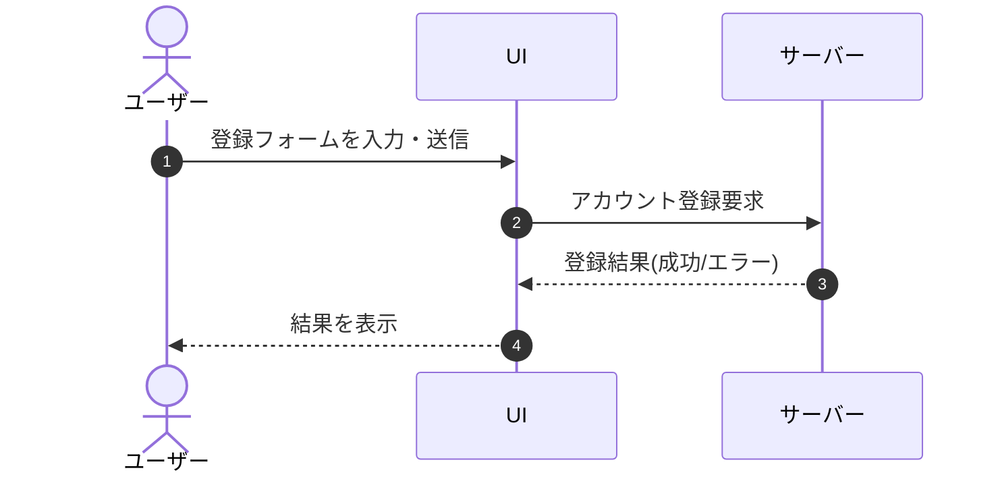
```mermaid
sequenceDiagram
  autonumber
  actor U as ユーザー
  participant UI as UI
  participant S as サーバー
  U->>UI: 登録フォームを入力・送信
  UI->>S: アカウント登録要求
  S-->>UI: 登録結果(成功/エラー)
  UI-->>U: 結果を表示
```

### 関連

| 優先度 | 対応業務UC |
|----|----|
| P0 | [UC-007](../02_business_usecases/UC-007.md#UC-007) ・ [UC-008](../02_business_usecases/UC-008.md#UC-008) ・ [UC-011](../02_business_usecases/UC-011.md#UC-011) ・ [UC-016](../02_business_usecases/UC-016.md#UC-016) ・ [UC-173](../02_business_usecases/UC-173.md#UC-173) ・ [UC-175](../02_business_usecases/UC-175.md#UC-175) |

## FR-002: 登録時に利用規約とプライバシーポリシーへの同意を取得

> **この機能要件は「登録時に利用規約とプライバシーポリシーへの同意を取得」を定義します。**

*種別 機能要件 ・ 機能グループ アカウント管理 ・ 優先度 P0 ・ ステータス ドラフト*

### 要件

登録時に利用規約とプライバシーポリシーへの同意を取得できること

### シーケンス

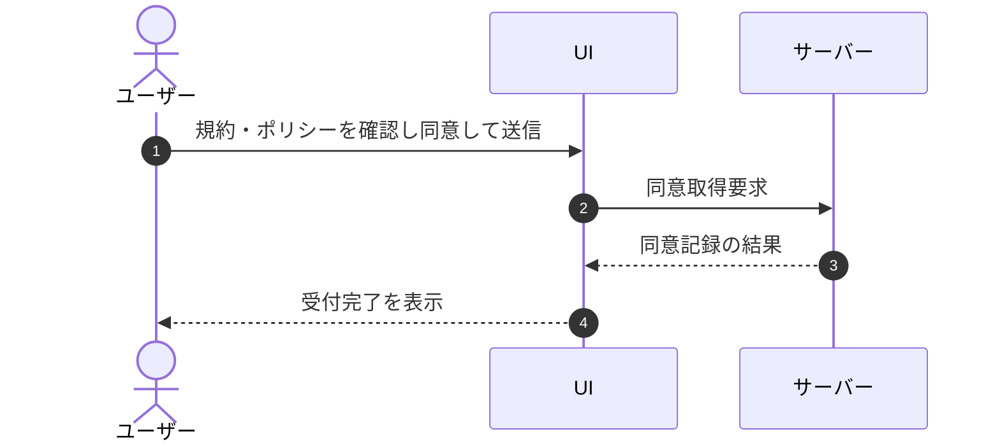
```mermaid
sequenceDiagram
  autonumber
  actor U as ユーザー
  participant UI as UI
  participant S as サーバー
  U->>UI: 規約・ポリシーを確認し同意して送信
  UI->>S: 同意取得要求
  S-->>UI: 同意記録の結果
  UI-->>U: 受付完了を表示
```

### 関連

| 優先度 | 対応業務UC |
|----|----|
| P0 | [UC-012](../02_business_usecases/UC-012.md#UC-012) ・ [UC-013](../02_business_usecases/UC-013.md#UC-013) ・ [UC-014](../02_business_usecases/UC-014.md#UC-014) ・ [UC-015](../02_business_usecases/UC-015.md#UC-015) |

## FR-003: メールアドレス確認(本人確認メール)が

> **この機能要件は「メールアドレス確認(本人確認メール)が」を定義します。**

*種別 機能要件 ・ 機能グループ アカウント管理 ・ 優先度 P0 ・ ステータス ドラフト*

### 要件

メールアドレス確認(本人確認メール)ができること

### シーケンス

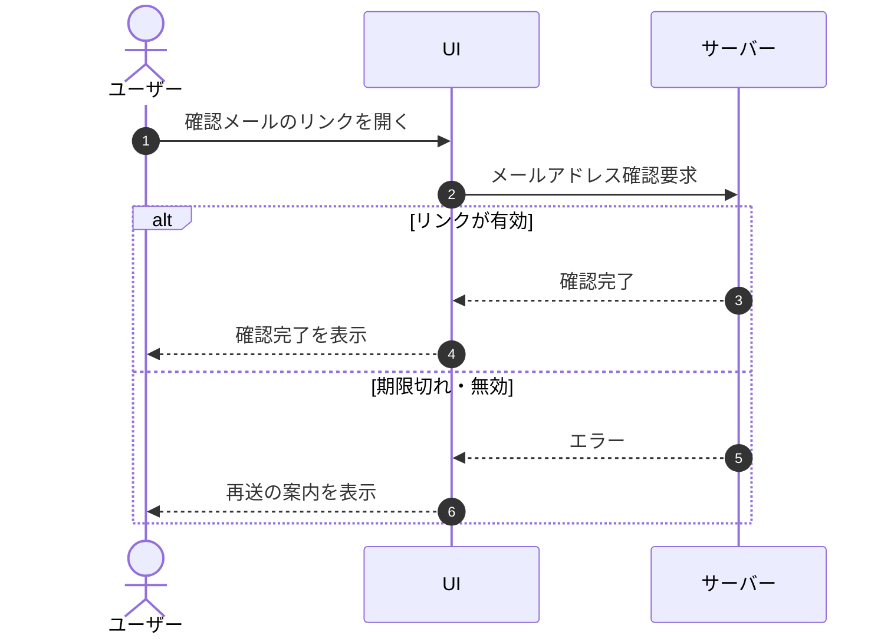
```mermaid
sequenceDiagram
  autonumber
  actor U as ユーザー
  participant UI as UI
  participant S as サーバー
  U->>UI: 確認メールのリンクを開く
  UI->>S: メールアドレス確認要求
  alt リンクが有効
    S-->>UI: 確認完了
    UI-->>U: 確認完了を表示
  else 期限切れ・無効
    S-->>UI: エラー
    UI-->>U: 再送の案内を表示
  end
```

### 関連

| 優先度 | 対応業務UC |
|----|----|
| P0 | [UC-016](../02_business_usecases/UC-016.md#UC-016) ・ [UC-151](../02_business_usecases/UC-151.md#UC-151) ・ [UC-152](../02_business_usecases/UC-152.md#UC-152) ・ [UC-155](../02_business_usecases/UC-155.md#UC-155) |

## FR-004: ログイン、ログアウト、パスワード再設定が

> **この機能要件は「ログイン、ログアウト、パスワード再設定が」を定義します。**

*種別 機能要件 ・ 機能グループ アカウント管理 ・ 優先度 P0 ・ ステータス ドラフト*

### 要件

ログイン、ログアウト、パスワード再設定ができること

### シーケンス

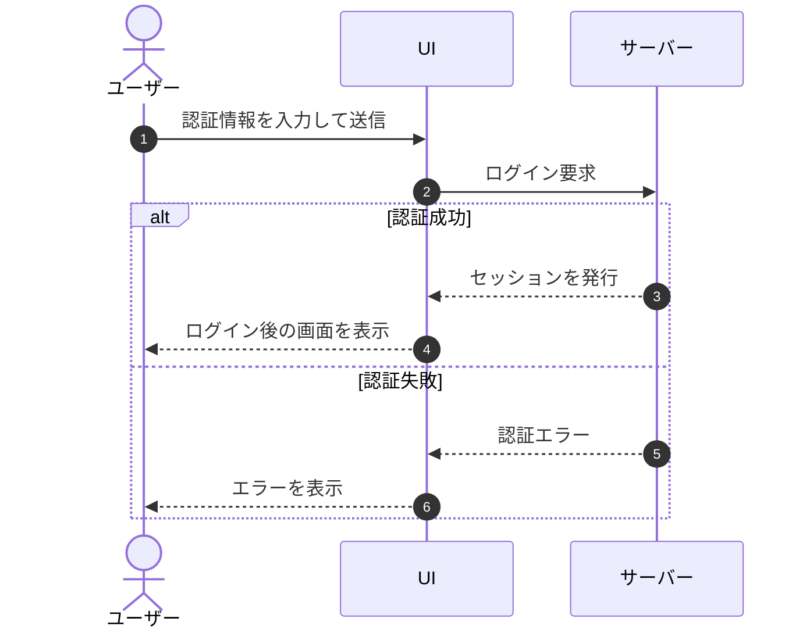
```mermaid
sequenceDiagram
  autonumber
  actor U as ユーザー
  participant UI as UI
  participant S as サーバー
  U->>UI: 認証情報を入力して送信
  UI->>S: ログイン要求
  alt 認証成功
    S-->>UI: セッションを発行
    UI-->>U: ログイン後の画面を表示
  else 認証失敗
    S-->>UI: 認証エラー
    UI-->>U: エラーを表示
  end
```

### 関連

| 優先度 | 対応業務UC |
|----|----|
| P0 | [UC-001](../02_business_usecases/UC-001.md#UC-001) ・ [UC-002](../02_business_usecases/UC-002.md#UC-002) ・ [UC-003](../02_business_usecases/UC-003.md#UC-003) ・ [UC-004](../02_business_usecases/UC-004.md#UC-004) ・ [UC-005](../02_business_usecases/UC-005.md#UC-005) ・ [UC-006](../02_business_usecases/UC-006.md#UC-006) ・ [UC-017](../02_business_usecases/UC-017.md#UC-017) ・ [UC-019](../02_business_usecases/UC-019.md#UC-019) ・ [UC-020](../02_business_usecases/UC-020.md#UC-020) ・ [UC-021](../02_business_usecases/UC-021.md#UC-021) ・ [UC-022](../02_business_usecases/UC-022.md#UC-022) ・ [UC-023](../02_business_usecases/UC-023.md#UC-023) ・ [UC-026](../02_business_usecases/UC-026.md#UC-026) ・ [UC-027](../02_business_usecases/UC-027.md#UC-027) |

## FR-005: 重要操作の前に本人確認(再認証)を求める

> **この機能要件は「重要操作の前に本人確認(再認証)を求める」を定義します。**

*種別 機能要件 ・ 機能グループ アカウント管理 ・ 優先度 P0 ・ ステータス ドラフト*

### 要件

重要操作の前に本人確認(再認証)を求めること。
1. 対象の重要操作は次のとおり。
    1. パスワード変更
    2. 退会
    3. 課金情報変更
    4. 管理者ユーザー登録・停止・削除
    5. 月次上限件数変更
2. 再認証は本人による再度の認証で行う
3. 再認証の有効範囲は **当該操作 1 回かつ 15 分以内**

### シーケンス

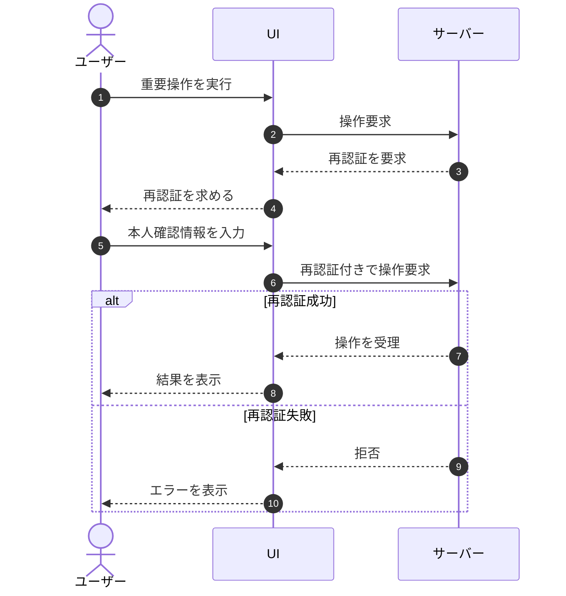
```mermaid
sequenceDiagram
  autonumber
  actor U as ユーザー
  participant UI as UI
  participant S as サーバー
  U->>UI: 重要操作を実行
  UI->>S: 操作要求
  S-->>UI: 再認証を要求
  UI-->>U: 再認証を求める
  U->>UI: 本人確認情報を入力
  UI->>S: 再認証付きで操作要求
  alt 再認証成功
    S-->>UI: 操作を受理
    UI-->>U: 結果を表示
  else 再認証失敗
    S-->>UI: 拒否
    UI-->>U: エラーを表示
  end
```

### 関連

| 優先度 | 対応業務UC |
|----|----|
| P0 | [UC-176](../02_business_usecases/UC-176.md#UC-176) ・ [UC-177](../02_business_usecases/UC-177.md#UC-177) ・ [UC-178](../02_business_usecases/UC-178.md#UC-178) ・ [UC-206](../02_business_usecases/UC-206.md#UC-206) ・ [UC-242](../02_business_usecases/UC-242.md#UC-242) |

## FR-006: パスワードに最低長・複雑性要件を適用

> **この機能要件は「パスワードに最低長・複雑性要件を適用」を定義します。**

*種別 機能要件 ・ 機能グループ アカウント管理 ・ 優先度 P0 ・ ステータス ドラフト*

### 要件

パスワードに最低長・複雑性要件を適用できること。
1. 最低 **12 文字**
2. 英大文字・小文字・数字・記号のうち **3 種類以上**
3. パスワードリセットリンクの有効期限は **1 時間**

### シーケンス

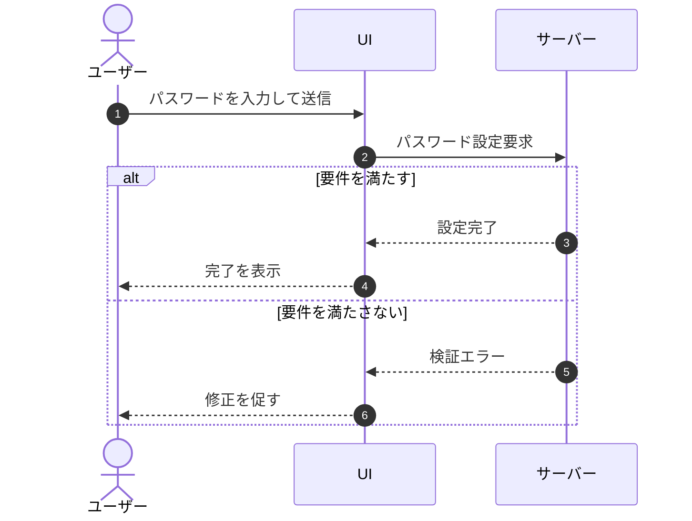
```mermaid
sequenceDiagram
  autonumber
  actor U as ユーザー
  participant UI as UI
  participant S as サーバー
  U->>UI: パスワードを入力して送信
  UI->>S: パスワード設定要求
  alt 要件を満たす
    S-->>UI: 設定完了
    UI-->>U: 完了を表示
  else 要件を満たさない
    S-->>UI: 検証エラー
    UI-->>U: 修正を促す
  end
```

### 関連

| 優先度 | 対応業務UC |
|----|----|
| P0 | [UC-009](../02_business_usecases/UC-009.md#UC-009) ・ [UC-010](../02_business_usecases/UC-010.md#UC-010) ・ [UC-024](../02_business_usecases/UC-024.md#UC-024) ・ [UC-025](../02_business_usecases/UC-025.md#UC-025) ・ [UC-178](../02_business_usecases/UC-178.md#UC-178) ・ [UC-183](../02_business_usecases/UC-183.md#UC-183) ・ [UC-184](../02_business_usecases/UC-184.md#UC-184) |

## FR-007: ログイン試行の失敗回数制限が

> **この機能要件は「ログイン試行の失敗回数制限が」を定義します。**

*種別 機能要件 ・ 機能グループ アカウント管理 ・ 優先度 P0 ・ ステータス ドラフト*

### 要件

ログイン試行の失敗回数制限ができること。
1. **5 回連続失敗**で **15 分間ロック**する
2. 時間経過または管理者解除で復旧できる
3. ロック発動時は該当本人および必要な管理者へ通知し、正規のアカウント利用者の救済導線を提供する

### シーケンス

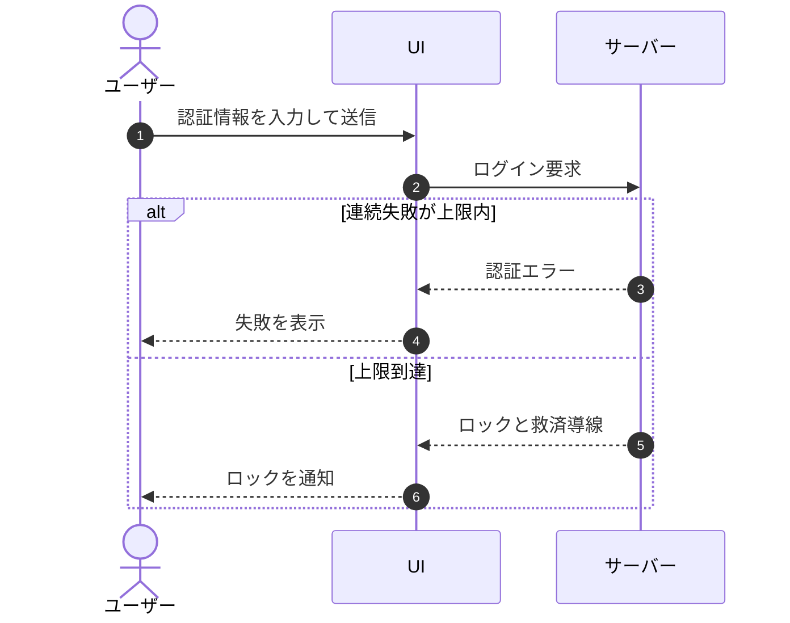
```mermaid
sequenceDiagram
  autonumber
  actor U as ユーザー
  participant UI as UI
  participant S as サーバー
  U->>UI: 認証情報を入力して送信
  UI->>S: ログイン要求
  alt 連続失敗が上限内
    S-->>UI: 認証エラー
    UI-->>U: 失敗を表示
  else 上限到達
    S-->>UI: ロックと救済導線
    UI-->>U: ロックを通知
  end
```

### 関連

| 優先度 | 対応業務UC |
|----|----|
| P0 | [UC-004](../02_business_usecases/UC-004.md#UC-004) ・ [UC-243](../02_business_usecases/UC-243.md#UC-243) |

## FR-008: セッションタイムアウトを以下のとおり設ける

> **この機能要件は「セッションタイムアウトを以下のとおり設ける」を定義します。**

*種別 機能要件 ・ 機能グループ アカウント管理 ・ 優先度 P0 ・ ステータス ドラフト*

### 要件

セッションタイムアウトを以下のとおり設けること。
1. **無操作タイムアウト 30 分**
2. **絶対タイムアウト 12 時間**(1 営業日内に再認証を要求)
3. 操作と同時にセッションが失効した場合は明示的なメッセージを表示し、再ログインを誘導すること

### シーケンス

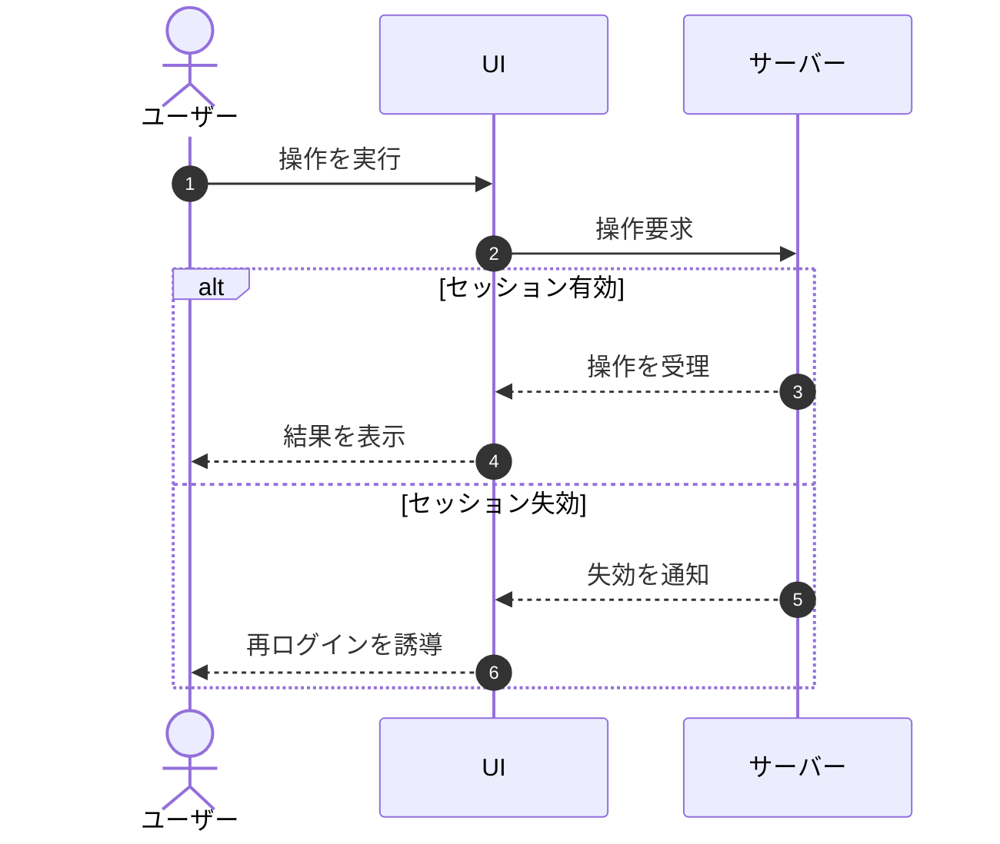
```mermaid
sequenceDiagram
  autonumber
  actor U as ユーザー
  participant UI as UI
  participant S as サーバー
  U->>UI: 操作を実行
  UI->>S: 操作要求
  alt セッション有効
    S-->>UI: 操作を受理
    UI-->>U: 結果を表示
  else セッション失効
    S-->>UI: 失効を通知
    UI-->>U: 再ログインを誘導
  end
```

### 関連

| 優先度 | 対応業務UC |
|----|----|
| P0 | [UC-242](../02_business_usecases/UC-242.md#UC-242) ・ [UC-244](../02_business_usecases/UC-244.md#UC-244) |

## FR-009: 退会できること(猶予期間付き)

> **この機能要件は「退会できること(猶予期間付き)」を定義します。**

*種別 機能要件 ・ 機能グループ アカウント管理 ・ 優先度 P0 ・ ステータス ドラフト*

### 要件

退会できること(猶予期間付き)

### シーケンス

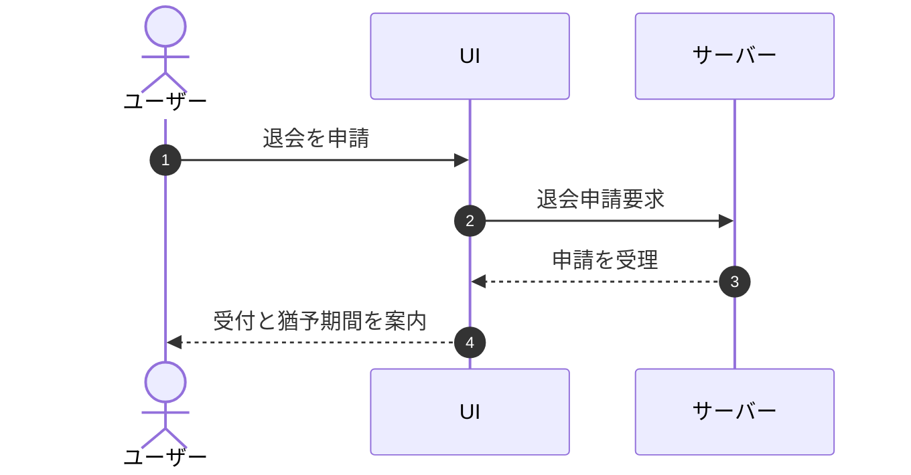
```mermaid
sequenceDiagram
  autonumber
  actor U as ユーザー
  participant UI as UI
  participant S as サーバー
  U->>UI: 退会を申請
  UI->>S: 退会申請要求
  S-->>UI: 申請を受理
  UI-->>U: 受付と猶予期間を案内
```

### 関連

| 優先度 | 対応業務UC |
|----|----|
| P0 | [UC-156](../02_business_usecases/UC-156.md#UC-156) ・ [UC-159](../02_business_usecases/UC-159.md#UC-159) ・ [UC-215](../02_business_usecases/UC-215.md#UC-215) ・ [UC-217](../02_business_usecases/UC-217.md#UC-217) |

## FR-010: 利用規約・プライバシーポリシー改定時に再同意を取得

> **この機能要件は「利用規約・プライバシーポリシー改定時に再同意を取得」を定義します。**

*種別 機能要件 ・ 機能グループ アカウント管理 ・ 優先度 P0 ・ ステータス ドラフト*

### 要件

利用規約・プライバシーポリシー改定時に再同意を取得できること。
1. 発効前に予告する(発効 **30 日前**)
2. 同意期限を設ける(発効日 + **14 日**)
3. 同意期限を超過したアカウント利用者には、再同意を求める割込みと未同意時の機能制限を行う
4. 非同意の場合は退会の案内を行う
5. 実施は契約単位で段階的に行う

### シーケンス

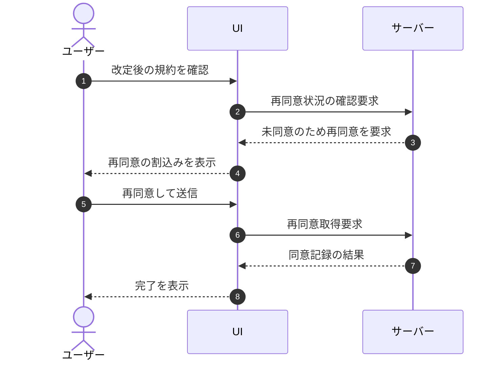
```mermaid
sequenceDiagram
  autonumber
  actor U as ユーザー
  participant UI as UI
  participant S as サーバー
  U->>UI: 改定後の規約を確認
  UI->>S: 再同意状況の確認要求
  S-->>UI: 未同意のため再同意を要求
  UI-->>U: 再同意の割込みを表示
  U->>UI: 再同意して送信
  UI->>S: 再同意取得要求
  S-->>UI: 同意記録の結果
  UI-->>U: 完了を表示
```

### 関連

| 優先度 | 対応業務UC |
|----|----|
| P0 | [UC-164](../02_business_usecases/UC-164.md#UC-164) ・ [UC-167](../02_business_usecases/UC-167.md#UC-167) ・ [UC-168](../02_business_usecases/UC-168.md#UC-168) ・ [UC-169](../02_business_usecases/UC-169.md#UC-169) |

## FR-011: 契約が停止された場合の挙動を定める

> **この機能要件は「契約が停止された場合の挙動を定める」を定義します。**

*種別 機能要件 ・ 機能グループ アカウント管理 ・ 優先度 P0 ・ ステータス ドラフト*

### 要件

契約が停止された場合の挙動を定めること。
1. 配下の管理者ユーザーの全セッションを速やかに無効化する
2. 進行中の長時間処理(大量インポート等)は**完了まで継続**し中断しない。完了後の次回操作で再認証を要求する
3. 再ログイン時、契約が停止状態の場合は停止時のアクセス制限ルールに従う

### シーケンス

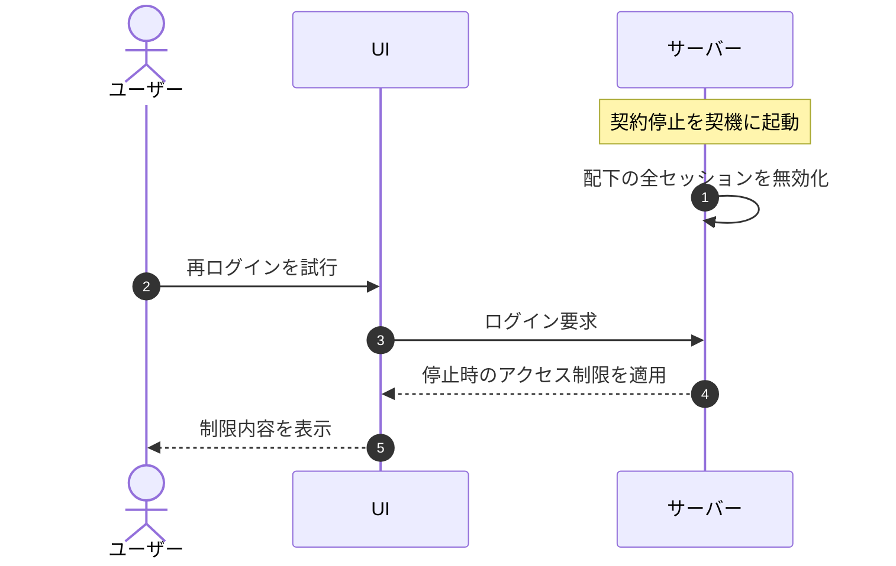
```mermaid
sequenceDiagram
  autonumber
  actor U as ユーザー
  participant UI as UI
  participant S as サーバー
  Note over S: 契約停止を契機に起動
  S->>S: 配下の全セッションを無効化
  U->>UI: 再ログインを試行
  UI->>S: ログイン要求
  S-->>UI: 停止時のアクセス制限を適用
  UI-->>U: 制限内容を表示
```

### 関連

| 優先度 | 対応業務UC |
|----|----|
| P0 | [UC-244](../02_business_usecases/UC-244.md#UC-244) |

## FR-012: オーナーおよび当該プロジェクトのメンバーは、自分が割り当てられたプロジェ

> **この機能要件は「オーナーおよび当該プロジェクトのメンバーは、自分が割り当てられたプロジェ」を定義します。**

*種別 機能要件 ・ 機能グループ ユーザー管理(オーナー + メンバー) ・ 優先度 P0 ・ ステータス ドラフト*

### 要件

オーナーおよび当該プロジェクトのメンバーは、自分が割り当てられたプロジェクトでメンバーを招待できること。
1. 招待はメールアドレスを指定して行う(プロジェクト内の役割差はない)
2. 招待時に氏名(表示名)は入力しない(個人情報保護の原則により、他人の氏名を招待者が任意に登録することを禁止する)。氏名は招待された本人が有効化時に入力する(FR-013d)
3. メンバーの管理は常にプロジェクト単位で行う
4. 同一の人を複数プロジェクトに参加させる場合は各プロジェクトで個別に招待する
5. 同一オーナー配下でメールアドレスが一致する場合は同一の利用者として扱い、新たに参加するプロジェクト分の割当のみを追加する

### シーケンス

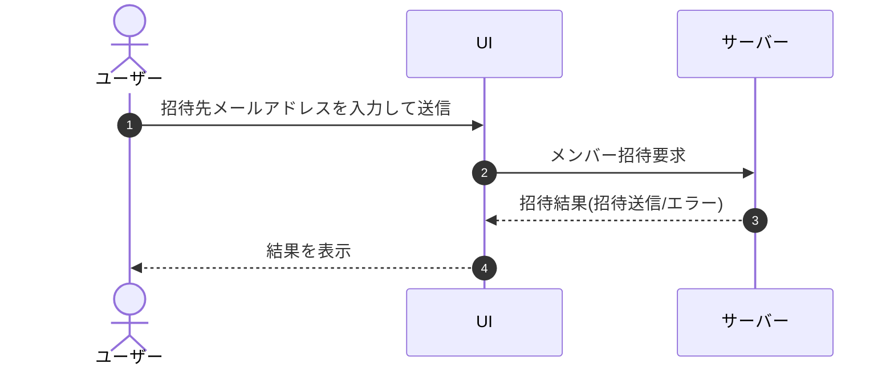
```mermaid
sequenceDiagram
  autonumber
  actor U as ユーザー
  participant UI as UI
  participant S as サーバー
  U->>UI: 招待先メールアドレスを入力して送信
  UI->>S: メンバー招待要求
  S-->>UI: 招待結果(招待送信/エラー)
  UI-->>U: 結果を表示
```

### 関連

| 優先度 | 対応業務UC |
|----|----|
| P0 | [UC-182](../02_business_usecases/UC-182.md#UC-182) |

P7 後続(第2段)で、機能グループの画面を手掛かりに対応業務UC候補 UC-182 を機械導出した(要レビュー)。

## FR-013: オーナーはアカウント新規登録時に自動的に決まり、全プロジェクトに対する全

> **この機能要件は「オーナーはアカウント新規登録時に自動的に決まり、全プロジェクトに対する全」を定義します。**

*種別 機能要件 ・ 機能グループ ユーザー管理(オーナー + メンバー) ・ 優先度 P0 ・ ステータス ドラフト*

### 要件

オーナーはアカウント新規登録時に自動的に決まり、全プロジェクトに対する全権とオーナー専有機能を恒久的に保持すること。オーナーは契約境界に基づく全権を持ち、別途の割当付与なしに自プロジェクトを操作できる(認可権威はオーナー権限)。加えて、作成した各プロジェクトに自身のメンバー行を自動保持する(一覧表示・担当割当・通知宛先の網羅用で、専有判定には用いない)。オーナーは降格・譲渡の対象外とする(MVP)。1 契約につきオーナーは 1 人とする

### シーケンス

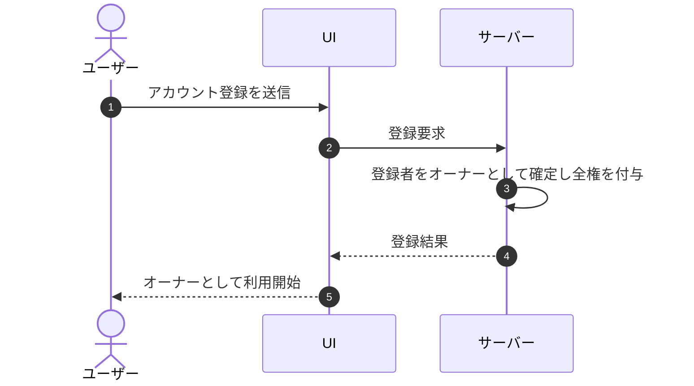
```mermaid
sequenceDiagram
  autonumber
  actor U as ユーザー
  participant UI as UI
  participant S as サーバー
  U->>UI: アカウント登録を送信
  UI->>S: 登録要求
  S->>S: 登録者をオーナーとして確定し全権を付与
  S-->>UI: 登録結果
  UI-->>U: オーナーとして利用開始
```

### 関連

| 優先度 | 対応業務UC |
|----|----|
| P0 | [UC-236](../02_business_usecases/UC-236.md#UC-236) |

P7 後続(第2段)で、関連業務要件(BR)を手掛かりに対応業務UC候補 UC-236 を機械導出した(要レビュー)。

## FR-014: メンバーはプロジェクトごとの割当で表し、割り当てられたメンバーは当該プロ

> **この機能要件は「メンバーはプロジェクトごとの割当で表し、割り当てられたメンバーは当該プロ」を定義します。**

*種別 機能要件 ・ 機能グループ ユーザー管理(オーナー + メンバー) ・ 優先度 P0 ・ ステータス ドラフト*

### 要件

メンバーはプロジェクトごとの割当で表し、割り当てられたメンバーは当該プロジェクト内で同一の権限を持つこと(役割差なし)。当該プロジェクトのメンバーは、当該プロジェクトの FAQ 管理・未解決質問管理・ログ参照・メンバー管理(当該プロジェクト範囲の招待・編集・割当解除)・上限 / アラート設定・お知らせ受信箱・ウィジェット設定を行える。個別の権限フラグや権限テンプレートは提供しない

### シーケンス

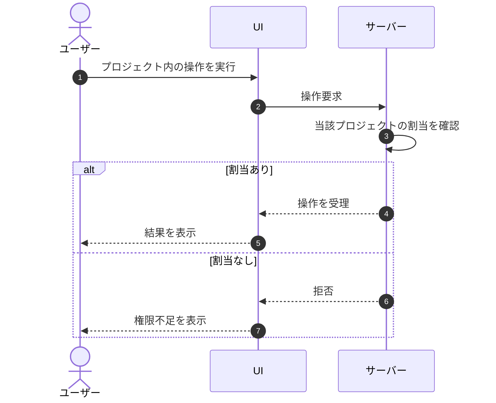
```mermaid
sequenceDiagram
  autonumber
  actor U as ユーザー
  participant UI as UI
  participant S as サーバー
  U->>UI: プロジェクト内の操作を実行
  UI->>S: 操作要求
  S->>S: 当該プロジェクトの割当を確認
  alt 割当あり
    S-->>UI: 操作を受理
    UI-->>U: 結果を表示
  else 割当なし
    S-->>UI: 拒否
    UI-->>U: 権限不足を表示
  end
```

### 関連

| 優先度 | 対応業務UC |
|----|----|
| P0 | [UC-236](../02_business_usecases/UC-236.md#UC-236) |

## FR-015: 契約単位の課金情報・支払方法・請求履歴・退会申請・規約再同意・契約設定、

> **この機能要件は「契約単位の課金情報・支払方法・請求履歴・退会申請・規約再同意・契約設定、」を定義します。**

*種別 機能要件 ・ 機能グループ ユーザー管理(オーナー + メンバー) ・ 優先度 P0 ・ ステータス ドラフト*

### 要件

契約単位の課金情報・支払方法・請求履歴・退会申請・規約再同意・契約設定、およびプロジェクトの作成・編集・削除はオーナー専有機能とし、メンバーには付与できないこと。プロジェクト単位の利用上限・無料利用枠は、オーナーまたは当該プロジェクトのメンバーが変更できること

### シーケンス

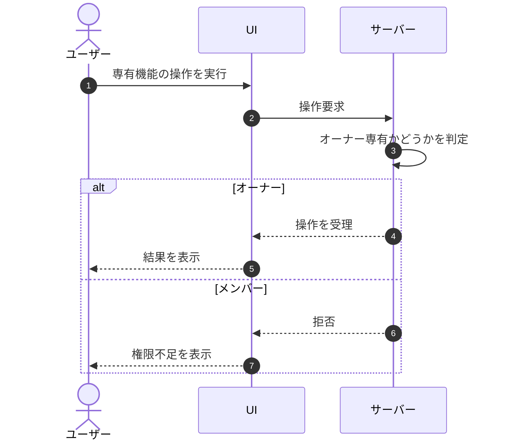
```mermaid
sequenceDiagram
  autonumber
  actor U as ユーザー
  participant UI as UI
  participant S as サーバー
  U->>UI: 専有機能の操作を実行
  UI->>S: 操作要求
  S->>S: オーナー専有かどうかを判定
  alt オーナー
    S-->>UI: 操作を受理
    UI-->>U: 結果を表示
  else メンバー
    S-->>UI: 拒否
    UI-->>U: 権限不足を表示
  end
```

### 関連

| 優先度 | 対応業務UC |
|----|----|
| P0 | [UC-248](../02_business_usecases/UC-248.md#UC-248) |

P7 後続(第2段)で本要件を実現する業務UC [UC-248](../02_business_usecases/UC-248.md#UC-248) を新設した。

## FR-016: メンバーは割り当てられたプロジェクトに属するデータ(FAQ・要対応の質問

> **この機能要件は「メンバーは割り当てられたプロジェクトに属するデータ(FAQ・要対応の質問」を定義します。**

*種別 機能要件 ・ 機能グループ ユーザー管理(オーナー + メンバー) ・ 優先度 P0 ・ ステータス ドラフト*

### 要件

メンバーは割り当てられたプロジェクトに属するデータ(FAQ・要対応の質問・質問ログ等)のみにアクセスできること。プロジェクトから外す操作を行ったメンバーが他に有効なプロジェクト割当を持たない場合は、そのアカウントを利用できない状態にする。オーナーは割当の有無に関わらず全プロジェクトを閲覧・操作できる

### シーケンス

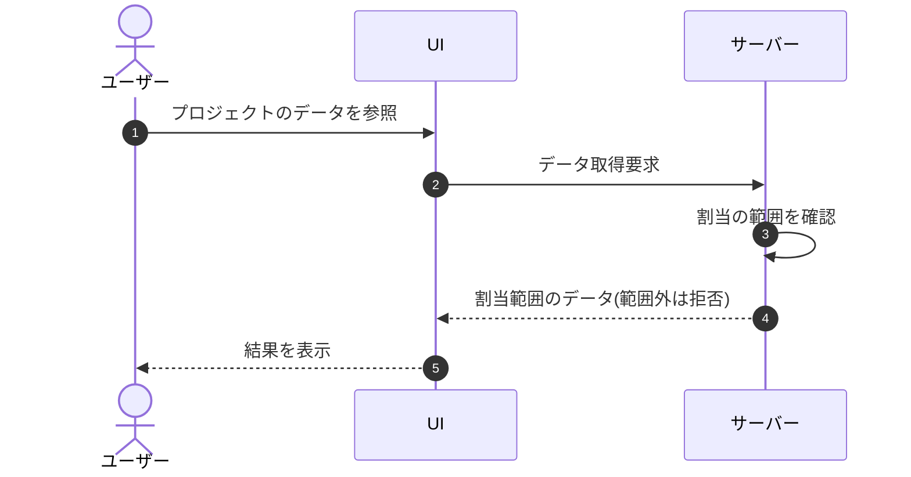
```mermaid
sequenceDiagram
  autonumber
  actor U as ユーザー
  participant UI as UI
  participant S as サーバー
  U->>UI: プロジェクトのデータを参照
  UI->>S: データ取得要求
  S->>S: 割当の範囲を確認
  S-->>UI: 割当範囲のデータ(範囲外は拒否)
  UI-->>U: 結果を表示
```

### 関連

| 優先度 | 対応業務UC |
|----|----|
| P0 | [UC-236](../02_business_usecases/UC-236.md#UC-236) |

P7 後続(第2段)で、関連業務要件(BR)を手掛かりに対応業務UC候補 UC-236 を機械導出した(要レビュー)。

## FR-017: プロジェクト作成時、オーナーは作成したプロジェクトに対して全権を持つ

> **この機能要件は「プロジェクト作成時、オーナーは作成したプロジェクトに対して全権を持つ」を定義します。**

*種別 機能要件 ・ 機能グループ ユーザー管理(オーナー + メンバー) ・ 優先度 P0 ・ ステータス ドラフト*

### 要件

プロジェクト作成時、オーナーは作成したプロジェクトに対して全権を持つこと。オーナーへ管理者割当を別途付与する処理は行わない(認可権威はオーナー権限)。プロジェクト作成時に「管理者を指定」する操作は設けない。加えて、作成者であるオーナーを当該プロジェクトのメンバーとして自動追加する(一覧表示・担当割当・通知宛先の網羅用)。他者を加える場合は、当該プロジェクトのメンバー管理からメンバーとして招待する

### シーケンス

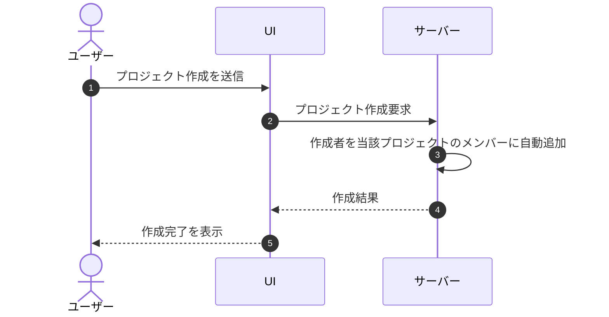
```mermaid
sequenceDiagram
  autonumber
  actor U as ユーザー
  participant UI as UI
  participant S as サーバー
  U->>UI: プロジェクト作成を送信
  UI->>S: プロジェクト作成要求
  S->>S: 作成者を当該プロジェクトのメンバーに自動追加
  S-->>UI: 作成結果
  UI-->>U: 作成完了を表示
```

### 関連

| 優先度 | 対応業務UC |
|----|----|
| P0 | [UC-236](../02_business_usecases/UC-236.md#UC-236) |

P7 後続(第2段)で、関連業務要件(BR)を手掛かりに対応業務UC候補 UC-236 を機械導出した(要レビュー)。

## FR-018: 招待されたメンバーは招待リンクから有効化ページに進み、本人による氏名(表

> **この機能要件は「招待されたメンバーは招待リンクから有効化ページに進み、本人による氏名(表」を定義します。**

*種別 機能要件 ・ 機能グループ ユーザー管理(オーナー + メンバー) ・ 優先度 P0 ・ ステータス ドラフト*

### 要件

招待されたメンバーは招待リンクから有効化ページに進み、本人による氏名(表示名)入力・初回パスワード設定・利用規約およびプライバシーポリシーへの同意を行ってアカウントを有効化できること。招待リンクの有効期限は **7 日**。期限切れの場合はオーナーまたは当該プロジェクトのメンバーが再送信する

### シーケンス

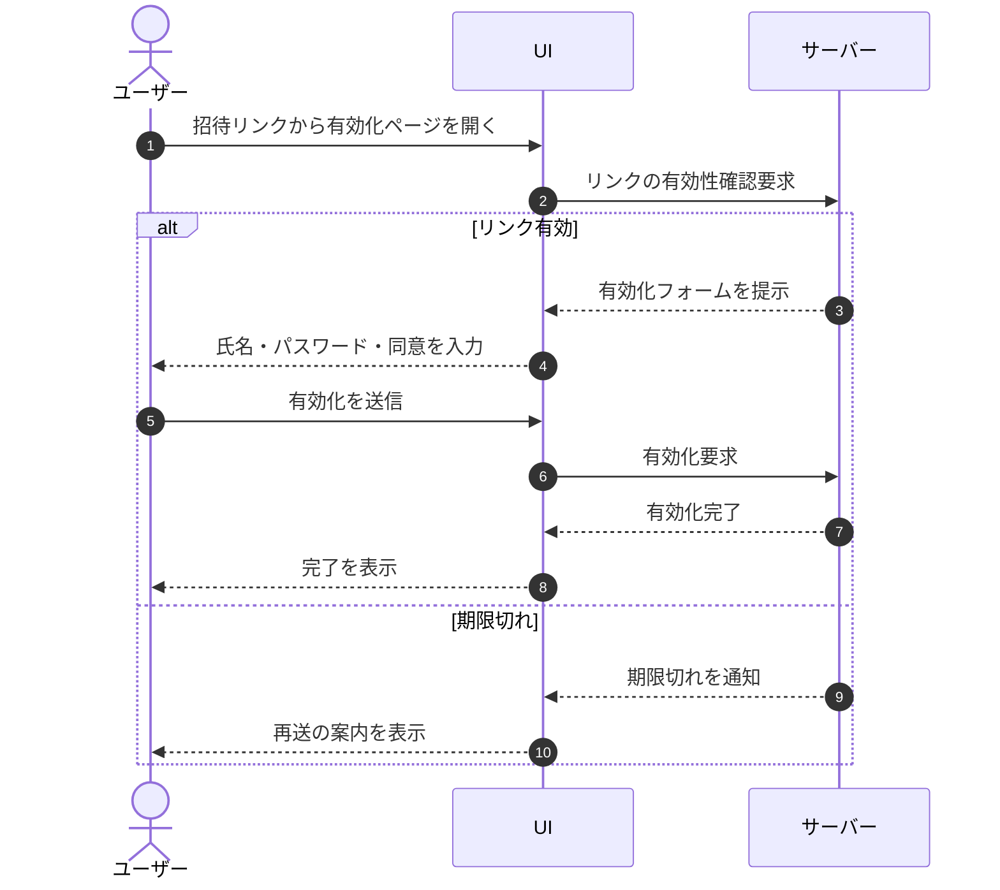
```mermaid
sequenceDiagram
  autonumber
  actor U as ユーザー
  participant UI as UI
  participant S as サーバー
  U->>UI: 招待リンクから有効化ページを開く
  UI->>S: リンクの有効性確認要求
  alt リンク有効
    S-->>UI: 有効化フォームを提示
    UI-->>U: 氏名・パスワード・同意を入力
    U->>UI: 有効化を送信
    UI->>S: 有効化要求
    S-->>UI: 有効化完了
    UI-->>U: 完了を表示
  else 期限切れ
    S-->>UI: 期限切れを通知
    UI-->>U: 再送の案内を表示
  end
```

### 関連

| 優先度 | 対応業務UC |
|----|----|
| P0 | [UC-181](../02_business_usecases/UC-181.md#UC-181) ・ [UC-190](../02_business_usecases/UC-190.md#UC-190) |

## FR-019: 招待時に指定されたプロジェクト割当は、招待対象者が有効化(氏名入力・パス

> **この機能要件は「招待時に指定されたプロジェクト割当は、招待対象者が有効化(氏名入力・パス」を定義します。**

*種別 機能要件 ・ 機能グループ ユーザー管理(オーナー + メンバー) ・ 優先度 P0 ・ ステータス ドラフト*

### 要件

招待時に指定されたプロジェクト割当は、招待対象者が有効化(氏名入力・パスワード設定・規約同意)を完了した時点で有効になること

### シーケンス

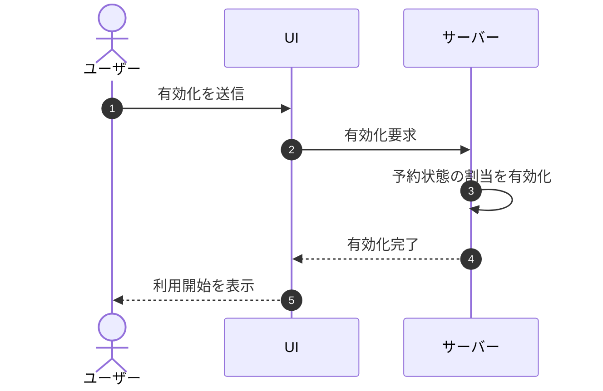
```mermaid
sequenceDiagram
  autonumber
  actor U as ユーザー
  participant UI as UI
  participant S as サーバー
  U->>UI: 有効化を送信
  UI->>S: 有効化要求
  S->>S: 予約状態の割当を有効化
  S-->>UI: 有効化完了
  UI-->>U: 利用開始を表示
```

### 関連

| 優先度 | 対応業務UC |
|----|----|
| P0 | [UC-123](../02_business_usecases/UC-123.md#UC-123) ・ [UC-181](../02_business_usecases/UC-181.md#UC-181) |

P7 後続(第2段)で、関連業務要件(BR)を手掛かりに対応業務UC候補 UC-123 UC-181 を機械導出した(要レビュー)。

## FR-020: 招待リンクの再送信は、オーナーまたは当該プロジェクトのメンバーのみが行え

> **この機能要件は「招待リンクの再送信は、オーナーまたは当該プロジェクトのメンバーのみが行え」を定義します。**

*種別 機能要件 ・ 機能グループ ユーザー管理(オーナー + メンバー) ・ 優先度 P0 ・ ステータス ドラフト*

### 要件

招待リンクの再送信は、オーナーまたは当該プロジェクトのメンバーのみが行えること。再送信時は旧リンクを失効させ新リンクを発行する。招待中のメンバーを取りやめたい場合は、招待取消ではなくメンバー削除(FR-016)で対応する

### シーケンス

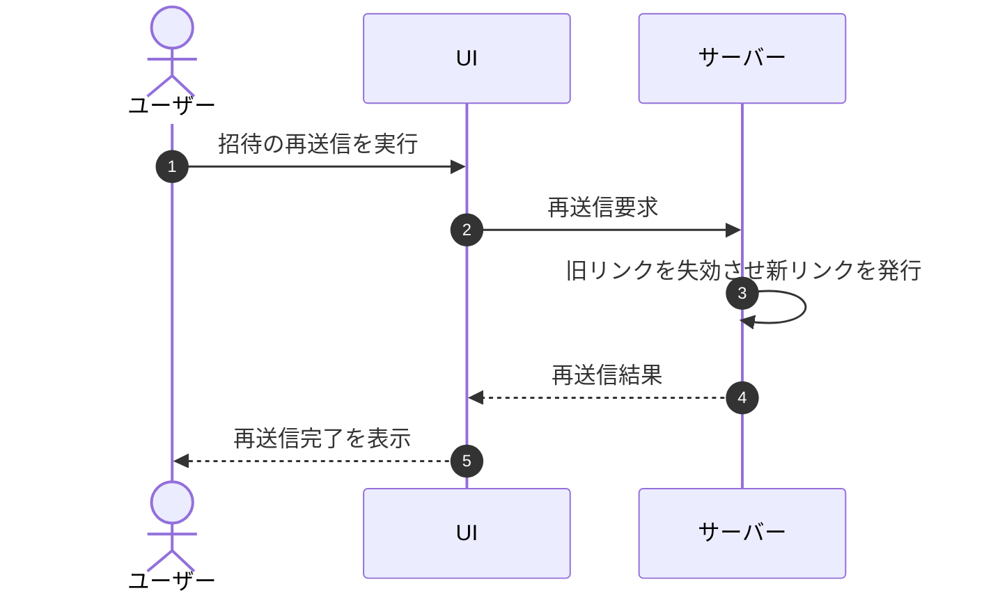
```mermaid
sequenceDiagram
  autonumber
  actor U as ユーザー
  participant UI as UI
  participant S as サーバー
  U->>UI: 招待の再送信を実行
  UI->>S: 再送信要求
  S->>S: 旧リンクを失効させ新リンクを発行
  S-->>UI: 再送信結果
  UI-->>U: 再送信完了を表示
```

### 関連

| 優先度 | 対応業務UC |
|----|----|
| P0 | [UC-127](../02_business_usecases/UC-127.md#UC-127) |

P7 後続レビューで、本要件は既存の業務UC [UC-127](../02_business_usecases/UC-127.md#UC-127) が実現すると判断し結び直した。

## FR-021: 有効化前のメンバーは、招待時に指定されたプロジェクト割当を予約状態として

> **この機能要件は「有効化前のメンバーは、招待時に指定されたプロジェクト割当を予約状態として」を定義します。**

*種別 機能要件 ・ 機能グループ ユーザー管理(オーナー + メンバー) ・ 優先度 P0 ・ ステータス ドラフト*

### 要件

有効化前のメンバーは、招待時に指定されたプロジェクト割当を予約状態として保持するが、ログインおよび利用はできないこと(有効化完了時に初めて利用可能となる)

### シーケンス

```mermaid
sequenceDiagram
  autonumber
  actor U as ユーザー
  participant UI as UI
  participant S as サーバー
  U->>UI: 有効化前にログインを試行
  UI->>S: ログイン要求
  S-->>UI: 未有効化のため拒否
  UI-->>U: 有効化が必要な旨を表示
```

### 関連

| 優先度 | 対応業務UC |
|----|----|
| P0 | [UC-123](../02_business_usecases/UC-123.md#UC-123) ・ [UC-181](../02_business_usecases/UC-181.md#UC-181) |

P7 後続(第2段)で、関連業務要件(BR)を手掛かりに対応業務UC候補 UC-123 UC-181 を機械導出した(要レビュー)。

## FR-022: 招待されたメンバーは、有効化ページで次を入力して有効化を完了する

> **この機能要件は「招待されたメンバーは、有効化ページで次を入力して有効化を完了する」を定義します。**

*種別 機能要件 ・ 機能グループ ユーザー管理(オーナー + メンバー) ・ 優先度 P0 ・ ステータス ドラフト*

### 要件

招待されたメンバーは、有効化ページで次を入力して有効化を完了する。利用規約とプライバシーポリシーは個別の文書として版管理され、双方の最新版への同意が有効化の必須条件となる。氏名は本人のみが入力でき、招待元の管理者は事前に入力できない(個人情報保護の原則)。氏名は本人が個人設定で後から変更できる
1. 氏名(表示名)
2. 初回パスワード
3. 利用規約への同意
4. プライバシーポリシーへの同意

### シーケンス

```mermaid
sequenceDiagram
  autonumber
  actor U as ユーザー
  participant UI as UI
  participant S as サーバー
  U->>UI: 氏名・初回パスワード・同意を入力して送信
  UI->>S: 有効化要求
  alt 入力・同意が揃う
    S-->>UI: 有効化完了
    UI-->>U: 完了を表示
  else 不足あり
    S-->>UI: 検証エラー
    UI-->>U: 修正を促す
  end
```

### 関連

| 優先度 | 対応業務UC |
|----|----|
| P0 | [UC-123](../02_business_usecases/UC-123.md#UC-123) ・ [UC-182](../02_business_usecases/UC-182.md#UC-182) |

## FR-023: 有効化の完了時には、本人が入力した氏名・初回パスワード・規約同意(利用規

> **この機能要件は「有効化の完了時には、本人が入力した氏名・初回パスワード・規約同意(利用規」を定義します。**

*種別 機能要件 ・ 機能グループ ユーザー管理(オーナー + メンバー) ・ 優先度 P0 ・ ステータス ドラフト*

### 要件

有効化の完了時には、本人が入力した氏名・初回パスワード・規約同意(利用規約とプライバシーポリシーでそれぞれ 1 件、計 2 件)の記録と、招待時に指定されたプロジェクト割当の有効化が、まとめて確実に行われること。どのプロジェクトへの招待であったかは招待リンクに紐づけて管理する

### シーケンス

```mermaid
sequenceDiagram
  autonumber
  actor U as ユーザー
  participant UI as UI
  participant S as サーバー
  U->>UI: 有効化を送信
  UI->>S: 有効化要求
  S->>S: 氏名・パスワード・同意・割当をまとめて記録
  S-->>UI: 一括処理の結果
  UI-->>U: 完了を表示
```

### 関連

| 優先度 | 対応業務UC |
|----|----|
| P0 | [UC-123](../02_business_usecases/UC-123.md#UC-123) ・ [UC-181](../02_business_usecases/UC-181.md#UC-181) |

P7 後続(第2段)で、関連業務要件(BR)を手掛かりに対応業務UC候補 UC-123 UC-181 を機械導出した(要レビュー)。

## FR-024: アカウント利用者は、現在開いているプロジェクトに割り当てられたメンバーの

> **この機能要件は「アカウント利用者は、現在開いているプロジェクトに割り当てられたメンバーの」を定義します。**

*種別 機能要件 ・ 機能グループ ユーザー管理(オーナー + メンバー) ・ 優先度 P0 ・ ステータス ドラフト*

### 要件

アカウント利用者は、現在開いているプロジェクトに割り当てられたメンバーの一覧と詳細を参照できること。詳細には種別(契約オーナー / メンバー)、状態(利用中 / 招待中)を含める。最終ログイン日時は表示しない。招待期限と再送の導線はメンバー招待・編集の操作に集約する。契約をまたいだメンバー一覧は提供しない

### シーケンス

```mermaid
sequenceDiagram
  autonumber
  actor U as ユーザー
  participant UI as UI
  participant S as サーバー
  U->>UI: メンバー一覧を開く
  UI->>S: メンバー一覧取得要求
  S-->>UI: 当該プロジェクトのメンバー一覧・詳細
  UI-->>U: 一覧を表示
```

### 関連

| 優先度 | 対応業務UC |
|----|----|
| P0 | [UC-128](../02_business_usecases/UC-128.md#UC-128) ・ [UC-130](../02_business_usecases/UC-130.md#UC-130) |

P7 後続(第2段)で、関連業務要件(BR)を手掛かりに対応業務UC候補 UC-128 UC-130 を機械導出した(要レビュー)。

## FR-025: オーナーおよび当該プロジェクトのメンバーは、自分(オーナー)に紐づくメン

> **この機能要件は「オーナーおよび当該プロジェクトのメンバーは、自分(オーナー)に紐づくメン」を定義します。**

*種別 機能要件 ・ 機能グループ ユーザー管理(オーナー + メンバー) ・ 優先度 P0 ・ ステータス ドラフト*

### 要件

オーナーおよび当該プロジェクトのメンバーは、自分(オーナー)に紐づくメンバーの **メールアドレスのみ** を更新できること(氏名の更新は不可)。
1. 氏名(表示名)は本人のみが有効化ページおよび個人設定で変更できる(個人情報保護の原則により、他人の氏名は編集できない)。編集時、氏名は閲覧のみとし、未入力時は「未設定」と表示する
2. オーナー自身の氏名・メールの更新はオーナー本人のみが行える
3. 当該プロジェクトのメンバーが更新できる対象は、当該プロジェクトに割当のあるメンバーに限る
4. 個人ごとの通知受信オプトアウト(重要度別の受信切替)は MVP では提供しない。プロジェクト関連通知は常時オンとし、当該プロジェクトの全メンバー(オーナーを含む)へ即時配信する(画面上の受信設定は設けない)

### シーケンス

```mermaid
sequenceDiagram
  autonumber
  actor U as ユーザー
  participant UI as UI
  participant S as サーバー
  U->>UI: メンバーのメールアドレスを更新して送信
  UI->>S: メール更新要求
  alt 更新可能な範囲
    S-->>UI: 更新完了
    UI-->>U: 完了を表示
  else 範囲外・氏名編集
    S-->>UI: 拒否
    UI-->>U: 更新不可を表示
  end
```

### 関連

| 優先度 | 対応業務UC |
|----|----|
| P0 | [UC-182](../02_business_usecases/UC-182.md#UC-182) |

P7 後続(第2段)で、機能グループの画面を手掛かりに対応業務UC候補 UC-182 を機械導出した(要レビュー)。

## FR-026: 当該プロジェクトのメンバー(オーナーを含む)は、当該プロジェクトのメンバ

> **この機能要件は「当該プロジェクトのメンバー(オーナーを含む)は、当該プロジェクトのメンバ」を定義します。**

*種別 機能要件 ・ 機能グループ ユーザー管理(オーナー + メンバー) ・ 優先度 P0 ・ ステータス ドラフト*

### 要件

当該プロジェクトのメンバー(オーナーを含む)は、当該プロジェクトのメンバー 1 人の割当について、「プロジェクトから外す」操作を行えること。他プロジェクトの割当には影響しない。自分自身の割当解除はできない。他メンバーを外す操作には、誤操作を防ぐ確認を必須とする

### シーケンス

```mermaid
sequenceDiagram
  autonumber
  actor U as ユーザー
  participant UI as UI
  participant S as サーバー
  U->>UI: メンバーをプロジェクトから外す
  UI-->>U: 確認を求める
  U->>UI: 確認して実行
  UI->>S: 割当解除要求
  S-->>UI: 解除完了
  UI-->>U: 完了を表示
```

### 関連

| 優先度 | 対応業務UC |
|----|----|
| P0 | [UC-129](../02_business_usecases/UC-129.md#UC-129) |

P7 後続(第2段)で、機能グループの画面を手掛かりに対応業務UC候補 UC-129 を機械導出した(要レビュー)。

## FR-027: 割当の追加・解除時には、変更前後のプロジェクト割当の差分を記録(監査)し

> **この機能要件は「割当の追加・解除時には、変更前後のプロジェクト割当の差分を記録(監査)し」を定義します。**

*種別 機能要件 ・ 機能グループ ユーザー管理(オーナー + メンバー) ・ 優先度 P0 ・ ステータス ドラフト*

### 要件

割当の追加・解除時には、変更前後のプロジェクト割当の差分を記録(監査)し、当該メンバーへお知らせとメールで通知できること

### シーケンス

```mermaid
sequenceDiagram
  autonumber
  actor U as ユーザー
  participant UI as UI
  participant S as サーバー
  U->>UI: 割当の追加・解除を実行
  UI->>S: 割当変更要求
  S->>S: 変更差分を記録し当該メンバーへ通知
  S-->>UI: 変更完了
  UI-->>U: 完了を表示
```

### 関連

| 優先度 | 対応業務UC |
|----|----|
| P0 | [UC-128](../02_business_usecases/UC-128.md#UC-128) ・ [UC-130](../02_business_usecases/UC-130.md#UC-130) |

## FR-028: オーナーは、メンバーを別プロジェクトへ追加で割り当てる場合、当該プロジェ

> **この機能要件は「オーナーは、メンバーを別プロジェクトへ追加で割り当てる場合、当該プロジェ」を定義します。**

*種別 機能要件 ・ 機能グループ ユーザー管理(オーナー + メンバー) ・ 優先度 P0 ・ ステータス ドラフト*

### 要件

オーナーは、メンバーを別プロジェクトへ追加で割り当てる場合、当該プロジェクトに切り替えて招待する。メンバーは他プロジェクトへの割当はできず、自分が割り当てられたプロジェクトの範囲でのみ招待・編集・削除を行える(範囲内の制約は FR-016 を正とする)

### シーケンス

```mermaid
sequenceDiagram
  autonumber
  actor U as ユーザー
  participant UI as UI
  participant S as サーバー
  U->>UI: 対象プロジェクトに切り替えて招待
  UI->>S: 追加割当の招待要求
  S-->>UI: 招待結果
  UI-->>U: 結果を表示
```

### 関連

| 優先度 | 対応業務UC |
|----|----|
| P0 | [UC-249](../02_business_usecases/UC-249.md#UC-249) |

P7 後続(第2段)で本要件を実現する業務UC [UC-249](../02_business_usecases/UC-249.md#UC-249) を新設した。

## FR-029: メンバーの利用終了は「プロジェクトから外す」操作に統合

> **この機能要件は「メンバーの利用終了は「プロジェクトから外す」操作に統合」を定義します。**

*種別 機能要件 ・ 機能グループ ユーザー管理(オーナー + メンバー) ・ 優先度 P0 ・ ステータス ドラフト*

### 要件

メンバーの利用終了は「プロジェクトから外す」操作に統合すること。対象が他プロジェクトに有効な割当を持たない場合、当該プロジェクトの割当解除に加えてアカウントを利用できない状態にし、ログインセッションと未使用の招待を無効化する。オーナー自身は対象外とし、契約をまたいだメンバー削除の画面・機能は提供しない

### シーケンス

```mermaid
sequenceDiagram
  autonumber
  actor U as ユーザー
  participant UI as UI
  participant S as サーバー
  U->>UI: メンバーをプロジェクトから外す
  UI->>S: 割当解除要求
  S->>S: 他に有効な割当がなければ利用停止しセッション・招待を無効化
  S-->>UI: 処理結果
  UI-->>U: 結果を表示
```

### 関連

| 優先度 | 対応業務UC |
|----|----|
| P0 | [UC-129](../02_business_usecases/UC-129.md#UC-129) |

P7 後続(第2段)で、機能グループの画面を手掛かりに対応業務UC候補 UC-129 を機械導出した(要レビュー)。

## FR-030: 「プロジェクトから外す」操作は当該プロジェクトの割当のみを解除する

> **この機能要件は「「プロジェクトから外す」操作は当該プロジェクトの割当のみを解除する」を定義します。**

*種別 機能要件 ・ 機能グループ ユーザー管理(オーナー + メンバー) ・ 優先度 P0 ・ ステータス ドラフト*

### 要件

「プロジェクトから外す」操作は当該プロジェクトの割当のみを解除する。対象が他プロジェクトに有効な割当を持つ場合は、利用者アカウントと他の割当を維持し、次回以降の利用可否判定に反映する。他に有効な割当がない場合は、アカウントが利用できなくなる旨を確認時に明示する

### シーケンス

```mermaid
sequenceDiagram
  autonumber
  actor U as ユーザー
  participant UI as UI
  participant S as サーバー
  U->>UI: プロジェクトから外す操作を実行
  UI-->>U: 影響(利用可否)を確認時に明示
  U->>UI: 確認して実行
  UI->>S: 当該割当の解除要求
  S-->>UI: 解除完了
  UI-->>U: 結果を表示
```

### 関連

| 優先度 | 対応業務UC |
|----|----|
| P0 | [UC-129](../02_business_usecases/UC-129.md#UC-129) |

## FR-031: 最後の有効なプロジェクト割当を解除した場合は、全ログインセッションの無効

> **この機能要件は「最後の有効なプロジェクト割当を解除した場合は、全ログインセッションの無効」を定義します。**

*種別 機能要件 ・ 機能グループ ユーザー管理(オーナー + メンバー) ・ 優先度 P0 ・ ステータス ドラフト*

### 要件

最後の有効なプロジェクト割当を解除した場合は、全ログインセッションの無効化、未使用招待の無効化、および一定期間(90 日)経過後にデータが完全に消去される予定であることを確認時に明示する。利用停止後に同じメールアドレスで再招待された場合は、過去の削除済みデータとは別の新しい利用者として扱う

### シーケンス

```mermaid
sequenceDiagram
  autonumber
  actor U as ユーザー
  participant UI as UI
  participant S as サーバー
  U->>UI: 最後の割当を解除する操作を実行
  UI-->>U: 全セッション無効化とデータ消去予定を明示
  U->>UI: 確認して実行
  UI->>S: 割当解除要求
  S->>S: 全セッションと未使用招待を無効化
  S-->>UI: 処理結果
  UI-->>U: 結果を表示
```

### 関連

| 優先度 | 対応業務UC |
|----|----|
| P0 | [UC-130](../02_business_usecases/UC-130.md#UC-130) |

## FR-032: 招待リンクには有効期限を設ける

> **この機能要件は「招待リンクには有効期限を設ける」を定義します。**

*種別 機能要件 ・ 機能グループ ユーザー管理(オーナー + メンバー) ・ 優先度 P0 ・ ステータス ドラフト*

### 要件

招待リンクには有効期限を設けること。**有効期限: 7 日**。期限切れ後は招待の再送信で新リンクが発行される

### シーケンス

```mermaid
sequenceDiagram
  autonumber
  actor U as ユーザー
  participant UI as UI
  participant S as サーバー
  U->>UI: 招待リンクを開く
  UI->>S: リンクの有効性確認要求
  alt 有効期限内
    S-->>UI: 有効化フォームを提示
    UI-->>U: 有効化を続行
  else 期限切れ
    S-->>UI: 期限切れを通知
    UI-->>U: 再送の案内を表示
  end
```

### 関連

| 優先度 | 対応業務UC |
|----|----|
| P0 | [UC-123](../02_business_usecases/UC-123.md#UC-123) ・ [UC-181](../02_business_usecases/UC-181.md#UC-181) |

P7 後続(第2段)で、関連業務要件(BR)を手掛かりに対応業務UC候補 UC-123 UC-181 を機械導出した(要レビュー)。

## FR-033: メンバー数に固定の上限を設けず、利用量のしきい値に基づいて上限への接近や

> **この機能要件は「メンバー数に固定の上限を設けず、利用量のしきい値に基づいて上限への接近や」を定義します。**

*種別 機能要件 ・ 機能グループ ユーザー管理(オーナー + メンバー) ・ 優先度 P0 ・ ステータス ドラフト*

### 要件

メンバー数に固定の上限を設けず、利用量のしきい値に基づいて上限への接近や急増を検知し、アカウント利用者(オーナー / メンバー)へアラート通知できること

### シーケンス

```mermaid
sequenceDiagram
  autonumber
  actor U as ユーザー
  participant UI as UI
  participant S as サーバー
  Note over S: 利用量の監視を契機に起動
  S->>S: しきい値接近・急増を検知
  S-->>UI: アラートを配信
  UI-->>U: アラートを表示
```

### 関連

| 優先度 | 対応業務UC |
|----|----|
| P0 | [UC-250](../02_business_usecases/UC-250.md#UC-250) |

P7 後続(第2段)で本要件を実現する業務UC [UC-250](../02_business_usecases/UC-250.md#UC-250) を新設した。

## FR-034: メンバー数のしきい値接近・超過時のアラート通知先は、オーナーおよび同一契

> **この機能要件は「メンバー数のしきい値接近・超過時のアラート通知先は、オーナーおよび同一契」を定義します。**

*種別 機能要件 ・ 機能グループ ユーザー管理(オーナー + メンバー) ・ 優先度 P1 ・ ステータス ドラフト*

### 要件

メンバー数のしきい値接近・超過時のアラート通知先は、オーナーおよび同一契約内のいずれかのプロジェクトに割り当てられた全メンバーとすること(最も重要度の高い通知の宛先と一致する)

### シーケンス

```mermaid
sequenceDiagram
  autonumber
  actor U as ユーザー
  participant UI as UI
  participant S as サーバー
  Note over S: しきい値接近・超過の検知を契機に起動
  S->>S: 通知先(オーナーと全メンバー)を決定
  S-->>UI: アラートを配信
  UI-->>U: アラートを表示
```

### 関連

| 優先度 | 対応業務UC |
|----|----|
| P1 | [UC-251](../02_business_usecases/UC-251.md#UC-251) |

P7 後続(第2段)で本要件を実現する業務UC [UC-251](../02_business_usecases/UC-251.md#UC-251) を新設した。

## FR-035: 契約にメンバーが 1 人も登録されていない状態でも、オーナーが単独で契約

> **この機能要件は「契約にメンバーが 1 人も登録されていない状態でも、オーナーが単独で契約」を定義します。**

*種別 機能要件 ・ 機能グループ ユーザー管理(オーナー + メンバー) ・ 優先度 P0 ・ ステータス ドラフト*

### 要件

契約にメンバーが 1 人も登録されていない状態でも、オーナーが単独で契約運営を継続できること(オーナーは全機能を保持する)

### シーケンス

```mermaid
sequenceDiagram
  autonumber
  actor U as ユーザー
  participant UI as UI
  participant S as サーバー
  U->>UI: メンバー不在のまま操作を実行
  UI->>S: 操作要求
  S->>S: オーナーとして全機能を許可
  S-->>UI: 操作を受理
  UI-->>U: 結果を表示
```

### 関連

| 優先度 | 対応業務UC |
|----|----|
| P0 | [UC-236](../02_business_usecases/UC-236.md#UC-236) |

P7 後続(第2段)で、関連業務要件(BR)を手掛かりに対応業務UC候補 UC-236 を機械導出した(要レビュー)。

## FR-036: 同一オーナーに紐づく既存の有効・招待中アカウントと同一メールアドレスでメ

> **この機能要件は「同一オーナーに紐づく既存の有効・招待中アカウントと同一メールアドレスでメ」を定義します。**

*種別 機能要件 ・ 機能グループ ユーザー管理(オーナー + メンバー) ・ 優先度 P0 ・ ステータス ドラフト*

### 要件

同一オーナーに紐づく既存の有効・招待中アカウントと同一メールアドレスでメンバーを重複して招待できないこと。メールは 1 アカウントに一意とし、別オーナーへの重複所属は招待時に拒否する

### シーケンス

```mermaid
sequenceDiagram
  autonumber
  actor U as ユーザー
  participant UI as UI
  participant S as サーバー
  U->>UI: メールアドレスを指定して招待
  UI->>S: 招待要求
  alt 重複なし
    S-->>UI: 招待を送信
    UI-->>U: 招待完了を表示
  else 重複あり
    S-->>UI: 重複を理由に拒否
    UI-->>U: エラーを表示
  end
```

### 関連

| 優先度 | 対応業務UC |
|----|----|
| P0 | [UC-126](../02_business_usecases/UC-126.md#UC-126) |

## FR-037: オーナーはプロジェクトを作成・編集・削除

> **この機能要件は「オーナーはプロジェクトを作成・編集・削除」を定義します。**

*種別 機能要件 ・ 機能グループ プロジェクト管理 ・ 優先度 P0 ・ ステータス ドラフト*

### 要件

オーナーはプロジェクトを作成・編集・削除できること。削除は、プロジェクト名の入力確認と本人確認(再認証)を必須とする重要操作として扱う

### シーケンス

```mermaid
sequenceDiagram
  autonumber
  actor U as ユーザー
  participant UI as UI
  participant S as サーバー
  U->>UI: プロジェクトの作成・編集・削除を実行
  UI->>S: 操作要求
  alt 削除で確認・再認証が必要
    S-->>UI: 名称入力と再認証を要求
    UI-->>U: 確認を求める
    U->>UI: 確認して送信
    UI->>S: 確認付きで実行要求
    S-->>UI: 処理結果
    UI-->>U: 結果を表示
  else 作成・編集
    S-->>UI: 処理結果
    UI-->>U: 結果を表示
  end
```

### 関連

| 優先度 | 対応業務UC |
|----|----|
| P0 | [UC-028](../02_business_usecases/UC-028.md#UC-028) ・ [UC-033](../02_business_usecases/UC-033.md#UC-033) ・ [UC-038](../02_business_usecases/UC-038.md#UC-038) ・ [UC-039](../02_business_usecases/UC-039.md#UC-039) |

## FR-038: プロジェクト作成時には、作成者であるオーナー自身が当該プロジェクトに対し

> **この機能要件は「プロジェクト作成時には、作成者であるオーナー自身が当該プロジェクトに対し」を定義します。**

*種別 機能要件 ・ 機能グループ プロジェクト管理 ・ 優先度 P0 ・ ステータス ドラフト*

### 要件

プロジェクト作成時には、作成者であるオーナー自身が当該プロジェクトに対して全権を持つこと。オーナーへ管理者割当を別途付与する処理は行わない(オーナーは契約境界に基づく全権でプロジェクトを操作する。認可権威はオーナー権限)。
1. プロジェクト作成時に管理者を別途指定する操作は設けない
2. 作成者であるオーナーを当該プロジェクトのメンバーとして自動追加する(一覧表示・担当割当・通知宛先の網羅用で、専有判定には用いない)
3. 他者を加える操作は、当該プロジェクトのメンバー管理からメンバーとして招待する

### シーケンス

```mermaid
sequenceDiagram
  autonumber
  actor U as ユーザー
  participant UI as UI
  participant S as サーバー
  U->>UI: プロジェクト作成を送信
  UI->>S: プロジェクト作成要求
  S->>S: オーナーに全権を付与しメンバーへ自動追加
  S-->>UI: 作成結果
  UI-->>U: 作成完了を表示
```

### 関連

| 優先度 | 対応業務UC |
|----|----|
| P0 | [UC-252](../02_business_usecases/UC-252.md#UC-252) |

P7 後続(第2段)で本要件を実現する業務UC [UC-252](../02_business_usecases/UC-252.md#UC-252) を新設した。

## FR-039: プロジェクト削除時のメンバー割当と関連データの取扱いを次のとおり定める

> **この機能要件は「プロジェクト削除時のメンバー割当と関連データの取扱いを次のとおり定める」を定義します。**

*種別 機能要件 ・ 機能グループ プロジェクト管理 ・ 優先度 P0 ・ ステータス ドラフト*

### 要件

プロジェクト削除時のメンバー割当と関連データの取扱いを次のとおり定めること。
1. 当該プロジェクトのメンバー割当を解除する
2. 割当解除の結果、他に有効なプロジェクト割当を持たないメンバー(オーナーを除く)は、アカウントを利用できない状態にする
3. 他プロジェクトに有効な割当を持つメンバーのアカウントは維持し、当該プロジェクトの割当のみを解除する
4. オーナーのアカウントは本処理の対象外とする
5. 利用停止・解除されたデータは一定期間(90 日)経過後に完全に消去する

### シーケンス

```mermaid
sequenceDiagram
  autonumber
  actor U as ユーザー
  participant UI as UI
  participant S as サーバー
  U->>UI: プロジェクト削除を確認して実行
  UI->>S: プロジェクト削除要求
  S->>S: 割当解除と利用可否を判定し処理
  S-->>UI: 削除結果
  UI-->>U: 結果を表示
```

### 関連

| 優先度 | 対応業務UC |
|----|----|
| P0 | [UC-253](../02_business_usecases/UC-253.md#UC-253) |

P7 後続(第2段)で本要件を実現する業務UC [UC-253](../02_business_usecases/UC-253.md#UC-253) を新設した。

## FR-040: プロジェクトごとにウィジェット設定(公開キー・埋め込みコード・見た目・プ

> **この機能要件は「プロジェクトごとにウィジェット設定(公開キー・埋め込みコード・見た目・プ」を定義します。**

*種別 機能要件 ・ 機能グループ プロジェクト管理 ・ 優先度 P0 ・ ステータス ドラフト*

### 要件

プロジェクトごとにウィジェット設定(公開キー・埋め込みコード・見た目・プレビュー)を管理できること。
1. 公開キーはプロジェクト単位で発行・ローテーションし、契約共通ではない
2. 公開キーの再発行は当該プロジェクトのメンバー(オーナーを含む)に許可し、本人確認(再認証)と「既存の埋め込みコードが直ちに無効化される」旨の確認を必須とする
3. 埋め込みコードのコピーは当該プロジェクトのメンバーが行える
4. ウィジェット設定はプロジェクト単位の作業領域に配置する

### シーケンス

```mermaid
sequenceDiagram
  autonumber
  actor U as ユーザー
  participant UI as UI
  participant S as サーバー
  U->>UI: 公開キーの再発行を実行
  UI-->>U: 再認証と無効化の確認を求める
  U->>UI: 確認して送信
  UI->>S: 再発行要求
  S-->>UI: 新しい公開キーと埋め込みコード
  UI-->>U: 結果を表示
```

### 関連

| 優先度 | 対応業務UC |
|----|----|
| P0 | [UC-096](../02_business_usecases/UC-096.md#UC-096) |

## FR-041: プロジェクトごとに FAQ、質問ログ、未解決質問を分けて管理

> **この機能要件は「プロジェクトごとに FAQ、質問ログ、未解決質問を分けて管理」を定義します。**

*種別 機能要件 ・ 機能グループ プロジェクト管理 ・ 優先度 P0 ・ ステータス ドラフト*

### 要件

プロジェクトごとに FAQ、質問ログ、未解決質問を分けて管理できること

### シーケンス

```mermaid
sequenceDiagram
  autonumber
  actor U as ユーザー
  participant UI as UI
  participant S as サーバー
  U->>UI: プロジェクトを選んでデータを管理
  UI->>S: 当該プロジェクトのデータ要求
  S-->>UI: プロジェクト単位のデータ
  UI-->>U: 結果を表示
```

### 関連

| 優先度 | 対応業務UC |
|----|----|
| P0 | [UC-254](../02_business_usecases/UC-254.md#UC-254) |

P7 後続(第2段)で本要件を実現する業務UC [UC-254](../02_business_usecases/UC-254.md#UC-254) を新設した。

## FR-042: 許可する Web サイトのドメインを複数設定

> **この機能要件は「許可する Web サイトのドメインを複数設定」を定義します。**

*種別 機能要件 ・ 機能グループ プロジェクト管理 ・ 優先度 P0 ・ ステータス ドラフト*

### 要件

許可する Web サイトのドメインを複数設定できること

### シーケンス

```mermaid
sequenceDiagram
  autonumber
  actor U as ユーザー
  participant UI as UI
  participant S as サーバー
  U->>UI: 許可ドメインを入力して保存
  UI->>S: ドメイン設定要求
  S-->>UI: 保存結果
  UI-->>U: 結果を表示
```

### 関連

| 優先度 | 対応業務UC |
|----|----|
| P0 | [UC-036](../02_business_usecases/UC-036.md#UC-036) |

P7 後続レビューで、本要件は既存の業務UC [UC-036](../02_business_usecases/UC-036.md#UC-036) が実現すると判断し結び直した。

## FR-043: プロジェクトごとに連絡先メールアドレスを 1 件設定でき、確認メール(有

> **この機能要件は「プロジェクトごとに連絡先メールアドレスを 1 件設定でき、確認メール(有」を定義します。**

*種別 機能要件 ・ 機能グループ プロジェクト管理 ・ 優先度 P0 ・ ステータス ドラフト*

### 要件

プロジェクトごとに連絡先メールアドレスを 1 件設定でき、確認メール(有効期限 24 時間)による本人確認を経て有効化できること。
1. 確認完了前のアドレスはウィジェット表示に用いない
2. ウィジェット利用者向けメールは常に共通ドメインの no-reply 送信で固定し、本アドレスは返信先には用いない

### シーケンス

```mermaid
sequenceDiagram
  autonumber
  actor U as ユーザー
  participant UI as UI
  participant S as サーバー
  U->>UI: 連絡先メールを入力して保存
  UI->>S: 確認メール送信要求
  S-->>UI: 確認メールを送信
  UI-->>U: 確認待ちを表示
  U->>UI: 確認リンクを開く
  UI->>S: 確認要求
  S-->>UI: 有効化完了
  UI-->>U: 有効化を表示
```

### 関連

| 優先度 | 対応業務UC |
|----|----|
| P0 | [UC-194](../02_business_usecases/UC-194.md#UC-194) ・ [UC-195](../02_business_usecases/UC-195.md#UC-195) |

## FR-044: 公開ウィジェットにおいて、確認完了済みのプロジェクト連絡先メールを未解決

> **この機能要件は「公開ウィジェットにおいて、確認完了済みのプロジェクト連絡先メールを未解決」を定義します。**

*種別 機能要件 ・ 機能グループ プロジェクト管理 ・ 優先度 P0 ・ ステータス ドラフト*

### 要件

公開ウィジェットにおいて、確認完了済みのプロジェクト連絡先メールを未解決時・質問受付制限時のお問い合わせ先として表示できること。未設定または未確認の場合はメールアドレスを表示しないこと

### シーケンス

```mermaid
sequenceDiagram
  autonumber
  actor U as ユーザー
  participant UI as UI
  participant S as サーバー
  U->>UI: 未解決時の問い合わせ先を表示要求
  UI->>S: 連絡先の表示可否を確認要求
  alt 確認済み
    S-->>UI: 連絡先メールを返す
    UI-->>U: 問い合わせ先を表示
  else 未設定・未確認
    S-->>UI: 非表示を指示
    UI-->>U: 連絡先を表示しない
  end
```

### 関連

| 優先度 | 対応業務UC |
|----|----|
| P0 | [UC-194](../02_business_usecases/UC-194.md#UC-194) |

## FR-045: プロジェクト削除時の関連データ(FAQ、質問ログ、未解決質問)の取扱いを

> **この機能要件は「プロジェクト削除時の関連データ(FAQ、質問ログ、未解決質問)の取扱いを」を定義します。**

*種別 機能要件 ・ 機能グループ プロジェクト管理 ・ 優先度 P0 ・ ステータス ドラフト*

### 要件

プロジェクト削除時の関連データ(FAQ、質問ログ、未解決質問)の取扱いをアカウント利用者が確認・選択できること

### シーケンス

```mermaid
sequenceDiagram
  autonumber
  actor U as ユーザー
  participant UI as UI
  participant S as サーバー
  U->>UI: プロジェクト削除を開始
  UI-->>U: 関連データの取扱いを選択肢で提示
  U->>UI: 取扱いを選択して実行
  UI->>S: 削除要求(取扱い指定)
  S-->>UI: 処理結果
  UI-->>U: 結果を表示
```

### 関連

| 優先度 | 対応業務UC |
|----|----|
| P0 | [UC-255](../02_business_usecases/UC-255.md#UC-255) |

P7 後続(第2段)で本要件を実現する業務UC [UC-255](../02_business_usecases/UC-255.md#UC-255) を新設した。

## FR-046: プロジェクト数に固定の上限を設けず、利用状況を監視し急激な増加を検知して

> **この機能要件は「プロジェクト数に固定の上限を設けず、利用状況を監視し急激な増加を検知して」を定義します。**

*種別 機能要件 ・ 機能グループ プロジェクト管理 ・ 優先度 P1 ・ ステータス ドラフト*

### 要件

プロジェクト数に固定の上限を設けず、利用状況を監視し急激な増加を検知してオーナーへ通知できること

### シーケンス

```mermaid
sequenceDiagram
  autonumber
  actor U as ユーザー
  participant UI as UI
  participant S as サーバー
  Note over S: 利用状況の監視を契機に起動
  S->>S: プロジェクト数の急増を検知
  S-->>UI: オーナーへ通知を配信
  UI-->>U: 通知を表示
```

### 関連

| 優先度 | 対応業務UC |
|----|----|
| P1 | [UC-256](../02_business_usecases/UC-256.md#UC-256) |

P7 後続(第2段)で本要件を実現する業務UC [UC-256](../02_business_usecases/UC-256.md#UC-256) を新設した。

## FR-182: 同一アカウントの複数デバイス同時ログインを可能と

> **この機能要件は「同一アカウントの複数デバイス同時ログインを可能と」を定義します。**

*種別 機能要件 ・ 機能グループ アクセス制御細部 ・ 優先度 P0 ・ ステータス ドラフト*

### 要件

同一アカウントの複数デバイス同時ログインを可能とすること。契約停止などの契機で全セッションの強制ログアウトを実行できる

### シーケンス

```mermaid
sequenceDiagram
  autonumber
  actor U as ユーザー
  participant UI as UI
  participant S as サーバー
  Note over S: 契約停止などの契機で起動
  S->>S: 同一アカウントの全セッションを無効化
  U->>UI: いずれかのデバイスで操作
  UI->>S: 操作要求
  S-->>UI: 失効を通知
  UI-->>U: 再ログインを誘導
```

### 関連

| 優先度 | 対応業務UC |
|----|----|
| P0 | (横断実現・受容 — 業務UC対象外) |

P7 後続(第2段)で、本要件は横断的(権限/エラー/非機能/AI推論)に実現され離散的な業務UCを持たないため「受容」と判定した。

## FR-183: オーナーに対する次の操作を不可と

> **この機能要件は「オーナーに対する次の操作を不可と」を定義します。**

*種別 機能要件 ・ 機能グループ アクセス制御細部 ・ 優先度 P0 ・ ステータス ドラフト*

### 要件

オーナーに対する次の操作を不可とすること。1 契約 = 1 オーナーのため、オーナー不在(孤立)状態は構造的に発生しない。緊急時はサポート窓口経由の対応とする
1. 退会
2. 停止
3. 削除
4. 降格
5. 譲渡

### シーケンス

```mermaid
sequenceDiagram
  autonumber
  actor U as ユーザー
  participant UI as UI
  participant S as サーバー
  U->>UI: オーナーへの退会・停止・削除等を試行
  UI->>S: 操作要求
  S-->>UI: オーナー対象のため拒否
  UI-->>U: 実行不可を表示
```

### 関連

| 優先度 | 対応業務UC |
|----|----|
| P0 | (横断実現・受容 — 業務UC対象外) |

P7 後続(第2段)で、本要件は横断的(権限/エラー/非機能/AI推論)に実現され離散的な業務UCを持たないため「受容」と判定した。

## FR-184: アカウント利用者は自分自身への次の操作を行えない

> **この機能要件は「アカウント利用者は自分自身への次の操作を行えない」を定義します。**

*種別 機能要件 ・ 機能グループ アクセス制御細部 ・ 優先度 P0 ・ ステータス ドラフト*

### 要件

アカウント利用者は自分自身への次の操作を行えないこと。
1. 自分自身の利用状態変更・削除はできない
2. 自分自身のアカウント削除は常に不可とし、オーナーが他人を経由して自身を削除する経路も設けない(他者の削除はオーナー本人の操作のみで行う)

### シーケンス

```mermaid
sequenceDiagram
  autonumber
  actor U as ユーザー
  participant UI as UI
  participant S as サーバー
  U->>UI: 自分自身への状態変更・削除を試行
  UI->>S: 操作要求
  S-->>UI: 自己操作のため拒否
  UI-->>U: 実行不可を表示
```

### 関連

| 優先度 | 対応業務UC |
|----|----|
| P0 | (横断実現・受容 — 業務UC対象外) |

P7 後続(第2段)で、本要件は横断的(権限/エラー/非機能/AI推論)に実現され離散的な業務UCを持たないため「受容」と判定した。

## FR-185: メールアドレスは 1 アカウントに一意

> **この機能要件は「メールアドレスは 1 アカウントに一意」を定義します。**

*種別 機能要件 ・ 機能グループ アクセス制御細部 ・ 優先度 P1 ・ ステータス ドラフト*

### 要件

メールアドレスは 1 アカウントに一意とすること。メンバーを 1 オーナー配下に固定し、別オーナーへの重複所属は招待時に拒否する

### シーケンス

```mermaid
sequenceDiagram
  autonumber
  actor U as ユーザー
  participant UI as UI
  participant S as サーバー
  U->>UI: メールアドレスを指定して招待
  UI->>S: 招待要求
  alt 一意で別オーナー未所属
    S-->>UI: 招待を受理
    UI-->>U: 結果を表示
  else 重複・別オーナー所属
    S-->>UI: 拒否
    UI-->>U: エラーを表示
  end
```

### 関連

| 優先度 | 対応業務UC |
|----|----|
| P1 | (横断実現・受容 — 業務UC対象外) |

P7 後続(第2段)で、本要件は横断的(権限/エラー/非機能/AI推論)に実現され離散的な業務UCを持たないため「受容」と判定した。

## FR-186: プロジェクトごとのメンバー割当を「割当しない / メンバー」から選んで行

> **この機能要件は「プロジェクトごとのメンバー割当を「割当しない / メンバー」から選んで行」を定義します。**

*種別 機能要件 ・ 機能グループ アクセス制御細部 ・ 優先度 P0 ・ ステータス ドラフト*

### 要件

プロジェクトごとのメンバー割当を「割当しない / メンバー」から選んで行うこと。プロジェクト内に役割差は持たず、契約横断のプリセット役割も持たない

### シーケンス

```mermaid
sequenceDiagram
  autonumber
  actor U as ユーザー
  participant UI as UI
  participant S as サーバー
  U->>UI: プロジェクトごとの割当を選んで送信
  UI->>S: 割当設定要求
  S-->>UI: 設定結果
  UI-->>U: 結果を表示
```

### 関連

| 優先度 | 対応業務UC |
|----|----|
| P0 | (横断実現・受容 — 業務UC対象外) |

P7 後続(第2段)で、本要件は横断的(権限/エラー/非機能/AI推論)に実現され離散的な業務UCを持たないため「受容」と判定した。

## FR-187: ダッシュボード(自分の通知・お知らせ受信箱)を、オーナーおよびメンバーが

> **この機能要件は「ダッシュボード(自分の通知・お知らせ受信箱)を、オーナーおよびメンバーが」を定義します。**

*種別 機能要件 ・ 機能グループ アクセス制御細部 ・ 優先度 P0 ・ ステータス ドラフト*

### 要件

ダッシュボード(自分の通知・お知らせ受信箱)を、オーナーおよびメンバーが閲覧できること。それ以外の画面は、それぞれのユーザー種別とプロジェクト境界の充足を要求する

### シーケンス

```mermaid
sequenceDiagram
  autonumber
  actor U as ユーザー
  participant UI as UI
  participant S as サーバー
  U->>UI: 画面を開く
  UI->>S: 画面表示要求
  alt ダッシュボードまたは境界充足
    S-->>UI: 表示を許可
    UI-->>U: 画面を表示
  else 境界不足
    S-->>UI: 拒否
    UI-->>U: アクセス不可を表示
  end
```

### 関連

| 優先度 | 対応業務UC |
|----|----|
| P0 | (横断実現・受容 — 業務UC対象外) |

P7 後続(第2段)で、本要件は横断的(権限/エラー/非機能/AI推論)に実現され離散的な業務UCを持たないため「受容」と判定した。

## FR-188: プロジェクト割当の追加・剥奪は、アクティブセッションを即時失効させず、次

> **この機能要件は「プロジェクト割当の追加・剥奪は、アクティブセッションを即時失効させず、次」を定義します。**

*種別 機能要件 ・ 機能グループ アクセス制御細部 ・ 優先度 P1 ・ ステータス ドラフト*

### 要件

プロジェクト割当の追加・剥奪は、アクティブセッションを即時失効させず、次回の認可チェック時点で反映することで足りること。

### シーケンス

```mermaid
sequenceDiagram
  autonumber
  actor U as ユーザー
  participant UI as UI
  participant S as サーバー
  Note over S: 割当の追加・剥奪を反映(セッションは即時失効しない)
  U->>UI: 次の操作を実行
  UI->>S: 操作要求
  S->>S: 認可チェック時に最新の割当を反映
  S-->>UI: 反映後の結果
  UI-->>U: 結果を表示
```

### 関連

| 優先度 | 対応業務UC |
|----|----|
| P1 | (横断実現・受容 — 業務UC対象外) |

P7 後続(第2段)で、本要件は横断的(権限/エラー/非機能/AI推論)に実現され離散的な業務UCを持たないため「受容」と判定した。

## FR-189: メンバーの最後の有効なプロジェクト割当を解除した場合の挙動を定める

> **この機能要件は「メンバーの最後の有効なプロジェクト割当を解除した場合の挙動を定める」を定義します。**

*種別 機能要件 ・ 機能グループ アクセス制御細部 ・ 優先度 P0 ・ ステータス ドラフト*

### 要件

メンバーの最後の有効なプロジェクト割当を解除した場合の挙動を定めること。
1. 対象アカウントを自動で無効化する
2. 全セッションと未使用の招待を失効する
3. 割当のないプロジェクトへの直アクセスは拒否する
4. 契約横断のメンバー管理画面は提供しない

### シーケンス

```mermaid
sequenceDiagram
  autonumber
  actor U as ユーザー
  participant UI as UI
  participant S as サーバー
  U->>UI: 最後の有効な割当を解除する操作を実行
  UI->>S: 割当解除要求
  S->>S: 対象を無効化し全セッション・未使用招待を失効
  S-->>UI: 処理結果
  UI-->>U: 結果を表示
```

### 関連

| 優先度 | 対応業務UC |
|----|----|
| P0 | (横断実現・受容 — 業務UC対象外) |

P7 後続(第2段)で、本要件は横断的(権限/エラー/非機能/AI推論)に実現され離散的な業務UCを持たないため「受容」と判定した。

## FR-190: 現在の管理範囲を、ヘッダーの「管理範囲を切り替え」およびアカウントメニュ

> **この機能要件は「現在の管理範囲を、ヘッダーの「管理範囲を切り替え」およびアカウントメニュ」を定義します。**

*種別 機能要件 ・ 機能グループ アクセス制御細部 ・ 優先度 P0 ・ ステータス ドラフト*

### 要件

現在の管理範囲を、ヘッダーの「管理範囲を切り替え」およびアカウントメニューで確認できること。独立したロールバッジを全画面へ重複表示しない

### シーケンス

```mermaid
sequenceDiagram
  autonumber
  actor U as ユーザー
  participant UI as UI
  participant S as サーバー
  U->>UI: 管理範囲の切り替えを開く
  UI->>S: 現在の管理範囲を要求
  S-->>UI: 管理範囲の情報
  UI-->>U: 現在の管理範囲を表示
```

### 関連

| 優先度 | 対応業務UC |
|----|----|
| P0 | [UC-173](../02_business_usecases/UC-173.md#UC-173) |

## FR-191: 権限外の主ナビゲーションと操作の表示を制御

> **この機能要件は「権限外の主ナビゲーションと操作の表示を制御」を定義します。**

*種別 機能要件 ・ 機能グループ アクセス制御細部 ・ 優先度 P0 ・ ステータス ドラフト*

### 要件

権限外の主ナビゲーションと操作の表示を制御すること。
1. 権限外の主ナビゲーションと操作は原則として表示しない
2. 共同作業上、存在を知らせる価値がある項目は読み取り専用で表示し、必要権限と依頼先を説明する
3. 権限のない画面への直アクセスを拒否する際は、同等の説明と戻り先を提示する

### シーケンス

```mermaid
sequenceDiagram
  autonumber
  actor U as ユーザー
  participant UI as UI
  participant S as サーバー
  U->>UI: 画面・操作にアクセス
  UI->>S: 表示可否の判定要求
  alt 権限あり
    S-->>UI: 操作を許可
    UI-->>U: 操作を表示
  else 権限なし
    S-->>UI: 非表示または説明と戻り先
    UI-->>U: 説明と戻り先を表示
  end
```

### 関連

| 優先度 | 対応業務UC |
|----|----|
| P0 | [UC-173](../02_business_usecases/UC-173.md#UC-173) |

P7 後続(第2段)で、関連業務要件(BR)を手掛かりに対応業務UC候補 UC-173 を機械導出した(要レビュー)。

---

<!-- portal-bottom -->
[← 要件仕様](index.md) ・ [要件定義](../index.md) ・ [↑ 設計ポータル](../../README.md)
<!-- /portal-bottom -->
