<!-- portal-top -->
[設計ポータル](../../README.md) ／ [要件定義](../index.md) ／ [要件仕様](index.md) ／ **セキュリティ・プライバシー(機能要件)**
<!-- /portal-top -->

# セキュリティ・プライバシー(機能要件)

> **このページは、セキュリティ・プライバシー に関する機能要件を定義します。**

*複数の個別要件を統合したカテゴリ別ページ。各要件の優先度・トレースは各節を参照。 ステータス ドラフト*

## FR-137: 入力内容の利用目的・保存期間の案内

> **この機能要件は「入力内容の利用目的・保存期間の案内」を定義します。**

*種別 機能要件 ・ 機能グループ プライバシー・データ管理 ・ 優先度 P0 ・ ステータス ドラフト*

### 要件

ウィジェット利用者に対し、入力内容の利用目的・保存期間を案内できること

### シーケンス

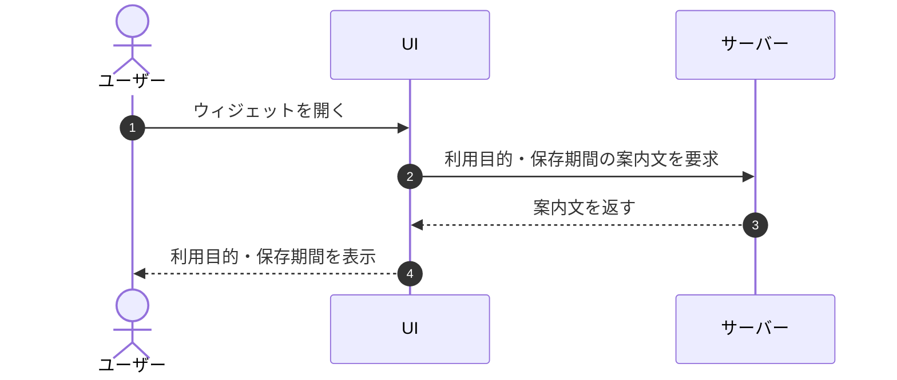
```mermaid
sequenceDiagram
  autonumber
  actor U as ユーザー
  participant UI as UI
  participant S as サーバー
  U->>UI: ウィジェットを開く
  UI->>S: 利用目的・保存期間の案内文を要求
  S-->>UI: 案内文を返す
  UI-->>U: 利用目的・保存期間を表示
```

## FR-138: 退会時に契約データを定められた猶予期間後に削除

> **この機能要件は「退会時に契約データを定められた猶予期間後に削除」を定義します。**

*種別 機能要件 ・ 機能グループ プライバシー・データ管理 ・ 優先度 P0 ・ ステータス ドラフト*

### 要件

退会時に契約データを定められた猶予期間後に削除できること

### シーケンス

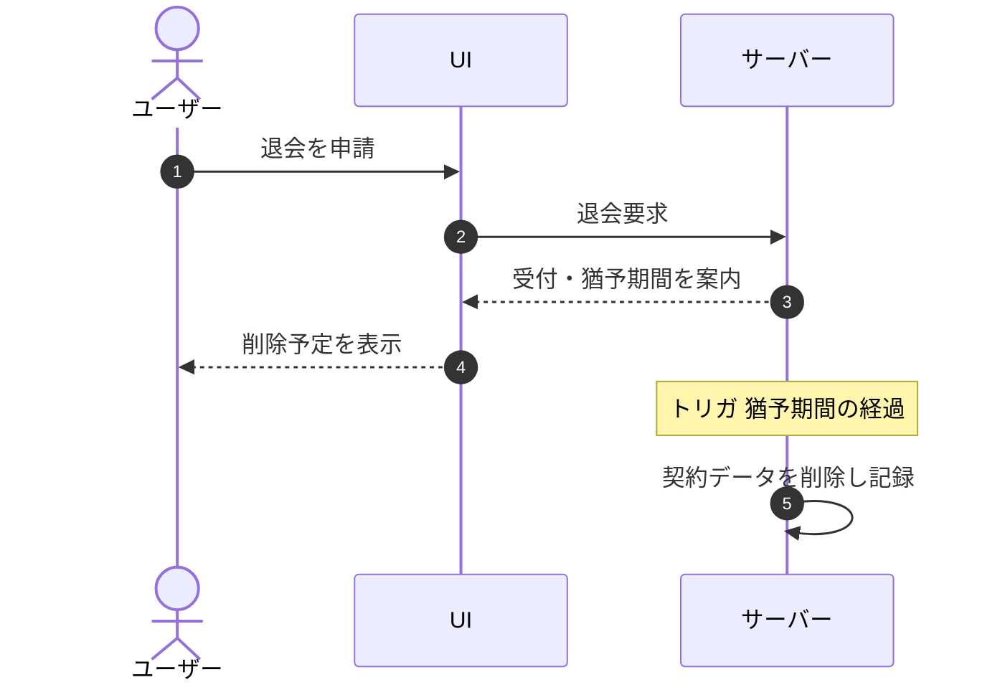
```mermaid
sequenceDiagram
  autonumber
  actor U as ユーザー
  participant UI as UI
  participant S as サーバー
  U->>UI: 退会を申請
  UI->>S: 退会要求
  S-->>UI: 受付・猶予期間を案内
  UI-->>U: 削除予定を表示
  Note over S: トリガ 猶予期間の経過
  S->>S: 契約データを削除し記録
```

## FR-139: 利用規約・プライバシーポリシー改定時に再同意を取得

> **この機能要件は「利用規約・プライバシーポリシー改定時に再同意を取得」を定義します。**

*種別 機能要件 ・ 機能グループ プライバシー・データ管理 ・ 優先度 P0 ・ ステータス ドラフト*

### 要件

利用規約・プライバシーポリシー改定時に再同意を取得できること。
1. 利用規約とプライバシーポリシーは個別の文書として版管理し、それぞれ同意を取得する
2. 改定された文書のみを再同意の対象とする
3. 閲覧画面も文書ごとに分離する

### シーケンス

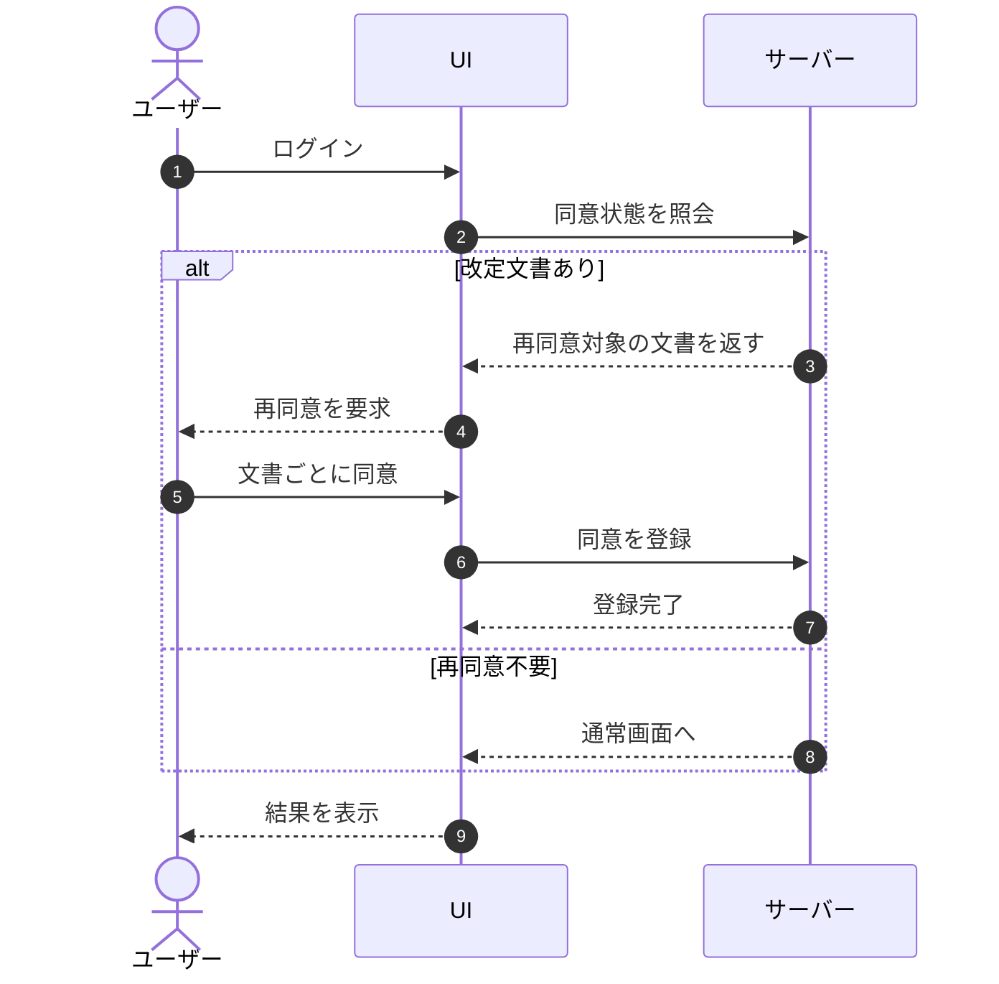
```mermaid
sequenceDiagram
  autonumber
  actor U as ユーザー
  participant UI as UI
  participant S as サーバー
  U->>UI: ログイン
  UI->>S: 同意状態を照会
  alt 改定文書あり
    S-->>UI: 再同意対象の文書を返す
    UI-->>U: 再同意を要求
    U->>UI: 文書ごとに同意
    UI->>S: 同意を登録
    S-->>UI: 登録完了
  else 再同意不要
    S-->>UI: 通常画面へ
  end
  UI-->>U: 結果を表示
```

## FR-140: データ保存リージョンの選択・明示

> **この機能要件は「データ保存リージョンの選択・明示」を定義します。**

*種別 機能要件 ・ 機能グループ プライバシー・データ管理 ・ 優先度 P1 ・ ステータス ドラフト*

### 要件

必要なデータ保存リージョン(例:日本国内など)を選択またはサービス側で明示できること

### シーケンス

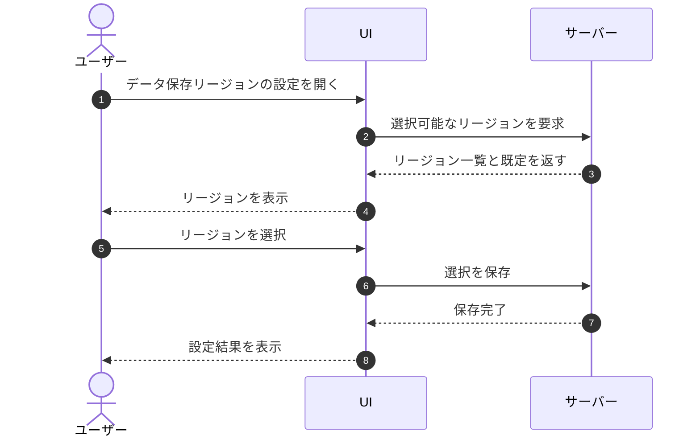
```mermaid
sequenceDiagram
  autonumber
  actor U as ユーザー
  participant UI as UI
  participant S as サーバー
  U->>UI: データ保存リージョンの設定を開く
  UI->>S: 選択可能なリージョンを要求
  S-->>UI: リージョン一覧と既定を返す
  UI-->>U: リージョンを表示
  U->>UI: リージョンを選択
  UI->>S: 選択を保存
  S-->>UI: 保存完了
  UI-->>U: 設定結果を表示
```

## FR-141: 退会猶予期間中の新規書込み禁止

> **この機能要件は「退会猶予期間中の新規書込み禁止」を定義します。**

*種別 機能要件 ・ 機能グループ プライバシー・データ管理 ・ 優先度 P0 ・ ステータス ドラフト*

### 要件

退会猶予期間中は、アカウント利用者の管理画面ログインを許可しつつ新規書込みを禁止すること(参照中心の運用)。
1. 管理画面へのログインと既存データの参照は許可する
2. 新規 FAQ 登録・新規ウィジェット応答・課金変更などの新規書込みは不可とする

### シーケンス

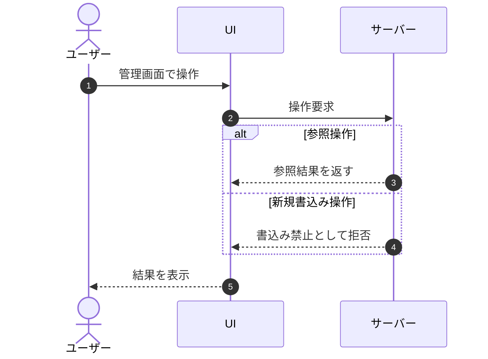
```mermaid
sequenceDiagram
  autonumber
  actor U as ユーザー
  participant UI as UI
  participant S as サーバー
  U->>UI: 管理画面で操作
  UI->>S: 操作要求
  alt 参照操作
    S-->>UI: 参照結果を返す
  else 新規書込み操作
    S-->>UI: 書込み禁止として拒否
  end
  UI-->>U: 結果を表示
```

## FR-142: ウィジェットで Cookie 利用について同意取得バナーを表示

> **この機能要件は「ウィジェットで Cookie 利用について同意取得バナーを表示」を定義します。**

*種別 機能要件 ・ 機能グループ プライバシー・データ管理 ・ 優先度 P1 ・ ステータス ドラフト*

### 要件

ウィジェットで Cookie 利用について同意取得バナーを表示できること。
1. 必須 Cookie 以外はオプトインとする
2. 第三者トラッキング系は同意取得後にのみ有効化する

### シーケンス

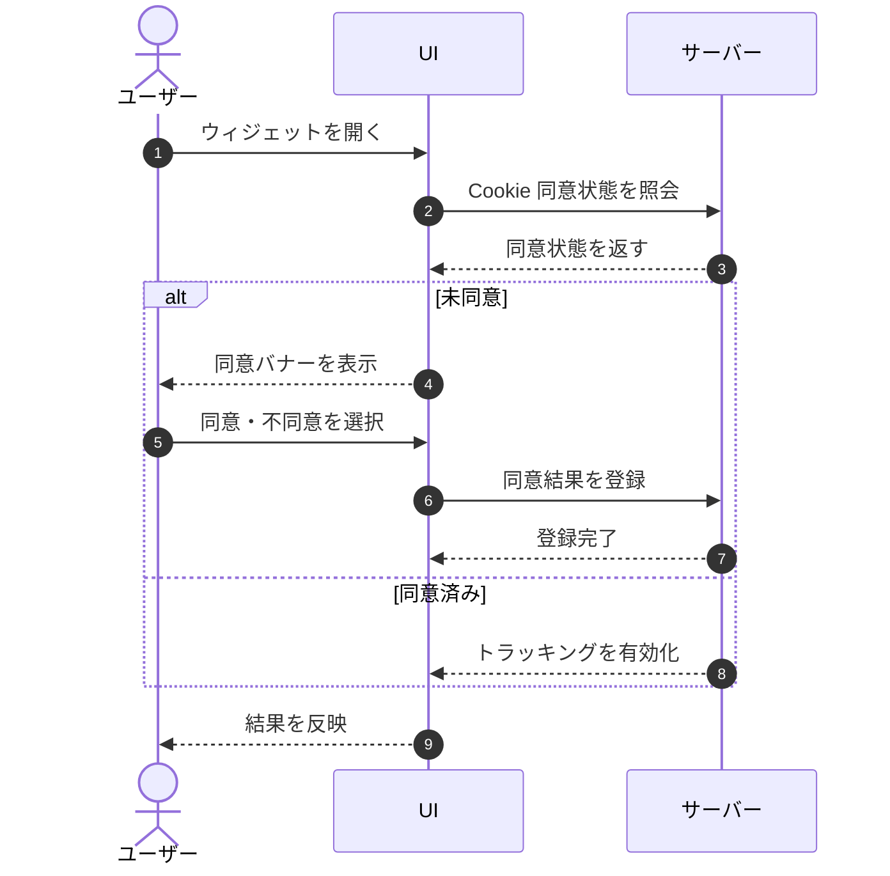
```mermaid
sequenceDiagram
  autonumber
  actor U as ユーザー
  participant UI as UI
  participant S as サーバー
  U->>UI: ウィジェットを開く
  UI->>S: Cookie 同意状態を照会
  S-->>UI: 同意状態を返す
  alt 未同意
    UI-->>U: 同意バナーを表示
    U->>UI: 同意・不同意を選択
    UI->>S: 同意結果を登録
    S-->>UI: 登録完了
  else 同意済み
    S-->>UI: トラッキングを有効化
  end
  UI-->>U: 結果を反映
```

## FR-143: 通信の暗号化(HTTPS)

> **この機能要件は「通信の暗号化(HTTPS)」を定義します。**

*種別 機能要件 ・ 機能グループ セキュリティ ・ 優先度 P0 ・ ステータス ドラフト*

### 要件

通信は暗号化されること(HTTPS)

### シーケンス

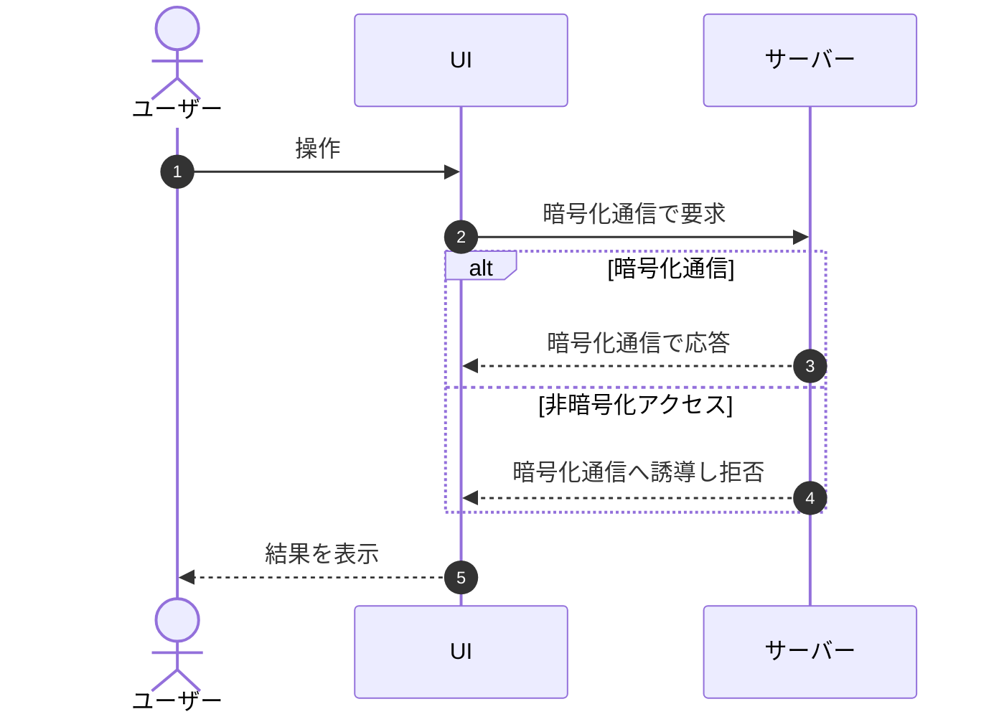
```mermaid
sequenceDiagram
  autonumber
  actor U as ユーザー
  participant UI as UI
  participant S as サーバー
  U->>UI: 操作
  UI->>S: 暗号化通信で要求
  alt 暗号化通信
    S-->>UI: 暗号化通信で応答
  else 非暗号化アクセス
    S-->>UI: 暗号化通信へ誘導し拒否
  end
  UI-->>U: 結果を表示
```

## FR-144: 機密項目の暗号化・ハッシュ保存

> **この機能要件は「機密項目の暗号化・ハッシュ保存」を定義します。**

*種別 機能要件 ・ 機能グループ セキュリティ ・ 優先度 P0 ・ ステータス ドラフト*

### 要件

保存データのうち機密度の高い項目(パスワード、トークン、課金情報等)は暗号化または安全なハッシュで保存されること

### シーケンス

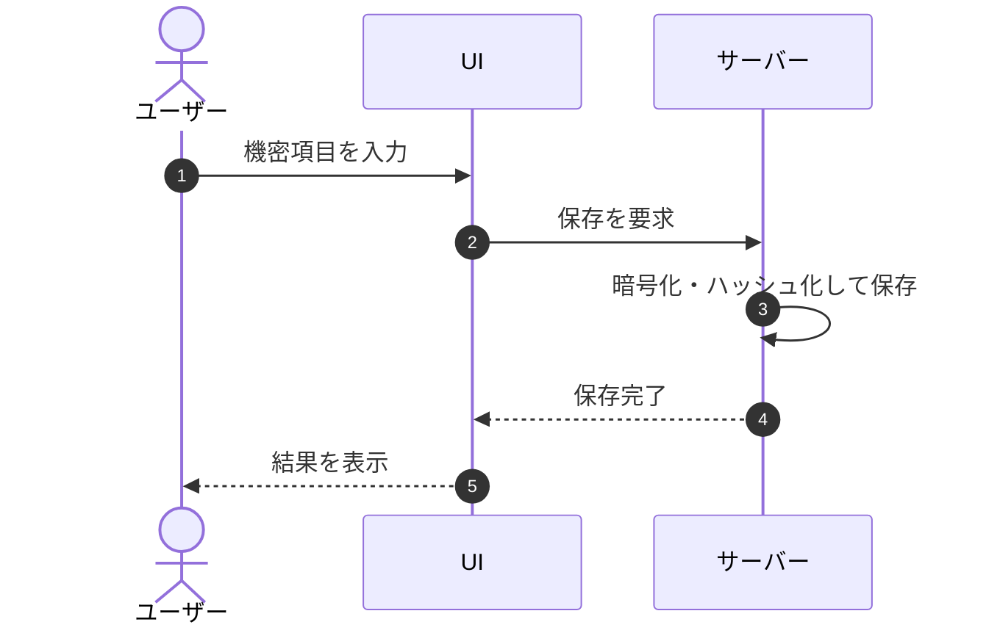
```mermaid
sequenceDiagram
  autonumber
  actor U as ユーザー
  participant UI as UI
  participant S as サーバー
  U->>UI: 機密項目を入力
  UI->>S: 保存を要求
  S->>S: 暗号化・ハッシュ化して保存
  S-->>UI: 保存完了
  UI-->>U: 結果を表示
```

## FR-145: API・ウィジェットのレート制限

> **この機能要件は「API・ウィジェットのレート制限」を定義します。**

*種別 機能要件 ・ 機能グループ セキュリティ ・ 優先度 P0 ・ ステータス ドラフト*

### 要件

API・ウィジェットに対してレート制限ができること

### シーケンス

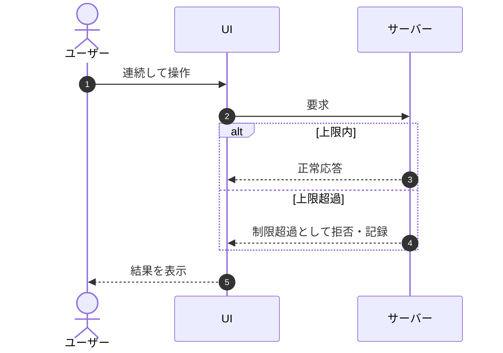
```mermaid
sequenceDiagram
  autonumber
  actor U as ユーザー
  participant UI as UI
  participant S as サーバー
  U->>UI: 連続して操作
  UI->>S: 要求
  alt 上限内
    S-->>UI: 正常応答
  else 上限超過
    S-->>UI: 制限超過として拒否・記録
  end
  UI-->>U: 結果を表示
```

## FR-146: 埋め込み元ドメインの検証・制限

> **この機能要件は「埋め込み元ドメインの検証・制限」を定義します。**

*種別 機能要件 ・ 機能グループ セキュリティ ・ 優先度 P0 ・ ステータス ドラフト*

### 要件

ウィジェットの埋め込み元ドメインを検証できること(許可ドメイン以外からの読み込み拒否)

### シーケンス

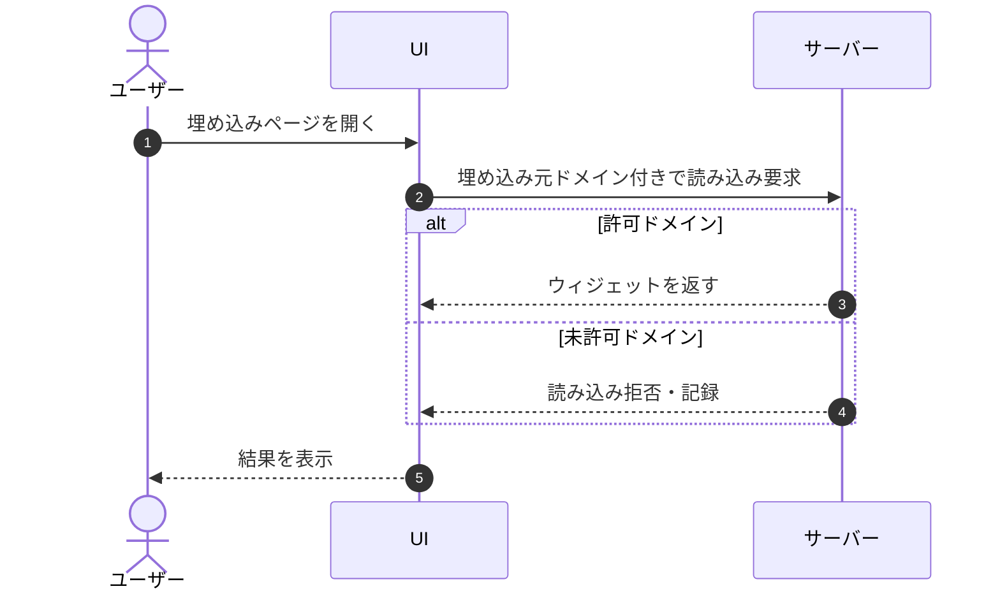
```mermaid
sequenceDiagram
  autonumber
  actor U as ユーザー
  participant UI as UI
  participant S as サーバー
  U->>UI: 埋め込みページを開く
  UI->>S: 埋め込み元ドメイン付きで読み込み要求
  alt 許可ドメイン
    S-->>UI: ウィジェットを返す
  else 未許可ドメイン
    S-->>UI: 読み込み拒否・記録
  end
  UI-->>U: 結果を表示
```

## FR-147: 管理者の操作ログを監査用に保持

> **この機能要件は「管理者の操作ログを監査用に保持」を定義します。**

*種別 機能要件 ・ 機能グループ セキュリティ ・ 優先度 P0 ・ ステータス ドラフト*

### 要件

管理者の操作ログを監査用に保持できること

### シーケンス

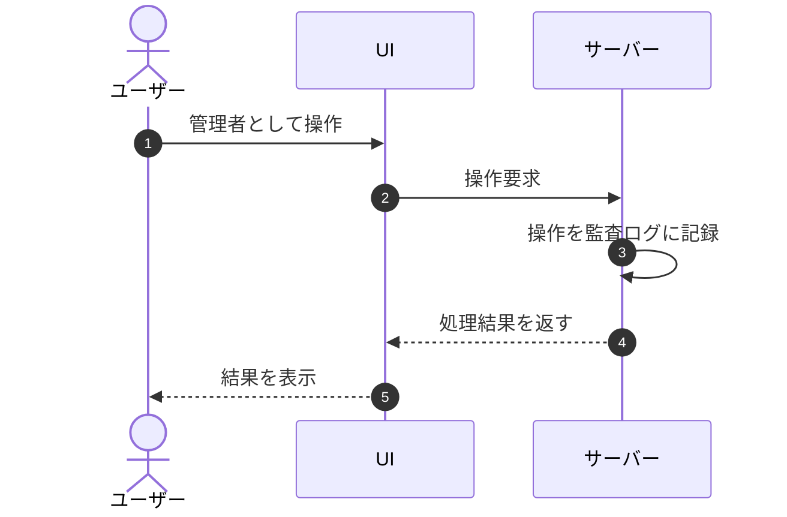
```mermaid
sequenceDiagram
  autonumber
  actor U as ユーザー
  participant UI as UI
  participant S as サーバー
  U->>UI: 管理者として操作
  UI->>S: 操作要求
  S->>S: 操作を監査ログに記録
  S-->>UI: 処理結果を返す
  UI-->>U: 結果を表示
```

## FR-148: 最小権限によるアクセス制御・データ分離

> **この機能要件は「最小権限によるアクセス制御・データ分離」を定義します。**

*種別 機能要件 ・ 機能グループ セキュリティ ・ 優先度 P0 ・ ステータス ドラフト*

### 要件

アクセス制御は最小権限の原則に従うこと(オーナー境界によるデータ分離、ユーザー種別別認可)

### シーケンス

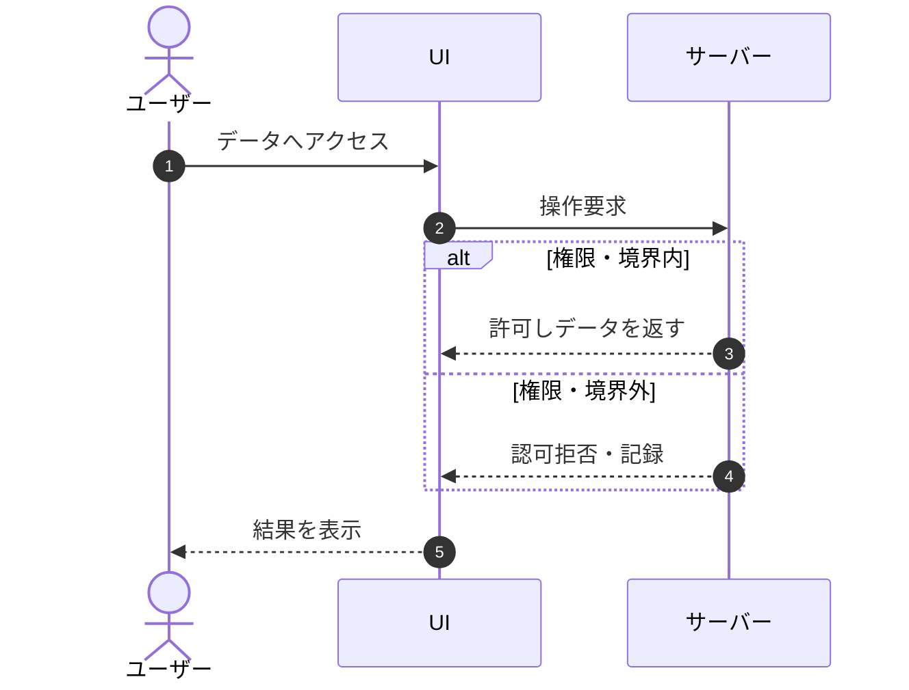
```mermaid
sequenceDiagram
  autonumber
  actor U as ユーザー
  participant UI as UI
  participant S as サーバー
  U->>UI: データへアクセス
  UI->>S: 操作要求
  alt 権限・境界内
    S-->>UI: 許可しデータを返す
  else 権限・境界外
    S-->>UI: 認可拒否・記録
  end
  UI-->>U: 結果を表示
```

## FR-149: Bot 対策(CAPTCHA 等)を必要に応じて実施

> **この機能要件は「Bot 対策(CAPTCHA 等)を必要に応じて実施」を定義します。**

*種別 機能要件 ・ 機能グループ セキュリティ ・ 優先度 P1 ・ ステータス ドラフト*

### 要件

Bot 対策(CAPTCHA 等)を必要に応じて実施できること

### シーケンス

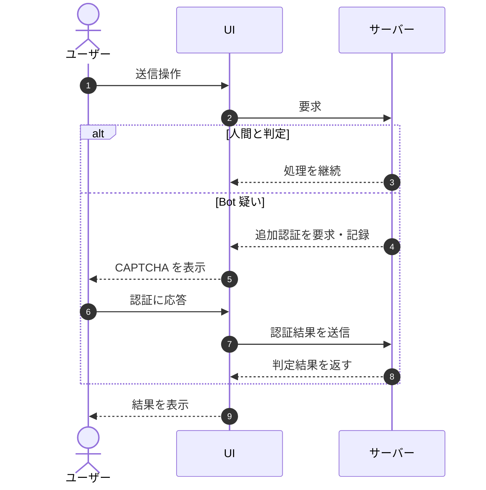
```mermaid
sequenceDiagram
  autonumber
  actor U as ユーザー
  participant UI as UI
  participant S as サーバー
  U->>UI: 送信操作
  UI->>S: 要求
  alt 人間と判定
    S-->>UI: 処理を継続
  else Bot 疑い
    S-->>UI: 追加認証を要求・記録
    UI-->>U: CAPTCHA を表示
    U->>UI: 認証に応答
    UI->>S: 認証結果を送信
    S-->>UI: 判定結果を返す
  end
  UI-->>U: 結果を表示
```

## FR-150: 不審なリクエスト(大量アクセス、未許可ドメイン等)を検知・記録

> **この機能要件は「不審なリクエスト(大量アクセス、未許可ドメイン等)を検知・記録」を定義します。**

*種別 機能要件 ・ 機能グループ セキュリティ ・ 優先度 P0 ・ ステータス ドラフト*

### 要件

不審なリクエスト(大量アクセス、未許可ドメイン等)を検知・記録できること

### シーケンス

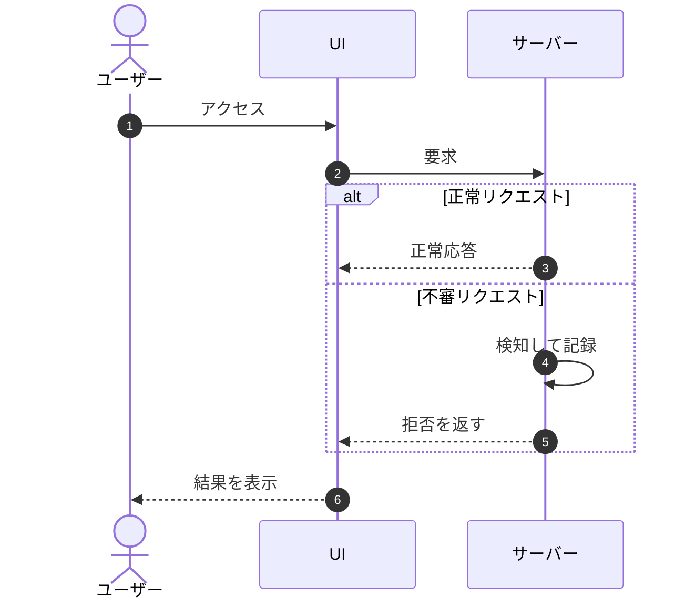
```mermaid
sequenceDiagram
  autonumber
  actor U as ユーザー
  participant UI as UI
  participant S as サーバー
  U->>UI: アクセス
  UI->>S: 要求
  alt 正常リクエスト
    S-->>UI: 正常応答
  else 不審リクエスト
    S->>S: 検知して記録
    S-->>UI: 拒否を返す
  end
  UI-->>U: 結果を表示
```

## FR-151: メンバー管理に関する操作を監査ログに記録

> **この機能要件は「メンバー管理に関する操作を監査ログに記録」を定義します。**

*種別 機能要件 ・ 機能グループ セキュリティ ・ 優先度 P0 ・ ステータス ドラフト*

### 要件

メンバー管理に関する操作を監査ログに記録できること。
1. 記録対象の操作は、メンバー招待・招待再送・プロジェクト割当の変更・プロジェクトからの離脱・メンバー削除とする
2. 記録項目は、操作者・対象メンバー・変更前後のプロジェクト割当差分(該当時)・対応理由(任意)・実行時刻を含む

### シーケンス

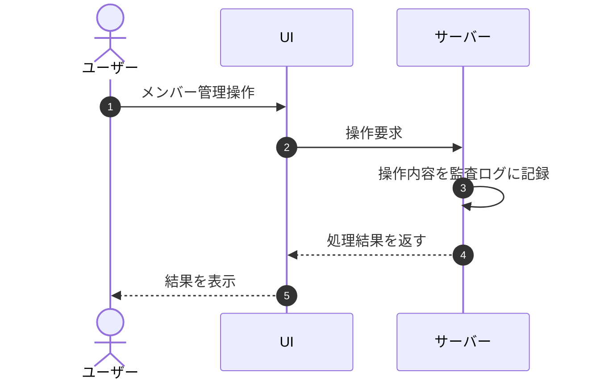
```mermaid
sequenceDiagram
  autonumber
  actor U as ユーザー
  participant UI as UI
  participant S as サーバー
  U->>UI: メンバー管理操作
  UI->>S: 操作要求
  S->>S: 操作内容を監査ログに記録
  S-->>UI: 処理結果を返す
  UI-->>U: 結果を表示
```

## FR-152: ウィジェット公開キーのローテーション機能を管理者操作で提供

> **この機能要件は「ウィジェット公開キーのローテーション機能を管理者操作で提供」を定義します。**

*種別 機能要件 ・ 機能グループ セキュリティ ・ 優先度 P0 ・ ステータス ドラフト*

### 要件

ウィジェット公開キーのローテーション機能を管理者操作で提供すること。
1. 新キー発行と同時に、旧キーを **24 時間の猶予期間** 付きの失効予告状態とする
2. 猶予中は新旧両キーで認証を許可し、アクセスログを両キーで記録する(どちらの利用率が高いかを管理者が確認できる)
3. 猶予期間の経過後は、旧キーを完全失効とする

### シーケンス

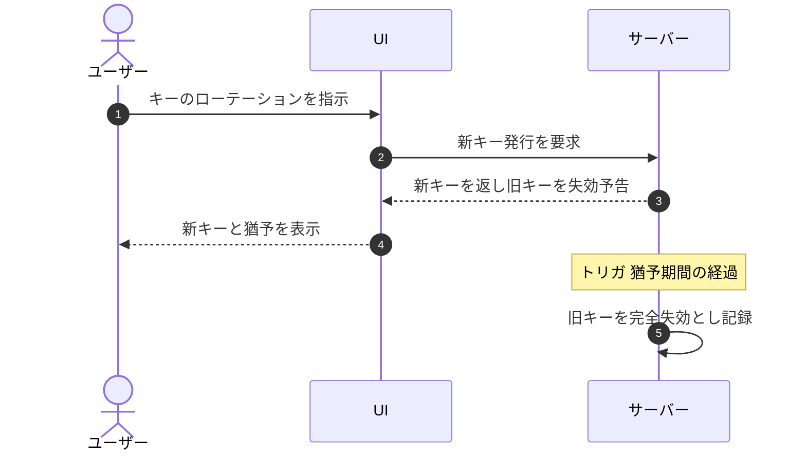
```mermaid
sequenceDiagram
  autonumber
  actor U as ユーザー
  participant UI as UI
  participant S as サーバー
  U->>UI: キーのローテーションを指示
  UI->>S: 新キー発行を要求
  S-->>UI: 新キーを返し旧キーを失効予告
  UI-->>U: 新キーと猶予を表示
  Note over S: トリガ 猶予期間の経過
  S->>S: 旧キーを完全失効とし記録
```

## FR-153: 公開キーの無期限運用

> **この機能要件は「公開キーの無期限運用」を定義します。**

*種別 機能要件 ・ 機能グループ セキュリティ ・ 優先度 P0 ・ ステータス ドラフト*

### 要件

ウィジェット公開キーには有効期限を設けないこと(無期限)。
1. キーの失効は再発行(ローテーション、<a href="05_notification-fr.md#FR-113">FR-113</a>)によってのみ行う
2. 再発行時は旧キーを 24 時間猶予で失効させる

### シーケンス

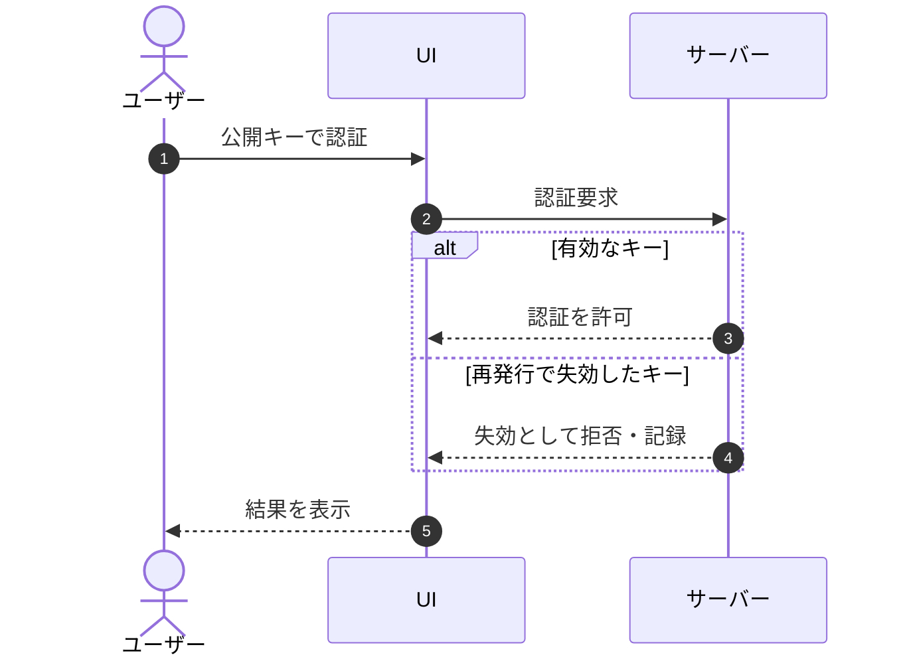
```mermaid
sequenceDiagram
  autonumber
  actor U as ユーザー
  participant UI as UI
  participant S as サーバー
  U->>UI: 公開キーで認証
  UI->>S: 認証要求
  alt 有効なキー
    S-->>UI: 認証を許可
  else 再発行で失効したキー
    S-->>UI: 失効として拒否・記録
  end
  UI-->>U: 結果を表示
```

## FR-154: 不正利用(大量送信・Bot 疑い・規約違反)の検知と自動ブロックを行う

> **この機能要件は「不正利用(大量送信・Bot 疑い・規約違反)の検知と自動ブロックを行う」を定義します。**

*種別 機能要件 ・ 機能グループ セキュリティ ・ 優先度 P1 ・ ステータス ドラフト*

### 要件

不正利用(大量送信・Bot 疑い・規約違反)の検知と自動ブロックを行うこと。
1. 自動検知はメインシステム側で行う
2. 判定ルール・しきい値は契約別に上書きできる(設定は他システムの操作を契機とする)
3. 自動ブロックはメインシステム側で実行する
4. 自動ブロック発火時は管理者ユーザーへ即時通知し、申し立て窓口を案内する

### シーケンス

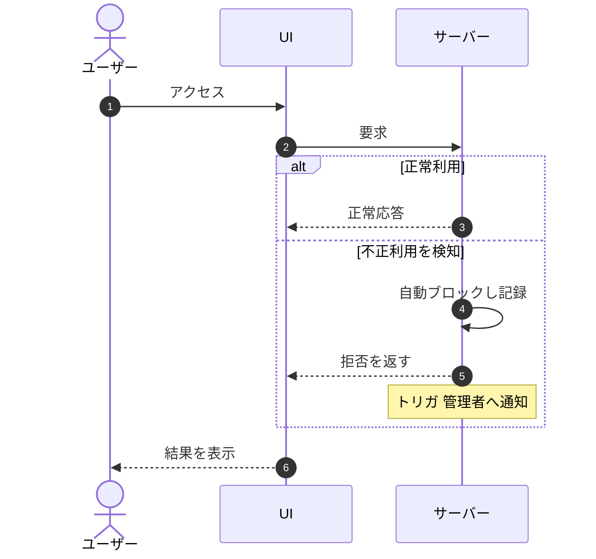
```mermaid
sequenceDiagram
  autonumber
  actor U as ユーザー
  participant UI as UI
  participant S as サーバー
  U->>UI: アクセス
  UI->>S: 要求
  alt 正常利用
    S-->>UI: 正常応答
  else 不正利用を検知
    S->>S: 自動ブロックし記録
    S-->>UI: 拒否を返す
    Note over S: トリガ 管理者へ通知
  end
  UI-->>U: 結果を表示
```

---

<!-- portal-bottom -->
[← 要件仕様](index.md) ・ [要件定義](../index.md) ・ [↑ 設計ポータル](../../README.md)
<!-- /portal-bottom -->
