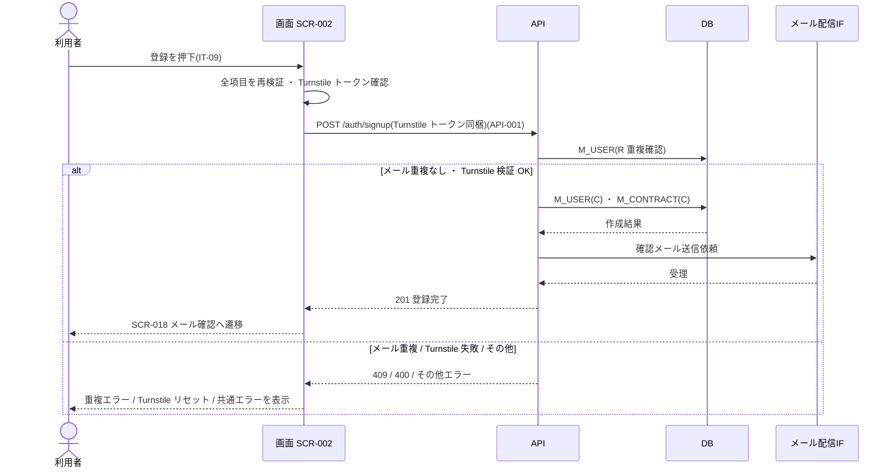

<!-- portal-top -->
[設計ポータル](../../README.md) ／ [要件定義](../index.md) ／ [業務ユースケース](index.md) ／ **UC-016: 「登録して確認メールを送信する」を押下**
<!-- /portal-top -->

# UC-016: 「登録して確認メールを送信する」を押下

> **全項目を再検証し Turnstile トークンを添えて新規登録 API を呼び出し、利用者・契約を作成して確認メール送信フローへ遷移する最重要ユースケース。**

*主アクター 未認証ユーザー(新規オーナー) ・ ステータス ドラフト ・ 再構成 P2*

| 項目 | 内容 |
|---|---|
| 業務ユースケースID | UC-016 |
| 業務ユースケース名 | 「登録して確認メールを送信する」を押下 |
| 対応要件ID | [FR-001](../01_specifications/FR-001.md#FR-001) ・ [FR-003](../01_specifications/FR-003.md#FR-003) ・ [FR-149](../01_specifications/FR-149.md#FR-149) ・ [FR-145](../01_specifications/FR-145.md#FR-145) ・ [FR-150](../01_specifications/FR-150.md#FR-150) |
| 主アクター | 未認証ユーザー(新規オーナー) |
| 目的 | 全項目を再検証し Turnstile トークンを添えて新規登録 API を呼び出し、利用者・契約を作成して確認メール送信フローへ遷移する最重要ユースケース。 |

## 事前条件

必須項目が入力され、利用規約・プライバシーポリシーに同意し、Turnstile トークン(IT-11)を取得している

## 基本フロー

1. 全項目のバリデーション(EV-02〜EV-07)を実行し、エラーがある場合は登録を中止してエラーを表示する。
2. Turnstile トークン(IT-11)が未取得の場合は登録を中止してエラーを表示する。
3. 新規登録 API(`POST /auth/signup` = [API-001](../../02_basic_design/03_apis/API-001.md#API-001))を、Turnstile トークンをリクエストに含めて呼び出す。
4. API はメール重複を確認し、新規オーナーの利用者(`M_USER`、メール一意)と契約(`M_CONTRACT`、1 契約 = 1 オーナー)を作成する。
5. API はメール配信 IF 経由で確認メールを送信する。
6. 成功時、画面は SCR-018(メール確認)へ遷移する。

## 代替フロー

—(本イベントは単一の正常フロー。条件分岐は基本フローに含む)

## 例外フロー

- メール重複(409): 該当フィールドにエラーメッセージを表示し、アカウントを作成しない。
- Turnstile 検証失敗(400): フォーム上部にエラーを表示し、Turnstile ウィジェットをリセットする。
- 入力再検証エラー: 送信を中止し、該当フィールド直下にエラーを表示する。
- その他失敗: フォーム上部にエラーメッセージを表示する。

## 事後条件

成功時は利用者(`M_USER`)と契約(`M_CONTRACT`)を作成し確認メールを送信したうえで SCR-018 メール確認へ遷移する。失敗時はアカウントを作成せず、メール重複・Turnstile 検証失敗・その他に応じたエラーを表示する

## 関連

| 関連区分 | 内容 |
|---|---|
| 関連画面ID | [SCR-002](../../02_basic_design/01_screens/SCR-002.md#SCR-002) ・ [SCR-018](../../02_basic_design/01_screens/SCR-018.md#SCR-018) |
| 関連画面イベントID | [EVT-016](../../02_basic_design/02_screen_events/EVT-016.md#EVT-016) |
| 関連API ID | [API-001](../../02_basic_design/03_apis/API-001.md#API-001) |
| 関連テーブルID | `M_USER` = [TBL-001](../../02_basic_design/04_database/TBL-001.md#TBL-001) ・ `M_CONTRACT` = [TBL-002](../../02_basic_design/04_database/TBL-002.md#TBL-002) |

## 備考

再構成 P2 で旧 `UC-SCR-002-EV10`(画面 SCR-002 のイベント `EV-10`)から導出。トリガー: EV-10: 登録ボタン(IT-09)を押下。シーケンス図は P6(SEQ)で保持する。

P7 後続(第2段)で FR-145 の対応業務UCとして再連結した(要レビュー)。

P7 後続(第2段)で FR-150 の対応業務UCとして再連結した(要レビュー)。

---

<!-- portal-bottom -->
[← 業務ユースケース](index.md) ・ [要件定義](../index.md) ・ [↑ 設計ポータル](../../README.md)
<!-- /portal-bottom -->
