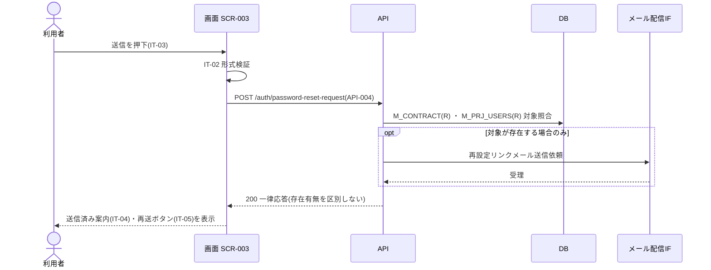

<!-- portal-top -->
[設計ポータル](../../README.md) ／ [要件定義](../index.md) ／ [業務ユースケース](index.md) ／ **UC-020: 「再設定リンクを送信」を押下**
<!-- /portal-top -->

# UC-020: 「再設定リンクを送信」を押下

> **メールアドレスを検証してパスワード再設定要求 API を発行し、存在有無を区別しない一律応答を返して送信済み案内を表示するユースケース。**

*主アクター 未認証ユーザー(再設定を要するアカウント利用者) ・ ステータス ドラフト ・ 再構成 P2*

| 項目 | 内容 |
|---|---|
| 業務ユースケースID | UC-020 |
| 業務ユースケース名 | 「再設定リンクを送信」を押下 |
| 対応要件ID | [FR-004](../01_specifications/01_account.md#FR-004) |
| 主アクター | 未認証ユーザー(再設定を要するアカウント利用者) |
| 目的 | メールアドレスを検証してパスワード再設定要求 API を発行し、存在有無を区別しない一律応答を返して送信済み案内を表示するユースケース。 |

## 事前条件

段階 1 のメールアドレス入力(IT-02)が表示されている

## 基本フロー

1. 画面が IT-02 の形式バリデーションを実行する。
2. 形式正常時、パスワード再設定要求 API(`POST /auth/password-reset-request` = [API-004](../../02_basic_design/03_apis/API-004.md#API-004))を発行する。
3. API は対象アカウントの有無を応答で区別せず、該当時はメール配信 IF 経由で再設定リンクメールを送信する。
4. 応答受取後、画面は送信済み案内(IT-04)と再送ボタン(IT-05、カウントダウン付き)を表示する。

## 代替フロー

—(本イベントは単一の正常フロー。条件分岐は基本フローに含む)

## 例外フロー

- 形式不正: IT-02 直下にエラーメッセージを表示してリクエストを中断する。
- API 失敗: 送信済み案内へ遷移せず、エラーを表示する(列挙攻撃対策のため対象有無は明かさない)。

> [!NOTE]
> 段階 1 の応答はメールアドレスの存在有無を区別しません(列挙攻撃対策)。図はメール送信を「該当時のみ」と抽象化し、対象判定の内部分岐は展開しません。

## 事後条件

形式正常時は再設定要求 API を発行し、メールアドレスの存在有無を区別しない一律応答後に送信済み案内(IT-04)と再送ボタン(IT-05、カウントダウン付き)を表示する

## 関連

| 関連区分 | 内容 |
|---|---|
| 関連画面ID | [SCR-003](../../02_basic_design/01_screens/SCR-003.md#SCR-003) |
| 関連画面イベントID | [EVT-020](../../02_basic_design/02_screen_events/EVT-020.md#EVT-020) |
| 関連API ID | [API-004](../../02_basic_design/03_apis/API-004.md#API-004) |
| 関連テーブルID | `M_CONTRACT` = [TBL-002](../../02_basic_design/04_database/TBL-002.md#TBL-002) ・ `M_PRJ_USERS` = [TBL-003](../../02_basic_design/04_database/TBL-003.md#TBL-003) |

## 備考

再構成 P2 で旧 `UC-SCR-003-EV02`(画面 SCR-003 のイベント `EV-02`)から導出。トリガー: EV-02: 送信ボタン(IT-03)を押下。シーケンス図は P6(SEQ)で保持する。

---

<!-- portal-bottom -->
[← 業務ユースケース](index.md) ・ [要件定義](../index.md) ・ [↑ 設計ポータル](../../README.md)
<!-- /portal-bottom -->
