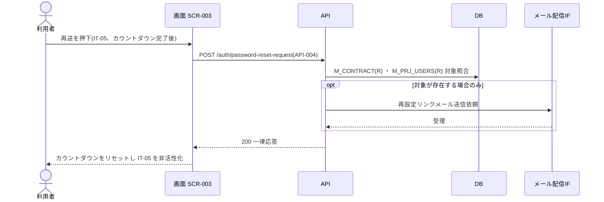

<!-- portal-top -->
[設計ポータル](../../README.md) ／ [要件定義](../index.md) ／ [業務ユースケース](index.md) ／ **UC-021: 「メールを再送信する」を押下**
<!-- /portal-top -->

# UC-021: 「メールを再送信する」を押下

> **レート制限解除後にパスワード再設定要求 API を再発行し、カウントダウンをリセットして再送ボタンを再び非活性化するユースケース。**

*主アクター 未認証ユーザー(再設定を要するアカウント利用者) ・ ステータス ドラフト ・ 再構成 P2*

| 項目 | 内容 |
|---|---|
| 業務ユースケースID | UC-021 |
| 業務ユースケース名 | 「メールを再送信する」を押下 |
| 対応要件ID | [FR-004](../01_specifications/01_account-fr.md#FR-004) |
| 主アクター | 未認証ユーザー(再設定を要するアカウント利用者) |
| 目的 | レート制限解除後にパスワード再設定要求 API を再発行し、カウントダウンをリセットして再送ボタンを再び非活性化するユースケース。 |

## 事前条件

段階 1 送信済みで、再送ボタン(IT-05)が表示されている

## 基本フロー

1. 5 分のレート制限カウントダウン中は IT-05 が非活性のため操作できない。
2. カウントダウン完了後、利用者が IT-05 を押下する。
3. 画面はパスワード再設定要求 API([API-004](../../02_basic_design/03_apis/API-004.md#API-004))を再発行する。
4. 応答受取後、画面はカウントダウンをリセットして IT-05 を再び非活性にする。

## 代替フロー

—(本イベントは単一の正常フロー。条件分岐は基本フローに含む)

## 例外フロー

- API 失敗: カウントダウンをリセットせず、エラーを表示する。

## 事後条件

カウントダウン完了後に再設定要求 API を再発行し、応答受取後にカウントダウンをリセットして IT-05 を再び非活性にする

## 関連

| 関連区分 | 内容 |
|---|---|
| 関連画面ID | [SCR-003](../../02_basic_design/01_screens/SCR-003.md#SCR-003) |
| 関連画面イベントID | [EVT-021](../../02_basic_design/02_screen_events/EVT-021.md#EVT-021) |
| 関連API ID | [API-004](../../02_basic_design/03_apis/API-004.md#API-004) |
| 関連テーブルID | `M_CONTRACT` = [TBL-002](../../02_basic_design/04_database/TBL-002.md#TBL-002) ・ `M_PRJ_USERS` = [TBL-003](../../02_basic_design/04_database/TBL-003.md#TBL-003) |

## 備考

再構成 P2 で旧 `UC-SCR-003-EV03`(画面 SCR-003 のイベント `EV-03`)から導出。トリガー: EV-03: 再送ボタン(IT-05)を押下。シーケンス図は P6(SEQ)で保持する。

---

<!-- portal-bottom -->
[← 業務ユースケース](index.md) ・ [要件定義](../index.md) ・ [↑ 設計ポータル](../../README.md)
<!-- /portal-bottom -->
