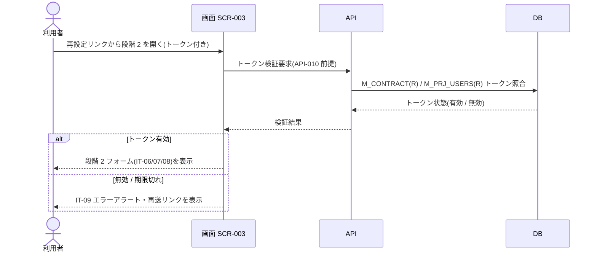

<!-- portal-top -->
[設計ポータル](../../README.md) ／ [要件定義](../index.md) ／ [業務ユースケース](index.md) ／ **UC-022: 初期表示(段階 2)**
<!-- /portal-top -->

# UC-022: 初期表示(段階 2)

> **再設定リンクの URL トークンを検証し、有効時は新パスワード入力フォーム、無効時はエラーアラートを表示するユースケース。**

*主アクター 未認証ユーザー(再設定リンクから到達) ・ ステータス ドラフト ・ 再構成 P2*

| 項目 | 内容 |
|---|---|
| 業務ユースケースID | UC-022 |
| 業務ユースケース名 | 初期表示(段階 2) |
| 対応要件ID | [FR-004](../01_specifications/FR-004.md#FR-004) |
| 主アクター | 未認証ユーザー(再設定リンクから到達) |
| 目的 | 再設定リンクの URL トークンを検証し、有効時は新パスワード入力フォーム、無効時はエラーアラートを表示するユースケース。 |

## 事前条件

メールの再設定リンク(トークン付き URL)からアクセスした(段階 2)

## 基本フロー

1. 画面が再設定リンクの URL トークンを取得する。
2. 画面はトークンを検証する(有効期限 1 時間)。
3. トークン有効時、タイムライン(IT-01、段階 2 強調)と新パスワードフォーム(IT-06・IT-07・IT-08)を表示する。

## 代替フロー

—(本イベントは単一の正常フロー。条件分岐は基本フローに含む)

## 例外フロー

- トークン無効 / 期限切れ: IT-09 エラーアラートと再送リンクを表示する。

> [!NOTE]
> トークン検証はパスワード再設定確定 API([API-010](../../02_basic_design/03_apis/API-010.md#API-010))が前提とするトークンの妥当性に準じます。画面側の初期検証はフォーム表示可否の判定であり、最終確定は EV-07 で行います。

## 事後条件

トークン有効時はタイムライン(段階 2 強調)と新パスワードフォーム(IT-06・IT-07・IT-08)を表示する。無効 / 期限切れ時は IT-09 エラーアラートと再送リンクを表示する

## 関連

| 関連区分 | 内容 |
|---|---|
| 関連画面ID | [SCR-003](../../02_basic_design/01_screens/SCR-003.md#SCR-003) |
| 関連画面イベントID | [EVT-022](../../02_basic_design/02_screen_events/EVT-022.md#EVT-022) |
| 関連API ID | [API-010](../../02_basic_design/03_apis/API-010.md#API-010) |
| 関連テーブルID | `M_CONTRACT` = [TBL-M-002](../../02_basic_design/04_database/TBL-M-002.md) ・ `M_PRJ_USERS` = [TBL-M-003](../../02_basic_design/04_database/TBL-M-003.md) |

## 備考

再構成 P2 で旧 `UC-SCR-003-EV04`(画面 SCR-003 のイベント `EV-04`)から導出。トリガー: EV-04: 初期表示(段階 2)。シーケンス図は P6(SEQ)で保持する。

---

<!-- portal-bottom -->
[← 業務ユースケース](index.md) ・ [要件定義](../index.md) ・ [↑ 設計ポータル](../../README.md)
<!-- /portal-bottom -->
