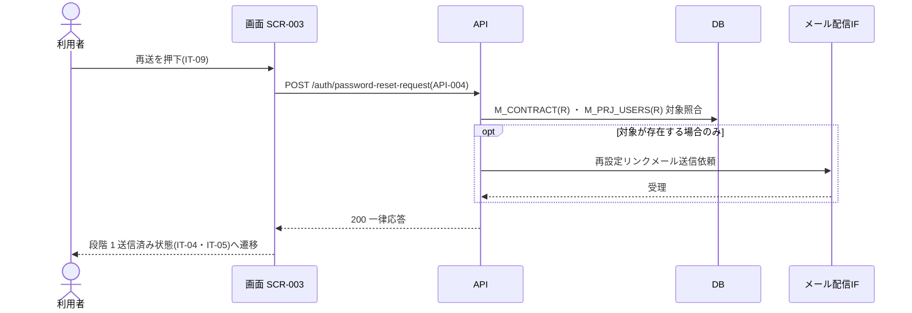

<!-- portal-top -->
[設計ポータル](../../README.md) ／ [要件定義](../index.md) ／ [業務ユースケース](index.md) ／ **UC-023: 「再送する」を押下(段階 2 エラー時)**
<!-- /portal-top -->

# UC-023: 「再送する」を押下(段階 2 エラー時)

> **段階 2 のトークンエラー画面から再設定要求 API を発行し、段階 1 送信済み状態へ復帰するユースケース。**

*主アクター 未認証ユーザー(段階 2 エラー画面に到達) ・ ステータス ドラフト ・ 再構成 P2*

| 項目 | 内容 |
|---|---|
| 業務ユースケースID | UC-023 |
| 業務ユースケース名 | 「再送する」を押下(段階 2 エラー時) |
| 対応要件ID | [FR-004](../01_specifications/FR-004.md#FR-004) |
| 主アクター | 未認証ユーザー(段階 2 エラー画面に到達) |
| 目的 | 段階 2 のトークンエラー画面から再設定要求 API を発行し、段階 1 送信済み状態へ復帰するユースケース。 |

## 事前条件

段階 2 で IT-09 エラーアラートと再送リンクが表示されている

## 基本フロー

1. 利用者が IT-09 の再送リンクを押下する。
2. 画面はパスワード再設定要求 API([API-004](../../02_basic_design/03_apis/API-004.md#API-004))を発行する。
3. 応答受取後、画面は段階 1 送信済み状態(IT-04・IT-05 表示)へ遷移する。

## 代替フロー

—(本イベントは単一の正常フロー。条件分岐は基本フローに含む)

## 例外フロー

- API 失敗: 段階 1 送信済み状態へ遷移せず、エラーを表示する。

## 事後条件

再設定要求 API を発行し、応答受取後に段階 1 送信済み状態(IT-04・IT-05 表示)へ遷移する

## 関連

| 関連区分 | 内容 |
|---|---|
| 関連画面ID | [SCR-003](../../02_basic_design/01_screens/SCR-003.md#SCR-003) |
| 関連画面イベントID | [EVT-023](../../02_basic_design/02_screen_events/EVT-023.md#EVT-023) |
| 関連API ID | [API-004](../../02_basic_design/03_apis/API-004.md#API-004) |
| 関連テーブルID | `M_CONTRACT` = [TBL-M-002](../../02_basic_design/04_database/TBL-M-002.md) ・ `M_PRJ_USERS` = [TBL-M-003](../../02_basic_design/04_database/TBL-M-003.md) |

## 備考

再構成 P2 で旧 `UC-SCR-003-EV05`(画面 SCR-003 のイベント `EV-05`)から導出。トリガー: EV-05: 再送リンク(IT-09)を押下。シーケンス図は P6(SEQ)で保持する。

---

<!-- portal-bottom -->
[← 業務ユースケース](index.md) ・ [要件定義](../index.md) ・ [↑ 設計ポータル](../../README.md)
<!-- /portal-bottom -->
