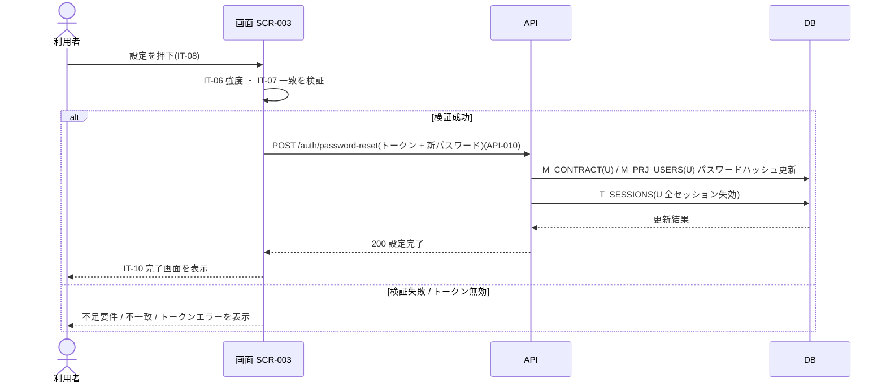

<!-- portal-top -->
[設計ポータル](../../README.md) ／ [要件定義](../index.md) ／ [業務ユースケース](index.md) ／ **UC-025: 「新しいパスワードを設定する」を押下**
<!-- /portal-top -->

# UC-025: 「新しいパスワードを設定する」を押下

> **強度・一致を検証してパスワード再設定確定 API を発行し、パスワードハッシュを更新して全セッションを失効し、完了画面を表示する最重要ユースケース。**

*主アクター 未認証ユーザー(段階 2) ・ ステータス ドラフト ・ 再構成 P2*

| 項目 | 内容 |
|---|---|
| 業務ユースケースID | UC-025 |
| 業務ユースケース名 | 「新しいパスワードを設定する」を押下 |
| 対応要件ID | [FR-006](../01_specifications/FR-006.md#FR-006) |
| 主アクター | 未認証ユーザー(段階 2) |
| 目的 | 強度・一致を検証してパスワード再設定確定 API を発行し、パスワードハッシュを更新して全セッションを失効し、完了画面を表示する最重要ユースケース。 |

## 事前条件

段階 2 で新パスワード(IT-06)と確認(IT-07)を入力している

適用業務ルール: [RULE-003](../01_specifications/RULE-003.md#RULE-003)。

## 基本フロー

1. 画面が IT-06 の強度要件(FR-006: 12 文字以上・3 種類以上の文字種)を検証する。
2. 画面が IT-07 の一致を検証する。
3. 検証成功時、パスワード再設定確定 API(`POST /auth/password-reset` = [API-010](../../02_basic_design/03_apis/API-010.md#API-010))を発行する。
4. API はトークンと新パスワードを受け取り、対象マスタ(トークンの actor 種別で `M_CONTRACT` / `M_PRJ_USERS` を特定)のパスワードハッシュを更新する。
5. API は当該ユーザーの全セッション(`T_SESSIONS`)を失効させる。
6. 完了後、画面は IT-10 完了画面(「ログインしてください」案内 + ログインボタン)を表示する。

## 代替フロー

—(本イベントは単一の正常フロー。条件分岐は基本フローに含む)

## 例外フロー

- 強度不足 / 不一致: 不足要件メッセージ / 不一致エラーを表示してリクエストを中断する。
- トークン無効 / 期限切れ: 確定を行わず、IT-09 相当のエラーと再送導線を表示する。
- API 失敗: 完了画面へ遷移せず、エラーを表示する。

## 事後条件

検証成功時はパスワードハッシュを更新し当該ユーザーの全セッションを失効させ、完了画面(IT-10)を表示する。検証失敗時は不足要件 / 不一致エラーを表示しリクエストを中断する

## 関連

| 関連区分 | 内容 |
|---|---|
| 関連画面ID | [SCR-003](../../02_basic_design/01_screens/SCR-003.md#SCR-003) |
| 関連画面イベントID | [EVT-025](../../02_basic_design/02_screen_events/EVT-025.md#EVT-025) |
| 関連API ID | [API-010](../../02_basic_design/03_apis/API-010.md#API-010) |
| 関連テーブルID | `M_CONTRACT` = [TBL-002](../../02_basic_design/04_database/TBL-002.md#TBL-002) ・ `M_PRJ_USERS` = [TBL-003](../../02_basic_design/04_database/TBL-003.md#TBL-003) ・ `T_SESSIONS` = [TBL-013](../../02_basic_design/04_database/TBL-013.md#TBL-013) |

## 備考

再構成 P2 で旧 `UC-SCR-003-EV07`(画面 SCR-003 のイベント `EV-07`)から導出。トリガー: EV-07: 設定ボタン(IT-08)を押下。シーケンス図は P6(SEQ)で保持する。

---

<!-- portal-bottom -->
[← 業務ユースケース](index.md) ・ [要件定義](../index.md) ・ [↑ 設計ポータル](../../README.md)
<!-- /portal-bottom -->
