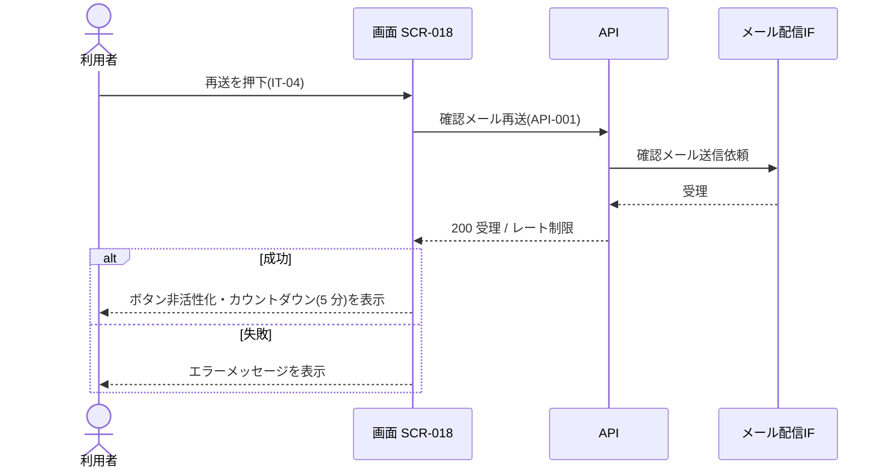

<!-- portal-top -->
[設計ポータル](../../README.md) ／ [要件定義](../index.md) ／ [業務ユースケース](index.md) ／ **UC-152: 「メールを再送する」を押下**
<!-- /portal-top -->

# UC-152: 「メールを再送する」を押下

> **確認メール再送 API を呼び出して確認メールを再送し、成功時はレート制限カウントダウンを表示するユースケース。**

*主アクター 対象ユーザー(認証前 / トークン) ・ ステータス ドラフト ・ 再構成 P2*

| 項目 | 内容 |
|---|---|
| 業務ユースケースID | UC-152 |
| 業務ユースケース名 | 「メールを再送する」を押下 |
| 対応要件ID | [FR-003](../01_specifications/01_account.md#FR-003) |
| 主アクター | 対象ユーザー(認証前 / トークン) |
| 目的 | 確認メール再送 API を呼び出して確認メールを再送し、成功時はレート制限カウントダウンを表示するユースケース。 |

## 事前条件

送信済み状態で、再送ボタン(IT-04)が活性表示されている

## 基本フロー

1. 利用者が再送ボタン(IT-04)を押下する。
2. 画面は新規登録(確認メール再送)API([API-001](../../02_basic_design/03_apis/API-001.md#API-001))を呼び出す。
3. API はメール配信 IF 経由で確認メールを再送する。
4. 成功時、画面はボタンを非活性化してカウントダウン(レート制限 5 分)を表示する。

## 代替フロー

—(本イベントは単一の正常フロー。条件分岐は基本フローに含む)

## 例外フロー

- レート制限中: ボタンは非活性のまま(カウントダウン終了で再活性)。
- 再送失敗: エラーメッセージを表示する。

## 事後条件

成功時は確認メールを再送し、ボタンを非活性化してカウントダウン(レート制限 5 分)を表示する

## 関連

| 関連区分 | 内容 |
|---|---|
| 関連画面ID | [SCR-018](../../02_basic_design/01_screens/SCR-018.md#SCR-018) |
| 関連画面イベントID | [EVT-152](../../02_basic_design/02_screen_events/EVT-152.md#EVT-152) |
| 関連API ID | [API-001](../../02_basic_design/03_apis/API-001.md#API-001) |
| 関連テーブルID | — |

## 備考

再構成 P2 で旧 `UC-SCR-013-EV02`(画面 SCR-018 のイベント `EV-02`)から導出。トリガー: EV-02: 再送ボタン(IT-04)を押下。シーケンス図は P6(SEQ)で保持する。

---

<!-- portal-bottom -->
[← 業務ユースケース](index.md) ・ [要件定義](../index.md) ・ [↑ 設計ポータル](../../README.md)
<!-- /portal-bottom -->
