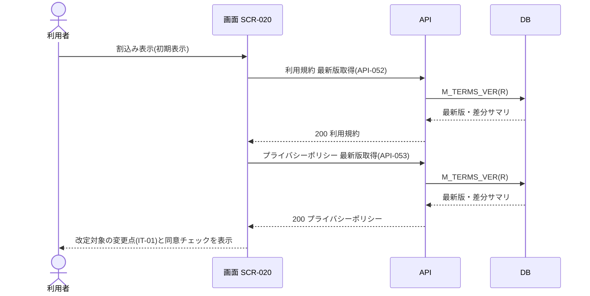

<!-- portal-top -->
[設計ポータル](../../README.md) ／ [要件定義](../index.md) ／ [業務ユースケース](index.md) ／ **UC-164: 初期表示**
<!-- /portal-top -->

# UC-164: 初期表示

> **利用規約・プライバシーポリシーの最新版取得 API で改定文書の差分サマリを取得し、改定対象のみの変更点と同意チェックを全画面モーダルで表示するユースケース。**

*主アクター オーナー / メンバー(未同意の改定がある場合) ・ ステータス ドラフト ・ 再構成 P2*

| 項目 | 内容 |
|---|---|
| 業務ユースケースID | UC-164 |
| 業務ユースケース名 | 初期表示 |
| 対応要件ID | [FR-010](../01_specifications/01_account.md#FR-010) ・ [FR-139](../01_specifications/06_security.md#FR-139) |
| 主アクター | オーナー / メンバー(未同意の改定がある場合) |
| 目的 | 利用規約・プライバシーポリシーの最新版取得 API で改定文書の差分サマリを取得し、改定対象のみの変更点と同意チェックを全画面モーダルで表示するユースケース。 |

## 事前条件

ログイン後の操作中に、未同意の規約改定がある状態で割込み表示された

適用業務ルール: [RULE-006](../01_specifications/08_rule.md#RULE-006)。

## 基本フロー

1. 画面が利用規約 最新版取得 API([API-052](../../02_basic_design/03_apis/API-052.md#API-052))とプライバシーポリシー 最新版取得 API([API-053](../../02_basic_design/03_apis/API-053.md#API-053))を呼び出す。
2. 各 API は規約バージョン(`M_TERMS_VER`)から最新版と差分サマリを取得して返す。
3. 画面は改定対象の文書(利用規約 / プライバシーポリシー、または両方)の主な変更点(IT-01)を全画面モーダルで表示する。
4. 画面は改定対象外の文書のチェックボックスを非表示にする。

## 代替フロー

—(本イベントは単一の正常フロー。条件分岐は基本フローに含む)

## 例外フロー

- 取得失敗: 変更点を表示せず、エラーを表示する(モーダルは維持する)。

## 事後条件

改定対象文書(利用規約 / プライバシーポリシー、または両方)の主な変更点(IT-01)を全画面モーダルで表示し、改定対象外の文書の同意チェックは非表示にする

## 関連

| 関連区分 | 内容 |
|---|---|
| 関連画面ID | [SCR-020](../../02_basic_design/01_screens/SCR-020.md#SCR-020) |
| 関連画面イベントID | [EVT-164](../../02_basic_design/02_screen_events/EVT-164.md#EVT-164) |
| 関連API ID | [API-052](../../02_basic_design/03_apis/API-052.md#API-052) ・ [API-053](../../02_basic_design/03_apis/API-053.md#API-053) |
| 関連テーブルID | `M_TERMS_VER` = [TBL-012](../../02_basic_design/04_database/TBL-012.md#TBL-012) |

## 備考

再構成 P2 で旧 `UC-SCR-015-EV01`(画面 SCR-020 のイベント `EV-01`)から導出。トリガー: EV-01: 初期表示。シーケンス図は P6(SEQ)で保持する。

---

<!-- portal-bottom -->
[← 業務ユースケース](index.md) ・ [要件定義](../index.md) ・ [↑ 設計ポータル](../../README.md)
<!-- /portal-bottom -->
