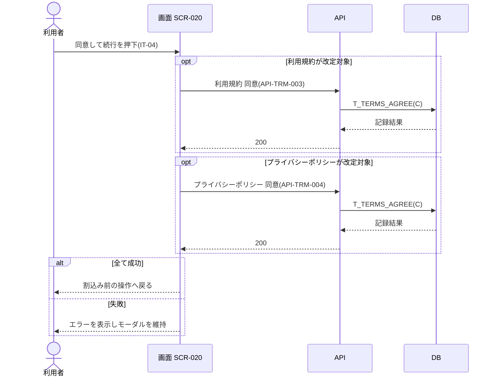

<!-- portal-top -->
[設計ポータル](../../README.md) ／ [要件定義](../index.md) ／ [業務ユースケース](index.md) ／ **UC-169: 「同意して続行する」を押下**
<!-- /portal-top -->

# UC-169: 「同意して続行する」を押下

> **改定対象の文書のみを対象に同意 API を呼び出して同意を記録し、割込み前の操作へ戻る最重要ユースケース。**

*主アクター オーナー / メンバー ・ ステータス ドラフト ・ 再構成 P2*

| 項目 | 内容 |
|---|---|
| 業務ユースケースID | UC-169 |
| 業務ユースケース名 | 「同意して続行する」を押下 |
| 対応要件ID | [FR-010](../01_specifications/FR-010.md#FR-010) ・ [FR-137](../01_specifications/FR-137.md#FR-137) |
| 主アクター | オーナー / メンバー |
| 目的 | 改定対象の文書のみを対象に同意 API を呼び出して同意を記録し、割込み前の操作へ戻る最重要ユースケース。 |

## 事前条件

改定対象の同意チェックが充足し、「同意して続行する」(IT-04)が活性化している

## 基本フロー

1. 利用者が「同意して続行する」(IT-04)を押下する。
2. 画面は改定対象の文書のみを対象に同意 API を呼び出す。利用規約が改定対象の場合は利用規約 同意 API([API-TRM-003](../../02_basic_design/03_apis/API-terms.md#API-TRM-003))を、プライバシーポリシーが改定対象の場合はプライバシーポリシー 同意 API([API-TRM-004](../../02_basic_design/03_apis/API-terms.md#API-TRM-004))を呼び出す。両文書が改定対象の場合は両 API を呼び出す。
3. 各 API は `doc_type` 別に同意(`T_TERMS_AGREE`)を記録する。
4. 完了後、画面は割込み前の操作へ戻る。

## 代替フロー

—(本イベントは単一の正常フロー。条件分岐は基本フローに含む)

## 例外フロー

- 同意失敗: エラーメッセージを表示し、モーダルはそのまま維持する。

## 事後条件

改定対象文書の同意を `T_TERMS_AGREE` に記録し、完了後は割込み前の操作へ戻る。失敗時はモーダルを維持しエラーを表示する

## 関連

| 関連区分 | 内容 |
|---|---|
| 関連画面ID | [SCR-020](../../02_basic_design/01_screens/SCR-020.md#SCR-020) |
| 関連画面イベントID | [EVT-169](../../02_basic_design/02_screen_events/EVT-169.md#EVT-169) |
| 関連API ID | [API-TRM-003](../../02_basic_design/03_apis/API-terms.md#API-TRM-003) ・ [API-TRM-004](../../02_basic_design/03_apis/API-terms.md#API-TRM-004) |
| 関連テーブルID | `T_TERMS_AGREE` = [TBL-T-012](../../02_basic_design/04_database/TBL-T-012.md) |

## 備考

再構成 P2 で旧 `UC-SCR-015-EV06`(画面 SCR-020 のイベント `EV-06`)から導出。トリガー: EV-06: 同意して続行する(IT-04)を押下。シーケンス図は P6(SEQ)で保持する。

---

<!-- portal-bottom -->
[← 業務ユースケース](index.md) ・ [要件定義](../index.md) ・ [↑ 設計ポータル](../../README.md)
<!-- /portal-bottom -->
