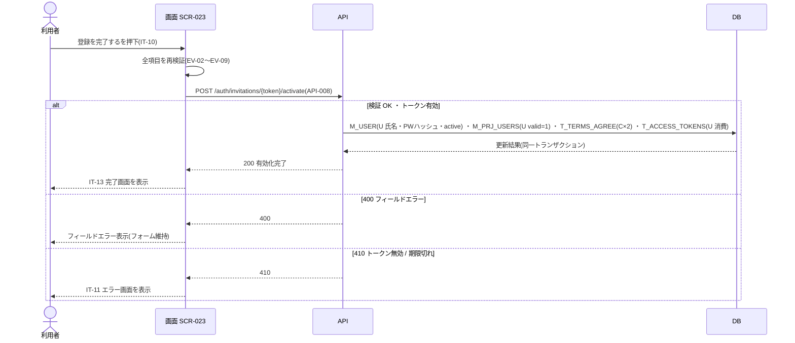

<!-- portal-top -->
[設計ポータル](../../README.md) ／ [要件定義](../index.md) ／ [業務ユースケース](index.md) ／ **UC-190: 「登録を完了する」を押下**
<!-- /portal-top -->

# UC-190: 「登録を完了する」を押下

> **全項目を再検証してメンバーアカウント有効化 API を実行し、予約利用者への氏名・パスワード設定、割当有効化、規約同意記録、トークン消費を同一トランザクションで行い完了画面を表示する最重要ユースケース。**

*主アクター 招待メンバー(トークン) ・ ステータス ドラフト ・ 再構成 P2*

| 項目 | 内容 |
|---|---|
| 業務ユースケースID | UC-190 |
| 業務ユースケース名 | 「登録を完了する」を押下 |
| 対応要件ID | [FR-018](../01_specifications/FR-018.md#FR-018) ・ [FR-137](../01_specifications/FR-137.md#FR-137) |
| 主アクター | 招待メンバー(トークン) |
| 目的 | 全項目を再検証してメンバーアカウント有効化 API を実行し、予約利用者への氏名・パスワード設定、割当有効化、規約同意記録、トークン消費を同一トランザクションで行い完了画面を表示する最重要ユースケース。 |

## 事前条件

氏名・初回パスワード・確認・規約同意・Turnstile が入力・取得されている

## 基本フロー

1. 全項目のクライアント側バリデーション(EV-02〜EV-09 の各検証)を実行し、エラーがある場合は送信せずエラーを表示する。
2. バリデーション通過後、メンバーアカウント有効化 API(`POST /auth/invitations/{token}/activate` = [API-008](../../02_basic_design/03_apis/API-008.md#API-008))を実行する。
3. API は同一トランザクションで、予約 `M_USER` への氏名・パスワードハッシュ設定と `status='active'` 化、`M_PRJ_USERS.valid=1` 化、`T_TERMS_AGREE` 2 件登録(利用規約・プライバシーポリシー)、招待トークン(`T_ACCESS_TOKENS`)の消費を行う。
4. 成功時、画面は IT-13 完了画面を表示する。

## 代替フロー

—(本イベントは単一の正常フロー。条件分岐は基本フローに含む)

## 例外フロー

- HTTP 400(フィールドエラー): フィールド単位のエラーメッセージを表示し、入力フォームを操作可能なまま維持する。
- HTTP 410(トークン期限切れ / 無効): IT-11 トークン無効 / 期限切れエラー画面を表示する。
- 入力再検証エラー: 送信を中止し、該当フィールドにエラーを表示する。

> [!NOTE]
> 有効化処理は API 側の同一トランザクションで複数テーブルを更新します。図は各更新を 1 段にまとめて抽象化し、トランザクション内の順序やロールバック実装は展開しません。

## 事後条件

成功時は予約 `M_USER` への氏名・パスワードハッシュ設定・`status='active'` 化、`M_PRJ_USERS.valid=1` 化、`T_TERMS_AGREE` 2 件登録、トークン消費を同一トランザクションで行い、IT-13 完了画面を表示する。失敗時は内容を確定しない

## 関連

| 関連区分 | 内容 |
|---|---|
| 関連画面ID | [SCR-023](../../02_basic_design/01_screens/SCR-023.md#SCR-023) |
| 関連画面イベントID | [EVT-190](../../02_basic_design/02_screen_events/EVT-190.md#EVT-190) |
| 関連API ID | [API-008](../../02_basic_design/03_apis/API-008.md#API-008) |
| 関連テーブルID | `M_USER` = [TBL-M-001](../../02_basic_design/04_database/TBL-M-001.md) ・ `M_PRJ_USERS` = [TBL-M-003](../../02_basic_design/04_database/TBL-M-003.md) ・ `T_TERMS_AGREE` = [TBL-T-012](../../02_basic_design/04_database/TBL-T-012.md) ・ `T_ACCESS_TOKENS` = [TBL-T-002](../../02_basic_design/04_database/TBL-T-002.md) |

## 備考

再構成 P2 で旧 `UC-SCR-018-EV10`(画面 SCR-023 のイベント `EV-10`)から導出。トリガー: EV-10: 登録を完了する(IT-10)を押下。シーケンス図は P6(SEQ)で保持する。

---

<!-- portal-bottom -->
[← 業務ユースケース](index.md) ・ [要件定義](../index.md) ・ [↑ 設計ポータル](../../README.md)
<!-- /portal-bottom -->
