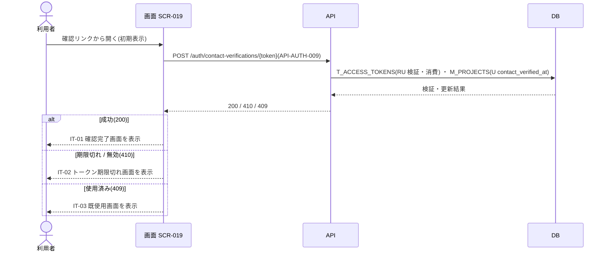

<!-- portal-top -->
[設計ポータル](../../README.md) ／ [要件定義](../index.md) ／ [業務ユースケース](index.md) ／ **UC-194: 初期表示**
<!-- /portal-top -->

# UC-194: 初期表示

> **連絡先確認トークンを連絡先メール確認 API で検証し、結果(完了 / 期限切れ / 既使用)に応じた状態画面を表示するユースケース。**

*主アクター 対象ユーザー(トークン。連絡先メールアドレスの所有者で、第三者でも可) ・ ステータス ドラフト ・ 再構成 P2*

| 項目 | 内容 |
|---|---|
| 業務ユースケースID | UC-194 |
| 業務ユースケース名 | 初期表示 |
| 対応要件ID | [FR-043](../01_specifications/FR-043.md#FR-043) ・ [FR-044](../01_specifications/FR-044.md#FR-044) |
| 主アクター | 対象ユーザー(トークン。連絡先メールアドレスの所有者で、第三者でも可) |
| 目的 | 連絡先確認トークンを連絡先メール確認 API で検証し、結果(完了 / 期限切れ / 既使用)に応じた状態画面を表示するユースケース。 |

## 事前条件

連絡先メールの確認リンク(`purpose='contact_verify'` のトークン付き URL)からアクセスした

## 基本フロー

1. 画面が URL パスパラメータのトークンを取得する。
2. 画面は連絡先メール確認 API(`POST /auth/contact-verifications/{token}` = [API-AUTH-009](../../02_basic_design/03_apis/API-auth.md#API-AUTH-009))を呼び出す。
3. API は確認トークン(`T_ACCESS_TOKENS`)を検証・消費し、連絡先メール確認日時(`M_PROJECTS.contact_verified_at`)を設定する。
4. 成功(200)時、画面は IT-01 確認完了画面を表示する。

## 代替フロー

—(本イベントは単一の正常フロー。条件分岐は基本フローに含む)

## 例外フロー

- 期限切れ / 無効(410): IT-02 トークン期限切れ画面を表示する(有効期限 24 時間)。
- 使用済み(409): IT-03 既使用画面を表示する。

> [!NOTE]
> 確認 API はトークン検証・連絡先確認日時更新・トークン消費・監査記録を同一トランザクションで行います。図は各更新を 1 段に抽象化し、トランザクション内の順序や監査記録の実装は展開しません(正本は SCR-019 §6 注記)。

## 事後条件

成功(200)時は連絡先メール確認日時(`M_PROJECTS.contact_verified_at`)を設定し IT-01 確認完了画面を表示する。期限切れ / 無効(410)は IT-02、使用済み(409)は IT-03 を表示する

## 関連

| 関連区分 | 内容 |
|---|---|
| 関連画面ID | [SCR-019](../../02_basic_design/01_screens/SCR-019.md#SCR-019) |
| 関連画面イベントID | (P3 で EVT 付与)/ 現行 SCR-019 `EV-01` |
| 関連API ID | [API-AUTH-009](../../02_basic_design/03_apis/API-auth.md#API-AUTH-009) |
| 関連テーブルID | `T_ACCESS_TOKENS` = [TBL-T-002](../../02_basic_design/04_database/TBL-T-002.md) ・ `M_PROJECTS` = [TBL-M-004](../../02_basic_design/04_database/TBL-M-004.md) |

## 備考

再構成 P2 で旧 `UC-SCR-019-EV01`(画面 SCR-019 のイベント `EV-01`)から導出。トリガー: EV-01: 初期表示。シーケンス図は P6(SEQ)で保持する。

---

<!-- portal-bottom -->
[← 業務ユースケース](index.md) ・ [要件定義](../index.md) ・ [↑ 設計ポータル](../../README.md)
<!-- /portal-bottom -->
