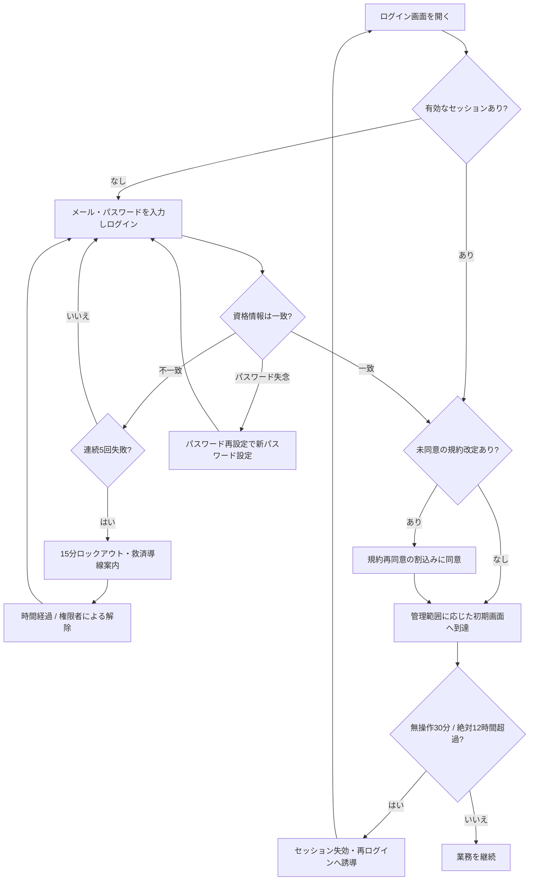

<!-- portal-top -->
[設計ポータル](../../README.md) ／ [要件定義](../index.md) ／ [業務ユースケース](index.md) ／ **UC-BIZ-001: サービスにアクセスする(ログイン・規約同意)**
<!-- /portal-top -->

# UC-BIZ-001: サービスにアクセスする(ログイン・規約同意)

> **このページは、アカウント利用者がサービスにアクセスする業務ユースケースを定義します。画面・API・DB の詳細手順は関連する詳細ユースケース(UC-SCR-* / UC-SYSTEM-*)へ委譲し、本書は業務レベルの流れを示します。**

*版数 v1.0 ・ 更新 2026-06-21 ・ アクター アカウント利用者(共通) ・ ステータス ドラフト*

## 1. 概要

アカウント利用者(オーナー / メンバーの両方)が、本人確認を経てサービスへログインし、管理範囲に応じた初期画面に到達するまでの一連の業務を示す。資格情報を失念した場合のパスワード再設定、規約改定時の再同意割込み、無操作によるセッション失効後の再ログインといった、日常的にアクセスを妨げる事象への業務上の回復経路もこの範囲に含める。本ユースケースの価値は「正規利用者が確実にアクセスでき、かつ不正アクセスを抑止する」ことにある。

| 項目 | 内容 |
|---|---|
| アクター | アカウント利用者(オーナー / メンバーの共通業務) |
| 業務価値 | 正規利用者の確実なアクセスと、総当たり攻撃・なりすましの抑止を両立する |
| 関連要件 | [FR-004](../01_specifications/FR-004.md#FR-004) ログイン・ログアウト・パスワード再設定 ・ [FR-007](../01_specifications/FR-007.md#FR-007) ログイン試行の失敗回数制限 ・ [FR-008](../01_specifications/FR-008.md#FR-008) セッションタイムアウト ・ [FR-139](../01_specifications/FR-139.md#FR-139) 規約改定時の再同意 |
| 関連詳細UC | [UC-SCR-001](UC-SCR-001.md)(ログイン) ・ [UC-SCR-003](UC-SCR-003.md)(パスワード再設定) ・ [UC-SCR-015](UC-SCR-015.md)(規約再同意割込み) ・ [UC-SYSTEM-013](UC-SYSTEM-013.md#UC-SYSTEM-013)(セッション失効・再認証) ・ [UC-SYSTEM-014](UC-SYSTEM-014.md#UC-SYSTEM-014)(ロックアウト・解除) |

## 2. アクター

| アクター | 関与 |
|---|---|
| アカウント利用者(オーナー) | 資格情報でログインし、ログイン後はオーナー向け初期画面に到達する |
| アカウント利用者(メンバー) | 資格情報でログインし、ログイン後はメンバー向け初期画面に到達する |
| 認証基盤(システム) | 資格情報を照合し、セッション発行・失効・ロックアウトを判定する |

## 3. 事前条件

- アクターはアカウント登録と本人確認(連絡先メール確認)を完了している(新規開設は [UC-BIZ-003](UC-BIZ-003.md#UC-BIZ-003) の範囲)。
- アクターはログイン画面([SCR-001](../../02_basic_design/01_screens/SCR-001.md#SCR-001))に到達できる。

## 4. トリガー

アクターがサービスを利用するためにログイン画面を開く、または失効・規約改定により再アクセスが必要になる。

## 5. 主成功シナリオ(業務ステップ)

1. アクターがログイン画面を開く。既に有効なセッションがある場合は管理範囲に応じた初期画面へ自動遷移する。([UC-SCR-001](UC-SCR-001.md) ・ [SCR-001](../../02_basic_design/01_screens/SCR-001.md#SCR-001))
2. アクターがメールアドレスとパスワードを入力し、ログインを実行する。連続失敗後はボット対策チャレンジの提示を受ける場合がある。([UC-SCR-001](UC-SCR-001.md))
3. 認証基盤が資格情報を照合し、成功時にセッションを確立する。([UC-SCR-001](UC-SCR-001.md))
4. 未同意の規約改定がある場合は、規約再同意の割込みを受け、改定対象に同意して操作を続行する。([UC-SCR-015](UC-SCR-015.md) ・ [SCR-015](../../02_basic_design/01_screens/SCR-015.md#SCR-015))
5. アクターは管理範囲に応じた初期画面(オーナーは利用状況、メンバーは概要)へ到達し、業務を開始する。([UC-SCR-001](UC-SCR-001.md) ・ [SCR-016](../../02_basic_design/01_screens/SCR-016.md#SCR-016) ・ [SCR-008](../../02_basic_design/01_screens/SCR-008.md#SCR-008))

## 6. 例外・代替フロー(業務レベル)

- **パスワード失念**: アクターはログイン画面からパスワード再設定を選び、メール経由の再設定リンクで新パスワードを設定して再度ログインする。([UC-SCR-003](UC-SCR-003.md) ・ [SCR-003](../../02_basic_design/01_screens/SCR-003.md#SCR-003))
- **資格情報の不一致**: メールアドレスの存在有無を区別しない共通エラーを受け、再入力する。失敗が連続するとロックアウトの対象となる。([UC-SCR-001](UC-SCR-001.md))
- **アカウントロックアウト**: 5 回連続失敗で 15 分間ロックされる。15 分の経過、または権限者の手動解除で復旧し、救済導線の案内を受ける。([UC-SYSTEM-014](UC-SYSTEM-014.md#UC-SYSTEM-014) ・ [FR-007](../01_specifications/FR-007.md#FR-007))
- **セッション失効**: 無操作 30 分・絶対 12 時間の超過でセッションが失効した場合、次の操作で明示メッセージを受け、再ログインへ誘導される。重要操作では再認証を求められる。([UC-SYSTEM-013](UC-SYSTEM-013.md#UC-SYSTEM-013) ・ [FR-008](../01_specifications/FR-008.md#FR-008))
- **規約再同意の保留**: 改定への同意を行わない限り割込みモーダルが維持され、本来の業務へ進めない。([UC-SCR-015](UC-SCR-015.md))
- **契約停止中**: 契約が停止状態の場合はセッションを確立せず、停止時のアクセス制限に従う案内を受ける。([UC-SCR-001](UC-SCR-001.md))

## 7. 事後条件

- アクターは有効なセッションを保持し、管理範囲に応じた初期画面に到達している。
- 未同意の規約改定があった場合は、改定対象への同意が記録されている。
- ログイン失敗・ロックアウト・セッション失効の各事象は、それぞれの抑止・回復ルールに従って処理されている。

## 8. 業務アクティビティ図

---

<!-- portal-bottom -->
[← 業務ユースケース](index.md) ・ [要件定義](../index.md) ・ [↑ 設計ポータル](../../README.md)
<!-- /portal-bottom -->
