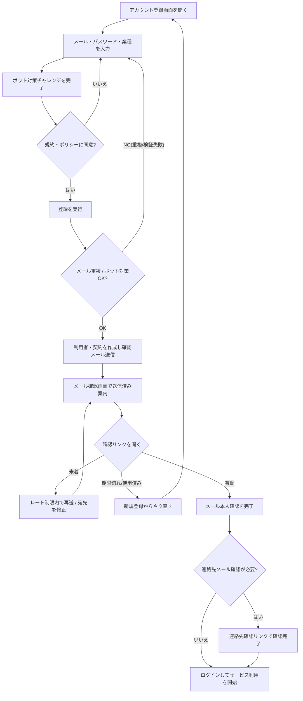

<!-- portal-top -->
[設計ポータル](../../README.md) ／ [要件定義](../index.md) ／ [業務ユースケース](index.md) ／ **UC-BIZ-003: サービス利用を開始する(契約開設・本人確認)**
<!-- /portal-top -->

# UC-BIZ-003: サービス利用を開始する(契約開設・本人確認)

> **このページは、契約オーナーがサービス利用を開始する業務ユースケースを定義します。画面・API・DB の詳細手順は関連する詳細ユースケース(UC-SCR-* / UC-SYSTEM-*)へ委譲し、本書は業務レベルの流れを示します。**

*版数 v1.0 ・ 更新 2026-06-21 ・ アクター 契約オーナー(新規) ・ ステータス ドラフト*

## 1. 概要

新規の契約オーナーが、アカウントを登録して規約に同意し、メールアドレスの本人確認を完了することで、サービス利用を開始できる状態に到達するまでの業務を示す。登録時に利用者と契約が作成され、確認メールによる本人確認を経て初めてログイン可能な正規利用者となる。連絡先メールの確認完了も含め、サービス開始に必要な本人確認の業務経路を一体で扱う。本ユースケースの価値は「正規の事業者だけが確実にサービスを開始でき、なりすまし登録を抑止する」ことにある。

| 項目 | 内容 |
|---|---|
| アクター | 契約オーナー(新規。サービス未契約の事業者担当者) |
| 業務価値 | 本人確認を伴う確実な契約開設により、正規利用者のみがサービスを開始できる |
| 関連要件 | [FR-001](../FR01.md#FR-001) アカウント登録 ・ [FR-002](../FR01.md#FR-002) 規約・ポリシーへの同意取得 ・ [FR-003](../FR01.md#FR-003) メールアドレス確認 ・ [FR-111](../FR14.md#FR-111) ボット対策(Turnstile) |
| 関連詳細UC | [UC-SCR-002](UC-SCR-002.md)(アカウント登録) ・ [UC-SCR-013](UC-SCR-013.md)(メール確認) ・ [UC-SCR-019](UC-SCR-019.md)(連絡先メール確認完了) |

## 2. アクター

| アクター | 関与 |
|---|---|
| 契約オーナー(新規) | アカウントを登録し、規約に同意し、確認メールで本人確認を完了する |
| 認証基盤(システム) | メール重複とボット対策を検証し、利用者・契約を作成して確認メールを送信する |
| メール配信(システム) | 確認メール・連絡先確認メールを配信する |

## 3. 事前条件

- アクターは有効な受信可能なメールアドレスを保有している。
- アクターはアカウント登録画面([SCR-002](../../02_basic_design/01_screens/SCR-002.md#SCR-002))に到達できる。
- アクターはまだ当該メールアドレスでアカウントを保有していない(メールアドレスは一意)。

## 4. トリガー

新規の事業者担当者がサービスの利用を開始するため、アカウント登録画面を開く。

## 5. 主成功シナリオ(業務ステップ)

1. アクターがアカウント登録画面を開き、メールアドレス・パスワード・業種を入力する。ボット対策チャレンジが提示され、検証を完了する。([UC-SCR-002](UC-SCR-002.md) ・ [SCR-002](../../02_basic_design/01_screens/SCR-002.md#SCR-002) ・ [FR-111](../FR14.md#FR-111))
2. アクターが利用規約とプライバシーポリシーの内容を確認し、両方に同意する。([UC-SCR-002](UC-SCR-002.md) ・ [FR-002](../FR01.md#FR-002))
3. アクターが登録を実行する。システムがメール重複とボット対策を検証し、利用者と契約を作成して確認メールを送信する。([UC-SCR-002](UC-SCR-002.md) ・ [FR-001](../FR01.md#FR-001))
4. アクターがメール確認画面で確認メール送信済みの案内を受け、受信メールの確認リンクを開いて本人確認を完了する。([UC-SCR-013](UC-SCR-013.md) ・ [SCR-013](../../02_basic_design/01_screens/SCR-013.md#SCR-013) ・ [FR-003](../FR01.md#FR-003))
5. アクターが本人確認完了後、ログイン画面へ進みサービス利用を開始する(以降の日常アクセスは [UC-BIZ-001](UC-BIZ-001.md#UC-BIZ-001) の範囲)。([UC-SCR-013](UC-SCR-013.md) ・ [SCR-001](../../02_basic_design/01_screens/SCR-001.md#SCR-001))
6. プロジェクトの連絡先メール確認を要する場合、アクター(または連絡先所有者)が連絡先確認リンクを開き、連絡先メール確認を完了する。([UC-SCR-019](UC-SCR-019.md) ・ [SCR-019](../../02_basic_design/01_screens/SCR-019.md#SCR-019))

## 6. 例外・代替フロー(業務レベル)

- **メールアドレス重複**: 既に登録済みのメールアドレスで登録した場合は、アカウントを作成せず重複エラーを表示する。([UC-SCR-002](UC-SCR-002.md))
- **ボット対策検証失敗**: Turnstile 検証に失敗した場合は登録を中止し、ウィジェットをリセットして再試行を促す。([UC-SCR-002](UC-SCR-002.md) ・ [FR-111](../FR14.md#FR-111))
- **規約未同意**: 利用規約・プライバシーポリシーの双方に同意しない限り、登録は拒否される。([UC-SCR-002](UC-SCR-002.md) ・ [FR-002](../FR01.md#FR-002))
- **確認メール未着 / 再送**: 確認メールが届かない場合はレート制限の範囲で再送できる。送信先を誤った場合はメールアドレスを変更して登録をやり直す。([UC-SCR-013](UC-SCR-013.md))
- **確認リンクの期限切れ / 使用済み**: 確認トークンが期限切れ(有効期限 24 時間)または使用済みの場合は確認失敗を表示し、新規登録からやり直す導線を案内する。([UC-SCR-013](UC-SCR-013.md) ・ [FR-003](../FR01.md#FR-003))
- **連絡先確認の期限切れ / 既使用**: 連絡先確認トークンが期限切れ・無効・使用済みの場合は、それぞれの状態画面を表示する。([UC-SCR-019](UC-SCR-019.md))

## 7. 事後条件

- アクターの利用者と契約が作成され、メールアドレスの本人確認が完了している。
- 利用規約・プライバシーポリシーへの同意が記録されている。
- アクターはログイン可能な正規利用者となり、サービス利用を開始できる状態に到達している。

## 8. 業務アクティビティ図

---

<!-- portal-bottom -->
[← 業務ユースケース](index.md) ・ [要件定義](../index.md) ・ [↑ 設計ポータル](../../README.md)
<!-- /portal-bottom -->
