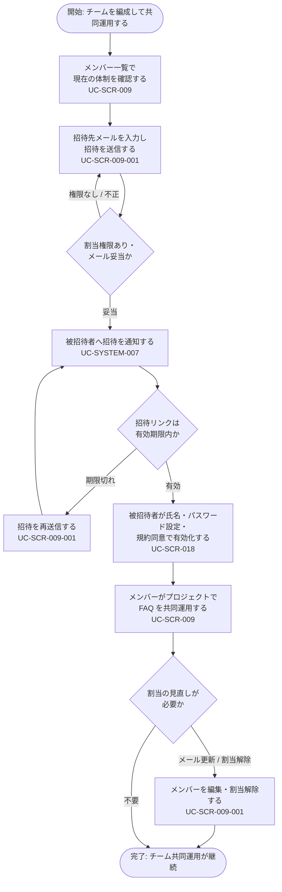

<!-- portal-top -->
[設計ポータル](../../README.md) ／ [要件定義](../index.md) ／ [業務ユースケース](index.md) ／ **UC-BIZ-005: チームを編成して共同運用する(メンバー招待・権限)**
<!-- /portal-top -->

# UC-BIZ-005: チームを編成して共同運用する(メンバー招待・権限)

> **このページは、契約オーナーまたはプロジェクトメンバーが、プロジェクトにメンバーを招待し、有効化・権限付与を経てチームで FAQ を共同運用できる状態を整えるまでの業務ユースケースを、業務粒度で定義します。**

*版数 v1.0 ・ 更新 2026-06-21 ・ アクター 契約オーナー / プロジェクトメンバー ・ ステータス ドラフト*

## 1. 概要

契約オーナーおよび当該プロジェクトのメンバーは、プロジェクトに新しいメンバーを招待し、被招待者が招待リンクからアカウントを有効化することで、FAQ 運用をチームで分担できるようにします。メンバーは割り当てられたプロジェクト単位で操作でき、不要になった割当は解除します。本ユースケースは招待から共同運用開始までの業務目的の達成を範囲とし、画面ごとの入力検証や通知送信の内部処理は詳細 UC に委ねます。

| 項目 | 内容 |
|----|----|
| アクター | 契約オーナー / プロジェクトメンバー(招待実行)・被招待者(有効化) |
| 業務価値 | FAQ 運用をチームで分担でき、プロジェクト単位の権限で安全に共同運用できる |
| 関連要件 | [FR-012](../01_specifications/FR-012.md#FR-012)(メンバー招待)・[FR-018](../01_specifications/FR-018.md#FR-018)(招待リンクからの有効化)・[FR-024](../01_specifications/FR-024.md#FR-024)(メンバー一覧・詳細)・[FR-025](../01_specifications/FR-025.md#FR-025)(メールアドレス更新)・[FR-029](../01_specifications/FR-029.md#FR-029)(割当解除・利用終了) |
| 関連詳細 UC | [UC-SCR-009](UC-SCR-009.md)(メンバー)・[UC-SCR-009-001](UC-SCR-009-001.md)(メンバー招待 / 編集モーダル)・[UC-SCR-018](UC-SCR-018.md)(メンバーアカウント有効化)・[UC-SYSTEM-007](UC-SYSTEM-007.md#UC-SYSTEM-007)(メンバー割当変更通知) |

## 2. アクター

| アクター | 役割 |
|----|----|
| 契約オーナー | 全プロジェクトでメンバーを招待・編集・割当解除できる |
| プロジェクトメンバー | 自分が割り当てられたプロジェクトでメンバーを招待・編集・割当解除できる |
| 被招待者 | 招待リンクから氏名入力・初回パスワード設定・規約同意を行い、アカウントを有効化する |

## 3. 事前条件

- 招待を実行するアクター(オーナー / メンバー)がログイン済みで、対象プロジェクトに割り当てられている。
- 招待対象のメールアドレスを用意できる。

## 4. トリガー

契約オーナーまたはプロジェクトメンバーが、FAQ 運用を分担するためにプロジェクトへ新しいメンバーを加える必要が生じたとき。

## 5. 主成功シナリオ(業務ステップ)

1. オーナーまたはメンバーが、当該プロジェクトのメンバー一覧を開き、現在の体制を確認する。詳細 UC: [UC-SCR-009](UC-SCR-009.md) ／ 画面 [SCR-009](../../02_basic_design/01_screens/SCR-009.md#SCR-009)。関連要件 [FR-024](../01_specifications/FR-024.md#FR-024)。
2. メンバー招待モーダルから、招待先メールアドレスを入力して招待を送信する。詳細 UC: [UC-SCR-009-001](UC-SCR-009-001.md) ／ 画面 [SCR-009-001](../../02_basic_design/01_screens/SCR-009-001.md#SCR-009-001)。関連要件 [FR-012](../01_specifications/FR-012.md#FR-012)。
3. システムが被招待者へ招待を通知し、被招待者は招待リンクから有効化ページへ進む。詳細 UC: [UC-SYSTEM-007](UC-SYSTEM-007.md#UC-SYSTEM-007)。
4. 被招待者が氏名(表示名)入力・初回パスワード設定・利用規約およびプライバシーポリシーへの同意を行い、アカウントを有効化する。詳細 UC: [UC-SCR-018](UC-SCR-018.md) ／ 画面 [SCR-018](../../02_basic_design/01_screens/SCR-018.md#SCR-018)。関連要件 [FR-018](../01_specifications/FR-018.md#FR-018)。
5. 有効化されたメンバーが当該プロジェクトのワークスペースで FAQ 運用を分担し、共同運用が始まる。詳細 UC: [UC-SCR-009](UC-SCR-009.md)。
6. 運用に応じて、メンバーのメールアドレス更新や、不要になった割当の解除を行う。詳細 UC: [UC-SCR-009-001](UC-SCR-009-001.md)。関連要件 [FR-025](../01_specifications/FR-025.md#FR-025) ・ [FR-029](../01_specifications/FR-029.md#FR-029)。

## 6. 例外・代替フロー(業務レベル)

- 招待を実行するアクターが当該プロジェクトに割り当てられていない場合、招待は実行できない(プロジェクト単位の権限)。詳細 UC: [UC-SCR-009](UC-SCR-009.md)。
- 招待リンクの有効期限(7 日)が切れた場合、被招待者は有効化できない。オーナーまたは当該プロジェクトのメンバーが招待を再送信し、新しいリンクを発行する。詳細 UC: [UC-SCR-009-001](UC-SCR-009-001.md) ／ 関連要件 [FR-018](../01_specifications/FR-018.md#FR-018)。
- メンバーを割当解除した際、対象が他プロジェクトに有効な割当を持たない場合、アカウントを利用できない状態にし、ログインセッションと未使用の招待を無効化する。オーナー自身は割当解除の対象外。詳細 UC: [UC-SCR-009-001](UC-SCR-009-001.md) ／ 関連要件 [FR-029](../01_specifications/FR-029.md#FR-029)。
- 招待先メールアドレスが不正・重複の場合、招待は確定せず、修正を促される。詳細 UC: [UC-SCR-009-001](UC-SCR-009-001.md)。

## 7. 事後条件

- 招待されたメンバーがアカウントを有効化し、当該プロジェクトに割り当てられている。
- メンバーが割り当てられたプロジェクトで FAQ を共同運用できる。
- 割当解除したメンバーは、当該プロジェクトの操作ができなくなる(他プロジェクトに割当がない場合はアカウント利用不可)。

## 8. 業務アクティビティ図

---

<!-- portal-bottom -->
[← 業務ユースケース](index.md) ・ [要件定義](../index.md) ・ [↑ 設計ポータル](../../README.md)
<!-- /portal-bottom -->
