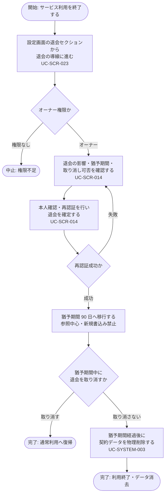

<!-- portal-top -->
[設計ポータル](../../README.md) ／ [要件定義](../index.md) ／ [業務ユースケース](index.md) ／ **UC-BIZ-007: サービス利用を終了する(退会・データ消去)**
<!-- /portal-top -->

# UC-BIZ-007: サービス利用を終了する(退会・データ消去)

> **このページは、契約オーナーがサービスの利用を終了するために退会を申請し、猶予期間を経て契約データが消去されるまでの業務ユースケースを、業務粒度で定義します。**

*版数 v1.0 ・ 更新 2026-06-21 ・ アクター 契約オーナー ・ ステータス ドラフト*

## 1. 概要

契約オーナーは、サービスの利用を終了する際、設定画面から退会の導線に進み、本人確認(再認証)を経て退会を申請します。退会後は定められた猶予期間(90 日)中は参照中心の運用となり、新規書込みが禁止されます。猶予期間が経過すると、システムが契約データを物理削除します。退会はオーナー専有の操作であり、影響範囲が大きいため、申請前に影響と取り消し可否を明示します。

| 項目 | 内容 |
|----|----|
| アクター | 契約オーナー(退会はオーナー専有) |
| 業務価値 | サービス利用を安全に終了でき、猶予期間後に契約データが確実に消去される |
| 関連要件 | [FR-009](../FR01.md#FR-009)(退会・猶予期間)・[FR-005](../FR01.md#FR-005)(重要操作前の再認証)・[FR-100](../FR13.md#FR-100)(猶予期間後のデータ削除)・[FR-103](../FR13.md#FR-103)(猶予期間中の参照中心運用) |
| 関連詳細 UC | [UC-SCR-023](UC-SCR-023.md)(設定)・[UC-SCR-014](UC-SCR-014.md)(退会申請)・[UC-SYSTEM-003](UC-SYSTEM-003.md#UC-SYSTEM-003)(90 日物理削除バッチ) |

## 2. アクター

| アクター | 役割 |
|----|----|
| 契約オーナー | 退会を申請し、サービス利用を終了する主体。退会はオーナー専有(メンバーは操作不可) |

## 3. 事前条件

- 契約オーナーがログイン済みで、契約が有効である。
- 退会の意思があり、退会の影響(データ削除・猶予期間)を理解している。

## 4. トリガー

契約オーナーが、サービスの利用を終了する意思決定をしたとき。

## 5. 主成功シナリオ(業務ステップ)

1. オーナーが設定画面を開き、最下部の退会セクション(DangerSection)から退会の導線に進む。詳細 UC: [UC-SCR-023](UC-SCR-023.md) ／ 画面 [SCR-023](../../02_basic_design/01_screens/SCR-023.md#SCR-023)。
2. オーナーが退会申請画面で、退会の影響(データ削除・猶予期間)と取り消し可否を確認する。詳細 UC: [UC-SCR-014](UC-SCR-014.md) ／ 画面 [SCR-014](../../02_basic_design/01_screens/SCR-014.md#SCR-014)。
3. オーナーが本人確認(再認証)を行い、退会を確定する。詳細 UC: [UC-SCR-014](UC-SCR-014.md)。関連要件 [FR-005](../FR01.md#FR-005) ・ [FR-009](../FR01.md#FR-009)。
4. 退会が受理され、契約が猶予期間(90 日)へ移行する。猶予期間中は管理画面ログインは許可されるが、新規書込みは禁止される(参照中心の運用)。関連要件 [FR-103](../FR13.md#FR-103)。
5. 猶予期間が経過すると、システムが契約データを物理削除する。詳細 UC: [UC-SYSTEM-003](UC-SYSTEM-003.md#UC-SYSTEM-003)。関連要件 [FR-100](../FR13.md#FR-100)。

## 6. 例外・代替フロー(業務レベル)

- 退会はオーナー専有のため、メンバーが設定・退会の導線にアクセスした場合は権限不足となる。詳細 UC: [UC-SCR-023](UC-SCR-023.md)。
- 本人確認(再認証)に失敗した場合、退会は確定しない。詳細 UC: [UC-SCR-014](UC-SCR-014.md) ／ 関連要件 [FR-005](../FR01.md#FR-005)。
- 猶予期間中に退会を取り消した場合(取り消しが可能な範囲)、契約は通常の利用状態へ戻り、物理削除は実行されない。詳細 UC: [UC-SCR-014](UC-SCR-014.md)。
- 猶予期間中の新規書込み操作は禁止され、参照中心の運用に限定される。関連要件 [FR-103](../FR13.md#FR-103)。

## 7. 事後条件

- 退会が受理され、契約が猶予期間へ移行している(取り消さない限り)。
- 猶予期間中は参照中心の運用となり、新規書込みが禁止されている。
- 猶予期間経過後、契約データが物理削除されている。

## 8. 業務アクティビティ図

---

<!-- portal-bottom -->
[← 業務ユースケース](index.md) ・ [要件定義](../index.md) ・ [↑ 設計ポータル](../../README.md)
<!-- /portal-bottom -->
