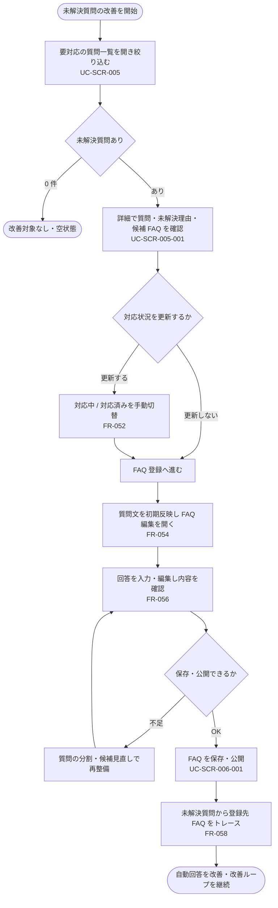

<!-- portal-top -->
[設計ポータル](../../README.md) ／ [要件定義](../index.md) ／ [業務ユースケース](index.md) ／ **UC-BIZ-009: 問い合わせから FAQ を改善する(未解決→FAQ化)**
<!-- /portal-top -->

# UC-BIZ-009: 問い合わせから FAQ を改善する(未解決→FAQ化)

> **このページは、プロジェクトメンバーが、AI が解決できなかった未解決質問を確認し、FAQ として整備することで自動回答の網羅性を継続的に高める改善業務を、業務粒度で定義します。**
>
> - 要対応の質問一覧から未解決質問を確認し対応状況を管理する
> - 未解決質問を起点に FAQ を作成・公開する
> - 改善ループ(未解決→FAQ化→トレース)を回す

*版数 v1.0 ・ 更新 2026-06-21 ・ アクター プロジェクトメンバー ・ ステータス ドラフト*

## 1. 概要

プロジェクトメンバーは、ウィジェット利用者が解決できなかった未解決質問を改善の起点とする。要対応の質問一覧で未対応の質問を把握し、詳細で質問・未解決理由・候補 FAQ を確認したうえで、当該質問を起点に FAQ を作成・公開する。FAQ 化により以降の自動回答を改善し、未解決質問から登録先 FAQ をたどって改善ループを追跡する。本ユースケースは「未解決質問を FAQ に変えて回答精度を上げる」という業務目的を業務ステップで束ねるものであり、各画面イベント単位の詳細は詳細ユースケース([UC-SCR-005](UC-SCR-005.md) ほか)に委譲する。

| 項目 | 内容 |
|----|----|
| アクター | プロジェクトメンバー(当該プロジェクトの FAQ 管理権限を持つアカウント利用者) |
| 業務価値 | 未解決質問を FAQ へ反映し、自動回答の網羅性・正確性を継続的に高めて自己解決率を向上させる |
| 関連要件 | [FR-045](../FR06.md#FR-045) 未解決質問の登録 ・ [FR-049](../FR06.md#FR-049) 対応状況の 2 区分 ・ [FR-052](../FR06.md#FR-052) 状況の手動切替 ・ [FR-053](../FR07.md#FR-053) 未解決質問から FAQ 登録開始 ・ [FR-054](../FR07.md#FR-054) 質問文の初期反映 ・ [FR-056](../FR07.md#FR-056) 登録前の確認・編集 ・ [FR-057](../FR07.md#FR-057) FAQ 操作と状況の非連動 ・ [FR-058](../FR07.md#FR-058) 登録先 FAQ のトレース |
| 関連詳細 UC | [UC-SCR-005](UC-SCR-005.md)(要対応の質問一覧)・ [UC-SCR-005-001](UC-SCR-005-001.md)(要対応の質問詳細・FAQ 登録へ)・ [UC-SCR-006-001](UC-SCR-006-001.md)(FAQ 編集・公開) |

## 2. アクター

| アクター | 役割 |
|----|----|
| プロジェクトメンバー | 未解決質問を確認し、対応状況を管理し、未解決質問を起点に FAQ を整備・公開する |
| FAQ 編集者(オーナーを含むメンバー) | 起点となった質問の質問文を確認し、回答を入力して公開可否を判断する |

## 3. 事前条件

- プロジェクトメンバーがログイン済みで、当該プロジェクトへの割当(FAQ 管理権限)がある。
- AI が解決できなかった、またはウィジェット利用者が「解決しなかった」とした未解決質問が登録されている([FR-045](../FR06.md#FR-045))。
- 要対応の質問一覧([SCR-005](../../02_basic_design/01_screens/SCR-005.md#SCR-005))へ到達できる。

## 4. トリガー

プロジェクトメンバーが要対応の質問を改善するために要対応の質問一覧を開いたとき、または特定の未解決質問を FAQ 化しようとしたとき。

## 5. 主成功シナリオ(業務ステップ)

1. メンバーが要対応の質問一覧([SCR-005](../../02_basic_design/01_screens/SCR-005.md#SCR-005))を開き、状況・期間・キーワードで未解決質問を絞り込む([UC-SCR-005](UC-SCR-005.md))。
2. メンバーが対象の未解決質問を選び、詳細([SCR-005-001](../../02_basic_design/01_screens/SCR-005-001.md#SCR-005-001))で質問・未解決理由・候補 FAQ・応答ログを確認する([UC-SCR-005-001](UC-SCR-005-001.md))。
3. 必要に応じて、メンバーが対応状況を「対応中 / 対応済み」で手動更新する([FR-052](../FR06.md#FR-052))。
4. メンバーが「FAQ 登録へ」で当該質問を起点に FAQ 編集([SCR-006-001](../../02_basic_design/01_screens/SCR-006-001.md#SCR-006-001))を開く。質問文が質問欄へ初期反映される([FR-054](../FR07.md#FR-054))。
5. メンバーが回答を自分で入力・編集し、質問・回答・公開状態を確認して FAQ を保存・公開する([UC-SCR-006-001](UC-SCR-006-001.md))。
6. 以降、未解決質問から登録先 FAQ をたどって改善結果を追跡する([FR-058](../FR07.md#FR-058))。

## 6. 例外・代替フロー(業務レベル)

- **FAQ 化で解決しない**: 入力した FAQ では質問を網羅できない場合、メンバーは質問を分割または候補 FAQ を見直して再整備する。
- **対応状況の独立**: FAQ の下書き保存・公開を行っても、未解決質問の対応状況は自動で変わらない。状況は詳細画面の手動操作のみで切り替える([FR-057](../FR07.md#FR-057))。
- **回答の自動取得なし**: 質問文以外(過去の AI 回答など)は回答欄へ自動反映されないため、メンバーが回答を作成する([FR-055](../FR07.md#FR-055))。
- **対象 0 件**: 未解決質問が 0 件のとき、空状態を表示し改善対象がないことを案内する([UC-SCR-005](UC-SCR-005.md))。
- **権限なし**: 当該プロジェクト未割当のメンバーが直アクセスした場合、操作不可を提示する。

## 7. 事後条件

- 未解決質問を起点とした FAQ が、確認のうえ保存・公開される。
- 未解決質問の対応状況が、メンバーの手動操作に基づいて反映される([FR-049](../FR06.md#FR-049))。
- 未解決質問から登録先 FAQ をたどれる状態になり、改善ループが追跡可能になる([FR-058](../FR07.md#FR-058))。

## 8. 業務アクティビティ図

---

<!-- portal-bottom -->
[← 業務ユースケース](index.md) ・ [要件定義](../index.md) ・ [↑ 設計ポータル](../../README.md)
<!-- /portal-bottom -->
