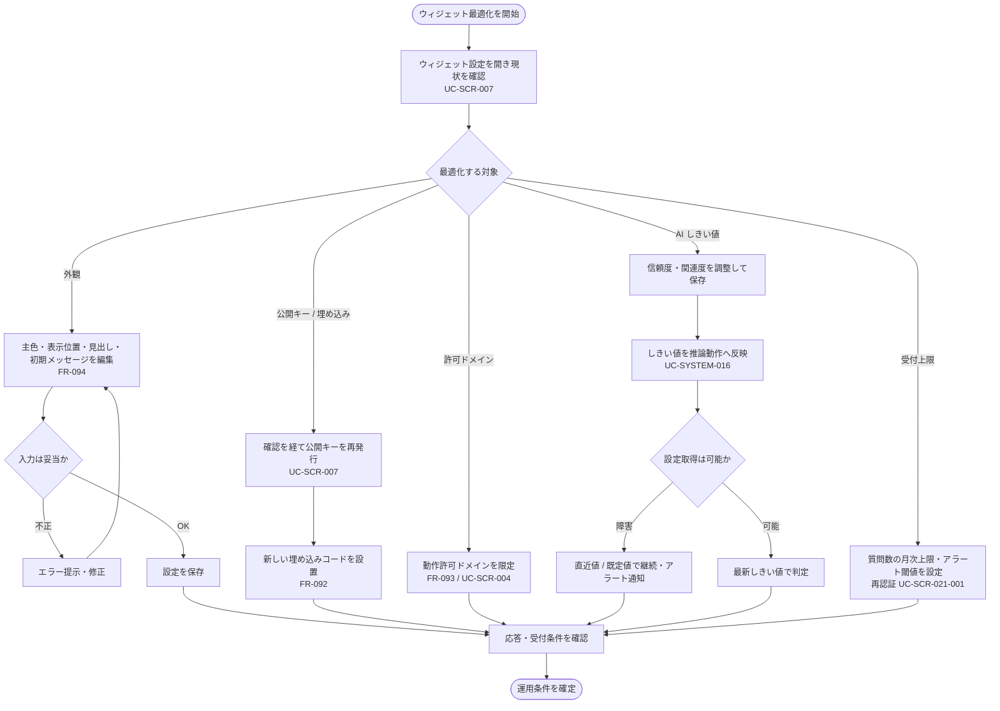

<!-- portal-top -->
[設計ポータル](../../README.md) ／ [要件定義](../index.md) ／ [業務ユースケース](index.md) ／ **UC-BIZ-010: ウィジェットの応答を最適化する(設定・しきい値・許可ドメイン)**
<!-- /portal-top -->

# UC-BIZ-010: ウィジェットの応答を最適化する(設定・しきい値・許可ドメイン)

> **このページは、プロジェクトメンバーが、ウィジェットの見た目・回答の判定しきい値・受付上限・動作許可ドメインを設定し、ウィジェット利用者への応答を最適化する運用業務を、業務粒度で定義します。**
>
> - ウィジェットの外観・公開キー・埋め込みコードの設定
> - AI 回答しきい値の調整と推論動作への反映
> - 質問数の月次上限・受付制限と許可ドメインの設定

*版数 v1.0 ・ 更新 2026-06-21 ・ アクター プロジェクトメンバー ・ ステータス ドラフト*

## 1. 概要

プロジェクトメンバーは、ウィジェット利用者への応答品質と運用条件を整えるため、ウィジェットの設定を調整する。外観(主色・表示位置・見出し・初期メッセージ)・公開キー・埋め込みコードを設定し、AI 回答のしきい値を調整して推論動作へ反映する。あわせて質問数の月次上限・受付制限を設定し、ウィジェットが動作する許可ドメインを限定する。本ユースケースは「ウィジェットの応答を最適化する」という業務目的を業務ステップで束ねるものであり、各画面イベント単位の詳細は詳細ユースケース([UC-SCR-007](UC-SCR-007.md) ほか)に委譲する。

| 項目 | 内容 |
|----|----|
| アクター | プロジェクトメンバー(当該プロジェクトの管理権限を持つアカウント利用者) |
| 業務価値 | ウィジェットの外観・回答判定・受付条件・動作範囲を最適化し、応答品質と安全な運用を両立する |
| 関連要件 | [FR-092](../FR12.md#FR-092) 埋め込みコードの取得・設置 ・ [FR-093](../FR12.md#FR-093) 許可ドメイン上での動作 ・ [FR-094](../FR12.md#FR-094) 外観の設定 ・ [FR-098c](../FR12.md#FR-098c) 受付制限中の案内 ・ [FR-154](../FR20.md#FR-154) しきい値の即時反映とフォールバック |
| 関連詳細 UC | [UC-SCR-007](UC-SCR-007.md)(ウィジェット設定・外観・公開キー)・ [UC-SCR-021-001](UC-SCR-021-001.md)(質問数上限・アラート設定)・ [UC-SYSTEM-016](UC-SYSTEM-016.md#UC-SYSTEM-016)(AI しきい値の伝播・フォールバック) |

## 2. アクター

| アクター | 役割 |
|----|----|
| プロジェクトメンバー | ウィジェットの外観・しきい値・受付上限・許可ドメインを設定し、応答条件を最適化する |
| 運用担当(オーナーを含むメンバー) | 公開キー再発行・上限変更など影響の大きい設定を、確認を経て実行する |

## 3. 事前条件

- プロジェクトメンバーがログイン済みで、当該プロジェクトへの割当(管理権限)がある。
- 対象プロジェクトが選択されており、ウィジェット設定([SCR-007](../../02_basic_design/01_screens/SCR-007.md#SCR-007))へ到達できる。
- AI しきい値の既定値(信頼度 0.60 / 関連度 0.50)が定義されている([FR-154](../FR20.md#FR-154))。

## 4. トリガー

プロジェクトメンバーがウィジェットの外観・回答判定しきい値・受付上限・許可ドメインを調整しようとしたとき。

## 5. 主成功シナリオ(業務ステップ)

1. メンバーがウィジェット設定([SCR-007](../../02_basic_design/01_screens/SCR-007.md#SCR-007))を開き、現在の外観・公開キー・埋め込みコードを確認する([UC-SCR-007](UC-SCR-007.md))。
2. メンバーが外観(主色・表示位置・見出し・初期メッセージ)を編集し、プレビューで確認して設定を保存する([FR-094](../FR12.md#FR-094))。
3. 必要に応じて、メンバーが公開キーを再発行し、新しい埋め込みコードを自社サイトへ設置する([FR-092](../FR12.md#FR-092))。
4. メンバーが動作を許可するドメインを限定し、許可ドメイン上のみでウィジェットが動作するようにする([FR-093](../FR12.md#FR-093))。許可ドメインの設定はプロジェクト編集([SCR-004](../../02_basic_design/01_screens/SCR-004.md#SCR-004))で行い、詳細は [UC-SCR-004](UC-SCR-004.md) に委譲する。
5. メンバーが AI 回答しきい値(信頼度・関連度)を調整して保存する。変更は短時間で推論動作へ反映される([UC-SYSTEM-016](UC-SYSTEM-016.md#UC-SYSTEM-016))。
6. メンバーが質問数の月次上限・アラート閾値を設定し、受付制限の条件を整える([UC-SCR-021-001](UC-SCR-021-001.md))。
7. メンバーは設定後の応答(回答 / 回答不能 / 受付制限案内)を確認し、運用条件を確定する。

## 6. 例外・代替フロー(業務レベル)

- **外観入力エラー**: 主色の HEX 形式不正など入力が妥当でないとき、保存せずエラーを提示する([UC-SCR-007](UC-SCR-007.md))。
- **公開キー再発行の確認**: 再発行は既存の埋め込みコードを失効させるため、影響度に応じた確認(対象名タイプ + 再認証)を経て実行する([UC-SCR-007](UC-SCR-007.md))。
- **上限変更の再認証**: 質問数上限の変更は本人確認(再認証)を経て保存する([UC-SCR-021-001](UC-SCR-021-001.md))。
- **しきい値設定の取得障害**: しきい値設定の取得が長期に行えないとき、直近取得値または既定値で推論を継続し、フォールバック中はアラート通知する([UC-SYSTEM-016](UC-SYSTEM-016.md#UC-SYSTEM-016))。
- **受付制限の到達**: 質問数の月次上限到達時はウィジェットが受付制限中の案内を行い、新規質問の入力・送信を無効化する([FR-098c](../FR12.md#FR-098c))。
- **権限なし**: 当該プロジェクト未割当のメンバーが直アクセスした場合、操作不可を提示する。

## 7. 事後条件

- ウィジェットの外観・公開キー・埋め込みコードが、保存した内容で運用に反映される。
- 許可ドメイン上のみでウィジェットが動作し、他契約・他プロジェクトのデータ参照を防ぐ([FR-093](../FR12.md#FR-093))。
- AI しきい値の変更が短時間で以降の推論動作へ反映される([FR-154](../FR20.md#FR-154))。
- 質問数の月次上限・アラート閾値が保存され、受付制限・通知の条件として有効になる。

## 8. 業務アクティビティ図

---

<!-- portal-bottom -->
[← 業務ユースケース](index.md) ・ [要件定義](../index.md) ・ [↑ 設計ポータル](../../README.md)
<!-- /portal-bottom -->
