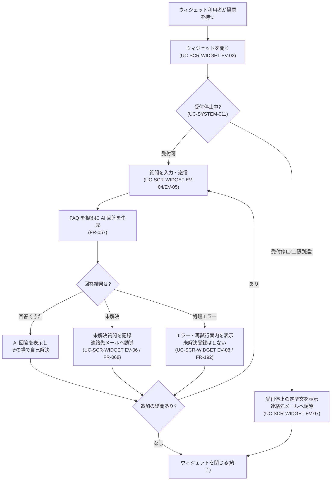

<!-- portal-top -->
[設計ポータル](../../README.md) ／ [要件定義](../index.md) ／ [業務ユースケース](index.md) ／ **UC-BIZ-011: 疑問をその場で自己解決する**
<!-- /portal-top -->

# UC-BIZ-011: 疑問をその場で自己解決する

> **このページは、ウィジェット利用者(エンドユーザー)が顧客サイト上のウィジェットに質問を投げ、登録済み FAQ を根拠とした AI 回答でその場で疑問を自己解決する業務ユースケースを定義します。**
> - 回答できた場合は会話内で完結し、問い合わせコストを発生させない。
> - 回答できなかった場合は未解決質問として記録し、連絡先メールへ誘導する。
> - 受付上限到達時は安全に受付を停止し、誤った回答を返さない。

*版数 v1.0 ・ 更新 2026-06-21 ・ アクター ウィジェット利用者(エンドユーザー)・ ステータス ドラフト*

## 1. 概要

ウィジェット利用者は、顧客サイトに組み込まれた FAQ ウィジェットを開いて疑問を質問し、公開中の登録済み FAQ のみを根拠とした AI 回答を受け取り、その場で自己解決する。AI が回答できない場合や受付が停止されている場合も、利用者を行き止まりにせず、連絡先メールや代替導線へ確実に橋渡しする。これにより運営側の有人問い合わせを減らし、利用者の解決体験を高めることが本ユースケースの業務価値である。

| 項目 | 内容 |
|---|---|
| アクター | ウィジェット利用者(エンドユーザー) |
| 業務価値 | 疑問の即時自己解決による問い合わせ削減と利用者体験の向上 |
| 関連要件 | [FR-057](../01_specifications/FR-057.md#FR-057) FAQ を根拠とした AI 回答 ・ [FR-068](../01_specifications/FR-068.md#FR-068) 未解決質問の登録 ・ [FR-192](../01_specifications/FR-192.md#FR-192) AI 推論動作 |
| 関連詳細 UC | [UC-SCR-WIDGET](UC-SCR-WIDGET.md)(ウィジェット画面イベント)・ [UC-SYSTEM-011](UC-SYSTEM-011.md#UC-SYSTEM-011)(上限到達でウィジェット受付停止) |

## 2. アクター

| アクター | 説明 |
|---|---|
| ウィジェット利用者(エンドユーザー) | 顧客サイトの訪問者。アカウントを持たず、ウィジェットから質問して回答を得る。 |
| FAQ ウィジェット(システム) | 質問送信・AI 回答表示・未解決誘導・受付停止表示を担う公開 UI。 |
| AI 回答処理(システム) | 登録済み FAQ を根拠に回答を生成し、回答可否を判定する。 |

## 3. 事前条件

- 顧客サイトにウィジェットスクリプトが組み込まれ、ランチャーバッジが表示できる。
- 対象プロジェクトに公開中の FAQ が登録されている(回答の根拠となる)。
- 当該プロジェクトのウィジェットが受付停止状態でない(質問数上限未到達)。

## 4. トリガー

ウィジェット利用者が、顧客サイト上で疑問を解決するためにランチャーバッジからウィジェットを開き、質問を送信する。

## 5. 主成功シナリオ(業務ステップ)

1. ウィジェット利用者がランチャーバッジを押下し、チャット UI を開く(ウィジェット起動・設定取得は [UC-SCR-WIDGET](UC-SCR-WIDGET.md) EV-02)。
2. ウィジェット利用者が疑問を質問文として入力し、送信する([UC-SCR-WIDGET](UC-SCR-WIDGET.md) EV-04 / EV-05)。
3. システムが公開中の登録済み FAQ のみを根拠に AI 回答を生成する([FR-057](../01_specifications/FR-057.md#FR-057))。
4. システムが会話欄に AI 回答を表示し、ウィジェット利用者はその場で疑問を自己解決する。
5. ウィジェット利用者は必要に応じて追加の質問を続け、解決したらウィジェットを閉じる([UC-SCR-WIDGET](UC-SCR-WIDGET.md) EV-03)。

## 6. 例外・代替フロー(業務レベル)

| 区分 | 契機 | 業務上の扱い | 参照 |
|---|---|---|---|
| 回答不能(未解決) | FAQ に根拠がない / 矛盾で断定できない | 未解決の旨を表示し、未解決質問として記録のうえ連絡先メールへ誘導する。引き続き別の質問は可能。 | [UC-SCR-WIDGET](UC-SCR-WIDGET.md) EV-06 ・ [FR-068](../01_specifications/FR-068.md#FR-068) |
| 受付停止(上限到達) | 当該プロジェクトの質問数が月次上限の 100% に到達 | 受付停止の定型文を表示し、入力・送信を無効化して連絡先メールへ誘導する。誤回答は返さない。 | [UC-SYSTEM-011](UC-SYSTEM-011.md#UC-SYSTEM-011) ・ [UC-SCR-WIDGET](UC-SCR-WIDGET.md) EV-07 |
| 処理エラー | 通信障害・上流障害・推論タイムアウト等 | エラーと再試行案内を表示する。処理エラーは未解決質問として自動登録しない。 | [UC-SCR-WIDGET](UC-SCR-WIDGET.md) EV-08 ・ [FR-192](../01_specifications/FR-192.md#FR-192) |

## 7. 事後条件

- 回答できた質問は会話内で解決し、有人問い合わせを発生させずに完結する。
- 回答できなかった質問は未解決質問として記録され、連絡先メールへの誘導が行われる([FR-068](../01_specifications/FR-068.md#FR-068))。
- 受付停止時はウィジェットの新規受付が止まり、誤った回答は返らない。プロジェクトの契約状態は変わらない([UC-SYSTEM-011](UC-SYSTEM-011.md#UC-SYSTEM-011))。

## 8. 業務アクティビティ図

---

<!-- portal-bottom -->
[← 業務ユースケース](index.md) ・ [要件定義](../index.md) ・ [↑ 設計ポータル](../../README.md)
<!-- /portal-bottom -->
