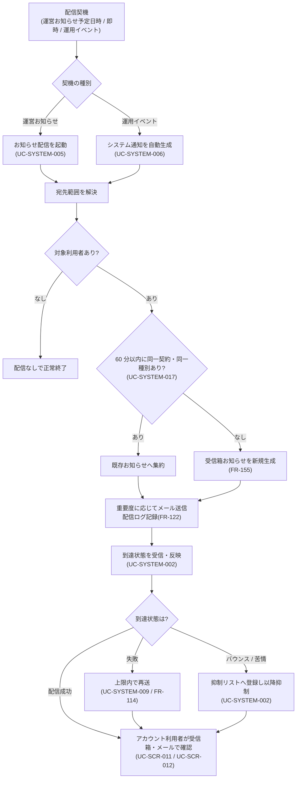

<!-- portal-top -->
[設計ポータル](../../README.md) ／ [要件定義](../index.md) ／ [業務ユースケース](index.md) ／ **UC-BIZ-012: 利用者へ重要連絡を届ける(お知らせ配信・通知・再送)**
<!-- /portal-top -->

# UC-BIZ-012: 利用者へ重要連絡を届ける(お知らせ配信・通知・再送)

> **このページは、運営がメンテナンス予告・規約改定・運用イベント等の重要連絡を、対象のアカウント利用者へ受信箱お知らせとメールで確実に届ける業務ユースケースを定義します。**
> - 運営が登録したお知らせと、運用イベント由来のシステム通知の双方を扱う。
> - 配信失敗は到達状態を追跡し、上限内で再送して到達性を確保する。
> - 重複の集約により、利用者の受信箱を見やすく保つ。

*版数 v1.0 ・ 更新 2026-06-21 ・ アクター 運営 ・ ステータス ドラフト*

## 1. 概要

運営は、サービス上の重要連絡(メンテナンス・機能追加・規約改定・価格改定 等)や運用イベント(利用上限接近・サスペンション・復元 等)を、対象範囲のアカウント利用者へ受信箱お知らせとメールで届ける。配信処理はシステムが自律的に行い、運営は配信内容と対象範囲・重要度を確定する役割を担う。送信後はメールの到達状態を追跡し、失敗分は上限内で再送して到達性を確保する。重複したお知らせは集約し、利用者が確実に重要連絡へ気づける状態を維持することが業務価値である。

| 項目 | 内容 |
|---|---|
| アクター | 運営(配信内容・対象範囲・重要度の確定者) |
| 業務価値 | 重要連絡の確実な到達と、受信箱の見やすさの両立 |
| 関連要件 | [FR-122](../01_specifications/FR-122.md#FR-122) 任意お知らせのメール通知 ・ [FR-114](../01_specifications/FR-114.md#FR-114) 通知再送 ・ [FR-155](../01_specifications/FR-155.md#FR-155) お知らせ一覧 ・ [FR-164](../01_specifications/FR-164.md#FR-164) 運用イベントの受信箱生成と集約 |
| 関連詳細 UC | [UC-SYSTEM-005](UC-SYSTEM-005.md#UC-SYSTEM-005)(運営お知らせ配信)・ [UC-SYSTEM-006](UC-SYSTEM-006.md#UC-SYSTEM-006)(システム通知自動生成)・ [UC-SYSTEM-002](UC-SYSTEM-002.md#UC-SYSTEM-002)(Resend Webhook 受信)・ [UC-SYSTEM-009](UC-SYSTEM-009.md#UC-SYSTEM-009)(通知再送)・ [UC-SYSTEM-017](UC-SYSTEM-017.md#UC-SYSTEM-017)(受信箱集約)・ [UC-SCR-011](UC-SCR-011.md) / [UC-SCR-012](UC-SCR-012.md)(受信側のお知らせ一覧・詳細) |

## 2. アクター

| アクター | 説明 |
|---|---|
| 運営 | お知らせの内容・対象範囲(全契約 / 特定契約 / 特定プロジェクト)・重要度・配信予定日時を確定する。 |
| お知らせ配信処理(システム) | 宛先解決・受信箱生成・メール送信・配信ログ記録を自律的に行う。 |
| メール配信 IF / Resend(システム・外部) | お知らせメールを送信し、到達状態を Webhook で返す。 |
| アカウント利用者(受信側) | 受信箱お知らせとメールで重要連絡を受け取る。 |

## 3. 事前条件

- 配信対象のお知らせまたは運用イベントが、対象範囲・件名・本文・重要度とともに確定している。
- 配信対象のアカウント利用者が解決可能である(全契約 / 特定契約 / 特定プロジェクト)。
- メール配信 IF が利用可能で、抑制リスト(バウンス / 苦情)が参照できる。

## 4. トリガー

運営が登録したお知らせの配信予定日時の到来または即時配信指定、もしくは運用イベントの発生を契機に、重要連絡の配信が起動する。

## 5. 主成功シナリオ(業務ステップ)

1. 運営がお知らせの内容・対象範囲・重要度・配信予定日時を確定する(運用イベントの場合はシステムがイベントを契機に起動)。
2. システムが配信契機(予定日時到来 / 即時配信 / 運用イベント)に応じて配信を起動する([UC-SYSTEM-005](UC-SYSTEM-005.md#UC-SYSTEM-005) / [UC-SYSTEM-006](UC-SYSTEM-006.md#UC-SYSTEM-006))。
3. システムが宛先範囲を解決し、対象アカウント利用者の受信箱にお知らせを生成する([FR-155](../01_specifications/FR-155.md#FR-155))。同一契約・同一種別の連続発火は集約する([UC-SYSTEM-017](UC-SYSTEM-017.md#UC-SYSTEM-017))。
4. システムが重要度に応じてお知らせメールを送信し、配信ログを記録する(`critical` は強制送信)([FR-122](../01_specifications/FR-122.md#FR-122))。
5. システムがメール配信 IF から到達状態を受信し、配信状態を反映する([UC-SYSTEM-002](UC-SYSTEM-002.md#UC-SYSTEM-002))。
6. アカウント利用者が受信箱お知らせとメールで重要連絡を受け取り、お知らせ一覧・詳細で確認する([UC-SCR-011](UC-SCR-011.md) / [UC-SCR-012](UC-SCR-012.md))。

## 6. 例外・代替フロー(業務レベル)

| 区分 | 契機 | 業務上の扱い | 参照 |
|---|---|---|---|
| 宛先なし | 対象範囲に該当するアカウント利用者が存在しない | 受信箱生成・メール送信を行わず正常終了する。 | [UC-SYSTEM-005](UC-SYSTEM-005.md#UC-SYSTEM-005) |
| メール配信失敗 | 一時障害等でメール送信に失敗 | 受信箱お知らせは生成済みとし、失敗を配信ログに記録のうえ上限内で再送する。 | [UC-SYSTEM-009](UC-SYSTEM-009.md#UC-SYSTEM-009) ・ [FR-114](../01_specifications/FR-114.md#FR-114) |
| バウンス / 苦情 | 到達状態が `bounced` / `complained` | 当該宛先を抑制リストへ登録し、以降のメール送信を抑制する(受信箱お知らせは生成済み)。 | [UC-SYSTEM-002](UC-SYSTEM-002.md#UC-SYSTEM-002) |
| 重複発火 | 同一契約・同一種別が 60 分以内に連続発火 | 受信箱お知らせを 1 件へ集約し、重複生成を抑える。 | [UC-SYSTEM-017](UC-SYSTEM-017.md#UC-SYSTEM-017) ・ [FR-164](../01_specifications/FR-164.md#FR-164) |

## 7. 事後条件

- 対象アカウント利用者の受信箱に重要連絡のお知らせが生成され、お知らせ一覧・詳細で確認できる([FR-155](../01_specifications/FR-155.md#FR-155))。
- メール送信対象へお知らせメールが送信され、配信ログと到達状態が記録される。`critical` は対象者へ強制送信される。
- 配信失敗分は上限内で再送され、再送上限到達分・抑制該当分は確定失敗として扱われる([FR-114](../01_specifications/FR-114.md#FR-114))。

## 8. 業務アクティビティ図

---

<!-- portal-bottom -->
[← 業務ユースケース](index.md) ・ [要件定義](../index.md) ・ [↑ 設計ポータル](../../README.md)
<!-- /portal-bottom -->
