<!-- portal-top -->
[設計ポータル](../../README.md) ／ [要件定義](../index.md) ／ [業務ユースケース](index.md) ／ **UC-BIZ-013: データ保護と健全性を維持する(削除・監査・アクセス制御)**
<!-- /portal-top -->

# UC-BIZ-013: データ保護と健全性を維持する(削除・監査・アクセス制御)

> **このページは、運営が利用者データの保護とシステムの健全性を、削除(データ最小化)・監査(記録の改ざん検知)・アクセス制御(セッション/ロックアウト)の自律処理群で維持する業務ユースケースを定義します。**
> - 退会・削除後の猶予経過データを確定削除し、保持義務データは残す。
> - 不正アクセスをセッション失効・ロックアウト・一斉無効化で抑止する。
> - 監査ログの整合性を日次検証し、改ざん・欠落を検知する。

*版数 v1.0 ・ 更新 2026-06-21 ・ アクター 運営 ・ ステータス ドラフト*

## 1. 概要

運営は、利用者データの保護とシステムの健全性を、画面操作を伴わないシステムの自律処理群で維持する。退会・削除後の猶予期間を経たデータを確定削除してデータ最小化を担保し(保持義務のある監査ログ等は残す)、不正アクセスや契約停止に対してはセッション失効・ログイン失敗ロックアウト・契約停止時の一斉無効化でアクセスを制限する。さらに監査ログの整合性を日次で全件検証し、改ざん・欠落の疑いを早期に検知する。これらを運営が監督し、契機が発生したときにシステムが確実に処理することで、プライバシー保護・セキュリティ・監査可能性を継続的に確保することが業務価値である。

| 項目 | 内容 |
|---|---|
| アクター | 運営(データ保護・健全性維持の監督者) |
| 業務価値 | データ最小化・不正アクセス抑止・監査可能性の継続的な確保 |
| 関連要件 | [FR-138](../01_specifications/FR-138.md#FR-138) 猶予期間後のデータ削除 ・ [FR-147](../01_specifications/FR-147.md#FR-147) 操作ログの監査用保持 ・ [NFR-015](../01_specifications/NFR-015.md#NFR-015) 監査ログの改ざん検知保持・日次全件検証 |
| 関連詳細 UC | [UC-SYSTEM-003](UC-SYSTEM-003.md#UC-SYSTEM-003)(90 日物理削除)・ [UC-SYSTEM-012](UC-SYSTEM-012.md#UC-SYSTEM-012)(サスペンション)・ [UC-SYSTEM-013](UC-SYSTEM-013.md#UC-SYSTEM-013)(セッション失効)・ [UC-SYSTEM-014](UC-SYSTEM-014.md#UC-SYSTEM-014)(ロックアウト)・ [UC-SYSTEM-015](UC-SYSTEM-015.md#UC-SYSTEM-015)(契約停止時セッション一斉無効化)・ [UC-SYSTEM-018](UC-SYSTEM-018.md#UC-SYSTEM-018)(監査ログ整合性検証) |

## 2. アクター

| アクター | 説明 |
|---|---|
| 運営 | データ保護・健全性維持の方針を定め、契約停止やアラート対応を監督する。 |
| 削除バッチ(システム) | 論理削除後 90 日経過データを依存順で物理削除し、監査記録を残す。 |
| アクセス制御処理(システム) | セッション失効・ロックアウト・契約停止時の一斉無効化を判定・適用する。 |
| 整合性検証バッチ(システム) | 監査ログを日次で全件走査し、改ざん検知の整合性を検証する。 |

## 3. 事前条件

- 退会・削除済みデータが論理削除日とともに記録され、猶予期間(90 日)が定義されている。
- セッション・ロックアウト・契約状態の判定基準が定義されている(タイムアウト・5 回 / 15 分・停止時制限)。
- 監査ログが改ざん検知可能な形で保持されている([NFR-015](../01_specifications/NFR-015.md#NFR-015))。

## 4. トリガー

データ保護・健全性維持の各契機 — 日次バッチ起動(削除・監査検証)、認可チェックやログイン失敗・契約停止などのイベント(アクセス制御)— の発生を契機に、対応するシステム処理が起動する。

## 5. 主成功シナリオ(業務ステップ)

1. 運営がデータ保護・健全性維持の方針(猶予期間・アクセス制御基準・監査要件)を確立する。
2. 退会・削除の猶予が経過すると、日次バッチが対象データを依存順で物理削除し、保持義務データは残す([UC-SYSTEM-003](UC-SYSTEM-003.md#UC-SYSTEM-003) / [FR-138](../01_specifications/FR-138.md#FR-138))。
3. 認可チェック時にセッションの有効性を判定し、タイムアウト失効を無効化して再認証へ誘導する([UC-SYSTEM-013](UC-SYSTEM-013.md#UC-SYSTEM-013))。
4. ログイン失敗が連続したアカウントをロックして総当たりを抑止し、時間経過または権限者の手動解除で復旧する([UC-SYSTEM-014](UC-SYSTEM-014.md#UC-SYSTEM-014))。
5. 契約が停止(決済失敗起因のサスペンション含む)した場合、配下利用者の全セッションを一斉無効化し、停止時アクセス制限を適用する([UC-SYSTEM-012](UC-SYSTEM-012.md#UC-SYSTEM-012) / [UC-SYSTEM-015](UC-SYSTEM-015.md#UC-SYSTEM-015))。
6. 日次バッチが監査ログを全件検証し、整合性を確認する([UC-SYSTEM-018](UC-SYSTEM-018.md#UC-SYSTEM-018) / [NFR-015](../01_specifications/NFR-015.md#NFR-015))。

## 6. 例外・代替フロー(業務レベル)

| 区分 | 契機 | 業務上の扱い | 参照 |
|---|---|---|---|
| 削除対象なし / 削除エラー | 90 日経過データが無い / 個別削除が失敗 | 対象なしは正常終了。失敗は当該対象を中止し整合性を保って継続、監査記録のうえ次回再評価する。 | [UC-SYSTEM-003](UC-SYSTEM-003.md#UC-SYSTEM-003) |
| 保持義務データ | 監査ログ等の法令・運用上の保持義務 | 物理削除の対象外とし、保持期間に従って別途管理する。 | [FR-138](../01_specifications/FR-138.md#FR-138) ・ [FR-147](../01_specifications/FR-147.md#FR-147) |
| 重要操作の再認証 | セッションは有効だが重要操作で再認証未充足 | 当該操作 1 回・15 分以内の再認証を要求してから実行する。 | [UC-SYSTEM-013](UC-SYSTEM-013.md#UC-SYSTEM-013) |
| 再決済成功 / 解除 | サスペンション中・猶予中に再決済成功 | 契約を `active` へ即時復帰し、以降のアクセス制限を解除する。 | [UC-SYSTEM-012](UC-SYSTEM-012.md#UC-SYSTEM-012) |
| 整合性違反の検出 | 監査ログに改ざん・欠落の疑い | 対象を特定してアラート通知し、走査は中断せず全件継続する(監査ログ自体は変更しない)。 | [UC-SYSTEM-018](UC-SYSTEM-018.md#UC-SYSTEM-018) ・ [NFR-015](../01_specifications/NFR-015.md#NFR-015) |

## 7. 事後条件

- 猶予を経たデータは確定削除(不可逆)され、保持義務データは保持される。削除内容は監査ログに記録される([FR-138](../01_specifications/FR-138.md#FR-138))。
- 失効・ロックアウト・契約停止に該当するセッションは無効化され、再認証なしには操作できない。停止後の操作には停止時アクセス制限が適用される。
- 監査ログが日次で全件検証され、整合性違反は運用担当へアラート通知される([NFR-015](../01_specifications/NFR-015.md#NFR-015) / [FR-147](../01_specifications/FR-147.md#FR-147))。

## 8. 業務アクティビティ図

```mermaid
flowchart TD
  A["運営がデータ保護・健全性方針を確立"] --> B{"契機の種別"}
  B -- "退会・削除の猶予経過(日次)" --> C["猶予経過データを依存順で物理削除<br/>保持義務データは残す<br/>(UC-SYSTEM-003 / FR-138)"]
  B -- "認可チェック / 時間経過" --> D["セッション有効性を判定<br/>失効を無効化し再認証へ誘導<br/>(UC-SYSTEM-013)"]
  B -- "ログイン失敗の連続" --> E["5 回 / 15 分でロックアウト<br/>時間経過 or 手動で解除<br/>(UC-SYSTEM-014)"]
  B -- "契約停止 / サスペンション" --> F["配下全セッションを一斉無効化<br/>停止時アクセス制限を適用<br/>(UC-SYSTEM-012 / UC-SYSTEM-015)"]
  B -- "監査検証(日次)" --> G["監査ログを全件走査し整合性を検証<br/>(UC-SYSTEM-018 / NFR-015)"]
  C --> H["削除を監査ログに記録"]
  D --> R["アクセス制御の結果を反映"]
  E --> R
  F --> R
  G --> I{"整合性違反あり?"}
  I -- "あり" --> J["運用担当へアラート通知<br/>(走査は全件継続)"]
  I -- "なし" --> K["正常終了(違反なし)"]
  H --> Z["データ保護・健全性を維持(完了)"]
  R --> Z
  J --> Z
  K --> Z
```

---

<!-- portal-bottom -->
[← 業務ユースケース](index.md) ・ [要件定義](../index.md) ・ [↑ 設計ポータル](../../README.md)
<!-- /portal-bottom -->
