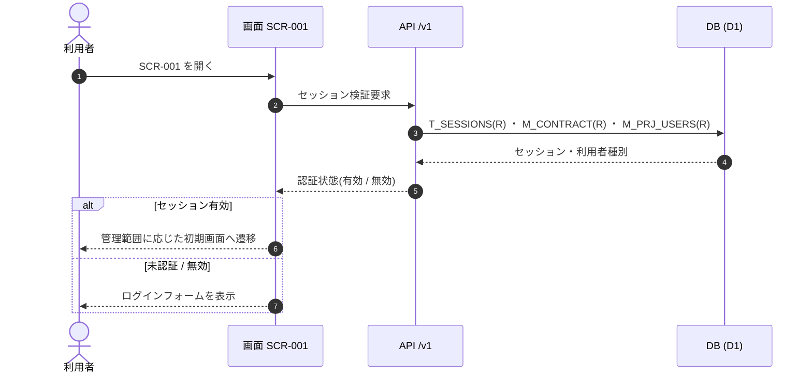
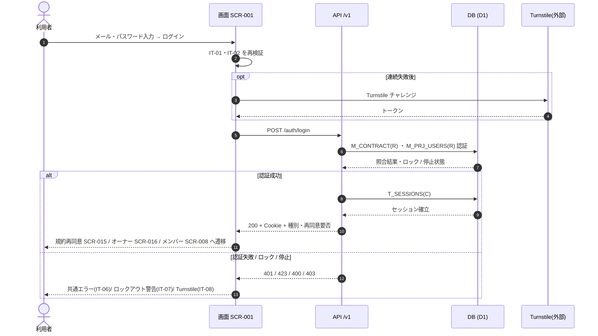

<!-- portal-top -->
[設計ポータル](../../README.md) ／ [要件定義](../index.md) ／ [業務ユースケース](index.md) ／ **UC-SCR-001: ログイン ユースケース**
<!-- /portal-top -->

# UC-SCR-001: ログイン ユースケース

> **このページは、画面 SCR-001(ログイン)の画面イベント EV-01〜EV-06 に対応する 6 つのユースケースを「1 イベント = 1 ユースケース」で定義します。**

*版数 v1.0 ・ 更新 2026-06-21 ・ ユースケース 6 ・ ステータス ドラフト*

## 0. イベント↔ユースケース対応表

画面 [SCR-001](../../02_basic_design/01_screens/SCR-001.md#SCR-001) §6 の各イベントを、1 対 1 でユースケースへ対応づけます。種別は API/DB 連携を伴うか、画面内で完結するかを区別します。

| イベント ID | イベント名 | ユースケース ID | 種別 |
|---|---|---|---|
| `EV-01` | 初期表示 | [UC-SCR-001-EV01](#UC-SCR-001-EV01) | API/DB 連携 |
| `EV-02` | メールアドレスを入力 | [UC-SCR-001-EV02](#UC-SCR-001-EV02) | クライアント内処理のみ |
| `EV-03` | パスワードを入力 | [UC-SCR-001-EV03](#UC-SCR-001-EV03) | クライアント内処理のみ |
| `EV-04` | 「ログイン」を押下 | [UC-SCR-001-EV04](#UC-SCR-001-EV04) | API/DB 連携 |
| `EV-05` | 「パスワードを忘れた場合」を押下 | [UC-SCR-001-EV05](#UC-SCR-001-EV05) | クライアント内処理のみ |
| `EV-06` | 「アカウント登録」を押下 | [UC-SCR-001-EV06](#UC-SCR-001-EV06) | クライアント内処理のみ |

## 1. ユースケース定義

### UC-SCR-001-EV01 初期表示

> **概要** ログインフォームを表示し、既認証セッションが有効な場合は管理範囲に応じた初期画面へリダイレクトする軽量ユースケース。

| 項目 | 内容 |
|---|---|
| 利用者 | 未認証ユーザー(既認証セッションを持つ場合あり) |
| 事前条件 | SCR-001 の URL にアクセスした |
| トリガー | EV-01: 初期表示 |
| 事後条件 | 未認証時はログインフォームを表示する。既認証かつセッション有効時は管理範囲に応じた初期画面(オーナーは SCR-016 利用状況 / メンバーは SCR-008 概要)へ遷移する |
| 関連 | [SCR-001](../../02_basic_design/01_screens/SCR-001.md#SCR-001) ・ [API-AUTH-002](../../02_basic_design/03_apis/API-auth.md#API-AUTH-002) ・ [FR-004](../01_specifications/FR-004.md#FR-004) |

**基本フロー**
1. 画面がセッション Cookie の有無を確認する。
2. セッションが無い、または無効な場合はログインフォーム(IT-01〜IT-05)を表示して終了する。
3. セッションが有効な場合は利用者種別を判定し、オーナーは SCR-016 利用状況、メンバーは SCR-008 概要へリダイレクトする。
4. 未同意の規約改定がある場合は SCR-015 規約再同意へ割込み遷移する。

**異常系フロー**
- セッションが失効済み・検証失敗の場合はリダイレクトせず、ログインフォームを表示する。

**シーケンス図**

### UC-SCR-001-EV02 メールアドレスを入力

> **概要** メールアドレス入力欄の必須・形式をインラインで検証する、クライアント内処理のみのユースケース。

| 項目 | 内容 |
|---|---|
| 利用者 | 未認証ユーザー |
| 事前条件 | ログインフォームが表示されている |
| トリガー | EV-02: メールアドレス(IT-01)を入力 |
| 事後条件 | 入力値が妥当ならフィールドエラーを消去し、不正なら IT-01 直下にエラーを表示する |
| 関連 | [SCR-001](../../02_basic_design/01_screens/SCR-001.md#SCR-001) ・ [FR-004](../01_specifications/FR-004.md#FR-004) |

クライアント内処理のみ(バックエンド連携なし)。

**基本フロー**
1. 入力値の必須・メールアドレス形式を画面内で検証する。
2. 妥当ならフィールドエラーを消去する。

**異常系フロー**
- 未入力・形式不正の場合は IT-01 直下にエラーを表示する。

### UC-SCR-001-EV03 パスワードを入力

> **概要** パスワード入力欄の必須をインラインで検証する、クライアント内処理のみのユースケース。

| 項目 | 内容 |
|---|---|
| 利用者 | 未認証ユーザー |
| 事前条件 | ログインフォームが表示されている |
| トリガー | EV-03: パスワード(IT-02)を入力 |
| 事後条件 | 入力済みならフィールドエラーを消去し、未入力なら IT-02 直下にエラーを表示する |
| 関連 | [SCR-001](../../02_basic_design/01_screens/SCR-001.md#SCR-001) ・ [FR-004](../01_specifications/FR-004.md#FR-004) |

クライアント内処理のみ(バックエンド連携なし)。

**基本フロー**
1. 入力値の必須を画面内で検証する。
2. 入力済みならフィールドエラーを消去する。

**異常系フロー**
- 未入力の場合は IT-02 直下にエラーを表示する。

### UC-SCR-001-EV04 「ログイン」を押下

> **概要** 入力を再検証し、必要時は Turnstile を提示したうえでログイン API を呼び出し、成功時は管理範囲に応じて遷移、失敗時は共通エラーまたはロックアウト警告を表示する最重要ユースケース。

| 項目 | 内容 |
|---|---|
| 利用者 | 未認証ユーザー |
| 事前条件 | メールアドレス(IT-01)とパスワード(IT-02)が入力されている。連続失敗後は Turnstile チャレンジ(IT-08)が表示されている場合がある |
| トリガー | EV-04: 「ログイン」ボタン(IT-03)押下 |
| 事後条件 | 成功時はセッションを確立し、未同意の改定があれば SCR-015 規約再同意、オーナーは SCR-016 利用状況、メンバーは SCR-008 概要へ遷移する。失敗時はセッション未確立のまま共通エラー(IT-06)またはロックアウト警告(IT-07)を表示する。5 回連続失敗時は 15 分間ロックし、15 分経過または管理者解除で復旧する([FR-007](../01_specifications/FR-007.md#FR-007)) |
| 関連 | [SCR-001](../../02_basic_design/01_screens/SCR-001.md#SCR-001) ・ [API-AUTH-002](../../02_basic_design/03_apis/API-auth.md#API-AUTH-002) ・ [FR-004](../01_specifications/FR-004.md#FR-004) ・ [FR-007](../01_specifications/FR-007.md#FR-007) |

**基本フロー**
1. IT-01・IT-02 の必須・形式を再検証し、不正なら送信を中止してエラーを表示する。
2. 連続失敗後で Turnstile が要求される場合は IT-08 を提示し、取得したトークンを送信内容に含める。
3. ログイン API(`POST /auth/login` = [API-AUTH-002](../../02_basic_design/03_apis/API-auth.md#API-AUTH-002))を呼び出す。資格情報を `M_CONTRACT` / `M_PRJ_USERS`(両マスタは分離)で照合し、ロック状態・契約停止状態を判定する。
4. 認証成功時はセッション(`T_SESSIONS`)を発行し、再規約同意要否と利用者種別を受け取る。
5. 成功の遷移を 3 分岐で行う。
   1. 未同意の規約改定あり: SCR-015 規約再同意へ割込み遷移する。
   2. オーナー(`actorType=owner`): SCR-016 利用状況へ遷移する。
   3. メンバー(`actorType=project_user`): SCR-008 概要へ遷移する。

**異常系フロー**
- `INVALID_CREDENTIALS`(401): 共通エラー(IT-06)を表示する。メールアドレスの存在有無を区別しない文言とし、失敗試行として計上する。
- `LOCKED_OUT`(423): ロックアウト警告(IT-07)を表示し、15 分間の試行を抑止する。15 分経過または管理者解除で復旧する([FR-007](../01_specifications/FR-007.md#FR-007))。
- `TURNSTILE_REQUIRED`(400): Turnstile チャレンジ(IT-08)を表示し、トークン取得後に再送信を促す。
- `CONTRACT_SUSPENDED`(403、契約停止状態): セッションを確立せず、停止時のアクセス制限ルールに従う旨を表示する。
- 入力再検証エラー: 送信を中止し、該当フィールド直下にエラーを表示する。

**シーケンス図**

### UC-SCR-001-EV05 「パスワードを忘れた場合」を押下

> **概要** パスワード再設定画面へ遷移する、クライアント内処理のみのユースケース。

| 項目 | 内容 |
|---|---|
| 利用者 | 未認証ユーザー |
| 事前条件 | ログインフォームが表示されている |
| トリガー | EV-05: 「パスワードを忘れた場合」(IT-04)押下 |
| 事後条件 | SCR-003 パスワード再設定へ遷移する |
| 関連 | [SCR-001](../../02_basic_design/01_screens/SCR-001.md#SCR-001) ・ [FR-004](../01_specifications/FR-004.md#FR-004) |

クライアント内処理のみ(バックエンド連携なし)。

**基本フロー**
1. SCR-003 パスワード再設定へ遷移する。

**異常系フロー**
- なし(画面遷移のみ)。

### UC-SCR-001-EV06 「アカウント登録」を押下

> **概要** アカウント登録画面へ遷移する、クライアント内処理のみのユースケース。

| 項目 | 内容 |
|---|---|
| 利用者 | 未認証ユーザー |
| 事前条件 | ログインフォームが表示されている |
| トリガー | EV-06: 「アカウント登録」(IT-05)押下 |
| 事後条件 | SCR-002 アカウント登録へ遷移する |
| 関連 | [SCR-001](../../02_basic_design/01_screens/SCR-001.md#SCR-001) ・ [FR-004](../01_specifications/FR-004.md#FR-004) |

クライアント内処理のみ(バックエンド連携なし)。

**基本フロー**
1. SCR-002 アカウント登録へ遷移する。

**異常系フロー**
- なし(画面遷移のみ)。
</content>
</invoke>

---

<!-- portal-bottom -->
[← 業務ユースケース](index.md) ・ [要件定義](../index.md) ・ [↑ 設計ポータル](../../README.md)
<!-- /portal-bottom -->
