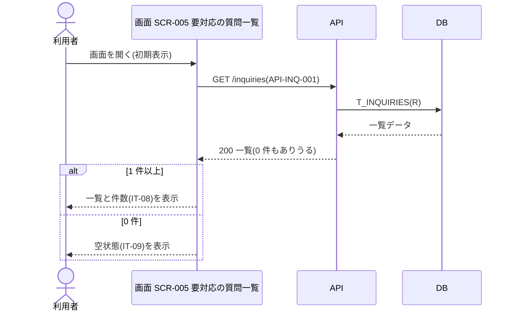
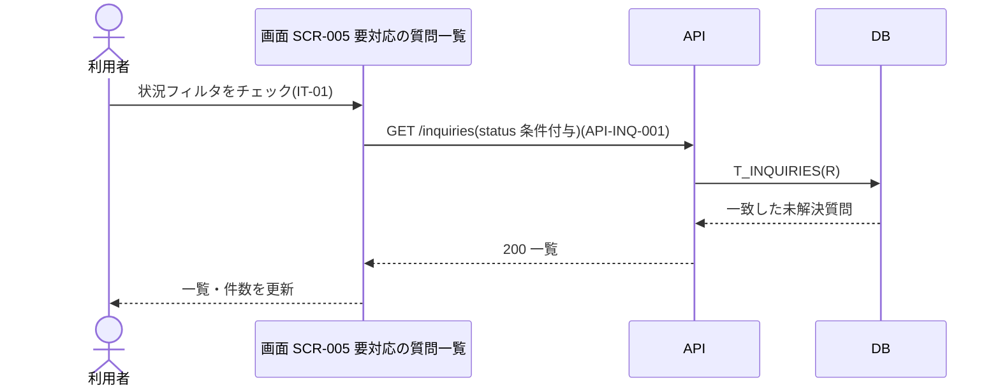
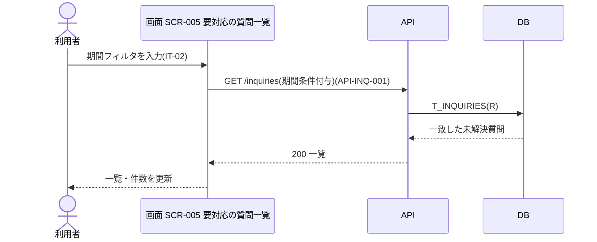
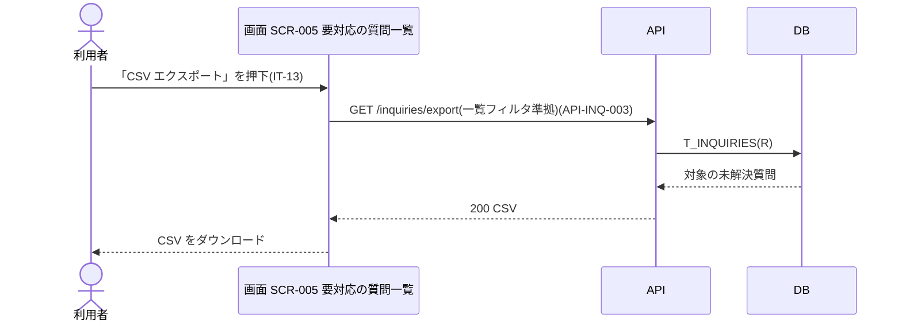
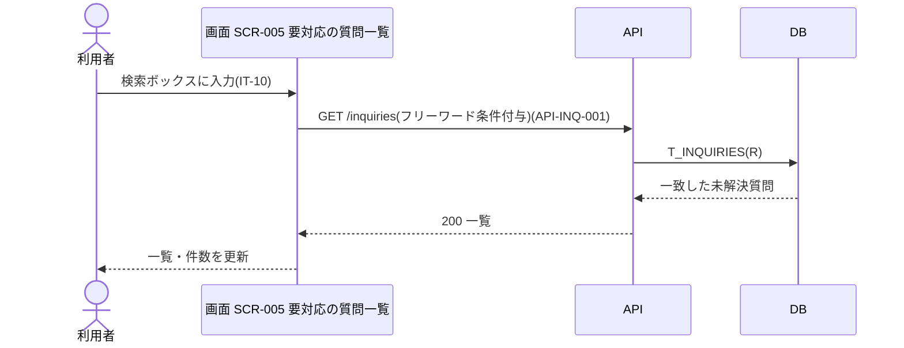
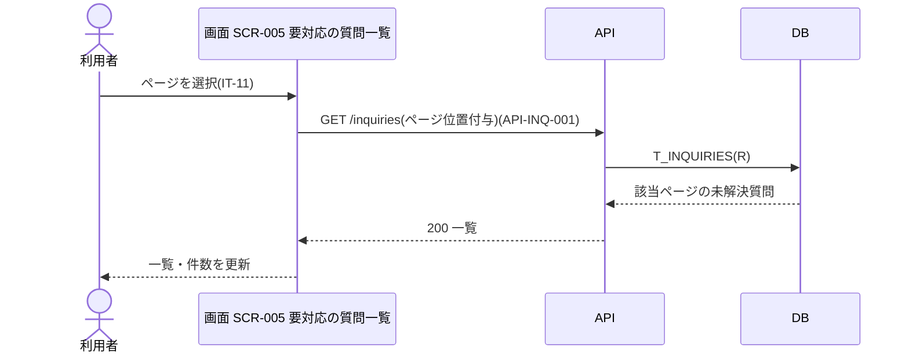

<!-- portal-top -->
[設計ポータル](../../README.md) ／ [要件定義](../index.md) ／ [業務ユースケース](index.md) ／ **UC-SCR-005: 要対応の質問一覧 ユースケース**
<!-- /portal-top -->

# UC-SCR-005: 要対応の質問一覧 ユースケース

> **このページは、画面 SCR-005(要対応の質問一覧)の画面イベント EV-01〜EV-08 に対応する 8 つのユースケースを「1 イベント = 1 ユースケース」で定義します。**

*版数 v1.0 ・ 更新 2026-06-21 ・ ユースケース 8 ・ ステータス ドラフト*

## 0. イベント↔ユースケース対応表

画面 [SCR-005](../../02_basic_design/01_screens/SCR-005.md#SCR-005) の §6 画面イベント一覧(EV-01〜EV-08)を、ユースケース ID へ 1:1 で対応づけます。種別は、サーバ API・DB へアクセスする「API/DB 連携」と、画面内のみで完結する「クライアント内処理のみ」に区別します。

| イベント ID | イベント名 | ユースケース ID | 種別 |
|----|----|----|----|
| `EV-01` | 初期表示 | [UC-SCR-005-EV01](#UC-SCR-005-EV01) | API/DB 連携 |
| `EV-02` | 状況フィルタをチェック | [UC-SCR-005-EV02](#UC-SCR-005-EV02) | API/DB 連携 |
| `EV-03` | 期間フィルタを入力 | [UC-SCR-005-EV03](#UC-SCR-005-EV03) | API/DB 連携 |
| `EV-04` | 「CSV エクスポート」を押下 | [UC-SCR-005-EV04](#UC-SCR-005-EV04) | API/DB 連携 |
| `EV-05` | 問い合わせ ID リンクを押下 | [UC-SCR-005-EV05](#UC-SCR-005-EV05) | クライアント内処理のみ |
| `EV-06` | 検索ボックスに入力 | [UC-SCR-005-EV06](#UC-SCR-005-EV06) | API/DB 連携 |
| `EV-07` | ページを選択 | [UC-SCR-005-EV07](#UC-SCR-005-EV07) | API/DB 連携 |
| `EV-08` | 「ウィジェット設定を見る」を押下 | [UC-SCR-005-EV08](#UC-SCR-005-EV08) | クライアント内処理のみ |

## 1. ユースケース定義

### UC-SCR-005-EV01 初期表示

> 要対応の質問一覧画面を開いたとき、当該プロジェクトの未解決質問一覧を取得して表示し、0 件のときは正常状態を案内する空状態を表示します。

| 項目 | 内容 |
|----|----|
| 利用者 | オーナー / 当該プロジェクトのメンバー |
| 事前条件 | ログイン済みで、当該プロジェクトへの割当がある |
| トリガー | 画面 SCR-005 を開く(初期表示) |
| 事後条件 | 取得結果を一覧表示する。1 件以上のとき件数表示(IT-08)を更新し、0 件のとき空状態(IT-09)を表示する |
| 関連 | [SCR-005](../../02_basic_design/01_screens/SCR-005.md#SCR-005) ・ [API-INQ-001](../../02_basic_design/03_apis/API-inquiry.md#API-INQ-001) ・ [FR-068](../01_specifications/FR-068.md#FR-068) |

基本フロー

1. 利用者が要対応の質問一覧画面を開く。
2. 画面は当該プロジェクトを条件に未解決質問一覧 API を呼び出す。
3. API は認証・認可を検証し、未解決質問を取得して返す。
4. 1 件以上のとき、画面は一覧を表示し、件数表示(IT-08)を更新する。
5. 0 件のとき、画面は空状態(IT-09)を表示する。

異常系フロー

- 認可エラー(403): 当該プロジェクトへの権限がない場合、権限不足を表示する。
- 取得失敗: 一覧を表示せず、エラーメッセージを表示する。

### UC-SCR-005-EV02 状況フィルタをチェック

> 状況フィルタをチェックすると、その条件を付与して未解決質問一覧を再取得し、一覧を更新します。

| 項目 | 内容 |
|----|----|
| 利用者 | オーナー / 当該プロジェクトのメンバー |
| 事前条件 | 要対応の質問一覧を表示している |
| トリガー | 状況フィルタ(IT-01)をチェックする |
| 事後条件 | チェック中の状況条件に一致する未解決質問で一覧を更新する。0 件のとき空状態(IT-09)を表示する |
| 関連 | [SCR-005](../../02_basic_design/01_screens/SCR-005.md#SCR-005) ・ [API-INQ-001](../../02_basic_design/03_apis/API-inquiry.md#API-INQ-001) |

基本フロー

1. 利用者が状況フィルタ(IT-01)で「対応中」「対応済み」をチェックする。
2. 画面はチェック中の状況条件を付与して未解決質問一覧 API を再取得する。
3. API は条件に一致する未解決質問を取得して返す。
4. 画面は一覧と件数表示(IT-08)を更新する。0 件のときは空状態(IT-09)を表示する。

異常系フロー

- 取得失敗: 一覧を更新せず、エラーメッセージを表示する。

### UC-SCR-005-EV03 期間フィルタを入力

> 期間フィルタを入力すると、その期間条件を付与して未解決質問一覧を再取得し、一覧を更新します。

| 項目 | 内容 |
|----|----|
| 利用者 | オーナー / 当該プロジェクトのメンバー |
| 事前条件 | 要対応の質問一覧を表示している |
| トリガー | 期間フィルタ(IT-02)に日付範囲を入力する |
| 事後条件 | 入力した期間に一致する未解決質問で一覧を更新する。0 件のとき空状態(IT-09)を表示する |
| 関連 | [SCR-005](../../02_basic_design/01_screens/SCR-005.md#SCR-005) ・ [API-INQ-001](../../02_basic_design/03_apis/API-inquiry.md#API-INQ-001) |

基本フロー

1. 利用者が期間フィルタ(IT-02)に開始日・終了日を入力する。
2. 画面は入力中の期間条件を付与して未解決質問一覧 API を再取得する。
3. API は条件に一致する未解決質問を取得して返す。
4. 画面は一覧と件数表示(IT-08)を更新する。0 件のときは空状態(IT-09)を表示する。

異常系フロー

- 取得失敗: 一覧を更新せず、エラーメッセージを表示する。

### UC-SCR-005-EV04 「CSV エクスポート」を押下

> 「CSV エクスポート」を押下し、現在のフィルタ条件を適用した未解決質問の全件を CSV として取得してダウンロードします。

| 項目 | 内容 |
|----|----|
| 利用者 | オーナー / 当該プロジェクトのメンバー |
| 事前条件 | 要対応の質問一覧を表示している |
| トリガー | CSV エクスポートボタン(IT-13)を押下する |
| 事後条件 | フィルタ適用結果の全件 CSV をダウンロードする |
| 関連 | [SCR-005](../../02_basic_design/01_screens/SCR-005.md#SCR-005) ・ [API-INQ-003](../../02_basic_design/03_apis/API-inquiry.md#API-INQ-003) |

基本フロー

1. 利用者が CSV エクスポートボタン(IT-13)を押下する。
2. 画面は現在のフィルタ条件で未解決質問 CSV エクスポート API を呼び出す。
3. API は同じフィルタ条件で対象の未解決質問を全件取得し、CSV に整形して返す。
4. 画面は CSV をダウンロードとして保存する。

異常系フロー

- エクスポート失敗: ダウンロードを行わず、エラーメッセージを表示する。

### UC-SCR-005-EV05 問い合わせ ID リンクを押下

> 問い合わせ ID リンクを押下し、当該未解決質問を要対応の質問詳細画面で開きます(クライアント内処理のみ)。

| 項目 | 内容 |
|----|----|
| 利用者 | オーナー / 当該プロジェクトのメンバー |
| 事前条件 | 一覧に対象の未解決質問が表示されている |
| トリガー | 問い合わせ ID(IT-03)のリンクを押下する |
| 事後条件 | 要対応の質問詳細画面(SCR-005-001)へ遷移する |
| 関連 | [SCR-005](../../02_basic_design/01_screens/SCR-005.md#SCR-005) ・ [SCR-005-001](../../02_basic_design/01_screens/SCR-005-001.md#SCR-005-001) |

基本フロー

1. 利用者が問い合わせ ID(IT-03)のリンクを押下する。
2. 画面は対象の問い合わせ ID を引き継ぎ、要対応の質問詳細画面(SCR-005-001)へ遷移する。

異常系フロー

- なし(画面遷移のみ。対象質問の取得・権限検証は遷移先 SCR-005-001 で行う)。

クライアント内処理のみ(画面遷移)のため、シーケンス図は省略します。

### UC-SCR-005-EV06 検索ボックスに入力

> 検索ボックスにフリーワードを入力すると、その条件を付与して未解決質問一覧を再取得し、一覧を更新します。

| 項目 | 内容 |
|----|----|
| 利用者 | オーナー / 当該プロジェクトのメンバー |
| 事前条件 | 要対応の質問一覧を表示している |
| トリガー | 検索ボックス(IT-10)にフリーワードを入力する |
| 事後条件 | 問い合わせ ID または質問テキストに一致する未解決質問で一覧を更新する。0 件のとき空状態(IT-09)を表示する |
| 関連 | [SCR-005](../../02_basic_design/01_screens/SCR-005.md#SCR-005) ・ [API-INQ-001](../../02_basic_design/03_apis/API-inquiry.md#API-INQ-001) |

基本フロー

1. 利用者が検索ボックス(IT-10)に問い合わせ ID または質問テキストを入力する。
2. 画面は入力されたフリーワードを条件に付与して未解決質問一覧 API を再取得する。
3. API は条件に一致する未解決質問を取得して返す。
4. 画面は一覧と件数表示(IT-08)を更新する。0 件のときは空状態(IT-09)を表示する。

異常系フロー

- 取得失敗: 一覧を更新せず、エラーメッセージを表示する。

### UC-SCR-005-EV07 ページを選択

> ページを選択すると、選択したページの位置を付与して未解決質問一覧を再取得し、一覧を更新します。

| 項目 | 内容 |
|----|----|
| 利用者 | オーナー / 当該プロジェクトのメンバー |
| 事前条件 | 未解決質問が 2 ページ以上あり、ページネーション(IT-11)を表示している |
| トリガー | ページネーション(IT-11)でページを選択する |
| 事後条件 | 選択したページの未解決質問で一覧を更新する |
| 関連 | [SCR-005](../../02_basic_design/01_screens/SCR-005.md#SCR-005) ・ [API-INQ-001](../../02_basic_design/03_apis/API-inquiry.md#API-INQ-001) |

基本フロー

1. 利用者がページネーション(IT-11)で前へ / 次へ / ページ番号を選択する。
2. 画面は選択したページの位置を付与して未解決質問一覧 API を再取得する。
3. API は該当ページの未解決質問を取得して返す。
4. 画面は一覧と件数表示(IT-08)を更新する。

異常系フロー

- 取得失敗: ページを切り替えず、エラーメッセージを表示する。

### UC-SCR-005-EV08 「ウィジェット設定を見る」を押下

> 空状態の「ウィジェット設定を見る」を押下し、ウィジェット設定画面へ遷移します(クライアント内処理のみ)。

| 項目 | 内容 |
|----|----|
| 利用者 | オーナー / 当該プロジェクトのメンバー |
| 事前条件 | 未解決質問が 0 件で、空状態(IT-09)を表示している |
| トリガー | 「ウィジェット設定を見る」ボタン(IT-12)を押下する |
| 事後条件 | ウィジェット設定画面(SCR-007)へ遷移する |
| 関連 | [SCR-005](../../02_basic_design/01_screens/SCR-005.md#SCR-005) ・ [SCR-007](../../02_basic_design/01_screens/SCR-007.md#SCR-007) |

基本フロー

1. 利用者が「ウィジェット設定を見る」ボタン(IT-12)を押下する。
2. 画面はウィジェット設定画面(SCR-007)へ遷移する。

異常系フロー

- なし(画面遷移のみ)。

クライアント内処理のみ(画面遷移)のため、シーケンス図は省略します。

---

<!-- portal-bottom -->
[← 業務ユースケース](index.md) ・ [要件定義](../index.md) ・ [↑ 設計ポータル](../../README.md)
<!-- /portal-bottom -->
