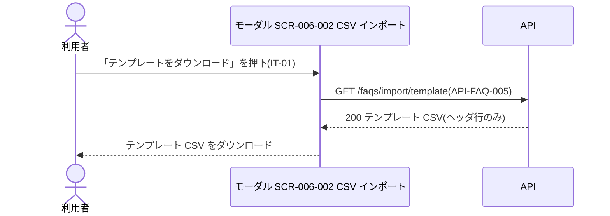
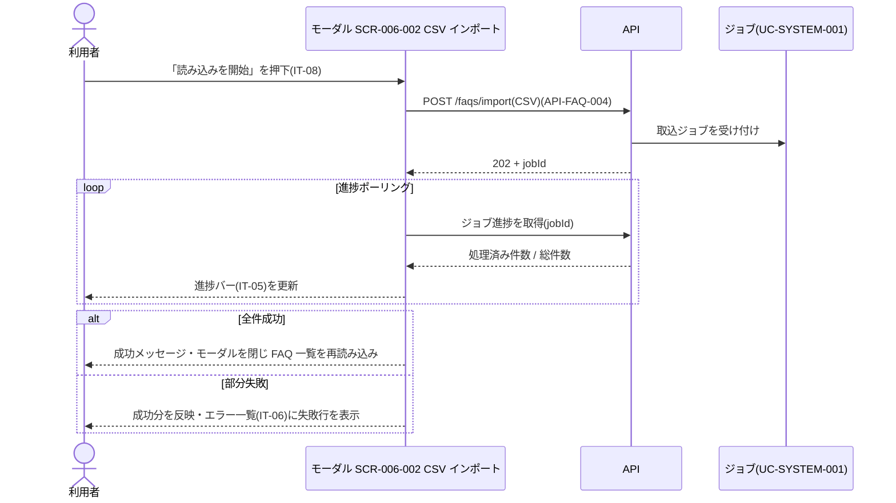

<!-- portal-top -->
[設計ポータル](../../README.md) ／ [要件定義](../index.md) ／ [業務ユースケース](index.md) ／ **UC-SCR-006-002: FAQ CSV インポートモーダル ユースケース**
<!-- /portal-top -->

# UC-SCR-006-002: FAQ CSV インポートモーダル ユースケース

> **このページは、画面 SCR-006-002(FAQ CSV インポートモーダル)の画面イベント EV-01〜EV-06 に対応する 6 つのユースケースを「1 イベント = 1 ユースケース」で定義します。**

*版数 v1.0 ・ 更新 2026-06-21 ・ ユースケース 6 ・ ステータス ドラフト*

## 0. イベント↔ユースケース対応表

画面 [SCR-006-002](../../02_basic_design/01_screens/SCR-006-002.md#SCR-006-002) の §6 画面イベント一覧(EV-01〜EV-06)を、ユースケース ID へ 1:1 で対応づけます。種別は、サーバ API・DB へアクセスする「API/DB 連携」と、画面内のみで完結する「クライアント内処理のみ」に区別します。

| イベント ID | イベント名 | ユースケース ID | 種別 |
|----|----|----|----|
| `EV-01` | 初期表示 | [UC-SCR-006-002-EV01](#UC-SCR-006-002-EV01) | クライアント内処理のみ |
| `EV-02` | 「テンプレートをダウンロード」を押下 | [UC-SCR-006-002-EV02](#UC-SCR-006-002-EV02) | API/DB 連携 |
| `EV-03` | ファイル選択にファイルを投入 | [UC-SCR-006-002-EV03](#UC-SCR-006-002-EV03) | クライアント内処理のみ |
| `EV-04` | 「読み込みを開始」を押下 | [UC-SCR-006-002-EV04](#UC-SCR-006-002-EV04) | API/DB 連携 |
| `EV-05` | 「キャンセル」を押下 | [UC-SCR-006-002-EV05](#UC-SCR-006-002-EV05) | クライアント内処理のみ |
| `EV-06` | 「×」を押下 | [UC-SCR-006-002-EV06](#UC-SCR-006-002-EV06) | クライアント内処理のみ |

> [!NOTE]
> **システム側ジョブとの対**  本モーダルは非同期 CSV 取込の UI 側であり、取込本体(行単位の新規 / 上書き / 失敗判定・部分失敗集計・完了通知)はシステムユースケース [UC-SYSTEM-001](UC-SYSTEM-001.md#UC-SYSTEM-001) が担います。本書はインポートの送信(`POST /faqs/import` → 202 jobId)とジョブ進行・完了表示の UI イベントを定義し、ジョブ実体は UC-SYSTEM-001 へ委譲します。

## 1. ユースケース定義

### UC-SCR-006-002-EV01 初期表示

> CSV インポートモーダルを開いたとき、ファイル未選択・「読み込みを開始」非活性の初期状態で表示します(クライアント内処理のみ)。

| 項目 | 内容 |
|----|----|
| 利用者 | オーナー / 当該プロジェクトのメンバー(FAQ 管理権限が前提) |
| 事前条件 | FAQ 一覧(SCR-006)から「CSV をインポート」を押下した |
| トリガー | モーダル SCR-006-002 を開く(初期表示) |
| 事後条件 | ファイル未選択・「読み込みを開始」(IT-08)非活性の初期状態でモーダルを表示する |
| 関連 | [SCR-006-002](../../02_basic_design/01_screens/SCR-006-002.md#SCR-006-002) ・ [SCR-006](../../02_basic_design/01_screens/SCR-006.md#SCR-006) ・ [FR-130](../FR17.md#FR-130) |

基本フロー

1. 利用者が FAQ 一覧(SCR-006)で「CSV をインポート」を押下する。
2. 画面はモーダルをファイル未選択の初期状態でレンダリングし、「読み込みを開始」(IT-08)を非活性にする。

異常系フロー

- なし(モーダル起動のみ)。

クライアント内処理のみのため、シーケンス図は省略します。

### UC-SCR-006-002-EV02 「テンプレートをダウンロード」を押下

> 「テンプレートをダウンロード」を押下し、ヘッダ行のみのテンプレート CSV を取得してダウンロードします。

| 項目 | 内容 |
|----|----|
| 利用者 | オーナー / 当該プロジェクトのメンバー |
| 事前条件 | CSV インポートモーダルを表示している |
| トリガー | 「テンプレートをダウンロード」リンク(IT-01)を押下する |
| 事後条件 | ヘッダ行のみのテンプレート CSV をダウンロードする |
| 関連 | [SCR-006-002](../../02_basic_design/01_screens/SCR-006-002.md#SCR-006-002) ・ [API-FAQ-005](../../02_basic_design/03_apis/API-faq.md#API-FAQ-005) |

基本フロー

1. 利用者が「テンプレートをダウンロード」リンク(IT-01)を押下する。
2. 画面は FAQ インポートテンプレート取得 API を呼び出す。
3. API はヘッダ行のみのテンプレート CSV を返す。
4. 画面はテンプレート CSV をダウンロードとして保存する。

異常系フロー

- 取得失敗: ダウンロードを行わず、エラーメッセージを表示する。

### UC-SCR-006-002-EV03 ファイル選択にファイルを投入

> CSV ファイルをドラッグ&ドロップまたは選択で受け付け、拡張子・文字コードをクライアント側で即時判定します(クライアント内処理のみ)。

| 項目 | 内容 |
|----|----|
| 利用者 | オーナー / 当該プロジェクトのメンバー |
| 事前条件 | CSV インポートモーダルを表示している |
| トリガー | ファイル選択(IT-02)に CSV ファイルを投入する |
| 事後条件 | 妥当なファイルはファイル名を表示し「読み込みを開始」(IT-08)を活性化する。UTF-8 以外は文字コードエラー(IT-04)を表示し非活性のままとする |
| 関連 | [SCR-006-002](../../02_basic_design/01_screens/SCR-006-002.md#SCR-006-002) |

基本フロー

1. 利用者がファイル選択(IT-02)へドラッグ&ドロップまたはクリックで CSV ファイルを投入する。
2. 画面は拡張子(`.csv`)と文字コード(UTF-8、BOM 許容)をクライアント側で即時判定する。
3. 妥当な場合、画面はファイル名を表示し「読み込みを開始」(IT-08)を活性化する。

異常系フロー

- UTF-8 以外: 文字コードエラー(IT-04)を検出文字コード名とともに表示し、「読み込みを開始」(IT-08)は非活性のままとする。
- 拡張子が `.csv` 以外: ファイルを受け付けず、エラーを表示する。

クライアント内処理のみ(拡張子・文字コードの即時判定)のため、シーケンス図は省略します。

### UC-SCR-006-002-EV04 「読み込みを開始」を押下

> 「読み込みを開始」を押下し、FAQ CSV インポート API で非同期取込を受け付け、進捗バーで処理状況を表示し、完了時に成功 / 部分失敗を表示します。

| 項目 | 内容 |
|----|----|
| 利用者 | オーナー / 当該プロジェクトのメンバー |
| 事前条件 | バリデーション通過済みで「読み込みを開始」(IT-08)が活性である |
| トリガー | 「読み込みを開始」ボタン(IT-08)を押下する |
| 事後条件 | インポートを非同期で受け付け(202 + jobId)、進捗を逐次表示する。全件成功時はモーダルを閉じ FAQ 一覧を再読み込みする。部分失敗時は成功分を反映しエラー一覧(IT-06)に失敗行を表示する |
| 関連 | [SCR-006-002](../../02_basic_design/01_screens/SCR-006-002.md#SCR-006-002) ・ [API-FAQ-004](../../02_basic_design/03_apis/API-faq.md#API-FAQ-004) ・ [SCR-006](../../02_basic_design/01_screens/SCR-006.md#SCR-006) ・ [FR-130](../FR17.md#FR-130) |

基本フロー

1. 利用者が「読み込みを開始」ボタン(IT-08)を押下する。
2. 画面は選択した CSV を添えて FAQ CSV インポート API を呼び出し、取込の受付(202 + jobId)を得る。
3. 画面は進捗バー(IT-05)で処理済み件数 / 総件数を逐次更新する。
4. 完了(全件成功)のとき、画面は成功メッセージを表示してモーダルを閉じ、FAQ 一覧(SCR-006)を再読み込みする。
5. 完了(部分失敗)のとき、画面は成功分を反映し、エラー一覧(IT-06)に失敗行番号と理由を表示する。

異常系フロー

- 受付失敗(送信エラー): 取込を開始せず、エラーメッセージを表示する。
- 全件失敗: エラー一覧(IT-06)に全失敗行を表示し、FAQ 一覧は変化しない。

> [!NOTE]
> 行単位の FAQ ID 判定(識別子なし=新規(下書き)/ 既存一致=上書き(状態維持)/ 無効識別子=失敗)・部分失敗集計・完了通知はシステム側のジョブ実体であり、本 UC では扱いません(実体は [UC-SYSTEM-001](UC-SYSTEM-001.md#UC-SYSTEM-001))。本 UC は受付の送信(202 jobId)とジョブ進行・完了の UI 表示のみを定義します。

### UC-SCR-006-002-EV05 「キャンセル」を押下

> 「キャンセル」を押下し、処理状態に応じてモーダルを閉じる、または中断確認を経てジョブを中断します(クライアント内処理のみ)。

| 項目 | 内容 |
|----|----|
| 利用者 | オーナー / 当該プロジェクトのメンバー |
| 事前条件 | CSV インポートモーダルを表示している |
| トリガー | キャンセルボタン(IT-07)を押下する |
| 事後条件 | 処理中でなければモーダルを閉じて SCR-006 へ戻る。処理中なら中断確認の OK でジョブを中断してモーダルを閉じる |
| 関連 | [SCR-006-002](../../02_basic_design/01_screens/SCR-006-002.md#SCR-006-002) ・ [SCR-006](../../02_basic_design/01_screens/SCR-006.md#SCR-006) |

基本フロー

1. 利用者がキャンセルボタン(IT-07)を押下する。
2. 処理中でない場合、画面はモーダルを閉じて FAQ 一覧(SCR-006)へ戻る。
3. 処理中の場合、画面は中断確認ダイアログを表示し、OK でジョブを中断してモーダルを閉じる。

異常系フロー

- 中断確認をキャンセル: モーダルを閉じず、進行中の取込を継続する。

クライアント内処理のみのため、シーケンス図は省略します。

### UC-SCR-006-002-EV06 「×」を押下

> モーダルヘッダ右上の「×」を押下し、処理状態に応じてモーダルを閉じる、または中断確認を経てジョブを中断します(クライアント内処理のみ)。

| 項目 | 内容 |
|----|----|
| 利用者 | オーナー / 当該プロジェクトのメンバー |
| 事前条件 | CSV インポートモーダルを表示している |
| トリガー | 閉じる(×)ボタン(IT-09)を押下する |
| 事後条件 | 処理中でなければモーダルを閉じて SCR-006 へ戻る。処理中なら中断確認の OK でジョブを中断してモーダルを閉じる |
| 関連 | [SCR-006-002](../../02_basic_design/01_screens/SCR-006-002.md#SCR-006-002) ・ [SCR-006](../../02_basic_design/01_screens/SCR-006.md#SCR-006) |

本ユースケースの処理は [UC-SCR-006-002-EV05](#UC-SCR-006-002-EV05)(「キャンセル」を押下)と同一です。トリガーがヘッダ右上の「×」ボタン(IT-09)である点のみが異なります。基本フロー・異常系フローは UC-SCR-006-002-EV05 を参照してください。

---

<!-- portal-bottom -->
[← 業務ユースケース](index.md) ・ [要件定義](../index.md) ・ [↑ 設計ポータル](../../README.md)
<!-- /portal-bottom -->
