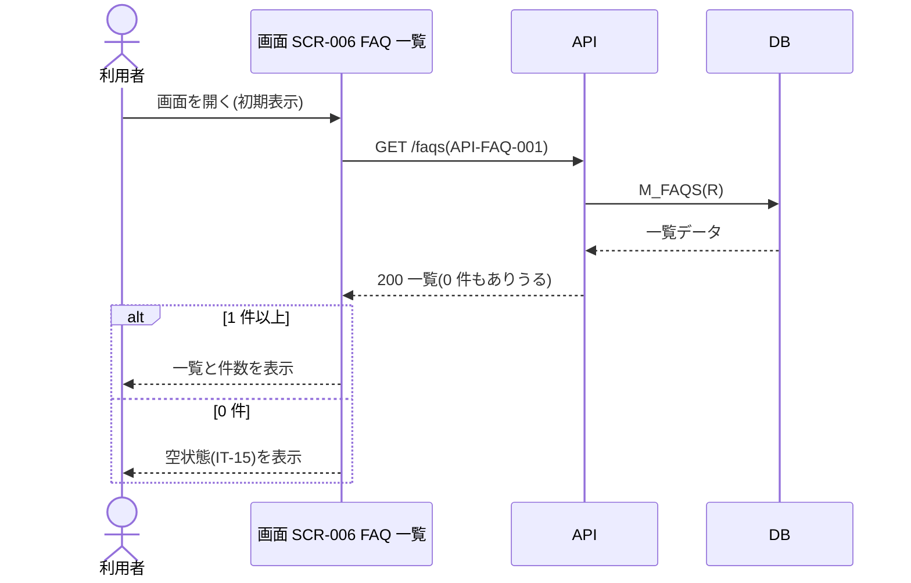
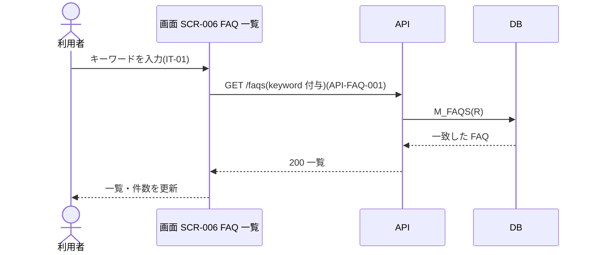
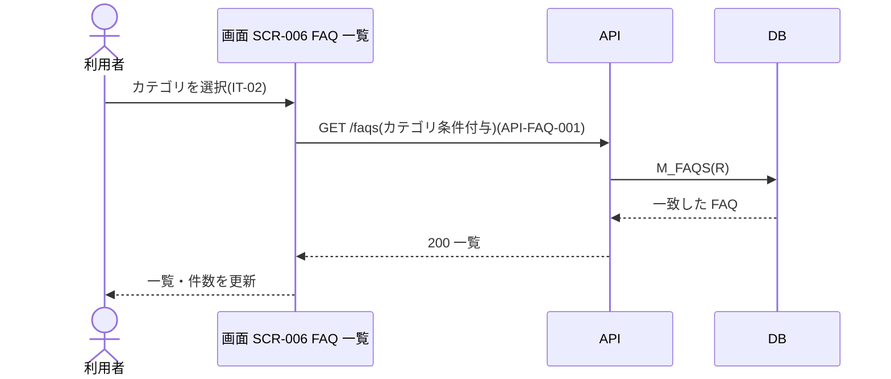
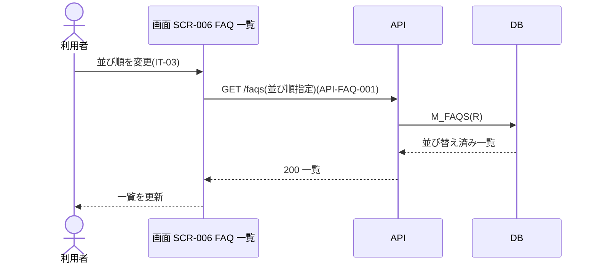
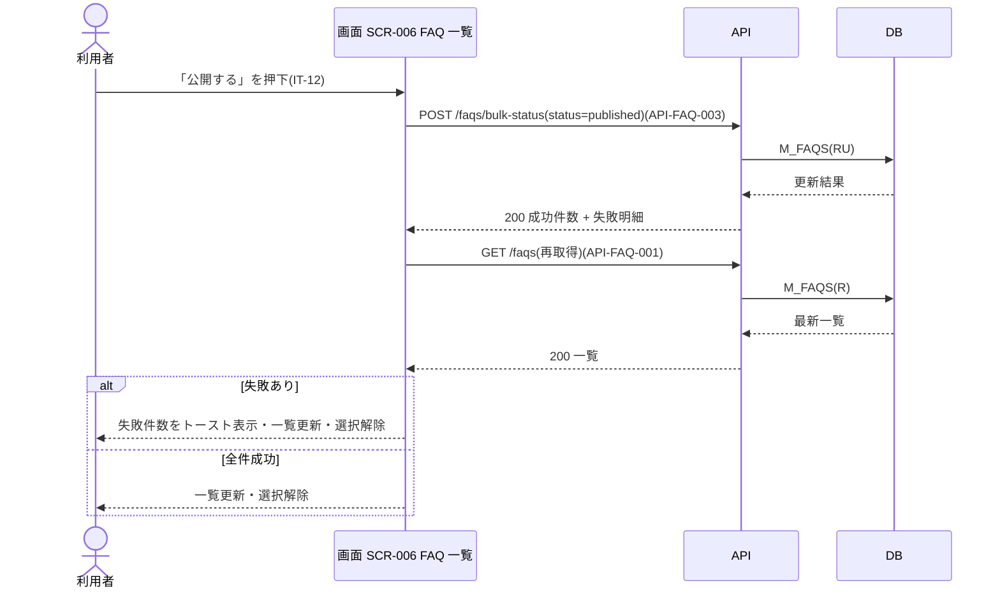
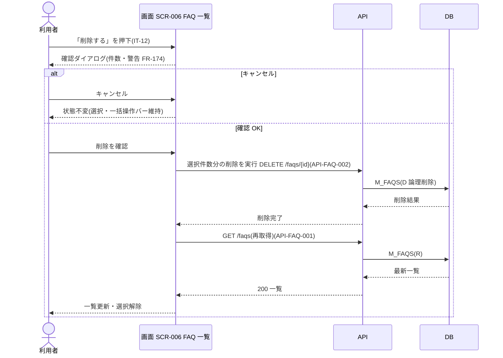
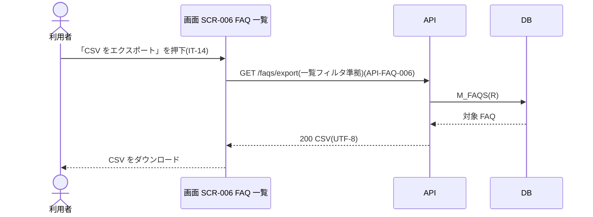

<!-- portal-top -->
[設計ポータル](../../README.md) ／ [要件定義](../index.md) ／ [業務ユースケース](index.md) ／ **UC-SCR-006: FAQ 一覧 ユースケース**
<!-- /portal-top -->

# UC-SCR-006: FAQ 一覧 ユースケース

> **このページは、画面 SCR-006(FAQ 一覧)の画面イベント EV-01〜EV-14 に対応する 14 のユースケースを「1 イベント = 1 ユースケース」で定義します。**

*版数 v1.0 ・ 更新 2026-06-21 ・ ユースケース 14 ・ ステータス ドラフト*

## 0. イベント↔ユースケース対応表

画面 [SCR-006](../../02_basic_design/01_screens/SCR-006.md#SCR-006) の §6 画面イベント一覧(EV-01〜EV-14)を、ユースケース ID へ 1:1 で対応づけます。種別は、サーバ API・DB へアクセスする「API/DB 連携」と、画面内のみで完結する「クライアント内処理のみ」に区別します。

| イベント ID | イベント名 | ユースケース ID | 種別 |
|----|----|----|----|
| `EV-01` | 初期表示 | [UC-SCR-006-EV01](#UC-SCR-006-EV01) | API/DB 連携 |
| `EV-02` | キーワードを入力 | [UC-SCR-006-EV02](#UC-SCR-006-EV02) | API/DB 連携 |
| `EV-03` | カテゴリを選択 | [UC-SCR-006-EV03](#UC-SCR-006-EV03) | API/DB 連携 |
| `EV-04` | 並び順を変更 | [UC-SCR-006-EV04](#UC-SCR-006-EV04) | API/DB 連携 |
| `EV-05` | 行を選択 | [UC-SCR-006-EV05](#UC-SCR-006-EV05) | クライアント内処理のみ |
| `EV-06` | 「+ 新規作成」を押下 | [UC-SCR-006-EV06](#UC-SCR-006-EV06) | クライアント内処理のみ |
| `EV-07` | FAQ ID リンクを押下 | [UC-SCR-006-EV07](#UC-SCR-006-EV07) | クライアント内処理のみ |
| `EV-08` | 「公開する」を押下 | [UC-SCR-006-EV08](#UC-SCR-006-EV08) | API/DB 連携 |
| `EV-09` | 「非公開化する」を押下 | [UC-SCR-006-EV09](#UC-SCR-006-EV09) | API/DB 連携 |
| `EV-10` | 「削除する」を押下 | [UC-SCR-006-EV10](#UC-SCR-006-EV10) | API/DB 連携 |
| `EV-11` | 「選択を解除」を押下 | [UC-SCR-006-EV11](#UC-SCR-006-EV11) | クライアント内処理のみ |
| `EV-12` | 「CSV をインポート」を押下 | [UC-SCR-006-EV12](#UC-SCR-006-EV12) | クライアント内処理のみ |
| `EV-13` | 「CSV をエクスポート」を押下 | [UC-SCR-006-EV13](#UC-SCR-006-EV13) | API/DB 連携 |
| `EV-14` | 空状態の「+ 新規作成」を押下 | [UC-SCR-006-EV14](#UC-SCR-006-EV14) | クライアント内処理のみ |

## 1. ユースケース定義

### UC-SCR-006-EV01 初期表示

> FAQ 一覧画面を開いたとき、当該プロジェクトの FAQ 一覧を取得して表示し、0 件のときは作成を促す空状態を表示します。

| 項目 | 内容 |
|----|----|
| 利用者 | オーナー / 当該プロジェクトのメンバー |
| 事前条件 | ログイン済みで、当該プロジェクトへの割当がある |
| トリガー | 画面 SCR-006 を開く(初期表示) |
| 事後条件 | 取得結果を一覧表示する。0 件のときは IT-15 の空状態を表示する |
| 関連 | [SCR-006](../../02_basic_design/01_screens/SCR-006.md#SCR-006) ・ [API-FAQ-001](../../02_basic_design/03_apis/API-faq.md#API-FAQ-001) |

基本フロー

1. 利用者が FAQ 一覧画面を開く。
2. 画面は当該プロジェクトを条件に FAQ 一覧 API を呼び出す。
3. API は認証・認可を検証し、フィルタ条件で FAQ を取得して返す。
4. 1 件以上のとき、画面は FAQ を一覧表示し、件数表示(IT-09)を更新する。
5. 0 件のとき、画面は IT-15 の空状態(EmptyState)を表示する。

異常系フロー

- 認可エラー(403): 当該プロジェクトへの権限がない場合、権限不足を表示する。
- 取得失敗: 一覧を表示せず、エラートーストを表示する。

### UC-SCR-006-EV02 キーワードを入力

> キーワードを入力すると、その条件を付与して FAQ 一覧を再取得し、一覧を更新します。

| 項目 | 内容 |
|----|----|
| 利用者 | オーナー / 当該プロジェクトのメンバー |
| 事前条件 | FAQ 一覧画面を表示している |
| トリガー | キーワード検索(IT-01)に入力する |
| 事後条件 | キーワード条件に一致する FAQ で一覧を更新する |
| 関連 | [SCR-006](../../02_basic_design/01_screens/SCR-006.md#SCR-006) ・ [API-FAQ-001](../../02_basic_design/03_apis/API-faq.md#API-FAQ-001) |

基本フロー

1. 利用者がキーワード検索(IT-01)にキーワードを入力する。
2. 画面はキーワードを付与して FAQ 一覧 API を再取得する。
3. API は条件に一致する FAQ を取得して返す。
4. 画面は一覧と件数表示(IT-09)を更新する。0 件のときは空状態(IT-15)を表示する。

異常系フロー

- 取得失敗: 一覧を更新せず、エラートーストを表示する。

> [!NOTE]
> キーワード検索の全文検索方式・`TP_FAQ_FTS` の参照は §6 記載に従い API-FAQ-001 経由で扱う。全文検索の連動はシステム側(UC-SYSTEM)で定義する。

### UC-SCR-006-EV03 カテゴリを選択

> カテゴリを選択すると、その条件を付与して FAQ 一覧を再取得し、一覧を更新します。

| 項目 | 内容 |
|----|----|
| 利用者 | オーナー / 当該プロジェクトのメンバー |
| 事前条件 | FAQ 一覧画面を表示している |
| トリガー | カテゴリフィルタ(IT-02)を選択する |
| 事後条件 | 選択カテゴリに一致する FAQ で一覧を更新する |
| 関連 | [SCR-006](../../02_basic_design/01_screens/SCR-006.md#SCR-006) ・ [API-FAQ-001](../../02_basic_design/03_apis/API-faq.md#API-FAQ-001) |

基本フロー

1. 利用者がカテゴリフィルタ(IT-02)でカテゴリを選択する。
2. 画面はカテゴリ条件を付与して FAQ 一覧 API を再取得する。
3. API は条件に一致する FAQ を取得して返す。
4. 画面は一覧と件数表示(IT-09)を更新する。0 件のときは空状態(IT-15)を表示する。

異常系フロー

- 取得失敗: 一覧を更新せず、エラートーストを表示する。

### UC-SCR-006-EV04 並び順を変更

> 並び順を変更すると、指定した並び順で FAQ 一覧を再取得し、一覧を更新します。

| 項目 | 内容 |
|----|----|
| 利用者 | オーナー / 当該プロジェクトのメンバー |
| 事前条件 | FAQ 一覧画面を表示している |
| トリガー | 並び順(IT-03)を変更する(関連度 / 更新日時 / 作成日時) |
| 事後条件 | 指定した並び順で一覧を更新する |
| 関連 | [SCR-006](../../02_basic_design/01_screens/SCR-006.md#SCR-006) ・ [API-FAQ-001](../../02_basic_design/03_apis/API-faq.md#API-FAQ-001) |

基本フロー

1. 利用者が並び順(IT-03)を選択する。
2. 画面は指定した並び順で FAQ 一覧 API を再取得する。
3. API は指定の並び順で FAQ を取得して返す。
4. 画面は一覧を並び替えて更新する。

異常系フロー

- 取得失敗: 並び順を変更せず、エラートーストを表示する。

### UC-SCR-006-EV05 行を選択

> 一覧の行を選択して一括操作の対象を決め、選択状況に応じて一括操作バーの表示を切り替えます(クライアント内処理のみ)。

| 項目 | 内容 |
|----|----|
| 利用者 | オーナー / 当該プロジェクトのメンバー |
| 事前条件 | FAQ 一覧を表示している |
| トリガー | 行選択チェックボックス(IT-10)を操作する |
| 事後条件 | 選択件数を「{件数} 件選択中」で表示し、1 件以上選択時は一括操作バー(IT-12)を表示、0 件で非表示にする |
| 関連 | [SCR-006](../../02_basic_design/01_screens/SCR-006.md#SCR-006) ・ [FR-173](../01_specifications/FR-173.md#FR-173) |

基本フロー

1. 利用者が行選択チェックボックス(IT-10)にチェックを入れ、対象 FAQ を選択状態にする。
2. 1 件以上選択されたとき、画面は一括操作バー(IT-12)を下部に表示し、選択件数を表示する。
3. チェックを外すと選択を解除し、選択が 0 件になったとき一括操作バーを非表示にする。

異常系フロー

- 上限超過: 既に 50 件(FR-173)選択済みのとき、追加選択を受け付けずその旨を表示する。

### UC-SCR-006-EV06 「+ 新規作成」を押下

> 「+ 新規作成」を押下し、FAQ 編集画面を新規モードで開きます(クライアント内処理のみ)。

| 項目 | 内容 |
|----|----|
| 利用者 | オーナー / 当該プロジェクトのメンバー |
| 事前条件 | FAQ 一覧を表示している |
| トリガー | 新規作成(IT-11)を押下する |
| 事後条件 | FAQ 編集画面(SCR-006-001)を新規モードで開く |
| 関連 | [SCR-006](../../02_basic_design/01_screens/SCR-006.md#SCR-006) ・ [SCR-006-001](../../02_basic_design/01_screens/SCR-006-001.md#SCR-006-001) |

基本フロー

1. 利用者が新規作成(IT-11)を押下する。
2. 画面は FAQ 編集画面(SCR-006-001)を新規モードで開く。

異常系フロー

- なし(画面遷移のみ)。

### UC-SCR-006-EV07 FAQ ID リンクを押下

> FAQ ID リンクを押下し、当該 FAQ を FAQ 編集画面で編集モードに開きます(クライアント内処理のみ)。

| 項目 | 内容 |
|----|----|
| 利用者 | オーナー / 当該プロジェクトのメンバー |
| 事前条件 | FAQ 一覧に対象 FAQ が表示されている |
| トリガー | FAQ ID(IT-04)のリンクを押下する |
| 事後条件 | FAQ 編集画面(SCR-006-001)を編集モードで開く |
| 関連 | [SCR-006](../../02_basic_design/01_screens/SCR-006.md#SCR-006) ・ [SCR-006-001](../../02_basic_design/01_screens/SCR-006-001.md#SCR-006-001) |

基本フロー

1. 利用者が FAQ ID(IT-04)のリンクを押下する。
2. 画面は対象 FAQ ID を引き継ぎ、FAQ 編集画面(SCR-006-001)を編集モードで開く。

異常系フロー

- なし(画面遷移のみ。対象 FAQ の取得・権限検証は遷移先 SCR-006-001 で行う)。

### UC-SCR-006-EV08 「公開する」を押下

> 選択中の FAQ を一括状態変更 API で一括公開し、成功時は一覧を再取得して選択を解除します。

| 項目 | 内容 |
|----|----|
| 利用者 | オーナー / 当該プロジェクトのメンバー |
| 事前条件 | 1 件以上の FAQ を選択し、一括操作バー(IT-12)を表示している |
| トリガー | 一括操作バーの「公開する」を押下する |
| 事後条件 | 対象 FAQ を `published` に変更する。一覧を再取得し、選択を解除する |
| 関連 | [SCR-006](../../02_basic_design/01_screens/SCR-006.md#SCR-006) ・ [API-FAQ-003](../../02_basic_design/03_apis/API-faq.md#API-FAQ-003) ・ [API-FAQ-001](../../02_basic_design/03_apis/API-faq.md#API-FAQ-001) |

基本フロー

1. 利用者が一括操作バーの「公開する」を押下する。
2. 画面は選択中の FAQ ID 群と `status=published` を一括状態変更 API に渡す。
3. API は件数上限・状態値を検証し、各 ID を行単位で評価して状態を変更する。
4. API は成功件数と失敗明細を返す。
5. 画面は一覧を再取得して表示を更新し、選択を解除する。

異常系フロー

- 部分失敗(成功 N / 失敗 M): 失敗件数と理由をトースト通知で表示する。成功分を反映するため一覧を再取得し、選択を解除する。
- 件数上限超過 / 不正な状態値(400): エラートーストを表示し、選択を保持する。
- 認可エラー(403): 権限不足を表示し、状態を変更しない。

> [!NOTE]
> 一括状態変更後の `TP_FAQ_FTS` 連動更新・一覧キャッシュ無効化はシステム側の副作用であり、本 UC では扱わない(実体は UC-SYSTEM)。

### UC-SCR-006-EV09 「非公開化する」を押下

> 選択中の FAQ を一括状態変更 API で一括非公開化し、成功時は一覧を再取得して選択を解除します。

| 項目 | 内容 |
|----|----|
| 利用者 | オーナー / 当該プロジェクトのメンバー |
| 事前条件 | 1 件以上の FAQ を選択し、一括操作バー(IT-12)を表示している |
| トリガー | 一括操作バーの「非公開化する」を押下する |
| 事後条件 | 対象 FAQ を `hidden` に変更する。一覧を再取得し、選択を解除する |
| 関連 | [SCR-006](../../02_basic_design/01_screens/SCR-006.md#SCR-006) ・ [API-FAQ-003](../../02_basic_design/03_apis/API-faq.md#API-FAQ-003) ・ [API-FAQ-001](../../02_basic_design/03_apis/API-faq.md#API-FAQ-001) |

基本フロー

1. 利用者が一括操作バーの「非公開化する」を押下する。
2. 画面は選択中の FAQ ID 群と `status=hidden` を一括状態変更 API に渡す。
3. API は件数上限・状態値を検証し、各 ID を行単位で評価して状態を変更する。
4. API は成功件数と失敗明細を返す。
5. 画面は一覧を再取得して表示を更新し、選択を解除する。

異常系フロー

- 部分失敗(成功 N / 失敗 M): 失敗件数と理由をトースト通知で表示する。成功分を反映するため一覧を再取得し、選択を解除する。
- 件数上限超過 / 不正な状態値(400): エラートーストを表示し、選択を保持する。
- 認可エラー(403): 権限不足を表示し、状態を変更しない。

> [!NOTE]
> 一括状態変更後の `TP_FAQ_FTS` 連動更新・一覧キャッシュ無効化はシステム側の副作用であり、本 UC では扱わない(実体は UC-SYSTEM)。

### UC-SCR-006-EV10 「削除する」を押下

> 選択中の FAQ を、確認ダイアログの承認後に論理削除し、成功時は一覧を再取得して選択を解除します。

| 項目 | 内容 |
|----|----|
| 利用者 | オーナー / 当該プロジェクトのメンバー |
| 事前条件 | 1 件以上の FAQ を選択し、一括操作バー(IT-12)を表示している |
| トリガー | 一括操作バーの「削除する」を押下する |
| 事後条件 | 確認後、選択中 FAQ を論理削除する。一覧を再取得し、選択を解除する |
| 関連 | [SCR-006](../../02_basic_design/01_screens/SCR-006.md#SCR-006) ・ [API-FAQ-002](../../02_basic_design/03_apis/API-faq.md#API-FAQ-002) ・ [API-FAQ-001](../../02_basic_design/03_apis/API-faq.md#API-FAQ-001) ・ [FR-174](../01_specifications/FR-174.md#FR-174) |

基本フロー

1. 利用者が一括操作バーの「削除する」を押下する。
2. 画面は確認ダイアログを表示し、削除対象件数と「削除すると復元できません」の警告を示す(FR-174)。
3. 利用者が確認(OK)する。
4. 画面は選択中の各 FAQ ID に対して FAQ 削除(DELETE)を実行し、選択件数分の論理削除を行う。
5. 画面は一覧を再取得して表示を更新し、選択を解除する。

異常系フロー

- ダイアログをキャンセル: 削除を実行せず、選択状態と一括操作バーを維持する(画面状態は不変)。
- 削除失敗: エラートーストを表示する。

> [!NOTE]
> 一括削除専用 API は未定義のため、各 FAQ ID に対する FAQ 削除(API-FAQ-002 の DELETE)を選択件数分実行する。図は「選択件数分の削除を実行」と 1 段に抽象化し、ループは展開しない。削除後の `TP_FAQ_FTS` 連動更新・一覧キャッシュ無効化はシステム側の副作用であり、本 UC では扱わない(実体は UC-SYSTEM)。

### UC-SCR-006-EV11 「選択を解除」を押下

> 「選択を解除」を押下し、全選択を解除して一括操作バーを非表示にします(クライアント内処理のみ)。

| 項目 | 内容 |
|----|----|
| 利用者 | オーナー / 当該プロジェクトのメンバー |
| 事前条件 | 1 件以上の FAQ を選択し、一括操作バー(IT-12)を表示している |
| トリガー | 一括操作バーの「選択を解除」を押下する |
| 事後条件 | 全選択を解除し、一括操作バーを非表示にする |
| 関連 | [SCR-006](../../02_basic_design/01_screens/SCR-006.md#SCR-006) |

基本フロー

1. 利用者が「選択を解除」を押下する。
2. 画面は全 FAQ の選択を解除する。
3. 選択が 0 件になるため、画面は一括操作バー(IT-12)を非表示にする。

異常系フロー

- なし(クライアント内処理のみ)。

### UC-SCR-006-EV12 「CSV をインポート」を押下

> 「CSV をインポート」を押下し、CSV インポートモーダルを開きます(クライアント内処理のみ)。

| 項目 | 内容 |
|----|----|
| 利用者 | オーナー / 当該プロジェクトのメンバー |
| 事前条件 | FAQ 一覧を表示している |
| トリガー | CSV をインポート(IT-13)を押下する |
| 事後条件 | CSV インポートモーダル(SCR-006-002)を開く |
| 関連 | [SCR-006](../../02_basic_design/01_screens/SCR-006.md#SCR-006) ・ [SCR-006-002](../../02_basic_design/01_screens/SCR-006-002.md#SCR-006-002) |

基本フロー

1. 利用者が CSV をインポート(IT-13)を押下する。
2. 画面は CSV インポートモーダル(SCR-006-002)を開く。

異常系フロー

- なし(モーダル起動のみ。CSV 取込処理はモーダル SCR-006-002 で行う)。

### UC-SCR-006-EV13 「CSV をエクスポート」を押下

> 「CSV をエクスポート」を押下し、一覧フィルタ適用結果を CSV として取得してダウンロードします。

| 項目 | 内容 |
|----|----|
| 利用者 | オーナー / 当該プロジェクトのメンバー |
| 事前条件 | FAQ 一覧を表示している |
| トリガー | CSV をエクスポート(IT-14)を押下する |
| 事後条件 | フィルタ適用結果の CSV をダウンロードする |
| 関連 | [SCR-006](../../02_basic_design/01_screens/SCR-006.md#SCR-006) ・ [API-FAQ-006](../../02_basic_design/03_apis/API-faq.md#API-FAQ-006) |

基本フロー

1. 利用者が CSV をエクスポート(IT-14)を押下する。
2. 画面は現在の一覧フィルタ条件で CSV エクスポート API を呼び出す。
3. API は同じフィルタ条件で対象 FAQ を取得し、CSV(UTF-8)に整形して返す。
4. 画面は CSV をダウンロードとして保存する。

異常系フロー

- エクスポート失敗: ダウンロードを行わず、エラートーストを表示する。

> [!NOTE]
> 大規模時のバッチ化(非同期ダウンロード)は将来対応とし、本 UC は同期ダウンロードを前提とする。

### UC-SCR-006-EV14 空状態の「+ 新規作成」を押下

> 空状態(IT-15)の「+ 新規作成」を押下し、FAQ 編集画面を新規モードで開きます(クライアント内処理のみ)。

| 項目 | 内容 |
|----|----|
| 利用者 | オーナー / 当該プロジェクトのメンバー |
| 事前条件 | FAQ が 0 件で、空状態(IT-15)を表示している |
| トリガー | 空状態の「+ 新規作成」(IT-15)を押下する |
| 事後条件 | FAQ 編集画面(SCR-006-001)を新規モードで開く |
| 関連 | [SCR-006](../../02_basic_design/01_screens/SCR-006.md#SCR-006) ・ [SCR-006-001](../../02_basic_design/01_screens/SCR-006-001.md#SCR-006-001) |

本ユースケースの処理は [UC-SCR-006-EV06](#UC-SCR-006-EV06)(「+ 新規作成」を押下)と同一です。トリガーが空状態ボタン(IT-15)である点のみが異なります。基本フロー・異常系フローは UC-SCR-006-EV06 を参照してください。

---

<!-- portal-bottom -->
[← 業務ユースケース](index.md) ・ [要件定義](../index.md) ・ [↑ 設計ポータル](../../README.md)
<!-- /portal-bottom -->
