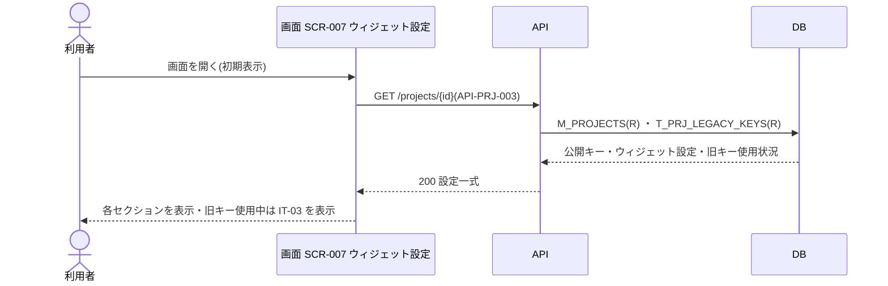
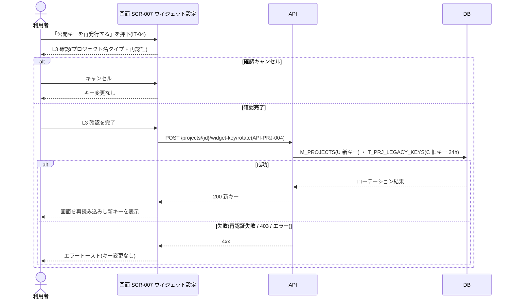
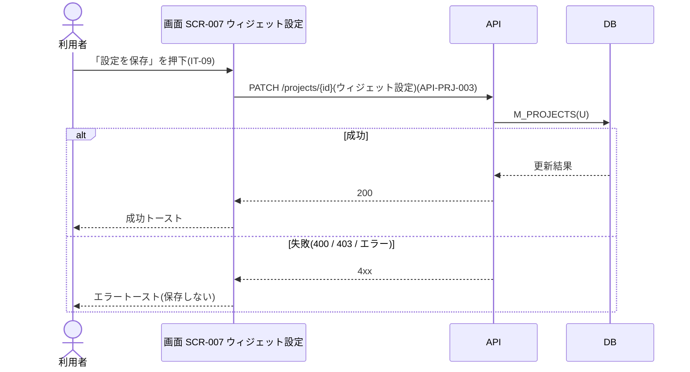

<!-- portal-top -->
[設計ポータル](../../README.md) ／ [要件定義](../index.md) ／ [業務ユースケース](index.md) ／ **UC-SCR-007: ウィジェット設定 ユースケース**
<!-- /portal-top -->

# UC-SCR-007: ウィジェット設定 ユースケース

> **このページは、画面 SCR-007(ウィジェット設定)の画面イベント EV-01〜EV-11 に対応する 11 のユースケースを「1 イベント = 1 ユースケース」で定義します。**

*版数 v1.0 ・ 更新 2026-06-21 ・ ユースケース 11 ・ ステータス ドラフト*

## 0. イベント↔ユースケース対応表

画面 [SCR-007](../../02_basic_design/01_screens/SCR-007.md#SCR-007) の §6 画面イベント一覧(EV-01〜EV-11)を、ユースケース ID へ 1:1 で対応づけます。種別は、サーバ API・DB へアクセスする「API/DB 連携」と、画面内のみで完結する「クライアント内処理のみ」に区別します。

| イベント ID | イベント名 | ユースケース ID | 種別 |
|----|----|----|----|
| `EV-01` | 初期表示 | [UC-SCR-007-EV01](#UC-SCR-007-EV01) | API/DB 連携 |
| `EV-02` | 「コピー」を押下(公開キー) | [UC-SCR-007-EV02](#UC-SCR-007-EV02) | クライアント内処理のみ |
| `EV-03` | 「コードをコピー」を押下(埋め込みコード) | [UC-SCR-007-EV03](#UC-SCR-007-EV03) | クライアント内処理のみ |
| `EV-04` | テーマカラーを選択 | [UC-SCR-007-EV04](#UC-SCR-007-EV04) | クライアント内処理のみ |
| `EV-05` | 主色(HEX)を入力 | [UC-SCR-007-EV05](#UC-SCR-007-EV05) | クライアント内処理のみ |
| `EV-06` | 表示位置を選択 | [UC-SCR-007-EV06](#UC-SCR-007-EV06) | クライアント内処理のみ |
| `EV-07` | 見出しを入力 | [UC-SCR-007-EV07](#UC-SCR-007-EV07) | クライアント内処理のみ |
| `EV-08` | 初期メッセージを入力 | [UC-SCR-007-EV08](#UC-SCR-007-EV08) | クライアント内処理のみ |
| `EV-09` | 「公開キーを再発行する」を押下 | [UC-SCR-007-EV09](#UC-SCR-007-EV09) | API/DB 連携 |
| `EV-10` | 「設定を保存」を押下 | [UC-SCR-007-EV10](#UC-SCR-007-EV10) | API/DB 連携 |
| `EV-11` | 「概要」を押下 | [UC-SCR-007-EV11](#UC-SCR-007-EV11) | クライアント内処理のみ |

## 1. ユースケース定義

### UC-SCR-007-EV01 初期表示

> ウィジェット設定画面を開いたとき、当該プロジェクトの公開キー・ウィジェット設定・埋め込みコードを取得して各セクションへ表示し、旧キー使用検知時はバッジを表示します。

| 項目 | 内容 |
|----|----|
| 利用者 | オーナー / 当該プロジェクトのメンバー |
| 事前条件 | ログイン済みで、当該プロジェクトへの割当がある |
| トリガー | 画面 SCR-007 を開く(初期表示) |
| 事後条件 | 公開キー(IT-02)・主色(IT-05)・表示位置(IT-10)・見出し(IT-11)・初期メッセージ(IT-12)・埋め込みコード(IT-08)を表示する。ローテーション猶予中に旧キー使用を検知している場合は旧キー使用中バッジ(IT-03)を表示する |
| 関連 | [SCR-007](../../02_basic_design/01_screens/SCR-007.md#SCR-007) ・ [API-PRJ-003](../../02_basic_design/03_apis/API-project.md#API-PRJ-003) ・ [FR-020](../FR03.md#FR-020) |

基本フロー

1. 利用者がウィジェット設定画面を開く。
2. 画面は当該プロジェクトを条件にプロジェクト取得 API を呼び出す。
3. API は認証・認可を検証し、公開キー・ウィジェット設定(主色・表示位置・見出し・初期メッセージ等)を取得して返す。
4. 画面は各セクション(IT-02 / IT-05 / IT-08 / IT-10 / IT-11 / IT-12)へ値を展開し、プレビュー(IT-06)へ反映する。
5. ローテーション猶予中に旧キー使用を検知している場合、画面は旧キー使用中バッジ(IT-03)を表示する。

異常系フロー

- 認可エラー(403): 当該プロジェクトへの割当がない場合、権限不足を表示する。
- 取得失敗: 設定を表示せず、エラートーストを表示する。

### UC-SCR-007-EV02 「コピー」を押下(公開キー)

> 公開キーの「コピー」を押下し、公開キーをクリップボードへコピーします(クライアント内処理のみ)。

| 項目 | 内容 |
|----|----|
| 利用者 | オーナー / 当該プロジェクトのメンバー |
| 事前条件 | ウィジェット設定画面を表示し、公開キー(IT-02)が表示されている |
| トリガー | 公開キーの「コピー」(IT-02)を押下する |
| 事後条件 | 公開キーをクリップボードへコピーし、緑チェック + トーストを表示する |
| 関連 | [SCR-007](../../02_basic_design/01_screens/SCR-007.md#SCR-007) |

基本フロー

1. 利用者が公開キーの「コピー」(IT-02)を押下する。
2. 画面は公開キーをクリップボードへコピーし、緑チェック + 成功トーストを表示する。

異常系フロー

- コピー失敗: コピー失敗のトーストを表示する。

クライアント内処理のみのため、シーケンス図は省略します。

### UC-SCR-007-EV03 「コードをコピー」を押下(埋め込みコード)

> 埋め込みコードの「コードをコピー」を押下し、埋め込みコード全文をクリップボードへコピーします(クライアント内処理のみ)。

| 項目 | 内容 |
|----|----|
| 利用者 | オーナー / 当該プロジェクトのメンバー |
| 事前条件 | ウィジェット設定画面を表示し、埋め込みコード(IT-08)が表示されている |
| トリガー | 埋め込みコードのコピーアイコン(IT-08)を押下する |
| 事後条件 | 埋め込みコード全文をクリップボードへコピーし、成功トーストを表示する |
| 関連 | [SCR-007](../../02_basic_design/01_screens/SCR-007.md#SCR-007) |

基本フロー

1. 利用者が埋め込みコードのコピーアイコン(IT-08)を押下する。
2. 画面は埋め込みコード全文をクリップボードへコピーし、成功トーストを表示する。

異常系フロー

- コピー失敗: コピー失敗のトーストを表示する。

クライアント内処理のみのため、シーケンス図は省略します。

### UC-SCR-007-EV04 テーマカラーを選択

> プリセット色スウォッチをクリックして主色を選択し、プレビューにリアルタイム反映します(クライアント内処理のみ)。

| 項目 | 内容 |
|----|----|
| 利用者 | オーナー / 当該プロジェクトのメンバー |
| 事前条件 | ウィジェット設定画面を表示している |
| トリガー | プリセット色スウォッチ(IT-05)を選択する |
| 事後条件 | 選択した主色を保持し、プレビュー(IT-06)へリアルタイム反映する(保存は EV-10 で行う) |
| 関連 | [SCR-007](../../02_basic_design/01_screens/SCR-007.md#SCR-007) |

基本フロー

1. 利用者がプリセット色スウォッチ(IT-05)をクリックして主色を選択する。
2. 画面は選択値を保持し、プレビュー(IT-06)へリアルタイム反映する。

異常系フロー

- なし(クライアント内処理のみ。保存は EV-10 で扱う)。

クライアント内処理のみのため、シーケンス図は省略します。

### UC-SCR-007-EV05 主色(HEX)を入力

> HEX 値テキストボックスに主色を直接入力し、プレビューにリアルタイム反映します(クライアント内処理のみ)。

| 項目 | 内容 |
|----|----|
| 利用者 | オーナー / 当該プロジェクトのメンバー |
| 事前条件 | ウィジェット設定画面を表示している |
| トリガー | HEX 値テキストボックス(IT-05)へ入力する |
| 事後条件 | 入力した HEX 値を保持し、プレビュー(IT-06)へリアルタイム反映する(保存は EV-10 で行う) |
| 関連 | [SCR-007](../../02_basic_design/01_screens/SCR-007.md#SCR-007) |

基本フロー

1. 利用者が HEX 値テキストボックス(IT-05)へ主色を直接入力する。
2. 画面は入力値を保持し、プレビュー(IT-06)へリアルタイム反映する。

異常系フロー

- HEX 形式不正: プレビューへ反映せず、入力欄に形式エラーを表示する(保存は EV-10 の検証で扱う)。

クライアント内処理のみのため、シーケンス図は省略します。

### UC-SCR-007-EV06 表示位置を選択

> 「左下」または「右下」を選択して表示位置を決め、プレビューにリアルタイム反映します(クライアント内処理のみ)。

| 項目 | 内容 |
|----|----|
| 利用者 | オーナー / 当該プロジェクトのメンバー |
| 事前条件 | ウィジェット設定画面を表示している |
| トリガー | 表示位置トグル(IT-10)で「左下」「右下」を選択する |
| 事後条件 | 選択した表示位置を保持し、プレビュー(IT-06)へリアルタイム反映する(保存は EV-10 で行う) |
| 関連 | [SCR-007](../../02_basic_design/01_screens/SCR-007.md#SCR-007) |

基本フロー

1. 利用者が表示位置トグル(IT-10)で「左下」または「右下」を選択する。
2. 画面は選択値を保持し、プレビュー(IT-06)へリアルタイム反映する。

異常系フロー

- なし(クライアント内処理のみ)。

クライアント内処理のみのため、シーケンス図は省略します。

### UC-SCR-007-EV07 見出しを入力

> 見出しテキストボックスに文言を入力し、プレビューにリアルタイム反映します(クライアント内処理のみ)。

| 項目 | 内容 |
|----|----|
| 利用者 | オーナー / 当該プロジェクトのメンバー |
| 事前条件 | ウィジェット設定画面を表示している |
| トリガー | 見出しテキストボックス(IT-11)へ入力する |
| 事後条件 | 入力した見出し文言を保持し、プレビュー(IT-06)へリアルタイム反映する(保存は EV-10 で行う) |
| 関連 | [SCR-007](../../02_basic_design/01_screens/SCR-007.md#SCR-007) |

基本フロー

1. 利用者が見出しテキストボックス(IT-11)へ文言を入力する。
2. 画面は入力値を保持し、プレビュー(IT-06)へリアルタイム反映する。

異常系フロー

- なし(クライアント内処理のみ)。

クライアント内処理のみのため、シーケンス図は省略します。

### UC-SCR-007-EV08 初期メッセージを入力

> 初期メッセージテキストエリアに文言を入力し、プレビューにリアルタイム反映します(クライアント内処理のみ)。

| 項目 | 内容 |
|----|----|
| 利用者 | オーナー / 当該プロジェクトのメンバー |
| 事前条件 | ウィジェット設定画面を表示している |
| トリガー | 初期メッセージテキストエリア(IT-12)へ入力する |
| 事後条件 | 入力した初期メッセージを保持し、プレビュー(IT-06)へリアルタイム反映する(保存は EV-10 で行う) |
| 関連 | [SCR-007](../../02_basic_design/01_screens/SCR-007.md#SCR-007) |

基本フロー

1. 利用者が初期メッセージテキストエリア(IT-12)へ文言を入力する。
2. 画面は入力値を保持し、プレビュー(IT-06)へリアルタイム反映する。

異常系フロー

- なし(クライアント内処理のみ)。

クライアント内処理のみのため、シーケンス図は省略します。

### UC-SCR-007-EV09 「公開キーを再発行する」を押下

> 公開キーの再発行(ローテーション)を、L3 確認(プロジェクト名タイプ + 再認証)の承認後に実行し、旧キーを 24 時間猶予で失効予告して新キーを表示します。

| 項目 | 内容 |
|----|----|
| 利用者 | オーナー / 当該プロジェクトのメンバー |
| 事前条件 | ウィジェット設定画面を表示している |
| トリガー | 「公開キーを再発行する」(IT-04)を押下する |
| 事後条件 | L3 確認後、新しい公開キーを発行し、旧キーを 24 時間猶予で失効予告する。画面を再読み込みして新キーを表示する。確認キャンセル時・エラー時はキーを変更しない |
| 関連 | [SCR-007](../../02_basic_design/01_screens/SCR-007.md#SCR-007) ・ [API-PRJ-004](../../02_basic_design/03_apis/API-project.md#API-PRJ-004) |

基本フロー

1. 利用者が「公開キーを再発行する」(IT-04)を押下する。
2. 画面は L3 確認(プロジェクト名タイプ + 再認証)ダイアログを表示する。確認文に「既存の埋め込みコードは旧キー失効後に動作しなくなります」を表示する。
3. 利用者が L3 確認を完了する。
4. 画面はウィジェット鍵ローテーション API を呼び出す。
5. API は再認証・認可を検証し、新しい公開キーを発行し、旧キーを 24 時間猶予で失効予告する。
6. 画面を再読み込みして新キーを表示する。

異常系フロー

- 確認キャンセル: ダイアログを閉じ、キーを変更しない。
- 再認証失敗 / 認可エラー(403): エラーを表示し、キーを変更しない。
- API エラー: エラートーストを表示し、キーを変更しない。

### UC-SCR-007-EV10 「設定を保存」を押下

> ウィジェット設定(主色・表示位置・見出し・初期メッセージ等)をプロジェクト更新 API で保存します。

| 項目 | 内容 |
|----|----|
| 利用者 | オーナー / 当該プロジェクトのメンバー |
| 事前条件 | ウィジェット設定画面を表示し、見た目等を編集している |
| トリガー | 「設定を保存」(IT-09)を押下する |
| 事後条件 | 成功時はウィジェット設定を更新し、成功トーストを表示する。失敗時は保存せずエラートーストを表示する |
| 関連 | [SCR-007](../../02_basic_design/01_screens/SCR-007.md#SCR-007) ・ [API-PRJ-003](../../02_basic_design/03_apis/API-project.md#API-PRJ-003) |

基本フロー

1. 利用者が「設定を保存」(IT-09)を押下する。
2. 画面は主色・表示位置・見出し・初期メッセージ等をプロジェクト更新 API に渡す。
3. API は認証・認可・入力を検証し、ウィジェット設定を更新する。
4. 成功時、画面は成功トーストを表示する。

異常系フロー

- 入力エラー(400): エラートーストを表示し、設定を保存しない。
- 認可エラー(403): 権限不足を表示し、設定を保存しない。
- 保存失敗: エラートーストを表示し、設定を保存しない。

> [!NOTE]
> 設定更新後の KV キャッシュ無効化はシステム側の副作用であり、本 UC では扱いません(実体は UC-SYSTEM)。

### UC-SCR-007-EV11 「概要」を押下

> 「概要」を押下し、概要(プロジェクト)画面へ遷移します(クライアント内処理のみ)。

| 項目 | 内容 |
|----|----|
| 利用者 | オーナー / 当該プロジェクトのメンバー |
| 事前条件 | ウィジェット設定画面を表示している |
| トリガー | 「概要」を押下する |
| 事後条件 | 概要(プロジェクト)([SCR-008](../../02_basic_design/01_screens/SCR-008.md#SCR-008))へ遷移する |
| 関連 | [SCR-007](../../02_basic_design/01_screens/SCR-007.md#SCR-007) ・ [SCR-008](../../02_basic_design/01_screens/SCR-008.md#SCR-008) |

基本フロー

1. 利用者が「概要」を押下する。
2. 画面は概要(プロジェクト)([SCR-008](../../02_basic_design/01_screens/SCR-008.md#SCR-008))へ遷移する。

異常系フロー

- なし(画面遷移のみ)。

クライアント内処理のみのため、シーケンス図は省略します。

---

<!-- portal-bottom -->
[← 業務ユースケース](index.md) ・ [要件定義](../index.md) ・ [↑ 設計ポータル](../../README.md)
<!-- /portal-bottom -->
