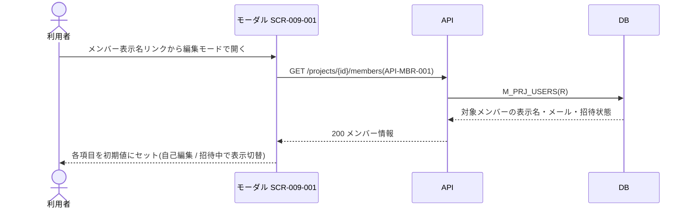
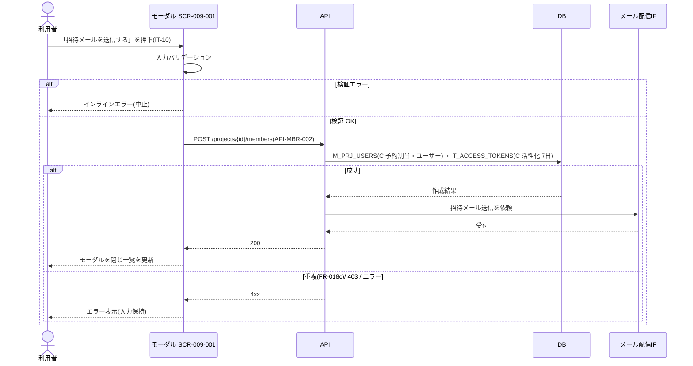
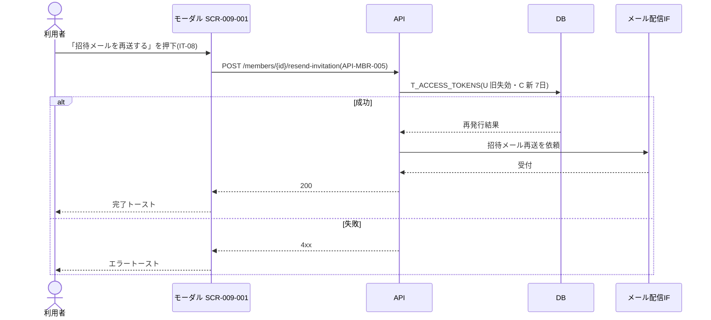
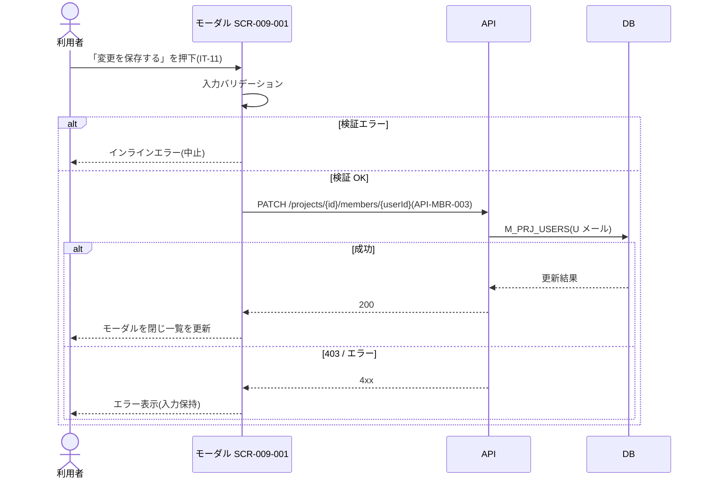
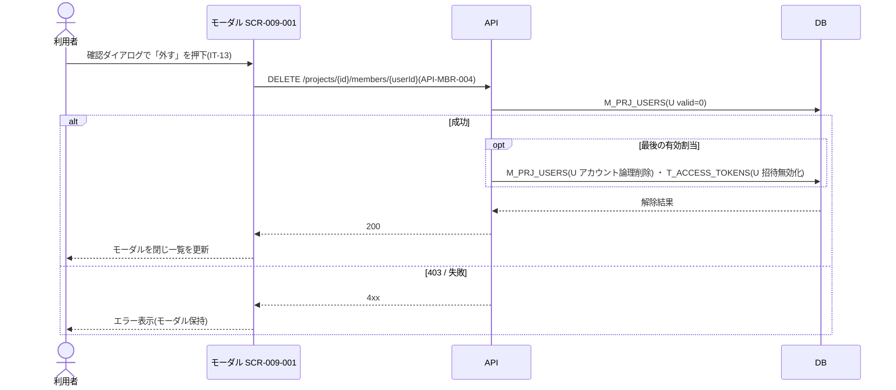

<!-- portal-top -->
[設計ポータル](../../README.md) ／ [要件定義](../index.md) ／ [業務ユースケース](index.md) ／ **UC-SCR-009-001: メンバー招待 / 編集モーダル ユースケース**
<!-- /portal-top -->

# UC-SCR-009-001: メンバー招待 / 編集モーダル ユースケース

> **このページは、画面 SCR-009-001(メンバー招待 / 編集モーダル(プロジェクト単位))の画面イベント EV-01〜EV-10 に対応する 10 のユースケースを「1 イベント = 1 ユースケース」で定義します。**

*版数 v1.0 ・ 更新 2026-06-21 ・ ユースケース 10 ・ ステータス ドラフト*

## 0. イベント↔ユースケース対応表

画面 [SCR-009-001](../../02_basic_design/01_screens/SCR-009-001.md#SCR-009-001) の §6 画面イベント一覧(EV-01〜EV-10)を、ユースケース ID へ 1:1 で対応づけます。種別は、サーバ API・DB へアクセスする「API/DB 連携」と、画面内のみで完結する「クライアント内処理のみ」に区別します。

| イベント ID | イベント名 | ユースケース ID | 種別 |
|----|----|----|----|
| `EV-01` | 初期表示 — 招待モード | [UC-SCR-009-001-EV01](#UC-SCR-009-001-EV01) | クライアント内処理のみ |
| `EV-02` | 初期表示 — 編集モード | [UC-SCR-009-001-EV02](#UC-SCR-009-001-EV02) | API/DB 連携 |
| `EV-03` | メールアドレスを入力 | [UC-SCR-009-001-EV03](#UC-SCR-009-001-EV03) | クライアント内処理のみ |
| `EV-04` | 「招待メールを送信する」を押下 | [UC-SCR-009-001-EV04](#UC-SCR-009-001-EV04) | API/DB 連携 |
| `EV-05` | 「招待メールを再送する」を押下 | [UC-SCR-009-001-EV05](#UC-SCR-009-001-EV05) | API/DB 連携 |
| `EV-06` | 「変更を保存する」を押下 | [UC-SCR-009-001-EV06](#UC-SCR-009-001-EV06) | API/DB 連携 |
| `EV-07` | 「プロジェクトから外す」を押下 | [UC-SCR-009-001-EV07](#UC-SCR-009-001-EV07) | クライアント内処理のみ |
| `EV-08` | 割当解除の確認ダイアログで「外す」を押下 | [UC-SCR-009-001-EV08](#UC-SCR-009-001-EV08) | API/DB 連携 |
| `EV-09` | 「×」を押下してモーダルを閉じる | [UC-SCR-009-001-EV09](#UC-SCR-009-001-EV09) | クライアント内処理のみ |
| `EV-10` | 「キャンセル」を押下 | [UC-SCR-009-001-EV10](#UC-SCR-009-001-EV10) | クライアント内処理のみ |

## 1. ユースケース定義

### UC-SCR-009-001-EV01 初期表示 — 招待モード

> モーダルを招待モードで開いたとき、プロジェクト名付きの見出し・氏名注記を表示し、氏名フィールドは非表示として空のメールアドレス欄を表示します(クライアント内処理のみ)。

| 項目 | 内容 |
|----|----|
| 利用者 | オーナー / 当該プロジェクトのメンバー |
| 事前条件 | SCR-009 で「+ メンバーを招待」を押下し、招待モードでモーダルを開く |
| トリガー | モーダルを招待モードで開く(初期表示) |
| 事後条件 | モード見出し(IT-01)をプロジェクト名付きで表示し、氏名注記(IT-06)を表示する。氏名フィールド(IT-05)は非表示、メールアドレス欄(IT-04)は空欄で表示する |
| 関連 | [SCR-009-001](../../02_basic_design/01_screens/SCR-009-001.md#SCR-009-001) ・ [FR-013d](../FR02.md#FR-013d) |

基本フロー

1. 招待モードでモーダルが開く。
2. 画面はモード見出し(IT-01)をプロジェクト名付きで表示し、氏名注記(IT-06)を表示する。
3. 画面は氏名フィールド(IT-05)を非表示とし、メールアドレス欄(IT-04)を空欄で表示する。

異常系フロー

- なし(クライアント内処理のみ。招待先の氏名は本人が SCR-018 で入力する個人情報原則(FR-013d)による)。

クライアント内処理のみのため、シーケンス図は省略します。

### UC-SCR-009-001-EV02 初期表示 — 編集モード

> モーダルを編集モードで開いたとき、対象メンバーの表示名・メールアドレス・招待状態を取得し、自己編集・招待中の各条件に応じて項目を切り替えて表示します。

| 項目 | 内容 |
|----|----|
| 利用者 | オーナー / 当該プロジェクトのメンバー |
| 事前条件 | SCR-009 でメンバー表示名リンクを押下し、編集モードでモーダルを開く |
| トリガー | モーダルを編集モードで開く(初期表示) |
| 事後条件 | 対象メンバーの表示名(IT-05)・メールアドレス(IT-04)・招待状態を初期値にセットする。自己編集時は自己編集警告帯(IT-03)を表示し「プロジェクトから外す」(IT-09)を非表示にする。招待中時は招待状態バッジ(IT-07)と「招待メールを再送する」(IT-08)を表示する |
| 関連 | [SCR-009-001](../../02_basic_design/01_screens/SCR-009-001.md#SCR-009-001) ・ [API-MBR-001](../../02_basic_design/03_apis/API-member.md#API-MBR-001) |

基本フロー

1. 編集モードでモーダルが開く。
2. 画面はメンバー一覧 API から対象メンバーの表示名・メールアドレス・招待状態を取得する。
3. 画面は各項目に初期値をセットする(IT-04 / IT-05)。
4. 自分自身を編集する場合、画面は自己編集警告帯(IT-03)を表示し、「プロジェクトから外す」(IT-09)を非表示にする。
5. 対象者が招待中(未有効化)の場合、画面は招待状態バッジ(IT-07)と「招待メールを再送する」(IT-08)を表示する。

異常系フロー

- 取得失敗: 初期値をセットできず、エラートーストを表示する。

### UC-SCR-009-001-EV03 メールアドレスを入力

> メールアドレスを入力すると、必須・形式をクライアント側で検証し、失敗時はインラインエラー表示と送信・保存ボタンの無効化を行います(クライアント内処理のみ)。

| 項目 | 内容 |
|----|----|
| 利用者 | オーナー / 当該プロジェクトのメンバー |
| 事前条件 | モーダルを表示している(招待モード / 編集モード) |
| トリガー | メールアドレス欄(IT-04)へ入力する |
| 事後条件 | 妥当時はエラーを消去する。不正時はインラインエラーを表示し、送信・保存ボタンを無効化する |
| 関連 | [SCR-009-001](../../02_basic_design/01_screens/SCR-009-001.md#SCR-009-001) |

基本フロー

1. 利用者がメールアドレス欄(IT-04)へ入力する。
2. 画面は入力のたびにクライアント側バリデーション(必須・メールアドレス形式)を実行する。
3. 妥当な場合、画面はインラインエラーを消去する。

異常系フロー

- 必須未入力・形式不正: 入力欄下にインラインエラーを表示し、送信・保存ボタンを無効化する。

クライアント内処理のみのため、シーケンス図は省略します。

### UC-SCR-009-001-EV04 「招待メールを送信する」を押下

> 招待モードで「招待メールを送信する」を押下し、メンバー招待 API で予約割当・ユーザーを作成して有効化トークンを発行し、招待メールを送信します。

| 項目 | 内容 |
|----|----|
| 利用者 | オーナー / 当該プロジェクトのメンバー |
| 事前条件 | 招待モードで、メールアドレス(IT-04)が妥当に入力されている |
| トリガー | 「招待メールを送信する」(IT-10)を押下する |
| 事後条件 | 成功時は予約割当行とユーザーを作成し、有効化トークン(7 日)を発行して招待メールを送信し、モーダルを閉じて SCR-009 の一覧を更新する。失敗時はモーダルを保持しエラーを表示する |
| 関連 | [SCR-009-001](../../02_basic_design/01_screens/SCR-009-001.md#SCR-009-001) ・ [API-MBR-002](../../02_basic_design/03_apis/API-member.md#API-MBR-002) ・ [FR-018c](../FR02.md#FR-018c) |

基本フロー

1. 利用者が「招待メールを送信する」(IT-10)を押下する。
2. 画面は入力バリデーションを実行し、エラーがあればインラインエラーを表示して処理を中止する。
3. 画面はメンバー招待 API を呼び出す。
4. API は再認証・認可を検証し、予約割当行とユーザーを作成し、有効化トークン(`purpose='activation'`、有効期限 7 日)を発行する。
5. API は招待メール配信を依頼する。
6. 成功時、画面はモーダルを閉じ、SCR-009 の一覧を更新する。

異常系フロー

- 重複(FR-018c): 同一メールアドレスが既存の有効・招待中アカウントと重複する場合、その旨のエラーを表示する。
- 認可エラー(403): 権限不足を表示し、招待しない。
- その他失敗: エラートーストを表示し、入力内容を保持する。

### UC-SCR-009-001-EV05 「招待メールを再送する」を押下

> 招待中メンバーに対し「招待メールを再送する」を押下し、招待メール再送 API で旧リンクを失効させ新トークンを発行して招待メールを再送します。

| 項目 | 内容 |
|----|----|
| 利用者 | オーナー / 当該プロジェクトのメンバー |
| 事前条件 | 編集モードで、対象者が招待中(本人未有効化)であり「招待メールを再送する」(IT-08)が表示されている |
| トリガー | 「招待メールを再送する」(IT-08)を押下する |
| 事後条件 | 成功時は旧リンクを失効させ新トークン(7 日)を発行して招待メールを再送し、完了トーストを表示する。失敗時はエラートーストを表示する |
| 関連 | [SCR-009-001](../../02_basic_design/01_screens/SCR-009-001.md#SCR-009-001) ・ [API-MBR-005](../../02_basic_design/03_apis/API-member.md#API-MBR-005) |

基本フロー

1. 利用者が「招待メールを再送する」(IT-08)を押下する。
2. 画面は招待メール再送 API を呼び出す。
3. API は旧リンクを失効させ、新トークン(有効期限 7 日)を発行する。
4. API は招待メール配信を依頼する。
5. 成功時、画面は完了トーストを表示する。

異常系フロー

- 失敗: エラートーストを表示する。

### UC-SCR-009-001-EV06 「変更を保存する」を押下

> 編集モードで「変更を保存する」を押下し、メンバー情報更新 API で対象メンバーのメールアドレスを更新します。

| 項目 | 内容 |
|----|----|
| 利用者 | オーナー / 当該プロジェクトのメンバー |
| 事前条件 | 編集モードで、メールアドレス(IT-04)が妥当に入力されている |
| トリガー | 「変更を保存する」(IT-11)を押下する |
| 事後条件 | 成功時は対象メンバーのメールアドレスを更新し、変更を監査記録して当該メンバーへ通知し、モーダルを閉じて SCR-009 の一覧を更新する。失敗時はモーダルを保持しエラーを表示する |
| 関連 | [SCR-009-001](../../02_basic_design/01_screens/SCR-009-001.md#SCR-009-001) ・ [API-MBR-003](../../02_basic_design/03_apis/API-member.md#API-MBR-003) ・ [FR-015b](../FR02.md#FR-015b) |

基本フロー

1. 利用者が「変更を保存する」(IT-11)を押下する。
2. 画面は入力バリデーションを実行し、エラーがあればインラインエラーを表示して処理を中止する。
3. 画面はメンバー情報更新 API を呼び出す。
4. API は再認証・認可を検証し、対象メンバーのメールアドレスを更新する。
5. API は変更を監査記録し、当該メンバーへの通知を依頼する(FR-015b)。
6. 成功時、画面はモーダルを閉じ、SCR-009 の一覧を更新する。

異常系フロー

- 認可エラー(403): 権限不足を表示し、更新しない。
- その他失敗: エラートーストを表示し、入力内容を保持する。

> [!NOTE]
> 変更後の当該メンバーへの通知配信はシステム側の副作用であり、本 UC では依頼までを扱います(配信実体は UC-SYSTEM)。

### UC-SCR-009-001-EV07 「プロジェクトから外す」を押下

> 「プロジェクトから外す」を押下し、L1 確認ダイアログを表示します。最後の有効割当時は確認文に利用停止の追記を加えます(クライアント内処理のみ)。

| 項目 | 内容 |
|----|----|
| 利用者 | オーナー / 当該プロジェクトのメンバー |
| 事前条件 | 編集モードで、対象が自分・オーナー以外であり「プロジェクトから外す」(IT-09)が表示されている |
| トリガー | 「プロジェクトから外す」(IT-09)を押下する |
| 事後条件 | L1 確認ダイアログが表示される。対象が他プロジェクトに有効割当を持たない場合は「このメンバーのアカウントも利用停止になります」を追記する(実際の解除は EV-08 で実行) |
| 関連 | [SCR-009-001](../../02_basic_design/01_screens/SCR-009-001.md#SCR-009-001) ・ [FR-016a](../FR02.md#FR-016a) |

基本フロー

1. 利用者が「プロジェクトから外す」(IT-09)を押下する。
2. 画面は L1 確認ダイアログを表示する。
3. 対象が他プロジェクトに有効な割当を持たない場合、画面は確認ダイアログに「このメンバーのアカウントも利用停止になります」を追記する(FR-016a)。

異常系フロー

- 自分・オーナーには IT-09 が非表示のため、本イベントは発生しない。

クライアント内処理のみのため、シーケンス図は省略します。

### UC-SCR-009-001-EV08 割当解除の確認ダイアログで「外す」を押下

> 割当解除の確認ダイアログで「外す」を押下し、プロジェクト割当解除 API で当該 PJ の割当を解除します。最後の有効割当時はアカウントを論理削除します。

| 項目 | 内容 |
|----|----|
| 利用者 | オーナー / 当該プロジェクトのメンバー |
| 事前条件 | L1 確認ダイアログが表示中(EV-07 実行済み) |
| トリガー | 確認ダイアログの「外す」(IT-13)を押下する |
| 事後条件 | 成功時は当該 PJ の割当を解除(`valid=0`)し、変更を監査記録して当該メンバーへ通知する。最後の有効割当の場合はアカウントを論理削除し、全ログインセッションと未使用招待を無効化する。モーダルを閉じ SCR-009 の一覧を更新する。失敗時はモーダルを開いたままエラーを表示する |
| 関連 | [SCR-009-001](../../02_basic_design/01_screens/SCR-009-001.md#SCR-009-001) ・ [API-MBR-004](../../02_basic_design/03_apis/API-member.md#API-MBR-004) ・ [FR-015b](../FR02.md#FR-015b) ・ [FR-016b](../FR02.md#FR-016b) |

基本フロー

1. 利用者が確認ダイアログの「外す」(IT-13)を押下する。
2. 画面はプロジェクト割当解除 API を呼び出す。
3. API は再認証・認可を検証し、当該 PJ の割当を解除する(`valid=0`)。
4. API は変更を監査記録し、当該メンバーへの通知を依頼する(FR-015b)。
5. 最後の有効割当の場合、API はアカウントを論理削除し、全ログインセッションと未使用招待を無効化する(FR-016b)。
6. 成功時、画面はモーダルを閉じ、SCR-009 の一覧を更新する。

異常系フロー

- 認可エラー(403): 権限不足を表示し、解除しない。
- 失敗: エラートーストを表示し、モーダルを開いたままにする。

> [!NOTE]
> 割当解除後の当該メンバーへの通知配信はシステム側の副作用であり、本 UC では依頼までを扱います(配信実体は UC-SYSTEM)。

### UC-SCR-009-001-EV09 「×」を押下してモーダルを閉じる

> モーダル右上の「×」を押下し、変更を破棄してモーダルを閉じます。未保存の入力があれば破棄確認を行います(クライアント内処理のみ)。

| 項目 | 内容 |
|----|----|
| 利用者 | オーナー / 当該プロジェクトのメンバー |
| 事前条件 | モーダルを表示している |
| トリガー | モーダル閉じる(×)(IT-02)を押下する |
| 事後条件 | 変更を破棄してモーダルを閉じ、SCR-009 へ戻る(未保存の入力があれば破棄確認を行う) |
| 関連 | [SCR-009-001](../../02_basic_design/01_screens/SCR-009-001.md#SCR-009-001) ・ [SCR-009](../../02_basic_design/01_screens/SCR-009.md#SCR-009) |

基本フロー

1. 利用者がモーダル閉じる(×)(IT-02)を押下する。
2. 未保存の入力がある場合、画面は破棄確認を行う。
3. 画面は変更を破棄してモーダルを閉じ、SCR-009 へ戻る。

異常系フロー

- なし(クライアント内処理のみ)。

クライアント内処理のみのため、シーケンス図は省略します。

### UC-SCR-009-001-EV10 「キャンセル」を押下

> フッターの「キャンセル」を押下し、変更を破棄してモーダルを閉じます。未保存の入力があれば破棄確認を行います(クライアント内処理のみ)。

| 項目 | 内容 |
|----|----|
| 利用者 | オーナー / 当該プロジェクトのメンバー |
| 事前条件 | モーダルを表示している(招待モード / 編集モード共通) |
| トリガー | 「キャンセル」(IT-12)を押下する |
| 事後条件 | 変更を破棄してモーダルを閉じ、SCR-009 へ戻る(未保存の入力があれば破棄確認を行う) |
| 関連 | [SCR-009-001](../../02_basic_design/01_screens/SCR-009-001.md#SCR-009-001) ・ [SCR-009](../../02_basic_design/01_screens/SCR-009.md#SCR-009) |

基本フロー

1. 利用者が「キャンセル」(IT-12)を押下する。
2. 未保存の入力がある場合、画面は破棄確認を行う。
3. 画面は変更を破棄してモーダルを閉じ、SCR-009 へ戻る。

異常系フロー

- なし(クライアント内処理のみ)。

クライアント内処理のみのため、シーケンス図は省略します。

---

<!-- portal-bottom -->
[← 業務ユースケース](index.md) ・ [要件定義](../index.md) ・ [↑ 設計ポータル](../../README.md)
<!-- /portal-bottom -->
