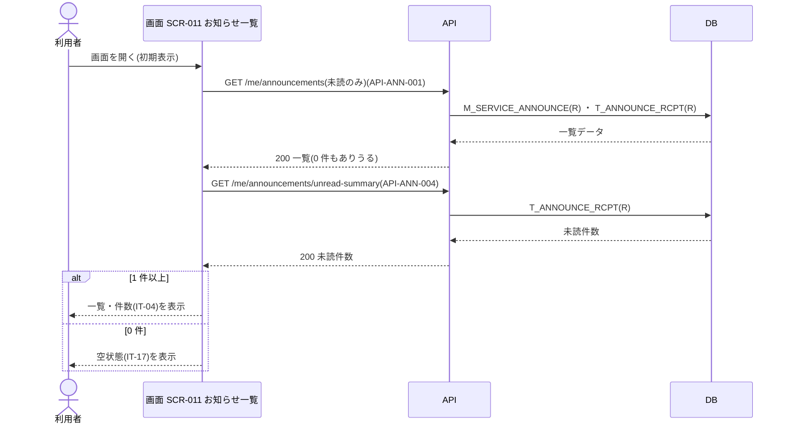
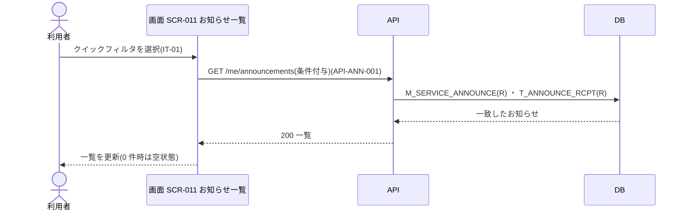
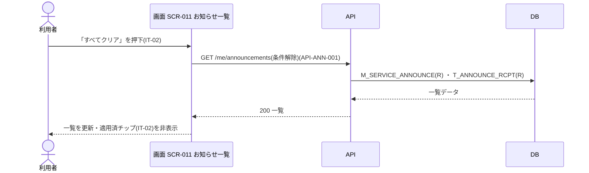
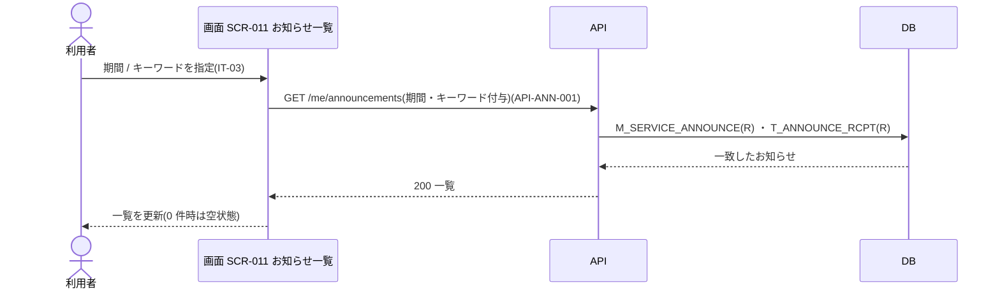
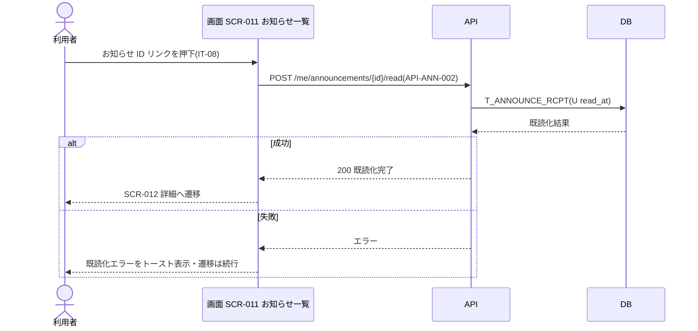
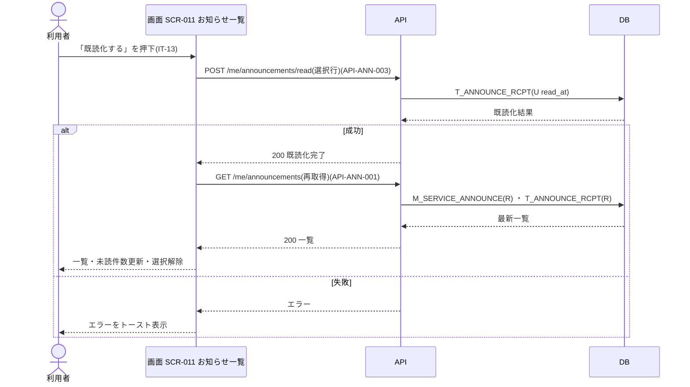
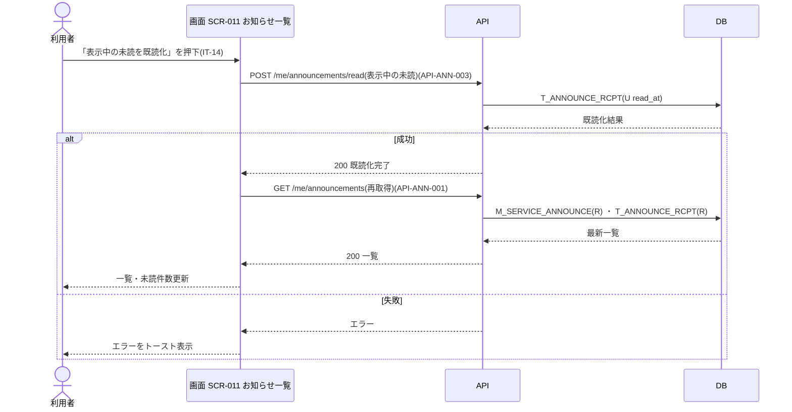
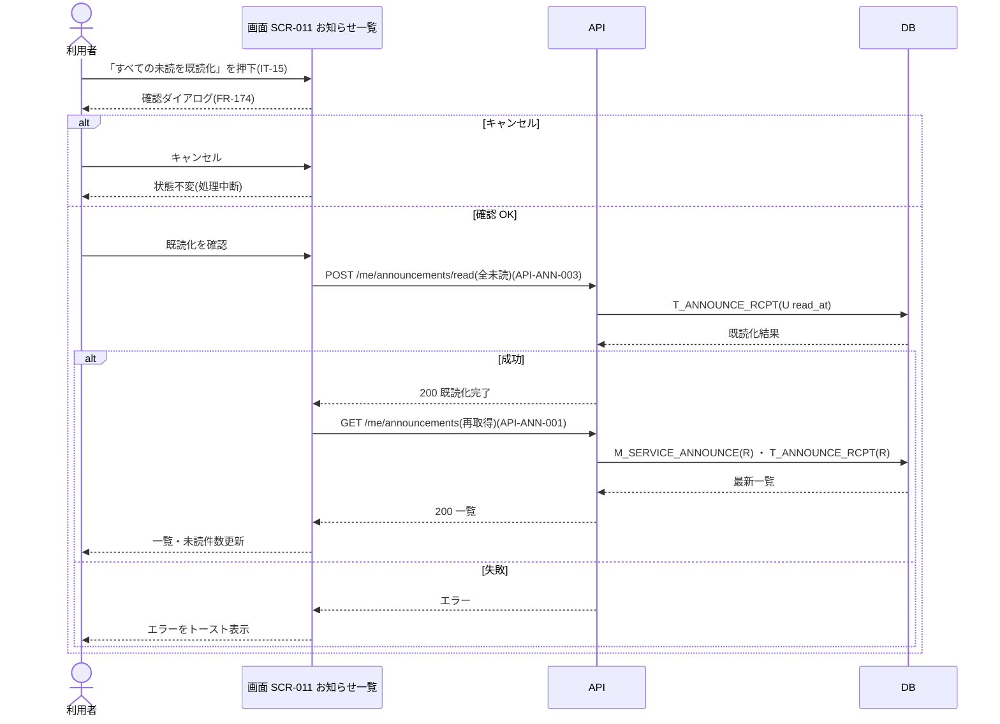
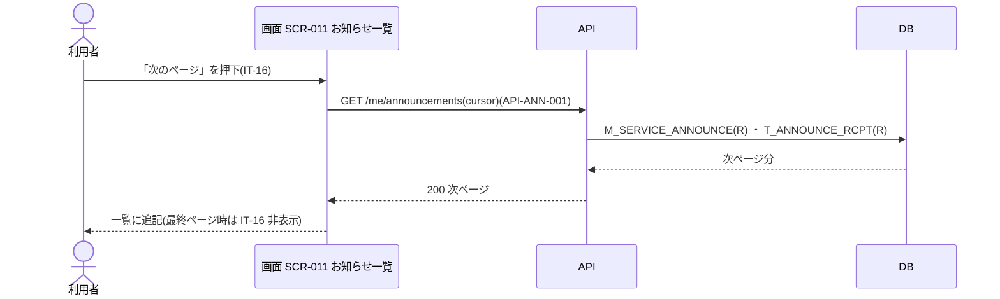

<!-- portal-top -->
[設計ポータル](../../README.md) ／ [要件定義](../index.md) ／ [業務ユースケース](index.md) ／ **UC-SCR-011: お知らせ一覧 ユースケース**
<!-- /portal-top -->

# UC-SCR-011: お知らせ一覧 ユースケース

> **このページは、画面 SCR-011(お知らせ一覧)の画面イベント EV-01〜EV-11 に対応する 11 のユースケースを「1 イベント = 1 ユースケース」で定義します。**

*版数 v1.0 ・ 更新 2026-06-21 ・ ユースケース 11 ・ ステータス ドラフト*

## 0. イベント↔ユースケース対応表

画面 [SCR-011](../../02_basic_design/01_screens/SCR-011.md#SCR-011) の §6 画面イベント一覧(EV-01〜EV-11)を、ユースケース ID へ 1:1 で対応づけます。種別は、サーバ API・DB へアクセスする「API/DB 連携」と、画面内のみで完結する「クライアント内処理のみ」に区別します。

| イベント ID | イベント名 | ユースケース ID | 種別 |
|----|----|----|----|
| `EV-01` | 初期表示 | [UC-SCR-011-EV01](#UC-SCR-011-EV01) | API/DB 連携 |
| `EV-02` | クイックフィルタチップを選択 | [UC-SCR-011-EV02](#UC-SCR-011-EV02) | API/DB 連携 |
| `EV-03` | 「すべてクリア」を押下 | [UC-SCR-011-EV03](#UC-SCR-011-EV03) | API/DB 連携 |
| `EV-04` | 詳細フィルタを適用 | [UC-SCR-011-EV04](#UC-SCR-011-EV04) | API/DB 連携 |
| `EV-05` | 行を選択 | [UC-SCR-011-EV05](#UC-SCR-011-EV05) | クライアント内処理のみ |
| `EV-06` | お知らせ ID リンクを押下 | [UC-SCR-011-EV06](#UC-SCR-011-EV06) | API/DB 連携 |
| `EV-07` | 「既読化する」を押下 | [UC-SCR-011-EV07](#UC-SCR-011-EV07) | API/DB 連携 |
| `EV-08` | 「表示中の未読を既読化」を押下 | [UC-SCR-011-EV08](#UC-SCR-011-EV08) | API/DB 連携 |
| `EV-09` | 「すべての未読を既読化」を押下 | [UC-SCR-011-EV09](#UC-SCR-011-EV09) | API/DB 連携 |
| `EV-10` | 「次のページ」を押下 | [UC-SCR-011-EV10](#UC-SCR-011-EV10) | API/DB 連携 |
| `EV-11` | 「選択を解除」を押下 | [UC-SCR-011-EV11](#UC-SCR-011-EV11) | クライアント内処理のみ |

## 1. ユースケース定義

### UC-SCR-011-EV01 初期表示

> お知らせ一覧画面を開いたとき、クイックフィルタ「未読のみ」を既定条件として一覧と未読件数を取得し、0 件のときは空状態を表示します。

| 項目 | 内容 |
|----|----|
| 利用者 | オーナー / 当該スコープのメンバー |
| 事前条件 | ログイン済みで、お知らせの閲覧資格がある |
| トリガー | 画面 SCR-011 を開く(初期表示) |
| 事後条件 | クイックフィルタ「未読のみ」を既定条件に一覧を表示し、未読件数(IT-04)を更新する。0 件のときは空状態(IT-17)を表示する |
| 関連 | [SCR-011](../../02_basic_design/01_screens/SCR-011.md#SCR-011) ・ [API-ANN-001](../../02_basic_design/03_apis/API-inbox.md#API-ANN-001) ・ [API-ANN-004](../../02_basic_design/03_apis/API-inbox.md#API-ANN-004) ・ [FR-155](../01_specifications/FR-155.md#FR-155) ・ [FR-156](../01_specifications/FR-156.md#FR-156) |

基本フロー

1. 利用者がお知らせ一覧画面を開く。
2. 画面はお知らせ一覧 API でクイックフィルタ「未読のみ」を既定条件として一覧を取得し表示する。
3. 画面はお知らせ未読件数 API で未読件数を取得し、件数表示(IT-04)を更新する。
4. 0 件のとき、画面は空状態(IT-17)を表示する。

異常系フロー

- 取得失敗: 一覧を表示せず、エラーを表示する。

### UC-SCR-011-EV02 クイックフィルタチップを選択

> クイックフィルタチップを選択すると、その条件で一覧を再取得し、0 件のときは空状態を表示します。

| 項目 | 内容 |
|----|----|
| 利用者 | オーナー / 当該スコープのメンバー |
| 事前条件 | お知らせ一覧を表示している |
| トリガー | クイックフィルタチップ(IT-01)を選択する |
| 事後条件 | 選択条件に一致するお知らせで一覧を更新する。0 件のときは空状態(IT-17)を表示する |
| 関連 | [SCR-011](../../02_basic_design/01_screens/SCR-011.md#SCR-011) ・ [API-ANN-001](../../02_basic_design/03_apis/API-inbox.md#API-ANN-001) |

基本フロー

1. 利用者がクイックフィルタチップ(IT-01)を選択する。
2. 画面は選択した条件を付与してお知らせ一覧 API を再取得する。
3. 画面は一覧を更新する。0 件のときは空状態(IT-17)を表示する。

異常系フロー

- 取得失敗: 一覧を更新せず、エラーを表示する。

### UC-SCR-011-EV03 「すべてクリア」を押下

> 「すべてクリア」を押下すると、適用中のフィルタ条件をすべて解除して一覧を再取得します。

| 項目 | 内容 |
|----|----|
| 利用者 | オーナー / 当該スコープのメンバー |
| 事前条件 | 適用済フィルタチップ(IT-02)を表示している |
| トリガー | 「すべてクリア」(IT-02)を押下する |
| 事後条件 | 適用中のフィルタ条件をすべて解除して一覧を更新し、適用済フィルタチップ(IT-02)を非表示にする |
| 関連 | [SCR-011](../../02_basic_design/01_screens/SCR-011.md#SCR-011) ・ [API-ANN-001](../../02_basic_design/03_apis/API-inbox.md#API-ANN-001) |

基本フロー

1. 利用者が「すべてクリア」(IT-02)を押下する。
2. 画面は適用中のフィルタ条件をすべて解除してお知らせ一覧 API を再取得し、一覧を更新する。
3. 画面は適用済フィルタチップ(IT-02)を非表示にする。

異常系フロー

- 取得失敗: 一覧を更新せず、エラーを表示する。

### UC-SCR-011-EV04 詳細フィルタを適用

> 期間・キーワードを付与して一覧を再取得し、0 件のときは空状態を表示します。

| 項目 | 内容 |
|----|----|
| 利用者 | オーナー / 当該スコープのメンバー |
| 事前条件 | お知らせ一覧を表示している |
| トリガー | 詳細フィルタ(IT-03)で期間またはキーワードを指定する |
| 事後条件 | 指定条件に一致するお知らせで一覧を更新する。0 件のときは空状態(IT-17)を表示する |
| 関連 | [SCR-011](../../02_basic_design/01_screens/SCR-011.md#SCR-011) ・ [API-ANN-001](../../02_basic_design/03_apis/API-inbox.md#API-ANN-001) |

基本フロー

1. 利用者が期間(開始日 / 終了日)を選択、またはキーワードを入力する。
2. 画面は条件を付与してお知らせ一覧 API を再取得する。
3. 画面は一覧を更新する。0 件のときは空状態(IT-17)を表示する。

異常系フロー

- 取得失敗: 一覧を更新せず、エラーを表示する。

### UC-SCR-011-EV05 行を選択

> 一覧の行を選択して一括操作の対象を決め、選択状況に応じて一括操作バーの表示を切り替えます(クライアント内処理のみ)。

| 項目 | 内容 |
|----|----|
| 利用者 | オーナー / 当該スコープのメンバー |
| 事前条件 | お知らせ一覧を表示している |
| トリガー | 選択チェックボックス(IT-11)を操作する |
| 事後条件 | 1 件以上選択時に一括操作バー(IT-12)を表示し、すべての選択を解除したとき非表示にする |
| 関連 | [SCR-011](../../02_basic_design/01_screens/SCR-011.md#SCR-011) ・ [FR-173](../01_specifications/FR-173.md#FR-173) |

クライアント内処理のみ(バックエンド連携なし)。

基本フロー

1. 利用者が選択チェックボックス(IT-11)をオンにし、対象行を選択状態にする(最大 100 件: FR-173)。
2. 1 件以上選択されたとき、画面は一括操作バー(IT-12)を表示する。
3. すべての選択を解除したとき、画面は一括操作バー(IT-12)を非表示にする。

異常系フロー

- 上限超過: 既に 100 件(FR-173)選択済みのとき、追加選択を受け付けずその旨を表示する。

### UC-SCR-011-EV06 お知らせ ID リンクを押下

> お知らせ ID リンクを押下すると、該当行を個別既読化したうえで詳細画面へ遷移します。

| 項目 | 内容 |
|----|----|
| 利用者 | オーナー / 当該スコープのメンバー |
| 事前条件 | お知らせ一覧に対象お知らせが表示されている |
| トリガー | お知らせ ID(IT-08)のリンクを押下する |
| 事後条件 | 該当行を既読化し、詳細画面(SCR-012)へ遷移する |
| 関連 | [SCR-011](../../02_basic_design/01_screens/SCR-011.md#SCR-011) ・ [API-ANN-002](../../02_basic_design/03_apis/API-inbox.md#API-ANN-002) ・ [SCR-012](../../02_basic_design/01_screens/SCR-012.md#SCR-012) ・ [FR-156](../01_specifications/FR-156.md#FR-156) |

基本フロー

1. 利用者がお知らせ ID(IT-08)のリンクを押下する。
2. 画面はお知らせ個別既読 API で該当行を既読化する。
3. 画面は詳細画面(SCR-012)へ遷移する。

異常系フロー

- 既読化失敗: 既読化エラーをトーストで表示し、遷移は続行する。

### UC-SCR-011-EV07 「既読化する」を押下

> 選択した行を一括既読 API でまとめて既読化し、成功時は一覧を再取得して選択を解除します。

| 項目 | 内容 |
|----|----|
| 利用者 | オーナー / 当該スコープのメンバー |
| 事前条件 | 1 件以上のお知らせを選択し、一括操作バー(IT-12)を表示している |
| トリガー | 一括操作バーの「既読化する」(IT-13)を押下する |
| 事後条件 | 選択行を既読化する。一覧を再取得し未読件数(IT-04)を更新し、選択を解除して一括操作バー(IT-12)を非表示にする |
| 関連 | [SCR-011](../../02_basic_design/01_screens/SCR-011.md#SCR-011) ・ [API-ANN-003](../../02_basic_design/03_apis/API-inbox.md#API-ANN-003) ・ [API-ANN-001](../../02_basic_design/03_apis/API-inbox.md#API-ANN-001) ・ [FR-156](../01_specifications/FR-156.md#FR-156) |

基本フロー

1. 利用者が一括操作バーの「既読化する」(IT-13)を押下する。
2. 画面は選択行をお知らせ一括既読 API で既読化する。
3. 成功時、画面は一覧を再取得して未読件数(IT-04)を更新し、選択状態を解除して一括操作バー(IT-12)を非表示にする。

異常系フロー

- 失敗: エラーをトーストで表示する。

### UC-SCR-011-EV08 「表示中の未読を既読化」を押下

> 現在のフィルタ条件を維持したまま、表示中の未読を一括既読化し、成功時は一覧を再取得します。

| 項目 | 内容 |
|----|----|
| 利用者 | オーナー / 当該スコープのメンバー |
| 事前条件 | お知らせ一覧を表示している |
| トリガー | 「表示中の未読を既読化」(IT-14)を押下する |
| 事後条件 | 現在のフィルタ条件で表示中の未読を既読化する。一覧を再取得し未読件数(IT-04)を更新する |
| 関連 | [SCR-011](../../02_basic_design/01_screens/SCR-011.md#SCR-011) ・ [API-ANN-003](../../02_basic_design/03_apis/API-inbox.md#API-ANN-003) ・ [API-ANN-001](../../02_basic_design/03_apis/API-inbox.md#API-ANN-001) ・ [FR-156](../01_specifications/FR-156.md#FR-156) |

基本フロー

1. 利用者が「表示中の未読を既読化」(IT-14)を押下する。
2. 画面は現在のフィルタ条件を維持したままお知らせ一括既読 API で表示中の未読を既読化する。
3. 成功時、画面は一覧を再取得して未読件数(IT-04)を更新する。

異常系フロー

- 失敗: エラーをトーストで表示する。

### UC-SCR-011-EV09 「すべての未読を既読化」を押下

> 確認ダイアログの承認後、フィルタを無視して全未読を一括既読化します。

| 項目 | 内容 |
|----|----|
| 利用者 | オーナー / 当該スコープのメンバー |
| 事前条件 | お知らせ一覧を表示している |
| トリガー | 「すべての未読を既読化」(IT-15)を押下する |
| 事後条件 | 確認後、フィルタを無視して全未読を既読化する。一覧を再取得し未読件数(IT-04)を更新する |
| 関連 | [SCR-011](../../02_basic_design/01_screens/SCR-011.md#SCR-011) ・ [API-ANN-003](../../02_basic_design/03_apis/API-inbox.md#API-ANN-003) ・ [API-ANN-001](../../02_basic_design/03_apis/API-inbox.md#API-ANN-001) ・ [FR-174](../01_specifications/FR-174.md#FR-174) |

基本フロー

1. 利用者が「すべての未読を既読化」(IT-15)を押下する。
2. 画面は確認ダイアログを表示する(FR-174)。
3. 利用者が OK を押下する。
4. 画面はフィルタを無視してお知らせ一括既読 API で全未読を既読化する。
5. 成功時、画面は一覧を再取得して未読件数(IT-04)を更新する。

異常系フロー

- ダイアログをキャンセル: ダイアログを閉じ、処理を中断する(画面状態は不変)。
- 失敗: エラーをトーストで表示する。

### UC-SCR-011-EV10 「次のページ」を押下

> 「次のページ」を押下すると、カーソル方式で次ページを取得して一覧に追記表示します。

| 項目 | 内容 |
|----|----|
| 利用者 | オーナー / 当該スコープのメンバー |
| 事前条件 | お知らせ一覧を表示し、次ページが存在する |
| トリガー | ページング(IT-16)を押下する |
| 事後条件 | カーソル方式で次ページを取得し一覧に追記表示する。最終ページ到達時はページングボタン(IT-16)を非表示にする |
| 関連 | [SCR-011](../../02_basic_design/01_screens/SCR-011.md#SCR-011) ・ [API-ANN-001](../../02_basic_design/03_apis/API-inbox.md#API-ANN-001) |

基本フロー

1. 利用者がページング(IT-16)を押下する。
2. 画面はカーソル方式でお知らせ一覧 API の次ページを取得する。
3. 画面は取得分を一覧に追記表示する。
4. 最終ページ到達時、画面はページングボタン(IT-16)を非表示にする。

異常系フロー

- 取得失敗: 追記を行わず、エラーを表示する。

### UC-SCR-011-EV11 「選択を解除」を押下

> 「選択を解除」を押下し、全選択を解除して一括操作バーを非表示にします(クライアント内処理のみ)。

| 項目 | 内容 |
|----|----|
| 利用者 | オーナー / 当該スコープのメンバー |
| 事前条件 | 1 件以上のお知らせを選択し、一括操作バー(IT-12)を表示している |
| トリガー | 一括操作バーの「選択を解除」(IT-12)を押下する |
| 事後条件 | 全選択を解除し、一括操作バー(IT-12)を非表示にする |
| 関連 | [SCR-011](../../02_basic_design/01_screens/SCR-011.md#SCR-011) |

クライアント内処理のみ(バックエンド連携なし)。

基本フロー

1. 利用者が「選択を解除」(IT-12)を押下する。
2. 画面は選択状態をすべて解除する。
3. 選択が 0 件になるため、画面は一括操作バー(IT-12)を非表示にする。

異常系フロー

- なし(クライアント内処理のみ)。

---

<!-- portal-bottom -->
[← 業務ユースケース](index.md) ・ [要件定義](../index.md) ・ [↑ 設計ポータル](../../README.md)
<!-- /portal-bottom -->
