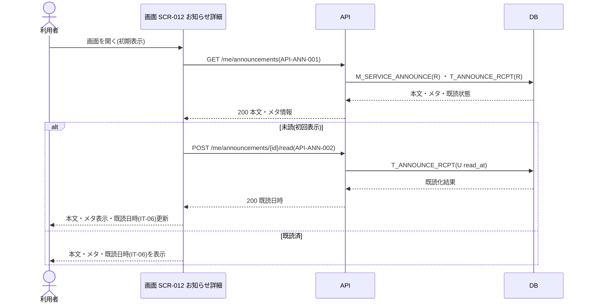

<!-- portal-top -->
[設計ポータル](../../README.md) ／ [要件定義](../index.md) ／ [業務ユースケース](index.md) ／ **UC-SCR-012: お知らせ詳細 ユースケース**
<!-- /portal-top -->

# UC-SCR-012: お知らせ詳細 ユースケース

> **このページは、画面 SCR-012(お知らせ詳細)の画面イベント EV-01〜EV-04 に対応する 4 つのユースケースを「1 イベント = 1 ユースケース」で定義します。**

*版数 v1.0 ・ 更新 2026-06-21 ・ ユースケース 4 ・ ステータス ドラフト*

## 0. イベント↔ユースケース対応表

画面 [SCR-012](../../02_basic_design/01_screens/SCR-012.md#SCR-012) の §6 画面イベント一覧(EV-01〜EV-04)を、ユースケース ID へ 1:1 で対応づけます。種別は、サーバ API・DB へアクセスする「API/DB 連携」と、画面内のみで完結する「クライアント内処理のみ」に区別します。

| イベント ID | イベント名 | ユースケース ID | 種別 |
|----|----|----|----|
| `EV-01` | 初期表示 | [UC-SCR-012-EV01](#UC-SCR-012-EV01) | API/DB 連携 |
| `EV-02` | 「一覧へ戻る」を押下 | [UC-SCR-012-EV02](#UC-SCR-012-EV02) | クライアント内処理のみ |
| `EV-03` | 「前のお知らせ」を押下 | [UC-SCR-012-EV03](#UC-SCR-012-EV03) | クライアント内処理のみ |
| `EV-04` | 「次のお知らせ」を押下 | [UC-SCR-012-EV04](#UC-SCR-012-EV04) | クライアント内処理のみ |

## 1. ユースケース定義

### UC-SCR-012-EV01 初期表示

> お知らせ詳細画面を開いたとき、対象お知らせの本文・メタ情報を取得して表示し、初回表示(未読)のときは自動既読化します。

| 項目 | 内容 |
|----|----|
| 利用者 | オーナー / 当該スコープのメンバー |
| 事前条件 | ログイン済みで、一覧(SCR-011)から対象お知らせを選択している |
| トリガー | 画面 SCR-012 を開く(初期表示) |
| 事後条件 | 本文・メタ情報(種別・重要度・配信日時・既読日時)を表示する。初回表示(未読)のときは自動既読化し、既読日時(IT-06)を更新表示する |
| 関連 | [SCR-012](../../02_basic_design/01_screens/SCR-012.md#SCR-012) ・ [API-ANN-001](../../02_basic_design/03_apis/API-inbox.md#API-ANN-001) ・ [API-ANN-002](../../02_basic_design/03_apis/API-inbox.md#API-ANN-002) ・ [FR-156](../01_specifications/FR-156.md#FR-156) ・ [FR-157](../01_specifications/FR-157.md#FR-157) |

基本フロー

1. 利用者がお知らせ詳細画面を開く。
2. 画面はお知らせ一覧 API(お知らせ詳細取得を兼ねる)で対象お知らせの本文・メタ情報を取得して表示する。
3. 初回表示(未読)のとき、画面はお知らせ個別既読 API を呼び出して自動既読化し、既読日時(IT-06)を更新表示する。
4. 既読済のとき、画面は既読日時(IT-06)をそのまま表示する。

異常系フロー

- 取得失敗: 本文を表示せず、エラーを表示する。
- 既読化失敗: 本文は表示したまま、既読化のエラーをトーストで表示する。

### UC-SCR-012-EV02 「一覧へ戻る」を押下

> 「一覧へ戻る」を押下し、お知らせ一覧画面へ遷移します(クライアント内処理のみ)。

| 項目 | 内容 |
|----|----|
| 利用者 | オーナー / 当該スコープのメンバー |
| 事前条件 | お知らせ詳細を表示している |
| トリガー | 「一覧へ戻る」(IT-08)を押下する |
| 事後条件 | SCR-011 お知らせ一覧へ遷移する |
| 関連 | [SCR-012](../../02_basic_design/01_screens/SCR-012.md#SCR-012) ・ [SCR-011](../../02_basic_design/01_screens/SCR-011.md#SCR-011) |

クライアント内処理のみ(バックエンド連携なし)。

基本フロー

1. 利用者が「一覧へ戻る」(IT-08)を押下する。
2. 画面は SCR-011 お知らせ一覧へ遷移する。

異常系フロー

- なし(画面遷移のみ)。

### UC-SCR-012-EV03 「前のお知らせ」を押下

> 「前のお知らせ」を押下し、一覧の並び順に基づき前のお知らせ詳細へ遷移します(クライアント内処理のみ)。

| 項目 | 内容 |
|----|----|
| 利用者 | オーナー / 当該スコープのメンバー |
| 事前条件 | お知らせ詳細を表示しており、対象が一覧の先頭ではない |
| トリガー | 「前のお知らせ」(IT-09)を押下する |
| 事後条件 | 一覧の並び順に基づき、前のお知らせの SCR-012 へ遷移する。先頭のお知らせでは本リンクを非活性にする |
| 関連 | [SCR-012](../../02_basic_design/01_screens/SCR-012.md#SCR-012) |

クライアント内処理のみ(バックエンド連携なし。遷移先の本文取得・自動既読化は遷移先 SCR-012 の初期表示で行う)。

基本フロー

1. 利用者が「前のお知らせ」(IT-09)を押下する。
2. 画面は一覧の並び順に基づき、前のお知らせの SCR-012 へ遷移する。

異常系フロー

- 先頭のお知らせ: 本リンクを非活性にし、押下を受け付けない。

### UC-SCR-012-EV04 「次のお知らせ」を押下

> 「次のお知らせ」を押下し、一覧の並び順に基づき次のお知らせ詳細へ遷移します(クライアント内処理のみ)。

| 項目 | 内容 |
|----|----|
| 利用者 | オーナー / 当該スコープのメンバー |
| 事前条件 | お知らせ詳細を表示しており、対象が一覧の末尾ではない |
| トリガー | 「次のお知らせ」(IT-09)を押下する |
| 事後条件 | 一覧の並び順に基づき、次のお知らせの SCR-012 へ遷移する。末尾のお知らせでは本リンクを非活性にする |
| 関連 | [SCR-012](../../02_basic_design/01_screens/SCR-012.md#SCR-012) |

クライアント内処理のみ(バックエンド連携なし。遷移先の本文取得・自動既読化は遷移先 SCR-012 の初期表示で行う)。

基本フロー

1. 利用者が「次のお知らせ」(IT-09)を押下する。
2. 画面は一覧の並び順に基づき、次のお知らせの SCR-012 へ遷移する。

異常系フロー

- 末尾のお知らせ: 本リンクを非活性にし、押下を受け付けない。

---

<!-- portal-bottom -->
[← 業務ユースケース](index.md) ・ [要件定義](../index.md) ・ [↑ 設計ポータル](../../README.md)
<!-- /portal-bottom -->
