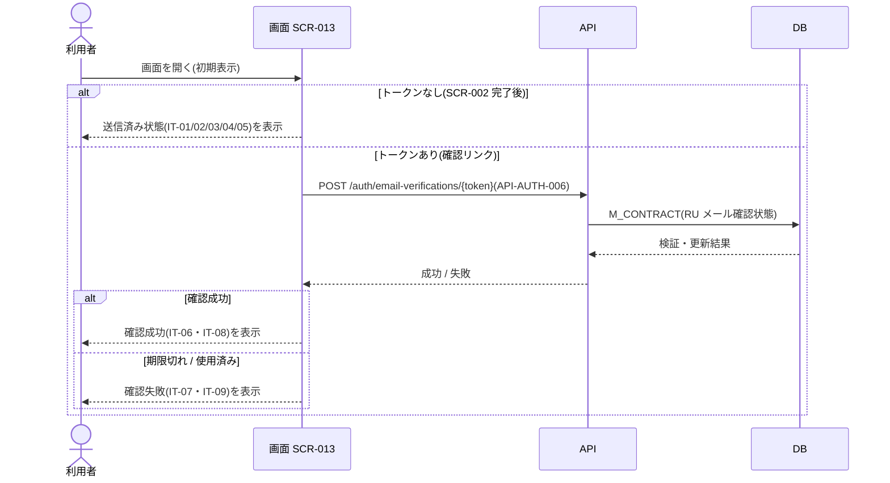
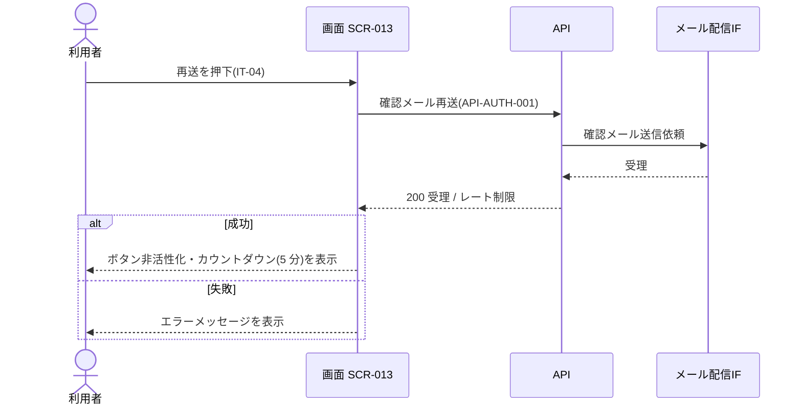

<!-- portal-top -->
[設計ポータル](../../README.md) ／ [要件定義](../index.md) ／ [業務ユースケース](index.md) ／ **UC-SCR-013: メール確認 ユースケース**
<!-- /portal-top -->

# UC-SCR-013: メール確認 ユースケース

> **このページは、画面 SCR-013(メール確認)の画面イベント EV-01〜EV-05 に対応する 5 のユースケースを「1 イベント = 1 ユースケース」で定義します。**

*版数 v1.0 ・ 更新 2026-06-21 ・ ユースケース 5 ・ ステータス ドラフト*

## 0. イベント↔ユースケース対応表

画面 [SCR-013](../../02_basic_design/01_screens/SCR-013.md#SCR-013) §6 の各イベントを、1 対 1 でユースケースへ対応づけます。種別は、サーバ API・DB へアクセスする「API/DB 連携」と、画面内で完結する「クライアント内処理のみ」を区別します。

| イベント ID | イベント名 | ユースケース ID | 種別 |
|----|----|----|----|
| `EV-01` | 初期表示 | [UC-SCR-013-EV01](#UC-SCR-013-EV01) | API/DB 連携 |
| `EV-02` | 「メールを再送する」を押下 | [UC-SCR-013-EV02](#UC-SCR-013-EV02) | API/DB 連携 |
| `EV-03` | 「メールアドレスを変更する」を押下 | [UC-SCR-013-EV03](#UC-SCR-013-EV03) | クライアント内処理のみ |
| `EV-04` | 「新規登録からやり直す」を押下 | [UC-SCR-013-EV04](#UC-SCR-013-EV04) | クライアント内処理のみ |
| `EV-05` | 「ログインする」を押下 | [UC-SCR-013-EV05](#UC-SCR-013-EV05) | クライアント内処理のみ |

## 1. ユースケース定義

### UC-SCR-013-EV01 初期表示

> **概要** URL パラメータに応じて送信済み状態を表示し、確認トークンがある場合はメール確認 API で検証して成功 / 失敗状態を表示するユースケース。

| 項目 | 内容 |
|---|---|
| 利用者 | 対象ユーザー(認証前 / トークン) |
| 事前条件 | SCR-002 完了後に遷移、または確認リンクから到達した |
| トリガー | EV-01: 初期表示 |
| 事後条件 | トークンなし(SCR-002 完了後)は送信済み状態(IT-01・IT-02・IT-03・IT-04・IT-05)を表示する。トークンありは検証し、成功時は確認成功(IT-06・IT-08)、失敗時は確認失敗(IT-07・IT-09)を表示する |
| 関連 | [SCR-013](../../02_basic_design/01_screens/SCR-013.md#SCR-013) ・ [API-AUTH-006](../../02_basic_design/03_apis/API-auth.md#API-AUTH-006) ・ [FR-003](../01_specifications/FR-003.md#FR-003) |

**基本フロー**
1. 画面が URL パラメータ(確認トークンの有無)を確認する。
2. トークンなし(SCR-002 完了後)の場合、状態タイムライン(IT-01)・送信先メールアドレス(IT-02)・案内文(IT-03)を表示し、再送(IT-04)・メールアドレス変更(IT-05)を活性表示する。
3. トークンあり(確認リンクからのアクセス)の場合、メール確認 API(`POST /auth/email-verifications/{token}` = [API-AUTH-006](../../02_basic_design/03_apis/API-auth.md#API-AUTH-006))でトークンを検証する。
4. API は確認トークンを検証し、メール確認状態(`M_CONTRACT`)を更新する。
5. 成功時、画面は確認成功アラート(IT-06)と「ログインする」(IT-08)を表示する。

**異常系フロー**
- 失敗(期限切れ・使用済み): 確認失敗アラート(IT-07)と「新規登録からやり直す」(IT-09)を表示する(有効期限 24 時間)。

### UC-SCR-013-EV02 「メールを再送する」を押下

> **概要** 確認メール再送 API を呼び出して確認メールを再送し、成功時はレート制限カウントダウンを表示するユースケース。

| 項目 | 内容 |
|---|---|
| 利用者 | 対象ユーザー(認証前 / トークン) |
| 事前条件 | 送信済み状態で、再送ボタン(IT-04)が活性表示されている |
| トリガー | EV-02: 再送ボタン(IT-04)を押下 |
| 事後条件 | 成功時は確認メールを再送し、ボタンを非活性化してカウントダウン(レート制限 5 分)を表示する |
| 関連 | [SCR-013](../../02_basic_design/01_screens/SCR-013.md#SCR-013) ・ [API-AUTH-001](../../02_basic_design/03_apis/API-auth.md#API-AUTH-001) ・ [FR-003](../01_specifications/FR-003.md#FR-003) |

**基本フロー**
1. 利用者が再送ボタン(IT-04)を押下する。
2. 画面は新規登録(確認メール再送)API([API-AUTH-001](../../02_basic_design/03_apis/API-auth.md#API-AUTH-001))を呼び出す。
3. API はメール配信 IF 経由で確認メールを再送する。
4. 成功時、画面はボタンを非活性化してカウントダウン(レート制限 5 分)を表示する。

**異常系フロー**
- レート制限中: ボタンは非活性のまま(カウントダウン終了で再活性)。
- 再送失敗: エラーメッセージを表示する。

### UC-SCR-013-EV03 「メールアドレスを変更する」を押下

> **概要** アカウント登録画面へ戻り入力をやり直す、クライアント内処理のみのユースケース。

| 項目 | 内容 |
|---|---|
| 利用者 | 対象ユーザー(認証前 / トークン) |
| 事前条件 | 送信済み状態が表示されている |
| トリガー | EV-03: メールアドレスを変更する(IT-05)を押下 |
| 事後条件 | SCR-002 アカウント登録へ遷移し、メールアドレスをやり直す |
| 関連 | [SCR-013](../../02_basic_design/01_screens/SCR-013.md#SCR-013) ・ [SCR-002](../../02_basic_design/01_screens/SCR-002.md#SCR-002) |

クライアント内処理のみ(バックエンド連携なし)。

**基本フロー**
1. 利用者が「メールアドレスを変更する」(IT-05)を押下する。
2. 画面は SCR-002 アカウント登録へ遷移する。

**異常系フロー**
- なし(画面遷移のみ)。

### UC-SCR-013-EV04 「新規登録からやり直す」を押下

> **概要** 確認失敗状態からアカウント登録画面へ戻る、クライアント内処理のみのユースケース。

| 項目 | 内容 |
|---|---|
| 利用者 | 対象ユーザー(認証前 / トークン) |
| 事前条件 | 確認失敗状態(IT-07・IT-09)が表示されている |
| トリガー | EV-04: 新規登録からやり直す(IT-09)を押下 |
| 事後条件 | SCR-002 アカウント登録へ遷移し、登録を最初からやり直す |
| 関連 | [SCR-013](../../02_basic_design/01_screens/SCR-013.md#SCR-013) ・ [SCR-002](../../02_basic_design/01_screens/SCR-002.md#SCR-002) |

クライアント内処理のみ(バックエンド連携なし)。

**基本フロー**
1. 利用者が「新規登録からやり直す」(IT-09)を押下する。
2. 画面は SCR-002 アカウント登録へ遷移する。

**異常系フロー**
- なし(画面遷移のみ)。

### UC-SCR-013-EV05 「ログインする」を押下

> **概要** 確認成功状態からログイン画面へ遷移する、クライアント内処理のみのユースケース。

| 項目 | 内容 |
|---|---|
| 利用者 | 対象ユーザー(確認成功) |
| 事前条件 | 確認成功状態(IT-06・IT-08)が表示されている |
| トリガー | EV-05: ログインする(IT-08)を押下 |
| 事後条件 | SCR-001 ログインへ遷移する |
| 関連 | [SCR-013](../../02_basic_design/01_screens/SCR-013.md#SCR-013) ・ [FR-003](../01_specifications/FR-003.md#FR-003) |

クライアント内処理のみ(バックエンド連携なし)。

**基本フロー**
1. 利用者が「ログインする」(IT-08)を押下する。
2. 画面は SCR-001 ログインへ遷移する。

**異常系フロー**
- なし(画面遷移のみ)。

---

<!-- portal-bottom -->
[← 業務ユースケース](index.md) ・ [要件定義](../index.md) ・ [↑ 設計ポータル](../../README.md)
<!-- /portal-bottom -->
