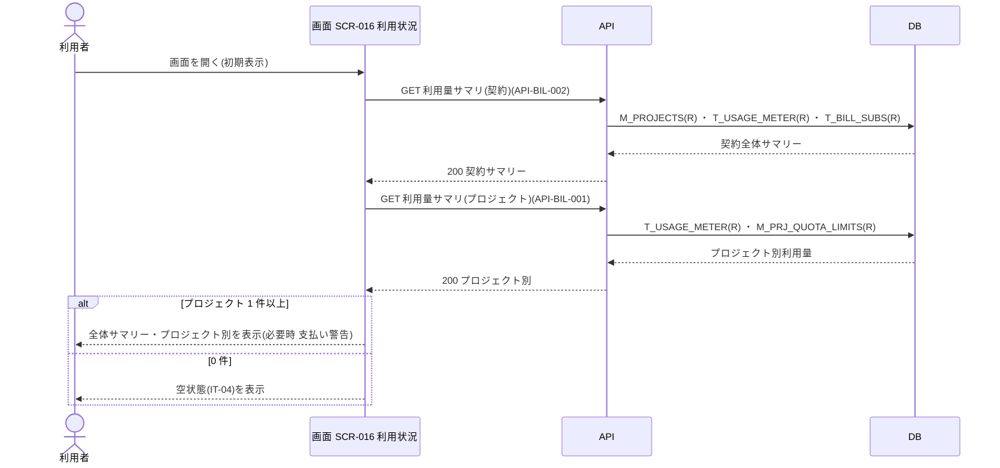

<!-- portal-top -->
[設計ポータル](../../README.md) ／ [要件定義](../index.md) ／ [業務ユースケース](index.md) ／ **UC-SCR-016: 利用状況 ユースケース**
<!-- /portal-top -->

# UC-SCR-016: 利用状況 ユースケース

> **このページは、画面 SCR-016(利用状況)の画面イベント EV-01〜EV-03 に対応する 3 のユースケースを「1 イベント = 1 ユースケース」で定義します。**

*版数 v1.0 ・ 更新 2026-06-21 ・ ユースケース 3 ・ ステータス ドラフト*

## 0. イベント↔ユースケース対応表

画面 [SCR-016](../../02_basic_design/01_screens/SCR-016.md#SCR-016) の §6 画面イベント一覧(EV-01〜EV-03)を、ユースケース ID へ 1:1 で対応づけます。種別は、サーバ API・DB へアクセスする「API/DB 連携」と、画面内のみで完結する「クライアント内処理のみ」に区別します。

| イベント ID | イベント名 | ユースケース ID | 種別 |
|----|----|----|----|
| `EV-01` | 初期表示 | [UC-SCR-016-EV01](#UC-SCR-016-EV01) | API/DB 連携 |
| `EV-02` | 「請求を確認」を押下 | [UC-SCR-016-EV02](#UC-SCR-016-EV02) | クライアント内処理のみ |
| `EV-03` | 「プロジェクトへ」を押下 | [UC-SCR-016-EV03](#UC-SCR-016-EV03) | クライアント内処理のみ |

## 1. ユースケース定義

### UC-SCR-016-EV01 初期表示

> 利用状況画面を開いたとき、契約全体サマリーとプロジェクト別利用状況を当月固定で取得・表示し、支払い警告やプロジェクト 0 件の空状態を条件に応じて表示します。

| 項目 | 内容 |
|----|----|
| 利用者 | オーナー(本画面はオーナー専有) |
| 事前条件 | ログイン済みで、オーナーである |
| トリガー | 画面 SCR-016 を開く(初期表示) |
| 事後条件 | 契約全体サマリー(IT-01)とプロジェクト別利用状況(IT-03)を表示する。支払方法未登録・支払い失敗時は支払い警告(IT-02)を表示し、プロジェクト 0 件時は空状態(IT-04)を表示し IT-03 を表示しない |
| 関連 | [SCR-016](../../02_basic_design/01_screens/SCR-016.md#SCR-016) ・ [API-BIL-002](../../02_basic_design/03_apis/API-billing.md#API-BIL-002) ・ [API-BIL-001](../../02_basic_design/03_apis/API-billing.md#API-BIL-001) ・ [FR-077](../FR10.md#FR-077) |

基本フロー

1. 利用者が利用状況画面を開く。
2. 画面は利用量サマリ(契約)API を呼び出し、契約全体サマリー(IT-01)を取得して表示する。
3. 画面は利用量サマリ(プロジェクト)API を呼び出し、プロジェクト別利用状況(IT-03)を取得して表示する。
4. 支払方法未登録または支払い失敗の場合、画面は支払い警告バナー(IT-02)を表示する。
5. プロジェクトが 0 件の場合、画面は空状態(IT-04)を表示し、プロジェクト別利用状況(IT-03)は表示しない。

異常系フロー

- 権限なし(オーナー以外の URL 直アクセス): 権限不足を表示し、本画面を表示しない。
- 取得失敗: 当該データを表示せず、エラーメッセージを表示する。

### UC-SCR-016-EV02 「請求を確認」を押下

> 支払い警告バナーの「請求を確認」を押下し、請求画面へ遷移します(クライアント内処理のみ)。

| 項目 | 内容 |
|----|----|
| 利用者 | オーナー(本画面はオーナー専有) |
| 事前条件 | 支払い警告バナー(IT-02)を表示している |
| トリガー | 「請求を確認」(IT-02)を押下する |
| 事後条件 | SCR-022 請求画面へ遷移する |
| 関連 | [SCR-016](../../02_basic_design/01_screens/SCR-016.md#SCR-016) ・ [SCR-022](../../02_basic_design/01_screens/SCR-022.md#SCR-022) |

基本フロー

1. 利用者が「請求を確認」(IT-02)を押下する。
2. 画面は SCR-022 請求画面へ遷移する。

異常系フロー

- なし(画面遷移のみ)。

クライアント内処理のみ(画面遷移)のため、シーケンス図は省略します。

### UC-SCR-016-EV03 「プロジェクトへ」を押下

> 空状態の「プロジェクトへ」CTA を押下し、プロジェクト画面へ遷移します(クライアント内処理のみ)。

| 項目 | 内容 |
|----|----|
| 利用者 | オーナー(本画面はオーナー専有) |
| 事前条件 | プロジェクトが 0 件で、空状態(IT-04)を表示している |
| トリガー | 「プロジェクトへ」(IT-04)を押下する |
| 事後条件 | SCR-004 プロジェクト画面へ遷移する |
| 関連 | [SCR-016](../../02_basic_design/01_screens/SCR-016.md#SCR-016) ・ [SCR-004](../../02_basic_design/01_screens/SCR-004.md#SCR-004) |

基本フロー

1. 利用者が「プロジェクトへ」(IT-04)を押下する。
2. 画面は SCR-004 プロジェクト画面へ遷移する。

異常系フロー

- なし(画面遷移のみ)。

クライアント内処理のみ(画面遷移)のため、シーケンス図は省略します。

---

<!-- portal-bottom -->
[← 業務ユースケース](index.md) ・ [要件定義](../index.md) ・ [↑ 設計ポータル](../../README.md)
<!-- /portal-bottom -->
