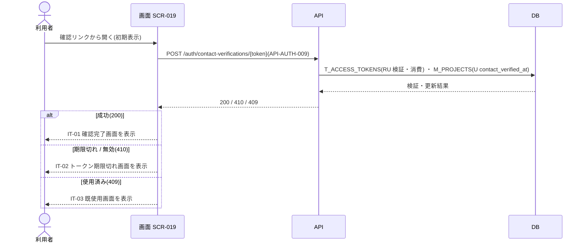

<!-- portal-top -->
[設計ポータル](../../README.md) ／ [要件定義](../index.md) ／ [業務ユースケース](index.md) ／ **UC-SCR-019: プロジェクト連絡先メール確認完了 ユースケース**
<!-- /portal-top -->

# UC-SCR-019: プロジェクト連絡先メール確認完了 ユースケース

> **このページは、画面 SCR-019(プロジェクト連絡先メール確認完了)の画面イベント EV-01〜EV-02 に対応する 2 のユースケースを「1 イベント = 1 ユースケース」で定義します。**

*版数 v1.0 ・ 更新 2026-06-21 ・ ユースケース 2 ・ ステータス ドラフト*

## 0. イベント↔ユースケース対応表

画面 [SCR-019](../../02_basic_design/01_screens/SCR-019.md#SCR-019) §6 の各イベントを、1 対 1 でユースケースへ対応づけます。種別は、サーバ API・DB へアクセスする「API/DB 連携」と、画面内で完結する「クライアント内処理のみ」を区別します。

| イベント ID | イベント名 | ユースケース ID | 種別 |
|----|----|----|----|
| `EV-01` | 初期表示 | [UC-SCR-019-EV01](#UC-SCR-019-EV01) | API/DB 連携 |
| `EV-02` | 「閉じる」を押下 | [UC-SCR-019-EV02](#UC-SCR-019-EV02) | クライアント内処理のみ |

## 1. ユースケース定義

### UC-SCR-019-EV01 初期表示

> **概要** 連絡先確認トークンを連絡先メール確認 API で検証し、結果(完了 / 期限切れ / 既使用)に応じた状態画面を表示するユースケース。

| 項目 | 内容 |
|---|---|
| 利用者 | 対象ユーザー(トークン。連絡先メールアドレスの所有者で、第三者でも可) |
| 事前条件 | 連絡先メールの確認リンク(`purpose='contact_verify'` のトークン付き URL)からアクセスした |
| トリガー | EV-01: 初期表示 |
| 事後条件 | 成功(200)時は連絡先メール確認日時(`M_PROJECTS.contact_verified_at`)を設定し IT-01 確認完了画面を表示する。期限切れ / 無効(410)は IT-02、使用済み(409)は IT-03 を表示する |
| 関連 | [SCR-019](../../02_basic_design/01_screens/SCR-019.md#SCR-019) ・ [API-AUTH-009](../../02_basic_design/03_apis/API-auth.md#API-AUTH-009) ・ [FR-022a](../FR03.md#FR-022a) ・ [FR-022c](../FR03.md#FR-022c) |

**基本フロー**
1. 画面が URL パスパラメータのトークンを取得する。
2. 画面は連絡先メール確認 API(`POST /auth/contact-verifications/{token}` = [API-AUTH-009](../../02_basic_design/03_apis/API-auth.md#API-AUTH-009))を呼び出す。
3. API は確認トークン(`T_ACCESS_TOKENS`)を検証・消費し、連絡先メール確認日時(`M_PROJECTS.contact_verified_at`)を設定する。
4. 成功(200)時、画面は IT-01 確認完了画面を表示する。

**異常系フロー**
- 期限切れ / 無効(410): IT-02 トークン期限切れ画面を表示する(有効期限 24 時間)。
- 使用済み(409): IT-03 既使用画面を表示する。

> [!NOTE]
> 確認 API はトークン検証・連絡先確認日時更新・トークン消費・監査記録を同一トランザクションで行います。図は各更新を 1 段に抽象化し、トランザクション内の順序や監査記録の実装は展開しません(正本は SCR-019 §6 注記)。

### UC-SCR-019-EV02 「閉じる」を押下

> **概要** タブ / ウィンドウを閉じる、クライアント内処理のみのユースケース。

| 項目 | 内容 |
|---|---|
| 利用者 | 対象ユーザー(トークン検証成功後) |
| 事前条件 | IT-01 確認完了画面が表示され、閉じるボタン(IT-04)が表示されている |
| トリガー | EV-02: 閉じる(IT-04)を押下 |
| 事後条件 | タブ / ウィンドウを閉じる。閉じられない場合は静的な完了メッセージを表示し続ける |
| 関連 | [SCR-019](../../02_basic_design/01_screens/SCR-019.md#SCR-019) ・ [FR-022a](../FR03.md#FR-022a) |

クライアント内処理のみ(バックエンド連携なし)。

**基本フロー**
1. 利用者が閉じるボタン(IT-04)を押下する。
2. 画面はタブ / ウィンドウを閉じる。

**異常系フロー**
- 閉じられない場合(直接 URL アクセス等): 静的な完了メッセージをそのまま表示し続ける(認証コンソールへの遷移は行わない)。

---

<!-- portal-bottom -->
[← 業務ユースケース](index.md) ・ [要件定義](../index.md) ・ [↑ 設計ポータル](../../README.md)
<!-- /portal-bottom -->
