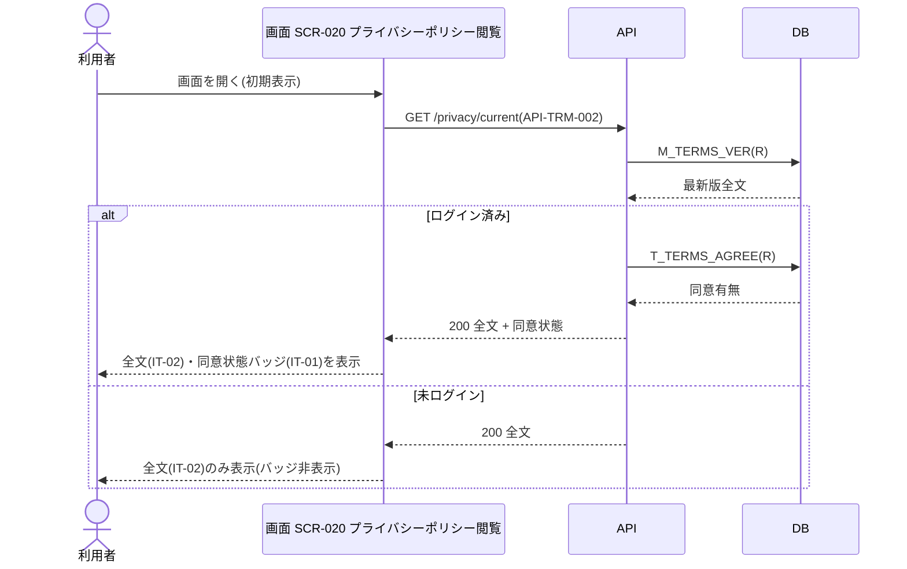

<!-- portal-top -->
[設計ポータル](../../README.md) ／ [要件定義](../index.md) ／ [業務ユースケース](index.md) ／ **UC-SCR-020: プライバシーポリシー閲覧 ユースケース**
<!-- /portal-top -->

# UC-SCR-020: プライバシーポリシー閲覧 ユースケース

> **このページは、画面 SCR-020(プライバシーポリシー閲覧)の画面イベント EV-01〜EV-03 に対応する 3 つのユースケースを「1 イベント = 1 ユースケース」で定義します。**

*版数 v1.0 ・ 更新 2026-06-21 ・ ユースケース 3 ・ ステータス ドラフト*

## 0. イベント↔ユースケース対応表

画面 [SCR-020](../../02_basic_design/01_screens/SCR-020.md#SCR-020) の §6 画面イベント一覧(EV-01〜EV-03)を、ユースケース ID へ 1:1 で対応づけます。種別は、サーバ API・DB へアクセスする「API/DB 連携」と、画面内のみで完結する「クライアント内処理のみ」に区別します。

| イベント ID | イベント名 | ユースケース ID | 種別 |
|----|----|----|----|
| `EV-01` | 初期表示 | [UC-SCR-020-EV01](#UC-SCR-020-EV01) | API/DB 連携 |
| `EV-02` | 「再同意する」を押下 | [UC-SCR-020-EV02](#UC-SCR-020-EV02) | クライアント内処理のみ |
| `EV-03` | 「利用規約」を押下 | [UC-SCR-020-EV03](#UC-SCR-020-EV03) | クライアント内処理のみ |

## 1. ユースケース定義

### UC-SCR-020-EV01 初期表示

> プライバシーポリシー閲覧画面を開いたとき、最新版全文を取得して表示し、ログイン済みのときは同意状態バッジを表示します。

| 項目 | 内容 |
|----|----|
| 利用者 | 全利用者(認証前可。アカウント利用者がログイン済みの場合あり) |
| 事前条件 | SCR-020 の URL にアクセスした(認証不要) |
| トリガー | 画面 SCR-020 を開く(初期表示) |
| 事後条件 | 最新版全文(IT-02)を表示する。ログイン済みのときは同意状態バッジ(IT-01)を表示し、未ログインのときはバッジを非表示にする |
| 関連 | [SCR-020](../../02_basic_design/01_screens/SCR-020.md#SCR-020) ・ [API-TRM-002](../../02_basic_design/03_apis/API-terms.md#API-TRM-002) ・ [FR-099](../FR13.md#FR-099) ・ [FR-101](../FR13.md#FR-101) |

基本フロー

1. 利用者がプライバシーポリシー閲覧画面を開く。
2. 画面はプライバシーポリシー最新版取得 API を呼び出し、最新版全文(IT-02)を表示する。
3. ログイン済みのとき、API は規約同意状況をサーバーサイドで照合し、同意状態バッジ(IT-01)を表示する(同意済みは緑バッジ、未同意は赤バッジ + SCR-015 へのリンク)。
4. 未ログインのとき、画面は同意状態バッジを非表示にし、全文のみを表示する。

異常系フロー

- 最新版取得失敗: 全文を表示せず、エラーメッセージを表示する。

### UC-SCR-020-EV02 「再同意する」を押下

> 未同意バッジ内のリンクを押下し、規約再同意画面へ遷移します(クライアント内処理のみ)。

| 項目 | 内容 |
|----|----|
| 利用者 | ログイン済みで最新版プライバシーポリシーに未同意のアカウント利用者 |
| 事前条件 | 同意状態バッジ(IT-01)が未同意(赤バッジ)で表示されている |
| トリガー | 同意状態バッジ内の「再同意する」リンク(IT-01)を押下する |
| 事後条件 | SCR-015 規約再同意へ遷移する |
| 関連 | [SCR-020](../../02_basic_design/01_screens/SCR-020.md#SCR-020) ・ [SCR-015](../../02_basic_design/01_screens/SCR-015.md#SCR-015) |

クライアント内処理のみ(バックエンド連携なし)。

基本フロー

1. 利用者が「再同意する」リンクを押下する。
2. 画面は SCR-015 規約再同意へ遷移する。

異常系フロー

- なし(画面遷移のみ)。

### UC-SCR-020-EV03 「利用規約」を押下

> 「利用規約」リンクを押下し、利用規約閲覧画面へ遷移します(クライアント内処理のみ)。

| 項目 | 内容 |
|----|----|
| 利用者 | 全利用者(認証前可) |
| 事前条件 | プライバシーポリシー閲覧画面を表示している |
| トリガー | 「利用規約」リンク(IT-03)を押下する |
| 事後条件 | SCR-010 利用規約閲覧へ遷移する |
| 関連 | [SCR-020](../../02_basic_design/01_screens/SCR-020.md#SCR-020) ・ [SCR-010](../../02_basic_design/01_screens/SCR-010.md#SCR-010) |

クライアント内処理のみ(バックエンド連携なし)。

基本フロー

1. 利用者が「利用規約」リンク(IT-03)を押下する。
2. 画面は SCR-010 利用規約閲覧へ遷移する。

異常系フロー

- なし(画面遷移のみ)。

---

<!-- portal-bottom -->
[← 業務ユースケース](index.md) ・ [要件定義](../index.md) ・ [↑ 設計ポータル](../../README.md)
<!-- /portal-bottom -->
