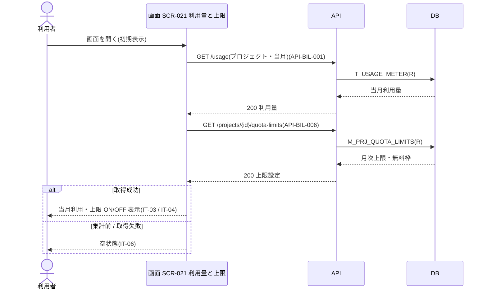
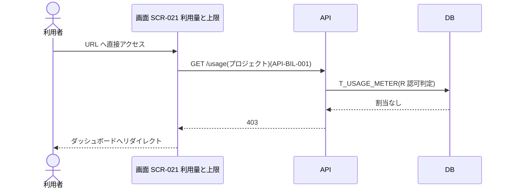

<!-- portal-top -->
[設計ポータル](../../README.md) ／ [要件定義](../index.md) ／ [業務ユースケース](index.md) ／ **UC-SCR-021: 利用量と上限(プロジェクト単位) ユースケース**
<!-- /portal-top -->

# UC-SCR-021: 利用量と上限(プロジェクト単位) ユースケース

> **このページは、画面 SCR-021(利用量と上限(プロジェクト単位))の画面イベント EV-01〜EV-03 に対応する 3 つのユースケースを「1 イベント = 1 ユースケース」で定義します。**

*版数 v1.0 ・ 更新 2026-06-21 ・ ユースケース 3 ・ ステータス ドラフト*

## 0. イベント↔ユースケース対応表

画面 [SCR-021](../../02_basic_design/01_screens/SCR-021.md#SCR-021) の §6 画面イベント一覧(EV-01〜EV-03)を、ユースケース ID へ 1:1 で対応づけます。種別は、サーバ API・DB へアクセスする「API/DB 連携」と、画面内のみで完結する「クライアント内処理のみ」に区別します。

| イベント ID | イベント名 | ユースケース ID | 種別 |
|----|----|----|----|
| `EV-01` | 初期表示 | [UC-SCR-021-EV01](#UC-SCR-021-EV01) | API/DB 連携 |
| `EV-02` | 「アラート設定」を押下 | [UC-SCR-021-EV02](#UC-SCR-021-EV02) | クライアント内処理のみ |
| `EV-03` | URL へ直接アクセス(権限不足) | [UC-SCR-021-EV03](#UC-SCR-021-EV03) | API/DB 連携 |

## 1. ユースケース定義

### UC-SCR-021-EV01 初期表示

> 利用量と上限画面を開いたとき、当該プロジェクトの当月利用量と月次上限設定を取得し、上限 ON / OFF に応じて質問数サマリーと消化率を表示します。

| 項目 | 内容 |
|----|----|
| 利用者 | オーナー / 当該プロジェクトのメンバー |
| 事前条件 | ログイン済みで、当該プロジェクトへの割当がある |
| トリガー | 画面 SCR-021 を開く(初期表示) |
| 事後条件 | 当月利用を IT-03・IT-04 に表示し、月次上限設定を IT-03 に反映する。上限 ON/OFF に応じて IT-03・IT-04 の表示を切り替える。集計前 / 取得失敗時は空状態(IT-06)を表示する |
| 関連 | [SCR-021](../../02_basic_design/01_screens/SCR-021.md#SCR-021) ・ [API-BIL-001](../../02_basic_design/03_apis/API-billing.md#API-BIL-001) ・ [API-BIL-006](../../02_basic_design/03_apis/API-billing.md#API-BIL-006) ・ [FR-088](../01_specifications/FR-088.md#FR-088) ・ [FR-089](../01_specifications/FR-089.md#FR-089) |

基本フロー

1. 利用者が利用量と上限画面を開く。
2. 画面は利用量サマリ(プロジェクト)API で当月利用を取得し、IT-03・IT-04 に表示する。
3. 画面はプロジェクト上限・アラート取得 API で月次上限設定を取得し、IT-03 に反映する。
4. 上限 ON のとき、画面は消化率・課金計算式を表示する。上限 OFF のとき、画面は OFF に対応した表示を行う(IT-03・IT-04 の ON/OFF 表示切替)。

異常系フロー

- 集計前 / 取得失敗: 空状態(IT-06)を表示する(集計前は「集計中です」、取得失敗はフォールバック表示)。
- 認可エラー(403): 当該プロジェクトへの割当がない場合、権限不足とし、ダッシュボードへリダイレクトする(EV-03 で扱う)。

### UC-SCR-021-EV02 「アラート設定」を押下

> 「アラート設定」を押下し、質問数上限設定モーダルを開きます(クライアント内処理のみ)。

| 項目 | 内容 |
|----|----|
| 利用者 | オーナー / 当該プロジェクトのメンバー |
| 事前条件 | 利用量と上限画面を表示している |
| トリガー | 「アラート設定」(IT-05)を押下する |
| 事後条件 | 質問数上限設定モーダル([SCR-021-001](../../02_basic_design/01_screens/SCR-021-001.md#SCR-021-001))を開く |
| 関連 | [SCR-021](../../02_basic_design/01_screens/SCR-021.md#SCR-021) ・ [SCR-021-001](../../02_basic_design/01_screens/SCR-021-001.md#SCR-021-001) |

基本フロー

1. 利用者が「アラート設定」(IT-05)を押下する。
2. 画面は質問数上限設定モーダル([SCR-021-001](../../02_basic_design/01_screens/SCR-021-001.md#SCR-021-001))を開く。

異常系フロー

- なし(モーダル起動のみ。上限・アラート設定はモーダル SCR-021-001 で行う)。

クライアント内処理のみのため、シーケンス図は省略します。

### UC-SCR-021-EV03 URL へ直接アクセス(権限不足)

> 当該プロジェクトに割当のないユーザーが URL に直接アクセスした場合、403 を返してダッシュボードへリダイレクトします。

| 項目 | 内容 |
|----|----|
| 利用者 | 当該プロジェクトに割当のないログイン済みユーザー |
| 事前条件 | ログイン済みだが、当該プロジェクトへの割当がない |
| トリガー | SCR-021 の URL に直接アクセスする |
| 事後条件 | 権限不足ガード(IT-07)により 403 を返し、ダッシュボードへリダイレクトする |
| 関連 | [SCR-021](../../02_basic_design/01_screens/SCR-021.md#SCR-021) ・ [API-BIL-001](../../02_basic_design/03_apis/API-billing.md#API-BIL-001) |

基本フロー

1. 当該プロジェクトに割当のないユーザーが SCR-021 の URL に直接アクセスする。
2. 画面は利用量取得 API を呼び出す。
3. API は認可を検証し、割当がないため 403 を返す。
4. 画面はダッシュボードへリダイレクトする。

異常系フロー

- なし(本イベント自体が認可エラー時の挙動)。

---

<!-- portal-bottom -->
[← 業務ユースケース](index.md) ・ [要件定義](../index.md) ・ [↑ 設計ポータル](../../README.md)
<!-- /portal-bottom -->
