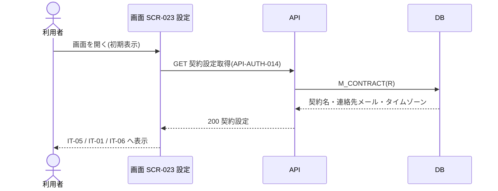
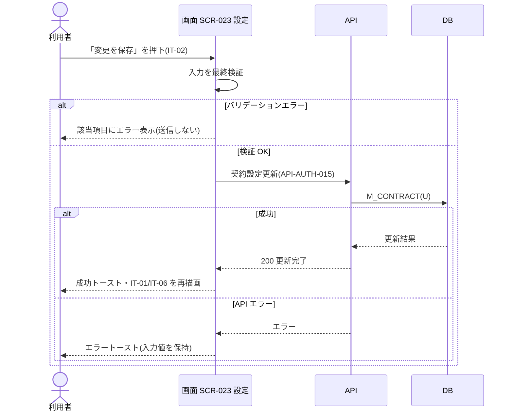

<!-- portal-top -->
[設計ポータル](../../README.md) ／ [要件定義](../index.md) ／ [業務ユースケース](index.md) ／ **UC-SCR-023: 設定 ユースケース**
<!-- /portal-top -->

# UC-SCR-023: 設定 ユースケース

> **このページは、画面 SCR-023(設定)の画面イベント EV-01〜EV-07 に対応する 7 のユースケースを「1 イベント = 1 ユースケース」で定義します。**

*版数 v1.0 ・ 更新 2026-06-21 ・ ユースケース 7 ・ ステータス ドラフト*

## 0. イベント↔ユースケース対応表

画面 [SCR-023](../../02_basic_design/01_screens/SCR-023.md#SCR-023) の §6 画面イベント一覧(EV-01〜EV-07)を、ユースケース ID へ 1:1 で対応づけます。種別は、サーバ API・DB へアクセスする「API/DB 連携」と、画面内のみで完結する「クライアント内処理のみ」に区別します。

| イベント ID | イベント名 | ユースケース ID | 種別 |
|----|----|----|----|
| `EV-01` | 初期表示 | [UC-SCR-023-EV01](#UC-SCR-023-EV01) | API/DB 連携 |
| `EV-02` | 請求・重要通知メールを入力 | [UC-SCR-023-EV02](#UC-SCR-023-EV02) | クライアント内処理のみ |
| `EV-03` | 「変更を保存」を押下 | [UC-SCR-023-EV03](#UC-SCR-023-EV03) | API/DB 連携 |
| `EV-04` | 「退会手続きへ」を押下 | [UC-SCR-023-EV04](#UC-SCR-023-EV04) | クライアント内処理のみ |
| `EV-05` | 「請求」を押下 | [UC-SCR-023-EV05](#UC-SCR-023-EV05) | クライアント内処理のみ |
| `EV-06` | タイムゾーンを選択 | [UC-SCR-023-EV06](#UC-SCR-023-EV06) | クライアント内処理のみ |
| `EV-07` | 「変更を破棄」を押下 | [UC-SCR-023-EV07](#UC-SCR-023-EV07) | クライアント内処理のみ |

## 1. ユースケース定義

### UC-SCR-023-EV01 初期表示

> 設定画面を開いたとき、契約名・連絡先メール・タイムゾーンを取得して各項目へ表示します。

| 項目 | 内容 |
|----|----|
| 利用者 | オーナー(本画面はオーナー専有) |
| 事前条件 | ログイン済みで、オーナーである |
| トリガー | 画面 SCR-023 を開く(初期表示) |
| 事後条件 | 契約名(IT-05)・連絡先メール(IT-01)・タイムゾーン(IT-06)を取得して各項目へ表示する。オーナー以外は権限不足を表示し本画面を描画しない |
| 関連 | [SCR-023](../../02_basic_design/01_screens/SCR-023.md#SCR-023) ・ [API-AUTH-014](../../02_basic_design/03_apis/API-auth.md#API-AUTH-014) ・ [FR-009](../01_specifications/FR-009.md#FR-009) |

基本フロー

1. 利用者が設定画面を開く。
2. 画面は契約設定取得 API を呼び出す。
3. API は契約名・連絡先メール・タイムゾーンを取得して返す。
4. 画面は契約名(IT-05)・連絡先メール(IT-01)・タイムゾーン(IT-06)を各項目へ表示する。

異常系フロー

- 権限なし(オーナー以外の URL 直アクセス): 権限不足を表示し、本画面を描画しない。
- 取得失敗: 各項目を表示せず、エラーメッセージを表示する。

### UC-SCR-023-EV02 請求・重要通知メールを入力

> 連絡先メール欄に入力すると、メール形式をリアルタイムで検証し、不正時は保存ボタンを無効化します(クライアント内処理のみ)。

| 項目 | 内容 |
|----|----|
| 利用者 | オーナー(本画面はオーナー専有) |
| 事前条件 | SCR-023 が表示済み |
| トリガー | 請求・重要通知メール(IT-01)へ入力する |
| 事後条件 | 妥当なら入力を受け付ける。メール形式不正時は IT-01 下部にインラインエラーを表示し「変更を保存」(IT-02)を無効化する |
| 関連 | [SCR-023](../../02_basic_design/01_screens/SCR-023.md#SCR-023) |

基本フロー

1. 利用者が請求・重要通知メール(IT-01)へ入力する。
2. 画面は入力値をリアルタイムでバリデーションする。
3. 妥当なら入力を受け付ける。

異常系フロー

- メール形式不正: IT-01 下部にインラインエラーを表示し、「変更を保存」(IT-02)を無効化する。

クライアント内処理のみのため、シーケンス図は省略します。

### UC-SCR-023-EV03 「変更を保存」を押下

> 「変更を保存」を押下すると、入力を最終検証して連絡先メール・タイムゾーンを更新し、成功時に値を再描画します。

| 項目 | 内容 |
|----|----|
| 利用者 | オーナー(本画面はオーナー専有) |
| 事前条件 | SCR-023 が表示済みで、入力にバリデーションエラーがない |
| トリガー | 「変更を保存」(IT-02)を押下する |
| 事後条件 | 成功時は連絡先メール・タイムゾーンを更新し、成功トーストを表示して IT-01・IT-06 を更新後の値で再描画する。失敗時は値を保持しエラー表示する |
| 関連 | [SCR-023](../../02_basic_design/01_screens/SCR-023.md#SCR-023) ・ [API-AUTH-015](../../02_basic_design/03_apis/API-auth.md#API-AUTH-015) ・ [FR-009](../01_specifications/FR-009.md#FR-009) |

基本フロー

1. 利用者が「変更を保存」(IT-02)を押下する。
2. 画面は入力値を最終バリデーションする。
3. 画面は契約設定更新 API を呼び出し、連絡先メール・タイムゾーンを更新する。
4. 成功時、画面は成功トースト(「設定を更新しました」)を表示し、IT-01・IT-06 を更新後の値で再描画する。

異常系フロー

- バリデーションエラー: エラー内容を該当項目下部に表示し、送信しない。
- API エラー: エラートーストを表示し、入力値を保持する。

### UC-SCR-023-EV04 「退会手続きへ」を押下

> DangerSection の「退会手続きへ」を押下し、退会画面へ遷移します(クライアント内処理のみ)。

| 項目 | 内容 |
|----|----|
| 利用者 | オーナー(本画面はオーナー専有) |
| 事前条件 | 設定画面を表示している |
| トリガー | 「退会手続きへ」(IT-04)を押下する |
| 事後条件 | SCR-014 退会画面へ遷移する |
| 関連 | [SCR-023](../../02_basic_design/01_screens/SCR-023.md#SCR-023) ・ [SCR-014](../../02_basic_design/01_screens/SCR-014.md#SCR-014) |

基本フロー

1. 利用者が「退会手続きへ」(IT-04)を押下する。
2. 画面は SCR-014 退会画面へ遷移する。

異常系フロー

- なし(画面遷移のみ。退会の入力・再認証・確定は SCR-014 で行う)。

クライアント内処理のみ(画面遷移)のため、シーケンス図は省略します。

### UC-SCR-023-EV05 「請求」を押下

> ナビゲーションメニューの「請求」を押下し、請求画面へ遷移します(クライアント内処理のみ)。

| 項目 | 内容 |
|----|----|
| 利用者 | オーナー(本画面はオーナー専有) |
| 事前条件 | 設定画面を表示している |
| トリガー | ナビゲーションメニューの「請求」を押下する |
| 事後条件 | SCR-022 請求画面へ遷移する |
| 関連 | [SCR-023](../../02_basic_design/01_screens/SCR-023.md#SCR-023) ・ [SCR-022](../../02_basic_design/01_screens/SCR-022.md#SCR-022) |

基本フロー

1. 利用者がナビゲーションメニューの「請求」を押下する。
2. 画面は SCR-022 請求画面へ遷移する。

異常系フロー

- なし(画面遷移のみ)。

クライアント内処理のみ(画面遷移)のため、シーケンス図は省略します。

### UC-SCR-023-EV06 タイムゾーンを選択

> タイムゾーンのドロップダウンで選択した値を IT-06 に反映します(クライアント内処理のみ)。

| 項目 | 内容 |
|----|----|
| 利用者 | オーナー(本画面はオーナー専有) |
| 事前条件 | SCR-023 が表示済み |
| トリガー | タイムゾーン(IT-06)を選択する |
| 事後条件 | 選択値を IT-06 に反映する(保存は EV-03 で実行) |
| 関連 | [SCR-023](../../02_basic_design/01_screens/SCR-023.md#SCR-023) |

基本フロー

1. 利用者がタイムゾーン(IT-06)のドロップダウンで値を選択する。
2. 画面は選択値を IT-06 に反映する。

異常系フロー

- なし。

クライアント内処理のみのため、シーケンス図は省略します。

### UC-SCR-023-EV07 「変更を破棄」を押下

> 「変更を破棄」を押下すると、入力中の連絡先メール・タイムゾーンを初期表示時の値へリセットします(クライアント内処理のみ)。

| 項目 | 内容 |
|----|----|
| 利用者 | オーナー(本画面はオーナー専有) |
| 事前条件 | SCR-023 が表示済み |
| トリガー | 「変更を破棄」(IT-07)を押下する |
| 事後条件 | IT-01(連絡先メール)・IT-06(タイムゾーン)の入力内容を破棄し、初期表示時に取得した値へリセットする |
| 関連 | [SCR-023](../../02_basic_design/01_screens/SCR-023.md#SCR-023) |

基本フロー

1. 利用者が「変更を破棄」(IT-07)を押下する。
2. 画面は IT-01・IT-06 の入力内容を破棄し、初期表示時に取得した値へリセットする。

異常系フロー

- なし。

クライアント内処理のみのため、シーケンス図は省略します。

---

<!-- portal-bottom -->
[← 業務ユースケース](index.md) ・ [要件定義](../index.md) ・ [↑ 設計ポータル](../../README.md)
<!-- /portal-bottom -->
