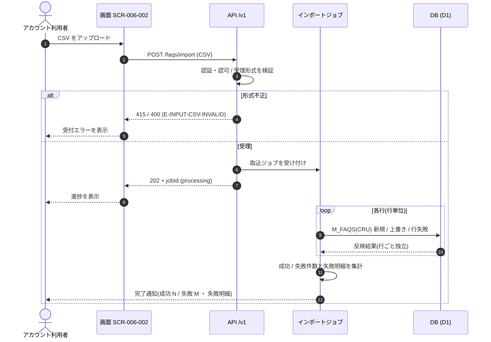

<!-- portal-top -->
[設計ポータル](../../README.md) ／ [要件定義](../index.md) ／ [業務ユースケース](index.md) ／ **UC-SYSTEM-001: 非同期 CSV インポートジョブ**
<!-- /portal-top -->

# UC-SYSTEM-001: 非同期 CSV インポートジョブ

> **このページは、FAQ CSV インポートの受付(202 + ジョブ ID)から、ジョブが行単位で FAQ を取り込み、成功 / 失敗件数を集計して完了を通知するまでのシステムユースケースを定義します。**

*版数 v1.0 ・ 更新 2026-06-21 ・ 種別 非同期ジョブ ・ ステータス ドラフト*

## 1. 概要

アカウント利用者が [SCR-006-002](../../02_basic_design/01_screens/SCR-006-002.md#SCR-006-002) FAQ CSV インポートモーダルからアップロードした CSV を、[API-FAQ-004](../../02_basic_design/03_apis/API-faq.md#API-FAQ-004)(`POST /faqs/import`)が受理形式検証のうえ受け付け、`jobId` を即時返却(202)する。実体の取り込みは**非同期ジョブ**が担い、CSV を行単位で読み、各行を新規登録 / 上書き / 行失敗のいずれかとして `M_FAQS(CRU)` へ反映する。全行処理後に成功件数・失敗件数(失敗理由付き)を集計し、アカウント利用者へ完了を通知する。

| 項目 | 内容 |
|---|---|
| 目的 | 大量 FAQ の一括取り込みを、画面応答をブロックせずに非同期で完了させる |
| 関連要件 | [FR-169](../01_specifications/FR-169.md#FR-169) FAQ CSV 一括取り込み(新規 / 上書き / 部分失敗の確認) |
| 主テーブル | `M_FAQS(CRU)` |
| 関連 API | [API-FAQ-004](../../02_basic_design/03_apis/API-faq.md#API-FAQ-004)(受付) |

## 2. 利用者(アクター)

| アクター | 役割 |
|---|---|
| アカウント利用者 | [SCR-006-002](../../02_basic_design/01_screens/SCR-006-002.md#SCR-006-002) から CSV をアップロードし、完了通知と部分失敗明細を受け取る |
| 画面 SCR-006-002 | アップロードと受付応答(`jobId`)の表示、進捗・完了の提示を担う |
| インポートジョブ(システム) | 受け付けた CSV を行単位で取り込み、件数集計と完了通知を行う |

## 3. 事前条件

- アカウント利用者が当該プロジェクトの編集権限(オーナー / メンバー)を持つ。
- アップロード対象が CSV(UTF-8、BOM 許容、ヘッダ行あり、1 ファイル最大 1000 件、列構成 `FAQ ID, 質問, 回答, カテゴリ`)である。
- [API-FAQ-004](../../02_basic_design/03_apis/API-faq.md#API-FAQ-004) が受理形式検証を通過し、取込ジョブを受け付け済み(202 + `jobId`)である。

## 4. トリガー

非同期ジョブ。[API-FAQ-004](../../02_basic_design/03_apis/API-faq.md#API-FAQ-004) が CSV を受理して取込ジョブを受け付けたことを契機に起動する。

## 5. 基本フロー

1. [API-FAQ-004](../../02_basic_design/03_apis/API-faq.md#API-FAQ-004) が認証・認可と受理形式(CSV / UTF-8 / ヘッダ行 / 件数上限 1000)を検証し、合格時に取込ジョブを受け付けて `jobId` と受付状態(`processing`)を 202 で返す。
2. 画面 SCR-006-002 は `jobId` を受け取り、進捗表示に切り替える。
3. インポートジョブが CSV を行単位で読み込む。
4. ジョブは各行の `FAQ ID` を判定し、`M_FAQS(CRU)` へ反映する。
   1. `FAQ ID` 空欄: 新規登録(`status=draft`)。
   2. 既存 `FAQ ID` 一致: 既存 FAQ を上書き(状態維持)。
   3. 当該契約に存在しない `FAQ ID`: 当該行を失敗扱いとし、理由を明細へ記録する(他行の処理は継続)。
5. 全行を処理後、成功件数・失敗件数と失敗明細(行番号・理由)を集計する。
6. ジョブはアカウント利用者へ取り込み完了を通知し、成功 / 失敗件数と部分失敗明細を提示する。

> [!NOTE]
> 全文検索の連動更新(`TP_FAQ_FTS`)・件数メータ加算などインポートに伴う内部副作用は、それぞれの担当システム処理で扱う。本ユースケースは行単位の取り込みと件数集計・完了通知までを範囲とする。

## 6. 異常系フロー

- **受付前の形式不正**(CSV 以外 / UTF-8 不正 / ヘッダ行欠落 / 件数上限超過): [API-FAQ-004](../../02_basic_design/03_apis/API-faq.md#API-FAQ-004) が受付前に 415 / 400(`E-INPUT-CSV-INVALID`)で拒否し、ジョブは起動しない。画面はエラーを提示する。
- **行単位エラー**(当該契約に存在しない `FAQ ID` = `E-INPUT-CSV-FAQID-NOTFOUND`、必須列欠落など): 当該行のみを失敗扱いとし、成功分は反映する。1 行の失敗は他行の取り込みに影響しない。失敗明細は完了通知で確認できる。

## 7. 事後条件

- 成功した行が `M_FAQS` に反映され、失敗した行は反映されない。
- **各行の成否は独立**しており、1 行の失敗が他行の取り込み結果に影響しない(部分失敗時も成功分は確定する)。
- アカウント利用者へ完了が通知され、成功件数・失敗件数・失敗理由を確認できる([FR-169](../01_specifications/FR-169.md#FR-169))。

## 8. シーケンス図

---

<!-- portal-bottom -->
[← 業務ユースケース](index.md) ・ [要件定義](../index.md) ・ [↑ 設計ポータル](../../README.md)
<!-- /portal-bottom -->
