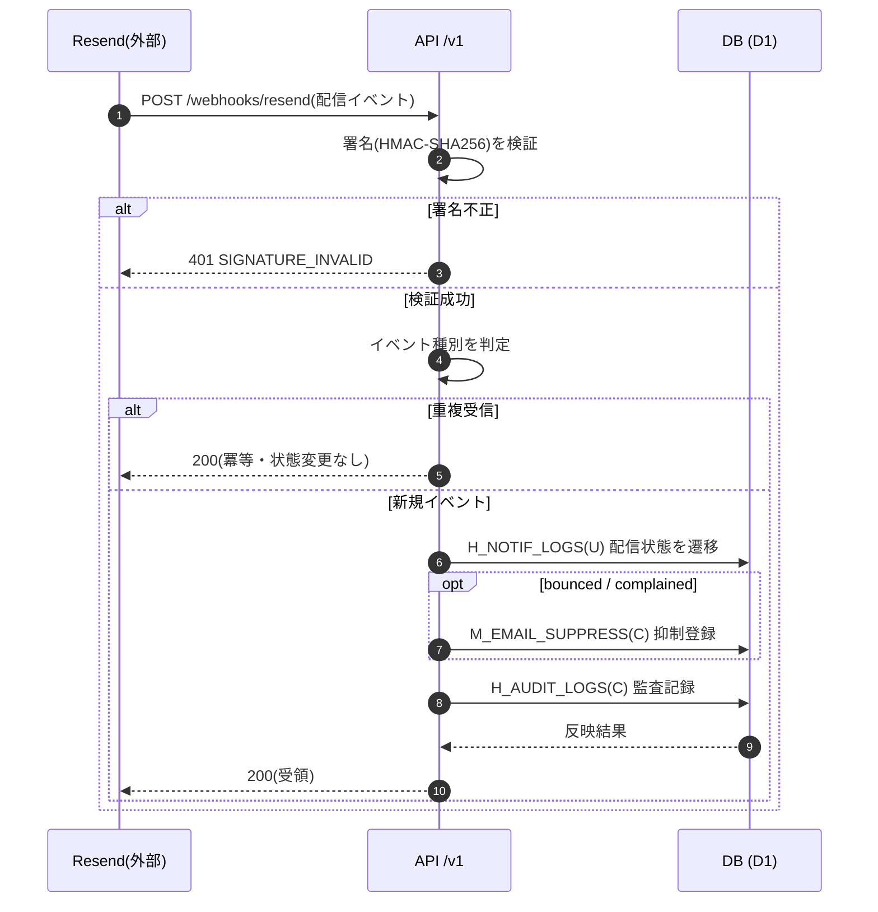

<!-- portal-top -->
[設計ポータル](../../README.md) ／ [要件定義](../index.md) ／ [業務ユースケース](index.md) ／ **UC-SYSTEM-002: Resend Webhook 受信(配信状態更新)**
<!-- /portal-top -->

# UC-SYSTEM-002: Resend Webhook 受信(配信状態更新)

> **このページは、メール配信事業者 Resend から受信した配信イベント Webhook を署名検証し、配信状態(`H_NOTIF_LOGS`)を更新し、バウンス / 苦情の宛先を抑制リスト(`M_EMAIL_SUPPRESS`)へ登録するシステムユースケースを定義します。**

*版数 v1.0 ・ 更新 2026-06-21 ・ 種別 Webhook受信 ・ ステータス ドラフト*

## 1. 概要

外部メール配信事業者 Resend が送信する配信イベント Webhook を [API-WHK-001](../../02_basic_design/03_apis/API-webhook.md#API-WHK-001)(`POST /webhooks/resend`)が受信する。署名(HMAC-SHA256)を検証し、イベント種別(`delivered` / `bounced` / `complained` / `delivery_delayed`)を判定して該当通知ログの配信状態 `H_NOTIF_LOGS(U)` を更新する。`bounced` / `complained` の場合は宛先を `M_EMAIL_SUPPRESS(C)` に追加し、以降の配信を抑制する。処理は監査ログ `H_AUDIT_LOGS(C)` に記録する。

| 項目 | 内容 |
|---|---|
| 目的 | メール配信の到達状態を非同期に反映し、バウンス / 苦情の宛先への配信を停止する |
| 関連要件 | [FR-084](../FR11.md#FR-084) バウンス・無効アドレスの検知と通知停止 |
| 主テーブル | `H_NOTIF_LOGS(U)` ・ `M_EMAIL_SUPPRESS(C)` ・ `H_AUDIT_LOGS(C)` |
| 関連 API | [API-WHK-001](../../02_basic_design/03_apis/API-webhook.md#API-WHK-001)(受信) |

## 2. 利用者(アクター)

| アクター | 役割 |
|---|---|
| Resend(外部) | 配信イベント(delivered / bounced / complained / delivery_delayed)を Webhook で送信する |
| Webhook 受信処理(システム) | 署名検証・種別判定・配信状態更新・抑制登録・監査記録を行う |

## 3. 事前条件

- 対象メールが Resend 経由で送信済みで、対応する通知ログ(`H_NOTIF_LOGS`)が存在する。
- Resend 署名検証用の鍵が設定されている。

## 4. トリガー

Webhook 受信。Resend が [API-WHK-001](../../02_basic_design/03_apis/API-webhook.md#API-WHK-001)(`POST /webhooks/resend`)へ配信イベントを送信したことを契機に起動する。

## 5. 基本フロー

1. Resend が配信イベント Webhook を [API-WHK-001](../../02_basic_design/03_apis/API-webhook.md#API-WHK-001) へ送信する。
2. システムが Resend 署名(HMAC-SHA256)を検証する。
3. イベント種別(`email.delivered` / `email.bounced` / `email.complained` / `email.delivery_delayed`)を判定する。
4. 対象メッセージに対応する通知ログの配信状態 `H_NOTIF_LOGS(U)` を、判定した種別へ遷移する。
5. 種別が `bounced` または `complained` の場合は、宛先を `M_EMAIL_SUPPRESS(C)` に追加し、以降の配信を抑制対象とする(全契約横断)。
6. 処理内容を `H_AUDIT_LOGS(C)` に記録する。
7. 受領応答(200)を返す。

> [!NOTE]
> 抑制リストへの登録は[FR-084](../FR11.md#FR-084)に基づく配信停止の起点であり、登録後の通知停止・管理者への通知は通知系のシステム処理が扱う。

## 6. 異常系フロー

- **署名検証失敗**: `SIGNATURE_INVALID`(401)を返し、配信状態・抑制リストを変更しない。
- **重複受信**: 同一イベントの再受信は冪等に扱い、配信状態・抑制リストを変更せず既存の処理結果に基づく受領応答(200)を返す。

## 7. 事後条件

- 対象通知ログの配信状態が受信イベントに整合して更新されている。
- `bounced` / `complained` の宛先が抑制リストに登録され、以降の配信が抑制される([FR-084](../FR11.md#FR-084))。
- 署名不正のイベントによる状態変更は行われない。重複受信でも結果は一意(冪等)。
- 処理が監査ログに記録されている。

## 8. シーケンス図

---

<!-- portal-bottom -->
[← 業務ユースケース](index.md) ・ [要件定義](../index.md) ・ [↑ 設計ポータル](../../README.md)
<!-- /portal-bottom -->
