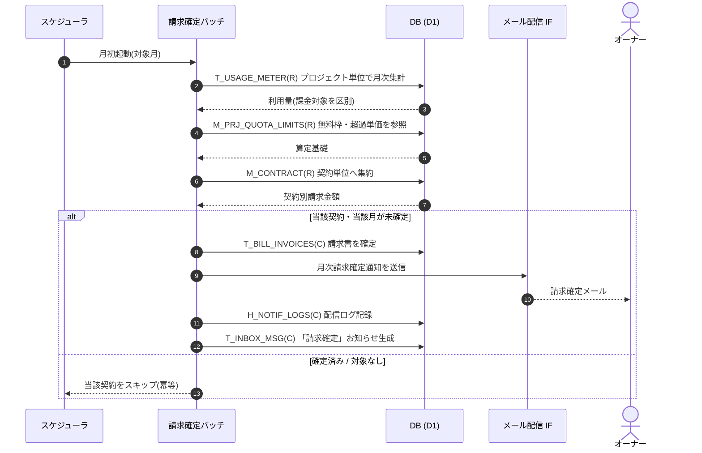

<!-- portal-top -->
[設計ポータル](../../README.md) ／ [要件定義](../index.md) ／ [業務ユースケース](index.md) ／ **UC-SYSTEM-004: 月次請求確定バッチ**
<!-- /portal-top -->

# UC-SYSTEM-004: 月次請求確定バッチ

> **このページは、月次境界(JST 暦月)経過後に、プロジェクト単位で計測した利用量を契約単位へ集約し、請求書を確定したうえで、確定通知メールと受信箱お知らせを生成する月次バッチのシステムユースケースを定義します。**

*版数 v1.0 ・ 更新 2026-06-21 ・ 種別 定期バッチ(月次) ・ ステータス ドラフト*

## 1. 概要

月次バッチが、対象月(JST 暦月)の利用量 `T_USAGE_METER(R)` をプロジェクト単位で月次集計し、無料枠・超過単価(`M_PRJ_QUOTA_LIMITS(R)`)に基づき超過分を算定する。算定結果を契約単位(`M_CONTRACT(R)`)へ集約し、請求書 `T_BILL_INVOICES(C)` を確定する。確定後、当該契約のオーナーへ月次請求確定通知(メール配信 IF + `H_NOTIF_LOGS(C)`)を送り、同時にお知らせ受信箱 `T_INBOX_MSG(C)` に「請求確定」のお知らせを生成する。同一契約・同一請求月の二重請求は行わない。サスペンション中の契約は集計対象外とする。

| 項目 | 内容 |
|---|---|
| 目的 | 月次の利用量を契約単位で確定請求し、オーナーへ請求確定を通知する |
| 関連要件 | [FR-064](../FR09.md#FR-064) 利用量集計 ・ [FR-090](../FR11.md#FR-090) 月次請求確定通知 |
| 主テーブル | `T_USAGE_METER(R)` ・ `M_PRJ_QUOTA_LIMITS(R)` ・ `M_CONTRACT(R)` ・ `T_BILL_INVOICES(C)` ・ `T_INBOX_MSG(C)` ・ `H_NOTIF_LOGS(C)` |
| 関連 API | [API-BIL-003](../../02_basic_design/03_apis/API-billing.md#API-BIL-003) 請求サマリ(確定結果の参照) ・ [API-MAIL-001](../../02_basic_design/03_apis/API-mail.md#API-MAIL-001) メール配信 IF |

## 2. 利用者(アクター)

| アクター | 役割 |
|---|---|
| スケジューラ(システム) | 月初に当月確定バッチを起動する |
| 請求確定バッチ(システム) | 月次集計・契約単位集約・請求書確定・確定通知生成を行う |
| メール配信 IF(システム) | 確定通知メールを宛先(オーナー)へ送信する |

## 3. 事前条件

- 対象月が JST 暦月で締まっており、当該月の利用量が `T_USAGE_METER` に計測済みである。
- 課金対象の無料枠・超過単価が `M_PRJ_QUOTA_LIMITS` に保持されている。
- 対象契約の状態が請求対象(`active`)である(`suspended` は集計対象外)。

## 4. トリガー

定期バッチ(月次)。スケジューラが月初に当月分の請求確定バッチを起動する。

## 5. 基本フロー

1. スケジューラが請求確定バッチを起動する。
2. バッチが対象月の利用量 `T_USAGE_METER(R)` をプロジェクト単位で月次集計する。推論失敗で課金対象外として区別された計測は請求対象から除く。
3. プロジェクトごとに無料枠・超過単価 `M_PRJ_QUOTA_LIMITS(R)` を参照し、質問数・FAQ 件数の超過分を算定する。
4. 算定結果を契約単位 `M_CONTRACT(R)` へ集約し、契約全体の請求金額を確定する。
5. 確定済みかを判定し、当該契約・当該請求月の請求書が未確定の場合のみ `T_BILL_INVOICES(C)` に請求書を確定する(同一月の二重確定は行わない)。
6. バッチが当該契約のオーナーへ月次請求確定通知をメール配信 IF([API-MAIL-001](../../02_basic_design/03_apis/API-mail.md#API-MAIL-001))で送信し、`H_NOTIF_LOGS(C)` に配信ログを記録する。
7. 同時に当該オーナーのお知らせ受信箱 `T_INBOX_MSG(C)` へ「請求確定」のお知らせを生成する([FR-090](../FR11.md#FR-090))。

> [!NOTE]
> 利用量のリアルタイム集計・UI 反映は [UC-SYSTEM-010](UC-SYSTEM-010.md#UC-SYSTEM-010) の範囲である。本ユースケースは月次境界経過後の確定請求と確定通知の生成を範囲とする。

## 6. 異常系フロー

- **対象なし**: 対象月に請求対象の利用が無い契約は請求書を生成せず、当該契約をスキップして処理を継続する。
- **二重確定**: 当該契約・当該請求月の請求書が既に確定済みの場合は確定・通知を行わず、冪等に当該契約をスキップする。
- **通知配信失敗**: 請求書は確定済みとし、確定通知の配信失敗は `H_NOTIF_LOGS` に失敗として記録する。再送は [UC-SYSTEM-009](UC-SYSTEM-009.md#UC-SYSTEM-009) 通知再送が扱う。

## 7. 事後条件

- 対象月・対象契約の請求書が `T_BILL_INVOICES` に確定し、契約単位の請求金額が確定する。
- 同一契約・同一請求月の請求書は一意で、二重請求が発生しない。
- オーナーへ確定通知メールが送信され、お知らせ受信箱に「請求確定」のお知らせが生成される([FR-090](../FR11.md#FR-090))。
- サスペンション中の契約は請求対象外として扱われる。

## 8. シーケンス図

---

<!-- portal-bottom -->
[← 業務ユースケース](index.md) ・ [要件定義](../index.md) ・ [↑ 設計ポータル](../../README.md)
<!-- /portal-bottom -->
