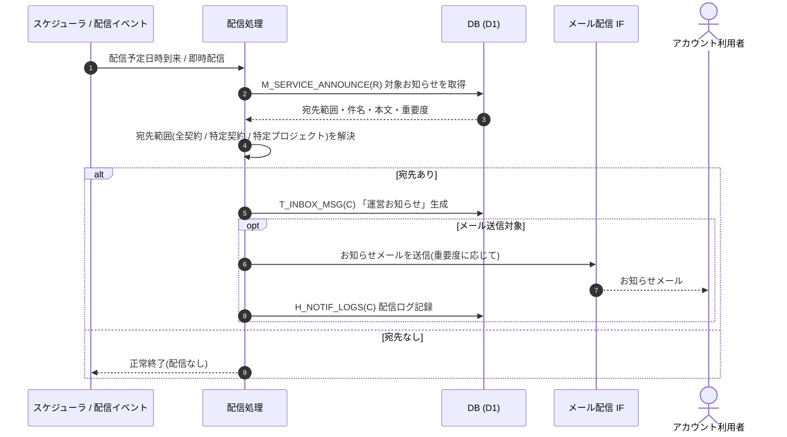

<!-- portal-top -->
[設計ポータル](../../README.md) ／ [要件定義](../index.md) ／ [業務ユースケース](index.md) ／ **UC-SYSTEM-005: 運営お知らせ配信**
<!-- /portal-top -->

# UC-SYSTEM-005: 運営お知らせ配信

> **このページは、サービス運営側が登録したお知らせ(メンテナンス予告・機能追加・規約改定・価格改定 等)を、指定した配信予定日時または即時配信イベントを契機に、対象範囲のアカウント利用者へ受信箱お知らせとメールで配信するシステムユースケースを定義します。**

*版数 v1.0 ・ 更新 2026-06-21 ・ 種別 スケジュール / イベントドリブン ・ ステータス ドラフト*

## 1. 概要

運営が登録したお知らせ `M_SERVICE_ANNOUNCE(R)` を、指定された配信予定日時の到来(スケジュール)または即時配信イベントを契機に配信する。配信処理は宛先範囲(全契約 / 特定契約 / 特定プロジェクト)を解決し、対象アカウント利用者のお知らせ受信箱 `T_INBOX_MSG(C)` に「運営お知らせ」を生成する。あわせて重要度(`normal` / `high` / `critical`)に応じてメール配信 IF でお知らせメールを送信し、`H_NOTIF_LOGS(C)` に配信ログを記録する。`critical`(規約改定・価格改定・重要セキュリティ 等)は強制送信でオプトアウト不可、`normal` はオプトアウト可とする。

| 項目 | 内容 |
|---|---|
| 目的 | 運営お知らせを対象範囲のアカウント利用者へ受信箱とメールで届ける |
| 関連要件 | [FR-091](../FR11.md#FR-091) 任意お知らせのメール通知 ・ [FR-116](../FR15.md#FR-116) お知らせ一覧 |
| 主テーブル | `M_SERVICE_ANNOUNCE(R)` ・ `T_INBOX_MSG(C)` ・ `H_NOTIF_LOGS(C)` |
| 関連 API | [API-ANN-001](../../02_basic_design/03_apis/API-inbox.md#API-ANN-001) お知らせ一覧(受信側参照) ・ [API-MAIL-001](../../02_basic_design/03_apis/API-mail.md#API-MAIL-001) メール配信 IF |

## 2. 利用者(アクター)

| アクター | 役割 |
|---|---|
| スケジューラ(システム) | 配信予定日時の到来でお知らせ配信を起動する |
| 配信イベント(システム) | 即時配信指定時に配信処理を起動する |
| お知らせ配信処理(システム) | 宛先範囲解決・受信箱生成・メール送信・配信ログ記録を行う |
| メール配信 IF(システム) | 重要度に応じてお知らせメールを送信する |

## 3. 事前条件

- 配信対象のお知らせが `M_SERVICE_ANNOUNCE` に登録され、宛先範囲・件名・本文・重要度・配信予定日時が確定している。
- 配信対象のアカウント利用者が解決可能である(全契約 / 特定契約 / 特定プロジェクト)。

## 4. トリガー

スケジュール / イベントドリブン。配信予定日時の到来(スケジューラ)、または即時配信指定時の配信イベントを契機に起動する。

## 5. 基本フロー

1. スケジューラが配信予定日時の到来を検知、または即時配信イベントが発生し、お知らせ配信処理を起動する。
2. 配信処理が対象お知らせ `M_SERVICE_ANNOUNCE(R)` を読み、宛先範囲(全契約 / 特定契約 / 特定プロジェクト)を解決する。
3. 解決した各アカウント利用者のお知らせ受信箱 `T_INBOX_MSG(C)` に「運営お知らせ」を生成する。
4. 重要度を判定し、メール送信対象の宛先へお知らせメールをメール配信 IF([API-MAIL-001](../../02_basic_design/03_apis/API-mail.md#API-MAIL-001))で送信する。`critical` は強制送信(オプトアウト不可)、`normal` はオプトアウト設定に従う。
5. メール送信結果を `H_NOTIF_LOGS(C)` に配信ログとして記録する。
6. 受信者は管理画面のお知らせ一覧([API-ANN-001](../../02_basic_design/03_apis/API-inbox.md#API-ANN-001))で当該お知らせを確認できる([FR-116](../FR15.md#FR-116))。

> [!NOTE]
> 件名・本文テンプレート全文・配信先解決・重要度別の強制送信ルールは メール設計書 を正本とする。本ユースケースは配信契機から受信箱生成・メール送信までの流れを範囲とする。

## 6. 異常系フロー

- **宛先なし**: 宛先範囲に該当するアカウント利用者が存在しない場合は受信箱生成・メール送信を行わず、正常終了する。
- **メール配信失敗**: 受信箱お知らせは生成済みとし、メール送信失敗は `H_NOTIF_LOGS` に失敗として記録する。再送は [UC-SYSTEM-009](UC-SYSTEM-009.md#UC-SYSTEM-009) 通知再送が扱う。
- **抑制リスト該当宛先**: バウンス / 苦情で抑制対象の宛先へはメールを送らず、受信箱お知らせのみ生成する。

## 7. 事後条件

- 対象アカウント利用者の受信箱に「運営お知らせ」が生成される([FR-116](../FR15.md#FR-116))。
- メール送信対象の宛先へお知らせメールが送信され、配信ログが記録される。
- `critical` のお知らせは対象者へ強制送信される。

## 8. シーケンス図

---

<!-- portal-bottom -->
[← 業務ユースケース](index.md) ・ [要件定義](../index.md) ・ [↑ 設計ポータル](../../README.md)
<!-- /portal-bottom -->
