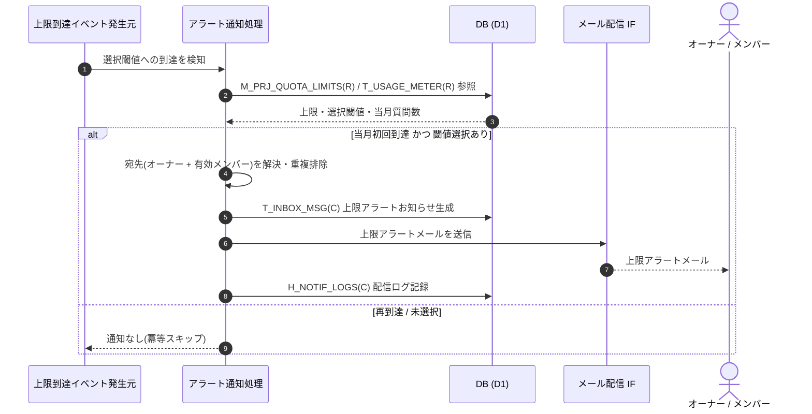

<!-- portal-top -->
[設計ポータル](../../README.md) ／ [要件定義](../index.md) ／ [業務ユースケース](index.md) ／ **UC-SYSTEM-008: 質問数上限アラート通知**
<!-- /portal-top -->

# UC-SYSTEM-008: 質問数上限アラート通知

> **このページは、プロジェクトの当月質問数が選択された上限アラート閾値(25 / 50 / 80 / 90 / 100%)へ当月初回到達したことを契機に、オーナー + 当該プロジェクトの有効メンバーへアラートメールと受信箱お知らせを送るシステムユースケースを定義します。**

*版数 v1.0 ・ 更新 2026-06-21 ・ 種別 イベントドリブン ・ ステータス ドラフト*

## 1. 概要

質問発生時のリアルタイム集計([UC-SYSTEM-010](UC-SYSTEM-010.md#UC-SYSTEM-010))で、当月の質問数が当該プロジェクトの設定上限件数(`M_PRJ_QUOTA_LIMITS(R)`)に対する選択閾値へ到達したことを契機に、アラート通知処理が起動する。処理は当該閾値が当月初回到達かを判定し、初回到達時のみ宛先(オーナー + 当該プロジェクトの有効メンバー、重複排除)へアラートメールをメール配信 IF で送信し、お知らせ受信箱 `T_INBOX_MSG(C)` にお知らせを生成して `H_NOTIF_LOGS(C)` に配信ログを記録する。同一プロジェクト・同一請求月・同一閾値は 1 回のみ通知する。全閾値未選択時は通知しない。

| 項目 | 内容 |
|---|---|
| 目的 | 選択した上限アラート閾値への当月初回到達を、オーナー + 有効メンバーへ通知する |
| 関連要件 | [FR-071](../FR09.md#FR-071) 上限アラート通知 ・ [FR-070](../FR09.md#FR-070) リアルタイム集計 |
| 主テーブル | `M_PRJ_QUOTA_LIMITS(R)` ・ `T_USAGE_METER(R)` ・ `T_INBOX_MSG(C)` ・ `H_NOTIF_LOGS(C)` |
| 関連 API | [API-BIL-006](../../02_basic_design/03_apis/API-billing.md#API-BIL-006) プロジェクト上限参照 ・ [API-MAIL-001](../../02_basic_design/03_apis/API-mail.md#API-MAIL-001) メール配信 IF |

## 2. 利用者(アクター)

| アクター | 役割 |
|---|---|
| 上限到達イベント発生元(システム) | リアルタイム集計で閾値到達を検知しイベントを発生させる |
| アラート通知処理(システム) | 当月初回到達判定・宛先解決・受信箱生成・メール送信・配信ログ記録を行う |
| メール配信 IF(システム) | 上限アラートメールを宛先へ送信する |
| オーナー / メンバー | 上限アラートを受信箱とメールで受け取る |

## 3. 事前条件

- 当該プロジェクトの質問数上限がオンで、アラート閾値(25 / 50 / 80 / 90 / 100% の複数選択)が設定されている。
- 当月の質問数がいずれかの選択閾値へ到達している(`T_USAGE_METER` で計測済み)。

## 4. トリガー

イベントドリブン。質問発生時のリアルタイム集計で、当月質問数が選択閾値へ到達したことを契機に起動する。

## 5. 基本フロー

1. リアルタイム集計が選択閾値への到達を検知し、アラート通知処理を起動する。
2. 処理が当該プロジェクトの上限・選択閾値 `M_PRJ_QUOTA_LIMITS(R)` と当月質問数 `T_USAGE_METER(R)` を参照する。
3. 当該閾値が当月初回到達かを判定する。当月初回到達でなければ通知せず終了する。
4. 宛先(オーナー + 当該プロジェクトの有効メンバー)を解決し、ユーザー ID と正規化メールアドレスで重複排除する。
5. 各宛先のお知らせ受信箱 `T_INBOX_MSG(C)` に上限アラートのお知らせを生成する。
6. 各宛先へ上限アラートメールをメール配信 IF([API-MAIL-001](../../02_basic_design/03_apis/API-mail.md#API-MAIL-001))で送信し、`H_NOTIF_LOGS(C)` に配信ログを記録する([FR-071](../FR09.md#FR-071))。

> [!NOTE]
> 100% 到達によるウィジェット受付停止は [UC-SYSTEM-011](UC-SYSTEM-011.md#UC-SYSTEM-011) が扱う。全閾値未選択でも停止処理自体は行う。本ユースケースはアラート通知のみを範囲とする。宛先解決・件名・本文は メール設計書 を正本とする。

## 6. 異常系フロー

- **当月再到達**: 同一プロジェクト・同一請求月・同一閾値で既に通知済みの場合は通知せず、冪等にスキップする。
- **全閾値未選択**: アラート閾値が一つも選択されていない場合は通知しない(受付停止判定は別途行う)。
- **メール配信失敗**: 受信箱お知らせは生成済みとし、メール送信失敗は `H_NOTIF_LOGS` に失敗として記録する。再送は [UC-SYSTEM-009](UC-SYSTEM-009.md#UC-SYSTEM-009) 通知再送が扱う。

## 7. 事後条件

- 選択閾値への当月初回到達時のみ、オーナー + 当該プロジェクトの有効メンバーへアラートが送信される([FR-071](../FR09.md#FR-071))。
- 同一プロジェクト・同一請求月・同一閾値の通知は受信者ごとに 1 回で、二重通知が発生しない。
- 各宛先の受信箱に上限アラートのお知らせが生成され、配信ログが記録される。

## 8. シーケンス図

---

<!-- portal-bottom -->
[← 業務ユースケース](index.md) ・ [要件定義](../index.md) ・ [↑ 設計ポータル](../../README.md)
<!-- /portal-bottom -->
