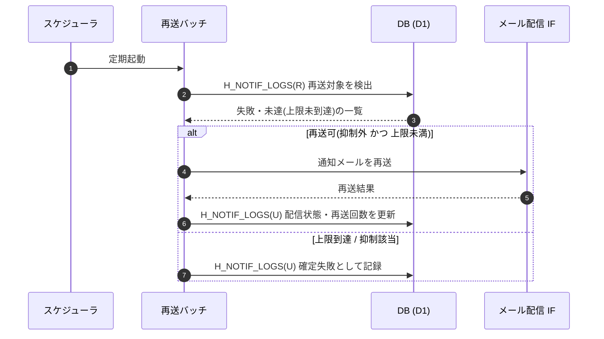

<!-- portal-top -->
[設計ポータル](../../README.md) ／ [要件定義](../index.md) ／ [業務ユースケース](index.md) ／ **UC-SYSTEM-009: 通知再送**
<!-- /portal-top -->

# UC-SYSTEM-009: 通知再送

> **このページは、配信に失敗した通知メールを検出し、再送回数上限の範囲内で再送し、配信状態と配信ログを更新するシステムユースケースを定義します。抑制リスト該当宛先や再送上限到達分は再送せず確定失敗とします。**

*版数 v1.0 ・ 更新 2026-06-21 ・ 種別 定期バッチ(失敗検出) ・ ステータス ドラフト*

## 1. 概要

定期バッチが配信ログ `H_NOTIF_LOGS(R)` から再送対象(送信失敗・未達で再送上限未到達)を検出する。各対象について、宛先が抑制リストに載っていないこと・再送回数が上限未満であることを確認し、条件を満たす対象のみメール配信 IF で再送する。再送結果に応じて配信状態と再送回数を `H_NOTIF_LOGS(U)` に更新する。再送回数が上限に到達した対象、または抑制リスト該当宛先は再送せず確定失敗として記録する。

| 項目 | 内容 |
|---|---|
| 目的 | 配信失敗通知を上限内で再送し、到達性を確保しつつ無駄な再送を抑止する |
| 関連要件 | [FR-114](../01_specifications/FR-114.md#FR-114) 通知再送 ・ [FR-120](../01_specifications/FR-120.md#FR-120) 再送回数上限 |
| 主テーブル | `H_NOTIF_LOGS(RU)` |
| 関連 API | [API-MAIL-001](../../02_basic_design/03_apis/API-mail.md#API-MAIL-001) メール配信 IF ・ [API-DASH-001](../../02_basic_design/03_apis/API-dashboard.md#API-DASH-001) ダッシュボードサマリ(配信失敗の可視化) |

## 2. 利用者(アクター)

| アクター | 役割 |
|---|---|
| スケジューラ(システム) | 定期的に再送バッチを起動する |
| 再送バッチ(システム) | 再送対象検出・再送可否判定・再送・配信状態更新を行う |
| メール配信 IF(システム) | 再送対象の通知メールを再送する |

## 3. 事前条件

- 配信ログ `H_NOTIF_LOGS` に通知の配信状態(送信待ち / 送信済み / 失敗 / バウンス 等)と再送回数が記録されている。
- 再送回数の上限が定義されている。

## 4. トリガー

定期バッチ(失敗検出)。スケジューラが定期的に再送バッチを起動する。

## 5. 基本フロー

1. スケジューラが再送バッチを起動する。
2. バッチが配信ログ `H_NOTIF_LOGS(R)` から再送対象(送信失敗・未達で再送上限未到達)を検出する。
3. 各対象について再送可否を判定する。
   1. 宛先が抑制リスト(バウンス / 苦情)に載っていないこと。
   2. 再送回数が上限([FR-120](../01_specifications/FR-120.md#FR-120))未満であること。
4. 条件を満たす対象をメール配信 IF([API-MAIL-001](../../02_basic_design/03_apis/API-mail.md#API-MAIL-001))で再送する。
5. 再送結果に応じて配信状態と再送回数を `H_NOTIF_LOGS(U)` に更新する。

> [!NOTE]
> バウンス / 苦情の検知と抑制リスト登録は [UC-SYSTEM-002](UC-SYSTEM-002.md#UC-SYSTEM-002) が扱う。本ユースケースは抑制リストを参照して再送可否を判定し、上限内で再送するまでを範囲とする。再送回数上限・抑制方式の正本は メール設計書 / セキュリティ NFR とする。

## 6. 異常系フロー

- **再送上限到達**: 再送回数が上限に到達した対象は再送せず、確定失敗として `H_NOTIF_LOGS(U)` に記録する。
- **抑制リスト該当**: 抑制リストに載った宛先は再送しない(認証関連の最優先テンプレートを除く扱いは メール設計書 を正本とする)。
- **再送も失敗**: 再送が失敗した対象は再送回数を加算し、上限未到達なら次回バッチで再評価する。

## 7. 事後条件

- 再送可能な対象は上限の範囲内で再送され、配信状態が更新される([FR-114](../01_specifications/FR-114.md#FR-114))。
- 再送上限到達分・抑制リスト該当分は確定失敗として記録され、再送されない。
- 配信失敗状況はダッシュボードサマリ([API-DASH-001](../../02_basic_design/03_apis/API-dashboard.md#API-DASH-001))で可視化できる。

## 8. シーケンス図

---

<!-- portal-bottom -->
[← 業務ユースケース](index.md) ・ [要件定義](../index.md) ・ [↑ 設計ポータル](../../README.md)
<!-- /portal-bottom -->
