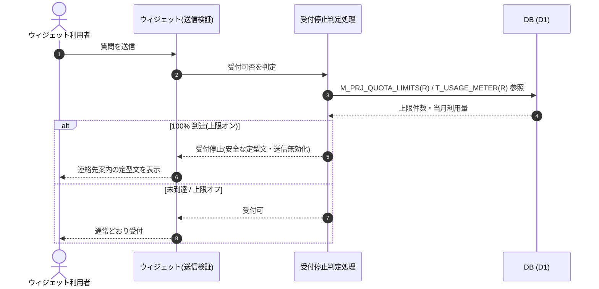

<!-- portal-top -->
[設計ポータル](../../README.md) ／ [要件定義](../index.md) ／ [業務ユースケース](index.md) ／ **UC-SYSTEM-011: 上限到達ウィジェット受付停止**
<!-- /portal-top -->

# UC-SYSTEM-011: 上限到達ウィジェット受付停止

> **このページは、ウィジェットの質問送信検証時に、当該プロジェクトの質問数が月次上限件数の 100% に到達しているかを判定し、到達済みなら新規質問受付を停止して安全な定型文を返すシステムユースケースを定義します。**

*版数 v1.0 ・ 更新 2026-06-21 ・ 種別 同期内部処理 ・ ステータス ドラフト*

## 1. 概要

ウィジェット利用者の質問送信検証時に、受付停止判定処理が当該プロジェクトの質問数上限 `M_PRJ_QUOTA_LIMITS(R)` と当月利用量 `T_USAGE_METER(R)` を突き合わせ、上限件数の 100% 到達かを同期で判定する。到達済みの場合、支払方法の有無に関わらず当該プロジェクトのウィジェット新規質問受付を停止し、プロジェクト連絡先メールへの問い合わせを促す安全な定型文をチャット内システム返信として返し、入力・送信を無効化する。契約は `active` を維持する。上限未到達(またはオフ)の場合は通常どおり質問を受け付ける。復帰は翌月リセット・上限引き上げ・上限オフのいずれかで即時とする。

| 項目 | 内容 |
|---|---|
| 目的 | 質問数 100% 到達時にウィジェット新規受付を停止し、安全な定型文を返す |
| 関連要件 | [FR-066](../FR09.md#FR-066) 上限到達時の受付停止 ・ [FR-064](../FR09.md#FR-064) 利用量集計 |
| 主テーブル | `M_PRJ_QUOTA_LIMITS(R)` ・ `T_USAGE_METER(R)` |
| 関連 API | [API-BIL-006](../../02_basic_design/03_apis/API-billing.md#API-BIL-006) プロジェクト上限参照 |

## 2. 利用者(アクター)

| アクター | 役割 |
|---|---|
| ウィジェット利用者 | 質問を送信しようとする(検証の契機) |
| ウィジェット(質問送信検証元) | 質問送信前に受付可否判定を呼び出す |
| 受付停止判定処理(システム) | 上限到達判定・受付停止・定型文返却を同期で行う |

## 3. 事前条件

- 当該プロジェクトの質問数上限がオンで、上限件数が `M_PRJ_QUOTA_LIMITS` に設定されている。
- 当月の利用量が `T_USAGE_METER` に計測されている。

## 4. トリガー

同期内部処理。ウィジェット利用者の質問送信検証時に、質問受付可否判定として同期で起動する。

## 5. 基本フロー

1. ウィジェット利用者が質問を送信し、質問送信検証で受付停止判定処理が起動する。
2. 処理が当該プロジェクトの上限件数 `M_PRJ_QUOTA_LIMITS(R)` と当月利用量 `T_USAGE_METER(R)` を参照する。
3. 当月質問数が上限件数の 100% に到達しているかを判定する。
4. 到達済みの場合、支払方法の有無に関わらず当該プロジェクトのウィジェット新規質問受付を停止し、プロジェクト連絡先メールへの問い合わせを促す安全な定型文をチャット内システム返信として返し、入力・送信を無効化する。契約は `active` を維持する([FR-066](../FR09.md#FR-066))。
5. 未到達(または上限オフ)の場合は通常どおり質問を受け付ける。

> [!NOTE]
> 利用量の計測・閾値到達検知は [UC-SYSTEM-010](UC-SYSTEM-010.md#UC-SYSTEM-010) が行い、アラート通知は [UC-SYSTEM-008](UC-SYSTEM-008.md#UC-SYSTEM-008) が扱う。支払方法未登録の無料枠超過による受付停止は支払方法ゲートの別経路だが、ウィジェット受付のみを止め契約をサスペンションしない点は同じである。本ユースケースは送信検証時の受付可否判定と停止挙動を範囲とする。

## 6. 異常系フロー

- **上限オフ / 未到達**: 上限がオフ、または 100% 未到達のプロジェクトは受付を停止せず通常受付する。
- **集計遅延(125%)**: 集計遅延・誤差で 100% 超を検知した場合も受付は停止のままとし、最終ガードの追加通知契機を引き渡す。

## 7. 事後条件

- 100% 到達時は当該プロジェクトのウィジェット新規質問受付が停止し、安全な定型文が返り、入力・送信が無効化される([FR-066](../FR09.md#FR-066))。
- 契約状態は `active` を維持し、サスペンションは発生しない。
- 翌月リセット・上限引き上げ・上限オフのいずれかで受付は即時復帰する。

## 8. シーケンス図

---

<!-- portal-bottom -->
[← 業務ユースケース](index.md) ・ [要件定義](../index.md) ・ [↑ 設計ポータル](../../README.md)
<!-- /portal-bottom -->
