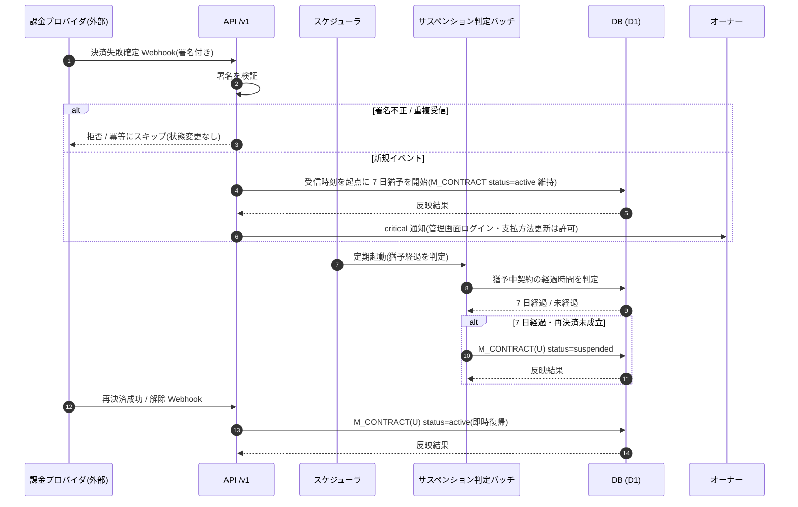

<!-- portal-top -->
[設計ポータル](../../README.md) ／ [要件定義](../index.md) ／ [業務ユースケース](index.md) ／ **UC-SYSTEM-012: 決済失敗→猶予→サスペンション**
<!-- /portal-top -->

# UC-SYSTEM-012: 決済失敗→猶予→サスペンション

> **このページは、課金プロバイダから決済失敗確定の通知を受けた契約を 7 日間の猶予で監視し、猶予中に再決済が成立しなければ契約を `suspended` へ移行し、再決済成功でいつでも `active` へ復帰させるシステムユースケースを定義します。**

*版数 v1.0 ・ 更新 2026-06-21 ・ 種別 イベントドリブン + 定期バッチ ・ ステータス ドラフト*

## 1. 概要

課金プロバイダの決済失敗確定 Webhook を契機に、システムは受信時刻を起点とする 7 日間の猶予を開始し、契約を `active` のまま監視する。猶予中はオーナーへ critical 通知を行い、管理画面ログインと支払方法更新([API-BIL-005](../../02_basic_design/03_apis/API-billing.md#API-BIL-005))を許可する。定期バッチが猶予経過を判定し、再決済が成立しないまま 7 日を超過した契約を `M_CONTRACT(U:status=suspended)` へ移行する。猶予中・サスペンション中いずれでも、再決済成功 / 解除の Webhook を受信した時点で `M_CONTRACT(U:status=active)` へ即時復帰する。判定・遷移は [課金・請求設計書 §5.1](../../02_basic_design/05_billing-design.md#51-決済失敗からサスペンションへ) を正本とする。

| 項目 | 内容 |
|---|---|
| 目的 | 決済失敗確定から 7 日猶予を経てサスペンションへ移行し、再決済成功で即時復帰させる |
| 関連要件 | [FR-068](../FR09.md#FR-068) 支払い失敗時の猶予とサスペンション ・ [FR-074](../FR09.md#FR-074) 7 日猶予後の移行 ・ [FR-075](../FR09.md#FR-075) サスペンション中の制限 |
| 主テーブル | `M_CONTRACT(U:status)` ・ `T_BILL_SUBS(R)` |
| 関連 API | [API-BIL-005](../../02_basic_design/03_apis/API-billing.md#API-BIL-005) 支払方法 取得・登録・更新 |

## 2. 利用者(アクター)

| アクター | 役割 |
|---|---|
| 課金プロバイダ(外部) | 決済失敗確定 / 再決済成功 / 解除のイベントを Webhook で送信する |
| Webhook 受信処理(システム) | 署名検証のうえイベント種別を判定し、猶予開始 / 即時復帰を反映する |
| スケジューラ(システム) | 定期的に猶予経過の判定バッチを起動する |
| サスペンション判定バッチ(システム) | 猶予経過の契約を `suspended` へ移行する |

## 3. 事前条件

- 対象契約が存在し、課金サブスクリプション(`T_BILL_SUBS`)が紐づく。
- 課金プロバイダ Webhook の署名検証用設定が有効である。
- 決済失敗の猶予期間(7 日)が定義されている([課金・請求設計書 §5](../../02_basic_design/05_billing-design.md#5-契約状態ライフサイクル))。

## 4. トリガー

イベントドリブン + 定期バッチ。決済失敗確定 / 再決済成功 / 解除の Webhook 受信(イベント)と、猶予経過を判定するスケジューラ起動(定期)の 2 系統を契機とする。

## 5. 基本フロー

1. 課金プロバイダが決済失敗確定の Webhook を送信し、システムが署名を検証する。
2. システムが受信時刻を起点に 7 日間の猶予を開始し、契約を `active` のまま維持する。
3. システムがオーナーへ critical 通知を行い、猶予中の管理画面ログインと支払方法更新([API-BIL-005](../../02_basic_design/03_apis/API-billing.md#API-BIL-005))を許可する。
4. スケジューラが起動し、サスペンション判定バッチが猶予中の契約の経過時間を判定する。
5. 猶予の 7 日を経過し再決済が成立していない契約を、`M_CONTRACT(U:status=suspended)` へ移行する。サスペンション中は管理画面を課金・退会のみに限定し、ウィジェット応答を機能停止の旨へ切り替える。
6. 猶予中・サスペンション中いずれでも、再決済成功 / 解除の Webhook を受信した時点で `M_CONTRACT(U:status=active)` へ即時復帰する。

> [!NOTE]
> **支払方法ゲートとは別経路** 支払方法未登録 + 無料枠超過によるウィジェット受付停止は契約サスペンションではなく([課金・請求設計書 §4](../../02_basic_design/05_billing-design.md#4-支払方法ゲート))、本ユースケースの対象外である。サスペンション中の操作制限・セッション扱いは [認証・認可設計書 §5.7](../../02_basic_design/07_auth-design.md#57-契約状態によるアクセス制限) を正本とする。

## 6. 異常系フロー

- **署名検証失敗**: 受信イベントを処理せず拒否し、契約状態・猶予を変更しない。
- **重複受信**: 同一イベントの再受信は冪等に扱い、猶予開始・状態遷移を重複適用しない。
- **猶予中の再決済成功**: 7 日経過前に再決済成功の通知を受けた場合はサスペンションへ移行せず、猶予を解除して `active` を維持する。

## 7. 事後条件

- 猶予経過まで再決済が成立しない契約は `suspended` へ移行し、管理画面は課金・退会のみ、ウィジェット応答は機能停止になる([FR-074](../FR09.md#FR-074) / [FR-075](../FR09.md#FR-075))。
- 再決済成功 / 解除の受信で契約は `active` へ即時復帰する([FR-068](../FR09.md#FR-068))。
- 決済失敗の猶予は 7 日で固定し、退会猶予 90 日とは独立する。署名不正・重複受信による誤った状態変更は行われない。

## 8. シーケンス図

---

<!-- portal-bottom -->
[← 業務ユースケース](index.md) ・ [要件定義](../index.md) ・ [↑ 設計ポータル](../../README.md)
<!-- /portal-bottom -->
