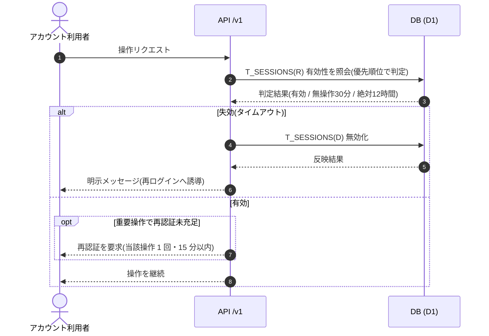

<!-- portal-top -->
[設計ポータル](../../README.md) ／ [要件定義](../index.md) ／ [業務ユースケース](index.md) ／ **UC-SYSTEM-013: セッション失効・再認証**
<!-- /portal-top -->

# UC-SYSTEM-013: セッション失効・再認証

> **このページは、無操作 30 分・絶対 12 時間のタイムアウトと失効の優先順位に基づき、認可チェック時点でセッションの有効性を判定し、失効済みセッションを無効化して再ログイン / 再認証へ誘導するシステムユースケースを定義します。**

*版数 v1.0 ・ 更新 2026-06-21 ・ 種別 同期内部処理(検証時) + 定期 ・ ステータス ドラフト*

## 1. 概要

各リクエストの認可判定の先頭でセッション検証を行い、無操作タイムアウト(30 分)・絶対タイムアウト(12 時間)を満たさないセッションを失効として扱う。失効を検知した場合は当該セッション `T_SESSIONS(D)` を無効化し、明示メッセージとともに再ログインへ誘導する。重要操作の再認証(当該操作 1 回かつ 15 分以内)はセッション寿命とは別軸で評価し、未充足なら再認証を要求する。失効判定・優先順位は [認証・認可設計書 §4](../../02_basic_design/07_auth-design.md#4-セッション設計) を正本とする。

| 項目 | 内容 |
|---|---|
| 目的 | タイムアウト・優先順位に従ってセッション有効性を判定し、失効を無効化して再認証へ誘導する |
| 関連要件 | [FR-008](../FR01.md#FR-008) セッションタイムアウト ・ [FR-005](../FR01.md#FR-005) 重要操作の再認証 |
| 主テーブル | `T_SESSIONS(R/D)` |
| 関連 API | [API-AUTH-002](../../02_basic_design/03_apis/API-auth.md#API-AUTH-002) ログイン ・ [API-AUTH-003](../../02_basic_design/03_apis/API-auth.md#API-AUTH-003) ログアウト |

## 2. 利用者(アクター)

| アクター | 役割 |
|---|---|
| アカウント利用者 | 失効後の次回操作で明示メッセージを受け、再ログイン / 再認証を行う |
| セッション検証処理(システム) | 認可チェック時点でタイムアウト・優先順位を判定し、失効を無効化する |
| 期限監視(システム) | 絶対 / 無操作タイムアウトの境界を定期的に評価する |

## 3. 事前条件

- 対象アカウントにログイン済みセッション(`T_SESSIONS`)が存在する。
- 無操作タイムアウト 30 分・絶対タイムアウト 12 時間が定義されている([認証・認可設計書 §4](../../02_basic_design/07_auth-design.md#4-セッション設計))。

## 4. トリガー

同期内部処理(検証時) + 定期。アカウント利用者の操作リクエストに伴う認可チェックを主契機とし、絶対タイムアウト境界の評価は時間駆動で行う。

## 5. 基本フロー

1. アカウント利用者の操作リクエストを契機に、認可判定の先頭でセッション検証処理が起動する。
2. システムが失効の優先順位(強制ログアウト → 絶対タイムアウト → 無操作タイムアウト → 通常セッション)に従い、対象セッションの有効性を判定する。
3. 無操作 30 分超過 / 絶対 12 時間超過のいずれかに該当する場合、当該セッション `T_SESSIONS(D)` を無効化する。
4. システムが操作と同時失効時の明示メッセージを返し、再ログイン([API-AUTH-002](../../02_basic_design/03_apis/API-auth.md#API-AUTH-002))へ誘導する。
5. セッションが有効でも、重要操作で再認証が「当該操作 1 回かつ 15 分以内」を満たさない場合は再認証を要求する。

> [!NOTE]
> **強制ログアウト・一斉無効化は別ユースケース** 契約停止に伴う配下利用者の全セッション一斉無効化は [UC-SYSTEM-015](UC-SYSTEM-015.md#UC-SYSTEM-015) が扱う。本ユースケースはタイムアウト失効と再認証の判定に範囲を限定する。

## 6. 異常系フロー

- **同時失効**: 操作実行中にセッションが失効した場合は当該操作を許可せず、明示メッセージで再ログインへ誘導する。
- **再認証期限切れ**: 再認証が 15 分を超過、または別操作で消費済みの場合は再認証未充足として要求する。

## 7. 事後条件

- 失効条件に該当したセッションは無効化され、以降のリクエストでは認証が要求される([FR-008](../FR01.md#FR-008))。
- 有効なセッションは寿命の範囲内で維持される。複数デバイスの他セッションは本判定の対象外で個別に評価される。
- 重要操作は再認証が充足するまで実行されない([FR-005](../FR01.md#FR-005))。

## 8. シーケンス図

---

<!-- portal-bottom -->
[← 業務ユースケース](index.md) ・ [要件定義](../index.md) ・ [↑ 設計ポータル](../../README.md)
<!-- /portal-bottom -->
