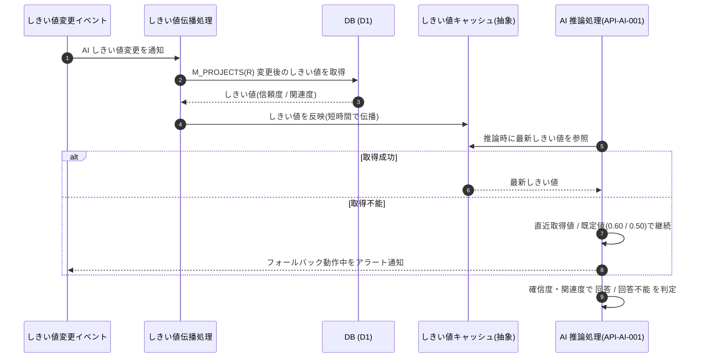

<!-- portal-top -->
[設計ポータル](../../README.md) ／ [要件定義](../index.md) ／ [業務ユースケース](index.md) ／ **UC-SYSTEM-016: AI しきい値変更の伝播・フォールバック**
<!-- /portal-top -->

# UC-SYSTEM-016: AI しきい値変更の伝播・フォールバック

> **このページは、プロジェクトの AI しきい値が変更されたときに推論動作へ短時間で反映し、しきい値設定の取得が長期に行えないときは直近取得値またはグローバル既定値で推論を継続してアラート通知するシステムユースケースを定義します。**

*版数 v1.0 ・ 更新 2026-06-21 ・ 種別 イベントドリブン ・ ステータス ドラフト*

## 1. 概要

プロジェクト設定 `M_PROJECTS(R)` の AI しきい値(信頼度 / 関連度)が変更されたことを契機に、システムはしきい値配信用キャッシュ(抽象)を更新し、AI 推論([API-AI-001](../../02_basic_design/03_apis/API-ai.md#API-AI-001))の判定動作へ短時間で反映する。しきい値設定の取得が長期にわたり行えない場合は、最後に取得できた設定、それも無ければグローバル既定値(信頼度 0.60 / 関連度 0.50)で推論を継続し、フォールバックで動作している間はアラート通知する。反映と障害時継続の方針は [FR-154](../FR20.md#FR-154) / [BR-142](../FR20.md#BR-142) を正本とする。

| 項目 | 内容 |
|---|---|
| 目的 | しきい値変更を短時間で推論へ反映し、設定取得障害時は既定値で推論を継続してアラートする |
| 関連要件 | [FR-154](../FR20.md#FR-154) しきい値の即時反映とフォールバック ・ [BR-142](../FR20.md#BR-142) しきい値反映と障害時の継続 |
| 主テーブル | `M_PROJECTS(R)` ・ しきい値配信用キャッシュ(抽象) |
| 関連 API | [API-AI-001](../../02_basic_design/03_apis/API-ai.md#API-AI-001) AI 推論 IF(`AnswerProvider`) |

## 2. 利用者(アクター)

| アクター | 役割 |
|---|---|
| しきい値変更イベント(システム) | プロジェクト設定のしきい値変更を契機に伝播を起動する |
| しきい値伝播処理(システム) | 変更を配信用キャッシュ(抽象)へ反映する |
| AI 推論処理(システム) | しきい値を参照して回答 / 回答不能を判定する。取得不能時はフォールバックする |

## 3. 事前条件

- 対象プロジェクト(`M_PROJECTS`)が存在し、AI しきい値が設定されている。
- グローバル既定値(信頼度 0.60 / 関連度 0.50)が定義されている([BR-142](../FR20.md#BR-142))。

## 4. トリガー

イベントドリブン。プロジェクトの AI しきい値変更イベントを契機に伝播する。推論時のしきい値取得は質問送信に伴う推論処理を契機とする。

## 5. 基本フロー

1. プロジェクトの AI しきい値が変更され、しきい値変更イベントが発火する。
2. しきい値伝播処理が変更後の値をしきい値配信用キャッシュ(抽象)へ反映する。
3. AI 推論処理([API-AI-001](../../02_basic_design/03_apis/API-ai.md#API-AI-001))は推論時に最新しきい値を参照し、確信度・関連度に基づき回答 / 回答不能を判定する。
4. しきい値変更は短時間で以降の推論動作へ反映される。

> [!NOTE]
> **しきい値の意味は AI 推論 IF が正本** 確信度・関連度による回答 / 回答不能(`answered` / `unanswerable`)の判定そのものは [API-AI-001](../../02_basic_design/03_apis/API-ai.md#API-AI-001) を正本とする。本ユースケースは変更の伝播と取得障害時のフォールバックを範囲とする。

## 6. 異常系フロー

- **しきい値設定の取得不能(短期)**: 直近に取得できたしきい値で推論を継続する。
- **しきい値設定の取得不能(長期)**: 直近取得値が無い場合はグローバル既定値(信頼度 0.60 / 関連度 0.50)で推論を継続し、フォールバック動作中はアラート通知する。

## 7. 事後条件

- しきい値変更は短時間で以降の推論動作へ反映される([FR-154](../FR20.md#FR-154))。
- しきい値設定の取得が長期に行えない間も推論は停止せず、直近取得値または既定値で継続する([BR-142](../FR20.md#BR-142))。
- フォールバックで動作している間はアラート通知される。

## 8. シーケンス図

---

<!-- portal-bottom -->
[← 業務ユースケース](index.md) ・ [要件定義](../index.md) ・ [↑ 設計ポータル](../../README.md)
<!-- /portal-bottom -->
