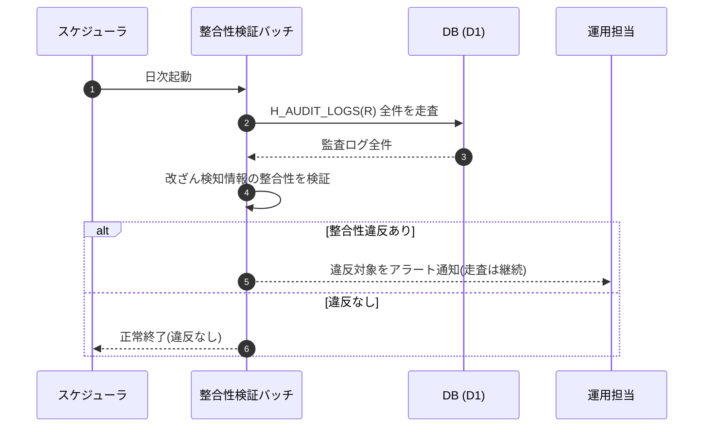

<!-- portal-top -->
[設計ポータル](../../README.md) ／ [要件定義](../index.md) ／ [業務ユースケース](index.md) ／ **UC-SYSTEM-018: 監査ログ整合性検証(日次)**
<!-- /portal-top -->

# UC-SYSTEM-018: 監査ログ整合性検証(日次)

> **このページは、日次バッチが監査ログを全件走査して改ざん検知の整合性を検証し、整合性違反を検出したらアラート通知するシステムユースケースを定義します。**

*版数 v1.0 ・ 更新 2026-06-21 ・ 種別 定期バッチ(日次) ・ ステータス ドラフト*

## 1. 概要

監査ログ `H_AUDIT_LOGS` は改ざん検知可能な形で保持される。日次バッチが監査ログを全件走査し、各レコードの改ざん検知情報の整合性を検証する。整合性違反(改ざん・欠落の疑い)を検出した場合はアラート通知する。検証は読み取りのみで、監査ログ自体は変更しない。日次全件検証の方針は [NFR-015](../01_specifications/NFR-015.md#NFR-015) を正本とし、操作監査ログの保持は [FR-147](../01_specifications/FR-147.md#FR-147) に基づく。

| 項目 | 内容 |
|---|---|
| 目的 | 監査ログの改ざん検知整合性を日次で全件検証し、違反検出時にアラートする |
| 関連要件 | [NFR-015](../01_specifications/NFR-015.md#NFR-015) 監査ログの改ざん検知保持・日次全件検証 ・ [FR-147](../01_specifications/FR-147.md#FR-147) 操作ログの監査用保持 |
| 主テーブル | `H_AUDIT_LOGS(R)` |
| 関連 機能グループ | NFR 監査(セキュリティ) |

## 2. 利用者(アクター)

| アクター | 役割 |
|---|---|
| スケジューラ(システム) | 日次で整合性検証バッチを起動する |
| 整合性検証バッチ(システム) | 監査ログを全件走査し、改ざん検知の整合性を検証する |
| 運用担当 | 整合性違反のアラートを受け取り、対応する |

## 3. 事前条件

- 監査ログ(`H_AUDIT_LOGS`)が改ざん検知可能な形で保持されている([NFR-015](../01_specifications/NFR-015.md#NFR-015))。
- 検証対象期間の監査ログレコードが存在する。

## 4. トリガー

定期バッチ(日次)。スケジューラが 1 日 1 回、整合性検証バッチを起動する。

## 5. 基本フロー

1. スケジューラが整合性検証バッチを起動する。
2. バッチが監査ログ `H_AUDIT_LOGS(R)` を全件走査する。
3. バッチが各レコードの改ざん検知情報の整合性を検証する。
4. 整合性違反を検出した場合はアラート通知する。
5. 整合性違反が無い場合は正常終了する。

> [!NOTE]
> **検証は読み取りのみ** 本バッチは監査ログを変更せず、整合性の検証とアラートに範囲を限定する。改ざん検知方式そのもの(保持形式)は詳細設計で定め、本ユースケースは日次の全件検証フローを扱う。

## 6. 異常系フロー

- **整合性違反の検出**: 改ざん・欠落の疑いを検出した対象を特定し、アラート通知する。検証は中断せず残りの全件走査を継続する。
- **対象なし**: 検証対象の監査ログが無い場合は検証を行わず、正常終了する。

## 7. 事後条件

- 監査ログが日次で全件検証され、整合性が確認される([NFR-015](../01_specifications/NFR-015.md#NFR-015))。
- 整合性違反が検出された場合はアラート通知される。
- 監査ログ自体は本検証で変更されない([FR-147](../01_specifications/FR-147.md#FR-147))。

## 8. シーケンス図

---

<!-- portal-bottom -->
[← 業務ユースケース](index.md) ・ [要件定義](../index.md) ・ [↑ 設計ポータル](../../README.md)
<!-- /portal-bottom -->
