# アカウント・ユーザー・アクセス制御(機能要件)

> **このページは、アカウント・ユーザー・アクセス制御 に関する機能要件を定義します。**

*複数の個別要件を統合したカテゴリ別ページ。各要件の優先度・トレースは各節を参照。 ステータス ドラフト*

## FR-001: メール・パスワードでのアカウント新規作成

> **この機能要件は「メール・パスワードでのアカウント新規作成」を定義します。**

*種別 機能要件 ・ 機能グループ アカウント管理 ・ 優先度 P0 ・ ステータス ドラフト*

### 要件

利用者はメールアドレスとパスワードでアカウントを新規作成できること。アカウント作成は招待とは独立した経路で行う

### シーケンス

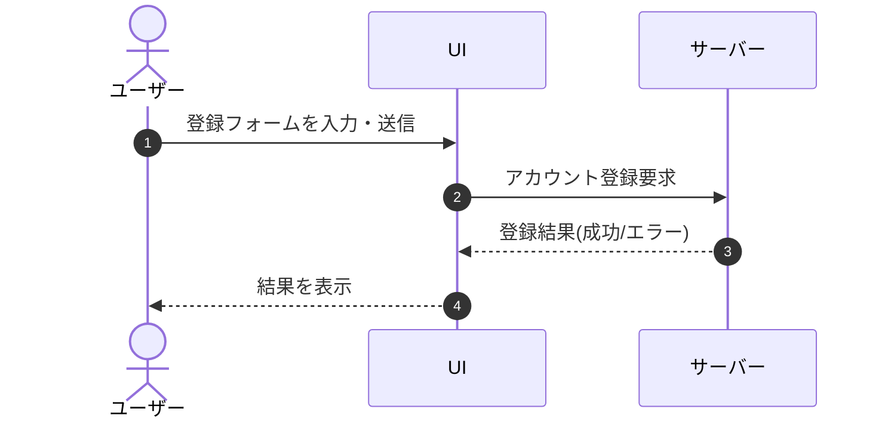
```mermaid
sequenceDiagram
  autonumber
  actor U as ユーザー
  participant UI as UI
  participant S as サーバー
  U->>UI: 登録フォームを入力・送信
  UI->>S: アカウント登録要求
  S-->>UI: 登録結果(成功/エラー)
  UI-->>U: 結果を表示
```

## FR-002: 登録時の規約・ポリシー同意取得

> **この機能要件は「登録時の規約・ポリシー同意取得」を定義します。**

*種別 機能要件 ・ 機能グループ アカウント管理 ・ 優先度 P0 ・ ステータス ドラフト*

### 要件

登録時に利用規約とプライバシーポリシーへの同意を取得できること

### シーケンス

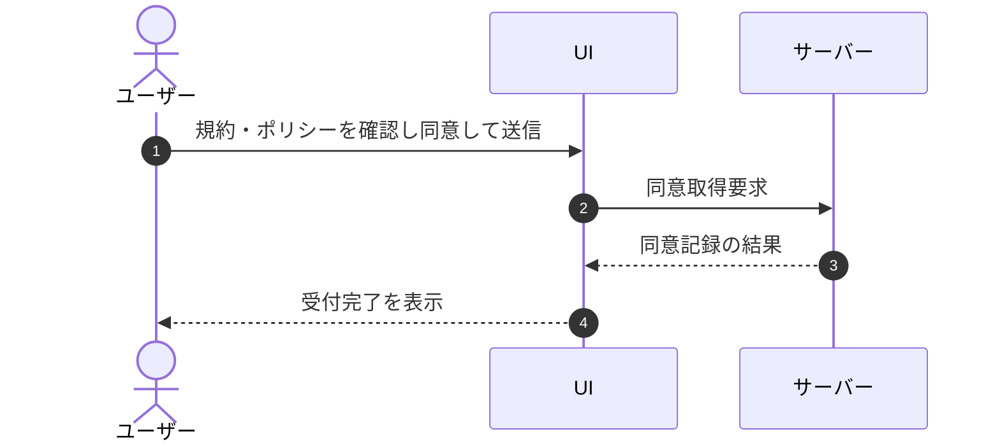
```mermaid
sequenceDiagram
  autonumber
  actor U as ユーザー
  participant UI as UI
  participant S as サーバー
  U->>UI: 規約・ポリシーを確認し同意して送信
  UI->>S: 同意取得要求
  S-->>UI: 同意記録の結果
  UI-->>U: 受付完了を表示
```

## FR-003: メールアドレス確認(本人確認メール)

> **この機能要件は「メールアドレス確認(本人確認メール)」を定義します。**

*種別 機能要件 ・ 機能グループ アカウント管理 ・ 優先度 P0 ・ ステータス ドラフト*

### 要件

メールアドレス確認(本人確認メール)ができること

### シーケンス

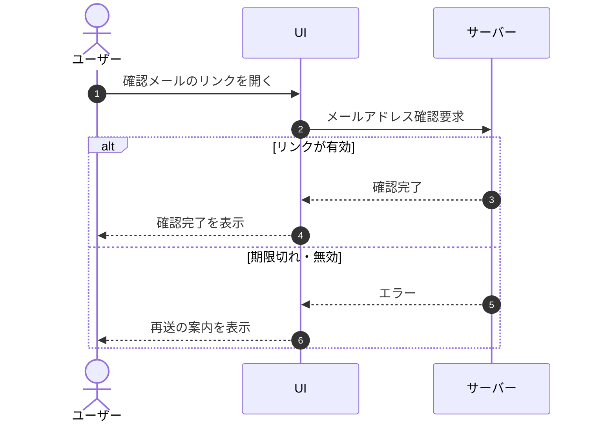
```mermaid
sequenceDiagram
  autonumber
  actor U as ユーザー
  participant UI as UI
  participant S as サーバー
  U->>UI: 確認メールのリンクを開く
  UI->>S: メールアドレス確認要求
  alt リンクが有効
    S-->>UI: 確認完了
    UI-->>U: 確認完了を表示
  else 期限切れ・無効
    S-->>UI: エラー
    UI-->>U: 再送の案内を表示
  end
```

## FR-004: ログイン・ログアウト・パスワード再設定

> **この機能要件は「ログイン・ログアウト・パスワード再設定」を定義します。**

*種別 機能要件 ・ 機能グループ アカウント管理 ・ 優先度 P0 ・ ステータス ドラフト*

### 要件

ログイン、ログアウト、パスワード再設定ができること

### シーケンス

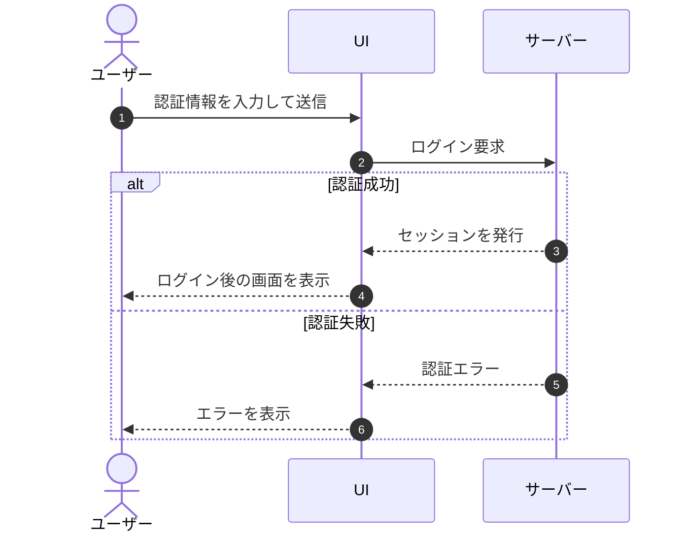
```mermaid
sequenceDiagram
  autonumber
  actor U as ユーザー
  participant UI as UI
  participant S as サーバー
  U->>UI: 認証情報を入力して送信
  UI->>S: ログイン要求
  alt 認証成功
    S-->>UI: セッションを発行
    UI-->>U: ログイン後の画面を表示
  else 認証失敗
    S-->>UI: 認証エラー
    UI-->>U: エラーを表示
  end
```

## FR-005: 重要操作の前に本人確認(再認証)を求める

> **この機能要件は「重要操作の前に本人確認(再認証)を求める」を定義します。**

*種別 機能要件 ・ 機能グループ アカウント管理 ・ 優先度 P0 ・ ステータス ドラフト*

### 要件

重要操作の前に本人確認(再認証)を求めること。
1. 対象の重要操作は次のとおり。
    1. パスワード変更
    2. 退会
    3. 課金情報変更
    4. メンバー登録・停止・削除
    5. 月次上限件数変更
2. 再認証は本人による再度の認証で行う
3. 再認証の有効範囲は **当該操作 1 回かつ 15 分以内**

### シーケンス

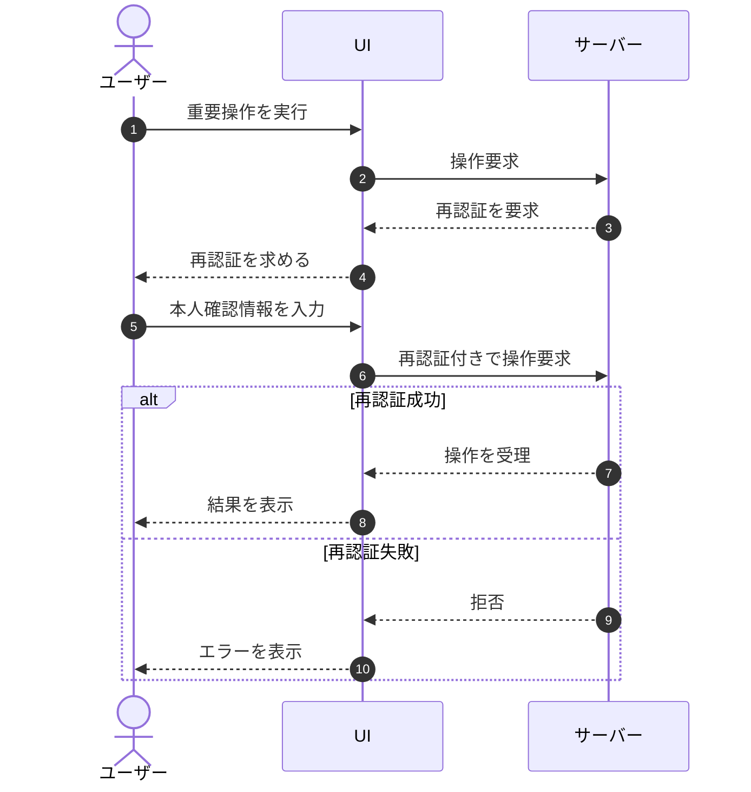
```mermaid
sequenceDiagram
  autonumber
  actor U as ユーザー
  participant UI as UI
  participant S as サーバー
  U->>UI: 重要操作を実行
  UI->>S: 操作要求
  S-->>UI: 再認証を要求
  UI-->>U: 再認証を求める
  U->>UI: 本人確認情報を入力
  UI->>S: 再認証付きで操作要求
  alt 再認証成功
    S-->>UI: 操作を受理
    UI-->>U: 結果を表示
  else 再認証失敗
    S-->>UI: 拒否
    UI-->>U: エラーを表示
  end
```

## FR-006: パスワードに最低長・複雑性要件を適用

> **この機能要件は「パスワードに最低長・複雑性要件を適用」を定義します。**

*種別 機能要件 ・ 機能グループ アカウント管理 ・ 優先度 P0 ・ ステータス ドラフト*

### 要件

パスワードに最低長・複雑性要件を適用できること。
1. 最低 **12 文字**
2. 英大文字・小文字・数字・記号のうち **3 種類以上**
3. パスワードリセットリンクの有効期限は **1 時間**

### シーケンス

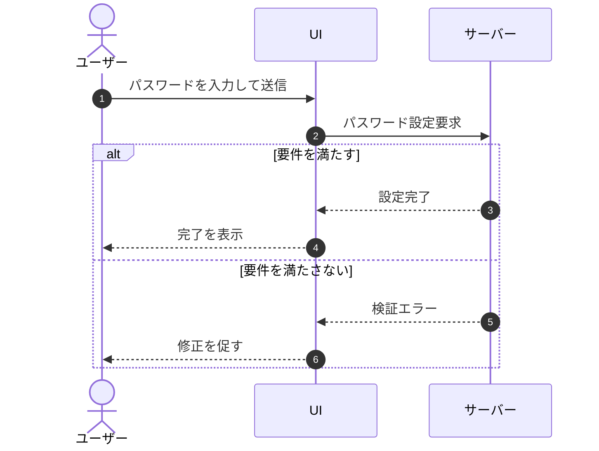
```mermaid
sequenceDiagram
  autonumber
  actor U as ユーザー
  participant UI as UI
  participant S as サーバー
  U->>UI: パスワードを入力して送信
  UI->>S: パスワード設定要求
  alt 要件を満たす
    S-->>UI: 設定完了
    UI-->>U: 完了を表示
  else 要件を満たさない
    S-->>UI: 検証エラー
    UI-->>U: 修正を促す
  end
```

## FR-007: ログイン失敗回数の制限とロックアウト

> **この機能要件は「ログイン失敗回数の制限とロックアウト」を定義します。**

*種別 機能要件 ・ 機能グループ アカウント管理 ・ 優先度 P0 ・ ステータス ドラフト*

### 要件

ログイン試行の失敗回数制限ができること。
1. **5 回連続失敗**で **15 分間ロック**する
2. 時間経過またはサポートによる解除で復旧できる
3. ロック発動時は該当本人および必要な関係者へ通知し、正規のアカウント利用者の救済導線を提供する

### シーケンス

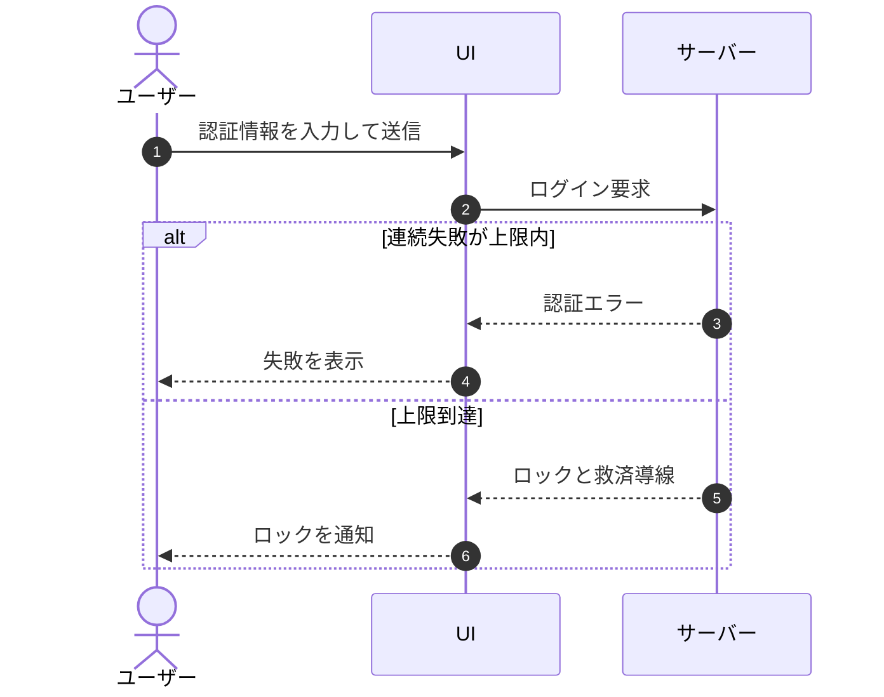
```mermaid
sequenceDiagram
  autonumber
  actor U as ユーザー
  participant UI as UI
  participant S as サーバー
  U->>UI: 認証情報を入力して送信
  UI->>S: ログイン要求
  alt 連続失敗が上限内
    S-->>UI: 認証エラー
    UI-->>U: 失敗を表示
  else 上限到達
    S-->>UI: ロックと救済導線
    UI-->>U: ロックを通知
  end
```

## FR-008: セッションタイムアウトの設定

> **この機能要件は「セッションタイムアウトの設定」を定義します。**

*種別 機能要件 ・ 機能グループ アカウント管理 ・ 優先度 P0 ・ ステータス ドラフト*

### 要件

セッションタイムアウトを以下のとおり設けること。
1. **無操作タイムアウト 30 分**
2. **絶対タイムアウト 12 時間**(1 営業日内に再認証を要求)
3. 操作と同時にセッションが失効した場合は明示的なメッセージを表示し、再ログインを誘導すること

### シーケンス

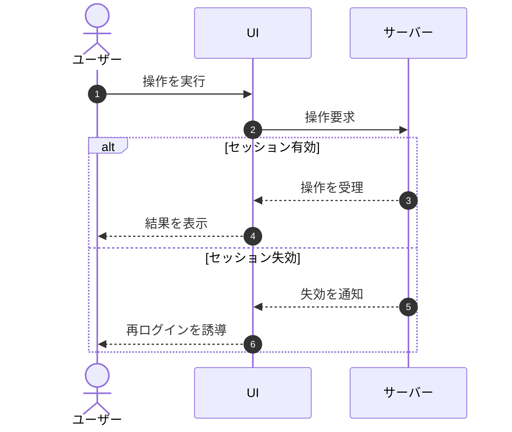
```mermaid
sequenceDiagram
  autonumber
  actor U as ユーザー
  participant UI as UI
  participant S as サーバー
  U->>UI: 操作を実行
  UI->>S: 操作要求
  alt セッション有効
    S-->>UI: 操作を受理
    UI-->>U: 結果を表示
  else セッション失効
    S-->>UI: 失効を通知
    UI-->>U: 再ログインを誘導
  end
```

## FR-009: 退会できること(即時退会)

> **この機能要件は「退会できること(即時退会)」を定義します。**

*種別 機能要件 ・ 機能グループ アカウント管理 ・ 優先度 P0 ・ ステータス ドラフト*

### 要件

退会できること。退会はアカウント単位で本人の操作により即時に成立し、猶予期間は設けない(取り消し不可)。退会時、参加しているプロジェクトからは離脱し、自分が作成したプロジェクトは削除する。退会後も請求情報のみ閲覧できる。

### シーケンス

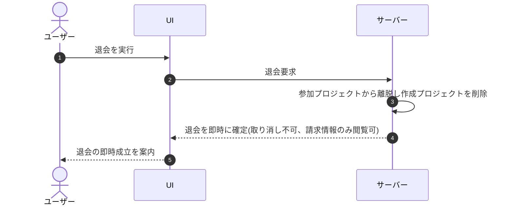
```mermaid
sequenceDiagram
  autonumber
  actor U as ユーザー
  participant UI as UI
  participant S as サーバー
  U->>UI: 退会を実行
  UI->>S: 退会要求
  S->>S: 参加プロジェクトから離脱し作成プロジェクトを削除
  S-->>UI: 退会を即時に確定(取り消し不可、請求情報のみ閲覧可)
  UI-->>U: 退会の即時成立を案内
```

## FR-010: 利用規約・プライバシーポリシー改定時に再同意を取得

> **この機能要件は「利用規約・プライバシーポリシー改定時に再同意を取得」を定義します。**

*種別 機能要件 ・ 機能グループ アカウント管理 ・ 優先度 P0 ・ ステータス ドラフト*

### 要件

利用規約・プライバシーポリシー改定時に再同意を取得できること。
1. 発効前に予告する(発効 **30 日前**)
2. 同意期限を設ける(発効日 + **14 日**)
3. 同意期限を超過したアカウント利用者には、再同意を求める割込みと未同意時の機能制限を行う
4. 非同意の場合は退会の案内を行う
5. 実施はアカウント単位で段階的に行う

### シーケンス

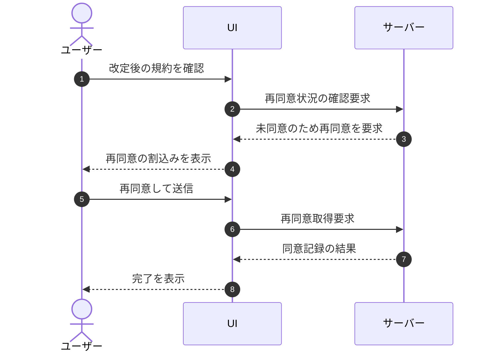
```mermaid
sequenceDiagram
  autonumber
  actor U as ユーザー
  participant UI as UI
  participant S as サーバー
  U->>UI: 改定後の規約を確認
  UI->>S: 再同意状況の確認要求
  S-->>UI: 未同意のため再同意を要求
  UI-->>U: 再同意の割込みを表示
  U->>UI: 再同意して送信
  UI->>S: 再同意取得要求
  S-->>UI: 同意記録の結果
  UI-->>U: 完了を表示
```

## FR-011: サスペンション時の挙動

> **この機能要件は「サスペンション時の挙動」を定義します。**

*種別 機能要件 ・ 機能グループ アカウント管理 ・ 優先度 P0 ・ ステータス ドラフト*

### 要件

アカウントがサスペンションされた場合の挙動を定めること。
1. 配下のアカウント利用者の全セッションを速やかに無効化する
2. 進行中の長時間処理(大量インポート等)は**完了まで継続**し中断しない。完了後の次回操作で再認証を要求する
3. 再ログイン時、サスペンション状態の場合は停止時のアクセス制限ルール(下記)に従う

「停止時のアクセス制限ルール」とは、サスペンション中の機能制限([FR-098](03_usage-fr.md#FR-098))に従い、次のとおり利用を制限することをいう。
1. 管理画面の操作は、オーナーによる課金(請求情報・支払方法の更新)と退会のみを許可し、それ以外の操作は拒否する
2. ウィジェットの新規応答は行わず、機能停止の旨を示す応答に切り替える
3. 制限はサスペンション中(停止中)に適用する(退会済みのアカウントは [FR-140](06_security-fr.md#FR-140) の請求限定アクセスに従う)

### シーケンス

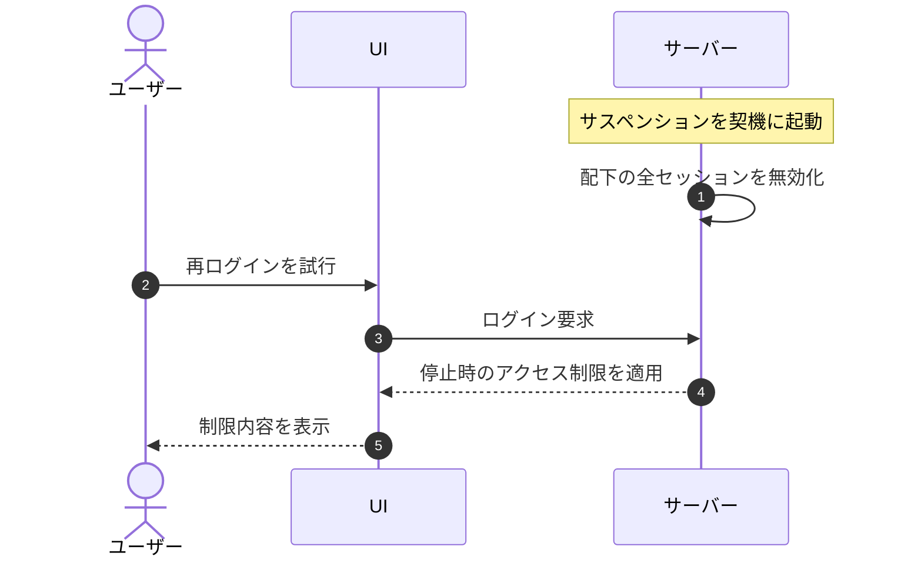
```mermaid
sequenceDiagram
  autonumber
  actor U as ユーザー
  participant UI as UI
  participant S as サーバー
  Note over S: サスペンションを契機に起動
  S->>S: 配下の全セッションを無効化
  U->>UI: 再ログインを試行
  UI->>S: ログイン要求
  S-->>UI: 停止時のアクセス制限を適用
  UI-->>U: 制限内容を表示
```

## FR-012: プロジェクト単位のメンバー招待

> **この機能要件は「プロジェクト単位のメンバー招待」を定義します。**

*種別 機能要件 ・ 機能グループ ユーザー管理(オーナー + メンバー) ・ 優先度 P0 ・ ステータス ドラフト*

### 要件

オーナーおよび当該プロジェクトのメンバーは、自分が割り当てられたプロジェクトでメンバーを招待できること。
1. 招待はメールアドレスを指定して行う(プロジェクト内の役割差はない)
2. 招待時に氏名(表示名)は入力しない(個人情報保護の原則により、他人の氏名を招待者が任意に登録することを禁止する)。氏名は招待された本人が有効化時に入力する([FR-022](#FR-022))
3. メンバーの管理は常にプロジェクト単位で行う
4. 同一の人を複数プロジェクトに参加させる場合は各プロジェクトで個別に招待する
5. 招待は登録済みのユーザーのみを対象とし、未登録(アカウントのない)メールアドレスは招待できない(先にアカウント登録を促す)。既に登録済みのユーザーには当該プロジェクト分の割当のみを追加する

### シーケンス

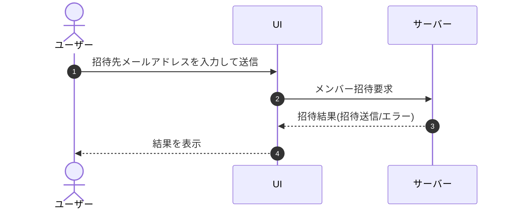
```mermaid
sequenceDiagram
  autonumber
  actor U as ユーザー
  participant UI as UI
  participant S as サーバー
  U->>UI: 招待先メールアドレスを入力して送信
  UI->>S: メンバー招待要求
  S-->>UI: 招待結果(招待送信/エラー)
  UI-->>U: 結果を表示
```

## FR-013: オーナーの全権と恒久保持

> **この機能要件は「オーナーの全権と恒久保持」を定義します。**

*種別 機能要件 ・ 機能グループ ユーザー管理(オーナー + メンバー) ・ 優先度 P0 ・ ステータス ドラフト*

### 要件

オーナーはプロジェクトを作成した時に当該プロジェクトのオーナーとなり、当該プロジェクトに対する全権とオーナー専有機能を保持すること。オーナーは作成者であることに基づく全権を持ち、別途の割当付与なしに自プロジェクトを操作できる(認可権威はオーナー権限)。加えて、作成した各プロジェクトに自身のメンバー行を自動保持する(一覧表示・担当割当・通知宛先の網羅用で、専有判定には用いない)。オーナーは降格・譲渡の対象外とする(MVP)。1 プロジェクトにつきオーナーは 1 人(作成者)とし、1 人のユーザーは複数プロジェクトのオーナーになれ、同時に他者が作成したプロジェクトのメンバーにもなれる

### シーケンス

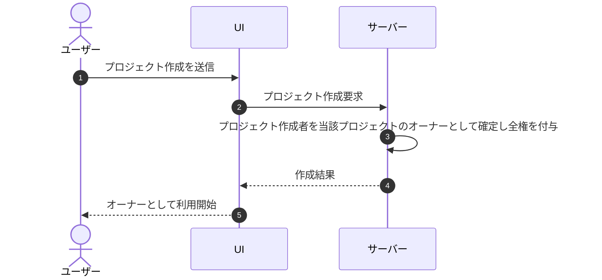
```mermaid
sequenceDiagram
  autonumber
  actor U as ユーザー
  participant UI as UI
  participant S as サーバー
  U->>UI: プロジェクト作成を送信
  UI->>S: プロジェクト作成要求
  S->>S: プロジェクト作成者を当該プロジェクトのオーナーとして確定し全権を付与
  S-->>UI: 作成結果
  UI-->>U: オーナーとして利用開始
```

## FR-014: メンバー権限のプロジェクト単位付与

> **この機能要件は「メンバー権限のプロジェクト単位付与」を定義します。**

*種別 機能要件 ・ 機能グループ ユーザー管理(オーナー + メンバー) ・ 優先度 P0 ・ ステータス ドラフト*

### 要件

メンバーはプロジェクトごとの割当で表し、割り当てられたメンバーは当該プロジェクト内で同一の権限を持つこと(役割差なし)。当該プロジェクトのメンバーは、当該プロジェクトの FAQ 管理・未解決質問管理・ログ参照・メンバー管理(当該プロジェクト範囲の招待・編集・割当解除)・上限 / アラート設定・お知らせ受信箱・ウィジェット設定を行える。個別の権限フラグや権限テンプレートは提供しない

### シーケンス

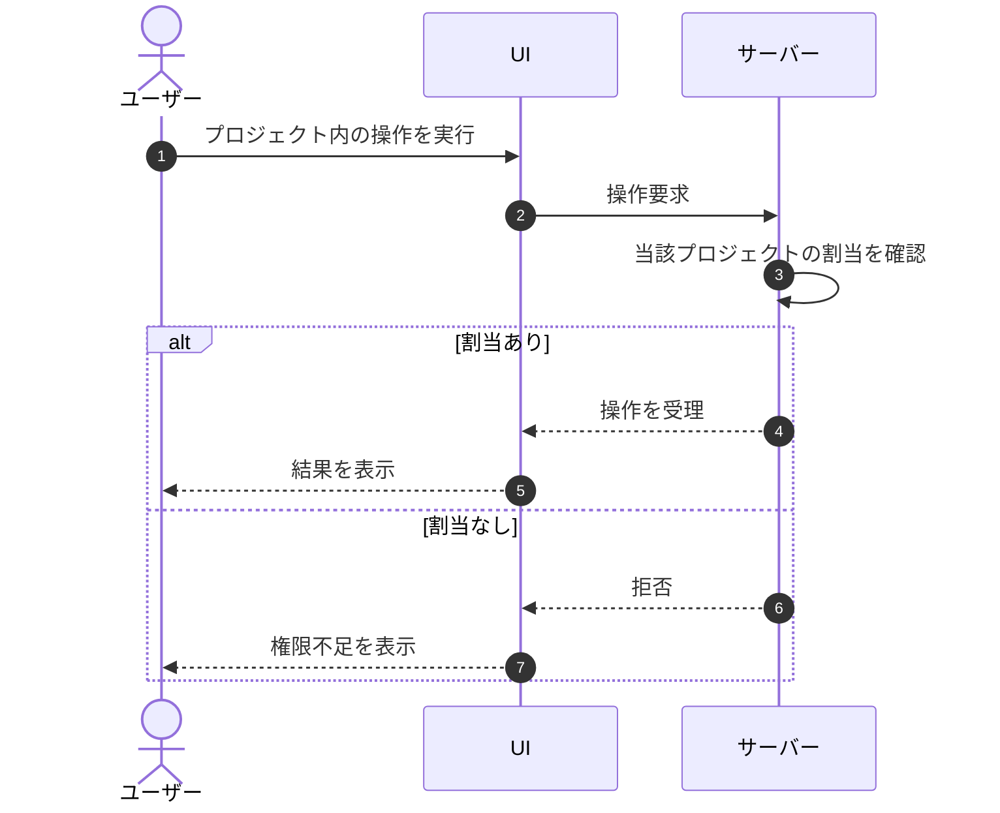
```mermaid
sequenceDiagram
  autonumber
  actor U as ユーザー
  participant UI as UI
  participant S as サーバー
  U->>UI: プロジェクト内の操作を実行
  UI->>S: 操作要求
  S->>S: 当該プロジェクトの割当を確認
  alt 割当あり
    S-->>UI: 操作を受理
    UI-->>U: 結果を表示
  else 割当なし
    S-->>UI: 拒否
    UI-->>U: 権限不足を表示
  end
```

## FR-015: オーナー専有機能とメンバー開放範囲

> **この機能要件は「オーナー専有機能とメンバー開放範囲」を定義します。**

*種別 機能要件 ・ 機能グループ ユーザー管理(オーナー + メンバー) ・ 優先度 P0 ・ ステータス ドラフト*

### 要件

支払方法・退会・規約再同意はアカウント(本人)単位の操作とし、当該プロジェクトの課金情報・請求履歴の確認、およびプロジェクトの作成・編集・削除はオーナー専有機能とし、メンバーには付与できないこと。プロジェクト単位の利用上限・無料利用枠は、オーナーまたは当該プロジェクトのメンバーが変更できること

### シーケンス

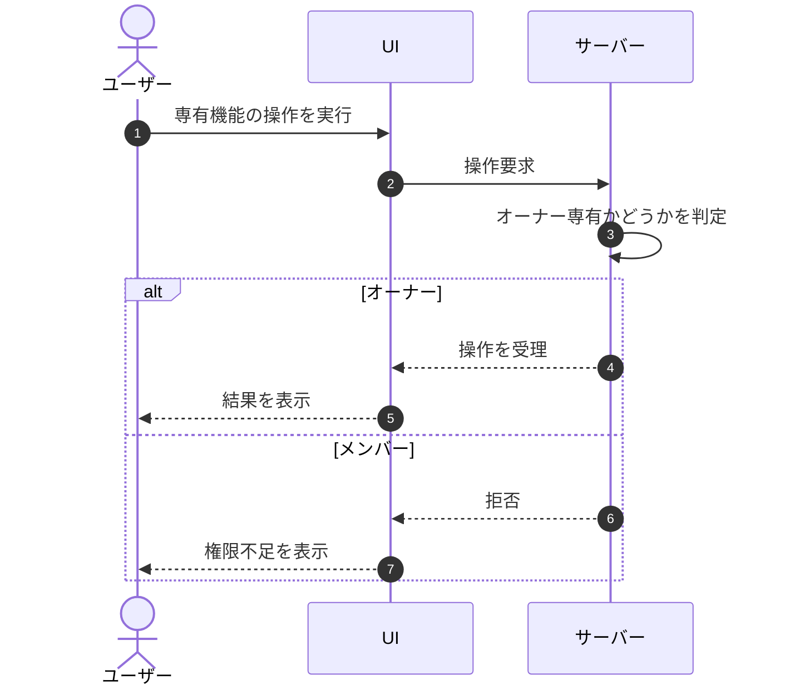
```mermaid
sequenceDiagram
  autonumber
  actor U as ユーザー
  participant UI as UI
  participant S as サーバー
  U->>UI: 専有機能の操作を実行
  UI->>S: 操作要求
  S->>S: オーナー専有かどうかを判定
  alt オーナー
    S-->>UI: 操作を受理
    UI-->>U: 結果を表示
  else メンバー
    S-->>UI: 拒否
    UI-->>U: 権限不足を表示
  end
```

## FR-016: メンバーのデータアクセス範囲

> **この機能要件は「メンバーのデータアクセス範囲」を定義します。**

*種別 機能要件 ・ 機能グループ ユーザー管理(オーナー + メンバー) ・ 優先度 P0 ・ ステータス ドラフト*

### 要件

メンバーは割り当てられたプロジェクトに属するデータ(FAQ・要対応の質問・質問ログ等)のみにアクセスできること。プロジェクトから外す操作を行ったメンバーが他に有効なプロジェクト割当を持たない場合は、そのアカウントを利用できない状態にする。オーナーは自分が作成したプロジェクトを割当の有無に関わらず閲覧・操作でき、他者が作成したプロジェクトには招待されてメンバーとなった範囲でのみアクセスできる

### シーケンス

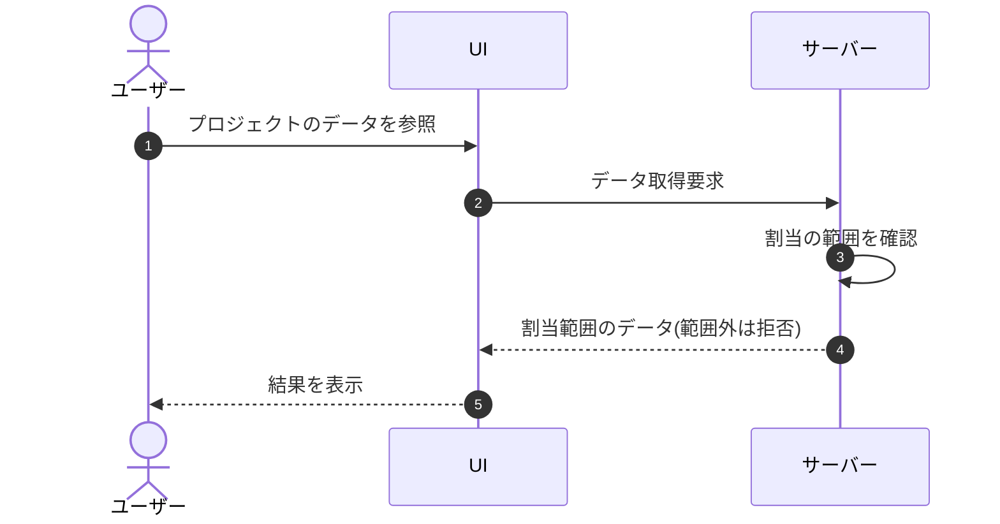
```mermaid
sequenceDiagram
  autonumber
  actor U as ユーザー
  participant UI as UI
  participant S as サーバー
  U->>UI: プロジェクトのデータを参照
  UI->>S: データ取得要求
  S->>S: 割当の範囲を確認
  S-->>UI: 割当範囲のデータ(範囲外は拒否)
  UI-->>U: 結果を表示
```

## FR-017: プロジェクト作成時のオーナー全権

> **この機能要件は「プロジェクト作成時のオーナー全権」を定義します。**

*種別 機能要件 ・ 機能グループ ユーザー管理(オーナー + メンバー) ・ 優先度 P0 ・ ステータス ドラフト*

### 要件

プロジェクト作成時、オーナーは作成したプロジェクトに対して全権を持つこと。オーナーへ管理者割当を別途付与する処理は行わない(認可権威はオーナー権限)。プロジェクト作成時に「管理者を指定」する操作は設けない。加えて、作成者であるオーナーを当該プロジェクトのメンバーとして自動追加する(一覧表示・担当割当・通知宛先の網羅用)。他者を加える場合は、当該プロジェクトのメンバー管理からメンバーとして招待する

### シーケンス

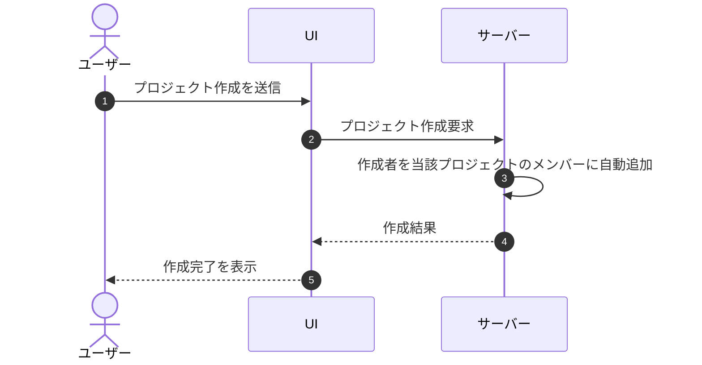
```mermaid
sequenceDiagram
  autonumber
  actor U as ユーザー
  participant UI as UI
  participant S as サーバー
  U->>UI: プロジェクト作成を送信
  UI->>S: プロジェクト作成要求
  S->>S: 作成者を当該プロジェクトのメンバーに自動追加
  S-->>UI: 作成結果
  UI-->>U: 作成完了を表示
```

## FR-018: 招待リンクからのアカウント有効化

> **この機能要件は「招待リンクからのアカウント有効化」を定義します。**

*種別 機能要件 ・ 機能グループ ユーザー管理(オーナー + メンバー) ・ 優先度 P0 ・ ステータス ドラフト*

### 要件

招待されたメンバーは招待リンクから有効化ページに進み、本人による氏名(表示名)入力・初回パスワード設定・利用規約およびプライバシーポリシーへの同意を行ってアカウントを有効化できること。招待リンクの有効期限は **7 日**。期限切れの場合はオーナーまたは当該プロジェクトのメンバーが再送信する

### シーケンス

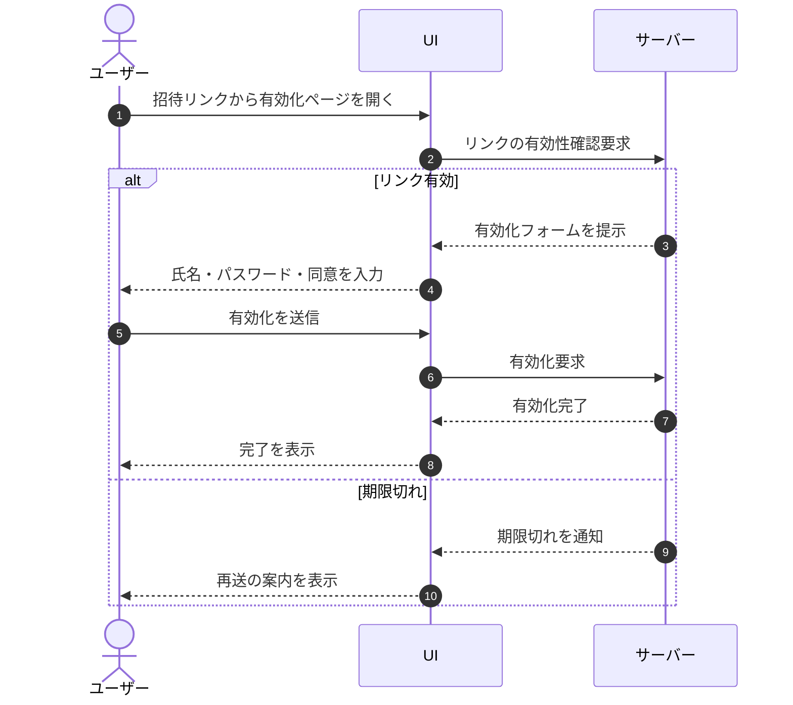
```mermaid
sequenceDiagram
  autonumber
  actor U as ユーザー
  participant UI as UI
  participant S as サーバー
  U->>UI: 招待リンクから有効化ページを開く
  UI->>S: リンクの有効性確認要求
  alt リンク有効
    S-->>UI: 有効化フォームを提示
    UI-->>U: 氏名・パスワード・同意を入力
    U->>UI: 有効化を送信
    UI->>S: 有効化要求
    S-->>UI: 有効化完了
    UI-->>U: 完了を表示
  else 期限切れ
    S-->>UI: 期限切れを通知
    UI-->>U: 再送の案内を表示
  end
```

## FR-019: 有効化完了時のプロジェクト割当の有効化

> **この機能要件は「有効化完了時のプロジェクト割当の有効化」を定義します。**

*種別 機能要件 ・ 機能グループ ユーザー管理(オーナー + メンバー) ・ 優先度 P0 ・ ステータス ドラフト*

### 要件

招待時に指定されたプロジェクト割当は、招待対象者が有効化(氏名入力・パスワード設定・規約同意)を完了した時点で有効になること

### シーケンス

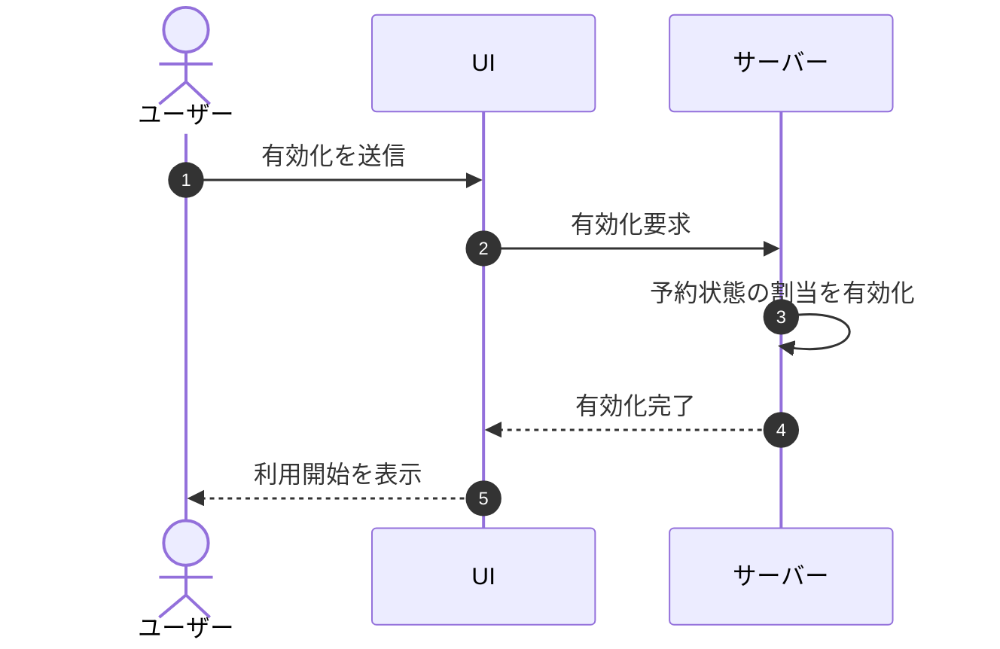
```mermaid
sequenceDiagram
  autonumber
  actor U as ユーザー
  participant UI as UI
  participant S as サーバー
  U->>UI: 有効化を送信
  UI->>S: 有効化要求
  S->>S: 予約状態の割当を有効化
  S-->>UI: 有効化完了
  UI-->>U: 利用開始を表示
```

## FR-020: 招待リンクの再送信と旧リンク失効

> **この機能要件は「招待リンクの再送信と旧リンク失効」を定義します。**

*種別 機能要件 ・ 機能グループ ユーザー管理(オーナー + メンバー) ・ 優先度 P0 ・ ステータス ドラフト*

### 要件

招待リンクの再送信は、オーナーまたは当該プロジェクトのメンバーのみが行えること。再送信時は旧リンクを失効させ新リンクを発行する。招待中のメンバーを取りやめたい場合は、招待取消ではなくメンバー削除([FR-029](#FR-029))で対応する

### シーケンス

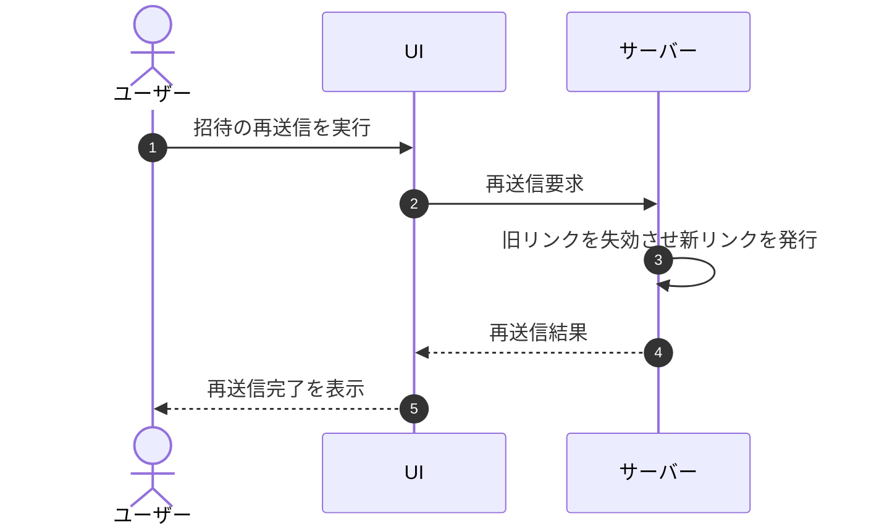
```mermaid
sequenceDiagram
  autonumber
  actor U as ユーザー
  participant UI as UI
  participant S as サーバー
  U->>UI: 招待の再送信を実行
  UI->>S: 再送信要求
  S->>S: 旧リンクを失効させ新リンクを発行
  S-->>UI: 再送信結果
  UI-->>U: 再送信完了を表示
```

## FR-021: 有効化前の割当予約とログイン不可

> **この機能要件は「有効化前の割当予約とログイン不可」を定義します。**

*種別 機能要件 ・ 機能グループ ユーザー管理(オーナー + メンバー) ・ 優先度 P0 ・ ステータス ドラフト*

### 要件

有効化前のメンバーは、招待時に指定されたプロジェクト割当を予約状態として保持するが、ログインおよび利用はできないこと(有効化完了時に初めて利用可能となる)

### シーケンス

```mermaid
sequenceDiagram
  autonumber
  actor U as ユーザー
  participant UI as UI
  participant S as サーバー
  U->>UI: 有効化前にログインを試行
  UI->>S: ログイン要求
  S-->>UI: 未有効化のため拒否
  UI-->>U: 有効化が必要な旨を表示
```

## FR-022: 有効化ページでの入力項目と同意

> **この機能要件は「有効化ページでの入力項目と同意」を定義します。**

*種別 機能要件 ・ 機能グループ ユーザー管理(オーナー + メンバー) ・ 優先度 P0 ・ ステータス ドラフト*

### 要件

招待されたメンバーは、有効化ページで次を入力して有効化を完了する。利用規約とプライバシーポリシーは個別の文書として版管理され、双方の最新版への同意が有効化の必須条件となる。氏名は本人のみが入力でき、招待元の利用者は事前に入力できない(個人情報保護の原則)。氏名は本人が個人設定で後から変更できる
1. 氏名(表示名)
2. 初回パスワード
3. 利用規約への同意
4. プライバシーポリシーへの同意

### シーケンス

```mermaid
sequenceDiagram
  autonumber
  actor U as ユーザー
  participant UI as UI
  participant S as サーバー
  U->>UI: 氏名・初回パスワード・同意を入力して送信
  UI->>S: 有効化要求
  alt 入力・同意が揃う
    S-->>UI: 有効化完了
    UI-->>U: 完了を表示
  else 不足あり
    S-->>UI: 検証エラー
    UI-->>U: 修正を促す
  end
```

## FR-023: 有効化完了時の記録と割当の一括処理

> **この機能要件は「有効化完了時の記録と割当の一括処理」を定義します。**

*種別 機能要件 ・ 機能グループ ユーザー管理(オーナー + メンバー) ・ 優先度 P0 ・ ステータス ドラフト*

### 要件

有効化の完了時には、本人が入力した氏名・初回パスワード・規約同意(利用規約とプライバシーポリシーでそれぞれ 1 件、計 2 件)の記録と、招待時に指定されたプロジェクト割当の有効化が、まとめて確実に行われること。どのプロジェクトへの招待であったかは招待リンクに紐づけて管理する

### シーケンス

```mermaid
sequenceDiagram
  autonumber
  actor U as ユーザー
  participant UI as UI
  participant S as サーバー
  U->>UI: 有効化を送信
  UI->>S: 有効化要求
  S->>S: 氏名・パスワード・同意・割当をまとめて記録
  S-->>UI: 一括処理の結果
  UI-->>U: 完了を表示
```

## FR-024: メンバー一覧・詳細の参照

> **この機能要件は「メンバー一覧・詳細の参照」を定義します。**

*種別 機能要件 ・ 機能グループ ユーザー管理(オーナー + メンバー) ・ 優先度 P0 ・ ステータス ドラフト*

### 要件

アカウント利用者は、現在開いているプロジェクトに割り当てられたメンバーの一覧と詳細を参照できること。詳細には種別(オーナー / メンバー)、状態(利用中 / 招待中)を含める。最終ログイン日時は表示しない。招待期限と再送の導線はメンバー招待・編集の操作に集約する。プロジェクトをまたいだメンバー一覧は提供しない

### シーケンス

```mermaid
sequenceDiagram
  autonumber
  actor U as ユーザー
  participant UI as UI
  participant S as サーバー
  U->>UI: メンバー一覧を開く
  UI->>S: メンバー一覧取得要求
  S-->>UI: 当該プロジェクトのメンバー一覧・詳細
  UI-->>U: 一覧を表示
```

## FR-025: メンバーのメールアドレス更新

> **この機能要件は「メンバーのメールアドレス更新」を定義します。**

*種別 機能要件 ・ 機能グループ ユーザー管理(オーナー + メンバー) ・ 優先度 P0 ・ ステータス ドラフト*

### 要件

オーナーおよび当該プロジェクトのメンバーは、自分(オーナー)に紐づくメンバーの **メールアドレスのみ** を更新できること(氏名の更新は不可)。
1. 氏名(表示名)は本人のみが有効化ページおよび個人設定で変更できる(個人情報保護の原則により、他人の氏名は編集できない)。編集時、氏名は閲覧のみとし、未入力時は「未設定」と表示する
2. オーナー自身の氏名・メールの更新はオーナー本人のみが行える
3. 当該プロジェクトのメンバーが更新できる対象は、当該プロジェクトに割当のあるメンバーに限る
4. 個人ごとの通知受信オプトアウト(重要度別の受信切替)は MVP では提供しない。プロジェクト関連通知は常時オンとし、当該プロジェクトの全メンバー(オーナーを含む)へ即時配信する(画面上の受信設定は設けない)

### シーケンス

```mermaid
sequenceDiagram
  autonumber
  actor U as ユーザー
  participant UI as UI
  participant S as サーバー
  U->>UI: メンバーのメールアドレスを更新して送信
  UI->>S: メール更新要求
  alt 更新可能な範囲
    S-->>UI: 更新完了
    UI-->>U: 完了を表示
  else 範囲外・氏名編集
    S-->>UI: 拒否
    UI-->>U: 更新不可を表示
  end
```

## FR-026: メンバーのプロジェクト割当解除

> **この機能要件は「メンバーのプロジェクト割当解除」を定義します。**

*種別 機能要件 ・ 機能グループ ユーザー管理(オーナー + メンバー) ・ 優先度 P0 ・ ステータス ドラフト*

### 要件

当該プロジェクトのメンバー(オーナーを含む)は、当該プロジェクトのメンバー 1 人の割当について、「プロジェクトから外す」操作を行えること。他プロジェクトの割当には影響しない。自分自身の割当解除はできない。他メンバーを外す操作には、誤操作を防ぐ確認を必須とする

### シーケンス

```mermaid
sequenceDiagram
  autonumber
  actor U as ユーザー
  participant UI as UI
  participant S as サーバー
  U->>UI: メンバーをプロジェクトから外す
  UI-->>U: 確認を求める
  U->>UI: 確認して実行
  UI->>S: 割当解除要求
  S-->>UI: 解除完了
  UI-->>U: 完了を表示
```

## FR-027: 割当変更の監査記録と通知

> **この機能要件は「割当変更の監査記録と通知」を定義します。**

*種別 機能要件 ・ 機能グループ ユーザー管理(オーナー + メンバー) ・ 優先度 P0 ・ ステータス ドラフト*

### 要件

割当の追加・解除時には、変更前後のプロジェクト割当の差分を記録(監査)し、当該メンバーへお知らせとメールで通知できること

### シーケンス

```mermaid
sequenceDiagram
  autonumber
  actor U as ユーザー
  participant UI as UI
  participant S as サーバー
  U->>UI: 割当の追加・解除を実行
  UI->>S: 割当変更要求
  S->>S: 変更差分を記録し当該メンバーへ通知
  S-->>UI: 変更完了
  UI-->>U: 完了を表示
```

## FR-028: 別プロジェクトへの追加割当

> **この機能要件は「別プロジェクトへの追加割当」を定義します。**

*種別 機能要件 ・ 機能グループ ユーザー管理(オーナー + メンバー) ・ 優先度 P0 ・ ステータス ドラフト*

### 要件

オーナーは、メンバーを別プロジェクトへ追加で割り当てる場合、当該プロジェクトに切り替えて招待する。メンバーは他プロジェクトへの割当はできず、自分が割り当てられたプロジェクトの範囲でのみ招待・編集・削除を行える(範囲内の制約は FR-016 を正とする)

### シーケンス

```mermaid
sequenceDiagram
  autonumber
  actor U as ユーザー
  participant UI as UI
  participant S as サーバー
  U->>UI: 対象プロジェクトに切り替えて招待
  UI->>S: 追加割当の招待要求
  S-->>UI: 招待結果
  UI-->>U: 結果を表示
```

## FR-029: メンバーの利用終了は「プロジェクトから外す」操作に統合

> **この機能要件は「メンバーの利用終了は「プロジェクトから外す」操作に統合」を定義します。**

*種別 機能要件 ・ 機能グループ ユーザー管理(オーナー + メンバー) ・ 優先度 P0 ・ ステータス ドラフト*

### 要件

メンバーの利用終了は「プロジェクトから外す」操作に統合すること。対象が他プロジェクトに有効な割当を持たない場合、当該プロジェクトの割当解除に加えてアカウントを利用できない状態にし、ログインセッションと未使用の招待を無効化する。オーナー自身は対象外とし、プロジェクトをまたいだメンバー削除の画面・機能は提供しない

### シーケンス

```mermaid
sequenceDiagram
  autonumber
  actor U as ユーザー
  participant UI as UI
  participant S as サーバー
  U->>UI: メンバーをプロジェクトから外す
  UI->>S: 割当解除要求
  S->>S: 他に有効な割当がなければ利用停止しセッション・招待を無効化
  S-->>UI: 処理結果
  UI-->>U: 結果を表示
```

## FR-030: 「プロジェクトから外す」操作は当該プロジェクトの割当のみを解除する

> **この機能要件は「「プロジェクトから外す」操作は当該プロジェクトの割当のみを解除する」を定義します。**

*種別 機能要件 ・ 機能グループ ユーザー管理(オーナー + メンバー) ・ 優先度 P0 ・ ステータス ドラフト*

### 要件

「プロジェクトから外す」操作は当該プロジェクトの割当のみを解除する。対象が他プロジェクトに有効な割当を持つ場合は、利用者アカウントと他の割当を維持し、次回以降の利用可否判定に反映する。他に有効な割当がない場合は、アカウントが利用できなくなる旨を確認時に明示する

### シーケンス

```mermaid
sequenceDiagram
  autonumber
  actor U as ユーザー
  participant UI as UI
  participant S as サーバー
  U->>UI: プロジェクトから外す操作を実行
  UI-->>U: 影響(利用可否)を確認時に明示
  U->>UI: 確認して実行
  UI->>S: 当該割当の解除要求
  S-->>UI: 解除完了
  UI-->>U: 結果を表示
```

## FR-031: 最終割当解除時の無効化とデータ消去予告

> **この機能要件は「最終割当解除時の無効化とデータ消去予告」を定義します。**

*種別 機能要件 ・ 機能グループ ユーザー管理(オーナー + メンバー) ・ 優先度 P0 ・ ステータス ドラフト*

### 要件

最後の有効なプロジェクト割当を解除した場合は、全ログインセッションの無効化、未使用招待の無効化、および一定期間(90 日)経過後にデータが完全に消去される予定であることを確認時に明示する。利用停止後に同じメールアドレスで再招待された場合は、過去の削除済みデータとは別の新しい利用者として扱う

### シーケンス

```mermaid
sequenceDiagram
  autonumber
  actor U as ユーザー
  participant UI as UI
  participant S as サーバー
  U->>UI: 最後の割当を解除する操作を実行
  UI-->>U: 全セッション無効化とデータ消去予定を明示
  U->>UI: 確認して実行
  UI->>S: 割当解除要求
  S->>S: 全セッションと未使用招待を無効化
  S-->>UI: 処理結果
  UI-->>U: 結果を表示
```

## FR-032: 招待リンクには有効期限を設ける

> **この機能要件は「招待リンクには有効期限を設ける」を定義します。**

*種別 機能要件 ・ 機能グループ ユーザー管理(オーナー + メンバー) ・ 優先度 P0 ・ ステータス ドラフト*

### 要件

招待リンクには有効期限を設けること。**有効期限: 7 日**。期限切れ後は招待の再送信で新リンクが発行される

### シーケンス

```mermaid
sequenceDiagram
  autonumber
  actor U as ユーザー
  participant UI as UI
  participant S as サーバー
  U->>UI: 招待リンクを開く
  UI->>S: リンクの有効性確認要求
  alt 有効期限内
    S-->>UI: 有効化フォームを提示
    UI-->>U: 有効化を続行
  else 期限切れ
    S-->>UI: 期限切れを通知
    UI-->>U: 再送の案内を表示
  end
```

## FR-033: メンバー数の急増検知とアラート通知

> **この機能要件は「メンバー数の急増検知とアラート通知」を定義します。**

*種別 機能要件 ・ 機能グループ ユーザー管理(オーナー + メンバー) ・ 優先度 P0 ・ ステータス ドラフト*

### 要件

メンバー数に固定の上限を設けず、利用量のしきい値に基づいて上限への接近や急増を検知し、アカウント利用者(オーナー / メンバー)へアラート通知できること

### シーケンス

```mermaid
sequenceDiagram
  autonumber
  actor U as ユーザー
  participant UI as UI
  participant S as サーバー
  Note over S: 利用量の監視を契機に起動
  S->>S: しきい値接近・急増を検知
  S-->>UI: アラートを配信
  UI-->>U: アラートを表示
```

## FR-034: メンバー数アラートの通知先

> **この機能要件は「メンバー数アラートの通知先」を定義します。**

*種別 機能要件 ・ 機能グループ ユーザー管理(オーナー + メンバー) ・ 優先度 P1 ・ ステータス ドラフト*

### 要件

メンバー数のしきい値接近・超過時のアラート通知先は、当該プロジェクトのオーナーおよび当該プロジェクトに割り当てられた全メンバーとすること(最も重要度の高い通知の宛先と一致する)

### シーケンス

```mermaid
sequenceDiagram
  autonumber
  actor U as ユーザー
  participant UI as UI
  participant S as サーバー
  Note over S: しきい値接近・超過の検知を契機に起動
  S->>S: 通知先(オーナーと全メンバー)を決定
  S-->>UI: アラートを配信
  UI-->>U: アラートを表示
```

## FR-035: オーナー単独でのプロジェクト運営継続

> **この機能要件は「オーナー単独でのプロジェクト運営継続」を定義します。**

*種別 機能要件 ・ 機能グループ ユーザー管理(オーナー + メンバー) ・ 優先度 P0 ・ ステータス ドラフト*

### 要件

自分が作成したプロジェクトにメンバーが 1 人も登録されていない状態でも、オーナーが単独でプロジェクト運営を継続できること(オーナーは当該プロジェクトの全機能を保持する)

### シーケンス

```mermaid
sequenceDiagram
  autonumber
  actor U as ユーザー
  participant UI as UI
  participant S as サーバー
  U->>UI: メンバー不在のまま操作を実行
  UI->>S: 操作要求
  S->>S: オーナーとして当該プロジェクトの全機能を許可
  S-->>UI: 操作を受理
  UI-->>U: 結果を表示
```

## FR-036: 同一メールでの重複招待の禁止

> **この機能要件は「同一メールでの重複招待の禁止」を定義します。**

*種別 機能要件 ・ 機能グループ ユーザー管理(オーナー + メンバー) ・ 優先度 P0 ・ ステータス ドラフト*

### 要件

同一プロジェクトに、既に割当のある(有効・招待中の)ユーザーと同一メールアドレスで重複して招待できないこと。メールアドレスは 1 アカウントに一意とする

### シーケンス

```mermaid
sequenceDiagram
  autonumber
  actor U as ユーザー
  participant UI as UI
  participant S as サーバー
  U->>UI: メールアドレスを指定して招待
  UI->>S: 招待要求
  alt 重複なし
    S-->>UI: 招待を送信
    UI-->>U: 招待完了を表示
  else 重複あり
    S-->>UI: 重複を理由に拒否
    UI-->>U: エラーを表示
  end
```

## FR-037: オーナーはプロジェクトを作成・編集・削除

> **この機能要件は「オーナーはプロジェクトを作成・編集・削除」を定義します。**

*種別 機能要件 ・ 機能グループ プロジェクト管理 ・ 優先度 P0 ・ ステータス ドラフト*

### 要件

オーナーはプロジェクトを作成・編集・削除できること。削除は、プロジェクト名の入力確認と本人確認(再認証)を必須とする重要操作として扱う

### シーケンス

```mermaid
sequenceDiagram
  autonumber
  actor U as ユーザー
  participant UI as UI
  participant S as サーバー
  U->>UI: プロジェクトの作成・編集・削除を実行
  UI->>S: 操作要求
  alt 削除で確認・再認証が必要
    S-->>UI: 名称入力と再認証を要求
    UI-->>U: 確認を求める
    U->>UI: 確認して送信
    UI->>S: 確認付きで実行要求
    S-->>UI: 処理結果
    UI-->>U: 結果を表示
  else 作成・編集
    S-->>UI: 処理結果
    UI-->>U: 結果を表示
  end
```

## FR-038: 作成時のオーナー全権とメンバー自動追加

> **この機能要件は「作成時のオーナー全権とメンバー自動追加」を定義します。**

*種別 機能要件 ・ 機能グループ プロジェクト管理 ・ 優先度 P0 ・ ステータス ドラフト*

### 要件

プロジェクト作成時には、作成者であるオーナー自身が当該プロジェクトに対して全権を持つこと。オーナーへ管理者割当を別途付与する処理は行わない(オーナーは作成者として当該プロジェクトに全権を持つ。認可権威はオーナー権限(当該プロジェクトの作成者であること))。
1. プロジェクト作成時に管理者を別途指定する操作は設けない
2. 作成者であるオーナーを当該プロジェクトのメンバーとして自動追加する(一覧表示・担当割当・通知宛先の網羅用で、専有判定には用いない)
3. 他者を加える操作は、当該プロジェクトのメンバー管理からメンバーとして招待する

### シーケンス

```mermaid
sequenceDiagram
  autonumber
  actor U as ユーザー
  participant UI as UI
  participant S as サーバー
  U->>UI: プロジェクト作成を送信
  UI->>S: プロジェクト作成要求
  S->>S: オーナーに全権を付与しメンバーへ自動追加
  S-->>UI: 作成結果
  UI-->>U: 作成完了を表示
```

## FR-039: プロジェクト削除時の割当・データ取扱い

> **この機能要件は「プロジェクト削除時の割当・データ取扱い」を定義します。**

*種別 機能要件 ・ 機能グループ プロジェクト管理 ・ 優先度 P0 ・ ステータス ドラフト*

### 要件

プロジェクト削除時のメンバー割当と関連データの取扱いを次のとおり定めること。
1. 当該プロジェクトのメンバー割当を解除する
2. 割当解除の結果、他に有効なプロジェクト割当を持たないメンバー(オーナーを除く)は、アカウントを利用できない状態にする
3. 他プロジェクトに有効な割当を持つメンバーのアカウントは維持し、当該プロジェクトの割当のみを解除する
4. オーナーのアカウントは本処理の対象外とする
5. 利用停止・解除されたデータは一定期間(90 日)経過後に完全に消去する

### シーケンス

```mermaid
sequenceDiagram
  autonumber
  actor U as ユーザー
  participant UI as UI
  participant S as サーバー
  U->>UI: プロジェクト削除を確認して実行
  UI->>S: プロジェクト削除要求
  S->>S: 割当解除と利用可否を判定し処理
  S-->>UI: 削除結果
  UI-->>U: 結果を表示
```

## FR-040: プロジェクト単位のウィジェット設定管理

> **この機能要件は「プロジェクト単位のウィジェット設定管理」を定義します。**

*種別 機能要件 ・ 機能グループ プロジェクト管理 ・ 優先度 P0 ・ ステータス ドラフト*

### 要件

プロジェクトごとにウィジェット設定(公開キー・埋め込みコード・見た目・プレビュー)を管理できること。
1. 公開キーはプロジェクト単位で発行・ローテーションし、アカウント共通ではない
2. 公開キーの再発行は当該プロジェクトのメンバー(オーナーを含む)に許可し、本人確認(再認証)と「既存の埋め込みコードが直ちに無効化される」旨の確認を必須とする
3. 埋め込みコードのコピーは当該プロジェクトのメンバーが行える
4. ウィジェット設定はプロジェクト単位の作業領域に配置する

### シーケンス

```mermaid
sequenceDiagram
  autonumber
  actor U as ユーザー
  participant UI as UI
  participant S as サーバー
  U->>UI: 公開キーの再発行を実行
  UI-->>U: 再認証と無効化の確認を求める
  U->>UI: 確認して送信
  UI->>S: 再発行要求
  S-->>UI: 新しい公開キーと埋め込みコード
  UI-->>U: 結果を表示
```

## FR-041: プロジェクトごとに FAQ、質問ログ、未解決質問を分けて管理

> **この機能要件は「プロジェクトごとに FAQ、質問ログ、未解決質問を分けて管理」を定義します。**

*種別 機能要件 ・ 機能グループ プロジェクト管理 ・ 優先度 P0 ・ ステータス ドラフト*

### 要件

プロジェクトごとに FAQ、質問ログ、未解決質問を分けて管理できること

### シーケンス

```mermaid
sequenceDiagram
  autonumber
  actor U as ユーザー
  participant UI as UI
  participant S as サーバー
  U->>UI: プロジェクトを選んでデータを管理
  UI->>S: 当該プロジェクトのデータ要求
  S-->>UI: プロジェクト単位のデータ
  UI-->>U: 結果を表示
```

## FR-042: 許可する Web サイトのドメインを複数設定

> **この機能要件は「許可する Web サイトのドメインを複数設定」を定義します。**

*種別 機能要件 ・ 機能グループ プロジェクト管理 ・ 優先度 P0 ・ ステータス ドラフト*

### 要件

許可する Web サイトのドメインを複数設定できること

### シーケンス

```mermaid
sequenceDiagram
  autonumber
  actor U as ユーザー
  participant UI as UI
  participant S as サーバー
  U->>UI: 許可ドメインを入力して保存
  UI->>S: ドメイン設定要求
  S-->>UI: 保存結果
  UI-->>U: 結果を表示
```

## FR-043: プロジェクト連絡先メールの設定と確認

> **この機能要件は「プロジェクト連絡先メールの設定と確認」を定義します。**

*種別 機能要件 ・ 機能グループ プロジェクト管理 ・ 優先度 P0 ・ ステータス ドラフト*

### 要件

プロジェクトごとに連絡先メールアドレスを 1 件設定でき、確認メール(有効期限 24 時間)による本人確認を経て有効化できること。
1. 確認完了前のアドレスはウィジェット表示に用いない
2. ウィジェット利用者向けメールは常に共通ドメインの no-reply 送信で固定し、本アドレスは返信先には用いない

### シーケンス

```mermaid
sequenceDiagram
  autonumber
  actor U as ユーザー
  participant UI as UI
  participant S as サーバー
  U->>UI: 連絡先メールを入力して保存
  UI->>S: 確認メール送信要求
  S-->>UI: 確認メールを送信
  UI-->>U: 確認待ちを表示
  U->>UI: 確認リンクを開く
  UI->>S: 確認要求
  S-->>UI: 有効化完了
  UI-->>U: 有効化を表示
```

## FR-044: ウィジェットでの連絡先メール表示

> **この機能要件は「ウィジェットでの連絡先メール表示」を定義します。**

*種別 機能要件 ・ 機能グループ プロジェクト管理 ・ 優先度 P0 ・ ステータス ドラフト*

### 要件

公開ウィジェットにおいて、確認完了済みのプロジェクト連絡先メールを未解決時・質問受付制限時のお問い合わせ先として表示できること。未設定または未確認の場合はメールアドレスを表示しないこと

### シーケンス

```mermaid
sequenceDiagram
  autonumber
  actor U as ユーザー
  participant UI as UI
  participant S as サーバー
  U->>UI: 未解決時の問い合わせ先を表示要求
  UI->>S: 連絡先の表示可否を確認要求
  alt 確認済み
    S-->>UI: 連絡先メールを返す
    UI-->>U: 問い合わせ先を表示
  else 未設定・未確認
    S-->>UI: 非表示を指示
    UI-->>U: 連絡先を表示しない
  end
```

## FR-045: 削除時の関連データ取扱いの確認・選択

> **この機能要件は「削除時の関連データ取扱いの確認・選択」を定義します。**

*種別 機能要件 ・ 機能グループ プロジェクト管理 ・ 優先度 P0 ・ ステータス ドラフト*

### 要件

プロジェクト削除時の関連データ(FAQ、質問ログ、未解決質問)の取扱いをアカウント利用者が確認・選択できること

### シーケンス

```mermaid
sequenceDiagram
  autonumber
  actor U as ユーザー
  participant UI as UI
  participant S as サーバー
  U->>UI: プロジェクト削除を開始
  UI-->>U: 関連データの取扱いを選択肢で提示
  U->>UI: 取扱いを選択して実行
  UI->>S: 削除要求(取扱い指定)
  S-->>UI: 処理結果
  UI-->>U: 結果を表示
```

## FR-046: プロジェクト数の急増検知と通知

> **この機能要件は「プロジェクト数の急増検知と通知」を定義します。**

*種別 機能要件 ・ 機能グループ プロジェクト管理 ・ 優先度 P1 ・ ステータス ドラフト*

### 要件

プロジェクト数に固定の上限を設けず、利用状況を監視し急激な増加を検知してオーナーへ通知できること

### シーケンス

```mermaid
sequenceDiagram
  autonumber
  actor U as ユーザー
  participant UI as UI
  participant S as サーバー
  Note over S: 利用状況の監視を契機に起動
  S->>S: プロジェクト数の急増を検知
  S-->>UI: オーナーへ通知を配信
  UI-->>U: 通知を表示
```

## FR-179: 複数デバイス同時ログインと一括失効

> **この機能要件は「複数デバイス同時ログインと一括失効」を定義します。**

*種別 機能要件 ・ 機能グループ アクセス制御細部 ・ 優先度 P0 ・ ステータス ドラフト*

### 要件

同一アカウントの複数デバイス同時ログインを可能とすること。アカウント停止などの契機で全セッションの強制ログアウトを実行できる

### シーケンス

```mermaid
sequenceDiagram
  autonumber
  actor U as ユーザー
  participant UI as UI
  participant S as サーバー
  Note over S: アカウント停止などの契機で起動
  S->>S: 同一アカウントの全セッションを無効化
  U->>UI: いずれかのデバイスで操作
  UI->>S: 操作要求
  S-->>UI: 失効を通知
  UI-->>U: 再ログインを誘導
```

## FR-180: オーナーに対する操作の禁止

> **この機能要件は「オーナーに対する操作の禁止」を定義します。**

*種別 機能要件 ・ 機能グループ アクセス制御細部 ・ 優先度 P0 ・ ステータス ドラフト*

### 要件

オーナーに対する次の操作を不可とすること。1 プロジェクト = 1 オーナー(作成者)のため、プロジェクトのオーナー不在(孤立)状態は構造的に発生しない。緊急時はサポート窓口経由の対応とする
1. 退会
2. 停止
3. 削除
4. 降格
5. 譲渡

### シーケンス

```mermaid
sequenceDiagram
  autonumber
  actor U as ユーザー
  participant UI as UI
  participant S as サーバー
  U->>UI: オーナーへの退会・停止・削除等を試行
  UI->>S: 操作要求
  S-->>UI: オーナー対象のため拒否
  UI-->>U: 実行不可を表示
```

## FR-181: 自分自身への操作の禁止

> **この機能要件は「自分自身への操作の禁止」を定義します。**

*種別 機能要件 ・ 機能グループ アクセス制御細部 ・ 優先度 P0 ・ ステータス ドラフト*

### 要件

アカウント利用者は自分自身への次の操作を行えないこと。
1. 自分自身の利用状態変更・削除はできない
2. 自分自身のアカウント削除は常に不可とし、オーナーが他人を経由して自身を削除する経路も設けない(他者の削除はオーナー本人の操作のみで行う)

### シーケンス

```mermaid
sequenceDiagram
  autonumber
  actor U as ユーザー
  participant UI as UI
  participant S as サーバー
  U->>UI: 自分自身への状態変更・削除を試行
  UI->>S: 操作要求
  S-->>UI: 自己操作のため拒否
  UI-->>U: 実行不可を表示
```

## FR-182: メールアドレスのアカウント一意制約

> **この機能要件は「メールアドレスのアカウント一意制約」を定義します。**

*種別 機能要件 ・ 機能グループ アクセス制御細部 ・ 優先度 P1 ・ ステータス ドラフト*

### 要件

メールアドレスは 1 アカウントに一意とすること。1 つのメールアドレスにつき 1 つのアカウントのみを許す。同一ユーザーが複数のプロジェクトに異なる立場(オーナー / メンバー)で所属することは、この一意なアカウントを通じて表す

### シーケンス

```mermaid
sequenceDiagram
  autonumber
  actor U as ユーザー
  participant UI as UI
  participant S as サーバー
  U->>UI: メールアドレスを指定してアカウントを新規作成
  UI->>S: アカウント新規作成要求
  alt メールアドレスが一意
    S-->>UI: 受理(アカウントを作成)
    UI-->>U: 結果を表示
  else 既存と重複
    S-->>UI: 拒否
    UI-->>U: エラーを表示
  end
```

## FR-183: プロジェクト単位の割当選択

> **この機能要件は「プロジェクト単位の割当選択」を定義します。**

*種別 機能要件 ・ 機能グループ アクセス制御細部 ・ 優先度 P0 ・ ステータス ドラフト*

### 要件

プロジェクトごとのメンバー割当を「割当しない / メンバー」から選んで行うこと。プロジェクト内に役割差は持たず、アカウント横断のプリセット役割も持たない

### シーケンス

```mermaid
sequenceDiagram
  autonumber
  actor U as ユーザー
  participant UI as UI
  participant S as サーバー
  U->>UI: プロジェクトごとの割当を選んで送信
  UI->>S: 割当設定要求
  S-->>UI: 設定結果
  UI-->>U: 結果を表示
```

## FR-184: ダッシュボード閲覧と画面別アクセス制御

> **この機能要件は「ダッシュボード閲覧と画面別アクセス制御」を定義します。**

*種別 機能要件 ・ 機能グループ アクセス制御細部 ・ 優先度 P0 ・ ステータス ドラフト*

### 要件

ダッシュボード(自分の通知・お知らせ受信箱)を、オーナーおよびメンバーが閲覧できること。それ以外の画面は、それぞれのユーザー種別とプロジェクト境界の充足を要求する

### シーケンス

```mermaid
sequenceDiagram
  autonumber
  actor U as ユーザー
  participant UI as UI
  participant S as サーバー
  U->>UI: 画面を開く
  UI->>S: 画面表示要求
  alt ダッシュボードまたは境界充足
    S-->>UI: 表示を許可
    UI-->>U: 画面を表示
  else 境界不足
    S-->>UI: 拒否
    UI-->>U: アクセス不可を表示
  end
```

## FR-185: 割当変更の次回認可時反映

> **この機能要件は「割当変更の次回認可時反映」を定義します。**

*種別 機能要件 ・ 機能グループ アクセス制御細部 ・ 優先度 P1 ・ ステータス ドラフト*

### 要件

プロジェクト割当の追加・剥奪は、アクティブセッションを即時失効させず、次回の認可チェック時点で反映することで足りること。

### シーケンス

```mermaid
sequenceDiagram
  autonumber
  actor U as ユーザー
  participant UI as UI
  participant S as サーバー
  Note over S: 割当の追加・剥奪を反映(セッションは即時失効しない)
  U->>UI: 次の操作を実行
  UI->>S: 操作要求
  S->>S: 認可チェック時に最新の割当を反映
  S-->>UI: 反映後の結果
  UI-->>U: 結果を表示
```

## FR-186: 最終割当解除時のアカウント無効化

> **この機能要件は「最終割当解除時のアカウント無効化」を定義します。**

*種別 機能要件 ・ 機能グループ アクセス制御細部 ・ 優先度 P0 ・ ステータス ドラフト*

### 要件

メンバーの最後の有効なプロジェクト割当を解除した場合の挙動を定めること。
1. 対象アカウントを自動で無効化する
2. 全セッションと未使用の招待を失効する
3. 割当のないプロジェクトへの直アクセスは拒否する
4. プロジェクトをまたいだメンバー管理画面は提供しない

### シーケンス

```mermaid
sequenceDiagram
  autonumber
  actor U as ユーザー
  participant UI as UI
  participant S as サーバー
  U->>UI: 最後の有効な割当を解除する操作を実行
  UI->>S: 割当解除要求
  S->>S: 対象を無効化し全セッション・未使用招待を失効
  S-->>UI: 処理結果
  UI-->>U: 結果を表示
```

## FR-187: 現在のプロジェクトと立場の確認

> **この機能要件は「現在のプロジェクトと立場の確認」を定義します。**

*種別 機能要件 ・ 機能グループ アクセス制御細部 ・ 優先度 P0 ・ ステータス ドラフト*

### 要件

現在開いているプロジェクトと自分の立場(オーナー / メンバー)を、ヘッダーおよびアカウントメニューで確認できること。独立したロールバッジを全画面へ重複表示しない

### シーケンス

```mermaid
sequenceDiagram
  autonumber
  actor U as ユーザー
  participant UI as UI
  participant S as サーバー
  U->>UI: 現在のプロジェクトと立場を開く
  UI->>S: 現在のプロジェクトと立場を要求
  S-->>UI: プロジェクトと立場の情報
  UI-->>U: 現在のプロジェクトと立場を表示
```

## FR-188: 権限外ナビゲーション・操作の表示制御

> **この機能要件は「権限外ナビゲーション・操作の表示制御」を定義します。**

*種別 機能要件 ・ 機能グループ アクセス制御細部 ・ 優先度 P0 ・ ステータス ドラフト*

### 要件

権限外の主ナビゲーションと操作の表示を制御すること。
1. 権限外の主ナビゲーションと操作は原則として表示しない
2. 共同作業上、存在を知らせる価値がある項目は読み取り専用で表示し、必要権限と依頼先を説明する
3. 権限のない画面への直アクセスを拒否する際は、同等の説明と戻り先を提示する

### シーケンス

```mermaid
sequenceDiagram
  autonumber
  actor U as ユーザー
  participant UI as UI
  participant S as サーバー
  U->>UI: 画面・操作にアクセス
  UI->>S: 表示可否の判定要求
  alt 権限あり
    S-->>UI: 操作を許可
    UI-->>U: 操作を表示
  else 権限なし
    S-->>UI: 非表示または説明と戻り先
    UI-->>U: 説明と戻り先を表示
  end
```

## FR-193: 招待先メールの登録要否チェック

> **この機能要件は「招待先メールの登録要否チェック」を定義します。**

*種別 機能要件 ・ 機能グループ ユーザー管理(オーナー + メンバー) ・ 優先度 P0 ・ ステータス ドラフト*

### 要件

メンバー招待時、指定されたメールアドレスが登録済みアカウントに一致しない場合はエラーとし、招待を行わないこと(先にアカウント登録を促す)

### シーケンス

```mermaid
sequenceDiagram
  autonumber
  actor U as ユーザー
  participant UI as UI
  participant S as サーバー
  U->>UI: 招待先メールアドレスを入力して送信
  UI->>S: メンバー招待要求
  alt 登録済みアカウントに一致
    S-->>UI: 招待を送信
    UI-->>U: 招待完了を表示
  else 未登録
    S-->>UI: 未登録を理由に拒否
    UI-->>U: 先にアカウント登録を促す
  end
```

## FR-194: 支払方法のユーザー単位の登録・更新

> **この機能要件は「支払方法のユーザー単位の登録・更新」を定義します。**

*種別 機能要件 ・ 機能グループ アカウント管理 ・ 優先度 P0 ・ ステータス ドラフト*

### 要件

支払方法はアカウント(ユーザー)単位で 1 件登録・更新でき、本人が作成した全プロジェクトの請求に用いること。変更時は本人確認(再認証)を要する

### シーケンス

```mermaid
sequenceDiagram
  autonumber
  actor U as ユーザー
  participant UI as UI
  participant S as サーバー
  U->>UI: 支払方法の登録・更新を実行
  UI-->>U: 再認証を求める
  U->>UI: 本人確認情報を入力して送信
  UI->>S: 支払方法の登録・更新要求
  S-->>UI: 登録・更新結果
  UI-->>U: 結果を表示
```

## FR-195: My プロジェクト / Join プロジェクトの一覧

> **この機能要件は「My プロジェクト / Join プロジェクトの一覧」を定義します。**

*種別 機能要件 ・ 機能グループ アクセス制御細部 ・ 優先度 P0 ・ ステータス ドラフト*

### 要件

ダッシュボードで、自分が作成したプロジェクト(My)と、招待されて参加しているプロジェクト(Join)を区分して一覧できること

### シーケンス

```mermaid
sequenceDiagram
  autonumber
  actor U as ユーザー
  participant UI as UI
  participant S as サーバー
  U->>UI: ダッシュボードを開く
  UI->>S: 関与プロジェクトの一覧取得要求
  S-->>UI: My プロジェクトと Join プロジェクトを区分して返す
  UI-->>U: 区分して一覧を表示
```

## FR-196: オーナー宛のプロジェクト別請求の確認

> **この機能要件は「オーナー宛のプロジェクト別請求の確認」を定義します。**

*種別 機能要件 ・ 機能グループ アカウント管理 ・ 優先度 P0 ・ ステータス ドラフト*

### 要件

自分が作成した各プロジェクトの課金状況(プロジェクト別内訳)と合計を、オーナー宛にまとめて確認できること

### シーケンス

```mermaid
sequenceDiagram
  autonumber
  actor U as ユーザー
  participant UI as UI
  participant S as サーバー
  U->>UI: 請求管理を開く
  UI->>S: プロジェクト別請求の取得要求
  S-->>UI: プロジェクト別内訳と合計を返す
  UI-->>U: 内訳と合計を表示
```
